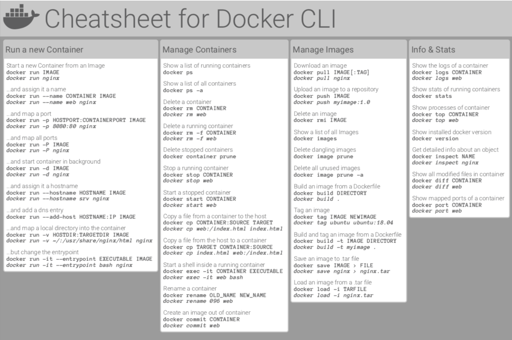
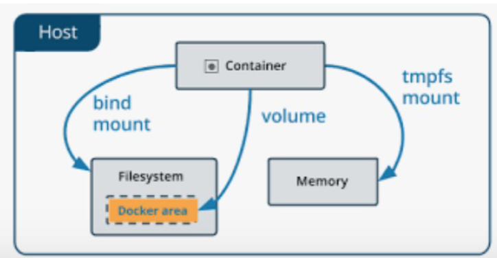
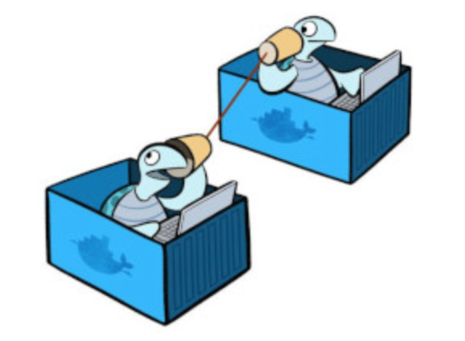
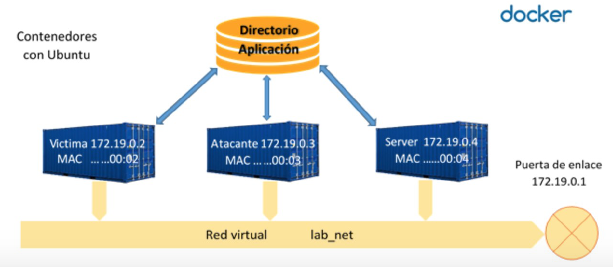
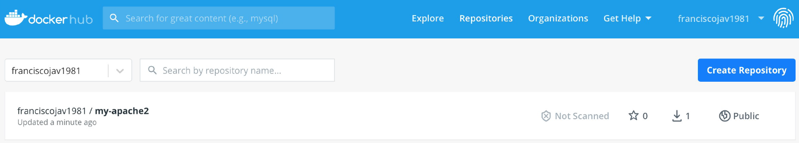

# Docker

<figure style="float: right;">
    
    <figcaption>Logo Docker.</figcaption>
</figure>

**Docker** (estibador en ingles) es un **Sistema de Virtualización de Aplicaciones mediante contenedores**, creado por *Solomon Hykes* y su equipo de ingenieros.

* En **2013** se convirtió en un proyecto de **software libre (licencia Apache)** en el que participan cada vez más empresas. 
* La **versión 1.0** se publicó en **junio de 2014** y ha tenido un desarrollo muy rápido.
* En marzo de **2017**, Docker anunció un desarrollo todavía más rápido, pasando a publicar una nueva versión cada mes. La numeración de las versiones adoptó al formato AA.MM (la primera fue **Docker 17.03**).
* En **julio de 2018**, Docker anunció que volvían a un desarrollo más pausado. A partir de **Docker 18.09** habría una versión "estable" cada seis meses.

## Conceptos Previos

### Virtualización: Hipervisor

En general, el objetivo de la virtualización es poder utilizar **simultáneamente** en un mismo ordenador dos o más sistemas operativos. Por lo tanto, para poder hablar de virtualización tienen que estar **funcionando a la vez varios sistemas operativos**.

!!! note
    * De acuerdo con esta definición, instalar dos sistemas operativos en un ordenador (**Windows y Linux**, por ejemplo) y poder elegir uno u otro mediante un arranque dual **no se considera virtualización**, puesto que mediante un arranque dual no podemos ejecutar a la vez ambos sistemas.
    * Y tampoco sería virtualización la simulación, que consiste en imitar el aspecto visual del sistema imitado. Por ejemplo, podríamos instalar un tema de escritorio en **GNOME** o **KDE** que imitara el escritorio de Windows. El problema de esta simulación sería que realmente no estaríamos utilizando Windows sino simplemente algo que parece Windows. Así que, por ejemplo, no podríamos instalar una aplicación de Windows puesto que el sistema operativo sería Linux, que no acepta instaladores de Windows.

* Los sistemas operativos son los encargados de la gestión del hardware y requieren un control completo del mismo, por lo que dos sistemas operativos no pueden en principio estar funcionando a la vez sobre el mismo hardware.
* La solución para la virtualización es la existencia de un **hipervisor** (en inglés, hypervisor).

#### Ventajas Virtualización

La virtualización tiene muchas aplicaciones interesantes:

* La más habitual es **poder ejecutar aplicaciones que no están disponibles para el sistema operativo host**, pero sí para otro sistema operativo que se instalaría como guest.
* La virtualización permite **la conservación del software**. Debido al progreso del hardware, los procesadores antiguos dejan de fabricarse y los sistemas operativos y aplicaciones antiguos dejan de desarrollarse y dejan de funcionar en el hardware moderno. Pero si el sistema operativo puede instalarse como guest, puede seguir utilizándose para siempre.
* La virtualización **permite depurar y comprobar el funcionamiento de los programas y los sistemas operativos**. Si un programa provoca un fallo de funcionamiento total, si se está ejecutando como guest, el sistema host puede recoger información sobre el motivo del fallo.
* La virtualización permite un mejor **aprovechamiento del hardware**, ya que un mismo ordenador puede contener muchos sistemas guests utilizados por usuarios diferentes, aislados unos de otros.

#### Hipervisor

El hipervisor es la pieza fundamental de la virtualización. Tradicionalmente, se distinguen dos tipos de hipervisores:

* Los hipervisores de **tipo 1**, denominados «***hipervisores bare metal***», dichos hipervisores están en contacto directo con el hardware de la máquina, sin necesidad de ningún sistema operativo previo.
* Los hipervisores de **tipo 2**, denominados «***alojados***», y son una aplicación más del sistema operativo instalado en la máquina y el hipervisor accede al hardware de la máquina a través de ese sistema operativo.

<figure>
  
  <figcaption>Tipos de Hipervisor.</figcaption>
</figure>

!!! note
    * En el caso de los hipervisores de **tipo 2**, el sistema operativo que tiene el control del hardware recibe el nombre de host (anfitrión). Es el sistema operativo que se instaló primero en el ordenador y el que se pone en marcha al arrancar el ordenador. Los demás sistemas operativos reciben el nombre de guests (huéspedes) y pueden ejecutarse o no a voluntad del usuario.
    * En el caso de los hipervisores de **tipo 1** no hay un sistema operativo host, todos los sistemas operativos son guests del hipervisor.

!!! Example
    * **Tipo 1**: ejemplos de este tipo de hipervisores son *VMware ESXi* o *Xen*, los cuales son utilizados a nivel de centro de datos. **Hyper-V** de Microsoft se puede considerar un hipervisor de ***tipo 1***, porque aunque necesita que esté instalado primero Windows para poder instalar *Hyper-V*, una vez instalado convierte a Windows en un guest más de **Hyper-V** (aunque con acceso prioritario con respecto al resto de guests). 
    * **Tipo 1**/**Tipo 2**: *KVM*, al estar integrado en el kernel de Linux, se puede considerar tanto de ***tipo 1*** como de ***tipo 2***. 
    * **Tipo 2**: *VirtualBox* es un hipervisor de ***tipo 2***.

## Contenedores

El problema de los hipervisores y las máquinas virtuales es que cada máquina virtual es independiente de las demás. Al no reutilizarse ningún componente, se ocupa **mucho espacio tanto en disco como en memoria** y el **tiempo de ejecución siempre será mayor** que si sólo hubiera un sistema operativo (sobre todo en el caso de **hipervisores de tipo 2**).

Para resolver este problema se crearon los **contenedores** en los que se **utilizan mecanismos existentes en el sistema operativo para aislar las aplicaciones**, pero compartiendo el mayor número posible de componentes del sistema operativo o incluso de las aplicaciones.

* Como definición, **Un contenedor** es el equivalente a una máquina virtual de la virtualización clásica, pero mucho **más ligera porque utiliza recursos del sistema operativo del hos**t. 
* Las aplicaciones de cada contenedor "ven" un sistema operativo, que puede ser diferente en cada contenedor, pero quien **realiza el trabajo es el sistema operativo común que hay por debajo**.

!!! Note
    * **Los contenedores** suelen ser elementos **efímeros**. La facilidad con la que pueden crearse y ponerse en marcha hace más fácil crear un nuevo contenedor que modificar uno ya existente. Por ello, los datos generados por las aplicaciones no se suelen guardar en los contenedores, sino fuera de ellos. 
    * Su ligereza hace más fácil tener varios contenedores con una aplicación en cada uno de ellos que tener un único contenedor con varias aplicaciones en él. Por ello, un **aspecto importante de los contenedores es su orquestación**, es decir, la administración simultánea de muchos contenedores, una de las herramientas más utilizadas es **[Kubernetes](https://kubernetes.io/es/)**.

### Máquinas Virtuales VS Contenedores

<figure>
  
  <figcaption>Contenedores Vs Máquinas Virtuales.</figcaption>
</figure>

### Características principales Contenedores

En resumen los contenedores:

* Consisten en **Agrupar y Aislar Aplicaciones o grupos de aplicaciones que se ejecutan sobre un mismo núcleo de sistema operativo**.
* Su característica principal se basa en su **propio sistema de archivos ejecutable en cualquier Sistema Operativo**.
* No es necesario emular el *HW* y *SW* completo como en las máquinas virtuales, por lo tanto son mucho más **ligeros**, comparten el máximo de componentes con el sistema operativo host, y su rapidez, ya que gracias a que apenas añaden capas adicionales consiguen casi velocidades nativas.
* Soluciona problemas de **espacio y compatibilidades a la hora de puesta en marcha** en servidores de producción.
* Los contenedores suelen ser elementos **efímeros**.

## Características principales de Docker

* Docker es una API amigable del tipo **Open Source**.
* Genera un **proceso aislado** del resto de los procesos de la máquina gracias a: Ejecutar sobre su propio sistema de ficheros, con su propio espacio de usuarios y procesos, y sus propias interfaces de red... 
* Es **Modular** ya que esta dividido en varios componentes.
* Es **portable e inmutable** utilizando la plataforma **DockerHub**.
* Su es lema ***“Build, Ship and Run, any app,”***.

<figure>
    
    <figcaption>Lema Docker.</figcaption>
</figure>


!!! Note
    Aunque un contenedor puede incluir cualquier número de aplicaciones, lo habitual es que un contenedor **contenga una sola aplicación** (y los programas necesarios para ponerse en marcha). 

## Arquitectura Docker

1. **Docker Engine ("Motor" del Gestor Docker)**: el cual basado en la arquitectura de **Cliente-Servidor** (que pueden estar en la misma máquina, o en distintas), y realizada por mediante una **API de REST** que utiliza **HTTP**.
    * **API REST**: interfaz de programación con un estilo de arquitectura software para sistemas hipermedia distribuidos como la *World Wide Web*.
2. **"Daemon Docker" (Servicio)**: lleva a cabo Gestión y enlace de los componentes del gestor.
3. **Imágenes**: Las imágenes son una especie de plantillas que contienen como mínimo todo el software que necesita la aplicación para ponerse en marcha. están formadas por una colección ordenada de: *Sistemas Archivos*; *Repositorios*; *Comandos*; *Parámetros*; *Aplicaciones*.
4. **Contenedores**: son el conjunto de procesos que encapsulan e identifican a una Imagen. Pueden ser:
    * Creado, inicializado, parado, vuelto a ejecutar y destruido.
5. **Registros** son imágenes son guardadas en registros para: Almacenar o Distribuir.
    * Se realiza en **Docker Hub** y pueden ser  Públicos y Privados.

<figure>
    
    <figcaption>Componentes de Docker.</figcaption>
</figure>

!!! Note
    * El componente básico de Docker es el **Docker Engine**, pero Docker ofrece también una serie de herramientas para administrar, distribuir e instalar contenedores: **Docker Compose**, **Docker Swarm**.
    * Las **imágenes** se pueden crear a partir de otras imágenes más básicas incluyendo software adicional en forma de capas. Todos los contenedores creados a partir de una imagen contienen el mismo software, aunque en el momento de su creación se pueden personalizar algunos detalles

## Microservicios

Uno de los objetivos principales de la configuración e implantación con Docker es es solucionar los problemas de:

* **Errores de dependencias** entre diferentes Sistemas Operativos de los trabajadores y máquinas de puesta en marcha.
* Evitar la **Elevada carga y capacidad** de las Máquinas Virtuales.
* Caida de todos los servicios instalados de forma monolítica en los servidores.

* Tipos de despliegue:
    * **Monolítico** → Todos los servicios en la misma máquina.
    * **SOA (Service Oriented Architecture)** → Diferentes Máquinas una con cada Servicio conectadas.
    * **MicroServicios** →División más pequeña de los servicios.

<figure>
    
    <figcaption>Momolítico Vs Microservicios.</figcaption>
</figure>

## Instalación

Para la Instalación de **Docker** es recomendable seguir la documentación oficial. Además se recomienda Instalar máquina Ubuntu Server última versión e instalar Docker en ella.

* Docker for Mac:
    * **[Instalación Mac](https://docs.docker.com/docker-for-mac/install/)**
* Docker for Windows:
    * **[Instalación Windows](https://docs.docker.com/docker-for-windows/install/)**
* Docker for ubuntu:
    * **[Instalación Ubuntu](https://docs.docker.com/engine/installation/linux/docker-ce/ubuntu/)**

!!! Warning
    * **Docker** empezó estando disponible solamente para distribuciones GNU/Linux, pero desde **junio de 2016** también está disponible como aplicación nativa en Windows Server 2016 y Windows 10.
    * **Docker** utiliza la virtualización ofrecida por el sistema operativo. En el caso de Windows 10, eso significa que para usar Docker de forma nativa hay que activar **Hyper-V** que, por desgracia, es incompatible con VirtualBox. Para poder utilizar Docker en Windows 7 o en Windows 10 sin **Hyper-V**, Docker ofrece desde agosto de 2015 **[Docker Toolbox](https://github.com/docker-archive/toolbox)**, que realmente es una máquina virtual (que se ejecuta en VirtualBox) que contiene Docker.

## Principales Comandos

A continuación se muestran los comandos más utilizados:

| Comando      | Acción                               | Comando      | Acción                                  |
| ------------ | ------------------------------------ | ------------ | --------------------------------------- |
|`docker info`| obtener información relativa a docker | `docker start`| (docker container start) inicia la ejecución|
|`docker run`| (docker container run) crea y ejecuta el contenedor|`docker rm` |(docker container eliminar) elimina el contenedor|
|`docker build`| crea una imagen|`docker cp` |(docker container copiar)|
|`docker ps` |muestra la lista de contenedores creados|`docker logs` |(docker container logs) muestra los errores|
|`docker inspect` |(docker container inspect) información detallada de los contenedores|`docker stats` |(docker container stats) muestra el estado|
|`docker stop`| (docker container stop) detiene la ejecución del contenedor|`docker system prune`|limpiar todo el sistena de contenedores imágenes y volumenes|

* **[Chuleta de Comandos](https://dockerlabs.collabnix.com/docker/cheatsheet/)**

<figure>
    
    <figcaption>Chuleta Docker.</figcaption>
</figure>

## Primer Contenedor

A continuación se muestra un ejemplo guiado de la creación del contenedor **"Hello World"**

1. Comprobación que inicialmente no hay ningún contenedor creado (la opción `-a` hace que se muestren también los contenedores detenidos, sin ella se muestran sólo los contenedor que estén en marcha):

``` yaml
sudo docker ps -a
```
o también

``` yaml
sudo docker container ls -a
```

2. Compruebe que inicialmente tampoco disponemos de ninguna imagen:

``` yaml
sudo docker image ls
```

!!! Note
    **Docker** crea los contenedores a partir de imágenes locales (ya descargadas), pero si al crear el contenedor no se dispone de la imagen local, Docker descarga la imagen de su repositorio.

3. La orden más simple para crear un contenedor sigue esta estructura:

``` yaml
sudo docker run IMAGEN
```

!!! Example
    ``` yaml
    sudo docker run hello-world
    ```

!!! Note
    Como no tenemos todavía la imagen en nuestro ordenador, **Docker** descarga la imagen, crea el contenedor y lo pone en marcha. En este caso, la aplicación que contiene el contenedor **hello-world** simplemente escribe un mensaje de salida al arrancar e inmediatamente se detiene el contenedor.

Si listamos de nuevo imagenes y contenedores, las veremos creadas.

* Cada contenedor tiene un **identificador (ID)** y un nombre distinto. Docker "bautiza" los contenedores con un "**nombre peculiar**", compuesto de un adjetivo y un apellido.
* Podemos crear **tantos contenedores como queramos** a partir de una imagen. Una vez la imagen está disponible localmente, Docker no necesita descargarla y el proceso de creación del contenedor es inmediato (aunque en el caso de **hello-world** la descarga es rápida, con imágenes más grandes la descarga inicial puede tardar un rato).

!!! Tip
    * Normalmente se aconseja usar siempre la opción `-d`, que arranca el contenedor en segundo plano (**detached**) y permite seguir teniendo acceso a la shell (aunque con hello-world no es estrictamente necesario porque el contenedor hello-world se detiene automáticamente tras mostrar el mensaje).
    * Al crear el contenedor hello-world con la opción `-d` no se muestra el mensaje, simplemente muestra el identificador completo del contenedor.

* Los contenedores se pueden destruir mediante el comando rm, haciendo referencia a ellos mediante su nombre o su id. **No es necesario indicar el id completo**, basta con escribir los primeros caracteres (de manera que no haya ambigüedades).

* Además podemos dar nombre a los contenedores al crearlos:

``` yaml
sudo docker run -d --name=hola-1 hello-world
```

## Volúmenes

Docker simplifica enormemente la creación de contenedores, y eso lleva a tratar los contenedores como un **elemento efímero**, que se crea cuando se necesita y que no importa que se destruya puesto que puede ser reconstruido una y otra vez a partir de su imagen.

!!! warning
    Pero si la aplicación o aplicaciones incluidas en el contenedor generan datos y esos datos se guardan en el propio contenedor, en el **momento en que se destruyera el contenedor perderíamos esos datos**.

* **El objetivo principal** de los volumenes es **no perder datos si borro el contenedor y mejorar rendimiento del Docker**.  Para conseguir la persistencia de los datos, se pueden emplear dos técnicas:

    1. **Los directorios enlazados (bind)**, en la que la información se guarda fuera de Docker, en la máquina host (por ejemplo si lo ejecutamos en la máquina virtual de Ubuntu o la máquina física de Lliurex en clase).

    2. **Los volúmenes**, en la que la información se guarda mediante Docker, pero en unos elementos llamados ***volúmenes***, independientes de las imágenes y los contenedores. Además los volumens se pueden catalogar en dos tipos.

        1. **Volúmenes de Datos**: es como si montará un disco en el contenedor y por defecto se realizan en un path temporal.
        2. **Volúmenes de Host**: Mismo concepto pero indicándole el path.

!!! Tip
    Aconsejable utilizar la técnica de ***volumenes***, ya que, La ventaja frente a los directorios enlazados es que pueden ser gestionados por Docker. Otro detalle importante es que el acceso al contenido de los volúmenes sólo se puede hacer a través de algún contenedor que utilice el volumen.

<figure>
    
    <figcaption>Gráfico técnicas de persistencia de datos.</figcaption>
</figure>

!!! Note
    Los volúmenes son independientes de los contenedores, por lo que también podemos conservar los datos aunque se destruya el contenedor, reutilizarlos con otro contenedor, etc.

### Opciones y ejemplo

* Opciones:

`Docker volume (create|Is|inspect|rm)`

!!! Example Volumen
    ```yaml
    sudo docker run -d -P --name=apache-volume-1 \
    --mount type=volume,source=vol-apache,target=/app \
    bitnami/apache
    ```

!!! Note
    * La opción `--mount` permite crear el volumen. La opción tiene tres argumentos separados por comas pero sin espacios: `type=volume,source=NOMBRE-DEL-VOLUMEN,target=DESTINO-EN-CONTENEDOR`. El directorio de destino debe existir previamente.
    * la opción `-P` hace que Docker asigne de forma aleatoria un puerto de la máquina virtual al puerto asignado a Apache en el contenedor. La imagen bitnami/apache asigna a Apache el puerto 8080 del contenedor para conexiones http y el puerto 8443 para conexiones https.

* Si se creara una página de incio del apache diferente a la de defecto podríamos copiarla en el volumen y esta cambiaría:

```yaml
nano index.html
```

* Nueva página de inicio:

``` yaml
<!DOCTYPE html>
<html lang="es">
<head>
  <meta charset="utf-8">
  <title>Apache en Docker</title>
  <meta name="viewport" content="width=device-width, initial-scale=1.0">
</head>

<body>
  <h1>¡Hola de nuevo, Mundo!</h1>
</body>
</html>
```

* Para cambiar la página de inicio del apache se debe copiar dentro del volumen creado.
```yaml
sudo docker cp index.html apache-volume-1:app/
```

* Si accedemos al servidor apache aparecerá la nueva página. Además podemos crear un nuevo contenedor con este volumen:
``` yaml
sudo docker run -d -P --name=apache-volume-2 \
--mount type=volume,source=vol-apache,target=/app \
bitnami/apache
```

!!! Warning 
    Si se intenta borrar el volumen del ejemplo anterior mientras los contenedores están en marcha, Docker muestra un **mensaje de error que indica los contenedores afectados**.


## Redes

Cuando se crean diferentes servicios o aplicaciones en contenedores distintos (siguiendo la premisa de microservicios), estos no estas conectados entre sí, en el caso que necesitarán conexión se utilizarían "redes Docker". Este mecanismo funciona de manera distinta según la red docker donde estén conectados los contenedores.

<figure>
    
    <figcaption>Representación Redes Docker.</figcaption>
</figure>

### Opciones y tipos

* Opciones:

`docker network (create | Is | inspect | rm)`

A continuación se introducen los distintos tipos de redes que nos ofrece docker:

* **Bridge** → por defecto. Todos los contenedores están en la misma red, separada del Host.
* **Host** → Cuando quiero que los contenedores estén en mi misma red.
* **None** → contenedores aislados.

<figure>
    
    <figcaption>Escenario de ejemplo de una Red Docker.</figcaption>
</figure>

!!! warning
    El uso de contenedores conectados a la red por defecto no está recomendado en entornos de producción. se podrían enlazar contenedores con el bridge por defecto con el flag `--link`.

!!! Tip
    La opción recomendable es definir una red bridge y crear los contenedores conectados a dicha red. El mayor problema es que ambos contenedores compartirían las variables de entorno y esto puede causar problemas de desarrollo.

* Por ejemplo:
``` yaml
docker network create mired
```

* Se crean los contenedores conectados a dicha red:
``` yaml
docker run -d --name servidor_mysql --network mired \
-e MYSQL_DATABASE=bd_wp -e MYSQL_USER=user_wp -e MYSQL_PASSWORD=asdasd \
-e MYSQL_ROOT_PASSWORD=asdasd mariadb
docker run -d --name servidor --network mired josedom24/aplicacionweb:v1
```

!!! Note
    En este caso no se comparten las variables de entorno.

## Tools

Existen dos opciones destacables en Docker para agilizar el despliegue de Imagenes y contenedores: Dockerfile y Docker-compose

* **Dockerfile**: es un archivo de texto plano que contiene una serie de instrucciones necesarias para crear una imagen que, posteriormente, se convertirá en una sola aplicación utilizada para un determinado propósito.

!!! Summary
    Imágenes→ docker build → docker_file

* **Docker-compose**: es una herramienta que permite simplificar el uso de Docker. A partir de archivos YAML es mas sencillo crear contendores, conectarlos, habilitar puertos, volumenes, etc.

!!! Summary
    Contenedores→ docker run → docker_compose.yml

### Dockerfile

Las instrucciones principales que pueden utilizarse en un Dockerfile son:

<figure>
    
</figure>

* Ver también: [Best practices for writing Dockerfiles](https://docs.docker.com/develop/develop-images/dockerfile_best-practices/)

!!! Example
    A continuación se muestra un ejemplo para la realización de la práctica de ampliación extraido de [Apache oficial de docker](https://hub.docker.com/_/httpd).

1. **Primer paso**: generar imagen con un **Dockerfile**.

* Se crea el archivo de texto dockerfile.
```yaml
mkdir docker
touch dockerfile
nano dockerfile
```

* Se edita el dockerfile.
``` yaml
docker build -t javier/my-apache2 .
docker run -dit --name my-running-app -p 8080:80 my-apache2
```

!!! Warning
    * **Mucho cuidado** con el último punto de la instucción de build, tiene un espacio antes. Es el último argumento (y el único imprescindible) es el nombre del archivo Dockerfile que tiene que utilizar para generar la imagen. Como en este caso se encuentra en el mismo directorio y tiene el nombre predeterminado Dockerfile, se puede escribir simplemente punto (`.`).
    * Para indicar el nombre de la imagen se debe añadir la opción `-t`. El nombre de la imagen debe seguir el patrón `nombre-de-usuario/nombre-de-imagen`. Si la imagen sólo se va a utilizar localmente, el nombre de usuario y de la imagen pueden ser cualquier palabra.

2. **Segundo paso**: subir imagen al Docker Hub.

* Se debe generar una cuenta de Docker Hub con la cuenta corporativa de Office 365: [Sign Up](https://hub.docker.com/signup)
* Con el comando `docker login`, se realiza el acceso a la plataforma desde el terminal:
``` yaml
docker login
```

* Con el comando `docker push`, se realiza el "Upload" de la imagen.

``` yaml
docker push javier/my-apache2
```

* Por último Se debe comprobar accediendo a la platadorma de Docker Hub.

<figure>
    
</figure>


### Docker-compose

* **Docker-compose** es otro proyecto open source que permite definir aplicaciones muilti-contenedor de una manera sencilla y declarativa.

* Es una alternativa más cómoda al uso de los comandos docker run y docker build, que resultan un tanto tediosos cuando trabajamos con aplicaciones de varios componentes.

* Se define un fichero `docker-compose.yml` que se puede observar en el ejemplo realizado en la práctica en el último apartado.

!!! Example
    A continuación se muestra un ejemplo para la realización de la práctica de ampliación: [Instalación Wordpress](https://docs.docker.com/samples/wordpress/)

1. **Primer Paso**: instalación de Docker-compose.

* [Install Docker Compose](https://docs.docker.com/compose/install/)

2. **Segundo paso**: Crear directorio del proyecto y dentro el archivo `yaml`.

```yaml
mkdir my_wordpress
touch docker-compose.yml
nano dockerfile
```
3. **Tercer paso**: se edita el `yaml`.

``` yaml
version: "3.9"
    
services:
  db:
    image: mysql:5.7
    volumes:
      - db_data:/var/lib/mysql
    restart: always
    environment:
      MYSQL_ROOT_PASSWORD: somewordpress
      MYSQL_DATABASE: wordpress
      MYSQL_USER: wordpress
      MYSQL_PASSWORD: wordpress
    
  wordpress:
    depends_on:
      - db
    image: wordpress:latest
    volumes:
      - wordpress_data:/var/www/html
    ports:
      - "8000:80"
    restart: always
    environment:
      WORDPRESS_DB_HOST: db:3306
      WORDPRESS_DB_USER: wordpress
      WORDPRESS_DB_PASSWORD: wordpress
      WORDPRESS_DB_NAME: wordpress
volumes:
  db_data: {}
  wordpress_data: {}
```

4. **Cuarto paso**: en la carpeta creada del proyecto se ejecuta el comando de `docker-compose up -d`

``` yaml
docker-compose up -d
```

* Por último Se comprueba que se ha creado el contenedor.