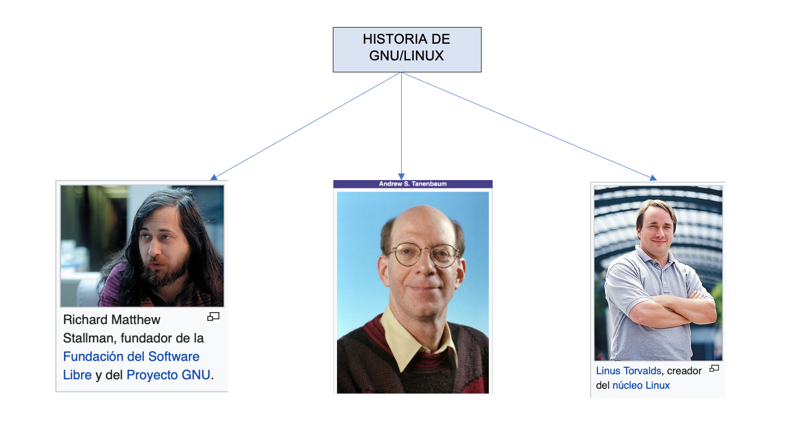
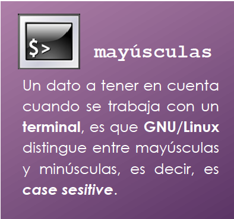

# Tools: Scripting y Docker

??? abstract "Duración y criterios de evaluación"

    **Duración estimada: 9 sesiones (2h por sesión)**

    <hr />

    Resultado de aprendizaje:

    1. Utiliza lenguajes de guiones en sistemas operativos, describiendo su aplicación y administrando servicios del sistema operativo.

    Criterios de evaluación:

    1. Se han utilizado y combinado las estructuras del lenguaje para crear guiones.
    2. Se han utilizado herramientas para depurar errores sintácticos y de ejecución.
    3. Se han interpretado guiones de configuración del sistema operativo.
    4. Se han realizado cambios y adaptaciones de guiones del sistema.
    5. Se han creado y probado guiones de administración de servicios.
    6. Se han creado y probado guiones de automatización de tareas.
    7. Se han implantado guiones en sistemas libres y propietarios.
    8. Se han consultado y utilizado librerías de funciones.
    9. Se han documentado los guiones creados.

## Introducción Linux

### Breve Historia

* **1969** La empresa AT&T desarrolla el sistema operativo UNIX y vendido posteriormente a Novell.
* **1983** Richard Stallman comienza el proyecto GNU (GNU is Not Unix) para crear un SO tipo UNIX pero de software libre.
    * Software libre: Aquel software, que una vez adquirido (no tiene porque ser gratuito), puede ser usado, copiado, modificado y redistribuido, con cambios o mejoras.
* **1985** Microsoft publica Windows, un sistema operativo con interfaz gráfica de usuario (GUI) para su sistema operativo MS-DOS.
* **1991** Linus Torvald comienza a programar el sistema operativo Linux (Linus + UNIX). El código era totalmente nuevo, pero emulaba el funcionamiento del sistema operativo MINIX (Tanenbaum), con estructura de micronucleo.
* **1992** Se juntan el proyecto Linux y GNU → GNU/Linux.
* **2001** Se lanza el primer sistema operativo MAC (MAC OS X) con interfaz de escritorio. MAC está basado en UNIX.

### Principales Actores
<figure>
  
  <figcaption>Principales Actores en la creación de GNU/Linux</figcaption>
</figure>

### Características

* **Software Libre** → Cualquiera puede usarlo o descargarlo.
    * Licencias GPL (General Public License) de GNU. La Licencia Pública General de GNU o más conocida por su nombre en inglés **GNU General Public License** es una licencia de derecho de autor ampliamente usada en el mundo del software libre y código abierto, ​ y garantiza a los usuarios finales la libertad de usar, estudiar, compartir y modificar el software.
* **Código Abierto** → Cualquiera puede ver y modificar el código.

<figure>
  
  <figcaption>Tabla con algunas características de Linux</figcaption>
</figure>

### Distribuciones

* Gratuitas:
    * Ubuntu, CentOS, Mint, Fedora, Knoppix, OpenSUSE.
    * En el caso de Ubuntu sacan distribuciones LTS que tienen mayor tiempo de actualizaciones. 
    * Las versiones indican el año y el mes en que se saca dicha versión.
        * Por ejemplo 17.04 (Año 2017, Abril).
* Pago: RedHat o SUSE.
    * Se paga por el soporte, no por el software en sí.
    * Las distribuciones de pago también suelen tener sus versiones gratuitas.

### Principales distribuciones
<figure>
  
  <figcaption>Algunas Distribuciones de Linux</figcaption>
</figure>

### Shell

* En informática, el **shell o intérprete de órdenes** o intérprete de comandos es el programa informático que provee una interfaz de usuario para acceder a los servicios del sistema operativo. Dependiendo del tipo de interfaz que empleen, los shells pueden ser:
    * De líneas texto (**CLI**, Command-Line Interface, interfaz de línea de comandos),
    * Gráficos (**GUI**, Graphical User Interface, interfaz gráfica de usuario),
    * De lenguaje natural (**NUI**, Natural User Interface, interfaz natural de usuario).
* En un terminal (Shell) es posible crear cualquier comando que el usuario necesite, incluso para las tareas más específicas.
* Debido a estar directamente conectado al Kernel a diferencia de las palicaciones como se puede observar en la siguiente figura.

<figure>
  
  <figcaption>Estructura de Linux</figcaption>
</figure>

* Por lo tanto, es buena práctica que el administrador del sistema tenga conocimientos en el manejo del terminal así como en la programación de scripts.
* Linux dispone de varios Shell diferentes *csh*, *bash*, *sh*, *ksh*, *zsh*, etc... 
* En este tema utilizaremos el Shell **bash**. 


### Formato comandos

<figure style="float: right;">
    
    <figcaption></figcaption>
    </figure>

 En general, el formato de las órdenes de GNU/Linux es el siguiente:

* **Comando**, que indica la acción que se va a ejecutar.
* **Modificadores**, que cambian el comportamiento estándar del comando para adaptarlo a las necesidades.
* **Argumentos**, elementos necesarios para realizar la acción del comando.

## Shell Script en GNU/Linux.

* Un Shell script (guión) es un archivo de texto que contiene una serie de comandos que, ordenados de forma específica, realizan la tarea para la que fueron diseñados, es decir, es un programa escrito de comandos Shell para ser ejecutados de forma secuencial.
* De esta forma se pueden automatizar tareas repetitivas ahorrando tiempo al administrador.
* Un programa escrito en shell se denomina shellscript, programa shell o simplemente un shell.

### Creación Shell scripts.

* Para crear un script utilizaremos cualquiera de los editores de texto plano como *vi*, *vim* , *nano*.
* Después de crear el archivo hay que dotarlo de permisos de lectura y ejecución. 

``` yaml
chmod ugo=rx script.sh
```

* Para ejecutar el archivo: ubicados en la carpeta que contiene el archivo, se pueden utilizar tres formas:
    * se teclea el nombre del archivo en el terminal precedido del comando **sh**
    ``` yaml
    sh script.sh
    ```
    * precedido de un punto *.*
    ``` yaml
    . script.sh
    ./ script.sh
    ```
    * definir la carpeta dentro de la variable de entorno **PATH**. Y ejecutamos directamente con el nombre del script.
    ``` yaml
    mkdir /home/administrador/scripts
    PATH=$PATH:/home/administrador/scripts
    export PATH
    ```

* Cualquiera de estas dos primeras formas ejecutará el contenido del shell script en un subshell o hilo del terminal original. El programa se ejecuta hasta que se terminan las órdenes del archivo, se recibe una señal de finalización, se encuentra un error sintáctico o se llega a una orden **exit**.
* Cuando el programa termina, el subshell muere y el terminal original toma el control del sistema. 
* Esto no ocurre si se usa la opción de PATH, la cual ejecuta el contenido del shell script en el mismo terminal donde fue invocado.

### Ejemplo Shellscript

* Crea un ejemplo llamado *listar.sh*

``` yaml
cd ~
mkdir scripts
cd scripts
touch listar.sh
nano listar.sh
```

* Genera, guarda y prueba el siguiente código.

``` yaml
#! /bin/bash
clear
ls -la
echo “Listado realizado el “$(date)
```

### Actividades iniciales

* Todavía no hemos estudiado como realizar operaciones, impresiones por pantalla y trabajar con parámetros, pero con un poco de investigación se puede llegar a la solución de las siguientes actividades.  

* Escribe el código de los shell scripts que se detallan en cada ejercicio. Deberás crear un fichero de texto para cada ejercicio con el siguiente nombre: **ejX.sh**, donde la **X** representa el número de ejercicio. Una vez terminada la práctica, comprime todos estos ficheros en uno y súbelos al **Moodle del módulo**. 

101. Crea un shell script que muestre por pantalla el mensaje **“¡Hola Mundo!”**.

102. Realiza un shell script que admita un *único parámetro* correspondiente al nombre de un fichero de texto. Mostrará por pantalla el número de líneas del mismo utilizando el comando **wc**.

103. Crea un shell script que muestre por pantalla el resultado de de las siguientes operaciones. Debes tener en cuenta que a, b y c son variables enteras que son preguntadas al usuario al iniciar el script.

    * a%b
    * a/c
    * 2 * b + 3 * (a-c)
    * a * (b/c)
    * (a*c)%
