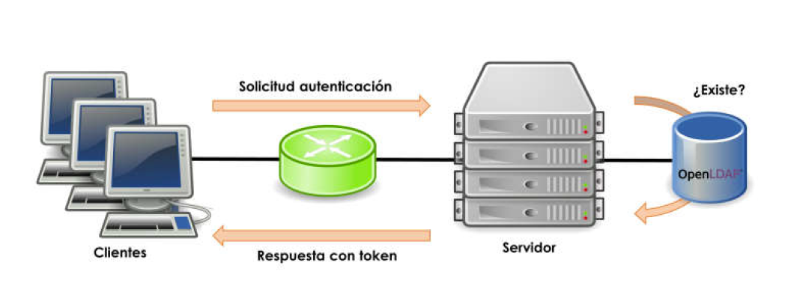
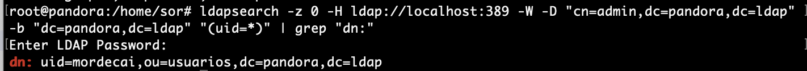

# LDAP

El **LDAP (Lightweight Directory Access Protocol)** es un protocolo a nivel de aplicación que da acceso a un servicio de directorio ordenado y distribuido para la búsqueda de la información de un entrono de red.

* En la década de los 80, la especificación de directorio **X.500** vio la luz. El protocolo que daba acceso a la información contenida en él, fue DAP
(Directory Access Protocol) y estaba basado en la **pila de protocolos OSI (Open Systems Interconexion)**. Gracias al auge de Internet, la pila de protocolos TCP/IP cobraron especial protagonismo y su uso fue generalizado en cualquier infraestructura de red, incluidas las LAN.

* Ante esta situación, en **1993** se implementó el protocolo **LDAP** que utilizaba la pila de protocolos TCP/IP para el acceso a la información contenido en un servicio de directorio. El funcionamiento de LDAP es **relativamente simple**: un cliente se inicia una sesión en un servidor LDAP solicitando alguna información.

<figure>
  
  <figcaption>Esquema de funcionamiento del protocolo LDAP</figcaption>
</figure>

!!! Conclusión
    * **LDAP, es un protocolo que ofrece el acceso a un servicio de directorio** implementado sobre un entorno de red, con el objeto de acceder a una determinada información. Puede ejecutarse sobre TCP/IP o sobre cualquier otro servicio de transferencia orientado a la conexión.
    * Podemos considerarlo como un **sistema de almacenamiento de red al que se pueden realizar consultas.**

* Antes de trabajar con LDAP, hay varios conceptos importantes que deben entenderse. El primer paso importante para dar el acceso comentado se basa en la **autentificación de usuarios**.

## AUTENTICAR USUARIOS

Existen diferentes formas de autenticar usuarios en una red linux, pero una de las más usadas es la combinación de tres herramientas diferentes: **NSS**, **PAM** y **LDAP**.

* La idea consiste en disponer de un servidor que facilite la acción de **autenticar usuarios**, de modo, que éstos recurran al servidor cada vez que un cliente necesite identificarse. De esta forma, **la cuenta de usuario no es específica de un equipo cliente**, si no que será válida en cualquier equipo de la red que haya sido debidamente configurado.

<figure>
  
  <figcaption>Herramientas autenticación usuarios en Unix</figcaption>
</figure>

### PAM

**Pluggable Authentication Module (PAM)**: o módulo de autenticación conectable en español, es un mecanismo para integrar múltiples esquemas de autenticación de bajo nivel en una interfaz de programación de aplicaciones (API) de alto nivel.

* Es decir, Establece una **interfaz entre los programas de usuario y distintos métodos de autenticación**. De esta forma, el método de autenticación, se hace **transparente para los programas**.

* La idea se basa en la creación de **módulos de autenticación**. Esto hace que, **sin realizar modificaciones en el sistema**, podamos utilizar métodos que vayan desde el **uso típico** de un nombre de usuario y una contraseña, hasta aceptar **contraseñas de un solo uso**, **restringir el acceso** a determinados horarios o establecer políticas de autenticación específicas para cada usuario o grupos de usuarios.

<figure>
  
  <figcaption>Esquema de la estructura PAM</figcaption>
</figure>

!!! Note
    En la actualidad, **PAM es el método que utilizan la mayoría de las aplicaciones** y herramientas de UNIX para autenticar usuarios.


### NSS

**Name Service Switch** es un servicio que **permite la resolución de nombres de usuario y contraseñas** (o grupos) mediante el acceso a diferentes orígenes de información.

* En condiciones normales, esta información se encuentra en los archivos locales del sistema operativo, en concreto en 
    * */etc/passwd*, */etc/shadow* y */etc/group*
* pero puede proceder de otras fuentes, como **DNS (Domain Name System)**, **NIS (Network Information Service)**, **LDAP (Lightweight Directory Access Protocol)** o **WINS (Windows Internet Name Service)**.

!!! note
    Este servicio esta gestionado desde el fichero: **/etc/nsswitch.conf**

## Modelo de Información de LDAP

La estructura básica de LDAP es un árbol de nodos llamado **Directory Information Tree (DIT)** donde cada **objeto o nodo** es una entrada. La parte superior del árbol se llama comúnmente **raíz** (también conocida como **base** o **sufijo** ).

Cada entrada se define por un **DN (Distinguished Name)** y contiene un conjunto de atributos. Este DN es una cadena que indica la ruta en el árbol de dicha entrada y será único en todo el árbol. Un ejemplo del aspecto que ofrece un DN sería el siguiente:

!!! Example
    * **cn=usuario1,ou=usuarios,dc=midominio,dc=es**
    * Puede verse que cada componente (la coma es el carácter separador) se muestra como un par **«atributo=valor»** donde el atributo es una abreviatura usada por LDAP.

Cada **entrada** en el árbol tiene una *entrada principal* (objeto) y cero o más *entradas secundarias* (objetos). Cada entrada secundaria (objeto) es un hermano de las otras entradas secundarias de su padre.

Cada entrada se compone de (es una instancia de) una o más **clases de objeto** (**objectClasses**). Las **objectClasses** contienen cero o más atributos. Los atributos tienen nombres (y a veces abreviaturas o **alias**) y normalmente contienen datos. 

* A continuación se muestra un diagrama para entender mejor estos conceptos:

<figure>
  
  <figcaption>Modelo de información (datos) LDAP DIT</figcaption>
</figure>

**Resumen:**

1. Cada **entrada** (1) se compone de una o más **clases de objetos** (2)
2. Cada **objectClass** (2) tiene un nombre y es un contenedor de atributos (su definición identifica los atributos que puede o debe contener)
3. Cada **atributo** (3) tiene un nombre, contiene datos y es miembro de una o más **clases de objetos** (2)
4. Cuando se completa el DIT, cada **entrada** se identificará de forma única (en relación con su entrada principal) en la jerarquía por los datos que contiene (en sus atributos que están contenidos en su (s) objectClasses (s)).

### Entrada

Una **entrada LDAP** es una recopilación de información sobre una entidad. Cada entrada consta de tres componentes principales:

* Nombre distinguido DN y RDN (Relative Distinguished Name)
* Colección de clases de objetos (objectClasses)
* Atributos

Cada uno de estos se describe con más detalle a continuación.

#### DN y RDN

**El nombre distinguido de una entrada, a menudo denominado DN**, identifica de forma única esa entrada y su posición en la jerarquía del árbol de información de directorio (DIT). **El DN de una entrada LDAP es muy parecido a la ruta a un archivo en un sistema de archivos**.

* Un **DN LDAP se compone de cero o más elementos** denominados nombres distinguidos relativos o **RDN**. Cada RDN se compone de uno o más (generalmente solo uno) pares de atributo-valor. 

!!! example
    * **"uid = john.doe"** representa un RDN compuesto por un atributo llamado "uid" con un valor de "john.doe".
    * Si un RDN tiene varios pares de atributo-valor, están separados por signos más, como **"givenName = John + sn = Doe"**.

##### DSE

**El nombre distinguido especial compuesto por cero RDN** (y por lo tanto tiene una representación de cadena que es solo una **cadena vacía**) a veces se denomina **"DN nulo"** y hace referencia a un tipo especial de entrada llamado **DSE raíz** que proporciona información sobre el contenido y las capacidades de el servidor de directorio.

##### Múltiples RDN

Para DN con **múltiples RDN**, el orden de los RDN especifica la posición de la entrada asociada en el DIT. Los RDN están separados por comas, y cada RDN en un DN representa un nivel en la jerarquía en orden descendente (es decir, acercándose a la raíz del árbol, que se denomina contexto de nomenclatura).
    
!!! example
    el DN **"uid = john.doe, ou = People, dc = example, dc = com"** tiene cuatro RDN.
    

### Clases de objetos (objectClasses)

* Las clases de objeto son **elementos de esquema que especifican colecciones de tipos de atributos** que pueden estar relacionados con un tipo particular de objeto, proceso u otra entidad.
* Las **clases de objetos** son, esencialmente, **contenedores de atributos** y se describen utilizando definiciones **ASN.1** .
* Cada **objectClass tiene un nombre único**.
* Existe un número confuso de **clases de objetos** **PREDEFINIDAS**, cada una de las cuales contiene un montón de **atributos** adecuados para casi todas las implementaciones LDAP comunes.

Las clases de objetos tienen tres características principales:

1. La **clase de objeto** define si un miembro de atributo **MUST** ( obligatorio ) estar presente o **MAY** ( opcional ) estar presente.
2. Cada **clase de objeto** tiene un tipo que pueden ser *estructurales*, *auxiliar* o *RESUMEN*. En esta etapa es suficiente saber que debe haber una, y solo una, **clase de objeto** *ESTRUCTURAL *en una entrada y que puede haber cero o más clases de objeto *AUXILIAR*.
3. Una **clase de objeto** puede ser parte de una jerarquía, en cuyo caso **hereda** todas las características de su (s) clase (s) de objeto principal (incluidos todos los atributos que contiene).

!!! Note
    **objectClasses** son contenedores y controlan qué atributos se pueden agregar a cada entrada, pero por lo demás tienden a permanecer en segundo plano en lo que respecta al acceso e interrogación (búsqueda) del DIT. **Los atributos y las entradas son los elementos realmente visibles**.

### Atributos

Cada **atributo** de una entrada tendrá un **tipo** y un **valor** con el formato atributo/valor que permite caracterizar un aspecto del objeto que define la entrada. Estos atributos tienen nombres que hacen referencia a su contenido y pueden ser de dos tipos:

1. **Atributos normales** : Son los atributos que identifican al objeto
2. **Atributos operativos** : Son los atributos que utiliza el servidor para administrar el directorio

Entre los atributos que suelen utilizarse habitualmente, encontramos los siguientes, aunque puede haber muchos mas:

-   **dn** (distinguished name): nombre distintivo de una entrada, contiene un conjunto de atributos y es de carácter único.
-   **dc** (domain component): se refiere al componente del dominio, ya sea un componente, una etiqueta o un nombre de dominio DNS.
-   **ou** (organizational unit): unidad organizativa.
-   **cn** (common name): nombre común.
-   **sn** (surname): apellido.
-   **uid** (userid): nombre de usuario.
-   **mail:** dirección de e-mail.
-   **telephoneNumber:** número de teléfono.

!!! Example
    * **DN** cn=John Smith, o=airius.com, c=DE 
    * **RDN** cn=John Smith + DN of ancestor o=airius.com, c=DE

<figure>
  
  <figcaption>Modelo de nomenclatura LDAP</figcaption>
</figure>

#### Características de Atributos

Cada **atributo** tiene un nombre único (**y una forma abreviada o alias**) y normalmente contiene datos. Los atributos siempre están asociados con (son miembros de) una o más **ObjectClasses** . Los atributos tienen una serie de características interesantes:

1. Todos los **atributos** son miembros de una o más **clases de objeto**.
2. Cada **atributo** define el tipo de datos (la palabra clave es SINTAXIS) que puede contener. Los tipos de datos pueden ser: *Strings*, *Numbers (Integer)*, *Time*, *Telephone Numbers*, *Boolean*, *Binary*, *Distinguished Name*, *Bit Strings*, *LDAP Supported Syntaxes*.
3. Los atributos pueden formar parte de una *jerarquía*, en cuyo caso el atributo *hijo hereda todas las características del atributo padre*. En el caso de los atributos, se usa una jerarquía para simplificar y acortar las definiciones de atributos (en ASN.1) donde muchos atributos comparten propiedades comunes como la longitud máxima o si son o no sensibles a mayúsculas y minúsculas, etc. ningún otro significado.
4. Los atributos pueden ser opcionales (la palabra clave es **MAY**) u obligatorios (la palabra clave es **MUST**) como se describe en las definiciones *ASN.1* para la clase de objeto de la que son miembros. Un atributo puede ser opcional en una clase de objeto y obligatorio en otra. Es la clase de objeto la que determina esta propiedad.
5. Los **atributos** aparentemente son **aleatorios** que se recogen de todas partes de la documentación; es confuso al principio, pero proviene de la característica opcional de la mayoría de los atributos. Permite un enfoque de '*pick-n-mix*' para poblar una entrada. Se puede buscar el atributo que se desee, y buscar la clase de objeto de la que es miembro (puede haber más de uno) y confirmar que todos los demás atributos que no se desean utilizar en la clase de objeto sean opcionales. Se puede revisar en [Atributos comunmente utilizados](http://zytrax.com/books/ldap/ape/index.html#attributes).
6. Los atributos pueden tener un valor *ÚNICO* o *MÚLTIPLE* (como se describe en sus definiciones ASN.1 ). 
    1. **VALOR ÚNICO** significa que solo un valor de datos puede estar presente para el atributo . 
    2. **MULTIVALOR** significa que el atributo puede aparecer varias veces en una clase de **entrada / objeto** con diferentes valores de datos. 
Si el atributo describe, por ejemplo, una dirección de correo electrónico, puede haber una, dos o 500 definiciones del atributo, cada una con una dirección de correo diferente (es múltipl ); este es uno de los varios métodos para tratar los alias de correo electrónico en los diseños de directorios. En este caso el valor predeterminado de un atributo es MULTIVALOR (permitir múltiples valores).
7. Los atributos tienen nombres y, a veces, un alias (como se describe en sus definiciones ASN.1), por ejemplo, el atributo con un nombre de cn es un miembro del objectClass llamado person (y muchos otros) y tiene un alias de commonName . Se puede utilizar commonName o cn para hacer referencia a este atributo .
8. En cada nivel de la jerarquía, **los datos contenidos en un atributo se pueden utilizar para identificar de forma única la entrada**. Puede ser cualquier atributo de la entrada. Incluso puede ser una combinación de dos o más atributos.
9. Los valores de atributo seleccionados para contener los datos únicos a veces se denominan atributos de nomenclatura o el nombre distinguido relativo (RDN), ya comentados.

## LDIF

La adición de entradas se puede realizar de diversas formas, una de las cuales es mediante el uso de **archivos de intercambio de datos LDAP (LDIF)**.

* Los **LDIF** son archivos de texto que describen la jerarquía del árbol, el árbol de **información del directorio (DIT)**, y los datos que se agregarán a cada atributo. 
* El siguiente es un ejemplo simple de un archivo LDIF que configura un DN raíz (dc = ejemplo, dc = com) y agrega tres entradas secundarias debajo de una entrada de **personas**.

``` yaml
version: 1

## version not strictly necessary (and some implementations reject it) but generally good practice

## DEFINE DIT ROOT/BASE/SUFFIX ####
## uses RFC 2377 (domain name) format

## dcObject is an AUXILIARY objectclass and MUST
## have a STRUCTURAL objectclass (organization in this case)
# this is an ENTRY sequence and is preceded by a BLANK line

dn: dc=example,dc=com
dc: example
description: The best company in the whole world
objectClass: dcObject
objectClass: organization
o: Example, Inc.

## FIRST Level hierarchy - people 
# this is an ENTRY sequence and is preceded by a BLANK line

dn: ou=people, dc=example,dc=com
ou: people
description: All people in organisation
objectClass: organizationalUnit

## SECOND Level hierarchy - people entries 
# this is an ENTRY sequence and is preceded by a BLANK line

dn: cn=Robert Smith,ou=people,dc=example,dc=com
objectclass: inetOrgPerson
cn: Robert Smith
cn: Robert
sn: Smith
uid: rsmith
mail: robert@example.com
mail: r.smith@example.com
ou: sales

## SECOND Level hierarchy - people entries 
# this is an ENTRY sequence and is preceded by a BLANK line

dn: cn=Bill Smith,ou=people,dc=example,dc=com
objectclass: inetOrgPerson
cn: Bill Smith
cn: William
sn: Smith
uid: bsmith
mail: bill@example.com
mail: b.smith@example.com
ou: support

## SECOND Level hierarchy - people entries 
# this is an ENTRY sequence and is preceded by a BLANK line

dn: cn=John Smith,ou=people,dc=example,dc=com
objectclass: inetOrgPerson
cn: John Smith
sn: smith
uid: jsmith
mail: jim@example.com
mail: j.smith@example.com
ou: accounting
```

## Esquema LDAP

El **esquema** es una parte importante de LDAP. Similar a la definición del esquema de la base de datos, el esquema LDAP define la estructura y las reglas que debe seguir un directorio LDAP, como qué atributos tendrá una clase de objeto, qué estructura tienen estos atributos, etc. 

* El **servidor LDAP** proporciona una manera de **identificar categorías, atributos** y otra información en el directorio LDAP, para que el servidor LDAP pueda reconocerlos. **Para realizarlo se utlizan esquemas**, que no es más que una **unidad de empaquetado conveniente para contener clases de objetos y atributos muy similares**.
* **La principal diferencia** con las bases de datos relacionales del protocolo LDAP es que estas ya estan predefinidas en los esquemas. por lo que nos ahorramos en insertar y definir las tablas de información.
* En **OpenLDAP** los esquemas instalados se encuentran en cn = schema, cn = config y se pueden instalar esquemas adicionales usando este procedimiento.

El siguiente diagrama ilustra el uso de esquemas como unidades de empaquetado:

<figure>
  
  <figcaption>Ejemplo de la definición de Esquemas en LDAP</figcaption>
</figure>

A nivel de comandos se pueden ver los esquemas predefinidos con:

```yaml
cd /etc/ldap/slapd.d/cn\=config/
```

En el directorio `cn\=schema` se pueden ver los esquemas y ademas se pueden añadir más, pero no suele ser frecuente.

Para buscar los esquemas se puede utilizar:
```yaml
grep olcObjectClasses cn\=\{3\}inetorgperson.ldif|awk '{print $5}'
grep olcObjectClasses cn\=\{2\}inetorgperson.ldif|awk '{print $5}'
grep olcObjectClasses cn\=\{2\}nis.ldif|awk '{print $5}'
grep olcObjectClasses cn\=\{1\}cosine.ldif|awk '{print $5}'
grep olcObjectClasses cn\=\{0\}core.ldif|awk '{print $5}'
```

## Herramientas de gestión de usuarios.

Una vez configurado el servidor LDAP, para la utilización normal debemos aprender cómo se anñaden nuevos usuarios o se modifican los atributos de los existentes.

* Para los objetos iniciales del directorio, primero se debe escribir un fichero en formato **LDIF** que incluya todos los atributos de la entrada y añaadirla al directorio con slapadd. En la [Actividades Desarrollo UD2_01](#Actividades Desarrollo UD2_01), se realizará un ejemplo guiado al respecto.

* Este método es totalmente inadecuado para la utilización cuando el directorio está activo. Existen varias formas de actualizar las entradas del directorio o añadir nuevas, y en primer lugar veremos la utilización de las herramientas incluidas en el paquete **ldap-utils**.

### ldap-utils
Para realizar modificaciones de los objetos del directorio directamente desde la línea de comandos, se pueden utilizar las herramientas del paquete `ldap-utils`, a continuación se describen algunas de ellas.

#### Mostrar entradas

-   `ldapsearch` - buscar y mostrar entradas

La herramienta `ldapsearch` resulta muy conveniente al momento de hacer consultas sobre los datos dentro de un directorio LDAP desde línea de comandos. 

* A continuación se presentan una serie de consultas de ejemplo que pueden resultar muy útiles para obtener información valiosa de un árbol LDAP.

#### Obtener todos los objetos de un directorio

Para obtener todos los objetos en un directorio (dn) a partir de cierta base con el ejemplo de la práctica (`dc=pandora,dc=ldap`) y sin límite de para la respuesta, utilizar una consulta como la siguiente:

``` yaml
ldapsearch -z 0 -H ldap://localhost:389 -W -D "cn=admin,dc=pandora,dc=ldap" -b "dc=pandora,dc=ldap" "(objectclass=*)"
```

!!! note
    * `-z 0`: evita cortar la respuesta una vez alcanzado cierto límite (cantidad de entradas).
    * `-H ldap://localhost:389`: indica que consulte al servidor LDAP en el puerto 389 del host local.
    * `-W`: indica que solicite la contraseña para el método de autenticación simple de manera interactiva.
    * `-D "cn=admin,dc=pandora,dc=ldap"`: especifica el usuario con el cual se autentica en el servidor LDAP.
    * `-b "dc=pandora,dc=ldap"`: especifica la base desde donde comenzar la búsqueda (en este caso se trata de la raíz del directorio).
    * `"(objectclass=*)"`: especifica el filtro para la búsqueda (en este ejemplo todos los objetos, este a su vez es el filtro por defecto).

!!! Warning
    El punto importante es no olvidar especificar la base (`-b`). De lo contrario probablemente no haya resultados en la búsqueda:


* A este ejemplo se le puede añadir `grep` para filtrar sólo los dn:

``` yaml
ldapsearch -z 0 -H ldap://localhost:389 -W -D "cn=admin,dc=pandora,dc=ldap" -b "dc=pandora,dc=ldap" "(objectclass=*)" | grep "dn:"
```

* El resultado sería parecido a:


#### Obtener todas las unidades organizacionales

Las [ou](https://technet.microsoft.com/en-us/library/cc978003.aspx) (*Organizational Unit*) definen la jerarquía dentro de un dominio. Generalmente se utilizan para definir los departamentos o áreas dentro de una organización (empresa, red, sociedad, etc.).

Para obtener una lista de todas las ou presentes en un directorio, se puede utilizar el filtro `"(ou=*)"`:

``` yaml
ldapsearch -z 0 -H ldap://localhost:389 -W -D "cn=admin,dc=pandora,dc=ldap" -b "dc=pandora,dc=ldap" "(ou=*)" | grep "dn:"
```

* Resultado


#### Listar todos los usuarios

Esta consulta depende de la jerarquía y la clase utilizada para almacenar usuarios dentro de un árbol LDAP. Sin embargo, generalmente se utiliza la clase [inetOrgPerson](https://tools.ietf.org/html/rfc2798) para almacenar usuarios dentro de un directorio LDAP, la cual posee el atributo `uid`.

De esta forma, para listar todos los usuarios presentes en un directorio, simplemente recurrir al filtro `"(uid=*)"`:

``` yaml
ldapsearch -z 0 -H ldap://localhost:389 -W -D "cn=admin,dc=pandora,dc=ldap" -b "dc=pandora,dc=ldap" "(uid=*)" | grep "dn:"
```

* Resultado



#### Determinar todas las clases en uso

Las clases de un directorio LDAP determinan el formato con el que se representan los datos de los objetos almacenados en el árbol. Cada objeto (entrada en un directorio LDAP) pertenece a al menos una clase. Sin embargo es común que cada objeto pertenezca a varias clases. Básicamente las clases definen qué atributos y de qué formato puede poseer un objeto.

Para listar todas las clases actualmente en uso por todos los objetos, es necesario volcar todo el contenido del árbol y filtrar con `grep`:

``` yaml
ldapsearch -z 0 -H ldap://localhost:389 -W -D "cn=admin,dc=pandora,dc=ldap" -b "dc=pandora,dc=ldap" "(objectclass=*)" | grep objectClass | sort | uniq
```

* Resultado


#### Manipular entradas

-   `ldapmodify` - modificar una entrada

-   `ldapadd` - agregar una nueva entrada

-   `ldapdelete` - eliminar y entrar

-   `ldapmodrdn` - cambiar el nombre de una entrada

-   `ldappasswd` : cambie la contraseña de una entrada


###### Ejemplos:

1. Añadir y eliminar nuevos grupos con `ldapadd` & `ldapdelete`

    1. Se crea un archivo .ldif para añadir un nuevo grupo y se añade con `ldapadd`:

    ``` yaml
    nano aso.ldif
    ```

    ``` yaml    
    dn: ou=aso,dc=pandora,dc=ldap
    objectClass: organizationalUnit
    objectClass: top
    ou: aso
    ```

    ``` yaml
    ldapadd -x -W -D "cn=admin,dc=pandora,dc=ldap" -f aso.ldif
    ```

    2. Para borrarlo se utilizaría: 

    ``` yaml
    ldapdelete -W -D "cn=admin,dc=pandora,dc=ldap" "ou=aso,dc=pandora,dc=ldap"
    ```

2. Añadir y eliminar usuarios con `ldapadd` & `ldapdelete`

    1. Se crea un archivo .ldif para añadir un nuevo grupo y se añade con `ldapadd`:

    ``` yaml
    nano javier.ldif
    ```

    ``` yaml    
    dn: uid=javier,ou=usuarios,dc=pandora,dc=ldap
    objectClass: inetOrgPerson
    objectClass: posixAccount
    objectClass: shadowAccount
    cn: Javier
    sn: Hernandez
    userPassword: {SSHA}latDDmodpsLUWDqwd/adk/j2tTDgz3NX
    loginshell: /bin/bash
    uidNumber: 10001
    gidNumber: 10001
    homeDirectory: /home/javier
    ```

    ``` yaml
    ldapadd -x -W -D "cn=admin,dc=pandora,dc=ldap" -f javier.ldif
    ```

    2. Para borrarlo se utilizaría: 

    ``` yaml
    ldapdelete -W -D "cn=admin,dc=pandora,dc=ldap" "uid=javier,ou=aso,dc=pandora,dc=ldap"
    ```

3. modificar `uidnumber` de usuario existente `ldapmodify`

    1. Se crea un archivo .ldif especificando las modificaciones:

    ``` yaml
    nano cambios1.ldif
    ```

    ``` yaml    
    dn: uid=javier,ou=aso,dc=pandora,dc=ldap
    changetype:modify
    replace:uidNumber
    uidNumber:10002
    ```

    2. Para modificarlo se utilizaría: 

    ``` yaml
    ldapmodify -x -W -D "cn=admin,dc=pandora,dc=ldap" -f cambios1.ldif
    ```

!!! Note
    * Cuatro tipos de cambios son posibles
        1. add--adds a new entry
        2. modify--changes an existing entry, that is, it adds, deletes, or replaces attributes of the entry
        3. delete--deletes an existing entry
    4. modrdn--modifies the RDN of an existing entry

4. Añadir y cambiar contraseña a un usuario existente con `ldappasswd`

    1. Añadir contraseña

    ``` yaml
    ldappasswd -s 1234 -W -D "cn=admin,dc=pandora,dc=ldap" -x "uid=javier,ou=aso,dc=pandora,dc=ldap"
    ```
    

#### Operaciones

-   `ldapwhoami` : muestra con qué entrada estoy vinculado al servidor

-   `ldapcompare` : compara un campo en la entrada con algún valor

## Configuración de OpenLDAP

### `slapd.conf `

Es el archivo principal de OpenLDAP y es aquí donde se configuran todos sus parámetros.

!!! note
    * `slapd.conf `se encuentra dentro del directorio `/etc/ldap/slapd.d`

#### Diseño de configuración 

La configuración de slapd se almacena **como un directorio LDAP especial con un esquema y DIT predefinidos**. 

* Hay clases de objetos específicas que se utilizan para llevar opciones de configuración global, definiciones de esquema, definiciones de base de datos y back-end, y otros elementos variados.

<figure>
  
  <figcaption>Árbol de configuración de muestra.</figcaption>
</figure>

* En el servidor se podría observar:

<figure>
  
  <figcaption>Árbol (DIT)de configuración En Ubuntu Server.</figcaption>
</figure>

El árbol de configuración de slapd-config tiene una estructura muy específica. La raíz del árbol se denomina cn = config y contiene ajustes de configuración global.


#### Directivas de configuración

De las directivas más comunes mostradas en el arblo se destaca centro de `cn = config` la directiva `olcLogLevel`

* Esta directiva especifica el nivel en el que las declaraciones de depuración y las estadísticas de operación deben registrarse en el syslog (actualmente registrado en la función **syslogd (8) LOG_LOCAL4 )**. 
* Debe haber configurado OpenLDAP --enable-debug (el predeterminado) para que esto funcione (excepto para los dos niveles de estadísticas, que siempre están habilitados).

##### Configuración logging

El registro de actividad para slapd es muy útil cuando se implementa una solución basada en OpenLDAP, pero debe habilitarse manualmente después de la instalación del software. De lo contrario, solo aparecerán mensajes rudimentarios en los registros. El registro, como cualquier otra configuración similar, se habilita a través de la base de datos **slapd-config** .

* OpenLDAP viene con múltiples niveles de registro y cada uno contiene el más bajo (aditivo). 
* Un buen nivel para probar son las *estadísticas* . La página de manual de [slapd-config](https://manpages.ubuntu.com/manpages/focal/en/man5/slapd-config.5.html?_ga=2.248400327.1524111619.1636497214-637147953.1635270894) tiene más que decir sobre los diferentes subsistemas.

1. Cree el archivo `logging.ldif` con el siguiente contenido:

``` yaml
dn: cn=config
changetype: modify
replace: olcLogLevel
olcLogLevel: stats
```

2. Implementar el cambio:

``` yaml
sudo ldapmodify -Q -Y EXTERNAL -H ldapi:/// -f logging.ldif
```

Esto producirá una cantidad significativa de registro y querrá volver a un nivel menos detallado una vez que su sistema esté en producción. Mientras está en este modo detallado, el motor syslog de su host (rsyslog) puede tener dificultades para mantenerse al día y puede dejar caer mensajes:

!!! Warning
    **rsyslogd-2177: imuxsock lost 228 messages from pid 2547 due to rate-limiting**

Puede considerarse un cambio en la configuración de `rsyslog`. En `/etc/rsyslog.conf`, ponga:

``` yaml
# Disable rate limiting
# (default is 200 messages in 5 seconds; below we make the 5 become 0)
$SystemLogRateLimitInterval 0
```

3. Y luego reinicie el demonio rsyslog:

``` yaml
sudo systemctl restart syslog.service
```

4. Los Registros de OpenLDAP a través de syslogd **LOCAL4** (Nivel warning de Syslog). Para transmitir el registro LDAP a un archivo separado de syslog, agregue una línea como esta a **syslog.conf** ( `/etc/rsyslog.conf`):

```yaml
# a. agregar a syslog.conf
local4. * /var/log/ldap.log

# b. crear un archivo de registro vacío
toque /var/log/ldap.log

# c. reiniciar syslogd
killall -HUP syslogd
O
systemctl restart syslog.service
```

[Más información sobre looging OpenLdap](http://www.zytrax.com/books/ldap/ch6/#logfile)

## Actividades Iniciales

[Configuración básica e instalación de OpenLDAP](Practica01_LDAP.md)

* base.ldif

``` yaml
dn: ou=usuarios,dc=pandora,dc=ldap
objectClass: organizationalUnit
objectClass: top
ou: usuarios

dn: ou=grupos,dc=pandora,dc=ldap
objectClass: organizationalUnit
objectClass: top
ou: grupos
```

* content.ldif 

``` yaml
dn: cn=devops,ou=grupos,dc=pandora,dc=ldap
objectClass: posixGroup
cn: devops
gidNumber: 10000
memberUid: devops

dn: uid=mordecai,ou=usuarios,dc=pandora,dc=ldap
objectClass: inetOrgPerson
objectClass: posixAccount
objectClass: shadowAccount
cn: Mordecai
sn: Geek
userPassword: {SSHA}latDDmodpsLUWDqwd/adk/j2tTDgz3NX
loginshell: /bin/bash
uidNumber: 10000
gidNumber: 10000
homeDirectory: /home/mordecai
```

## Actividades Desarrollo UD2_01 
<a name="Actividades Desarrollo UD2_01"></a>
[Creación de usuarios y grupos OpenLDAP](Practica02_LDAP.md)

## Actividades Desarrollo UD2_02

[Configuración de equipo cliente](Practica03_LDAP.md)

## Actividades Desarrollo UD2_03

201. En este ejercicio se deben utilizar los **comandos de OpenLdap** instalados en el paquete `LDAPutils`.
    1. Añade un nuevo grupo y dentro de el un nuevo usuario a la estructura de directorio creada en la práctica superior.
    2. Crea una contraseña para el usuario.
    3. Modifica el uid creado de inicio.
    4. Crea un segundo usuario, dentro de **usuarios**
    5. Elimina el segundo usuario creado.

En cada subapartado comprueba que se han introducido correctamente las modificaciones en el **DIT**.

## Actividades Desarrollo UD2_04

[Instalación y configuración phpLDAPadmin](phpLDAPadmin.md)