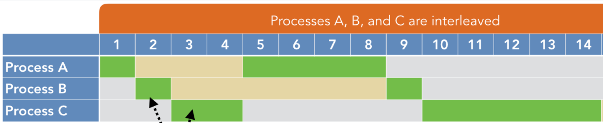

# Administración de procesos del sistema

??? abstract "Duración y criterios de evaluación"

    **Duración estimada: 6 sesiones (2h por sesión)**

    

    Resultado de aprendizaje y Criterios de evaluación:

    1. Administra procesos del sistema describiéndolos y aplicando criterios de seguridad y eficiencia.
        1. Se han utilizado interrupciones y excepciones para describir los eventos internos del procesador.
        2. Se ha diferenciado entre proceso, hilo y trabajo.
        3. Se han realizado tareas de creación, manipulación y terminación de procesos.
        4. Se ha utilizado el sistema de archivos como medio lógico para el registro e identificación de los procesos del sistema.
        5. Se han utilizado herramientas gráficas y comandos para el control y seguimiento de los procesos del sistema.
        6. Se ha comprobado la secuencia de arranque del sistema, los procesos implicados y la relación entre ellos.
        7. Se han tomado medidas de seguridad ante la aparición de procesos no identificados.
        8. Se han documentado los procesos habituales del sistema, su función y relación entre ellos.

## Procesos. Tipos. Estados. Estructura.

**Un proceso es una instancia de un programa en ejecución**. Es decir, cada vez que se lanza un programa, se crea un proceso, de forma que si lanzo el mismo programa dos veces, tendré dos procesos distintos aunque partan de las mismas instrucciones.

Cuando el usuario o una aplicación pide la ejecución de un determinado programa, el sistema operativo debe proveer de los recursos necesarios para esta tarea. Para ello debe buscar espacio en memoria RAM tanto para las instrucciones que van a ejecutarse como para los datos que necesita el programa y saber qué ficheros, dispositivos de E/S, etc... van a ser utilizados.

!!! warning
    La **CPU** se encarga de un solo proceso en cada instante de tiempo, para optimizar el redimiento de la misma se utilizan técnicas como la *multiprogramación* y *multihilado*, conceptos que se verán en esta Unidad.

**La multiprogramación** es una técnica de multiplexación que permite la ejecución simultánea de múltiples procesos en un único procesador. En realidad, esta técnica produce una ilusión de paralelismo, de manera que parece que todos los procesos se están ejecutando a la vez. Sin embargo, hay un único proceso ejecutándose en el procesador a la vez.

<figure>
  
  <figcaption>Ejemplo de Multiprogramación</figcaption>
</figure>

### Estructura

Los procesos se estructuran de **forma jerárquica**. EL sistema operativo lanza el primero y a partir de este se crean todos los demás.

El sistema operativo creará una estructura de control en la que tenga toda la información de dicho proceso. A esta estructura se le llama **BCP** (Bloque de control de proceso), y contiene diferente información dependiendo del sistema operativo del que hablemos, pero por lo general tiene:

1. **PID** (Process IDentifier): Identifica de forma unívoca al proceso en el sistema, generalmente se emplea un entero sin signo  .

2. **Estado del proceso**: listo o espera, ejecución o bloqueado**.

3. **Registros del procesador**: cada vez que se ejecuta el planificador y se realiza una conmutación de procesos, la información sobre en qué lugar se encontraba la ejecución del proceso debe guardarse, así como el lugar en el que se paró la ejecución del anterior proceso (en su respectivo BCP).

4. **Gestión de memoria**: tales como el espacio de direcciones y la cantidad de memoria asignada a un proceso.

5. Aspectos relacionados con la administración de **ficheros**: por ejemplo con que ficheros está el proceso actualmente operando.

6. Los **procesadores** en los que el proceso puede ejecutarse: en caso de soportar el sistema multiprocesador.

7. En el caso de un sistema operativo tipo UNIX: el **proceso padre** de dicho proceso y la relación de procesos.

8. Estadísticas Tiempo de lanzamiento del proceso, tiempo en estado activo, etc.

<figure>
  
  <figcaption>Componentes de BCP</figcaption>
</figure>

### Tipos de Procesos

Los procesos pueden clasificarse de distintas formas, por ejemplo, atendiendo a la interacción con el usuario podemos encontrarnos: 

- **Procesos en primer plano (foreground)**: precisan de la intervención del usuario. 

- **Procesos en segundo plano (background)**: Se ejecutan sin que el usuario tenga que hacer nada. 

También podemos atender al modo en el que se ejecutan estos, aunque puede ser que un mismo proceso pase de un modo a otro durante su ejecución. 

- **Procesos en modo kernel**: Son procesos que tienen acceso privilegiado a todo el equipo. Son mucho más seguros. La mayoría de los procesos del sistema operativo son de este tipo.

- **Procesos en modo usuario**: Menos seguros. Todos los que ejecutan los usuarios y/o aplicaciones de usuario suelen ser de ese tipo.

Dependiendo de quién lo ejecutó:

- **Procesos del sistema**: Los que han sido lanzados por el propio sistema operativo.

- **Procesos de usuario**: Los que ha lanzado un usuario.

También podemos encontrar procesos **monohilo** o **multihilo**.

### Estados

Hay tres estados básicos en los que puede estar un proceso:

- **En ejecución**: el proceso tiene asignada la CPU, por la tanto está en ejecución en ese instante.

- **Listo o En espera**: Está en la listo para que se le conceda el procesador. Es una especie de buffer que guarda el orden de llegada de los procesos.

- **Bloqueado**: Está esperando a que se libere un recurso para poder seguir con su ejecución.

<figure>
  
  <figcaption>Estados en los que puede estar un proceso</figcaption>
</figure>

!!! note
    Podemos encontrar más estados intermedios hasta 13, a destacar los definidos anteriormente, ya que los que contemplan todos los sistemas operativos multitarea.

Aunque es recomendable también conocer los siguientes:

- **Parado**: Le ha llegado una señal para que se pare y espera a que le llegue otra para reiniciarse. Por ejemplo, el proceso tiene configurado un tiempo de inactividad, como una especie de reloj despertador de forma que cuando pase ese tiempo, le llegará una señal y se reiniciará. (**sleep**)

- **Zombie**: El proceso, que es hijo de otro, ha terminado pero por algún motivo no puede comunicarse con su proceso padre y terminar completamente. Estos procesos quedan ocupando una entrada en la tabla de procesos y los recursos correspondientes.

### Transiciones de estados

Los procesos pueden pasar desde su ejecución por tres estados, que son los que indicamos en el punto anterior: En espera, bloqueado y en ejecución. 

Cuando un usuario o el sistema operativo ejecuta un programa, ocurre lo siguiente:

1. Se crea una nueva entrada en la tabla de procesos del sistema,

2. Se asigna un PID al proceso.

3. Se le asignan los recursos y la zona de memoria necesaria.

4. Se cargan las páginas del programa en memoria RAM.

5. Se pone el proceso en la lista de espera para que el planificador le conceda el procesador.

En ese momento el planificador debe cambiar de estado a los procesos en función de sus características, del quantum o de si posee o no los recursos necesarios para su ejecución. Se pueden dar las siguientes transiciones:

1. El proceso se encuentra listo para su ejecución y le toca el turno para pasar al procesador. En este momento el proceso cuenta con todos los recursos que necesita.

2. Cuando un proceso se encuentra en ejecución pero pierde alguno de sus recursos y no puede continuar. En este momento el planificador lo coloca en estado bloqueado.

3. Cuando un proceso en estado bloqueado (le falta algún recurso) ha obtenido todo lo que necesita para seguir con su ejecución. El planificador lo coloca en estado Preparado.
4.  Cuando un proceso se encuentra en ejecución y no pierde ninguno de sus recursos, pero ha terminado el tiempo asignado por el planificador para usar el procesador. Pasa al estado Preparado.

La transición que **nunca de dará**, si el planificador es adecuado, es que va desde el estado **En espera** o **Bloqueado** al de **En Ejecución**. Si ocurriera esto, es decir, si un proceso decidiera tomar el control de los recursos sin consultarle al planificador, los resultados podrían ser catastróficos.

<figure>
  
  <figcaption>Estados en los que puede estar un proceso</figcaption>
</figure>

## Hilos de ejecución. (threads o procesos ligeros)

Un hilo o hebra, proceso ligero o subproceso **es una secuencia de tareas encadenadas muy pequeña** que puede ser ejecutada por un sistema operativo.

!!! warning
    A priori los procesos **pueden ejecutarse como un solo hilo**, es decir, las instrucciones ván siguiendo un orden y nunca se pueden ejecutar a la vez dos instrucciones del mismo proceso.

El concepto de **multihilo** consiste en que partes del mismo proceso pueden ejecutarse en paralelo, es decir , el mismo programa tiene partes que pueden ejecutarse a la vez. De este modo, se puede ahorrar tiempo. Por ejemplo, un navegador de internet puede tener varios hilos, uno muestra las imágenes mientras otro recupera datos de la red.

<figure>
  
  <figcaption>Estados en los que puede estar un proceso</figcaption>
</figure>

!!! important
    Es fácil confundir hilos y procesos. **La diferencia principal** es que un proceso tiene asignado un un BCP y los hilos son parte del mismo proceso. Esto significa entre otras cosas que la memoria que se asigna al proceso la compartirán todos los hilos. También comparten el resto de recursos como ficheros abiertos, etc. Esto quiere decir que si uno de los hilos modifica un recurso o una variable de memoria, el cambio afectará al resto de hilos del proceso. Debido a esto **es importante la sincronización entre hilos**.

Cada hilo tendrá un identificador, un contador de programa y una pila propias. Se pueden distinguir los siguientes tipos de hilos:

- **Hilos a nivel de usuario**: Son los que crean los programadores y de los cuales el kernel o núcleo del sistema no es consciente de que existan, por lo que el propio programador debe encargarse de la sincronización de estos.

- **Hilos a nivel de kernel**: Estos son gestionados por el sistema operativo, por lo que si tenemos un procesador con varios núcleos y /o varios procesadores, se acelerará la ejecución del proceso . El sistema operativo se encarga del cambio entre hilos.

Además contamos con sistemas operativos que son capaces de gestionar hilos (a nivel de kernel , claro) y sistemas operativos que no lo son.

<figure>
  
  <figcaption>Estados en los que puede estar un proceso</figcaption>
</figure>

### Ventajas de los hilos frente a los procesos.

- Los hilos son mucho **más ligeros** que los procesos. En la creación de procesos se necesita un tiempo para la adjudicación de memoria y de recursos que no es necesaria en el caso de cambio entre hilos. También el cambio de contexto es mucho más "Pesado" en el caso de los procesos.

- La utilización de hilos hace que los procesos sean **más ágiles**, debido a que si una de las partes del proceso se bloquea esperando un recurso, otra en otro hilo puede avanzar con otras tareas.

- En caso de procesadores multinúcleo o sistemas multiprocesador, la **eficiencia de los procesos** que utilizan hilos es evidente, al poder realizar varias tareas realmente en paralelo (un hilo en cada procesador).

!!! Note
    Un proceso multihilo no desaparece hasta que no han terminado todos sus hilos.

## El planificador

El planificador es el proceso del sistema operativo que se encarga de decidir a qué proceso o hilo se le va a ceder el procesador y por cuánto tiempo. Para esto, se utilizan una serie de algoritmos matemáticos que intentan conseguir los siguientes objetivos en el reparto de la cpu:

- Equidad: Todos los procesos deben ser atendidos.
- Eficacia: El procesador debe estar ocupado el 100% del tiempo.
- Tiempo de respuesta: El tiempo empleado en dar respuesta a las solicitudes del usuario debe ser el menor posible.
- Tiempo de regreso: Reducir al mínimo el tiempo de espera de los resultado esperados por los usuarios por lotes.
- Rendimiento: Maximizar el número de tareas que se procesan por cada hora.

### Tipos de algoritmo de programación de CPU

Existen principalmente seis tipos de algoritmos de programación de procesos:

1.  First Come First Serve (FCFS) o First In First Out (**FIFO**)
2.  Shortest-Job-First (**SJF**)
3.  Shortest Remaining Time First (**SRTF**)
4.  Prioridades: Expulsivo o no Expulsivo.
5.  Round Robin.

#### FIFO

El primero en llegar es el primero en ser servido es la forma completa de FCFS. Es el algoritmo de programación de CPU **más fácil y simple**. En este tipo de algoritmo, el proceso que solicita la CPU obtiene primero la asignación de CPU.

**Características**:

- No expulsivo.
- Los trabajos siempre se ejecutan por orden de llegada.
- Es fácil de implementar y usar.
- Sin embargo, este método tiene un rendimiento deficiente y el tiempo de espera general es bastante alto.

<figure>
  
  <figcaption>Ejemplo FIFO</figcaption>
</figure>

#### SJF

Este método utiliza una política de programación que selecciona para la ejecución el proceso de espera con el menor tiempo de ejecución.

**Características**:

- No expulsivo.
- Es ventajoso debido a su simplicidad y porque minimiza la cantidad promedio de tiempo que cada proceso tiene que esperar hasta que se completa su ejecución.
- El tiempo total de ejecución de un trabajo debe conocerse antes de su ejecución.

<figure>
  
  <figcaption>Ejemplo SJF</figcaption>
</figure>

#### SRTF

Este método es la evolución del anterior pero con la característica de ser Expulsivo.

**Características**:

- Expulsivo.
- Este método se aplica principalmente en entornos por lotes donde se requiere dar preferencia a los trabajos cortos.
- Este no es un método ideal para implementarlo en un sistema compartido donde se desconoce el tiempo de CPU requerido.

<figure>
  
  <figcaption>Ejemplo SRTF</figcaption>
</figure>

#### Prioridades

Es un método de programación de procesos en función de la prioridad. Los procesos con mayor prioridad deben llevarse a cabo en primer lugar, mientras que los trabajos con igual prioridad se llevan a cabo por turnos o FCFS. La prioridad se puede decidir en función de los requisitos de memoria, los requisitos de tiempo, etc.

<figure>
  
  <figcaption>Ejemplo Prioridades no expulsivo</figcaption>
</figure>

<figure>
  
  <figcaption>Ejemplo Prioridades expulsivo</figcaption>
</figure>

#### Round Robin

El nombre de este algoritmo proviene del principio de turnos, en el que cada persona obtiene una parte igual de algo a su vez. Se utiliza principalmente para programar algoritmos en multitarea. Este método de algoritmo ayuda a la ejecución libre de inanición de procesos.

**Características**:

- Round robin es un modelo híbrido que funciona con reloj
- Es un sistema en tiempo real que responde al evento dentro de un límite de tiempo específico.
- Aumenta los tiempos medios.

<figure>
  
  <figcaption>Ejemplo Round Robin</figcaption>
</figure>

## Interrupciones y excepciones

**Una Interrupción** es una señal que envía un dispositivo de E/S al procesador para pedir que se le atienda. Cada interrupción tiene asociada una rutina que debe pasar a ejecutarse cuando esta se produzca. También existen las interrupciones de Software, que envían los programas de usuario al sistema operativo para requerir su atención.

<figure>
  
  <figcaption>Resumen Interrupción</figcaption>
</figure>

**Una excepción** se produce cuando hay una instrucción errónea en un programa, por ejemplo, una división por 0. En ese momento el sistema operativo debe realizar las acciones oportunas. En ciertos intervalos de tiempo puede convenir no aceptar señales de interrupción. Por ello las interrupciones pueden inhibirse por programa.

## Sincronización y Comunicación entre procesos

Hay procesos independientes y otros que deben comunicarse y sincronizarse con otros. En este caso **se utilizan señales para enviar información entre procesos**, y de este modo poder gestionar recursos y zonas de memoria compartida. 

A continuación se muestran varios ejemplos en los que se evidencia la necesidad de sincronización entre procesos.

!!! Example
    Un proceso **(P1)** puede necesitar un dato que otro proceso **(P2)** produce y hasta que esto no ocurra, no podrá continuar con su ejecución. En este caso el proceso P1 se quedará **bloqueado** hasta que reciba una señal que le enviará P2, indicándole que ya tiene disponible el dato.

### Condiciones de competencia

Existen una serie de casos en los que pueden aparecer ciertos problemas denominados **Condiciones de competencia**; los cuales ocurren cuando dos o más procesos intentan acceder a un mismo recurso.

!!! Example
    **P1** y **P2** intentan acceder a una variable global en memoria que llamaremos **A** pongamos que con un valor inicial de **5**. P1 se encarga de sumar 2 a la variable y P2 de restarle 1.Lo normal es que si entra P1 , modifica A y luego lo hace P2, el resultado de A sea 6.

Pero puede darse el siguiente caso :

1. P1 recoge el valor de la variable, por ejemplo, (5) la pase a un registro interno de la cpu para operar con este valor y antes de dejar el resultado en memoria pierda el procesador.

2. En ese momento P2 entra en el procesador y pone sus registros, etc. Recoge el valor de A (5, puesto que a P1 no le ha dado tiempo a dejar el resultado en memoria), lo cambia con un resultado de 4 y lo deja en memoria.

3. Cuando el proceso P1 vuelva a tener el procesador, dejará su resultado (5+2=7) en la variable A de memoria, machacando el resultado de P2 y se habrá perdido la operación que realizó dicho proceso.

#### Interbloqueo o abrazo

!!! Example
    En el caso de competencia por recursos, el sistema operativo también se debe asegurar de que no se produce **Interbloqueo o abrazo** Esto ocurre, por ejemplo, cuando un proceso **P1 necesita dos recursos R1 y R2; A su vez otro proceso P2** precisa también los mismos recursos.

<figure>
  
  <figcaption>Interbloqueo</figcaption>
</figure>

1. P1 recibe la cpu y ocupa el recurso R1, y pierde el procesador.

2. Entra P2 en el sistema y coge el recurso R2, como no puede coger el recurso R1 se bloquea.

3. Pasa el procesador al proceso P1, pero este no puede coger el recurso R2, con lo que también se bloquea.

4. El resultado es que tenemos dos procesos que se bloquean mutuamente y no pueden avanzar en su ejecución.

Para solucionar las condiciones de competencia se implementó un modelo para prohibir que dos procesos accedan al mismo recurso. El modelo en cuestión se denomina **exclusión mutua**.

#### Exclusión mutua

Para poder explicar la Exclusión mutua debemos definir el concepto de sección crítica.

!!! definition
    **La sección crítica** de un programa es la zona del programa en la que se puede modificar el recurso que comparten varios procesos, dependiendo de permisos preestablecidos.

<figure>
  
  <figcaption>Resumen Exclusión Mutua</figcaption>
</figure>

Las **soluciones de exclusión mutua** con espera ocupada funcionan de la siguiente manera: cuando un proceso intenta entrar a su región crítica, verifica si está permitida la entrada. Si no, el proceso se queda esperando hasta obtener el permiso. Para ello se pueden utilizar diferentes métodos como son:

  1. **Desactivación de interrupciones**: 
    - El método más simple para evitar las condiciones de competencia es hacer que cada proceso desactive todas sus interrupciones antes de entrar a su sección crítica y las active una vez que salió de la misma. De esta forma, no sale de la cpu hasta que no ha terminado la ejecución del la sección crítica.
    - Este modelo tiene un **gran problema** y es que si se produce un fallo mientras que el proceso está en la región crítica no puede salir de la misma y el sistema operativo no recuperaría el control.

  2. **Semáforos y variable cerradura**: 
    - En éste caso se genera una variable , que se conoce como que puede tener dos valores:
      - **o bien 0**: no hay ningún proceso en su sección crítica.
      - **o bien 1**: indica que la sección crítica está ocupada. 
    - Entonces cada proceso antes de ingresar a la sección crítica verifica el estado de la variable de cerradura y en caso de que la misma este en 0, le cambia el valor y accede a la misma y en caso de que la misma sea 1 el proceso se queda esperando hasta que el mismo sea 0.
    - El problema aquí se presenta si dos procesos verifican al mismo tiempo que la variable cerradura está en e ingresan a la región crítica al mismo tiempo.

  3. **Alternancia estricta**: 
    - El algoritmo de alternancia estricta no bloquea el acceso a la región crítica cuando otro proceso se está ejecutando, sino que coge el recurso para sí durante toda la ejecución del programa. Esta solución requiere que los dos procesos se alternen de manera estricta.
    - **Su desventaja** es que acopla los procesos fuertemente, esto significa que los procesos lentos atrasan a los procesos rápidos..

  4. **Instrucción TSL**: 
    - Esta solución requiere ayuda del hardware y es debido a que en general las computadoras diseñadas para tener más de un procesador tienen una instrucción **TEST AND SET LOCK (TSL)**; esta instrucción hardware es utilizada por ciertos procesadores para facilitar la creación de semáforos y otras herramientas necesarias para la programación concurrente en computadores. 
    - TSL es una instrucción máquina que realiza dos acciones: **(1) Leer el contenido** de una palabra de la memoria en un registro y **(2) almacenar un valor distinto de cero** en dicha palabra de memoria. Al tratarse de una instrucción máquina, el procesador nos garantiza que la instrucción TSL es realizada sin ningún tipo de interrupción por parte de otro proceso, es decir las operaciones de lectura y escritura de la palabra tienen la garantía de ser indivisibles. 
    - Además, si nos encontramos en un sistema multiprocesador, ninguno de los demás procesadores tendrá acceso a la palabra hasta que termine de ejecutarse la instrucción. El procesador que ejecuta la instrucción TSL cierra el bus de la memoria para prohibir a los demás el acceso a la memoria hasta el término de la instrucción.
    - El modelo de espera acotada tiene el **inconveniente** que se desperdicia tiempo de procesador, al perder tiempo durante la espera que el proceso pasa al estado de "dormido".

  5. **Monitores**: 
    - Un monitor es una colección de procedimientos, variables y estructuras de datos que están todos agrupados juntos en un tipo especial de módulo o paquete; para poder acceder a un recurso , el proceso debe utilizar obligatoriamente los procedimientos del monitor, y este se encarga de realizar la exclusión mutua del recurso.
    - Características:
      - Los monitores tienen una importante propiedad que los hace útiles para lograr la exclusión mutua: sólo puede haber un proceso activo en un monitor en cualquier instante. 
      - Los monitores son una construcción del lenguaje de programación, por lo que el compilador sabe que son especiales y puede manejar las llamadas a los procedimientos del monitor en forma distinta a las llamadas a otros procedimientos. 
      - Por lo general, cuando un proceso llama a un procedimiento de monitor, las primeras instrucciones del procedimiento comprobarán si hay algún otro proceso activo en un momento dado dentro del monitor. De ser así, el proceso invocador se suspenderá hasta que el otro proceso haya dejado el monitor. Si no hay otro proceso utilizando el monitor, el proceso invocador puede entrar.
    - Un problema con los monitores (y también con los semáforos) es que están diseñados para resolver el problema de exclusión mutua en una o más CPUs que tengan acceso a una memoria común. 

### Mensajes

Cuando los procesos tienen que compartir información, incluso en equipos remotos, pueden utilizar colas de mensajes para enviarla. Los procesos introducen mensajes con la información necesaria en la cola y se van almacenando en ella. Cuando un proceso extrae un mensaje de la cola, recoge el primero que se introdujo y este se borra.

También es posible hacer **"tipos"** de mensajes distintos, de forma que cada tipo de mensaje contiene una información distinta y va identificado por un entero. Los procesos pueden leer sólo los mensajes de un determinado tipo.

### Señales

Las señales se utilizan para sincronizar procesos. Cada señal tiene un comportamiento por defecto, como puede ser pausar un proceso o pararlo. La mayoría de ellas pueden ser tratadas de forma que el programa la recoja y realice una serie de instrucciones cuando esta llegue.

!!! Examples
    Hay formas de pasar señales al sistema operativo, por ejemplo, cuando pulsamos control+C, o utilizando funciones del sistema para enviar una determinada señal a un proceso para modificar la forma de actuar de este en ese momento dado.

## Actividades Iniciales

En las siguientes actividades se debe realizar:

- Calcular el tiempo de espera y tiempo de respuesta de cada proceso. Gráficamente y  de forma numérica con ayuda de la plantilla en **ods** adjunta en el moodle.
- Calcular el tiempo medio de espera y respuesta de cada algoritmo.
- Realizar una conclusión comparando los resultados de tiempos de los algoritmos.

301. Utilizando los algoritmos de planificación FIFO, SJF y SRTF:

<figure>
  
</figure>

302. Utilizando los algoritmos de planificación FIFO, Round Robin y Prioridades no expulsivo:

    - En Round Robin utiliza el Quantum igual a 2.

<figure>
  
</figure>

303. Utilizando los algoritmos de planificación FIFO, Round Robin y SJF:

    - En Round Robin utiliza el Quantum igual a 2.

<figure>
  
</figure>

304. Utilizando los algoritmos de planificación SRTF, Prioridades no expulsivo y Prioridades expulsivo: 

<figure>
  
</figure>