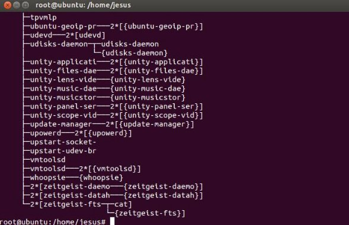
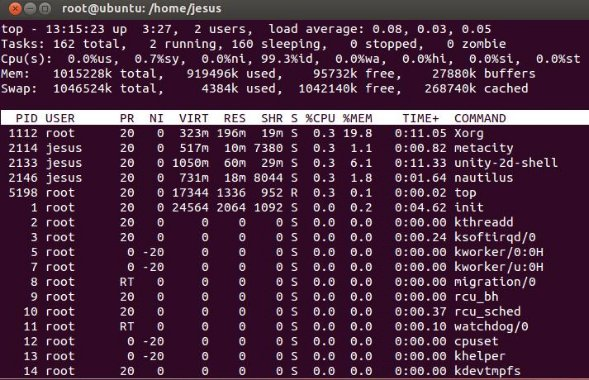

# Gestión de procesos en los Sistemas Opertivos.

## Gestión de procesos de Linux.

Un proceso en Linux es, en resumen, un programa en ejecución. Un proceso puede crear a su vez otros procesos. Al proceso que genera otro proceso se le llama proceso padre. Al proceso generado por otro proceso se le llama proceso hijo. Los procesos pueden ser padres e hijos y además, varios procesos pueden ser hijos del mismo padre a la vez. Veamos un ejemplo. 

!!! Note
    **El terminal o consola es un proceso**, ya que se trata de un programa que ejecutamos. Si en el terminal escribimos, por ejemplo, el comando “ls -l”, se estaría generando un nuevo proceso que sería proceso hijo del terminal. En este caso el shell sería el proceso padre y el comando “ls -l” sería el proceso hijo.

Resumen de comandos de manejo de procesos

<figure>
  
  <figcaption>Ejemplo de Multiprogramación</figcaption>
</figure>

### Trabajando con procesos. 

#### El comando ps.

El comando ps proporciona información sobre los procesos que se están ejecutando en el sistema.  Si  escribimos  en  el  terminal  `ps`,  obtendremos  como  salida  un  listado  de  los procesos lanzados con el usuario actual que aún se están ejecutando. 


Veamos qué significan cada una de las columnas que se muestran cuando ejecutamos el comando ps. 

- La primera columna es el **PID** o identificador de proceso. Cada proceso tiene un asociado identificador que es único, es decir que no puede haber dos procesos con el mismo identificador.
- La  segunda  columna  nos  informa  del  terminal  en  el  que  se  está  ejecutando  el proceso.  Si  aparece  una  interrogación  (?),  el  proceso  no  tiene  asociada  ninguna terminal.
- La tercera columna indica el tiempo total que ha estado ejecutándose el proceso. 
- La cuarta columna es el nombre del proceso.

En la imagen anterior observamos que hay dos procesos corriendo: el bash, que es el shell o intérprete de comandos, y el comando ps.

El comando ps admite algunos **parámetros/modificadores**:

**-e** devuelve un listado de todos los procesos que se están ejecutando. 

**-f** devuelve un listado extendido. En este último caso veremos en pantalla el **PPID** del proceso (identificador del proceso padre) y la hora en la que se ejecutó el proceso (STIME).


**-ef** obtendríamos un listado extendido de todos los procesos que se están ejecutando en el sistema. 

**-u**  informa  de  los  procesos  lanzado  por  un  determinado  usuario.  De  tal  forma  que  si escribimos “**ps -u alex**”, aparecerá un listado de los procesos que está ejecutando el usuario alex. 

#### El comando pstree

El comando pstree visualiza, en forma de árbol, todos los procesos del sistema. Así podemos ver las relaciones que existen entre los procesos. 



#### El comando top 

El comando top devuelve un listado de los procesos de forma parecida a como lo hace ps, con la diferencia que la información mostrada se va actualizando periódicamente lo que nos permite ver la evolución del estado de los procesos. Además, en la parte superior muestra información adicional, como el espacio en memoria ocupado por los procesos, el espacio ocupado por la memoria de intercambio o swap, el número total de tareas o procesos que se están ejecutando, el número de usuarios o el porcentaje de uso del procesador. 



!!! note
    - Mientras el comando top está en marcha podremos cambiar fácilmente la prioridad de los procesos. A modo de resumen cada proceso en Linux tiene un nivel de prioridad que va de -20 (prioridad más  alta)  hasta  20  (prioridad  más  baja).  
    - Cuanto  mayor  sea  el  nivel  de  prioridad,  más lentamente se ejecutará el proceso. 
    - ¿Y cómo podemos cambiar con top la prioridad de un proceso? Muy sencillo. Con el comando top en marcha pulsamos la tecla **"r"**. A continuación introducimos el PID del proceso al que vamos a cambiar la prioridad, y acto seguido el nivel de prioridad que vamos a asignar. Debemos tener en cuenta una consideración, solamente el superusuario **"root"** puede asignar valores negativos a la prioridad de un proceso. 

#### Procesos en primer plano y segundo plano

Los procesos pueden ejecutarse en primer plano o segundo plano. El proceso que está en primer plano es aquel con el que se interactúa. Si ejecutamos, por ejemplo, el comando `ls -l`, se  mostrará  por  pantalla  el  resultado,  y  hasta  que  no  acabe  de  mostrarse  el  listado  no podremos ejecutar ningún otro comando. En este caso el terminal permanece bloqueado, sin poder introducir ningún otro comando, hasta que el proceso en primer plano termine.

Pondremos un proceso en segundo plano añadiendo el símbolo ampersand (&) al final del comando. Cuando se ejecuta un proceso en segundo plano, se permite al usuario iniciar y trabajar con otros procesos. 

- Ejemplo: 

**$ sleep 10 &** 

El  comando  sleep  simplemente  espera  el  número  de  segundos  que  le  pasemos como parámetro.


En la imagen anterior se observa que al ejecutar un proceso en segundo plano se devuelve un número entre corchetes seguido de otro número. El número entre corchetes indica el número de procesos que se tienen ejecutándose en segundo plano. El segundo número es el PID o identificador del proceso. 

Para ver que trabajos se están ejecutando en segundo plano, se usa el comando **jobs**. 


El signo + seguido del número de trabajo entre corchetes indica el trabajo más reciente que se está ejecutando. El signo menos indica el siguiente trabajo más reciente. 

#### Pasar procesos en segundo plano a primer plano

Para pasar procesos en segundo plano a primer plano, se utiliza el comando fg, seguido de %n, donde n es el número de proceso que queremos pasar a primer plano. Por ejemplo, fg %1 pondría en primer plano la tarea número 1. En la siguiente imagen se ejecuta sleep 80 en segundo plano, y después pasa a primer plano con el comando fg. 


#### Pasar procesos en primer plano a segundo plano

El comando **bg** permite pasar procesos desde primer plano a segundo plano. Para pasar un proceso que se encuentra en primer plano a segundo plano, debemos suspenderlo primero utilizando la combinación de teclas Ctrl+Z. Cuando se pulsa esa combinación de teclas, el proceso en ejecución se para y no vuelve a ejecutarse hasta que se pasa a primer o segundo plano. Con bg pasaremos el proceso a segundo plano. 

#### Cambiando la prioridad de los procesos

Como  anteriormente  se  ha  comentado  antes,  cada  proceso  en  Linux  tiene  un  nivel  de prioridad que oscila entre -20 (prioridad más alta) y 20 (prioridad más baja). Cuanto mayor sea  el  nivel  de  prioridad,  más  lentamente  se  ejecutará  el  proceso.  **Solamente  el superusuario ‘root’ puede asignar valores negativos a la prioridad de un proceso.** 

Para asignar determinada prioridad a un proceso en concreto se utiliza el comando **nice**. 

##### nice prioridad proceso

Podemos cambiar la prioridad de un proceso con el comando **renice**. Este comando admite los siguientes parámetros/modificadores: 

- **-g**. Establece el nivel de prioridad de los procesos ejecutados por los miembros del grupo especificado. 
- **-u**. Establece el nivel de prioridad de los procesos ejecutados por los miembros del usuario especificado. 
- **-p**. Indica el nivel de prioridad para el proceso especificado. 

**Finalizar procesos** 

Para finalizar un proceso se utiliza el comando **kill**, que tiene la siguiente sintaxis: 

``` yaml
kill [parámetro] PID 
```

Si, por ejemplo, queremos eliminar un proceso con PID 17122, tendríamos que escribir: kill 17122.Puede  que  en  ocasiones  el  proceso  no  finalice  al  emplear  el  comando  kill  sin parámetros. Para matar un proceso asegurándonos de que no ignorará la petición de finalizar su ejecución se emplea el parámetro -9. 

``` yaml
kill -9 17122 
```

Hay un total de 32 señales que se pueden enviar a los procesos. Las más utilizadas son las siguientes: 

``` yaml
- kill -1 (Sighup). Reinicia el proceso. 
- kill -9 (SigKill). Mata el proceso. 
- kill -15 (SigTerm). Termina el proceso. 
```

Por otra parte, el comando **killall *nombre\_programa*** finaliza todos los procesos que estén ejecutando el programa.

## Gestión de procesos con Powershell.

#### Obtener procesos (Get-Process)

Para obtener los procesos que se están ejecutando en el equipo local, ejecute `Get-Process` sin parámetros.

Puede obtener determinados procesos especificando sus nombres de proceso o identificadores de proceso. El siguiente comando obtiene el proceso inactivo:

``` yaml
Get-Process -id 0
```

- La salida de este comando seria:

``` yaml
Handles  NPM(K)    PM(K)      WS(K) VM(M)   CPU(s)     Id ProcessName
-------  ------    -----      ----- -----   ------     -- -----------
      0       0        0         16     0               0 Idle
```

!!! Note
    Aunque es normal que los cmdlets no devuelvan datos en algunas situaciones, cuando se especifica un proceso por su id. de proceso `Get-Process`, genera un error si no encuentra ninguna coincidencia, porque la intención habitual consiste en recuperar un proceso en ejecución conocido. Si no hay ningún proceso con ese identificador, es probable que el identificador sea incorrecto o que el proceso de interés haya terminado:

``` yaml
Get-Process -Id 99
```

- La salida de este comando seria:

``` yaml
Get-Process : No process with process ID 99 was found.
At line:1 char:12
+ Get-Process  <<<< -Id 99
```

!!! Tip
    Puede usar el parámetro `Name` del cmdlet `Get-Process` para especificar un subconjunto de procesos basado en el nombre del proceso. El parámetro `Name` puede tomar varios nombres de una lista de nombres separados por comas y admite el uso de caracteres comodín, para que pueda escribir patrones de nombre.

- Por ejemplo, el siguiente comando obtiene el proceso cuyos nombres comienzan por "ex".

``` yaml
Get-Process -Name ex*

```

- La salida de este comando seria:

``` yaml
Handles  NPM(K)    PM(K)      WS(K) VM(M)   CPU(s)     Id ProcessName
-------  ------    -----      ----- -----   ------     -- -----------
    234       7     5572      12484   134     2.98   1684 EXCEL
    555      15    34500      12384   134   105.25    728 explorer

```

!!! Note
    Dado que la clase System.Diagnostics.Process de .NET es la base de los procesos de Windows PowerShell, sigue algunas de las convenciones usadas por System.Diagnostics.Process. Una de estas convenciones es que el nombre de proceso de un archivo ejecutable nunca incluya ".exe" al final del nombre del ejecutable.

- `Get-Process` también acepta varios valores para el parámetro Name.

``` yaml
Get-Process -Name exp*,power*
```

- La salida de este comando seria:

``` yaml
Handles  NPM(K)    PM(K)      WS(K) VM(M)   CPU(s)     Id ProcessName
-------  ------    -----      ----- -----   ------     -- -----------
    540      15    35172      48148   141    88.44    408 explorer
    605       9    30668      29800   155     7.11   3052 powershell

```

- Puede usar el parámetro ComputerName de `Get-Process` para obtener procesos en equipos remotos. Por ejemplo, el comando siguiente obtiene los procesos de PowerShell en el equipo local (representado por "localhost") y en dos equipos remotos.

``` yaml
Get-Process -Name PowerShell -ComputerName localhost, Server01, Server02

```

- La salida de este comando seria:

``` yaml
Handles  NPM(K)    PM(K)      WS(K) VM(M)   CPU(s)     Id ProcessName
-------  ------    -----      ----- -----   ------     -- -----------
    258       8    29772      38636   130            3700 powershell
    398      24    75988      76800   572            5816 powershell
    605       9    30668      29800   155     7.11   3052 powershell

```

Los nombres de equipo no son evidentes en esta presentación, pero se almacenan en la propiedad MachineName de los objetos de proceso que devuelve `Get-Process`. El siguiente comando usa el cmdlet `Format-Table` para mostrar el identificador de proceso y las propiedades ProcessName y MachineName(ComputerName) de los objetos de proceso.

``` yaml
Get-Process -Name PowerShell -ComputerName localhost, Server01, Server01 |
    Format-Table -Property ID, ProcessName, MachineName

```

- La salida de este comando seria:

``` yaml
  Id ProcessName MachineName
  -- ----------- -----------
3700 powershell  Server01
3052 powershell  Server02
5816 powershell  localhost

```

Este comando más complejo agrega la propiedad MachineName a la presentación estándar de `Get-Process`.

PowerShellCopiar

``` yaml
Get-Process powershell -ComputerName localhost, Server01, Server02 |
    Format-Table -Property Handles,
        @{Label="NPM(K)";Expression={[int]($_.NPM/1024)}},
        @{Label="PM(K)";Expression={[int]($_.PM/1024)}},
        @{Label="WS(K)";Expression={[int]($_.WS/1024)}},
        @{Label="VM(M)";Expression={[int]($_.VM/1MB)}},
        @{Label="CPU(s)";Expression={if ($_.CPU -ne $()){$_.CPU.ToString("N")}}},
        Id, ProcessName, MachineName -auto

```

- La salida de este comando seria:

``` yaml
Handles  NPM(K)  PM(K) WS(K) VM(M) CPU(s)  Id ProcessName  MachineName
-------  ------  ----- ----- ----- ------  -- -----------  -----------
    258       8  29772 38636   130         3700 powershell Server01
    398      24  75988 76800   572         5816 powershell localhost
    605       9  30668 29800   155 7.11    3052 powershell Server02

```

#### Detener procesos (Stop-Process)

- El cmdlet `Stop-Process` toma un nombre o un identificador para especificar un proceso que quiere detener. Su capacidad para detener procesos dependerá de sus permisos. Algunos procesos no se pueden detener. Por ejemplo, si intenta detener el proceso inactivo, obtendrá un error:

``` yaml
Stop-Process -Name Idle

```

- La salida de este comando seria:

``` yaml
Stop-Process : Process 'Idle (0)' cannot be stopped due to the following error:
 Access is denied
At line:1 char:13
+ Stop-Process  <<<< -Name Idle

```

También puede forzar la solicitud con el parámetro `Confirm`. Este parámetro es especialmente útil si se usa un carácter comodín al especificar el nombre del proceso, ya que accidentalmente podría coincidir con algunos procesos que no quiere detener:

``` yaml
Stop-Process -Name t*,e* -Confirm

```

- La salida de este comando seria:

``` yaml
Confirm
Are you sure you want to perform this action?
Performing operation "Stop-Process" on Target "explorer (408)".
[Y] Yes  [A] Yes to All  [N] No  [L] No to All  [S] Suspend  [?] Help
(default is "Y"):n
Confirm
Are you sure you want to perform this action?
Performing operation "Stop-Process" on Target "taskmgr (4072)".
[Y] Yes  [A] Yes to All  [N] No  [L] No to All  [S] Suspend  [?] Help
(default is "Y"):n

```

La manipulación de procesos complejos es posible si se usan algunos cmdlets de filtrado de objetos. Dado que un objeto Process tiene una propiedad Responding que es `true` cuando ya no responde, puede detener todas las aplicaciones que no respondan con el comando siguiente:

``` yaml
Get-Process | Where-Object -FilterScript {$_.Responding -eq $false} | Stop-Process

```

- Puede usar el mismo enfoque en otras situaciones. Por ejemplo, supongamos que una aplicación de área de notificaciones secundaria se ejecuta automáticamente cuando los usuarios inician otra aplicación. Es posible que esto no funcione correctamente en las sesiones de Terminal Services (Terminales de Servicios de Escritorio Remoto), pero lo quiera seguir manteniendo en las sesiones que se ejecutan en la consola del equipo físico. Las sesiones conectadas en el escritorio del equipo físico siempre tienen un identificador de la sesión 0, por lo que puede detener todas las instancias del proceso que están en otras sesiones mediante `Where-Object` y el proceso, **SessionId**:

``` yaml
Get-Process -Name BadApp | Where-Object -FilterScript {$_.SessionId -neq 0} | Stop-Process

```

El cmdlet `Stop-Process` no tiene un parámetro ComputerName. Por lo tanto, para ejecutar un comando para detener un proceso en un equipo remoto, debe usar el cmdlet `Invoke-Command`. Por ejemplo, para detener el proceso de PowerShell en el equipo remoto Server01, escriba:

``` yaml
Invoke-Command -ComputerName Server01 {Stop-Process Powershell}

```

#### Detener todas las demás sesiones de Windows PowerShell

- En ocasiones puede ser útil poder detener todas las sesiones de Windows PowerShell que se están ejecutando, excepto la sesión actual. Si una sesión usa demasiados recursos o es inaccesible (quizás se esté ejecutando de forma remota o en otra sesión de escritorio), es posible que no pueda detenerla directamente. Si intenta detener todas las sesiones que se están ejecutando, la sesión actual podría finalizar en su lugar.

- Cada sesión de Windows PowerShell tiene un PID de variable de entorno que contiene el identificador del proceso de Windows PowerShell. Puede comprobar el $PID con el identificador de cada sesión y finalizar solo las sesiones de Windows PowerShell que tengan un identificador diferente. El siguiente comando de canalización realiza esta acción y devuelve la lista de las sesiones finalizadas (debido al uso del parámetro `PassThru`):

``` yaml
Get-Process -Name powershell | Where-Object -FilterScript {$_.Id -ne $PID} |
    Stop-Process -PassThru

```

- La salida de este comando seria:

``` yaml
Handles  NPM(K)    PM(K)      WS(K) VM(M)   CPU(s)     Id ProcessName
-------  ------    -----      ----- -----   ------     -- -----------
    334       9    23348      29136   143     1.03    388 powershell
    304       9    23152      29040   143     1.03    632 powershell
    302       9    20916      26804   143     1.03   1116 powershell
    335       9    25656      31412   143     1.09   3452 powershell
    303       9    23156      29044   143     1.05   3608 powershell
    287       9    21044      26928   143     1.02   3672 powershell

```

#### Iniciar, depurar y esperar procesos

Windows PowerShell también incluye cmdlets para iniciar (o reiniciar) y depurar un proceso, así como para esperar a que un proceso se complete antes de ejecutar un comando. Se pueden realizar con los siguientes cmdlets.

- Start-Process
- Wait-Process
- Debug-Process
- Invoke-Command

### Actividades de desarrollo UD3_01 ShellScripting

305. Realiza un script de Shell que encuentre todos los procesos activos e imprima por pantalla al usuario la política de programación.

306. Modifica el script anterior para que de la opción al usuario de aumentar o disminuir la prioridad de un proceso, a elegir por el usuario ambas variables.

307. Modifica el script anterior para que de la opción al usuario de matar un proceso, a elegir por el usuario.

### Actividades UD03_02 PowerShell

308. Realiza un script en PoserShell que realice los siguientes puntos:

  - Cuenta el número de procesos en ejecución en el sistema, y los muestre por pantalla.
  - Ver que programas se ejcutan en el inicio de sesión y los muestre por pantalla.
  - Guardar los un listado de los procesos en un csv e Imprima por pantlla el archivo.

309. Realiza un script en PoserShell que realice los siguientes puntos:
  
  - Lista los procesos que tengan un alto consumo de CPU.
  - Detenga el proceso con mayor consumo.
  - Mostrar los procesos cuya zona de memoria para trabajar sea mayor que 100 MB y a continuación los detenga.
  