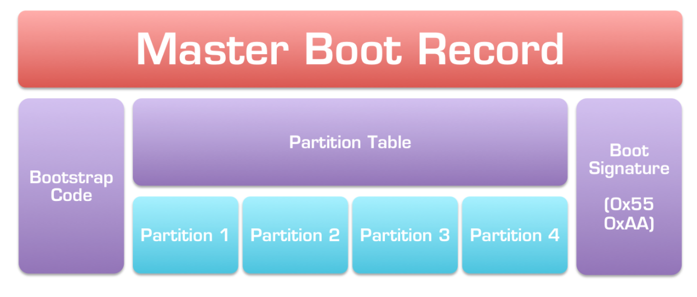
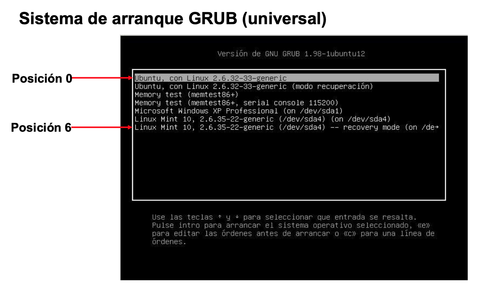
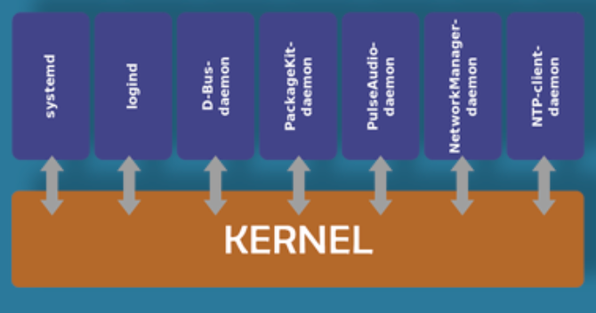

# Secuencia de arranque del sistema. Demonios y servicios.

En informática, el **arranque o secuencia de arranque** (en inglés: **bootstrapping, boot o booting**) es el proceso que inicia el gestor de arranque; programa ejecutado por el BIOS cuando se enciende una computadora. Se encarga de la **inicialización del sistema operativo y de los dispositivos**.

A nivel conceptual los pasos de arranque de un sistema informático se muestran en la siguiente figura:

<figure>
  
  <figcaption>Pasos Arranque</figcaption>
</figure>

## Arranque en Linux

En Linux, el flujo de control durante el arranque se desarrolla en 4 etapas:

1. Al principio, toma el control la BIOS.
2. En una segunda etapa, tomará el control el cargador de arranque.
3. En una tercera etapa, el control pasa al propio kernel Linux.
4. Y en la cuarta y última etapa tendremos en memoria los programas de usuario conviviendo junto con el propio sistema operativo, quienes tomarán el control del sistema.

<figure>
  
  <figcaption>Pasos Arranque Linux</figcaption>
</figure>

### 1ª etapa: La BIOS

Al encender el equipo, toma el control la BIOS que realiza una serie de operaciones básicas de hardware, programa **POST**. Una vez que el hardware es reconocido y queda listo para usar, la BIOS carga en memoria el código executable del cargador de arranque y le pasa el control.

### 2ª Etapa: Fase del cargador de arranque GRUB o LILO

Un cargador de arranque (**bootloader** en inglés) es un programa diseñado exclusivamente para cargar un sistema operativo en memoria. La etapa del cargador de arranque es diferente de una plataforma a otra.

!!! Note
    Como en la mayoría de arquitecturas este programa se encuentra en el **MBR** o **GPT**, el cual es de 512 bytes, este espacio no es suficiente para cargar en su totalidad un sistema operativo. **Por eso, el cargador de arranque consta de varias etapas. Las primeras operaciones las realiza la BIOS**. 

<figure>
  
  <figcaption>Esquema MBR</figcaption>
</figure>

<figure>
  
  <figcaption>Esquema GPT</figcaption>
</figure>

De forma general esta etapa tiene dos fases:

1. Se localiza **el sector de arranque (GPT o MBR)** y 

2. Se carga el cargador de este sector (normalmente una parte de **LILO o GRUB**).el cargador de arranque carga un mensaje que pregunta que sistema operativo (o tipo de sesión) el usuario desea inicializar. 

!!! note "Nota"
    El gestor incluye datos como la partición de arranque y la localización del kernel para cada uno, así como las opciones personalizadas en su caso.

#### GRUB

GRUB contiene una serie de **funciones** que lo convierten en el método favorito respecto al resto de gestores de arranque disponibles para la arquitectura x86; entre las que destacan

- **GRUB proporciona un verdadero entorno basado en comandos**, pre-sistema operativo.
- El GRUB puede leer particiones **ext2/3/4**. Esta funcionalidad le permite al GRUB acceder a su archivo de configuración, `/boot/grub/grub.conf`
- Posibilidad de utilizar una etapa **1.5** si fuera necesario; A veces esto sucede cuando la partición /boot/ se encuentra por encima de los 1024 cilindros de disco duro o cuando utiliza el modo LBA.
- Muestra el menú de inicio que permite al usuario elegir un **sistema operativo**, también examinar y modificar los parámetros de inicio.
- Contiene tres interfaces: un menú de selección, un editor de configuración, y una consola de línea de comandos.

**Un ejemplo de configuración en ubuntu se podría hacer desde:**

- `/boot/grub/grub.cfg `← Configuración general
- `/etc/default/grub `← Configuración menú
- `sudo update-grub `← Actualizar cambios

<figure>
  
  <figcaption>Ejemplo de GRUB</figcaption>
</figure>

<figure>
  
  <figcaption>Ejemplo de GRUB</figcaption>
</figure>

#### LILO

**LILO** es más antiguo a GRUB, es casi idéntico a GRUB en su proceso excepto que **no contiene una interfaz de línea de comandos**. Por lo tanto todos los cambios en su configuración deben ser escritos en el **MBR** y luego reiniciar el sistema. 

!!! warning
    **Un error en la configuración puede dejar el disco inservible** para el proceso de arranque hasta tal grado, que sea necesario usar otro dispositivo (disquete, etc) que contenga un programa capaz de arreglar el error.

#### Diferencias entre LILO y GRUB

- **LILO** no entiende los sistemas de archivos, por lo que utiliza desplazamientos de disco sin procesar y el BIOS para cargar los datos. Se carga el código del menú y, a continuación, en función de la respuesta, carga, o el sector MBR del disco de 512 bytes como en Microsoft Windows, o la imagen del núcleo Linux.
- **GRUB** por el contrario comprende los sistemas de archivos comunes ext2 , ext3 y ext4. Debido a que GRUB almacena sus datos en un archivo de configuración en vez de en el MBR y a que contiene un interfaz de línea de comandos, a menudo es más fácil rectificar o modificar GRUB si está mal configurado o corrupto.

### 3ª etapa: Fase del kernel

El kernel de Linux **se encarga de todos los procesos del sistema operativo**, como la gestión de memoria, planificador de tareas, I/O, comunicación entre procesos, y el control general del sistema.

- Este se carga en dos fases:

1. **Fase de carga**: En la primera etapa el kernel se carga y se descomprime en memoria, como un archivo imagen comprimido. El objetivo es cargar algunas funciones fundamentales como la gestión de memoria.
2. **Fase de ejecución**: **el kernel busca un proceso de inicio para ejecutar**, que (separadamente) fija un espacio de usuario y los procesos necesarios para un entorno del mismo. A continuación al nucleo se le permite pasar a inactivo, sujeto a las llamadas de otros procesos.

!!! Note "Nota"
    - El kernel generalmente se almacena en un archivo comprimido. Este archivo comprimido se carga y se descomprime en memoria. Por otra parte, también se cargan los drivers necesarios mediante el `initrd.` 
    - El `initrd` crea un sistema de archivos temporal usado en la fase de ejecución del kernel.

#### 4ª etapa: El proceso de inicio

- El trabajo de **Init es conseguir que todo funcione como debe ser**" una vez que el kernel está totalmente en funcionamiento. En esencia, establece y opera todo el espacio de usuario.

!!! Note "Importante"
    - Esto incluye la comprobación y montaje de sistemas de archivos, la puesta en marcha de los servicios de usuario necesarios y, en última instancia, cambiar al entorno de usuario cuando el inicio del sistema se ha completado.

- En un sistema Linux estándar, Init se ejecuta con un parámetro, conocido como nivel de ejecución, que tiene un valor entre 1 y 6, y que determina qué subsistemas pueden ser operacionales. Cada **nivel** de ejecución tiene sus propios **scripts** que codifican los diferentes procesos involucrados en la creación o salida del nivel de ejecución determinado, y son estas secuencias de comandos los necesarios en el proceso de arranque.

## Arranque de Windows y Windows Server

### Windows

- La secuencia de arranque de **Windows** utiliza el sistema de almacenamiento y configuración de arranque denominado **BCD** store (**Boot Configuration Data**). Este registro se encuentra situado en el directorio `\boot\BCD` de la partición donde se instala el sistema de forma oculta y en binario. Consiste en un repositorio de datos y parámetros necesarios para gestionar el arranque del sistema.

- El fichero `Bootmgr.exe` es el encargado del administrador y cargador de arranque (boot loader). 

- La secuencia de arranque sigue los siguientes pasos:

1. La BIOS carga el **MBR** (master boot record, registro de arranque principal es el primer sector de un dispositivo de almacenamiento de datos), en memoria el cual analiza la tabla de particiones y carga en memoria el **sector de arranque** de la partición marcada como activa en la que se encuentra el **S.O Windows**.
2. El **sector de arranque** localiza el `bootmgr` y se ejecuta, busca el directorio `\boot` que contiene los programas que inician el sistema.
3. Dentro del directorio se ejecuta el **BCD** apareciendo un menú en que se selecciona el sistema que se desea arrancar comenzando la carga del núcleo de sistema.

### Windows Server

En Windows Server se encuentan unas características avanzadas entre las que destacan:

- Usa un n**uevo almacén de datos** para los datos de configuración de arranque, `Boot.ini` sustituye al anterior cargador de Windows (`Ntldr.exe`). 
- Incluye también un administrador de arranque de Windows y un cargador de arranque de Windows nuevos.

A partir del Windows Server 2008, encontramos 3 aplicaciones de arranque:

- **Bootmgr.exe o Bootmgr.efi** (Arranque). Esta aplicación es independiente del sistema operativo y hace uso del firmware para cargar el cargador de arranque de Windows, ya sea desde una partición de disco concreta o a través de una conexión de red (si se trata de un arranque con acceso a red).

- **Winload.exe o Winload.efi** (Arranque). Esta aplicación forma parte del sistema operativo y carga una versión específica de Windows. Usa el firmware para cargar el kernel del sistema operativo, así como para iniciar los controladores de dispositivo críticos desde un disco duro local.

- **Winresume.exe o Winresume.efi** (Reanudación). El Cargador de reanudación de Windows encuentra una imagen de hibernación y, a continuación, usa el firmware para leer el archivo de hibernación en la memoria RAM y reanudar el sistema operativo en estado de hibernación.

<figure>
  
  <figcaption>Características Bootmgr</figcaption>
</figure>

- Podemos realizar el siguiente resumen del proceso de arranque:

  1. Se inicia la BIOS
  2. Se carga el MBR del disco
  3. Carga el sector de arranque
  4. Carga el Windows Boot Manager
  5. Lee desde el BCD, (Boot Configuration Data)
  6. Busca archivos de hibernación
  7. Inicia el programa Winload.exe, (carga el kernel del Sistema operativo)
  8. Inicia el programa ntoskrnl.exe, (imagen del kernel de Windows)
  9. Inicia el programa smss.exe, (administrador de secciones)
  10. Inicia el programa winlogon (valida la identificación del usuario en el sistema)
  11. Finaliza iniciando los servicios y la interface de login.

### Modificación Arranque.

Se puede **editar el arranque en Windows Server** ejecutando el comando `msconfig` y en la pestaña Arranque modificar las opciones del mismo. 

- El administrador y cargador del sistema de arranque se edita con el comando **bcdedit**.

!!! Example "Ejemplo"
    - Ejemplo de modificación de **bcdedit** -> [Enlace:Ejemplos de parametros usados en el editor BCDEdit.exe](https://ikastaroak.birt.eus/edu/argitalpen/backupa/20200331/1920k/es/ASIR/ISO/ISO02/es_ASIR_ISO02_Contenidos/3.1.EditorBCDedit.pdf)

!!! Example "Ejemplo Powershell"
    - Támbien mediante Powershell -> [Enlace:Modify Windows BCD using Powershell](https://www.codeproject.com/Articles/833655/Modify-Windows-BCD-using-Powershell)

## Daemon

**Daemon**, **servicio** o **programa residente** es es un tipo especial de programa que se ejecuta en segundo plano, en vez de ser controlado directamente por el usuario; **estos programas se encuentran cargados en memoria de forma permanente durante la ejecución del sistema operativo** y son los encargados de ofrecer un servicio al resto de programas o incluso otros demonios. Suelen iniciarse con el sistema operativo y se apagan con él.

Los daemon suelen tener las siguientes características:

- **No disponen de una "interfaz"** directa con el usuario, ya sea gráfica o textual.
- **No hacen uso de las entradas y salidas estándar para comunicar errores o registrar su funcionamient**o, sino que usan archivos del sistema en zonas especiales (`/var/log/` en los UNIX más modernos) o utilizan otros daemon especializados en dicho registro como el `syslogd`.

!!! Example "Ejemplo"
    Por ejemplo, una máquina que alberga un servidor web utilizará un daemon **httpd (HTTP Daemon)** para ofrecer el servicio y que los visitantes a dicha web puedan acceder.

!!! Info "Historia"
    Según una investigación realizada por **Richard Steinberg**, la palabra daemon fue utilizada en **1963** por primera vez, en el área de la informática, para denominar a un **proceso que realizaba backups en unas cintas**. Este proceso se utilizó en el proyecto **MAC** del **MIT**y en una computadora **IBM 7094**.

!!! Note "Nota"
    Los programas daemon reciben este nombre en los sistemas UNIX. En otros sistemas existen procesos similares como los `TSRs` de `MS-DOS` o los `servicios de Windows`.

<figure>
  
  <figcaption>Ejemplo Daemons</figcaption>
</figure>

### Systemd

**Systemd** es un conjunto de demonios o daemons de administración de sistema, bibliotecas y herramientas diseñados como una plataforma de administración y configuración central para interactuar con el núcleo del Sistema operativo GNU/Linux.

Características:

- Descrito por sus autores como un "**bloque de construcción básico**" para un sistema operativo.
- Se puede utilizar como un **sistema de inicio de Linux** (añadiendo el proceso `init` a su conjunto de procesos).
- El nombre `systemd` se adhiere a la convención Unix de distinguir los demonios fácilmente por tener la letra d como la última letra del nombre de archivo.
- Uno de los principales objetivos de `systemd` es unificar configuraciones básicas de **Linux** y los comportamientos de servicios en todas las distribuciones.

<figure>
  
  <figcaption>Inicio de systemd en Fedora 17</figcaption>
</figure>

!!! Info "Historia"
    - **Systemd** se desarrolló para reemplazar el sistema de inicio (`init`) heredado de los sistemas operativos estilo UNIX `System V` y `Berkeley Software Distribution (BSD)`.
    - La idea de diseño está pensada en proveer un **framework** que exprese las dependencias del servicio con la API de Linux, permite hacer más trabajo paralelamente al inicio del sistema y reducir la sobrecarga del shell.
    - Hacia **2015**, la mayoría de las principales distribuciones de Linux han adoptado systemd como su sistema de inicio predeterminado.

!!! Note "Nota"
    En el proceso de arranque en **Linux**, **es el primer proceso que se ejecuta en el espacio de usuario**, por lo tanto, también es el proceso padre de todos los procesos hijos en el espacio de usuario.

<figure>
  
  <figcaption>Arquitectura de Systemd</figcaption>
</figure>

el comando `systemctl`, que es la herramienta de administración central para controlar el sistema init. Explicaremos cómo administrar servicios, comprobar estados, cambiar estados del sistema y trabajar con los archivos de configuración.

En el siguiente enlace se puede observar un resumen de los comandos principales para [Administración de Servicios](Administración de servicios.md)

### Actividades UD03_03

310. En esta práctica se van a instalar **dos sistemas operativos** en una misma máquina virtual (y disco duro). Debemos crear un sistema de arranque que nos permita elegir el sistema operativo con el que deseamos arrancar nuestro equipo. Para ello, sigue los pasos que se describen a continuación.

- Crea una máquina virtual denominada “**Dual**”.
- Particiona el disco para contener un sistema operativo cliente de Microsoft, uno basado en GNU/Linux y dos particiones de datos, con los nombres `DOCUMENTOS` y `EXPEDIENTES` que podrán ser accedidas sea cual sea el sistema operativo que se arranque. Crea un esquema con las particiones, su tamaño y el sistema de archivos que se usará en cada caso. El particionado se realizará con el sistema MBR.
- Instala los sistemas operativos en el siguiente orden: Microsoft Windows 10 y Ubuntu Desktop.
- Al finalizar la instalación, debe quedar un menú de inicio con varios sistemas operativos. menú **GRUB**.
- Una vez instalados los sistemas operativos en el mismo disco duro, modifica el GRUB de para que el sistema operativo a iniciar por defecto sea el de Microsoft y que espere 15 segundos antes de iniciarlo. Realiza esta tarea en CLI.
- Modifica el GRUB de para que se inicie el sistema operativo de Ubuntu por defecto pero que el tiempo empleado sea de 5 segundos antes de iniciarlo.

Redacta un documento en el que indiques los pasos que sigues para realizar esta configuración.