# Acceso Remoto

La administración remota de sistemas operativos es fundamental en entornos empresariales y de infraestructura, permitiendo gestionar servidores y equipos desde cualquier ubicación de forma segura y eficiente. En esta unidad aprenderemos a instalar, configurar y utilizar diferentes servicios y herramientas que permiten el acceso y administración remota de sistemas, tanto en modo texto como gráfico.

## Propuesta didáctica

En esta unidad vamos a trabajar el **RA4 de ASO**:

> **RA4.** *Administra de forma remota el sistema operativo en red valorando su importancia y aplicando criterios de seguridad.*

### Criterios de evaluación (RA4)

A lo largo de la unidad se trabajarán y evidenciarán los siguientes criterios:

- **CE4a**: Se han descrito métodos de acceso y administración remota de sistemas.  
- **CE4b**: Se ha diferenciado entre los servicios orientados a sesión y los no orientados a sesión.  
- **CE4c**: Se han utilizado herramientas de administración remota suministradas por el propio sistema operativo.  
- **CE4d**: Se han instalado servicios de acceso y administración remota.  
- **CE4e**: Se han utilizado comandos y herramientas gráficas para gestionar los servicios de acceso y administración remota.  
- **CE4f**: Se han creado cuentas de usuario para el acceso remoto.  
- **CE4g**: Se han realizado pruebas de acceso y administración remota entre sistemas heterogéneos.  
- **CE4h**: Se han utilizado mecanismos de encriptación de la información transferida.  
- **CE4i**: Se han documentado los procesos y servicios del sistema administrados de forma remota.

## Contenidos

**Bloque 1 — Acceso remoto en modo texto (Sesión 1–2)**
- Introducción a los servicios de acceso remoto.  
- Terminales en modo texto: Telnet, Rlogin, SSH.  
- Protocolo SSH: características, funcionamiento y establecimiento de conexión.  
- Autenticación: usuario/contraseña y claves públicas/privadas.  
- Tunelización y port-forwarding.  
- OpenSSH: instalación y configuración.  
- Clientes SSH: gráficos y consola.  
- Funcionalidades adicionales: SCP y SFTP.

**Bloque 2 — Escritorio remoto (Sesión 2–3)**
- Protocolos de escritorio remoto: RDP y VNC.  
- Configuración de xRDP en Ubuntu 24.04.  
- Configuración de RDP en Windows 11.  
- RemoteApp: características y casos de uso.

**Bloque 3 — Herramientas gráficas externas (Sesión 3–4)**
- RealVNC: instalación y configuración.  
- TeamViewer: características y uso.  
- AnyDesk: acceso remoto multiplataforma.  
- Apache Guacamole: puerta de enlace sin cliente.

!!! question "Actividades iniciales"
    1. ¿Qué diferencia existe entre Telnet y SSH en cuanto a seguridad?
    1. ¿Qué puerto utiliza por defecto el protocolo SSH?
    1. Explica brevemente qué es la tunelización SSH.
    1. ¿Qué protocolos se utilizan para escritorio remoto?
    1. Nombra al menos tres herramientas gráficas para administración remota.
    1. ¿Qué ventajas ofrece la autenticación por claves públicas/privadas frente a usuario/contraseña?
    1. ¿Qué es RemoteApp y cuándo es útil su implementación?
    1. Explica la diferencia entre SCP y SFTP.

### Programación de Aula (5 sesiones)

Esta unidad se imparte con una duración estimada de 5 sesiones lectivas:

#### Sesiones 1-3: Acceso remoto en modo texto y túneles SSH

| Sesión | Contenidos | Actividades | Criterios trabajados |
| --- | --- | --- | --- |
| 1  | **Teoría:** Introducción a servicios de acceso remoto. Terminales en modo texto: Telnet, Rlogin, SSH. Protocolo SSH: características, funcionamiento y establecimiento de conexión. | Explicación teórica | CE4a, CE4b, CE4c, CE4h |
| 2  | **Teoría:** Autenticación SSH: usuario/contraseña y claves públicas/privadas. Tunelización y port-forwarding. OpenSSH: instalación y configuración. Clientes SSH y funcionalidades adicionales (SCP y SFTP). | Explicación teórica | CE4a, CE4c, CE4d, CE4e, CE4h |
| 3  | **Práctica:** Configuración de túneles SSH con Docker. Implementación y documentación de la práctica PR301. | [PR301](PracticaSSHtunnelingDocker.md) | CE4a, CE4c, CE4d, CE4e, CE4h, CE4i |

#### Sesiones 4-5: Escritorio remoto en Windows Server (AWS)

| Sesión | Contenidos | Actividades | Criterios trabajados |
| --- | --- | --- | --- |
| 4  | **Práctica:** Creación de instancia Windows Server en AWS. Configuración de acceso remoto (RDP). Configuración inicial y conexión. | [PR302](#) | CE4a, CE4d, CE4e, CE4f, CE4g, CE4i |
| 5  | **Práctica:** Administración remota de Windows Server vía RDP. Configuración avanzada y documentación de la práctica PR302. | [PR302](#) (continuación) | CE4a, CE4c, CE4d, CE4e, CE4f, CE4g, CE4i |

---

## Introducción

En la mayoría de los casos, los servidores y máquinas que necesitamos gestionar no comparten el mismo espacio físico. Como por ejemplo servidores que estén ubicados en:

- Diferentes departamentos de una empresa
- Centros de proceso de Datos (CPD) generales
- Computación en la nube

Para poder acceder a ellos existen servicios, métodos y herramientas, que se detallan a continuación.

## Terminales en modo texto

Una de las formas de administrar de forma remota es instalar un servidor que permita el acceso en forma de terminal de texto. Estos programas permiten acceder al equipo vía red utilizando un nombre de usuario y contraseña como si estuviésemos accediendo de forma local al mismo. Entre los diferentes servicios de este tipo destacan:

- **Telnet:** basado en el protocolo del mismo nombre. Este protocolo utiliza por defecto el puerto 23. **El problema de este es que la información viaja por la red sin cifrar**, con la correspondiente falta de seguridad.

- **Rlogin (Remote Login):** es una aplicación TCP/IP que comienza una sesión de terminal remoto sobre el anfitrión especificado como host. El anfitrión remoto debe hacer funcionar un servicio de Rlogind (o demonio) para que el Rlogin conecte con el anfitrión. Utiliza un mecanismo estándar de autorización de los Rhosts.

- **SSH (Secure Shell):** Este protocolo permite poder acceder a otro ordenador a través de una red para ejecutar comandos en esa máquina, controlarla de manera remota e intercambiar archivos entre ambas. Ofrece una autenticación muy potente y comunicaciones seguras en canales no protegidos.

A continuación se entra más en detalle en este último.

### SSH

#### Características principales

- Utiliza el **puerto 22** TCP para el establecimiento de las conexiones.
- Una vez establecida la conexión podremos ejecutar las órdenes como si se tratara de una terminal local.
- Está implementado para la mayoría de sistemas operativos existentes; Windows, linux, OSX,...
- Proporciona mecanismo para asegurar la **autenticación, integridad y confidencialidad de la información**.
    - **Autenticación:** Después de la primera conexión, el cliente puede conocer que se está conectando al mismo servidor en futuras sesiones: conexiones de confianza.
    - **Confidencialidad**: Todos los datos que se envían y se reciben durante la conexión son cifrados.
    - **Integridad:** Proporciona mecanismos para asegurar que la información enviada no es manipulada por un tercero

Además destaca por:

- Permitir copiar datos de forma segura (tanto archivos sueltos como simular sesiones FTP cifradas).
- Gestionar claves **RSA** para no escribir contraseñas al conectar a los dispositivos. 
- Pasar los datos de cualquier otra aplicación por un canal seguro tunelizado.  
- Basado en arquitectura **cliente-servidor**

<figure>
  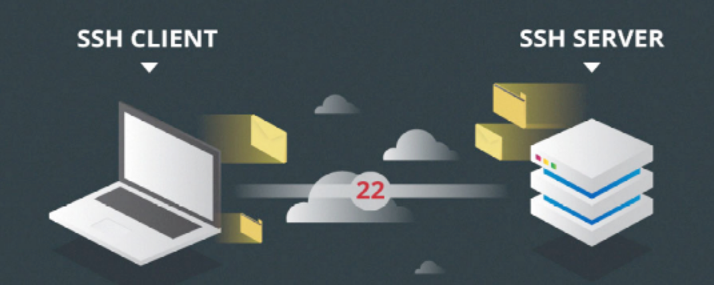
  <figcaption>SSH Cliente-Servidor</figcaption>
</figure>

#### Funcionamiento

Se basa en la **Criptografía** (Técnica utilizada para convertir un texto claro en otro cuyo contenido es igual al anterior pero solo puede ser decodificado por personas autorizadas.) SSH utiliza varios algoritmos de encriptación y autenticación.

- Para establecer la conexión con la máquina remota utiliza algoritmos de **encriptación asimétrica**.
- Para la transferencia de datos utiliza algoritmos de **encriptación simétrica**, que son más rápidos.

**1. Encriptación simétrica**

Los algoritmos de criptografía simétrica son los que utilizan la misma clave tanto para el proceso de cifrado como para el descifrado del mensaje. Los más utilizados: **DES, 3DES, AES, IDEA y Blowfish**

<figure>
  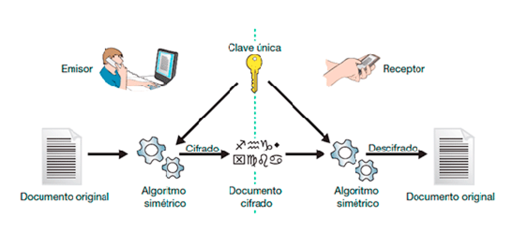
  <figcaption>Esquema Encriptación Simétrica</figcaption>
</figure>

!!! note "Nota"
    **Problema: Intercambio de claves.**

**2. Encriptación Asimétrica**

Utiliza dos claves matemáticamente relacionadas de manera que lo que ciframos con una (**clave pública**) sólo puede descifrarse con la segunda (**clave privada**).

- Algunos algoritmos representativos son: **RSA**, y **DSA**

<figure>
  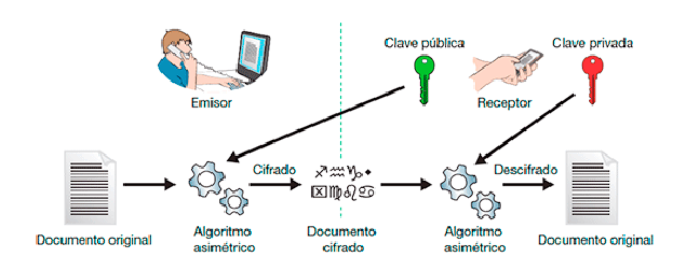
  <figcaption>Esquema Encriptación Asimétrica</figcaption>
</figure>

#### Establecimiento de conexión

1. El cliente abre una conexión **TCP** en el **puerto 22** del servidor.
2. Cliente y servidor negocian qué **versión SSH** van a utilizar y determinan el algoritmo de **criptografía simétrica** a utilizar.
3. El **servidor envía** su **clave pública** al cliente:
    - Si es la primera vez la guardará para futuras conexiones.
    - En caso contrario la compara con la que ya tenía guardadas para la IP de conexión (Autenticación del servidor) 
4. El cliente **genera una clave de sesión aleatoria mediante el algoritmo seleccionado** en el primer paso y la **envía al servidor cifrando con la clave pública** del mismo.
5. El resto de comunicaciones se hará utilizando esta clave compartida y será indescifrable.
6. A partir de aquí se llevará a cabo la **autenticación del usuario** y la transmisión de información/órdenes a ejecutar en la máquina remota

<figure>
  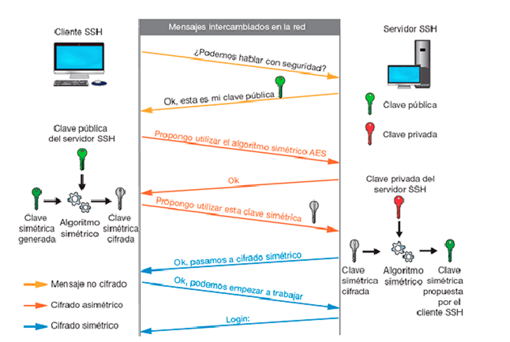
  <figcaption>Esquema del establecimiento de conexión</figcaption>
</figure>

#### Autentificación del cliente

Puede llevarse a cabo de **2 formas**: 

1. **Usuario y contraseña**: Aunque las credenciales van cifradas, es menos seguro ya que es más propenso a ataques de fuerza bruta.

!!! tip "CONSEJO"
    Tendremos que utilizar sistemas de detección de intrusos como **[fail2ban](https://es.wikipedia.org/wiki/Fail2ban)**, esta aplicación busca en los registros (logs) de los programas que se especifiquen las reglas que el usuario decida para poder aplicar una penalización. La penalización puede ser bloquear la aplicación que ha fallado en un determinado puerto, bloquearla para todos los puertos, etc. Las penalizaciones, así como las reglas, son definidas por el usuario.

2. **Clave pública/privada**: 

    - Cuando el cliente se conecta al servidor, le informa de **la clave pública que va a utilizar**.
    - Si el servidor la tiene en **su almacén de claves autorizadas (authorized_keys)**, enviará un mensaje aleatorio cifrado con la clave pública que, si el cliente es capaz de descifrar, quedará autenticado.
    - El **cliente decodificará el mensaje** con la clave privada y lo enviará al servidor decodificado.

<figure>
  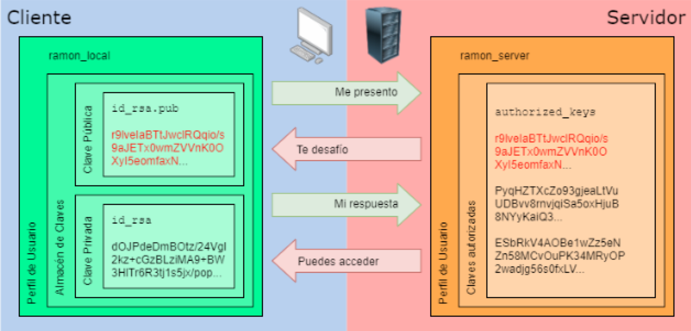
  <figcaption>Esquema Autentificación Clave pública/privada</figcaption>
</figure>

> **Recursos de apoyo**

<figure style="width: 100%; margin: 0; padding: 0;">
  <div style="position: relative; width: 100%; padding-bottom: 56.25%; height: 0; overflow: hidden;">
    <iframe src="https://www.youtube.com/embed/uiZaTHQTfPE" title="SSH: Pairs de Claves - Seguridad y Autenticación (2021)" frameborder="0" allow="accelerometer; autoplay; clipboard-write; encrypted-media; gyroscope; picture-in-picture; web-share" allowfullscreen style="position: absolute; top: 0; left: 0; width: 100%; height: 100%;"></iframe>
  </div>
  <figcaption>Video tutorial: SSH - Pares de claves, Seguridad y Autenticación</figcaption>
</figure>


#### Tunelización

El **SSH Tunneling** permite crear un canal cifrado punto a punto para transportar tráfico entre dos extremos, incluso a través de redes no confiables. Se apoya en el **Port-forwarding**, que toma los datos en un extremo del túnel y los reenvía de forma segura al otro:

- **Port-forwarding local (-L)**: expone en la máquina cliente un puerto que llega a un servicio remoto.  
  - Ej.: `ssh -L 8080:servidor_remoto:80 usuario@servidor_remoto`
- **Port-forwarding remoto (-R)**: expone en el servidor un puerto que llega a un servicio local del cliente.  
  - Ej.: `ssh -R 0.0.0.0:1081:localhost:3000 usuario@servidor`
- **Port-forwarding dinámico (-D)**: crea un proxy SOCKS para redirigir tráfico de forma flexible.  
  - Ej.: `ssh -D 1080 usuario@servidor`

<!-- En la práctica **PR301** usamos **-R** para que un servicio local (puerto 3000 del host) sea accesible a través del puerto 1081 en la máquina virtual que simula el VPS. Usar `0.0.0.0` en lugar de `*` evita problemas de interpretación del asterisco en shells como zsh o fish y expone el puerto en todas las interfaces del servidor. -->

<figure>
  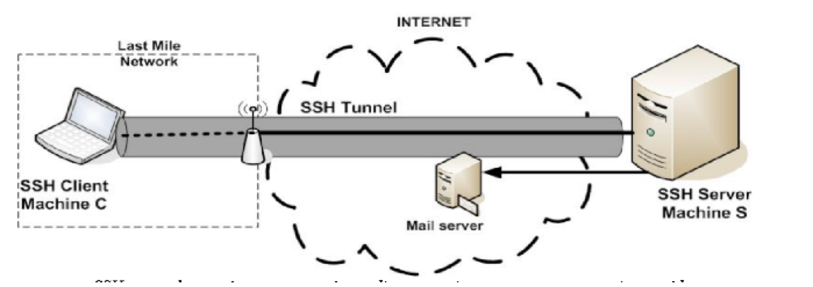
  <figcaption>Esquema SSH-Tunnel</figcaption>
</figure>

!!! example "Ejemplos"
    - Reenvío local: `ssh -L 8080:servidor_remoto:80 usuario@servidor_remoto`
    - Reenvío remoto (PR301): `ssh -R 0.0.0.0:1081:localhost:3000 mv-tunnel`
    - Proxy SOCKS: `ssh -D 1080 usuario@servidor`

<figure>
  
  <figcaption>Visualización: Tipos de túneles SSH – fuente: iximiuz.com</figcaption>
</figure>


> **Recursos de apoyo**

<figure style="width: 100%; margin: 0; padding: 0;">
  <div style="position: relative; width: 100%; padding-bottom: 56.25%; height: 0; overflow: hidden;">
    <iframe src="https://www.youtube.com/embed/AtuAdk4MwWw" title="SSH Tunneling Explained" frameborder="0" allow="accelerometer; autoplay; clipboard-write; encrypted-media; gyroscope; picture-in-picture; web-share" allowfullscreen style="position: absolute; top: 0; left: 0; width: 100%; height: 100%;"></iframe>
  </div>
  <figcaption>Video tutorial: SSH Tunneling Explained - NetworkChuck (2021)</figcaption>
</figure>

!!! tip "Otros recursos recomendados"
    - **NetworkChuck - SSH Tunneling Explained**: Explicación clara y profesional de los conceptos de SSH tunneling con ejemplos prácticos de port forwarding local y remoto.
    - **LearnLinuxTV - SSH Port Forwarding**: Tutorial detallado sobre port forwarding con casos de uso reales.
    - **Corey Schafer - SSH Tutorial**: Guía completa sobre SSH incluyendo tunneling, port forwarding y mejores prácticas de seguridad.

#### Clientes SSH

Podemos clasificarlos en: clientes gráficos y de consola.

**1. Gráficos**

- Putty → El más utilizado

<figure>
  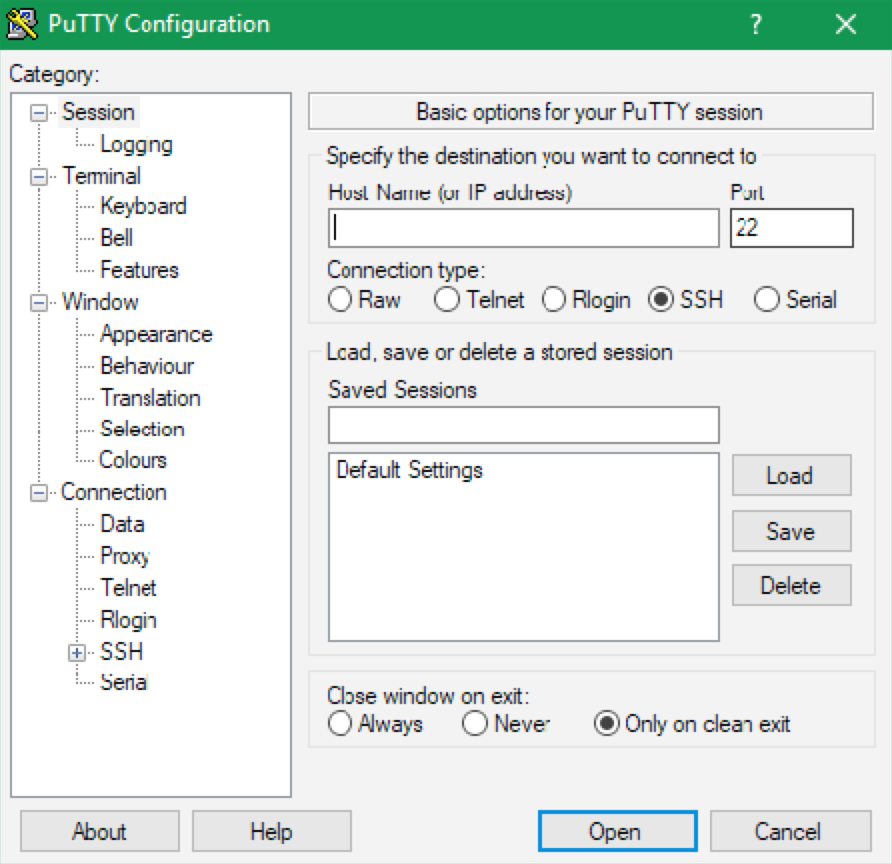
  <figcaption>Ejemplo Putty</figcaption>
</figure>

**2. Terminal/Consola**

- CMD
- Los sistemas operativos **LIKE-UNIX** disponen de un cliente ssh en modo consola pre-instalado

<figure>
  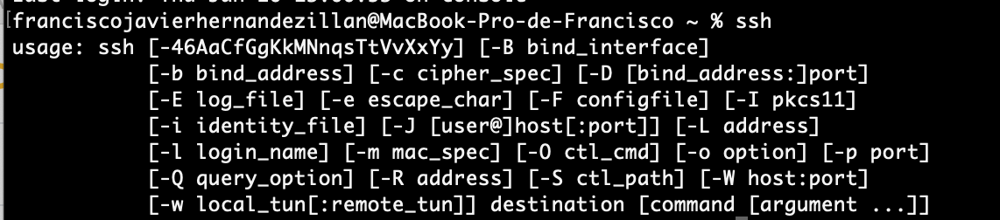
  <figcaption>Ejemplo ssh preinstalado</figcaption>
</figure>

!!! example "Ejemplos comandos de uso cliente consola"
    - Conexión a una máquina remota: `ssh usuario@ejemplo.servidor.es`
    - Ejecutar una orden sin conectarse: `ssh ejemplo.servidor.es comando`  `ssh serdis.dis.ulpgc.es ls ./`

#### OpenSSH

**OpenSSH** es un conjunto de aplicaciones que permiten realizar comunicaciones cifradas a través de una red, usando el protocolo SSH. 

- Fue creado como una alternativa libre y abierta al programa Secure Shell, que es software propietario. 
- Se trata de un proyecto de **código abierto y licencia libre** para su utilización para cualquier propósito.
- Es compatible con los protocolos **SSH1** (No seguro) y **SSH2**.
- Está disponible para plataformas **Gnu/linux** y **Windows**, así como **Unix**, **Mac**, **Solaris** o **AIX**

<figure>
  
  <figcaption>Logo OpenSSH</figcaption>
</figure>

#### Funcionalidades adicionales

- Permite la copia de archivos de la máquina local a la máquina remota o a la inversa mediante securecopy (SCP).

!!! example "Ejemplos"
    - Transferir un archivo local a un sistema remoto: `scp archivo_local usuario@servidor: / archivo_remoto`
    - Transferir un archivo remoto a un sistema local: `scp usuario@servidor:/archivo_remoto /archivo_local`  
    - Especificar múltiples archivos: `scp /dir_local/* usuario@servidor:/dir_remoto/`

- Incluye soporte completo para **SFTP (SSHftp)**: Sin embargo, se trata de un protocolo totalmente diferente a FTP, y está disponible a partir de la versión 2.5.

!!! example "Ejemplos"
    - `sftp usuario1@servidor.dominio.es`
    - A continuación se ejecutarían comandos como: **put, get, rm, ls, lpwd, ...**

## Escritorio remoto

Se habla de escritorio remoto cuando un usuario se conecta a un equipo desde otro utilizando la red y además se conecta al entorno gráfico de este. Se suele utilizar para realizar administración remota del equipo. 

La mayoría de los sistemas operativos tienen incorporada alguna utilidad para la conexión en entorno gráfico de forma remota. En algunos casos, el usuario desde el equipo local controla el equipo remoto y el usuario de este puede ver lo que se está haciendo en él.

Para esto se utilizan diferentes protocolos. Para cualquiera de ellos tendremos dos partes:

- La parte del servidor que se instalará en el equipo a controlar remotamente.
- La parte cliente, que se instala en el equipo local desde el que se quiere acceder al equipo remoto.

Los protocolos que pueden usarse son:

- **RDP**: protocolo de acceso a escritorio remoto (Remote Desktop Protocol). Se utiliza principalmente en Windows, aunque puede instalarse en Linux si la máquina que tiene este sistema operativo debe ser accedido por medio de escritorio remoto desde un equipo Windows.
- **VNC**: (Virtual Network Computer): Se utiliza en distintas plataformas para proveer de un escritorio remoto a cualquier equipo.

### Escritorio remoto en Ubuntu 24.04 con xRDP

**xRDP** es una implementación gratuita y de código abierto del servidor Microsoft RDP que permite que los sistemas operativos distintos de Microsoft Windows proporcionen una experiencia de escritorio remoto totalmente funcional y compatible con RDP.

En Ubuntu 24.04, el proceso de instalación y configuración es similar a versiones anteriores, pero con algunas mejoras en la compatibilidad y estabilidad.

- Para instalar xRDP utilizaremos:

```bash
sudo apt update
sudo apt install xrdp -y
```

!!! note "**NOTA:**"
    Se añade el argumento `-y` para contestar automáticamente de manera afirmativa a cualquier pregunta que se nos haga durante la instalación. Es recomendable ejecutar `apt update` antes de instalar para asegurar que tenemos los paquetes más recientes.

- Automáticamente se habrá iniciado el servicio, para comprobarlo se puede ejecutar el siguiente comando:

```bash
sudo systemctl status xrdp
```

<figure>
  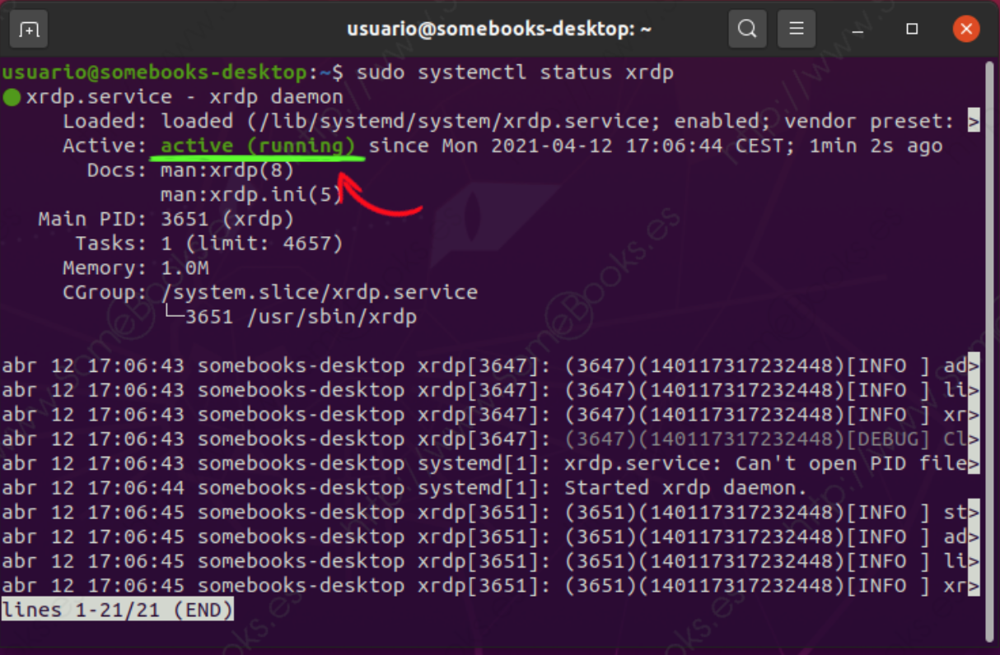
  <figcaption>xRDP en ejecución</figcaption>
</figure>

- Cuando se instala xrdp, se crea también en el sistema una nueva cuenta de usuario llamada, precisamente, `xrdp`. Además, se crea un certificado SSL, en el archivo `ssl-cert-snakeoil.key`, dentro de la carpeta `/etc/ssl/private/`.

A continuación, se debe añadir el usuario `xrdp` al grupo `ssl-cert` para lograr que el usuario pueda leer el certificado. Lo haremos con la siguiente orden:

```bash
sudo adduser xrdp ssl-cert
```

<figure>
  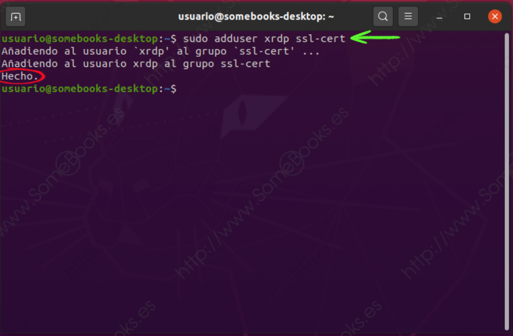
  <figcaption>usuario xrdp al grupo ssl-cert</figcaption>
</figure>

- Un problema frecuente en Ubuntu 24.04 al usar el escritorio remoto desde otro equipo que no sea Ubuntu es encontrar la pantalla en negro o problemas con el entorno gráfico.

Para resolverlo, debemos editar el archivo `/etc/xrdp/startwm.sh`. Primero, hacemos una copia de seguridad:

```bash
sudo cp /etc/xrdp/startwm.sh /etc/xrdp/startwm.sh.backup
```

Luego editamos el archivo:

```bash
sudo nano /etc/xrdp/startwm.sh
```

<figure>
  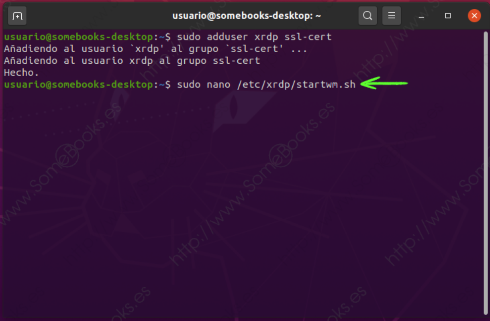
  <figcaption>edición /etc/xrdp/startwm.sh I</figcaption>
</figure>

- Hacia el final del archivo, antes de las líneas que ejecutan el gestor de ventanas, añadimos las siguientes líneas:

<figure>
  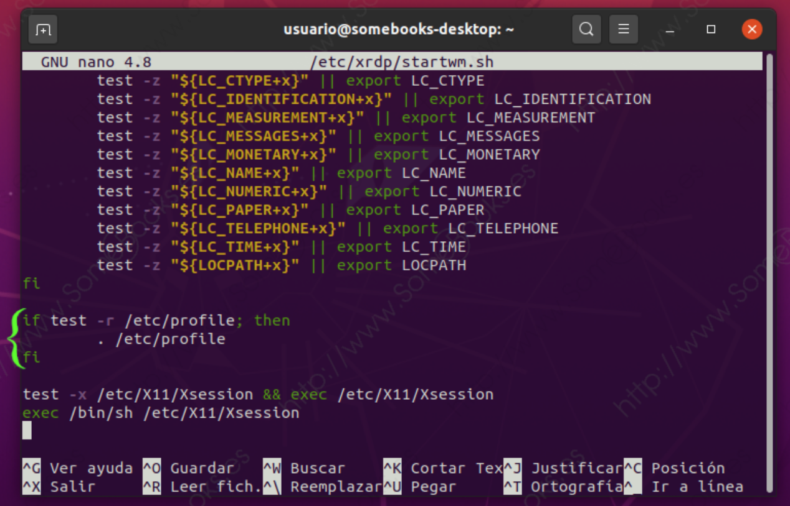
  <figcaption>edición /etc/xrdp/startwm.sh II</figcaption>
</figure>

```bash
unset DBUS_SESSION_BUS_ADDRESS
unset XDG_RUNTIME_DIR
```

<figure>
  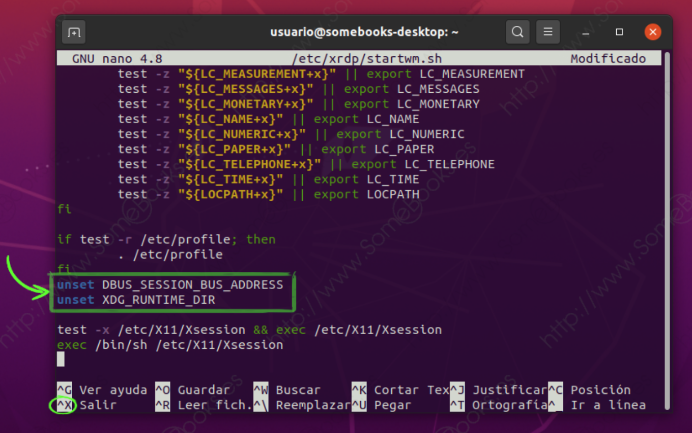
  <figcaption>edición /etc/xrdp/startwm.sh III</figcaption>
</figure>

- Después de guardar los cambios, reiniciamos el servicio xRDP:

```bash
sudo systemctl restart xrdp
```

!!! tip "**CONSEJO:**"
    En Ubuntu 24.04, si utilizas el entorno de escritorio Wayland (por defecto en algunas instalaciones), es posible que necesites cambiar a X11 para que xRDP funcione correctamente. Puedes verificar tu sesión con `echo $XDG_SESSION_TYPE` y cambiar a X11 si es necesario.

### Escritorio remoto en Windows 11

Para configurar el Escritorio Remoto en Windows 11 se deben realizar los siguientes pasos:

1. Abrir la aplicación **Configuración** de Windows 11. Puedes hacerlo de varias formas:

   - Presionar `Windows + I` (atajo de teclado)
   - Hacer clic derecho en el botón **Inicio** y seleccionar **Configuración**
   - Buscar "Configuración" en el menú Inicio

2. En la ventana de Configuración, navegar a **Sistema** → **Escritorio remoto** (en el panel izquierdo).

<figure>
  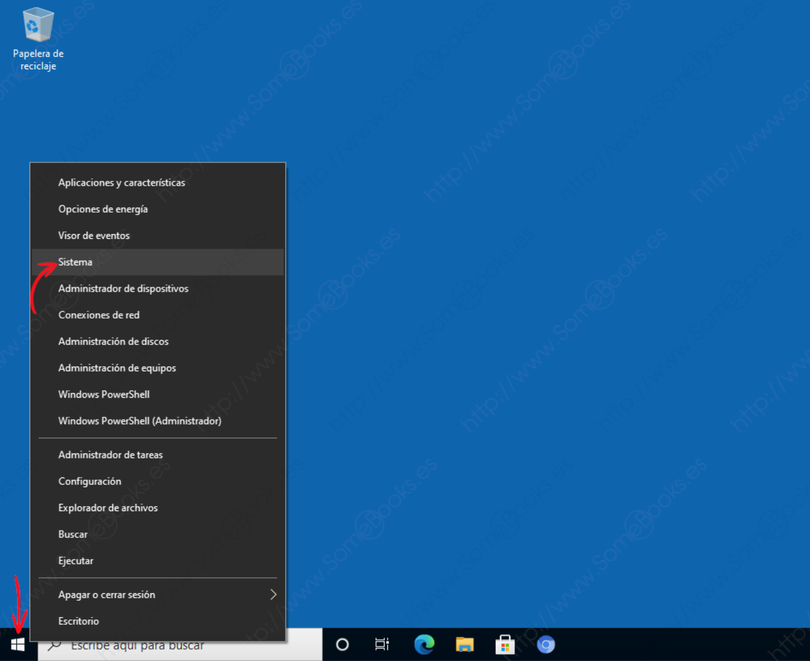
  <figcaption>Configuración Escritorio Remoto Windows 11 I</figcaption>
</figure>

!!! note "**NOTA:**"
    Se debe tener en cuenta que el escritorio remoto no está disponible en la versión Home de Windows 11, por lo que se necesita, como mínimo, una versión Pro, Enterprise o Education.

3. En el panel derecho, encontrarás la opción **Escritorio remoto**. Activa el interruptor para habilitar el escritorio remoto.

<figure>
  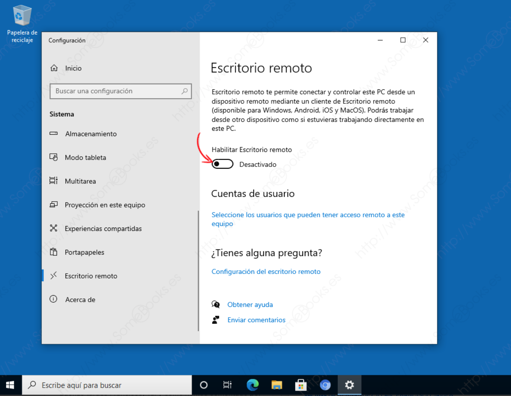
  <figcaption>Configuración Escritorio Remoto Windows 11 II</figcaption>
</figure>

!!! note "**NOTA:**"
    Al activarlo, aparecerá información indicando que podrás acceder al escritorio de este equipo desde otro dispositivo, independientemente del sistema operativo que utilice. Windows 11 también mostrará el nombre del equipo y la dirección IP para facilitar la conexión.

4. Como se trata de una situación potencialmente peligrosa desde el punto de vista de seguridad, el sistema puede mostrar una advertencia. Se debe confirmar la configuración si aparece algún mensaje de seguridad.

<figure>
  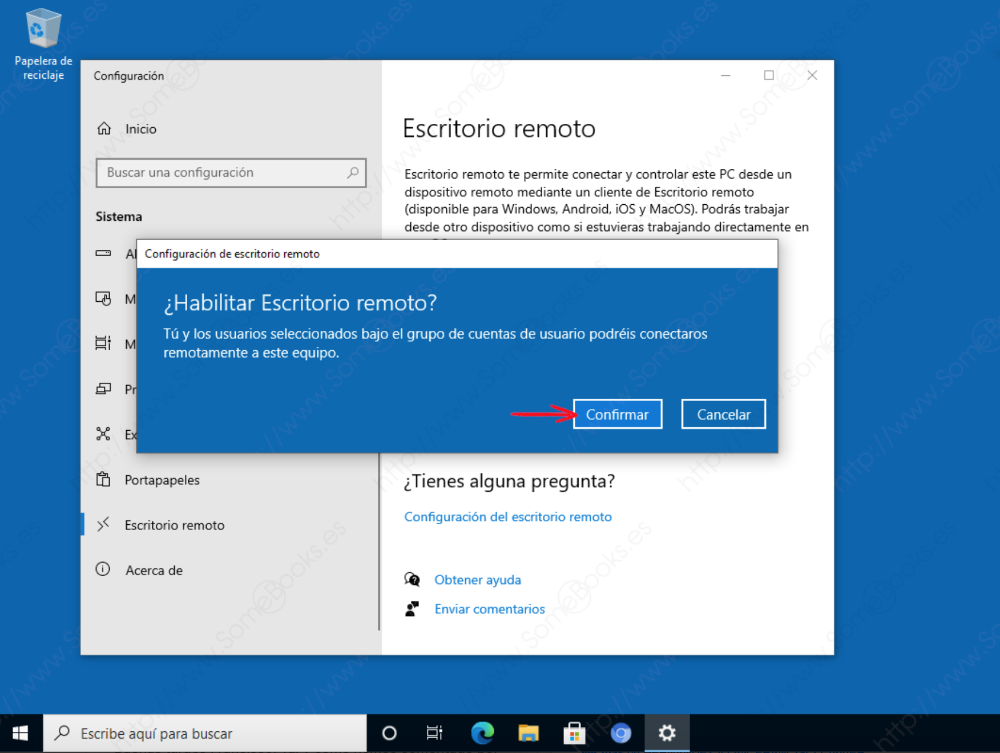
  <figcaption>Configuración Escritorio Remoto Windows 11 III</figcaption>
</figure>

#### Añadir los usuarios autorizados

Una vez habilitado el escritorio remoto, más abajo en la misma ventana existe la opción para elegir, entre los usuarios definidos en el sistema, aquellos que podrán hacer uso del escritorio remoto.

- Haz clic en el botón **Seleccionar usuarios que pueden tener acceso remoto a este equipo**.

<figure>
  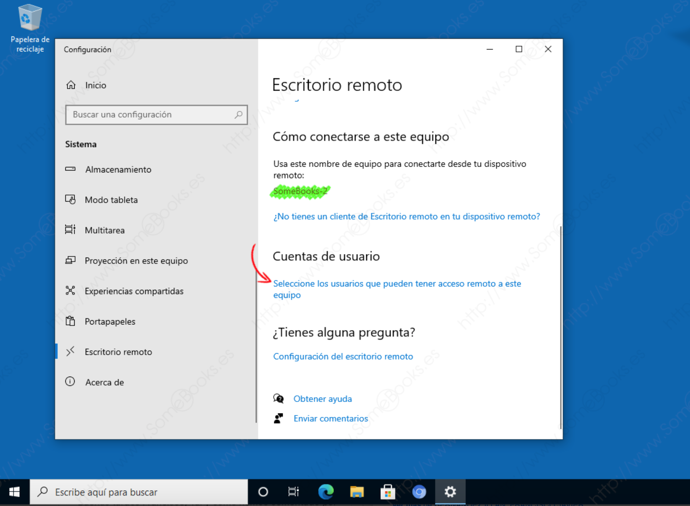
  <figcaption>Configuración Escritorio Remoto Windows 11 IV</figcaption>
</figure>

- Esto abrirá una nueva ventana con los usuarios que están habilitados en ese momento (como se acaba de activar, aún no hay ninguno). Aquí se puede añadir o quitar usuarios de la lista haciendo clic en **Agregar...** o **Quitar**.

<figure>
  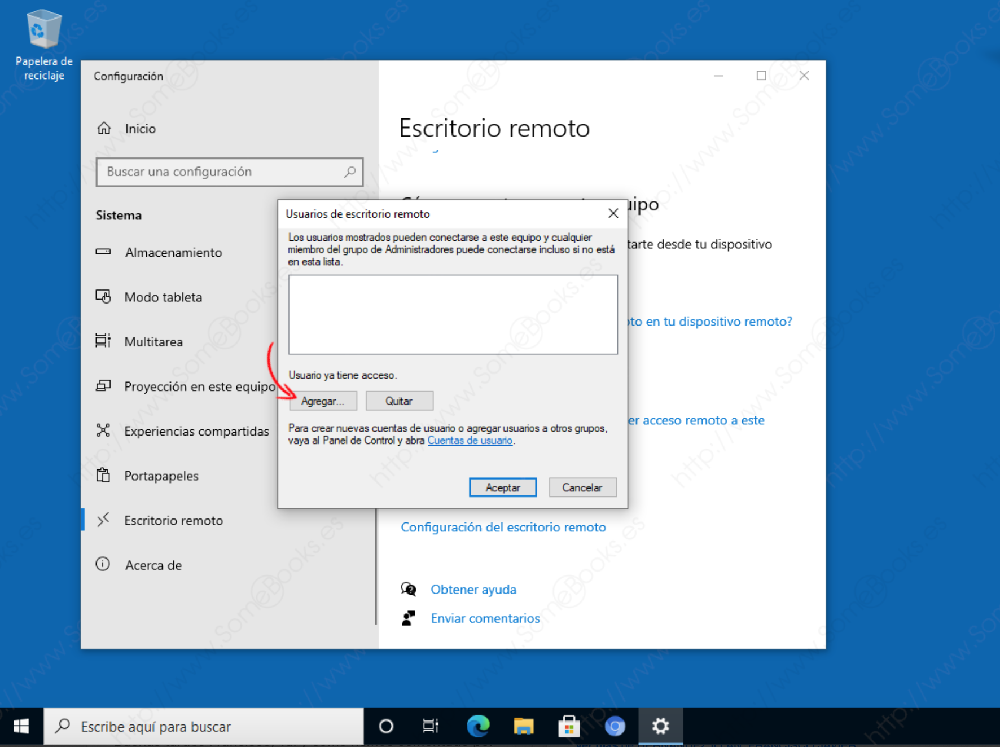
  <figcaption>Configuración Escritorio Remoto Windows 11 V</figcaption>
</figure>

- Al hacer clic en **Agregar...**, se abrirá una nueva ventana que nos permitirá elegir el usuario o usuarios que necesitemos. Puedes escribir el nombre del usuario o buscar usuarios en el sistema.

<figure>
  
  <figcaption>Configuración Escritorio Remoto Windows 11 VI</figcaption>
</figure>

- Si el sistema encuentra varios objetos que contienen el texto que se ha escrito, aparecerá una nueva ventana para elegir el que nos interese. Si solo hubiese existido un objeto, se saltaría este paso.

<figure>
  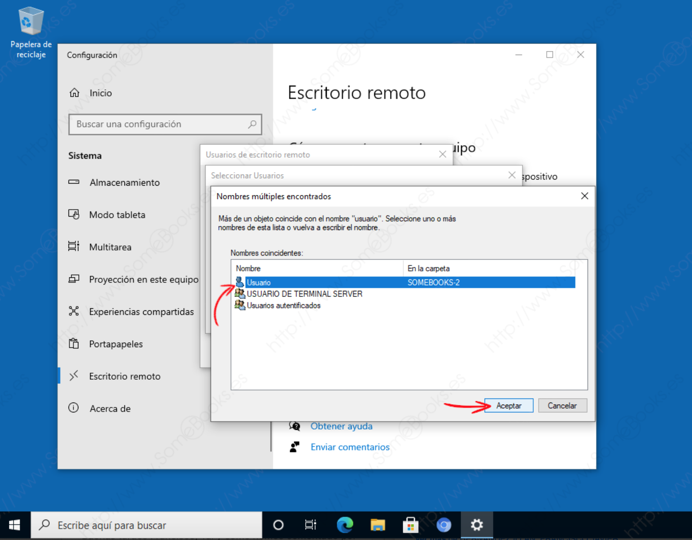
  <figcaption>Configuración Escritorio Remoto Windows 11 VII</figcaption>
</figure>

- Una vez seleccionado, se volverá a la ventana anterior, donde verás que se ha reconocido correctamente el usuario (se muestra el nombre completo de la cuenta, incluyendo el nombre del equipo en formato NetBIOS).

<figure>
  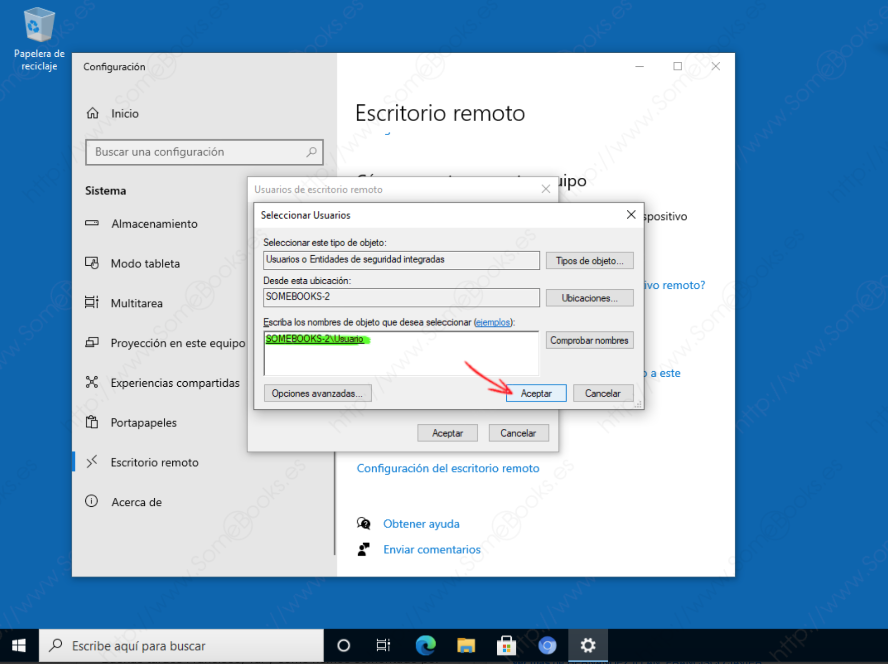
  <figcaption>Configuración Escritorio Remoto Windows 11 VIII</figcaption>
</figure>

- Al cerrar la ventana de selección de usuarios, volverás a la ventana anterior, donde ahora se observa que la cuenta de usuario ya aparece en la lista de usuarios autorizados.

Como es lógico, se puede repetir el proceso tantas veces como necesitemos para añadir más usuarios.

<figure>
  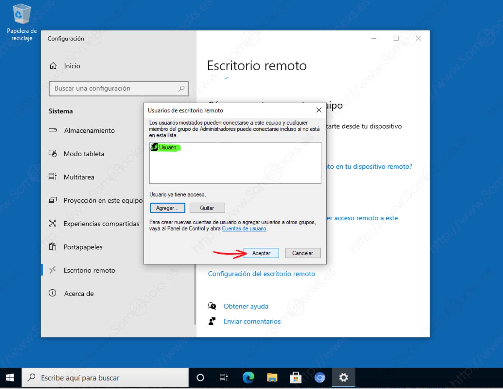
  <figcaption>Configuración Escritorio Remoto Windows 11 IX</figcaption>
</figure>

!!! tip "**CONSEJO:**"
    En Windows 11, también puedes acceder a la configuración del escritorio remoto mediante el Panel de Control clásico: `Panel de Control` → `Sistema` → `Configuración avanzada del sistema` → pestaña `Remoto`. Sin embargo, el método a través de la aplicación Configuración es el recomendado en Windows 11.


## Activación del Escritorio Remoto por PowerShell

Además de activar el Escritorio Remoto desde la interfaz gráfica, es posible habilitar esta característica y configurar permisos a través de comandos de PowerShell. Esto resulta útil para administradores o para automatizar despliegues en varios equipos.

### Habilitar el Escritorio Remoto

Para habilitar el escritorio remoto desde PowerShell (ejecutar como **Administrador**):

```powershell
# Habilitar Escritorio Remoto
Set-ItemProperty -Path "HKLM:\System\CurrentControlSet\Control\Terminal Server" -Name "fDenyTSConnections" -Value 0

# (Opcional) Permitir el tráfico de Escritorio Remoto en el firewall de Windows
Enable-NetFirewallRule -DisplayGroup "Remote Desktop"
```

### Permitir usuarios al Escritorio Remoto

Por defecto, solo los miembros del grupo **Administradores** pueden conectarse por Escritorio Remoto. Para añadir un usuario concreto (por ejemplo, `usuario1`) al grupo apropiado:

```powershell
# Añadir usuario1 al grupo de usuarios de escritorio remoto
Add-LocalGroupMember -Group "Remote Desktop Users" -Member "usuario1"
```

Cambia `"usuario1"` por el nombre de la cuenta que desees autorizar.

### Verificar el estado del Escritorio Remoto

Para comprobar si el Escritorio Remoto está habilitado:

```powershell
# Devuelve 0 si está habilitado, 1 si está deshabilitado
(Get-ItemProperty -Path "HKLM:\System\CurrentControlSet\Control\Terminal Server").fDenyTSConnections
```

Si deseas desactivar el Escritorio Remoto, ejecuta:

```powershell
Set-ItemProperty -Path "HKLM:\System\CurrentControlSet\Control\Terminal Server" -Name "fDenyTSConnections" -Value 1
```

!!! warning "Recuerda"
    Si la máquina está en una red no confiable o pública, **asegúrate de reforzar la seguridad**:
    - Usa contraseñas fuertes.
    - Cambia el puerto por defecto si es necesario.
    - Limita el acceso en el firewall únicamente a IPs autorizadas.

De este modo, podrás gestionar de forma remota la activación y configuración del Escritorio Remoto en sistemas Windows utilizando comandos automatizables.


<!-- ### RemoteApp

**RemoteApp** permite que los programas a los que se obtiene acceso de forma remota mediante **Servicios de Escritorio remoto** aparezcan **como si se ejecutaran en el equipo local del usuario final**. Estos programas se conocen como `Programas RemoteApp`. Características:

- En lugar de presentarse al usuario en el escritorio del servidor de Host de sesión de Escritorio remoto, el Programa **RemoteApp** se integra en el escritorio del cliente.
- El Programa **RemoteApp** se ejecuta en su propia ventana ajustable, se puede arrastrar de un monitor a otro y dispone de una entrada propia en la barra de tareas.
- Si un usuario ejecuta más de un Programa **RemoteApp** en el mismo servidor de Host de sesión de Escritorio remoto, el programa **RemoteApp** compartirá la misma sesión de Servicios de Escritorio remoto.

**RemoteApp** puede reducir la complejidad y la carga administrativa en muchas situaciones, incluidas las siguientes:

1. Sucursales donde puede haber un soporte local de IT limitado y un ancho de banda de red limitado. 
2. Situaciones en las que los usuarios necesitan obtener acceso a programas de forma remota. 
3. Implementación de programas de línea de negocios (LOB), especialmente programas LOB personalizados. 
4. Entornos como los espacios de trabajo "hot desk" o "hoteling", en los que los usuarios no tienen equipos asignados. 
5. Implementación de múltiples versiones de un programa, especialmente si la instalación de varias versiones localmente puede ocasionar conflictos. -->

## Herramientas gráficas externas para la administración remota

### RealVNC

<figure style="float: right;">
    
</figure>

Uno de los productos que está diseñado para todas las plataformas más importantes es Real VNC.

- **VNC**: Virtual Network Computing (Computación Virtual en Red). 
- **VNC es un programa de software libre** basado en una estructura cliente-servidor que permite observar las acciones del ordenador servidor remotamente a través de un ordenador cliente.
- Como su nombre indica, se basa en este protocolo.
- Podemos encontrar más aplicaciones que utilicen **VNC** para control remoto, pero esta es una de las más utilizada. 
- Hay desde una versión gratuita hasta una de empresa. Esta última incorpora más seguridad, y más utilidades, como por ejemplo, la transferencia de archivos.
 
<figure>
  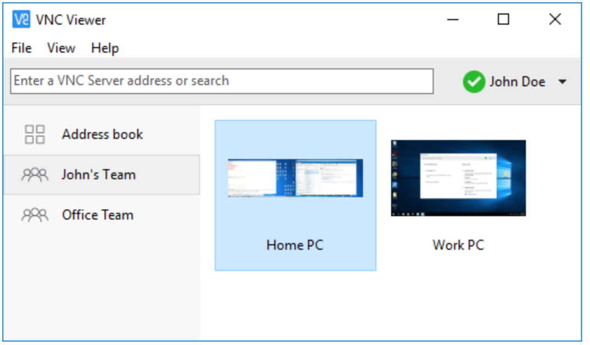
  <figcaption>RealVNC viewer</figcaption>
</figure>

!!! tip "**DESCARGA**"
    [Descarga RealVNC](https://www.realvnc.com/es/connect/download/vnc/)

!!! tip "**RealVNC en Linux**"
    [Guía RealVNC en Linux](https://help.realvnc.com/hc/en-us/articles/360003474572-How-do-I-get-started-with-VNC-Connect-on-Linux-#setting-up-your-account-0-0)

### TeamViewer

**TeamViewer** es un software para el acceso remoto, así como para el control y el soporte en remoto de ordenadores y otros dispositivos finales.

- La plataforma fue lanzada al público en **2005**
- Su catálogo de servicios se ha ido ampliando de forma continua.
- La última innovación ha sido la integración de **TeamViewer** Meeting.
- **TeamViewer** no exige registrarse y es gratuito si se utiliza con fines no comerciales, lo cual ha ayudado a una mayor difusión del software.
- **TeamViewer** es el producto principal de la empresa homónima con sede en **Göppingen, Alemania**.

<figure>
  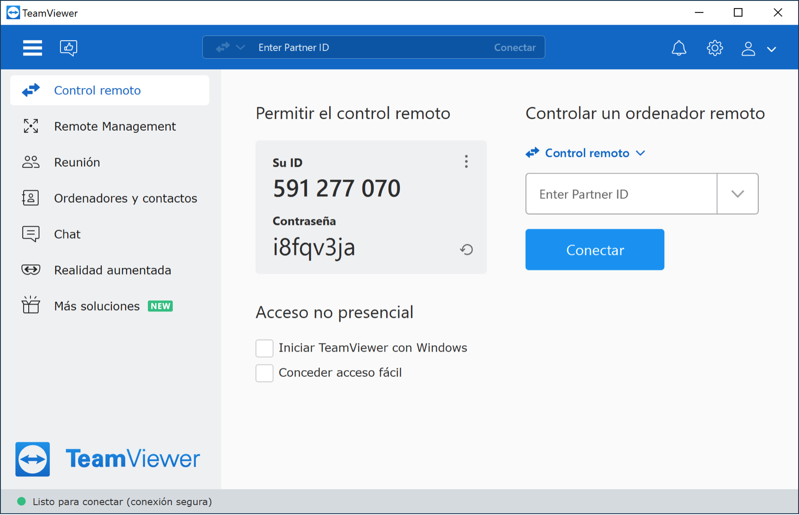
  <figcaption>TeamViewer APP</figcaption>
</figure>

!!! tip "**DESCARGA**"
    [Descarga **TeamViewer**](https://www.teamviewer.com/es/descarga/linux/)

!!! tip "**TeamViewer en Linux**"
    [Guía instalación TeamViewer en Linux](https://community.teamviewer.com/English/kb/articles/45-install-teamviewer-on-ubuntu)

### AnyDesk

<figure style="float: right;">
    
</figure>

**AnyDesk** es un programa de software de escritorio remoto desarrollado por **AnyDesk Software GmbH en Stuttgart**, Alemania.

- Provee acceso remoto bidireccional entre computadoras personales y está disponible para todos los sistemas operativos comunes.
- El software ha estado en desarrollo activo desde 2012.
- Esta herramienta permite el acceso remoto bidireccional de los usuarios a través de sus computadores.
- **AnyDesk** es un software multiplataforma, es decir, puede manejarse desde diferentes sistemas: Windows, Linux, OS X, Android entre otros.

<figure>
  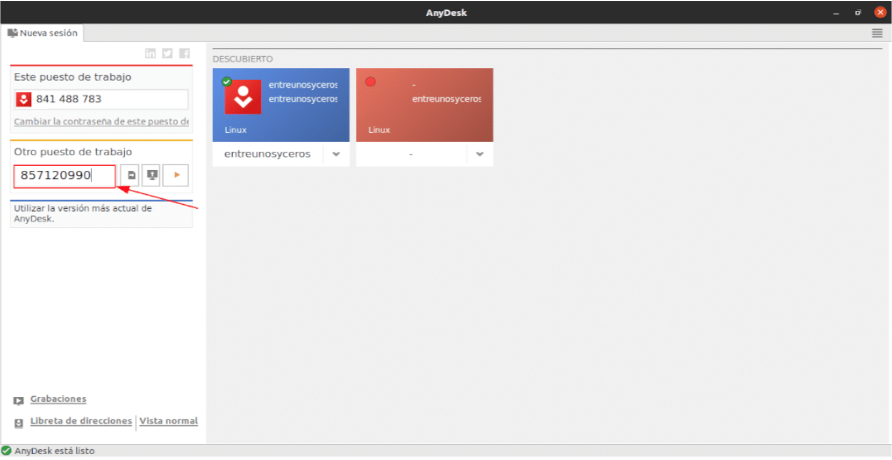
  <figcaption>Ejemplo Anydesk APP</figcaption>
</figure>

!!! tip "**DESCARGA**"
    [Descarga **AnyDesk**](https://anydesk.com/es/downloads/linux)

!!! tip "**AnyDesk en Linux**"
    [Guía instalación AnyDesk en Linux](https://ubunlog.com/anydesk-escritorio-remoto-ubuntu-20-04/?utm_source=feedburner&utm_medium=%24%7Bfeed%2C+email%7D&utm_campaign=Feed%3A+%24%7BUbunlog%7D+%28%24%7BUbunlog%7D%29) (Nota: La guía es para Ubuntu 20.04, pero el proceso es similar en Ubuntu 24.04)

### Apache Guacamole

<figure style="float: right;">
    
</figure>

**Apache Guacamole** es una puerta de enlace de escritorio remoto multiplataforma de código abierto y gratuita mantenida por **Apache Software Foundation**. 

- Permite a un usuario tomar el control de una computadora remota o máquina virtual a través de un navegador web.
- Apache Guacamole es una puerta de enlace de escritorio remoto **sin cliente**. Lo llamamos sin cliente porque no se requieren complementos ni aplicación cliente.
- Admite protocolos estándar como VNC, RDP y SSH.
- Gracias a HTML5, una vez que Guacamole está instalado en un servidor, todo lo que necesita para acceder a sus escritorios es un navegador web.

<figure>
  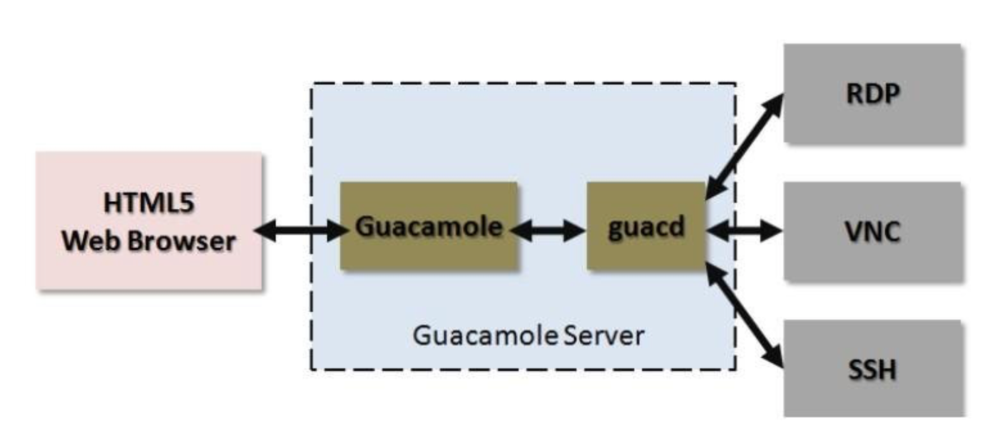
  <figcaption>Arquitectura Apache Guacamole</figcaption>
</figure>   

<!-- !!! note "**MUY INTERESANTE PARA PROYECTO FINAL**"
    Se puede plantear el despliegue de esta tecnología usando docker, ldap, proxy inverso, ... -->

!!! tip "**DESCARGA**"
    [Descarga **Apache Guacamole**](https://guacamole.apache.org/releases/)

!!! tip "**Guía Apache Guacamole**"
    [Manuales y guía de despliegues con **Apache Guacamole**](https://guacamole.apache.org/doc/gug/) 

## Actividades


---

<a name="PR301"></a>

* :material-trophy: **PR301. Práctica: Túneles SSH con Docker**. (RA.4 // CE4a, CE4c, CE4d, CE4e, CE4h y CE4i // 1-10p). 

En esta práctica aprenderás a configurar un **túnel SSH** utilizando un contenedor Docker especializado. El objetivo es exponer servicios locales (por ejemplo, un servidor web o backend en tu máquina) de forma segura a través de la red local, usando SSH y una máquina virtual que simula un servidor VPS. 


!!! note "Entorno educativo"
    Esta práctica se ha diseñado específicamente para su utilización en entornos educativos donde no se cuenta con un VPS real que disponga de una IP pública.


> **Resumen de tareas**

- **Prepara una máquina virtual** con Ubuntu 24.04 que actuará como VPS simulado en tu red local.
- **Configura un servidor SSH en Docker** sobre la máquina virtual siguiendo las instrucciones detalladas.
- **Genera las claves SSH** en tu máquina host y configura el acceso al contenedor.
- **Configura el cliente SSH** en tu equipo para crear un túnel seguro a la máquina virtual.
- **Crea túneles con port-forwarding** (`ssh -R ...`) para exponer uno o varios servicios locales.
- **Verifica la conectividad** accediendo a los servicios desde otras máquinas en la red local.
- **Documenta el proceso**, mostrando la arquitectura, pasos realizados (indicando qué se hace en cada máquina), comandos utilizados y capturas de pantalla de la funcionalidad.

> **Criterios de evaluación**

- Configuración correcta de la máquina virtual y del contenedor Docker.
- Configuración correcta y segura del servidor SSH en Docker.
- Funcionamiento de los túneles SSH y exposición de servicios a través de la red local.
- Explicación clara del funcionamiento del port-forwarding y cómo tuneliza los puertos.
- Documentación completa de la arquitectura y pasos seguidos con evidencias, indicando claramente qué se ejecuta en cada máquina (host vs. MV).

> Consulta el enunciado completo y detallado aquí:  
> [Práctica: Configuración de túnel SSH con Docker](PracticaSSHtunnelingDocker.md)


!!! note "Entorno educativo: VPS simulado con máquina virtual"
    En esta práctica utilizaremos una **máquina virtual (MV)** que simula un **VPS** (*Virtual Private Server*). Un VPS real es una máquina virtual con recursos propios (CPU, RAM, disco, sistema operativo y acceso root), que funciona de forma aislada y gestionable en un servidor físico compartido, accesible desde Internet con una IP pública. En nuestro caso, la MV actúa como VPS simulado dentro de nuestra red local, permitiéndonos experimentar y comprender los conceptos de túneles SSH y port-forwarding sin necesidad de un VPS real. Los conceptos aprendidos son directamente aplicables a escenarios reales con VPS en Internet.
    
---

<a name="PR302"></a>

* :material-trophy: **PR302. Práctica: Acceso remoto a Windows Server en AWS Academy**. (RA.4 // CE4a, CE4c, CE4d, CE4e, CE4f, CE4g y CE4i // 1-10p). 

En esta práctica aprenderás a crear y configurar una instancia de **Windows Server** en **AWS Academy** y acceder a ella mediante **Escritorio Remoto (RDP)**. El objetivo es familiarizarte con la computación en la nube, la creación de máquinas virtuales en AWS y la configuración de acceso remoto mediante RDP.


!!! note "Entorno educativo"
    Esta práctica utiliza **AWS Academy Learner Lab**, una plataforma educativa que proporciona acceso a recursos de AWS con créditos limitados para estudiantes. Los recursos creados se eliminan automáticamente al finalizar el laboratorio.


> **Resumen de tareas**

- **Accede a AWS Academy** a través de Canvas e inicia el laboratorio AWS Academy Learner Lab.
- **Crea una instancia de Windows Server 2025** en AWS EC2 con la configuración adecuada.
- **Configura grupos de seguridad** para permitir el acceso RDP desde tu máquina local.
- **Obtén la contraseña del administrador** usando la clave privada SSH.
- **Conecta mediante RDP** a la instancia de Windows Server desde tu máquina local.
- **Verifica el acceso remoto** y la conectividad de red en Windows Server.
- **Documenta el proceso**, mostrando los conceptos de computación en la nube, pasos realizados, comandos utilizados y capturas de pantalla de la funcionalidad.
- **(Opcional)** Configura Active Directory Domain Services y une un cliente al dominio.

> **Criterios de evaluación**

- Configuración correcta de AWS Academy y acceso al laboratorio.
- Creación correcta de la instancia Windows Server 2025 en EC2.
- Configuración adecuada de grupos de seguridad para permitir RDP.
- Conexión exitosa mediante RDP a la instancia de Windows Server.
- Verificación del acceso remoto y conectividad de red.
- Explicación clara de los conceptos de computación en la nube (IaaS, PaaS, SaaS).
- Documentación completa de la arquitectura y pasos seguidos con evidencias.
- (Opcional) Configuración de Active Directory y unión de cliente al dominio.

> Consulta el enunciado completo y detallado aquí:  
> [Práctica: Acceso remoto a Windows Server en AWS Academy](PracticaWindowsServerAWS.md)


!!! note "Entorno educativo: AWS Academy Learner Lab"
    **AWS Academy Learner Lab** proporciona un entorno controlado con créditos educativos limitados para que los estudiantes experimenten con servicios de AWS. El laboratorio tiene un tiempo limitado (normalmente 4 horas) y los recursos se eliminan automáticamente al finalizar. Es importante **detener las instancias** cuando no se usen para no consumir créditos innecesariamente. Los conceptos aprendidos son directamente aplicables a escenarios reales con AWS en producción.
    
---


<!-- 801. [Práctica Configuración Servidor SSH](Practica11_configuración_servidor_openssh.md)

1.   Instala y configura xRDP en Ubuntu 24.04, comprueba que puedes acceder por escritorio remoto al Ubuntu desde Windows 11, haz una guía de configuración con los pasos para poder acceder y captura que demuestre que se ha accedido.

2.   Instala y configura RDP en Windows 11, comprueba que puedes acceder por escritorio remoto del mismo desde Ubuntu, haz una guía de configuración con los pasos para poder acceder y captura que demuestre que se ha accedido.

3.   [Instalación de Servidor de Aplicaciones RemoteApp](./Practicas/Practica12_RemoteAppTS.md) -->

