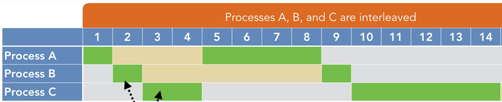
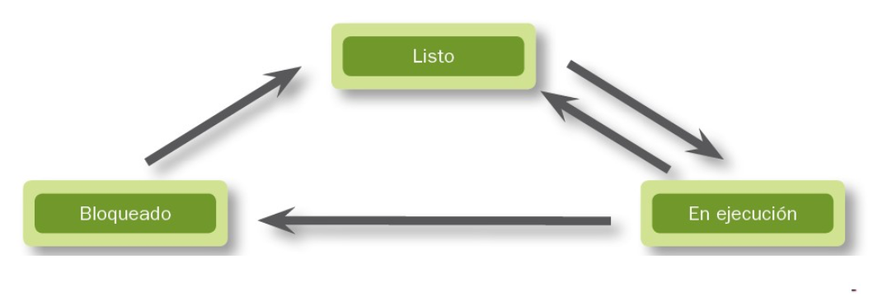
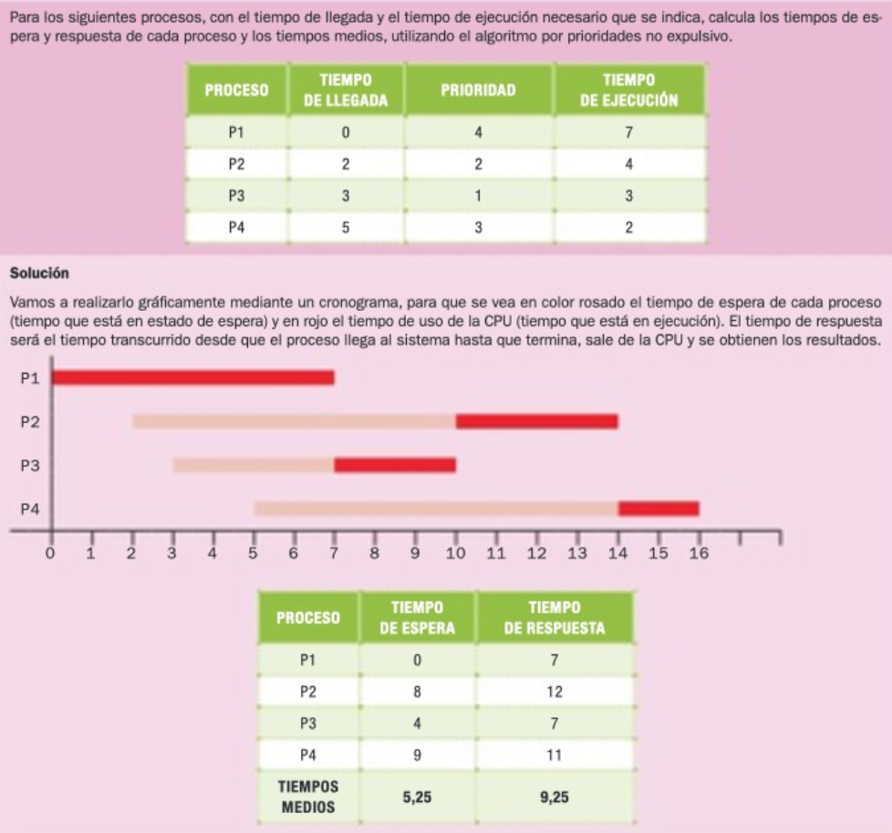
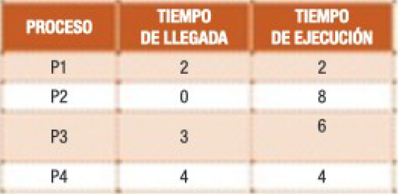

# Procesos.

## Tipos. Estados. Estructura.

**Un proceso es una instancia de un programa en ejecución**. Es decir, cada vez que se lanza un programa, se crea un proceso, de forma que si lanzo el mismo programa dos veces, tendré dos procesos distintos aunque partan de las mismas instrucciones.

Cuando el usuario o una aplicación pide la ejecución de un determinado programa, el sistema operativo debe proveer de los recursos necesarios para esta tarea. Para ello debe buscar espacio en memoria RAM tanto para las instrucciones que van a ejecutarse como para los datos que necesita el programa y saber qué ficheros, dispositivos de E/S, etc... van a ser utilizados.

!!! warning
    La **CPU** se encarga de un solo proceso en cada instante de tiempo, para optimizar el rendimiento de la misma se utilizan técnicas como la *multiprogramación* y *multihilado*, conceptos que se verán en esta Unidad.

**La multiprogramación** es una técnica de multiplexación que permite la ejecución simultánea de múltiples procesos en un único procesador. En realidad, esta técnica produce una ilusión de paralelismo, de manera que parece que todos los procesos se están ejecutando a la vez. Sin embargo, hay un único proceso ejecutándose en el procesador a la vez.

<figure>
  
  <figcaption>Ejemplo de Multiprogramación</figcaption>
</figure>

## Estructura

Los procesos se estructuran de **forma jerárquica**. EL sistema operativo lanza el primero y a partir de este se crean todos los demás.

El sistema operativo creará una estructura de control en la que tenga toda la información de dicho proceso. A esta estructura se le llama **BCP** (Bloque de control de proceso), y contiene diferente información dependiendo del sistema operativo del que hablemos, pero por lo general tiene:

1. **PID** (Process IDentifier): Identifica de forma unívoca al proceso en el sistema, generalmente se emplea un entero sin signo  .

2. **Estado del proceso**: listo o espera, ejecución o bloqueado.

3. **Registros del procesador**: cada vez que se ejecuta el planificador y se realiza una conmutación de procesos, la información sobre en qué lugar se encontraba la ejecución del proceso debe guardarse, así como el lugar en el que se paró la ejecución del anterior proceso (en su respectivo BCP).

4. **Gestión de memoria**: tales como el espacio de direcciones y la cantidad de memoria asignada a un proceso.

5. Aspectos relacionados con la administración de **ficheros**: por ejemplo con que ficheros está el proceso actualmente operando.

6. Los **procesadores** en los que el proceso puede ejecutarse: en caso de soportar el sistema multiprocesador.

7. En el caso de un sistema operativo tipo UNIX: el **proceso padre** de dicho proceso y la relación de procesos.

8. Estadísticas Tiempo de lanzamiento del proceso, tiempo en estado activo, etc.

<figure>
  
  <figcaption>Componentes de BCP</figcaption>
</figure>

## Tipos de Procesos

Los procesos pueden clasificarse de distintas formas, por ejemplo, atendiendo a la interacción con el usuario podemos encontrarnos: 

- **Procesos en primer plano (foreground)**: precisan de la intervención del usuario. 

- **Procesos en segundo plano (background)**: Se ejecutan sin que el usuario tenga que hacer nada. 

También podemos atender al modo en el que se ejecutan estos, aunque puede ser que un mismo proceso pase de un modo a otro durante su ejecución. 

- **Procesos en modo kernel**: Son procesos que tienen acceso privilegiado a todo el equipo. Son mucho más seguros. La mayoría de los procesos del sistema operativo son de este tipo.

- **Procesos en modo usuario**: Menos seguros. Todos los que ejecutan los usuarios y/o aplicaciones de usuario suelen ser de ese tipo.

Dependiendo de quién lo ejecutó:

- **Procesos del sistema**: Los que han sido lanzados por el propio sistema operativo.

- **Procesos de usuario**: Los que ha lanzado un usuario.

También podemos encontrar procesos **monohilo** o **multihilo**.

## Estados

Hay tres estados básicos en los que puede estar un proceso:

- **En ejecución**: el proceso tiene asignada la CPU, por la tanto está en ejecución en ese instante.

- **Listo o En espera**: Está en la listo para que se le conceda el procesador. Es una especie de buffer que guarda el orden de llegada de los procesos.

- **Bloqueado**: Está esperando a que se libere un recurso para poder seguir con su ejecución.

<figure>
  
  <figcaption>Estados en los que puede estar un proceso</figcaption>
</figure>

!!! note
    Podemos encontrar más estados intermedios hasta 13, a destacar los definidos anteriormente, ya que los que contemplan todos los sistemas operativos multitarea.

Aunque es recomendable también conocer los siguientes:

- **Parado**: Le ha llegado una señal para que se pare y espera a que le llegue otra para reiniciarse. Por ejemplo, el proceso tiene configurado un tiempo de inactividad, como una especie de reloj despertador de forma que cuando pase ese tiempo, le llegará una señal y se reiniciará. (**sleep**)

- **Zombie**: El proceso, que es hijo de otro, ha terminado pero por algún motivo no puede comunicarse con su proceso padre y terminar completamente. Estos procesos quedan ocupando una entrada en la tabla de procesos y los recursos correspondientes.

## Transiciones de estados

Los procesos pueden pasar desde su ejecución por tres estados, que son los que indicamos en el punto anterior: En espera, bloqueado y en ejecución. 

Cuando un usuario o el sistema operativo ejecuta un programa, ocurre lo siguiente:

1. Se crea una nueva entrada en la tabla de procesos del sistema,

2. Se asigna un PID al proceso.

3. Se le asignan los recursos y la zona de memoria necesaria.

4. Se cargan las páginas del programa en memoria RAM.

5. Se pone el proceso en la lista de espera para que el planificador le conceda el procesador.

En ese momento el planificador debe cambiar de estado a los procesos en función de sus características, del quantum o de si posee o no los recursos necesarios para su ejecución. Se pueden dar las siguientes transiciones:

1. El proceso se encuentra listo para su ejecución y le toca el turno para pasar al procesador. En este momento el proceso cuenta con todos los recursos que necesita.

2. Cuando un proceso se encuentra en ejecución pero pierde alguno de sus recursos y no puede continuar. En este momento el planificador lo coloca en estado bloqueado.

3. Cuando un proceso en estado bloqueado (le falta algún recurso) ha obtenido todo lo que necesita para seguir con su ejecución. El planificador lo coloca en estado Preparado.
4.  Cuando un proceso se encuentra en ejecución y no pierde ninguno de sus recursos, pero ha terminado el tiempo asignado por el planificador para usar el procesador. Pasa al estado Preparado.

La transición que **nunca se dará**, si el planificador es adecuado, es la que va desde el estado **En espera** o **Bloqueado** al de **En Ejecución**. Si ocurriera esto, es decir, si un proceso decidiera tomar el control de los recursos sin consultarle al planificador, los resultados podrían ser catastróficos.

<figure>
  
  <figcaption>Estados en los que puede estar un proceso</figcaption>
</figure>

## El planificador

El planificador se encarga de decidir a qué proceso o hilo se le va a ceder el procesador y por cuánto tiempo. Para esto, se utilizan una serie de algoritmos matemáticos que intentan cumplir las siguientes premisas en el reparto de la cpu:

- Equidad: Todos los procesos deben ser atendidos.
- Eficacia: El procesador debe estar ocupado el 100% del tiempo.
- Tiempo de respuesta: El tiempo empleado en dar respuesta a las solicitudes del usuario debe ser el menor posible.
- Tiempo de regreso: Reducir al mínimo el tiempo de espera de los resultado esperados por los usuarios por lotes.
- Rendimiento: Maximizar el número de tareas que se procesan por cada hora.

### Tipos de algoritmo de programación de CPU

Existen principalmente seis tipos de algoritmos de programación de procesos:

1.  First Come First Serve (FCFS) o First In First Out (**FIFO**)
2.  Shortest-Job-First (**SJF**)
3.  Shortest Remaining Time First (**SRTF**)
4.  Prioridades: Expulsivo o no Expulsivo.
5.  Round Robin.

### FIFO

El primero en llegar es el primero en ser servido es la forma completa de FCFS. Es el algoritmo de programación de CPU **más fácil y simple**. En este tipo de algoritmo, el proceso que solicita la CPU obtiene primero la asignación de CPU.

**Características**:

- No expulsivo.
- Los trabajos siempre se ejecutan por orden de llegada.
- Es fácil de implementar y usar.
- Sin embargo, este método tiene un rendimiento deficiente y el tiempo de espera general es bastante alto.

<figure>
  
  <figcaption>Ejemplo FIFO</figcaption>
</figure>

### SJF

Este método utiliza una política de programación que selecciona para la ejecución el proceso de espera con el menor tiempo de ejecución.

**Características**:

- No expulsivo.
- Es ventajoso debido a su simplicidad y porque minimiza la cantidad promedio de tiempo que cada proceso tiene que esperar hasta que se completa su ejecución.
- El tiempo total de ejecución de un trabajo debe conocerse antes de su ejecución.

<figure>
  
  <figcaption>Ejemplo SJF</figcaption>
</figure>

### SRTF

Este método es la evolución del anterior pero con la característica de ser Expulsivo.

**Características**:

- Expulsivo.
- Este método se aplica principalmente en entornos por lotes donde se requiere dar preferencia a los trabajos cortos.
- Este no es un método ideal para implementarlo en un sistema compartido donde se desconoce el tiempo de CPU requerido.

<figure>
  
  <figcaption>Ejemplo SRTF</figcaption>
</figure>

### Prioridades

Es un método de programación de procesos en función de la prioridad. Los procesos con mayor prioridad deben llevarse a cabo en primer lugar, mientras que los trabajos con igual prioridad se llevan a cabo por turnos o FCFS. La prioridad se puede decidir en función de los requisitos de memoria, los requisitos de tiempo, etc.

<figure>
  
  <figcaption>Ejemplo Prioridades no expulsivo</figcaption>
</figure>

<figure>
  
  <figcaption>Ejemplo Prioridades expulsivo</figcaption>
</figure>

### Round Robin

El nombre de este algoritmo proviene del principio de turnos, en el que cada persona obtiene una parte igual de algo a su vez. Se utiliza principalmente para programar algoritmos en multitarea. Este método de algoritmo ayuda a la ejecución libre de inanición de procesos.

**Características**:

- Round robin es un modelo híbrido que funciona con reloj
- Es un sistema en tiempo real que responde al evento dentro de un límite de tiempo específico.
- Aumenta los tiempos medios.

<figure>
  
  <figcaption>Ejemplo Round Robin</figcaption>
</figure>

## Actividades

En las siguientes actividades se debe realizar:

- Calcular el tiempo de espera y tiempo de respuesta de cada proceso. Gráficamente y  de forma numérica con ayuda de la plantilla en **ods** adjunta en el moodle.
- Calcular el tiempo medio de espera y respuesta de cada algoritmo.
- Realizar una conclusión comparando los resultados de tiempos de los algoritmos.

301. Utilizando los algoritmos de planificación FIFO, SJF y SRTF:

<figure>
  
</figure>

302. Utilizando los algoritmos de planificación FIFO, Round Robin y Prioridades no expulsivo:

    - En Round Robin utiliza el Quantum igual a 2.

<figure>
  
</figure>

303. Utilizando los algoritmos de planificación FIFO, Round Robin y SJF:

    - En Round Robin utiliza el Quantum igual a 2.

<figure>
  
</figure>

304. Utilizando los algoritmos de planificación SRTF, Prioridades no expulsivo y Prioridades expulsivo: 

<figure>
  
</figure>