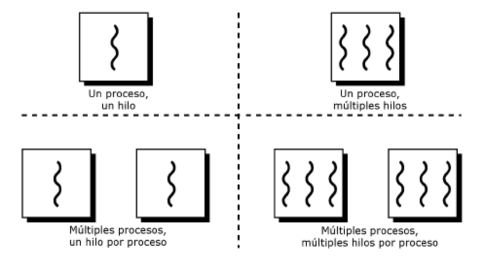
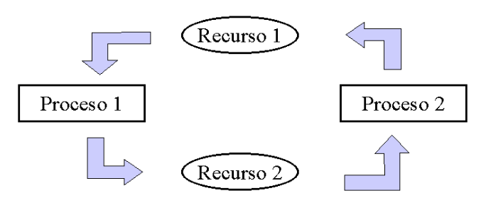
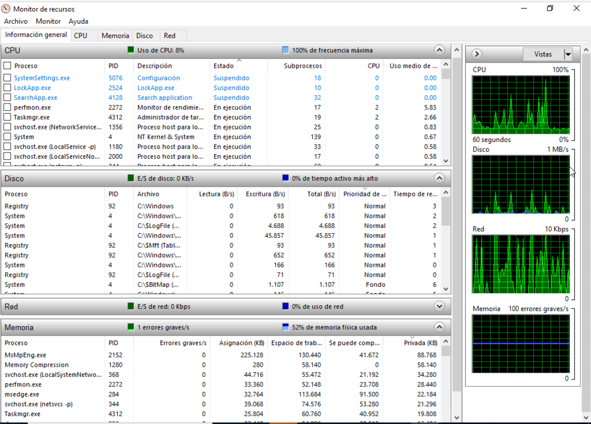

# Hilos

## Definición

Un hilo o hebra (Thread), proceso ligero o subproceso **es la secuencia de instrucciones más elemental, que puede ser gestionada por el planificador**.

!!! info "NOTA"
    A priori los procesos **pueden ejecutarse como un solo hilo**, es decir, las instrucciones ván siguiendo un orden y nunca se pueden ejecutar a la vez dos instrucciones del mismo proceso.

El concepto de **multihilo** consiste en que partes del mismo proceso pueden ejecutarse en paralelo, es decir , el mismo programa tiene partes que pueden ejecutarse a la vez. De este modo, se puede ahorrar tiempo. Por ejemplo, un navegador de internet puede tener varios hilos, uno muestra las imágenes mientras otro recupera datos de la red.

<figure>
  
  <figcaption>Estados en los que puede estar los procesos e hilos en el navegador.</figcaption>
</figure>

!!! info "NOTA"
    Es fácil confundir hilos y procesos. **La diferencia principal** es que un proceso tiene asignado un un BCP y los hilos son parte del mismo proceso. Esto significa entre otras cosas que la memoria que se asigna al proceso la compartirán todos los hilos. También comparten el resto de recursos como ficheros abiertos, etc. Por lo tanto si uno de los hilos modifica un recurso o una variable de memoria, el cambio afectará al resto de hilos del proceso. Debido a esto **es importante la sincronización entre hilos**.

Cada hilo tendrá un identificador, un contador de programa y una pila propias. Se pueden distinguir los siguientes tipos de hilos:

- **Hilos a nivel de usuario**: Son los que crean los programadores y de los cuales el kernel o núcleo del sistema no es consciente de que existan, por lo que el propio programador debe encargarse de la sincronización de estos.

- **Hilos a nivel de kernel**: Estos son gestionados por el sistema operativo, por lo que si tenemos un procesador con varios núcleos y /o varios procesadores, se acelerará la ejecución del proceso . El sistema operativo se encarga del cambio entre hilos.

Además contamos con sistemas operativos que son capaces de gestionar hilos (a nivel de kernel , claro) y sistemas operativos que no lo son.

<figure>
  
  <figcaption>Estados en los que puede estar un proceso</figcaption>
</figure>

## Ventajas de los hilos frente a los procesos

- Los hilos son mucho **más ligeros** que los procesos. En la creación de procesos se necesita un tiempo para la adjudicación de memoria y de recursos que no es necesaria en el caso de cambio entre hilos. También el cambio de contexto es mucho más "Pesado" en el caso de los procesos.

- La utilización de hilos hace que los procesos sean **más ágiles**, debido a que si una de las partes del proceso se bloquea esperando un recurso, otra en otro hilo puede avanzar con otras tareas.

- En caso de procesadores multinúcleo o sistemas multiprocesador, la **eficiencia de los procesos** que utilizan hilos es evidente, al poder realizar varias tareas realmente en paralelo (un hilo en cada procesador).

!!! Note "INFO"
    Un proceso multihilo no desaparece hasta que no han terminado todos sus hilos.

## Sincronización y Comunicación entre procesos

Hay procesos independientes y otros que deben comunicarse y sincronizarse con otros. En este caso **se utilizan señales para enviar información entre procesos**, y de este modo poder gestionar recursos y zonas de memoria compartida.

!!! Example "Ejemplo"
    Un proceso **(P1)** puede necesitar un dato que otro proceso **(P2)** produce y hasta que esto no ocurra, no podrá continuar con su ejecución. En este caso el proceso P1 se quedará **bloqueado** hasta que reciba una señal que le enviará P2, indicándole que ya tiene disponible el dato.

!!! tip "Consejo"
    Antes de conocer diferentes casos problemáticos y sus posibles soluciones se debe conocer los siguientes elementos que interactúan en la comunicación de procesos.

### Mensajes

Cuando los procesos tienen que compartir información, incluso en equipos remotos, pueden utilizar colas de mensajes para enviarla. Los procesos introducen y extraen los mensajes, con la información necesaria a enviar al proceso o entidad que se necesite en cada caso.

Existen varios **"tipos"** de mensajes distintos, de forma que cada tipo de mensaje contiene una información distinta y va identificado por un entero.

### Señales

Las señales se utilizan para sincronizar procesos. Cada señal tiene un comportamiento por defecto, como puede ser pausar un proceso o pararlo. La mayoría de ellas pueden ser tratadas de forma que el programa la recoja y realice una serie de instrucciones cuando esta llegue.

!!! Example "Ejemplo"
    Hay formas de pasar señales al sistema operativo, por ejemplo, cuando pulsamos control+C, o utilizando funciones del sistema para enviar una determinada señal a un proceso para modificar la forma de actuar de éste en ese momento dado.

### Interrupciones y excepciones

**Una Interrupción** es una señal que envía un dispositivo de E/S al procesador para pedir que se le atienda. Cada interrupción tiene asociada una rutina que debe pasar a ejecutarse cuando esta se produzca. También existen las interrupciones de Software, que envían los programas de usuario al sistema operativo para requerir su atención.

El siguiente esquema muestra un resumen del concepto de Interrupción.

<figure>
  
  <figcaption>Resumen Interrupción</figcaption>
</figure>
!!! info "NOTA"
    **Una excepción** se produce cuando hay una instrucción errónea en un programa, por ejemplo, una división por 0. En ese momento el sistema operativo debe realizar las acciones oportunas. En ciertos intervalos de tiempo puede convenir no aceptar señales de interrupción. Por ello las interrupciones pueden inhibirse por software, según lo necesite el sistema.

## Casos y soluciones de sincronización

Una vez conocidos los elementos que se relacionan en la sincronización, en los siguientes apartados se muestran varias situaciones en los que se evidencia la necesidad de sincronización entre procesos, por problemas de acceso a recursos compartidos y las principales posibles soluciones planteadas.

### Casos de necesidad de sincronización

#### Condiciones de competencia

Existen una serie de casos en los que pueden aparecer ciertos problemas denominados **Condiciones de competencia**; los cuales ocurren cuando dos o más procesos intentan acceder a un mismo recurso.

!!! Example "Ejemplo"
    **P1** y **P2** intentan acceder a una variable global en memoria que llamaremos **A** pongamos que con un valor inicial de **5**. P1 se encarga de sumar 2 a la variable y P2 de restarle 1.Lo normal es que si entra P1 , modifica A y luego lo hace P2, el resultado de A sea 6.

Pero puede darse el siguiente caso :

1. P1 recoge el valor de la variable, por ejemplo, (5) la pase a un registro interno de la cpu para operar con este valor y antes de dejar el resultado en memoria pierda el procesador.

2. En ese momento P2 entra en el procesador y pone sus registros, etc. Recoge el valor de A (5, puesto que a P1 no le ha dado tiempo a dejar el resultado en memoria), lo cambia con un resultado de 4 y lo deja en memoria.

3. Cuando el proceso P1 vuelva a tener el procesador, dejará su resultado (5+2=7) en la variable A de memoria, machacando el resultado de P2 y se habrá perdido la operación que realizó dicho proceso.

#### Interbloqueo o abrazo

En el caso de competencia por recursos, el sistema operativo también se debe asegurar de que no se produce **Interbloqueo o abrazo** Esto ocurre, por ejemplo, cuando un proceso **P1 necesita dos recursos R1 y R2; A su vez otro proceso P2** precisa también los mismos recursos. Más en detalle puede ocurrir:

1. **P1** recibe la cpu y ocupa el recurso **R1**, y pierde el procesador.

2. Entra **P2** en el sistema y coge el recurso **R2**, como no puede coger el recurso **R1** se bloquea.

3. Pasa el procesador al proceso **P1**, pero este no puede coger el recurso **R2**, con lo que también se bloquea.

4. El resultado es que tenemos dos procesos que se bloquean mutuamente y no pueden avanzar en su ejecución.

<figure>
  
  <figcaption>Interbloqueo</figcaption>
</figure>

Para solucionar las condiciones de competencia se implementó un modelo para prohibir que dos procesos accedan al mismo recurso. El modelo en cuestión se denomina **exclusión mutua**, explicado en el siguiente sub-apartado.

### Soluciones

La solución principal que se plantea para los casos anteriores es la **exclusión mutua**, explicada a continuación.

#### Exclusión mutua

La **Exclusión mutua** evita que dos Procesos accedan a datos compartidos y los modifiquen simultáneamente, para ello utiliza **La sección crítica** de un programa, la cual es la zona del programa en la que se puede modificar el recurso que comparten varios procesos, dependiendo de permisos preestablecidos. El siguiente esquema/resumen aclara estos conceptos:

<figure>
  
  <figcaption>Resumen Exclusión Mutua</figcaption>
</figure>

Las **soluciones de exclusión mutua** con espera ocupada funcionan de la siguiente manera: 

- Cuando un proceso intenta entrar a su región crítica, verifica si está permitida la entrada. Si no, el proceso se queda esperando hasta obtener el permiso.

!!! tip
    Siguiendo la anterior premisa se destacan los siguientes métodos:

  1. **Desactivación de interrupciones**
    - El método más simple para evitar las condiciones de competencia es hacer que cada proceso desactive todas sus interrupciones antes de entrar a su sección crítica y las active una vez que salió de la misma. De esta forma, no sale de la cpu hasta que no ha terminado la ejecución del la sección crítica.
    - Este modelo tiene un **gran problema** y es que si se produce un fallo mientras que el proceso está en la región crítica no puede salir de la misma el sistema operativo no recuperaría el control.

  2. **Semáforos y variable cerradura**:
    - En éste caso se genera una variable, con dos valores 0 o 1:
        - **0**: no hay ningún proceso en su sección crítica.
        - **1**: indica que la sección crítica está ocupada.
    - Entonces cada proceso antes de ingresar a la sección crítica verifica el estado de la variable de cerradura y en caso de que la misma este en 0, le cambia el valor y accede a la misma y en caso de que la misma sea 1 el proceso se queda esperando hasta que el mismo sea 0.
    - El problema aquí se presenta si dos procesos verifican al mismo tiempo que la variable cerradura ingresando a la región crítica al mismo tiempo.

  3. **Alternancia estricta**:
    - El algoritmo de alternancia estricta no bloquea el acceso a la región crítica cuando otro proceso se está ejecutando, sino que coge el recurso para sí durante toda la ejecución del programa. Esta solución requiere que los dos procesos se alternen de manera estricta.
    - **Su desventaja** es que acopla los procesos fuertemente, esto significa que los procesos lentos atrasan a los procesos rápidos..

  4. **Monitores**: 
    - Un monitor es una colección de procedimientos, variables y estructuras de datos que están todos agrupados juntos en un tipo especial de módulo o paquete. Para poder acceder a un recurso , el proceso debe utilizar obligatoriamente los procedimientos del monitor, y este se encarga de realizar la exclusión mutua del recurso.

## Herramientas gráficas

En **GNU/Linux** existen diversas herramientas gráficas para obtener información de los distintos procesos o programas activos. Como existen varios servidores gráficos: KDE, GNOME, etc. Se destacan dos: **ksysguard** para KDE y **gnome-system-monitor** para GNOME.

- En **Debian/ubuntu** la herramienta gráfica se encuentra en aplicaciones > herramientas del sistema > **monitor del sistema**.
- En el caso de **Windows**, existe en el administrador de tareas, sobre la pestaña "**rendimiento**". Luego pulsaremos abajo en el enlace de "**monitor de recursos**". En esta nueva ventana tendremos dividido cada proceso en consumo de la CPU y en sub-procesos (threads).

<figure>
  
  <figcaption>Monitor de recursos (Windows)</figcaption>
</figure>

- En el **monitor de actividad** de Mac, se muestran directamente los sub-procesos enumerados en la pantalla principal.

<figure>
  
  <figcaption>Monitor de actividad (Mac)</figcaption>
</figure>

## Actividades

305. Investiga  y analiza las diferentes funciones de las herramientas gráficas para identificar y gestionar procesos e hilos de ubuntu client y Windows 10. Genera máquinas virtuales de los respectivos Sistemas Operativos si fuera necesario.

Se debe realizar un informe al menos con la búsqueda y resultado de las siguientes funciones (se debe especificar cómo se realizan):

- **Identificar**: entre procesos e hilos.
- **Detener**: cuando detiene un proceso se está indicando al sistema operativo que pause la ejecución de ese programa.
- **Continuar**: use esta opción para reiniciar un proceso que se pausó o detuvo.
- **Finalizar**: para finalizar un proceso de forma limpia.
- **Matar**: finaliza un proceso inmediatamente sin tener en cuenta si termina limpiamente. 
- **Cambiar**: la prioridad del proceso.

!!! note "NOTA"
    - Si alguna de las funciones no existe en las herramientas gráficas, simplemente se indicará en el informe como que no es posible realizarla, justificándolo.
    - La mayoría de los procesos tendrán la prioridad predeterminada establecida en Normal ( 0 ). En Linux, los números que van de -20 a +19 representan la prioridad del proceso. Cuanto menor sea el número de prioridad del proceso, más prioridad tendrá en la CPU. Por ejemplo, un proceso con una prioridad de -3 tendrá más tiempo de CPU que otro proceso con una prioridad de 6.
