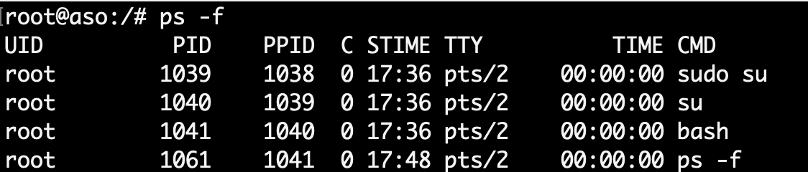
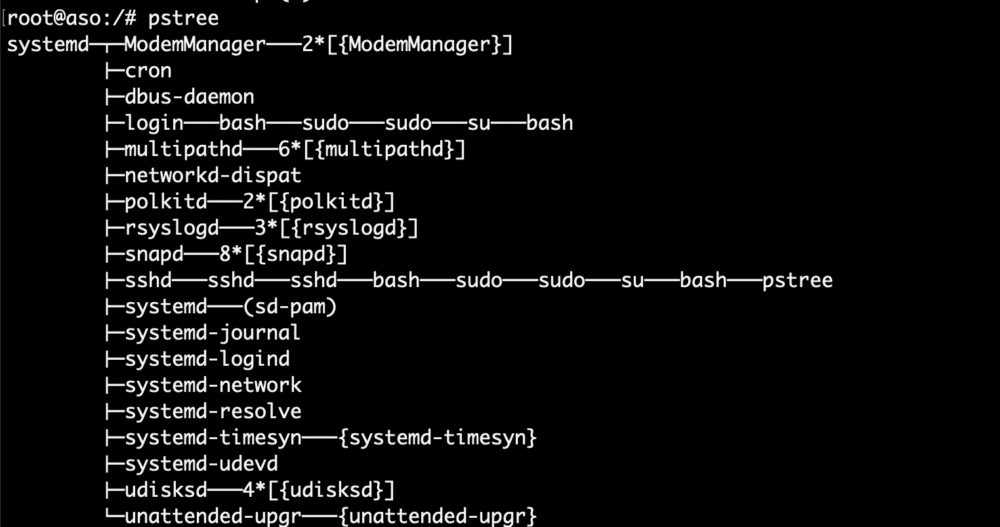
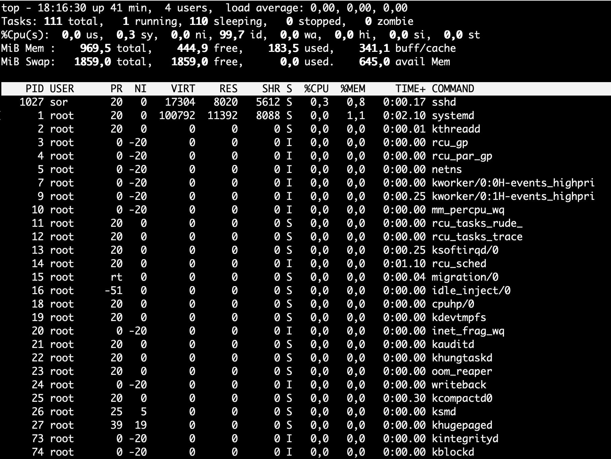
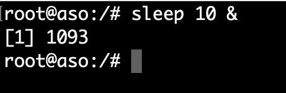
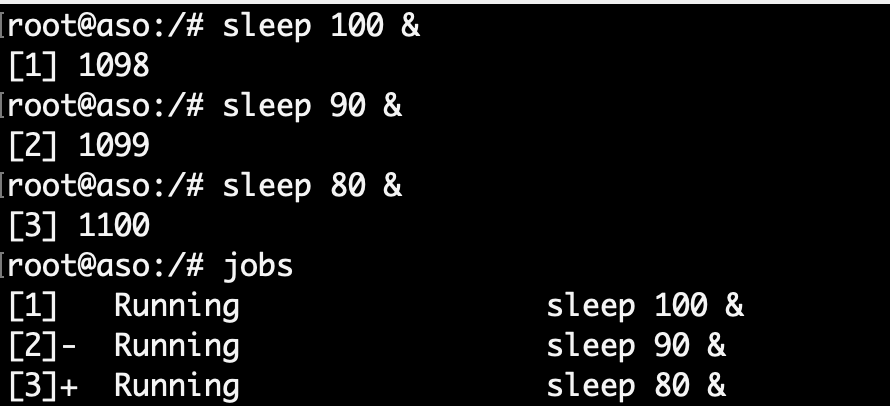
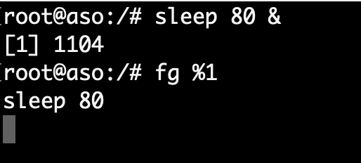
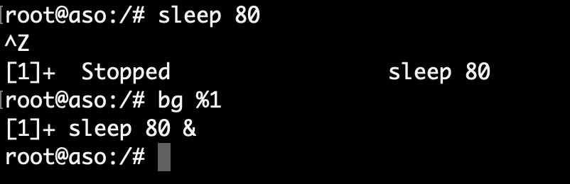
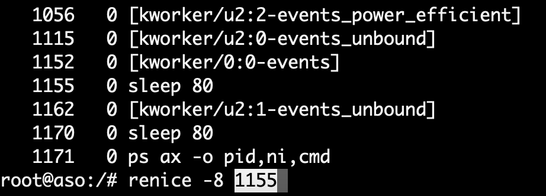
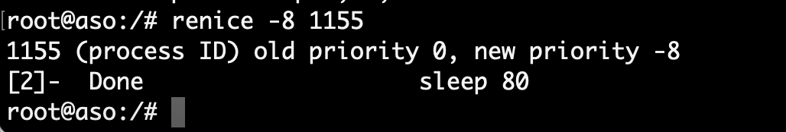

# Gestión de procesos en Shell de Linux

## Introducción

Como se ha comentado en sesiones anteriores un proceso en Linux es un programa en ejecución, el cual puede crear a su vez otros procesos y se caracteriza por:

- El proceso que genera otro proceso se le llama proceso **padre**.
- El proceso generado por otro proceso se le llama proceso **hijo**.
- Los procesos pueden ser padres e hijos y además, varios procesos pueden ser hijos del mismo padre a la vez.

!!! example "Ejemplo"
    **El terminal o consola es un proceso**, ya que se trata de un programa que ejecutamos. Si en el terminal escribimos, por ejemplo, el comando “ls -l”, se estaría generando un nuevo proceso que sería proceso hijo del terminal. En este caso el **shell** sería el proceso **padre** y el comando **“ls -l”** sería el proceso **hijo**.

A continuación se muestra una tabla resumen de comandos para la gestión de procesos:

<figure>
  
  <figcaption>Tabla resumen de comandos de gestión de procesos en bash</figcaption>
</figure>

## Trabajando con procesos

### El comando ps

El comando **ps** proporciona información sobre los procesos que se están ejecutando en el sistema.  Si  escribimos  en  el  terminal  `ps`,  obtendremos  como  salida  un  listado  de  los procesos lanzados con el usuario actual que aún se están ejecutando.

<figure style="display: block; margin-left: auto; margin-right: auto; width: 40%;">
    
    <figcaption>Resultado comando ps</figcaption>
</figure>

!!! note "Nota"
    En la imagen anterior observamos que hay dos procesos corriendo: el bash, que es el shell o intérprete de comandos, y el comando ps.

Las columnas que se muestran cuando ejecutamos el comando **ps** significan:

- La primera columna es el **PID** o identificador de proceso. Cada proceso tiene un asociado identificador que es único, es decir que no puede haber dos procesos con el mismo identificador.
- La  segunda  columna  nos  informa  del  terminal  en  el  que  se  está  ejecutando  el proceso.  Si  aparece  una  interrogación  (?),  el  proceso  no  tiene  asociada  ninguna terminal.
- La tercera columna indica el tiempo total que ha estado ejecutándose el proceso.
- La cuarta columna es el nombre del proceso.

#### Parámetros/modificadores ps

- **-e** devuelve un listado de todos los procesos que se están ejecutando. 

- **-f** devuelve un listado extendido. En este último caso veremos en pantalla el **PPID** del proceso (identificador del proceso padre) y la hora en la que se ejecutó el proceso (STIME).

<figure style="display: block; margin-left: auto; margin-right: auto; width: 60%;">
    
    <figcaption>Resultado comando ps -f</figcaption>
</figure>

- **-ef** obtendríamos un listado extendido de todos los procesos que se están ejecutando en el sistema.

- **-u**  informa  de  los  procesos  lanzado  por  un  determinado  usuario.  De  tal  forma  que  si escribimos “**ps -u javi**”, aparecerá un listado de los procesos que está ejecutando el usuario javi. 

### El comando pstree

El comando **pstree** visualiza, en forma de árbol, todos los procesos del sistema, de esta forma se puede ver las relaciones que existen entre los procesos.

<figure style="display: block; margin-left: auto; margin-right: auto; width: 75%;">
    
    <figcaption>Resultado comando pstree</figcaption>
</figure>

### El comando top

El comando top devuelve un listado de los procesos de forma parecida a como lo hace ps, con la diferencia que la **información mostrada se va actualizando periódicamente** lo que nos permite ver la evolución del estado de los procesos.

En la parte superior se muestra la siguiente información adicional:

- El espacio en memoria ocupado por los procesos.
- El espacio ocupado por la memoria de intercambio o swap.
- El número total de tareas o procesos que se están ejecutando.
- El número de usuarios o el porcentaje de uso del procesador.

<figure style="display: block; margin-left: auto; margin-right: auto; width: 75%;">
    
    <figcaption>Resultado comando top</figcaption>
</figure>

!!! note
    - Mientras el comando top está en marcha podremos cambiar fácilmente la prioridad de los procesos. A modo de resumen cada proceso en Linux tiene un nivel de prioridad que va de -20 (prioridad más  alta)  hasta  20  (prioridad  más  baja).  
    - Cuanto  mayor  sea  el  nivel  de  prioridad,  más lentamente se ejecutará el proceso. 
    - ¿Y cómo podemos cambiar con top la prioridad de un proceso? Muy sencillo. Con el comando top en marcha pulsamos la tecla **"r"**. A continuación introducimos el PID del proceso al que vamos a cambiar la prioridad, y acto seguido el nivel de prioridad que vamos a asignar. Debemos tener en cuenta una consideración, solamente el superusuario **"root"** puede asignar valores negativos a la prioridad de un proceso.

### Procesos en primer plano y segundo plano

Los procesos pueden ejecutarse en **primer plano** (Foreground) o **segundo plano** (Background). 

- El proceso que está en **primer plano** es aquel con el que se interactúa. Si ejecutamos, por ejemplo, el comando `ls -l`, se  mostrará  por  pantalla  el  resultado,  y  hasta  que  no  acabe  de  mostrarse  el  listado  no podremos ejecutar ningún otro comando.

!!! note "Nota"
    En este caso el terminal permanece bloqueado, sin poder introducir ningún otro comando, hasta que el proceso en primer plano termine.

- Un proceso en **segundo plano** añadiendo el símbolo ampersand (**&**) al final del comando. Cuando se ejecuta un proceso en segundo plano, se permite al usuario iniciar y trabajar con otros procesos.

!!! example "Ejemplo"
    **root@aso:/# sleep 10 &** 

El  comando  sleep  simplemente  espera  el  número  de  segundos  que  le  pasemos como parámetro, pero se ejecuta en segundo plano y permite seguir trabajando con el terminal abierto.

<figure style="display: block; margin-left: auto; margin-right: auto; width: 40%;">
    
    <figcaption>Resultado comando sleep 10 &</figcaption>
</figure>

!!! note "Nota"
    En la imagen anterior se observa que al ejecutar un proceso en segundo plano se devuelve un número entre corchetes seguido de otro número. **El número entre corchetes indica el número de procesos que se tienen ejecutándose en segundo plano**. El segundo número es el PID o identificador del proceso.

Para ver que trabajos se están ejecutando en segundo plano, se usa el comando **jobs**.

<figure style="display: block; margin-left: auto; margin-right: auto; width: 50%;">
    
    <figcaption>Resultado comando jobs</figcaption>
</figure>

!!! note "Nota"
    - El signo + seguido del número de trabajo entre corchetes indica el trabajo más reciente que se está ejecutando.
    - El signo - indica el siguiente trabajo más reciente.

### Pasar procesos en segundo plano a primer plano

Para pasar procesos en segundo plano a primer plano, se utiliza el comando **fg**, seguido de **%n**, donde n es el número de proceso que queremos pasar a primer plano.

!!! example "Ejemplo"
    Por ejemplo, **fg %1** pondría en primer plano la tarea número 1. En la siguiente imagen se ejecuta sleep 80 en segundo plano, y después pasa a primer plano con el comando fg.

<figure style="display: block; margin-left: auto; margin-right: auto; width: 40%;">
    
    <figcaption>Resultado comando fg %1</figcaption>
</figure>

### Pasar procesos en primer plano a segundo plano

El comando **bg** permite pasar procesos desde primer plano a segundo plano. 

- Para pasar un proceso que se encuentra en primer plano a segundo plano, debemos suspenderlo primero utilizando la combinación de teclas Ctrl+Z. Cuando se pulsa esa combinación de teclas, el proceso en ejecución se para y no vuelve a ejecutarse hasta que se pasa a primer o segundo plano. 

Con **bg %n** pasaremos el proceso a segundo plano.

<figure style="display: block; margin-left: auto; margin-right: auto; width: 40%;">
    
    <figcaption>Resultado comando fg %1</figcaption>
</figure>

### Cambiando la prioridad de los procesos

Tal Como se  ha  comentado  anteriormente,  cada  proceso  en  Linux  tiene  un  nivel  de prioridad que oscila entre -20 (prioridad más alta) y 20 (prioridad más baja).

!!! tip "Consejo"
    Cuanto mayor sea  el  nivel  de  prioridad,  más  lentamente  se  ejecutará  el  proceso.  **Solamente  el superusuario ‘root’ puede asignar valores negativos a la prioridad de un proceso.**

Para asignar determinada prioridad a un proceso en concreto se utiliza el comando **renice**, el cual es explicado en el siguiente apartado.

### El comando renice

Podemos cambiar la prioridad de un proceso con el comando **renice**. Este comando admite los siguientes parámetros/modificadores:

- **-g**. Establece el nivel de prioridad de los procesos ejecutados por los miembros del grupo especificado.
- **-u**. Establece el nivel de prioridad de los procesos ejecutados por los miembros del usuario especificado.
- **-p**. Indica el nivel de prioridad para el proceso especificado.

!!! example "Ejemplo"
    - Con el comando **ps ax -o pid,ni,cmd** podemos ver la prioridad en la columna **nice**, ya que el indicador **-o** le permite especificar columnas.
    - A continuación se puede cambiar la prioridad con el comando **renice** indicando la nueva prioridad y el PID.
    - en la siguiente imagen se genera un proceso **sleep 80** en background se comprueba su prioridad y se sube a -8.

<figure style="display: block; margin-left: auto; margin-right: auto; width: 60%;">
    
    <figcaption>Búsqueda del comando sleep y su prioridad</figcaption>
</figure>

<figure style="display: block; margin-left: auto; margin-right: auto; width: 60%;">
    
    <figcaption>Resultado comando renice</figcaption>
</figure>

<figure style="display: block; margin-left: auto; margin-right: auto; width: 60%;">
    
    <figcaption>Nueva priorida del proceso Sleep 80</figcaption>
</figure>

**Finalizar procesos** 

Para finalizar un proceso se utiliza el comando **kill**, que tiene la siguiente sintaxis: 

``` bash
kill [parámetro] PID 
```

Si, por ejemplo, queremos eliminar un proceso con **PID 17122**, tendríamos que escribir: **kill 17122**.

Puede  que  en  ocasiones  el  proceso  no  finalice  al  emplear  el  comando  kill  sin parámetros. Para matar un proceso asegurándonos de que no ignorará la petición de finalizar su ejecución se emplea el parámetro -9.

``` bash
kill -9 17122 
```

Hay un total de 32 señales que se pueden enviar a los procesos. Las más utilizadas son las siguientes:

``` bash
- kill -1 (Sighup). Reinicia el proceso. 
- kill -9 (SigKill). Mata el proceso. 
- kill -15 (SigTerm). Termina el proceso. 
```

!!! note "NOTA"
Por otra parte, el comando **killall *nombre\_programa*** finaliza todos los procesos que estén ejecutando el programa.

## Actividades

!!! note "NOTA"
    Escribe el código de los scripts en **PowerShell** que se detallan en cada ejercicio. Deberás crear un fichero de texto para cada ejercicio con el siguiente nombre: ejXXX.sh, donde las X representan el número de ejercicio. Una vez terminada la práctica, comprime todos estos ficheros en uno y súbelos al Moodle.

306. Realiza un script de Shell que encuentre todos los procesos activos e imprima por pantalla al usuario la política de programación (es decir, Algoritmo de planificación utilizado).

307. Modifica el script anterior para que de la opción al usuario de aumentar o disminuir la prioridad de un proceso, a elegir por el usuario ambas variables.

308. Modifica el script anterior para que de la opción al usuario de matar un proceso, a elegir por el usuario.