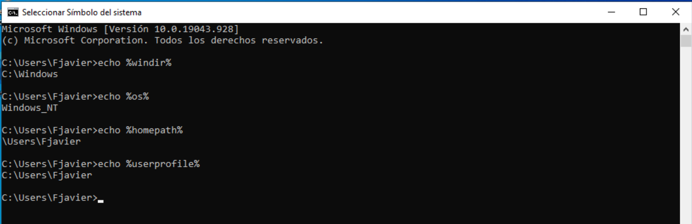

# Estructura de directorios

??? abstract "Duración y criterios de evaluación"

    **Duración estimada: 6 sesiones (2h por sesión)**

    <hr />

    Resultado de aprendizaje y Criterios de evaluación:

    1. Gestiona la automatización de tareas del sistema, aplicando criterios de eficiencia y utilizando comandos y herramientas gráficas.
        1. Se han descrito las ventajas de la automatización de las tareas repetitivas en el sistema.
        2. Se han utilizado los comandos del sistema para la planificación de tareas.
        3. Se han establecido restricciones de seguridad.
        4. Se han realizado planificaciones de tareas repetitivas o puntuales relacionadas con la administración del sistema.
        5. Se ha automatizado la administración de cuentas.
        6. Se han instalado y configurado herramientas gráficas para la planificación de tareas.
        7. Se han utilizado herramientas gráficas para la planificación de tareas.
        8. Se han documentado los procesos programados como tareas automáticas.

## Introducción

- Todos los sistemas operativos se caracterizan por tener una **estructura jerárquica de almacenamiento de la información**.
- Esta información se ubica en las unidades de almacenamiento de **forma arborescente**. Esta estructura comienza en la propia unidad de almacenamiento en la que se van a almacenar los datos.
- El sistema operativo es capaz de gestionar varias unidades de almacenamiento.
- Para realizar la comunicación entre las unidades físicas y el usuario se utiliza una relación que permite al usuario reconocer las unidades físicas gracias a las unidades lógicas.
- Las unidades lógicas son la representación que el sistema operativo hace de cada unidad física.

## Terminología

- **Fichero o Archivo** -> Mecanismo de abstracción que sirve como unidad lógica de información
- **Sistema de archivos** -> Permite organización lógica y física de los archivos
- **Particionado de dispositivos** -> Permite ubicar el sistema de archivos en un dispositivo

## Objetivos

- **Gestión de ficheros** -> Crear, copiar, eliminar… en definitiva manejar datos
- **Optimizar el rendimiento** -> Orden lógico de los archivos para aumentar la velocidad de acceso
- **Seguridad en los datos** -> Soluciones ante pérdidas, Ficheros seguros a errores físicos
- **Acceso controlado a la información** -> Ficheros seguros a errores lógicos y humanos

## Estructura Linux

### Breve Historia 

- La estructura de los directorios en GNU/Linux, así como su contenido y funciones, viene definida en el denominado **Filesystem Hierarchy Standard o FHS** por sus siglas en inglés, que en otras palabras viene a ser **el estándar de jerarquía para los sistemas de archivos en sistemas GNU/Linux y otros derivados de UNIX**.

- El **FHS nació en 1994** y es actualmente mantenida por la Linux Foundation. Aun siendo un estándar, hay casos de distribuciones GNU/Linux que se saltan estas “normas”, aunque en la mayoría de los casos son aceptadas.

### Organización del Sistema de Ficheros

<figure>
  
  <figcaption>Listado de las directorios más importantes y sus funciones</figcaption>
</figure>

#### Desglose de directorios Linux

!!! tip "`/` o "root""
    Toda la estructura de directorios en los sistemas basados en `UNIX` parte de un directorio **raíz** también llamado directorio **root** y que se simboliza por una **barra inclinada** o `/`. 
    
    Desde este directorio es donde nacen todo el resto de directorios, independientemente de dónde estén almacenados físicamente; si en discos o unidades separadas.
    
    Cualquier dirección de archivo o carpeta en **GNU/Linux** empieza por el directorio raíz o `/`, seguido de todos los directorios y subdirectorios que que lo contienen, separados cada uno de ellos por `/`.

!!! tip "/bin"
    El directorio **/bin** es donde se almacenan todos los archivos *binarios* necesarios para garantizar las funciones básicas *a nivel de usuario*.
    
    Sólo almacena los ejecutables de usuario, ya que los binarios necesarios para *tareas administrativas* gestionadas por el usuario root o superusuario del sistema se encuentran en el directorio `/sbin`.
    
    Incluye también los binarios que permiten la ejecución de varias utilidades estándar del terminal de GNU/Linux, concretamente *cat*, *cd*, *cp*, *echo*, *grep*, *gzip*, *kill*, *ls*, *mv*, *rm*, *ping*, *su*, *ps*, *tar* y *vi*.

!!! tip "/boot"
    Es un directorio que contiene los **archivos que son necesarios en el proceso de arranque del sistema**, y que deberán ser utilizados antes que que el kernel empiece a dar las órdenes de ejecución de los diferentes módulos del sistema. Es también donde se encuentra el gestor de arranque **GRUB**.

!!! tip "/dev"
    Este directorio incluye todos los dispositivos de almacenamiento, en forma de archivos, conectados al sistema, es decir, cualquier disco duro conectado, partición, memoria USB, o CDROM conectado al sistema y que el sistema pueda entender como un volumen lógico de almacenamiento.

    Para ver esto en la práctica, si abres una ventana de terminal y ejecutas el comando sudo `fdisk -l`, verás la estructura de particiones de tu sistema.

!!! tip "/home"
    Es el directorio de los usuarios estándar, y por lo tanto, el destinado a almacenar todos los archivos del usuario, como documentos, fotos, vídeos, música, plantillas, etcétera. También incluye archivos temporales de aplicaciones que sirven para guardar las configuraciones de programas.

    Dentro `/home` están los **directorios personales de todos los usuarios**, nombrados según el nombre de usuario utilizado.

!!! tip "/lib"
    Incluye las bibliotecas esenciales que son necesarios para que **se puedan ejecutar correctamente todos los binarios** que se encuentran en los directorios `/bin` y `/sbin`, así como los módulos del propio kernel.
    
    En los sistemas operativos de 64 bits, además de `/lib` existe otro directorio denominado `/lib64`, referida a las bibliotecas para aplicaciones de 64 bits.

!!! tip "/media"
    Representa el punto de **montaje de todos los volúmenes lógicos que se montan temporalmente**, ya sean unidades externas USB u otras particiones de disco.
    
    En la mayoría de distribuciones GNU/Linux, desde hace ya algún tiempo, cada vez que se monta una unidad externa se hace dentro del directorio /media y a su vez dentro de un directorio especifico dependiendo del usuario del sistema que monta el volumen.

!!! tip "/mnt"
    Es un **directorio vacío que cumple funciones similares a /media, pero que actualmente no se suele utilizar**, ya que la mayoría de distribuciones hacen uso de este último para los puntos de montaje temporales.
    
    Aún así existen otras distribuciones más clásicas en las que se produce una distinción entre ambas carpetas: `/mnt` para montajes permanentes, es decir, discos duros conectados internamente, y `/media` para dispotivos con un montaje provisional (unidades extraíbles).

!!! tip "/opt"
    En cierto modo vendría a ser como una extensión del directorio `/usr`, pero en este caso van todos aquellos archivos que son parte de programas instalados al margen de la distribución y que, por lo tanto, no siguen los estándares de almacenar los diferentes archivos dentro de los diferentes subdirectorios de `/usr` (que sería lo recomendable).
    
    **Haciendo una analogía con Windows, vendría a ser algo como el directorio de “Archivos de programa”**.

!!! tip "/proc"
    Este directorio contiene **información de los procesos y aplicaciones que se están ejecutando en un momento determinado en el sistema**, pero realmente no guarda nada como tal, ya que lo que almacena son archivos virtuales, por lo que el contenido de este directorio es nulo. 
    
    Básicamente son listas de eventos del sistema operativo que se generan en el momento de acceder a ellos, y que no existen dentro del directorio como tales.

!!! tip "/root"
    **Es el directorio `/home` del usuario root o superusuario del sistema**. 
    
    A diferencia de los otros usuarios, que se encuentran todos dentro de `/home` en sus respectivas subcarpetas, el directorio del usuario root está en su propia carpeta colgando directamente de la raíz del sistema.

!!! tip "/sbin"
    Si hemos dicho que en `/bin` se almacenaban los binarios relativos a las funciones normales de usuario, `/sbin` hace lo mismo pero para los **binarios relativos tareas propias del sistema operativo**, y que solamente pueden ser gestionadas por el usuario root, tales como el arranque, tareas de restauración, reparación, etcétera.

!!! tip "/srv"
    Sirve para **almacenar archivos y directorios relativos a servidores** que puedas tener instalados dentro de tu sistema, ya sea un servidor web www, un servidor FTP, correo electrónico, etcétera.

!!! tip "/sys"
    Al igual que `/proc`, contiene **archivos virtuales que proveen información del kernel** relativa a eventos del sistema operativo. 
    
    Es en cierto modo una evolución de `/proc`, y a diferencia de este último, los archivos se distribuyen de forma jerárquica.

!!! tip "/tmp"
    Como ya da a entender su nombre, sirve para **almacenar archivos temporales** de todo tipo, ya sea de elementos del sistema, o también de diferentes aplicaciones a nivel de usuario.
    
    Es un directorio dispuesto para almacenar contenido de corta duración, de hecho en la gran mayoría de los casos se suele vaciar de forma automática en cada reinicio del sistema. Aun así, no debes borrar su contenido de forma manual, puesto que puede contener archivos necesarios para ciertos programas o procesos que estén ejecutándose.
    
    Las aplicaciones programadas para almacenar archivos en este directorio deben asumir que sólo serán recuperables en la sesión actual. En este sentido, hay otro subdirectorio, `/var/tmp`, dispuesto igualmente para el almacenamiento de archivos temporales, pero cuyo contenido no se borra de forma automática tras el reinicio del sistema.

!!! tip "/usr"
    El directorio /usr viene de “User System Resources” y actualmente sirve para **almacenar todos los archivos de las aplicaciones de usuario**, incluyendo todo el software instalado a través de los gestores de paquetes de cada distribución.

!!! tip "/var"
    En cierto modo se podría decir que actúa a modo de **registro del sistema**.
    
    Contiene varios archivos con información del sistema, como: archivos de logs, correos electrónicos de los usuarios del sistema, bases de datos, información almacenada en la caché, información relativa a los paquetes de aplicaciones almacenados en /opt, entre otros. 

### Archivos y directorios en GNU/Linux

En los sistemas operativos basados en UNIX, todo es un archivo. Estos archivos poseen dos partes diferenciadas: nombre y extensión. De las dos partes, tan sólo el nombre es obligatorio, por lo tanto, **las extensiones son opcionales**.

Por otra parte, **GNU/Linux es sensible a mayúsculas y minúsculas**, lo que quiere decir que CEO.txt no es lo mismo que ceo.txt. Esto también es aplicable a carpetas. 

!!! tip "Consejo"
    Para prevenir errores es aconsejable usar **minúsculas** para nombrar ficheros y directorios. 
    
    También hay que tener en cuenta el uso problemático de algunos caracteres especiales que también deberemos evitar su uso, como por ejemplo las letras especiales (eñe y c trencada), ni las tildes, ni los caracteres especiales cómo `!`, `@`, `#`, `$`, `%`, `^`, `&`, `*`, `:` y `.

#### Tipos

Se disponen de varios tipos de ficheros en GNU/Linux:

- **Archivos normales**

Los archivos regulares o normales pueden contener datos de usuario, configuraciones del sistema, pueden ser scripts, binarios, ejecutables o no, en cualquier caso, el sistema operativo simplemente maneja estos archivos.

- **Directorios**

Los directorios o carpetas muestran la localización de otros archivos. Son en realidad, pequeños índices que indican al sistema donde ha de ir a buscar para encontrar un fichero en concreto.

- **Enlaces duros o físicos**

Antes de explicar qué es un enlace físico es conveniente que conozcas lo que es un **nodoi**. Todo fichero en `GNU/Linux` posee un **bloque inicial que contiene la información del fichero y enlaces a otros bloques que contienen al propio fichero**. Cuando hacemos cualquier acción sobre un fichero, siempre se empieza consultando este nodo inicial. Haciendo un paralelismo, funciona como el **índice de un libro**.

<figure>
  
  <figcaption>Ejemplo Nodo-I</figcaption>
</figure>

!!! Note "Nota"
    Si necesita referirse a un archivo usando dos nombres distintos, puedes crear un **enlace duro**. 
    
    El enlace duro tendrá el mismo **i-nodo** que el archivo original y guarda el mismo aspecto y comportamiento. 
    
!!! Warning
    Hay que tener en cuenta que no pueden existir enlaces duros entre dos archivos de particiones separadas, ya que cada una de ellas tiene su propia tabla de **nodos-i**.

- **Enlaces simbólicos**

Para salvar la imposibilidad anterior, entre otras cosas, disponemos de otro tipo de archivos conocido como **enlaces simbólicos**. 

A diferencia de los enlaces duros, que apuntan a un archivo por su i-nodo, un enlace simbólico apunta a otro archivo por su nombre. Esto nos
permite enlazar (apuntar) a otros archivos localizados en otras particiones, e incluso en otras unidades de red. 

!!! Note
    En otro sistemas operativos se funcionan de forma similar a los accesos directos.

## Estructura Windows

A groso modo en las distintas versiones de Windows se puede encontrar, aunque pueden existir excepciones en las mismas:

1. **Carpeta de Windows** ---> `C:\Windows`
2. **Carpeta del sistema** ---> `C:\Windows\System32`
3. **Archivos de programa** ---> `C:\Program Files`
4. **Archivos de programa, datos comunes** ---> `C:\Program Files\Common Files`
5. **Datos de programas compartidos** ---> `C:\ProgramData`
6. **Fuentes** ---> `C:\Windows\Fonts`
7. **Herramientas administrativas compartidas** ---> `C:\ProgramData\Microsoft\Windows\StartMenu\Programs\Administrative Tools`
8. **Programas en el menú de Inicio** ---> `C:\ProgramData\Microsoft\Windows\Start Menu`
9. **Programas que arrancan con el inicio de Windows** ---> `C:\ProgramData\Microsoft\Windows\StartMenu\Programs\Startup`
10. **Carpetas compartidas (Publicas)** ---> `C:\Users\Public`
11. **Cache de búsquedas hechas en Windows** ---> `C:\ProgramData\Microsoft\Search\Data\Applications\Windows`

### Carpetas de usuario

Las carpetas de los usuarios se encuentran en "`Users`" o "`Usuarios`" en el disco Raíz donde está instalado el sistema operativo contiene algunas como:

1. Escritorio
2. Mi música
3. Mis documentos
4. Mis imágenes
5. Contactos
6. Favoritos
7. Archivos temporales
8. Archivos temporales de internet
9. Cookies
10. Datos de programa

#### Accesos a carpetas importantes

Hay algunas variables del sistema que se refieren a directorios, que es importante conocer, entre ellas:

1. `%windir%` directorio de Windows.
2. `%os%` muestra el sistema operativo
3. `%homepath%` equivale a la carpeta del usuario en Usuarios o User
4. `%programfiles%` muestra archivos de programa
5. `%path%` muestra el path del sistema
6. `%Comspec%` Reinicia la consola o la abre
7. `%systemroot%` Igual que %windir%
8. `%allusersprofile%` Equivale a Allusers en Usuarios o Users
9. `%Temp%` o `%Tmp%` Equivale a la carpetade archivos temporales de Internet.

<figure>
  
  <figcaption>Muestra de algunas de las variables del Sistema de Windows</figcaption>
</figure>

## Búsqueda de información del sistema. Órdenes. Herramientas gráficas.

### Herramientas y comandos Información Linux

#### Comandos

- **Principales comandos**

| Comando      | Acción                               | Comando      | Acción                                  |
| ------------ | ------------------------------------ | ------------ | --------------------------------------- |
| `mkdir`      | crea directorios  | `zip`    | comprime ficheros en formato ZIP         |
| `rmdir`       | elimina directorios             | `unzip`       | descomprimir ficheros ZIP                    |
| `touch`     | crea un archivo nuevo       | `bz2`    | comprime ficheros en formato BZ2                       |
| `rm`    | elimina ficheros        | `cat` | muestra el contenido de un fichero  |
| `cp`  | copia archivos y directorios     | `diff`    | muestra diferencias entre ficheros                      |
| `ln`    | crea enlaces físicos y simbólicos               | `find` | se utiliza para encontrar archivos en un determinado directorio     |
| `tar`     | empaqueta ficheros                 | `grep`      | para encontrar texto dentro del archivo que le indiquemos            |

- **El directorio** `/proc`

Este directorio es lo conocido como **Pseudofilesystem**. Guarda información sobre el sistema y los procesos. Características:

1. Se inicializa durante el arranque.
2. Está implementado en memoria y no se guarda en disco.
3. La estructura del directorio `/proc` depende de la versión del kernel.
4. Los comandos vistos (ps, top, etc.) obtienen la información sobre los procesos de este directorio.

!!! note "Nota"
    **En el kernel 2.6 de Linux aparece un nuevo pseudofilesystem (/sys) que reemplaza al /proc en lo que se refiere a visualización y ajuste de dispositivos**


- **El Comando** `uname`

Este comando permite averiguar información del Sistema como el nombre de la máquina, versión del sistema operativo,etc, sin necesidad de acceder al directorio /proc

``` yaml
uname [-snrvma] [--sysname] [--nodename] [--release] [--machine][--all] [--help] [--version]
```

<figure>
  
  <figcaption>Modificadores Comando uname</figcaption>
</figure>

<figure>
  
  <figcaption>Ejemplos de ejecución del comando uname</figcaption>
</figure>

- **El Comando** `dmesg`

**dmesg (diagnostic message, mensajes de diagnóstico)** es una instrucción presente en los sistemas operativos Unix que lista el buffer de mensajes del núcleo. Este búfer contiene una gran variedad de mensajes importantes generados durante el arranque del sistema, como la detección del hardware, asignación de controladores (drivers) y durante la depuración de aplicaciones. Características:

1. En realidad es una visualización del fichero `/var/log/dmesg`.
2. Dmesg puede ser muy útil para solucionar problemas o simplemente tratando de obtener información sobre el hardware en un sistema.
3. La salida del fichero es demasiado grande, por eso suele utilizarse con tuberías para filtrar la información que necesitamos, algunos ejemplos serían:

``` yaml
dmesg | less
dmesg> boot_messages
dmesg | grep -i usb
dmesg | grep -i TTY
dmesg | grep -i dma
```

La salida de **dmesg** se mantiene en el archivo de registro `/var/log/dmesg`, y puede por lo tanto también ser vista fácilmente por leer ese archivo con un editor de texto , como por ejemplo `vi` o `gedit`, o con un comando como `cat`, por ejemplo:

``` yaml
cat /var/log/dmesg | tail -f
```

#### Herramientas

##### SysStat

**SysStat** es una colección de herramientas con la que podremos **monitorizar nuestro sistem**a, que además es de código abierto y gratuita. Con estas herramientas podremos depurar problemas de rendimiento en sistemas Gnu/Linux, también nos permitirá ver los datos de rendimiento del sistema en tiempo real, o analizar los datos de los archivos que estas herramientas pueden generar.

- **Utilidades SysStat**

1. **iostat**: Estadísticas de Cpu, entradas y salidas de dispositivos, particiones y sistema sde ficheros de red.
2. **mpsta**t informa sobre estadísticas relacionadas con el o los procesadores.
3. **pidstat** Información estadística sobre procesos linux: Entradas/salidas, Cpu, memoria,etc.
4. **sar** recoge , informa y salva información sobre actividad del Sistema como CPU, memoria, discos , interrupciones, interfaces de red, terminals, tablas del kernel, etc.
5. **sadc** Es el recolector de datos de la actividad del Sistema.
6. **sa1**: Recoge información y la guarda en el fichero diario de datos de actividad del sistema. Es el front-end que utiliza sadc para que se ejecute desde cron.
7. **sa2** escribe un informe --resumen de la actividad diaria. Es un front-end de sar que está diseñado para ser ejecutado desde cron.
8. **sadf** muestra los datos que recolecta sar en multiples formatos(CSV, XML, etc.) Esto es util para cargar los datos de rendimiento en una base de datos o importarla desde una hoja de cálculo para crear gráficos.

- **Instalar y configurar SysStat en Ubuntu 20.04 | Ubuntu 18.04**

1. **Paso 1:**

Ejecute el siguiente comando si desea utilizar el administrador de paquetes:

``` yaml
sudo apt install sysstat -y
```

2. **Paso 2:**

Dado que el monitoreo SysStat está deshabilitado de manera predeterminada, debe editar el archivo de configuración en un editor de texto para habilitar el monitoreo SysStat. Entonces, habilitemos el monitoreo de SysStat y editemos el siguiente archivo y guárdelo.

``` yaml
sudo vim /etc/default/sysstat
```

Luego, debe establecer ENABLED en verdadero como se muestra en el apartado anterior:

``` yaml
ENABLED="true"
```

<figure>
  
  <figcaption>Habilitar sysstat</figcaption>
</figure>

Ahora se puede guardar y cerrar el archivo.

Para que los cambios sujan efectos se deben activar el servicio mediante los siguientes comandos.

``` yaml
sudo systemctl enable sysstat
```

``` yaml
sudo systemctl start sysstat
```

!!! note "Nota"
    A partir de este momento, se pondrá en marcha la recopilación de datos según se indica en `/etc/cron.d/sysstat`. Y se pueden encontrar todos los archivos de registro en el directorio `/var/log/sysstat`. Los nombres de archivo serán sa1, sa2, etc. (1 y 2 son los datos del mes actual). 

###### Ejemplos de busqueda y visualización de información

1. `sar`. Para visualizar el uso actual de la **CPU**. Utilice -u con el comando asterisco para ver la CPU estática en tiempo real.

``` yaml
sar -u
```

- Se pueden ver los usos de la CPU en tiempo real si especifica el intervalo en tiempo real y el número de veces que se mostrarán los datos. Veamos un ejemplo: para ver los usos de la CPU en tiempo real 5 veces con la diferencia de 1 segundo.

``` yaml
sar -u 1 5
```

- Dado que la mayoría de las CPU son de varios núcleos, se pueden ver los datos de utilización de la CPU con más profundidad. Utilice el modificador *-P ALL* para ver los detalles de utilización de cada núcleo individualmente.

``` yaml
sar -P ALL 1 3
```

- Para ver cómo ver los datos históricos con SysStat, se pueden visualizar con el comando `sar`, el cual mantiene 7 días de datos de forma predeterminada, pero es posible cambiar el número de días en el archivo `/etc/sysstat/sysstat`

``` yaml
HISTORY=28
```

- Para ver el informe de utilización de memoria de los datos del 20 del mes actual, se utilizaría el siguiente comando:

``` yaml
sar -r -f /var/log/sysstat/sa20
```

- El tiempo de rango se puede especificar con el comando anterior. Solo puede ver la estadística entre un tiempo determinado. Para ver estadística entre las 10:00 p.m. y las 11:00 p.m., se utilizaría el siguiente comando:

``` yaml
sar -r -f /var/log/sysstat/sa20 -s 22:00:00 -e 23:00:00
```

!!! note "Nota:"
    El archivo de los datos requeridos se proporciona con la opción *-f* para ver los datos históricos de sar.

- Entonces, se puede usar el comando a continuación para ver los datos de utilización de la CPU de cualquier fecha con el comando `sar`:

``` yaml
sar -u -f /var/log/sysstat/sa28
```

2. `iostat` -> Ver el uso del dispositivo _ Utilice el comando **iostat** para encontrar la estadística del disco. iostat muestra la transferencia de datos actual por segundo, el número total de bloques leídos y escritos en el disco y un bloque promedio por segundo.

``` yaml
iostat -d 1 5
```

- Se pueden observar más detalles con los siguientes modificadores:

    1. **tps** -> Transferencia por segundo
    2. **Blk_read / s** -> Cantidad total de datos leídos en bloques por segundo.
    3. **Blk_wrtn / s** -> Cantidad total de datos escritos en bloques por segundo.
    4. **Blk_read** -> Lectura total del bloque.
    5. **Blk_wrtn _** -> Bloque total escrito.

- Utilice el siguiente comando para ver estadísticas de **E/S** más extendidas del disco.

``` yaml
iostat -x 1 5
```

3. `pidstat`. El uso del comando `pidstat` con el modificador *-d le* brinda detalles de los procesos que se están ejecutando actualmente en los sistemas.

``` yaml
pidstat -d
```

- Si se prueba `pidstat` con *-r* sirve para mostrar la utilización de recursos por procesos cada 1 segundo durante las 5 veces.

``` yaml
pidstat -r 1 5
```

- Para Datos de utilización de la memoria se puede utilizar el comando `sar` con *-r* para ver los detalles de la utilización de la memoria actual para las 5 veces cada 1 segundo.

``` yaml
sar -r 1 5
```

4. `isag`. Herramienta gráfica que previamente debemos instalar.Podemos utilizar cualquiera de los ficheros de los dias en los que hay recogidos datos.

<figure>
  
  <figcaption>Ejemplo gráfica de isag</figcaption>
</figure>

##### Syslog

**Syslog** es un **sistema de logs** que se encarga principalmente de la administración de logs, los cuales son generados por eventos del sistema, sus
programas o por el Kernel. Características:

1. El envió de mensajes **Syslog** fue usado inicialmente en sistemas basados en UNIX para registrar eventos de aplicaciones, sistema operativo o red.
2. Es común ahora encontrar equipos de redes que pueden generar y enviar mensajes Syslog a equipos configurados con un demonio que los reciba y existen incluso implementaciones para sistemas Windows.
3. En la mayoría de distribuciones linux, se puede encontrar el demonio **syslogd** que se encarga de leer y enviar mensajes a la consola del sistema, ficheros de log y a otras máquinas y/o otros usuarios. Para esto se guían por un fichero de configuración que indican que mensajes y a dónde enviarlos. Este es `syslog.conf`.

###### Syslog.conf 

Este archivo de configuración de logs contiene líneas con dos campos, separados por tabuladores o espacios:
 
1. **Selector:** Especifica que mensajes tratar teniendo en cuenta el tipo de mensaje y la prioridad.
2. **Acción:** Qué se va a hacer con ese mensaje.

!!! note "Nota"
    Una regla puede ser dividida en varias líneas si todas las líneas excepto la última terminan con un carácter de backslash `\`.

- **Selectores:** Los selectores se escriben como un **nombre de función, un punto y un nivel**, sin ningún espacio entre ellos. Estos no son sensibles a las mayúsculas/minúsculas.
 
1. La función puede ser una de estas: **auth, authpriv, cron, daemon, kern, lpr, mail, mark, news, syslog, user, uucp y local0 hasta local7**.
2. El nivel indica la gravedad del mensaje a tratar y puede ser: **emerg, alert, crit, err,warning, notice and debug**

!!! note "Nota"
    Cuando syslogd recibe un mensaje que encaja con la función y es del nivel de gravedad indicado, realiza la función que se indica en el campo de acción.

- **Acciones**:

1. Un **nombre de fichero** con dirección absoluta. En cuyo caso los mensajes irán a este fichero.
2. Una **tubería con nombre** .Su nombre comenzará por el carácter “`|`”.Este es un tipo de fichero especial, que puede ser tratado por determinados programas, por ejemplo, para depuración.
3. Un **nombre de equipo**. Para esto ponemos el nombre del equipo comenzando por “@”.En este caso, el mensaje se enviará al syslog del equipo que se nombró.
4. Una **lista de usuarios** separados por comas. Se envía el mensaje a estos usuarios.
5. Un **asterisco**. En este caso , se envía el mensaje a todos los usuarios que tengan una sesión abierta en el sistema.

!!! note "Nota"
    - Se pueden poner varias acciones separadas por “`;`”.
    - También pueden ponerse varias funciones para un mismo nivel, separándolos con “`,`”. 
    - Se puede utilizar un “`*`” para indicar todas las funciones o todos los niveles. 
    - Si queremos que sólo sean los de ese nivel en concreto, debemos utilizar un “`=`”.
    - También podemos negar niveles utilizando el símbolo “`!`” delante del número de nivel.
    - Si queremos que ciertos mensajes no se envíen, puede utilizarse el nivel “`none`”.
    - Si se indica la función especial “`mark`”, se recibe un mensaje de prioridad “`info`” cada 20 minutos.
    - Las líneas que comienzan por “`#`” se ignoran, son comentarios. También las líneas en blanco.

- Ejemplo **Syslog.conf** Ubuntu:

``` yaml
A configuration file might appear as follows:

     # Log all kernel messages, authentication messages of
     # level notice or higher and anything of level err or
     # higher to the console.
     # Don't log private authentication messages!
     *.err;kern.*;auth.notice;authpriv.none  /dev/console

     # Log anything (except mail) of level info or higher.
     # Don't log private authentication messages!
     *.info;mail.none;authpriv.none          /var/log/messages

     # The authpriv file has restricted access.
     authpriv.*                                              /var/log/secure

     # Log all the mail messages in one place.
     mail.*                                                  /var/log/maillog

     # Everybody gets emergency messages, plus log them on another
     # machine.
     *.emerg                                                 *
     *.emerg                                                 @arpa.berkeley.edu

     # Root and Eric get alert and higher messages.
     *.alert                                                 root,eric

     # Save mail and news errors of level err and higher in a
     # special file.
     uucp,news.crit                                          /var/log/spoolerr
```

!!! tip "Documentación syslog.conf"
    [syslog manpages ubuntu](http://manpages.ubuntu.com/manpages/bionic/man5/syslog.conf.5.html)

###### Otros ficheros de log

Algunos de los ficheros estándares en Linux son:
 
1. `/var/log/syslog` y `/var/log/messages` -> Guardan casi toda la información de log sólo niveles info y superiores.
2. `/var/log/auth.log` -> Información de autenticación

- Existen aplicaciones que no utilizan syslog y guardan sus logs en ficheros específicos como `/var/log/XFree86.0.log` para el sistema de **Xwindows**, de este tipo también se destacan los siguientes:
 
1. `/var/log/wtmp` -> Guarda información sobre hora, fecha y terminal de login de los usuarios que se han conectado o están conectados al sistema. Características:
    1. Es un fichero binario
    2. Se lee mediante el comando
 
2. `/var/log/btmp` -> Similar a guarda información sobre los logins fallados. Características:
    1. Se lee mediante el comando `lastb`.
 
3. `/var/run/utmp` -> Guarda información sobre hora, fecha y terminal de login de los usuarios conectados actualmente al sistema
    1. Es un fichero binario
    2. Lo leen los comandos `users` y `finger`.
 
4. `/var/log/lastlog` -> Guarda la hora y fecha del login más reciente para cada usuario del sistema
    1. Es un fichero binario
    2. Se lee con el comando
 
5. `/var/log/faillog` -> Guarda información sobre los fallos de acceso
    1. Se lee con el comando
    2. Este comando también permite especificar límites de fallos antes de inhabilitar la cuenta

6. `/var/log/dmesg` -> Información escrita por el kernel en el arranque del sistema
    1. El kernel escribe sus mensajes en un buffer circular.
    2. El contenido de este buffer puede verse con el comando `dmesg` como se ha visto anteriormente.

###### Rotación de ficheros de log

Los ficheros de **log** deben sanearse, porque crecen desmedidamente. Interesa guardarlos en ficheros comprimidos cada cierto tiempo y crear uno nuevo. 

Cuando un paquete individual (como httpd, bacula, vsftpd, yum, etc.) se instala, éste añade en el directorio `/etc/logrotate.d/` su fichero de configuración logrotate encargado de la gestión de los logs. 

**Para aquellos logs que no tengan este directorio**, se puede usar la utilidad logrotate incluyendola en el cron.

!!! note "Nota"
    **cron** es un administrador regular de procesos en segundo plano (demonio) que ejecuta procesos o guiones a intervalos regulares (por ejemplo, cada minuto, día, semana o mes). Los procesos que deben ejecutarse y la hora a la que deben hacerlo se especifican en el archivo crontab. 
    El nombre cron proviene del griego *chronos* (χρόνος) que significa "tiempo".

- La utilidad logrotate tiene un fichero de configuración, por ejemplo:

``` yaml
# see “man logrotate” for details
# rotate log files weekly
weekly
 
# keep 4 weeks worth of backlogs
rotate 4
 
# send errors to root
errors root
 
# create new (empty) log files after rotating old ones
create
 
# uncomment this if you want your log files compressed
#compress
 
# RPM packages drop log rotation information into this directory
include /etc/logrotate.d
 
# no packages own wtmp or btmp -- we’ll rotate them here
/var/log/wtmp {
monthly
create 0664 root utmp
rotate 1
 
}
 
/var/log/btmp {
   missingok
   monthly
   create 0664 root utmp
   rotate 1
 
}
 
# system-specific logs may be configured here
```

!!! note "Nota"
    Este fichero rige los rotados de logs, en este caso se haran cada semana ( weekly ), guardaran los logs antiguos 4 semanas y creará unos nuevos cada vez que lo rote. Además existe la posibilidad de especificar el comportamiento específico de algunos ficheros determinados en este caso btmp y wtmp.


### Herramientas y comandos Información Windows

#### Comandos

##### msinfo32
 
El comando `msinfo32` se utiliza para ver información acerca de un equipo que esté administrando. Con este comando puede:

- Utilizar Información del sistema desde un archivo por lotes.
- Abrir Información del sistema y que muestre sólo las categorías especificadas.
- Guardar un archivo de información del sistema sin abrir la herramienta Información del sistema.
- Iniciar Información del sistema de un equipo remoto. (Debe tener los permisos adecuados.)
- Crear un acceso directo que abra Información del sistema en una configuración utilizada habitualmente.
- Esta utilidad se puede utilizar de forma gráfica o bien en modo texto. También se puede emplear como comando y generar un informe que puede ser de tipo texto (report) o bien un fichero que luego se puede abrir desde la aplicación msinfo32 (nfo).
- También pueden generarse informes que sólo incluyan las características que queramos.

<figure>
  
  <figcaption>Prueba de `msinfo32` </figcaption>
</figure>

!!! tip "Documentación Oficial"
    Se puede encontrar más información de esta comando en la documentación oficial en este enlace: [documentación oficial msinfo32](https://docs.microsoft.com/en-us/previous-versions/windows/it-pro/windows-server-2003/cc782171(v=ws.10)?redirectedfrom=MSDN)

- **Sintaxis**
 
``` yaml 
msinfo32 [/pch] [/nfo ] [/report ] [/computer ] [/showcategories] [/category ] [/categories {+(+)|+all(-)}]
```

!!! tip "Documentación Sintaxis"
    [Enlace Sintaxis msinfo32](https://docs.microsoft.com/en-us/previous-versions/windows/it-pro/windows-server-2008-R2-and-2008/cc731397(v=ws.10)?redirectedfrom=MSDN)

##### Comandos PowerShell

###### CimCmdlets

Los cmdlets del módulo CimCmdlets son los más importantes para tareas de administración generales del sistema. Todas las opciones de configuración críticas del subsistema se exponen a través de WMI. Donde el cmdlet más utilizado es: `Get-CimInstance`

- Ejemplos

1. Enumerar la configuración del escritorio

``` yaml
Get-CimInstance -ClassName Win32_Desktop

```
2. Enumerar información del BIOS

``` yaml
Get-CimInstance -ClassName Win32_BIOS

```

3. Enumerar información del procesador

``` yaml
Get-CimInstance -ClassName Win32_Processor | Select-Object -ExcludeProperty "CIM*"

```

4. Enumerar el modelo y el fabricante del equipo

``` yaml
Get-CimInstance -ClassName Win32_ComputerSystem

```

!!! tip "Documentación Ejemplos"
    [Enlace Ejemplos Get-CimInstance](https://docs.microsoft.com/es-es/powershell/scripting/samples/collecting-information-about-computers?view=powershell-7.2)

###### Recopilación de información.

| Comando      | Acción                               | 
| ------------ | ------------------------------------ | 
| `Get-ComputerInfo`      | obtener información diversa sobre los objetos de la cuenta de la máquina  |
| `Get-EventLog`      | Obtiene los eventos del visor de eventos de Windows  |
| `Get-AppXPackage`      | Resuelve inconvenientes con las aplicaciones integradas  |
| `Get-Process`      | Información sobre los procesos en el sistema  |
| `Get-LocalUser`      | Obtiene información de las cuentas de usuarios locales  |
| `Get-MpComputerStatus`      | permite mostrar el estado actual de Windows Defender  |

#### Herramientas

##### Sysinternals

El sitio web de **Sysinternals** lo crearon en **1996 Mark Russinovich y Bryce Cogswell** para alojar sus utilidades de sistema avanzadas, junto con información técnica.

En **julio de 2006, Microsoft adquirió Sysinternals**. Tanto profesionales como desarrolladores de TI encontrarán utilidades en Sysinternals para facilitar la administración y el diagnóstico de sistemas y aplicaciones de Windows, así como la solución de problemas que pudieran surgir al respecto.

!!! note "Nota"
    Es necesario instalar previamente. Se puede descargar esta suite de forma gratuita desde el enlace: [ENLACE](https://docs.microsoft.com/en-us/sysinternals/downloads/sysinternals-suite)

**Incorpora herramientas como:**

- **Utilidades de disco y archivos:** Utilidades para ver y supervisar el acceso a los discos y archivos, así como el uso que se hace de ellos. [ENLACE](https://docs.microsoft.com/es-es/sysinternals/downloads/file-and-disk-utilities?redirectedfrom=MSDN)

- **Red:** Herramientas de red, desde monitores de conexión a analizadores de seguridad de recursos.

- **Procesos y subprocesos:** Utilidades para consultar de forma subyacente los procesos en ejecución y los recursos que consumen. [ENLACE](https://docs.microsoft.com/es-es/sysinternals/downloads/process-utilities?redirectedfrom=MSDN)

- **Utilidades de seguridad:** Utilidades de administración y configuración del sistema de seguridad, con programas de rootkit y de captura de spyware. [ENLACE](https://docs.microsoft.com/es-es/sysinternals/downloads/security-utilities?redirectedfrom=MSDN)

- Información del sistema: Utilidades para consultar el uso y la configuración de los recursos del sistema. [ENLACE](https://docs.microsoft.com/es-es/sysinternals/downloads/system-information?redirectedfrom=MSDN)

- **Varios:** Una colección de utilidades variadas que incluye un protector de pantalla, ayuda de presentación y una herramienta de depuración.

!!! note "Nota"
    Estas utilidades simplemente se extraen del paquete y se ejecutan, no es necesario instalarlas.

<figure>
  
  <figcaption>Autorun SysInternals</figcaption>
</figure>

##### Monitor de recursos de Windows 10

El monitor de recursos de Windows 10 es una de las muchas herramientas integradas del sistema operativo de Microsoft que son bastante desconocidas por los usuarios pero que, bajo determinadas circunstancias, pueden sernos de mucha utilidad.

El primer paso es, obviamente, acceder a esta herramienta. Para ello, simplemente pulsa sobre el botón de Inicio y escribe «Monitor de recursos» (no confundir con monitor de rendimiento).

<figure>
  
  <figcaption>Acceso Monitor de Recursos</figcaption>
</figure>

Al abrir la herramienta aparece, inicialmente, una ventana que nos muestra información general sobre la CPU, el disco, la red y la memoria RAM. A la derecha tenemos unas gráficas que nos muestran estadísticas de utilización de estos cuatro parámetros en el último minuto.

<figure>
  
  <figcaption>Pestañas Monitor de Recursos</figcaption>
</figure>

## Actividades Iniciales UD4_00

401. Comando `find` en GNU/Linux. Escribe cada uno de los comandos en GNU/Linux necesarios para realizar las instrucciones que se describen a continuación:

  - Encuentra en el directorio actual, todos los archivos que empiecen con la letra H.
  - Busca en el directorio actual, todos los archivos que contengan la letra F en su nombre.
  - Encuentra en el directorio actual, todos los archivos que empiecen por la letra h que contengan una a y que terminen con la letra s.
  - Halla todos los archivos del sistema que contengan la extensión conf en su nombre y que hayan sido modificados en las últimas 24 horas.
  - Obtén todos los archivos del directorio home del usuario actual y que sean de su propiedad, que contengan una x en su nombre o terminen con la letra o.
  - Localiza todos los archivos del sistema que contengan la extensión conf en su nombre y que pertenezcan al usuario root.
  - Encuentra todos los archivos del sistema a los que tenga permisos de escritura y que no hayan sido modificados en las últimas 24 horas.
  - Busca todos los archivos en la carpeta home del usuario actual que sean más recientes que el archivo config.txt.
  - Lista todos los directorios de la carpeta actual que contengan en su nombre la palabra user.
  - Encuentra todos los ficheros del sistema con extensión tmp que no sean del usuario root.
  - Obtén todos los archivos del sistema que tengan extensión avi o mpg, que ocupen más de 650 megas, que tenga permisos de lectura y que contengan la palabra guerra en su nombre.
  - Halla todos los archivos temporales. La información de cada fichero será mostrada en formato largo (-utiliza la opción -exec).
  - Encuentra y elimina todos los archivos con la extensión tmp del sistema (utiliza la opción –exec).
  - Encuentra en el directorio actual y en todos los subdirectorios, todos los ficheros que contengan la palabra main en su nombre. Muestra el resultado en formato largo (utiliza la opción –exec).
  - Localiza y copia al directorio Textos situado en el escritorio del usuario actual (asumimos que el directorio existe) todos los ficheros que tengan extensión txt, docx o odt (utiliza la opción –exec).
  - Encuentra y copia al directorio Textos situado en el escritorio del usuario actual (asumimos que el directorio existe) archivos que no sean del usuario filipino y que no hayan sido modificados en los últimos cinco días (utiliza la opción –exec).

!!! note "NOTA"
    Crea archivos que contengan los patrones que se piden en los apartados si es necesario, o situate en el directorio adecuado para encontrar archivos siguiendo dichos patrones.

402. Utiliza las siguientes herramientas de Sysinternals:

- Probar quién tiene acceso a tu carpeta de trabajo. (utilizar **Access enum**).
- Utiliza **VMMap** e indica qué está mostrando.
- Utiliza un programa de **Sysinternals** que te diga quien se ha “logeado” en en tu equipo. Haz que un compañero acceda a una carpeta compartida de tu equipo y vuelve a mostrarlo ¿aparece que su usuario está accediendo?

## Actividades de desarrollo UD4_01

403. A medida que pasa el tiempo, los archivos de log (registro de errores y eventos) aumentan su tamaño considerablemente, con lo cual es recomendable implementar su rotación. Instala `logrotate` y configura la rotación de logs de un servidor DHCP.

404. (POWERSHELL)Realiza un inventario de tu equipo mediante llamadas CIM (`Get-CimInstance`) y convierte la información a formato JSON.

!!! note "NOTA"
    **JavaScript Object Notation (JSON)** es un formato basado en texto estándar para representar datos estructurados en la sintaxis de objetos de JavaScript.