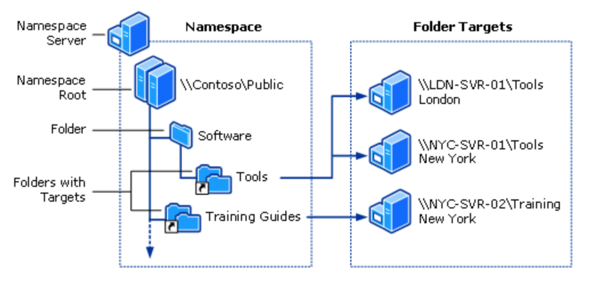

# Sistema de archivos virtual.

## VFS

Un **sistema de archivos virtual (VFS)** o conmutador de sistema de archivos virtual es una capa de abstracción encima del sistemas de archivos.

- El propósito  de  un  VFS  es  permitir  que  las  aplicaciones  cliente  tengan  acceso  a  diversos tipos  de  sistemas  de  archivos  específicos  (*FAT*,  *ext3*,  *NTFS*,  etc.)  de  una  manera uniforme.
- Puede  ser  utilizada  para  transparentar  las  diferencias  en  los  sistemas  de archivos de *Windows*, *Mac OS*, *Unix*, etc. de modo que las aplicaciones pudieran tener acceso a archivos en los sistemas de archivos locales de esos tipos sin tener que saber a qué tipo de sistema de archivos están teniendo acceso.
- Un **VFS** especifica una interfaz (o un contrato) entre el núcleo y un sistema de archivos en concreto. Por lo tanto, es fácil agregar nuevos sistemas de archivos al núcleo.

<figure>
  
  <figcaption>Esquema VFS</figcaption>
</figure>

### Tipos de archivos soportados

Los sistemas de archivos soportados por VFS pueden agruparse en tres clases principales:

1. **Sistema de archivos basados en disco**: consiste en el manejo del espacio de disco u otro dispositivo que emula a un disco como un dispositivo de memoria flash. Alguno de estos sistemas de archivos son:

- Sistemas de archivos nativos de Linux como: ext2, ext3 y ReiserFS
- Sistemas de archivos derivados de Unix como: System V FS, Xenix, BSD FS, Solaris FS, Minix FS
- Sistema de archivos de Microsoft como: MS-DOS, VFAT, NTFS
- Sistemas de archivos de CD-ROM como: ISO9660, sistema de archivos UDF (Universal Disk Format para DVD)
- Sistemas dearchivos propietarios de IBM, Apple, etc.

2. **Sistemas de archivos de red:** permiten el acceso a archivos almacenados en servidores de red y también sistemas de archivos distribuidos como: NFS, Coda, AFS (Andrew filesystem), CIFS (Common Internet File System, usados en Microsoft Windows), y NCP (Novell NetWare Core Protocol).

3. **Sistemas de archivos especiales:** no manejan espacio de almacenamiento en disco en forma local ni en forma remota. Tal es el caso de sistemas emulados en memoria como el bien conocido `/proc` de Unix|Linux.

### Funcionamiento

Para conseguir su objetivo **VFS** maneja las llamadas al sistema operativo que realiza un proceso, usando la semántica Unix estándar. Cuando un proceso de usuario hace una llamada al sistema de ficheros, esta es atendida por el VFS, y posteriormente este dirige la llamada al sistema de ficheros particular de que se trate.

La filosofía de funcionamiento es:

1. Se produce una llamada al sistema que implica un acceso a un sistema de ficheros.
2. El VFS determina a qué sistema de ficheros pertenece.
3. Se comprueba si existe ya una entrada en el caché y si dicha entrada es válida
4. En el caso de que se requiera, se accede a la función del filesystem específico que realiza dicha función a través de las estructuras del VFS.
5. La función puede, o bien completar la llamada, o bien requerir una operación de E/S sobre un dispositivo, que en su caso puede provocar el paso a modo “sleep” del proceso que invocó la operación sobre el filesystem, hasta que la operación se complete.

## DFS

**Espacios de nombres DFS** es un servicio de rol en Windows Server que permite agrupar carpetas compartidas ubicadas en servidores diferentes en uno o varios espacios de nombres estructurados lógicamente. 

- Esto permite proporcionar a los usuarios una vista virtual de carpetas compartidas, donde una única ruta de acceso conduce a archivos ubicados en varios servidores, como se muestra en la ilustración siguiente:

<figure>
  
  <figcaption>Esquema DFS</figcaption>
</figure>

### Componentes del DFS

Esta es una descripción de los elementos que forma un espacio de nombres DFS:

- **Servidor de espacios de nombres**: un servidor de espacios de nombres hospeda un espacio de nombres. El servidor de espacio de nombres puede ser un servidor miembro o un controlador de dominio.
- **Raíz del espacio de nombres:** la raíz del espacio de nombres es el punto inicial del espacio de nombres. En la figura anterior, el nombre de la raíz es Public y la ruta de acceso del espacio de nombres es `\\Contoso\Public`. 
    - Este tipo de espacio de nombres se conoce como espacio de nombres basado en dominio, ya que comienza con un nombre de dominio (por ejemplo, Contoso) y sus metadatos se almacenan en *Active Directory Domain Services (AD DS)*. 
    - Aunque en la figura anterior se muestra un solo servidor de espacio de nombres, un espacio de nombres basado en dominio puede hospedarse en varios servidores de espacio de nombres para aumentar su disponibilidad.
- **Carpeta:** las carpetas sin destinos de carpeta agregan estructura y jerarquía al espacio de nombres, y las carpetas con destinos de carpeta proporcionan a los usuarios contenido real. 
    - Cuando los usuarios examinan una carpeta con destinos de carpeta en el espacio de nombres, el equipo cliente recibe una referencia que lo redirige de forma transparente a uno de los destinos de carpeta.
- **Destinos de carpeta:** un destino de carpeta es la ruta de acceso UNC de una carpeta compartida u otro espacio de nombres asociado a una carpeta de un espacio de nombres. El destino de carpeta en donde se almacenan los datos y el contenido. 
    - En la figura anterior, la carpeta llamada Tools tiene dos destinos de carpeta, uno en London y otro en New York, y la carpeta llamada Training Guides tiene un único destino de carpeta en New York. Los usuarios que examinan `\\Contoso\Public\Software\Tools` son redirigidos de forma transparente a la carpeta compartida `\\LDN-SVR-01\Tools` o `\\NYC-SVR-01\Tools`, dependiendo del sitio donde se encuentren.

### Cmdlets de gestión

| Comando      | Acción                               | 
| ------------ | ------------------------------------ | 
| `GGet-DfsnAccess`      | Obtiene permisos para una carpeta de espacio de nombres DFS.  |
| `Get-DfsnFolder`      | Obtiene la configuración de una carpeta de espacio de nombres DFS.  |
| `Get-DfsnFolderTarget`      | Obtiene la configuración de los destinos de una carpeta de espacio de nombres DFS.  |
| `Grant-DfsnAccess`      | Otorga permisos a usuarios y grupos para acceder a una carpeta de espacio de nombres DFS.  |
| `Move-DfsnFolder`      | Mueve o cambia el nombre de una carpeta de espacio de nombres DFS.  |
| `New-DfsnFolder`      | Crea una carpeta en un espacio de nombres DFS.  |
| `New-DfsnFolderTarget`      | Agrega un destino a una carpeta de espacio de nombres DFS.  |

!!! tip "Documentación Ejemplos"
    [Despliegue DFS](https://docs.microsoft.com/es-es/windows-server/storage/dfs-namespaces/deploying-dfs-namespaces)

### Despliege DFS

!!! tip "Documentación Ejemplos"
    [Enlace Ejemplos Cmdlets DFS](https://docs.microsoft.com/es-es/powershell/module/dfsn/?view=windowsserver2022-ps)

## Software instalado. Órdenes. Herramientas gráficas.

### Linux

En las distribuciones Ubuntu podemos ver las aplicaciones instaladas utilizando dpkg.

``` yaml
dpkg --get-selections
```

<figure>
  
  <figcaption>Esquema DFS</figcaption>
</figure>

### Windows

Para ver el software instalado se puede utilizar el entorno gráfico o bien el entorno de texto. Desde Windows , panel de control , programas…

<figure>
  
  <figcaption>Esquema DFS</figcaption>
</figure>

También directamente  buscando «Aplicaciones y características».

<figure>
  
  <figcaption>Esquema DFS</figcaption>
</figure>

## Herramientas gráficas Rendimiento. Estadísticas

### Linux. Monitor del Sistema

Funciones:

- Mostrar el consumo de memoria y CPU de los procesos por núcleo.
- Muestra el espacio en disco disponible y utilizado.
- Controlar y monitorear procesos. Podremos eliminar un proceso no deseado.
- También nos proporcionará una visualización del uso de la red.

<figure>
  
  <figcaption>Ejemplo Monitor del sistema Ubuntu 20.04</figcaption>
</figure>

### Windows. Monitor de Rendimiento

Para acceder a esta aplicación, tan solo debéis pulsar sobre inicio y escribir «monitor de rendimiento».

Una vez que se abra la aplicación, debemos desplegar «herramientas de supervisión» y hacer clic sobre «Monitor de rendimiento» en el lado izquierdo. Esta es la parte que nos interesa.

<figure>
  
  <figcaption>Ejemplo Monitor del sistema Ubuntu 20.04</figcaption>
</figure>