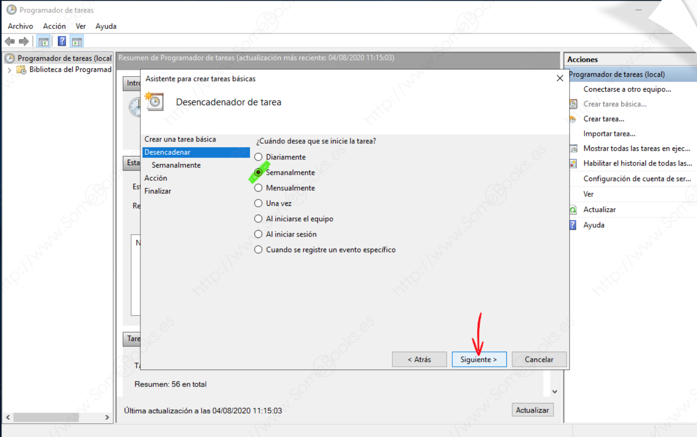
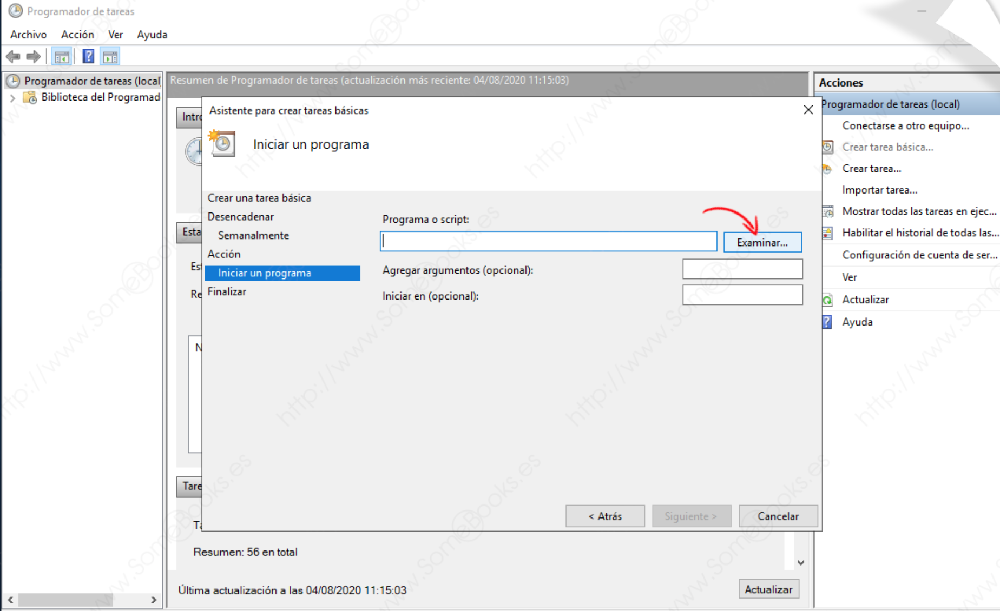
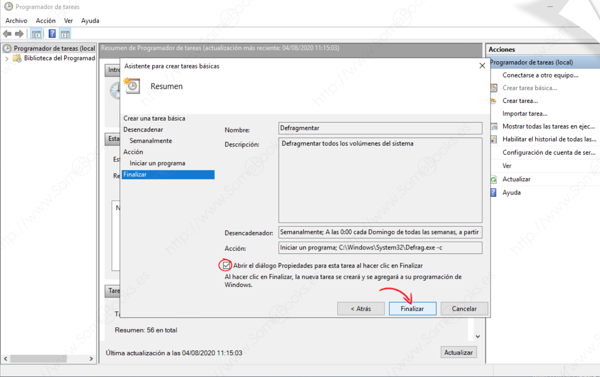

# Planificación de tareas

En un sistema operativo existen ciertas tareas que se realizan de forma periódica y que será conveniente que se resuelvan de forma automática para liberar al **administrador de sistemas** de esas tareas.

Para realizar dichas tareas se dispone de herramientas capaces de programarlas y dejar al sistema operativo la ejecución de ellas. A continuación se destacan las principales en sistemas de propetario y libre.

## Windows

En Microsoft Windows Server 2019 se dispone de la herramienta `Programador de tareas`,  cuyo  nombre  es  autodescriptivo.

### Programador de tareas

Se  accede  a  ella  a  través  del Administrador del servidor.

`Administrador de servidor` &#8594 `Herramientas` &#8594 `Programador de tareas` 

<figure>
  
  <figcaption>Acceso Administrador del Servidor</figcaption>
</figure>

<figure>
  
  <figcaption>Acceso Programador de Tareas</figcaption>
</figure>

!!! note "**Nota**"
    Se puede evitar el paso por el Administrador del Servidor usando la orden `taskschd.msc`; Utilizando la combinación de teclas `Windows + R` y, en la ventana que aparece, escribir la orden.

<figure>
  
  <figcaption>Acceso `taskschd.msc`</figcaption>
</figure>

Desde el menú acciones es posible crear una tarea a través de un asistente con la opción `Crear tarea básica…`

<figure>
  
  <figcaption>Crear tarea en el Programador de Tareas I</figcaption>
</figure>

- De este modo, conseguimos que se abra el **Asistente para crear tareas básicas**, que nos irá mostrando una **serie de pasos **en los que iremos indicando cada uno de los aspectos de la tarea programada.

!!! example "**Por ejemplo**"
    A continuación se muestran los pasos para **defragmentar de forma automática todos los volúmenes** del sistema una vez a la semana. Además, para evitar que el proceso penalice el rendimiento del servidor, se ejecuta a partir de la media noche de los domingos (dando por supuesto que el sistema estará suficientemente descargado de tráfico en esos momentos).

1. En el primer paso, escribiremos un nombre y una breve descripción para la tarea.

<figure>
  
  <figcaption>Crear tarea en el Programador de Tareas II</figcaption>
</figure>

2. En el siguiente paso, se debe indicar el desencadenador. El **desencadenador** es el criterio que debe cumplirse para iniciar la ejecución de la tarea que estamos programando. Se pueden diferenciar dos tipos de desencadenadores:

- **En función del tiempo**: El inicio de una tarea (o de varias) se programa a una hora en particular, todos los días o en días concretos de la semana o del mes.

- **En función de un evento**: Pueden iniciar la tarea a partir de la ejecución de un evento, como por ejemplo: siempre que se inicie el sistema, cuando un usuario inicie su sesión, cuando el sistema entre en estado de inactividad o al registrar cualquier otro evento específico.

En este caso es en *función del tiempo*:

<figure>
  
  <figcaption>Crear tarea en el Programador de Tareas III</figcaption>
</figure>

3. Lo siguiente será establecer el intervalo, Eligiendo la fecha a partir de la que se iniciará la ejecución automática de la tarea.

- La tarea se ejecutará la próxima vez que el día de la semana coincida con el que se haya indicado debajo. En el ejemplo, aunque la tarea se programe para el día 4, no se ejecutará hasta el día 9, que es domingo.

- Además, se debe elegir el intervalo &#8594 Si es `1`, la ejecución será semanal; si es `2`, se producirá en semanas alternas, etc.

- Por último, fijaremos la hora a la que debe iniciarse la ejecución de la tarea. El valor para la hora puede ser local (la hora oficial del país en el que se encuentre el servidor) o universal &#8594 **UTC (Universal Time Coordinated)**.

<figure>
  
  <figcaption>Crear tarea en el Programador de Tareas IV</figcaption>
</figure>

!!! note "**Nota**"
    Si se elije un desencadenador diferente, las opciones que debemos establecer también cambiarán. Sin embargo, son tan fáciles de interpretar como las que hemos visto en este ejemplo.

4. A continuación, se debe indicar el programa que queremos ejecutar. Para conseguirlo, lo más sencillo es utilizar el botón `Examinar` y buscarlo en el disco duro del servidor. También podríamos escribirlo directamente en el cuadro de texto, pero tendríamos que recordar su ubicación y nombre exactos.

<figure>
  
  <figcaption>Crear tarea en el Programador de Tareas V</figcaption>
</figure>

- Nos aparecerá la ventana típica para abrir archivos. En ella, se puede localizar el programa que queremos ejecutar de forma programada. 
- En este caso, lo encontramos en `C:\Windows\System32` y el ejecutable se llama `Defrag.exe`. 

!!! note "**Nota**"
    Siguiendo este mecanismo se hubiera podido elegir cualquier archivo ejecutable, o cualquier proceso por lotes, que tuviésemos almacenado en cualquier disco duro del servidor.

<figure>
  
  <figcaption>Crear tarea en el Programador de Tareas VI</figcaption>
</figure>

5. De vuelta en la ventana `Asistente para crear tareas básicas`, se puede observar que ya se ha completado el cuadro de texto con la acción. En este caso, también se ha incluido el argumento `-c` para indicar que se quiere defragmentar todos los volúmenes locales del servidor.

!!! note "**Nota**"
    En el caso que la acción ingresada necesite interactuar con los datos de alguna carpeta (por ejemplo, copiar archivos de una ubicación a otra, en el cuadro `Iniciar en (opcional)`: se indicaría la carpeta predeterminada sobre la que actuará dicha acción.

<figure>
  
  <figcaption>Crear tarea en el Programador de Tareas VII</figcaption>
</figure>

6. En este paso se llega **al final del Asistente para crear tareas básicas**, por lo que el sistema nos ofrece un resumen de los valores que hemos introducido en los puntos anteriores. Si observamos algún error, podremos subsanarlo haciendo clic sobre el botón Atrás, hasta llegar al aspecto que necesitemos cambiar.

<figure>
  
  <figcaption>Crear tarea en el Programador de Tareas VIII</figcaption>
</figure>

!!! note "**Nota**"
    - Si dejamos sin marcar la casilla `Abrir el diálogo Propiedades` para esta tarea al hacer clic en Finalizar, se cerrará el asistente y volveremos a la ventana principal del `Programador de tareas`.
    - Si, por el contrario, se marca la casilla, al finalizar el asistente, se abre de forma automática la ventana `Propiedades de la tarea programada`. 
    - También se puede volver a esta ventana en cualquier momento, y **Reabrir la ventana Propiedades de una tarea programada**.
    - En la ventana Propiedades se dispone de diferentes opciones, que permiten configurar cada aspecto de la tarea programada.

<figure>
  
  <figcaption>Crear tarea en el Programador de Tareas IX</figcaption>
</figure>

## GNU/Linux

En sistemas operativos **GNU/Linux** la programación de tareas se realiza a través del demonio `cron` que permite ejecutar tareas de forma automática.

### cron

Cada minuto `cron`  comprueba el listado de tareas y si debe o no ejecutar un programa de su listado.

- A diferencia de Microsoft Windows Server 2019, `cron` solo lanza tareas según una programación.
- Éstas deben ser descritas con comandos o contenidas en shellscripts.

Existen al menos dos formas distintas de usar `cron`. 

1. La primera es a través de los directorios,

- `/etc/cron.hourly`
- `/etc/cron.daily`
- `/etc/cron.weekly`
- `/etc/cron.monthly`


!!! tip "**A tener en cuenta**"
    En este caso para hacerlo funcionar se coloca un archivo tipo **shellscript** se ejecutará cada hora, cada día, cada semana o cada mes, dependiendo del directorio en donde se sitúe.

2. La segunda manera de programar tareas con `cron` es a través de manipular directamente el archivo `/etc/crontab`. Por defecto, este archivo tendrá este contenido:

``` yaml
SHELL=/bin/bash 
PATH=/sbin:/bin:/usr/sbin:/usr/bin 
# run-parts  
01 * * * * root run-parts /etc/cron.hourly 
02 4 * * * root run-parts /etc/cron.daily 
22 4 * * 0 root run-parts /etc/cron.weekly 
42 4 1 * * root run-parts /etc/cron.monthly
```

En donde:

- **SHELL** es el shell bajo el cual se ejecuta. Si no se especifica, se tomará por defecto el indicado en la línea `/etc/passwd` correspondiente al usuario que esté ejecutando `cron`.
- **PATH** contiene la ruta a los directorios en los cuales buscará el comando a ejecutar. Éste es distinto al **PATH** global del sistema o del usuario.

Después de estas dos variables, se establecen las tareas que se van a ejecutar, cuando y quien las va a realizar. Características:

- No hay límites en cuanto al número de tareas programadas,
- Es necesario realizar una por línea.

Las siete columnas de los que cada tarea está compuesto son:

|Campo|Descripción|
| - | - |
|Minuto|Establece el minuto de la hora en que la tarea será ejecutada, este valor debe oscilar entre 0 y 59.|
|Hora|Controla la hora en la que la tarea será ejecutada, se especifica en un formato de 24 horas, los valores deben estar entre 0 y 23, 0 es medianoche.|
|Día del Mes|Día del mes en que se va a ejecutar la tarea. Por ejemplo se indicaría 20, para ejecutar el comando el día 20 del mes.|
|Mes|Mes en que el comando se ejecutará, puede ser indicado numéricamente (1-12), o por el nombre del mes en inglés, solo las tres primeras letras.|
|Día  semana|Día en la semana en que se ejecutará el comando, puede ser numérico (0-7) o por el nombre del día en inglés, solo las tres primeras letras. Los valores 0 y 7 hacen referencia al mismo día de la semana, el domingo.|
|Usuario|Usuario que ejecuta el comando.|
|Comando|Comando, script o programa que se ejecuta. Este campo puede contener múltiples palabras y espacios.|

El uso de las cinco primeras columnas puede ser un tanto lioso al principio. Para aclarar conceptos se usarán algunos **ejemplos**:

|Comando|Acción|
| - | - |
|**1 \* \* \* \***|Se ejecuta al minuto 1 de cada hora de todos los días.|
|**15 8 \* \* \***|A las 8:15 de cada día.|
|**0 17 \* \* 0**|A las 17:00 todos los domingos.|
|**\* 5 \* \* Sun**|Cada minuto de 5:00 a 5:59 todos los domingos.|
|**45 19 1 \* \***|A las 19:45 del primer día de cada mes.|
|**1 \* 20 7 \***|Al minuto 1 de cada hora del 20 de julio.|
|**10 1 \* 12 1**|A las 1:10 todos los lunes de diciembre.|
|**0 12 16 \* Wen**|Al mediodía de los días 16 de cada mes y que sea Miércoles.|
|**30 9 20 7 4**|A las 9:30 del día 20 de julio y que sean jueves.|
|**30 9 20 7 \***|A las 9:30 del día 20 de julio sin importar el día de la semana.|
|**20 \* \* \* 6** |Al minuto 20 de cada hora de los sábados.|
|**20 \* \* 1 6**|Al minuto 20 de cada hora de los sábados de enero.|

También es posible especificar listas en los campos. Las listas pueden estar expresadas en una comalista o a través de guiones.

- `cron`, de igual manera soporta incrementos en las listas, que se indican de la siguiente manera:

|Comando|Acción|
| - | - |
|**59 11 \* 1-3 1,2,3,4,5**     |A las 11:59 de lunes a viernes, de enero a marzo.|
|**45 \* 10-25 \* 6-7**         |Al minuto 45 de todas las horas de los días 10 al 25 de todos los meses, de sábados a domingos.|
|**10,30,50 \* \* \* 1,3,5**    |En el minuto 10, 30 y 50 de todas las horas de los días lunes, miércoles y viernes.|
|**/15 10-14 \* \* \***          |Cada quince minutos de las 10:00 a las 14:00.|
|**\* 12 1-10/2 2,8 \***        |Cada minuto de la hora 12 en los días 1,3,5,7 y 9 de febrero y agosto. (el incremento en el tercer campo es de 2 y comienza a partir de 1).|
|**0 /5 1-10,15,20-23 \* 3**  |Cada 5 horas de los días 1 al 10, el día 15 y del día 20 al 23 de  cada mes y que el día sea miércoles.|
|**3/3 2/4 2 2 2**              |Cada 3 minutos empezando por el minuto 3 (3,6,9...) de las  horas 2, 6, 10, 14, 18 y 22 (cada 4 horas empezando en la hora 2) del día 2 de febrero y que sea martes.|

!!! note "**Nota**"
    Como se puede apreciar en el último ejemplo la tarea `cron` que estuviera asignada a esta línea, sólo se ejecutaría si cumple con los cinco criterios, es decir, siempre es un `AND` que sólo resulta verdadero si todas las condiciones son ciertas.

### crontab (cron con múltiples usuarios)

**GNU/Linux** es un sistema multiusuario y `cron` es de las aplicaciones que soporta el trabajo con varios usuarios a la vez. Características:

- Cada usuario puede tener su propio archivo **crontab**, de hecho el `/etc/crontab` se asume que es el archivo del usuario root.
- Cualquier usuario puede disponer de su propio archivo de programación de tareas a través del comando crontab.
- En el directorio `/var/spool/cron/crontabs`, que puede variar según la distribución, se genera un archivo de tareas para cada usuario.

El uso de crontab es:

``` yaml
crontab -e
```

!!! note "**Nota**"
    - Este comando abrirá el editor de texto por defecto con un archivo vacío y donde el usuario especificará las tareas que desea programar, y que se guardará  automáticamente  como `/var/spool/cron/crontabs/usuario`. 
    - Hay que tener en cuenta que si existe esta nueva lista de tareas programadas serán dos las que serán comprobadas en cada minuto por el demonio cron: la del usuario recién creada y la del sistema vista con anterioridad.

## Actividades de desarrollo UD4_02

405. [Tareas Programadas con Powershell](Practica10_PWSH_Cron.md)

406. Programa con `cron` las siguientes tareas:
    - Una copia de la carpeta /home a una carpeta de seguridad los días pares de cada mes, cada dos horas durante las 8:00 y las 15:00 horas.
    - Un listado de los archivos que existen en el escritorio del usuario actual (usa el comando ls con un redireccionador) cada 5 minutos de todas las horas de los martes, jueves y viernes de los días impares.