# Servicio de Directorio

Un **servicio de directorio** es un software que centraliza y organiza la información de recursos, usuarios y dispositivos en una red, facilitando su gestión, búsqueda y control.

## Propuesta didáctica

En esta unidad vamos a trabajar el **RA1 de ASO**:

> **RA1.** *Administra servicios de directorio, identificando su estructura y aplicando criterios de seguridad.*

### Criterios de evaluación (RA1)

A lo largo de la unidad se trabajarán y evidenciarán los siguientes criterios:

- **CE3a**: Se han descrito los servicios de directorio y su estructura jerárquica.  
- **CE3b**: Se ha diferenciado entre los servicios de directorio propietarios y libres.  
- **CE3c**: Se han instalado servicios de directorio en sistemas propietarios.  
- **CE3d**: Se han configurado dominios y unidades organizativas.  
- **CE3e**: Se han creado y gestionado usuarios, grupos y equipos en el directorio.  
- **CE3f**: Se han aplicado políticas de grupo para gestionar configuraciones.  
- **CE3g**: Se han unido equipos cliente al dominio.  
- **CE3h**: Se han documentado los procesos y configuraciones realizadas.

## Contenidos

**Bloque 1 — Introducción a Active Directory (Sesión 1–2)**

- ¿Qué es un servicio de directorio?  
- Active Directory Domain Services: características y arquitectura.  
- Estructura física y lógica de Active Directory.  
- Objetos del directorio: usuarios, grupos, equipos, dominios, unidades organizativas.  
- Arquitectura cliente-servidor en Active Directory.

**Bloque 2 — Instalación y configuración (Sesión 2–3)**

- Instalación de Active Directory Domain Services.  
- Promoción a controlador de dominio.  
- Configuración de dominios y bosques.  
- Configuración de DNS para Active Directory.  
- Niveles funcionales de dominio y bosque.

**Bloque 3 — Administración del directorio (Sesión 3–4)**

- Creación y gestión de usuarios.  
- Creación y gestión de grupos.  
- Creación y gestión de unidades organizativas.  
- Unión de equipos cliente al dominio.  
- Herramientas de administración: Usuarios y Equipos de Active Directory, PowerShell.

**Bloque 4 — Políticas y seguridad (Sesión 4–5)**

- Políticas de grupo (Group Policy).  
- Configuración de políticas de seguridad.  
- Gestión de permisos y accesos.  
- Autenticación y autorización en Active Directory.  
- Gestión de recursos compartidos en Active Directory (carpetas personales, perfiles, permisos NTFS y compartidos).

!!! question "Actividades iniciales"
    1. ¿Qué es un servicio de directorio y cuál es su función principal?
    2. ¿Qué diferencia existe entre un grupo de trabajo y un dominio?
    3. Explica qué es un controlador de dominio.
    4. ¿Qué es una unidad organizativa y para qué se utiliza?
    5. ¿Qué protocolos utiliza Active Directory para la autenticación?
    6. Nombra al menos tres objetos que se pueden crear en Active Directory.
    7. ¿Qué es un bosque en Active Directory?
    8. Explica la diferencia entre nivel funcional de dominio y nivel funcional de bosque.

### Programación de Aula (5 sesiones)

Esta unidad se imparte con una duración estimada de 5 sesiones lectivas:

#### Sesiones 1-2: Introducción e instalación

| Sesión | Contenidos | Actividades | Criterios trabajados |
| --- | --- | --- | --- |
| 1  | **Teoría:** Introducción a servicios de directorio. Active Directory Domain Services: características, arquitectura y estructura. Objetos del directorio. | Explicación teórica | CE3a, CE3b |
| 2  | **Práctica:** Instalación de Active Directory Domain Services. Promoción a controlador de dominio. Configuración inicial. | [PR401](#) | CE3c, CE3d, CE3h |

#### Sesiones 3-5: Administración y configuración

| Sesión | Contenidos | Actividades | Criterios trabajados |
| --- | --- | --- | --- |
| 3  | **Práctica:** Creación y gestión de usuarios, grupos y unidades organizativas. Unión de clientes al dominio. | [PR402](#) | CE3d, CE3e, CE3h |
| 4  | **Práctica:** Gestión de grupos y unidades organizativas. Creación masiva de usuarios desde CSV. | [PR403](#) | CE3d, CE3e, CE3f, CE3h |
| 5  | **Práctica:** Verificación y documentación. Administración avanzada con PowerShell. | [PR401](#) (finalización) | CE3e, CE3f, CE3h |

---

## Introducción a los Servicios de Directorio

La organización de una red de trabajo empresarial supone un reto organizativo que el administrador del sistema debe afrontar con garantías de éxito. Para ello se dispone de herramientas organizativas como los **servicios de directorio**.

Los **servicios de directorio** son un conjunto de aplicaciones que almacenan y administran toda la información sobre los elementos de una red de forma centralizada y estructurada.

### Características principales

- Cada **recurso** de la red se considera como un **objeto**, donde su **información se almacena como atributos**.
- Para la gestión de esta información, el **servicio de directorio** establece una serie de **permisos de acceso y condiciones de seguridad** que salvaguardan esta información.
- Ofrecen una **infraestructura** para localizar, manejar, administrar y organizar los componentes y recursos comunes de una red.

!!! note "Recursos gestionados"
    Los recursos pueden ser: **volúmenes, carpetas, archivos, impresoras, usuarios, grupos, dispositivos, números de teléfono y un largo etcétera**.

### LDAP (Lightweight Directory Access Protocol)

El **LDAP** es un protocolo a nivel de aplicación que proporciona acceso a un servicio de directorio ordenado y distribuido para la búsqueda de información en un entorno de red.

- **Origen**: En la década de los 80, la especificación **X.500** utilizaba el protocolo **DAP (Directory Access Protocol)** basado en la pila de protocolos **OSI**. Con el auge de Internet y la generalización de **TCP/IP**, en **1993** se implementó **LDAP** como una versión más ligera que utiliza TCP/IP.

- **Funcionamiento**: Un cliente inicia una sesión en un servidor LDAP solicitando información. El protocolo permite realizar consultas sobre la base de datos jerárquica del directorio.

- **Características principales**:
  - Protocolo ligero y eficiente para acceso a servicios de directorio.
  - Utiliza la pila de protocolos **TCP/IP**.
  - Permite búsqueda y consulta de información de forma estructurada.
  - Estándar ampliamente adoptado por diferentes servicios de directorio.

!!! tip "LDAP como estándar"
    **LDAP** se ha convertido en el protocolo estándar para servicios de directorio, siendo utilizado por implementaciones como **Active Directory** (Microsoft), **OpenLDAP** (sistemas GNU/Linux) y **SambaLDAP**, entre otros.

---

## Active Directory

**Active Directory** es un servicio de directorio basado en **LDAP** que organiza y gestiona de forma jerárquica la información de los recursos de red, facilitando su administración, búsqueda y autenticación.

Active Directory es la implementación de servicio de directorio creada por **Microsoft** para sus sistemas operativos de red. Se introdujo por primera vez en **Windows 2000 Server**, marcando un cambio fundamental en la forma en la que las redes Windows gestionaban usuarios, equipos y recursos de manera centralizada. Antes de Active Directory, Microsoft utilizaba el modelo de dominios de **Windows NT**, que tenía importantes limitaciones de escalabilidad y flexibilidad. 

Con Active Directory, Microsoft adoptó y adaptó el protocolo **LDAP**, incorporando además tecnologías como **Kerberos** para autenticación y el soporte de DNS para resolución de nombres, integrando estas tecnologías en la infraestructura de red empresarial. 

A lo largo de los años, Active Directory ha evolucionado incluyendo nuevas funciones y servicios, convirtiéndose en el pilar fundamental para la gestión de identidades y recursos en entornos Windows a nivel mundial.

## Estructura física de Active Directory

El **Directorio Activo o Active Directory**, durante este módulo se utilizarán indistintamente ambos nombres; forma parte del **subsistema de seguridad** de Windows Server ejecutándose en modo usuario. 

<figure>
  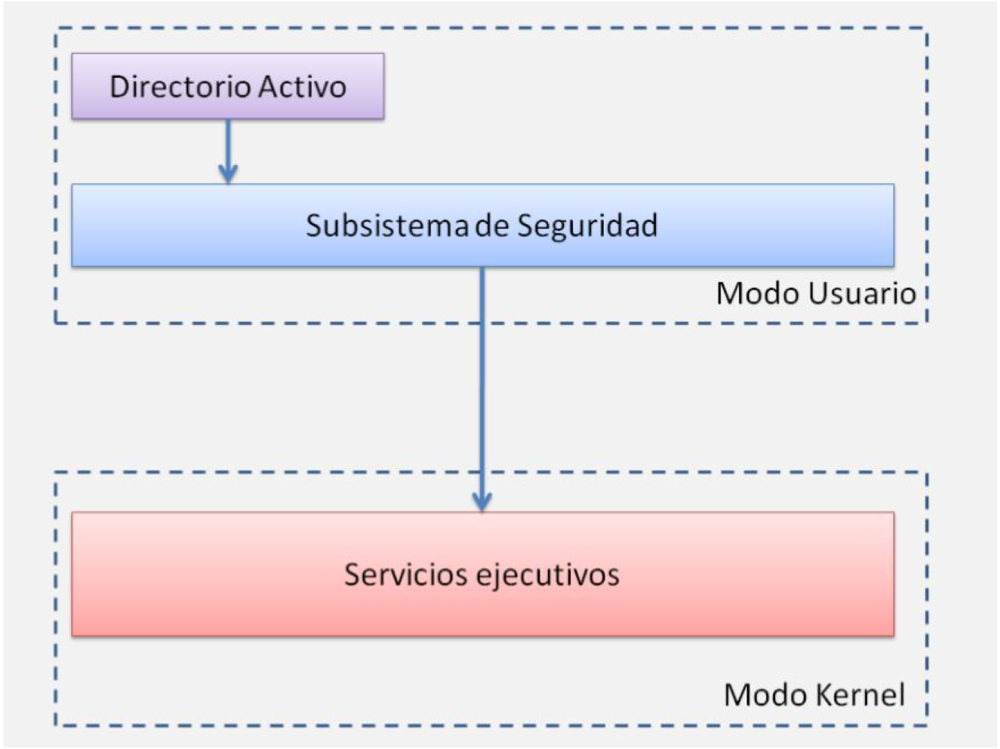
  <figcaption>Estructura física de AD</figcaption>
</figure>

!!! Note
    Las aplicaciones que se ejecutan en este modo no tienen acceso directo al sistema operativo ni al hardware, sino que como medida de seguridad, las peticiones realizadas a estos deben pasar previamente por un subsistema de seguridad y posteriormente por la capa de servicios ejecutivos.

<!-- ### Arquitectura del subsistema de seguridad

**Es un conjunto de componentes de seguridad** que componen el modelo de seguridad de Windows. Estos componentes garantizan que las aplicaciones no puedan acceder a los recursos sin autenticación y autorización. Los componentes del subsistema de seguridad se ejecutan en el contexto del proceso `Lsass.exe`, e incluyen lo siguiente:

- Autoridad de seguridad local.
- Servicio de inicio de sesión en red.
- Servicio de administrador de cuentas de seguridad.
- Servicio de servidor LSA (exige la aplicación de directivas de seguridad local).
- Capa de Secure Sockets (Identificadores de sesiones seguros).
- Protocolo de autenticación **Kerberos v5** y protocolo de autenticación **NTLM**.

!!! note "Nota"
    * **Kerberos** es un protocolo de autenticación de redes de ordenador creado por el **MIT** que permite a dos ordenadores en una red insegura demostrar su identidad mutuamente de manera segura.
    * **NTLM**: En una red de Windows, **NT LAN Manager** es un conjunto de protocolos de seguridad de Microsoft destinados a proporcionar autenticación, integridad y confidencialidad a los usuarios. **NTLM** es el sucesor del protocolo de autenticación en Microsoft LAN Manager, un producto anterior de Microsoft. -->

## Arquitectura cliente – servidor

Active Directory también esta basado en el modelo **cliente-servidor** es aquel en el que existen varios clientes, los cuales realizan peticiones a un servidor.

<figure>
  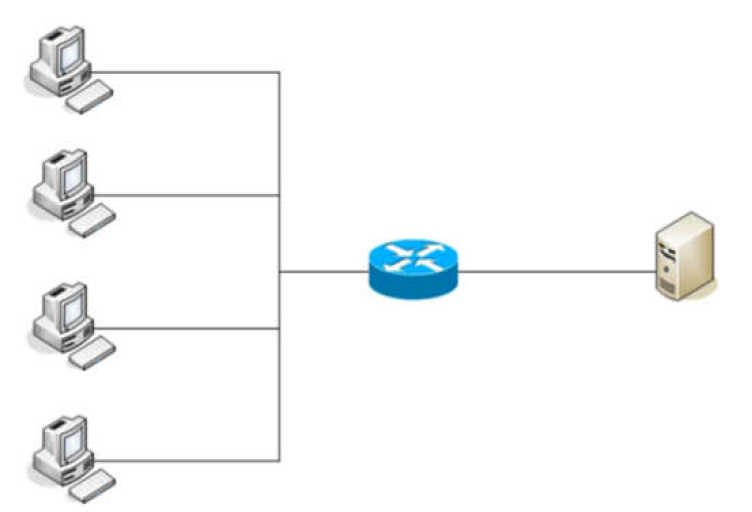
  <figcaption>Esquema de red cliente servidor</figcaption>
</figure>

<!-- Un servidor puede ser:

- **Dedicado** : La máquina servidor sólo se dedica a tareas de servicios en la red
- **No dedicado** : Además de los servicios, la máquina se puede usar como un puesto de trabajo más. -->

## Objetos del Directorio Activo

El Directorio Activo **es una implementación concreta del protocolo LDAP**. Este protocolo trata los elementos de la red como
objetos. Los tipos de objetos básicos que existen en el Directorio Activo son:

- Usuarios.
- Grupos.
- Equipos.
- Dominios.
- Impresoras.
- Unidades Organizativas.

!!! tip
    Sin embargo los administradores de sistemas pueden crear nuevos tipos de objetos o añadir propiedades a alguna clase de
    los objetos modificando el esquema del Directorio Activo, para adaptar la estructura de la red a las necesidades particulares de la organización.

### Dominio

Representa un conjunto de equipos (clientes y servidores) que comparten una política de seguridad y una base de datos común. En concreto para el **Directorio Activo de Windows** se trata de un conjunto de objetos de tipo equipo, usuario y otras clases de objetos que comparten una base de datos de directorio común.

Los servidores pueden ser:

- **Controladores de dominio** : Contienen las cuentas de usuario y de otros datos del **Directorio Activo**. 
    - Debe haber al menos **1 por cada dominio**.

- **Servidores miembros del dominio** : Se utilizan para almacenamiento de archivos y otros recursos compartidos en la red. No contienen información vital como cuentas de usuarios o políticas de grupos.

<figure>
  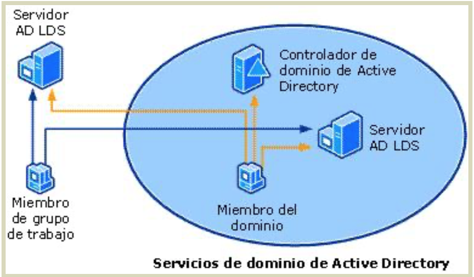
  <figcaption>Servidores de Dominio</figcaption>
</figure>

<!-- ### Diferencia entre "Grupo de Trabajo" y "Dominio"

Cabe recordar la diferencia entre la gestión de usuarios con los **Grupos de trabajo** y **Dominios**.

- **Grupo de trabajo**: es un conjunto de ordenadores comunicados entre sí, que forman parte de un mismo grupo. No obstante toda la gestión de **políticas/grupos/usuarios/servicios/…** son individuales por cada máquina.El grupo de trabajo se configuraría en cada máquina desde:

<figure>
  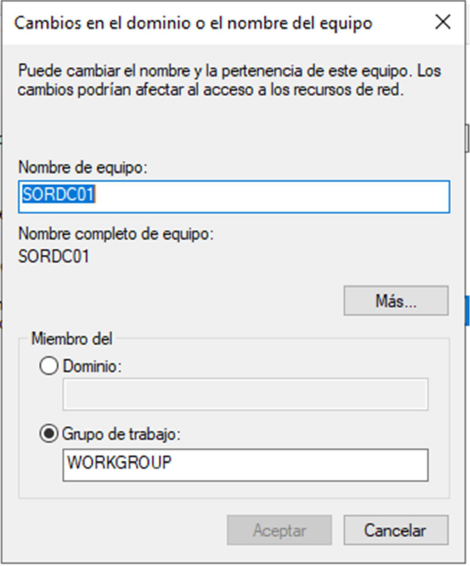
  <figcaption>Configuración "Grupo de Trabajo" y "Dominio".</figcaption>
</figure>
 
- **Dominio** como ya se ha visto (OpenLDAP) desde un servidor se puede gestionar todo, usuarios, servicios, seguridad, recursos accesibles, etc.

!!! Note
    Es decir, en un **directorio activo con dominio** se crea un usuario y desde cualquier máquina asociada al dominio se podría registrar, en el caso de un grupo de trabajo deberá estar creado el usuario manualmente en cada equipo del grupo de trabajo, y así con las políticas de grupo, etc. **Por lo tanto con el grupo de trabajo aumentaríamos la carga de gestión al enésimo usuario**.

#### Ventajas/Desventajas de un "Grupo de Trabajo" frente a un "Dominio"

- Es más **barato** (no necesita un servidor y licencias).
- La gestión es mucho más tediosa porque tienes que hacerla equipo por equipo, mientras que en un dominio solo debes configurar el servidor, por tanto es **menos escalable** (imagina tener 200 ordenadores en un grupo de trabajo).
- El grupo de trabajo es mucho más **inseguro** , puesto que es más fácil controlar políticas de seguridad a través de un servidor con políticas generalizadas para todos los equipos, ya que no todos los usuarios tienen un conocimiento suficiente de informática.
- Con el grupo de trabajo será mucho **más tedioso implementar servicios** , por ejemplo un servidor de correo. -->

### Unidad Organizativa

Las **unidades organizativas** nos ayudan a organizar los objetos de nuestro dominio (impresoras, usuarios, grupos, …).

* Es parecido a la estructura de directorios (carpetas) de un sistema operativo, **por ejemplo**, dentro de nuestro dominio podemos tener una unidad organizativa por cada departamento de la empresa.

En el siguiente ejemplo vemos un dominio con una unidad organizativa para usuarios de "*Contabilidad*", "*Recursos Humanos*", "*Informáticos*"y "*Marketing*".

<figure>
  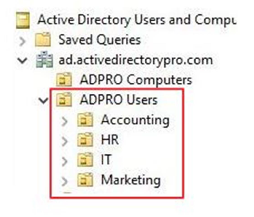
  <figcaption>Unidades Organizativas en Active Directory</figcaption>
</figure>

### Árboles:

Se da en redes muy grandes donde nos interesa segmentar en subdominios, de tal forma que el tráfico o las peticiones de los usuarios al servidor de un subdominio no llegan al servidor raíz y por nos ayuda con el balanceo de carga de trabajo y ahorro en el ancho de banda de la red. No obstante la gestión sigue siendo centralizada desde el servidor raíz. Similar a DNS.

<figure>
  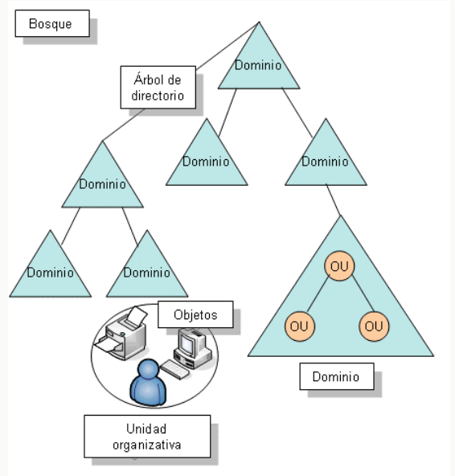
  <figcaption>Objetos en Active Directory.</figcaption>
</figure>

### Bosques

Un bosque es la unión de diferentes árboles o dominios que **confían** entre ellos, pero son dominios totalmente diferentes (USA.miempresa.com, EUROPA.miempresa.com y SPAIN.miempresa.com). 

- Si se configura una confianza entre ellos los usuarios de un dominio tendrán la posibilidad acceder a los recursos (o a ciertos recursos) de otro dominio que compartan el mismo bosque.

<figure>
  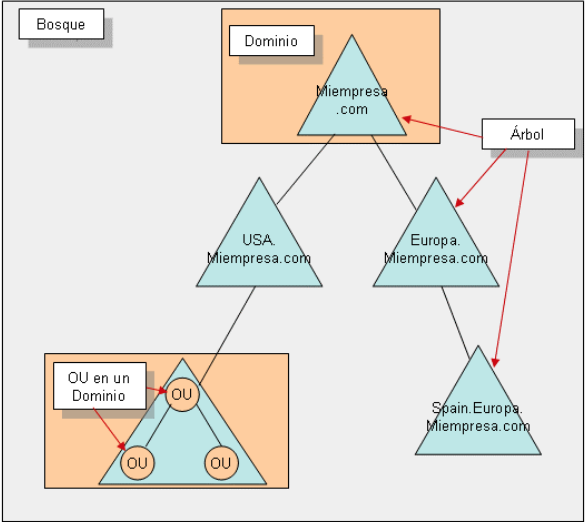
  <figcaption>Ejemplo de Objetos en Active Directory.</figcaption>
</figure>

## Roles (Servicios)

Un rol de servidor es un **conjunto de servicios que permiten a un equipo realizar una función específica** para varios usuarios u otros equipos de una red. Básicamente está relacionado con el cometido de dicho servidor, un servidor puede tener múltiples roles.

Ejemplos:

- Servidor **DHCP**.
- Servidor **DNS**.
- Servidor **Active Directory**.
- Servidor de virtualización (**Hyper-V**).
- Servidor Web.
- Acceso remoto.
- Servidor de impresión.
- Servidor de correo electrónico.

A su vez, un rol puede tener diferentes funcionalidades o subroles, los cuales pueden estar activados o no. Dichos "subroles" son **servicios de rol**. 

<!-- !!! Example
    un Servidor **DNS** solo tiene una finalidad y, por lo tanto, no tienen servicios de rol disponibles. En cambio un Servicio de Archivos (para compartir ficheros) puede tener el servicio de rol para el protocolo NFS o no, es decir, puede tener habilitada la función de servidor de ficheros NFS. -->

!!! Note
    **Network File System, o NFS**, es un protocolo de nivel de aplicación, según el Modelo OSI. Es utilizado para sistemas de archivos distribuido en un entorno de red de computadoras de área local. Posibilita que distintos sistemas conectados a una misma red accedan a ficheros remotos como si se tratara de locales.

* Para Agregar Roles:

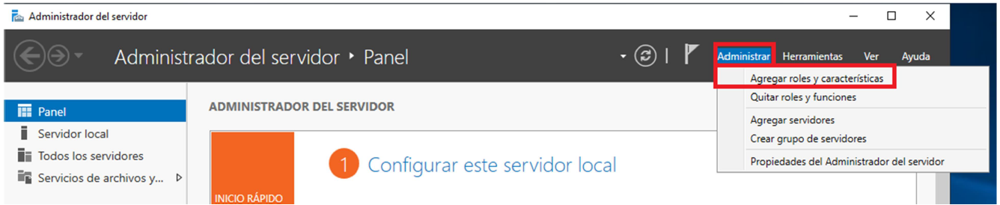

### Servicios de AD en Windows Server

Cuando vayamos a añadir nuestro rol de Active Directory al servidor, veremos que tenemos diferentes roles de Active Directory:

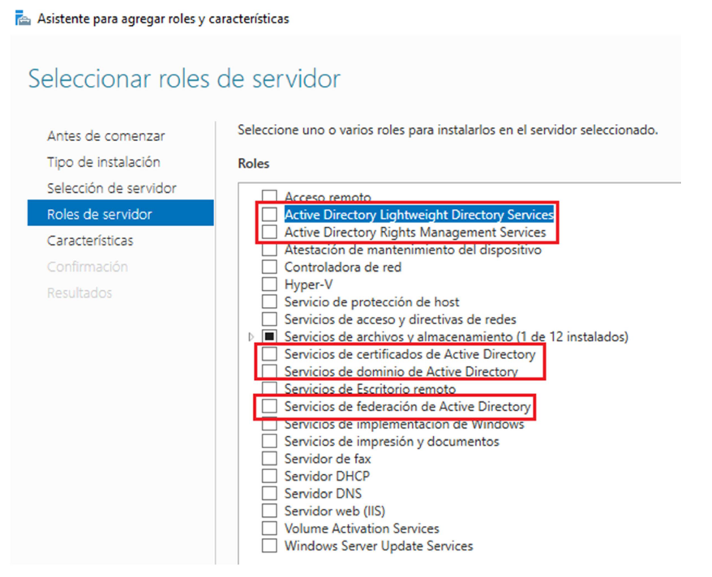

- **Active Directory Lightweight Directory Services** : Se trata de un Active Directory "light", no require de un dominio para su uso, simplemente alberga opciones/características para ciertas aplicaciones que nos interese.

- **Active Directory Rights Management Services** : Nos ayuda a gestionar la protección del acceso a nuestros ficheros del directorio activo. Por ejemplo si un documento se intenta abrir desde un usuario no autorizado.

- **Servicios de certificados de Active Directory** : Simplemente gestiona la creación de certificados digitales. Es para entidades de certificación oficial (seguridad informática).

- **Servicios de dominio de Active Directory:** Este va a ser la opción que veremos en el módulo. 

- **Servicio de federación de Active Directory:** Gestiona el acceso seguro desde dentro y desde fuera de tu red (Internet) a aplicaciones gestionadas en local por el servidor de Windows Active Directory. Obviamente con las credenciales de usuarios del active directory.

## Base de datos y Autentificación

Active Directory utiliza un sistema centralizado de almacenamiento y autenticación que garantiza la seguridad y consistencia de los datos en el dominio.

### Base de datos de Active Directory (NTDS.dit)

La base de datos de Active Directory se almacena en cada controlador de dominio en un archivo denominado **NTDS.dit** (Directory Information Tree). Este archivo contiene toda la información del directorio: usuarios, grupos, equipos, políticas, configuración del dominio, esquema y otros objetos.

#### Ubicación y estructura

Por defecto, el archivo **NTDS.dit** y sus archivos relacionados se almacenan en la carpeta `%SystemRoot%\NTDS` (normalmente `C:\Windows\NTDS`) en cada controlador de dominio.

<figure>
  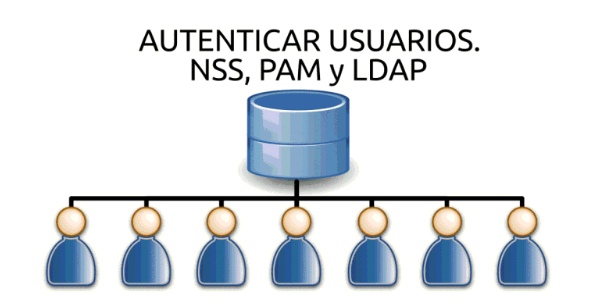
  <figcaption>Autenticación centralizada de usuarios contra la base de datos de Active Directory</figcaption>
</figure>

#### Componentes de la base de datos

La carpeta NTDS contiene varios archivos importantes:

- **NTDS.dit**: Archivo principal de base de datos que almacena todos los objetos de Active Directory usando el motor **Extensible Storage Engine (ESE)**.
- **Edb.log**: Archivo de registro de transacciones actual donde se escriben primero los cambios pendientes antes de ser aplicados a la base de datos.
- **EdbXXXXX.log**: Archivos de registro adicionales creados cuando el archivo principal se llena (numerados secuencialmente).
- **Edb.chk**: Archivo de punto de control que rastrea qué transacciones del registro se han escrito en la base de datos. Es crucial para la recuperación en caso de fallos del sistema.
- **Res1.log y Res2.log**: Archivos de reserva que proporcionan espacio en escenarios de bajo espacio en disco.

#### Estructura interna de NTDS.dit

La base de datos está organizada en particiones lógicas (contextos de nomenclatura):

- **Partición de esquema**: Define las clases de objetos y atributos que pueden crearse en el directorio.
- **Partición de configuración**: Contiene información sobre la topología del bosque y los sitios de Active Directory.
- **Partición de dominio**: Almacena todos los objetos del dominio (usuarios, grupos, equipos, unidades organizativas, etc.).
- **Particiones de aplicación**: Particiones opcionales para datos específicos de aplicaciones.

Dentro del archivo existen tablas principales:

- **Data Table**: Almacena los atributos de los objetos.
- **Link Table**: Almacena las relaciones entre objetos.
- **Security Descriptor Table**: Almacena los descriptores de seguridad desde Windows Server 2003.

#### Replicación y disponibilidad

- Cada controlador de dominio mantiene una copia completa de las particiones de dominio, esquema y configuración.
- Los cambios se replican automáticamente entre controladores de dominio mediante el protocolo de replicación de Active Directory.
- La base de datos se mantiene sincronizada entre todos los controladores de dominio del dominio.

!!! Note "Importante"
    El archivo NTDS.dit está bloqueado mientras Active Directory está en ejecución. Para realizar operaciones de mantenimiento (como defragmentación), el controlador de dominio debe estar en Modo de Reparación de Servicios de Directorio (DSRM).

### Autenticación con Kerberos

Active Directory utiliza el protocolo **Kerberos v5** como método principal de autenticación para proporcionar un acceso seguro a los recursos de red.

#### ¿Qué es Kerberos?

**Kerberos** es un protocolo de autenticación de red diseñado en el **MIT (Massachusetts Institute of Technology)** que permite a dos equipos en una red insegura demostrar su identidad mutuamente de manera segura. Microsoft implementó Kerberos v5 como el protocolo de autenticación predeterminado en Active Directory desde Windows 2000 Server.

#### Características principales

- **Autenticación mutua**: Tanto el cliente como el servidor verifican sus identidades.
- **Seguridad**: Utiliza criptografía simétrica y evita el envío de contraseñas en texto plano por la red.
- **Single Sign-On (SSO)**: Una vez autenticado, el usuario puede acceder a recursos sin volver a introducir credenciales durante un período de tiempo (válido para el ticket).
- **Autorización**: No solo autentica, sino que también proporciona información de autorización mediante listas de control de acceso (ACLs).

#### Componentes del protocolo Kerberos

El protocolo Kerberos involucra tres entidades principales:

1. **Cliente**: El usuario o servicio que solicita acceso a un recurso.
2. **Servidor de recursos**: El servicio o recurso al que el cliente quiere acceder.
3. **Centro de distribución de claves (KDC - Key Distribution Center)**: En Active Directory, el KDC es parte del controlador de dominio y está formado por:

   - **Authentication Service (AS)**: Autentica a los usuarios y emite tickets de concesión de tickets (TGT - Ticket Granting Tickets).
   - **Ticket Granting Service (TGS)**: Emite tickets de servicio para acceder a recursos específicos.

#### Proceso de autenticación Kerberos

El proceso básico de autenticación Kerberos sigue estos pasos:

1. **Solicitud inicial (AS-REQ)**: El cliente envía una solicitud al KDC solicitando un TGT.
2. **Respuesta del KDC (AS-REP)**: El KDC valida las credenciales y devuelve un TGT cifrado con la clave del KDC.
3. **Solicitud de ticket de servicio (TGS-REQ)**: El cliente presenta el TGT al TGS para solicitar un ticket de servicio para un recurso específico.
4. **Respuesta del TGS (TGS-REP)**: El TGS valida el TGT y emite un ticket de servicio cifrado.
5. **Acceso al recurso (AP-REQ)**: El cliente presenta el ticket de servicio al servidor de recursos para acceder al servicio.

<figure>
  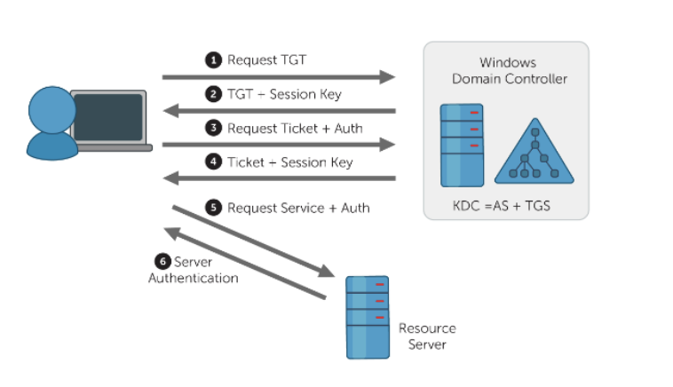
  <figcaption>Esquema oficial del funcionamiento del protocolo Kerberos (Fuente: Microsoft Learn)</figcaption>
</figure>

!!! note "NTLM vs Kerberos en Active Directory"
    Aunque Kerberos es el protocolo de autenticación predeterminado en Active Directory por su mayor seguridad (autenticación mutua, tickets temporales y compatibilidad SSO), también se soporta NTLM principalmente por compatibilidad con sistemas antiguos o cuando Kerberos no está disponible. Se recomienda siempre usar Kerberos, ya que NTLM es menos seguro y solo debe emplearse como alternativa heredada.

## Administración de Usuarios y Grupos

La administración de usuarios y grupos es una de las tareas fundamentales en Active Directory. Permite gestionar de forma centralizada quién puede acceder a los recursos de la red y con qué permisos.

### Usuarios en Active Directory

Los usuarios del dominio deben tener una cuenta para poder acceder a los recursos del mismo tras su autenticación frente al controlador de dominio. La herramienta principal para administrar usuarios es **Usuarios y equipos de Active Directory** (dsa.msc), accesible desde el Panel del Administrador → Herramientas.

#### Características de las cuentas de usuario

- **Identificador único**: Cada cuenta tiene un **identificador de seguridad (SID)** único que se asigna al crear la cuenta. Si se elimina una cuenta y se vuelve a crear con el mismo nombre, el SID será diferente y no se recuperarán los permisos originales.

- **Nombres de usuario**:
 
  - Deben ser **únicos** en todo el dominio.
  - Pueden contener letras (mayúsculas o minúsculas), números y caracteres alfanuméricos.
  - No se aceptan: `/`, `|`, `:`, `;`, `=`, `<`, `>`, `*`.
  - Máximo 20 caracteres.

- **Configuración de contraseñas**, las opciones incluyen:

  - **El usuario debe cambiar la contraseña en el siguiente inicio de sesión**: Para que el administrador asigne una contraseña temporal que el usuario cambie al iniciar sesión.
  - **El usuario no puede cambiar la contraseña**: Para cuentas genéricas compartidas (ej: cuenta para escáner).
  - **La contraseña nunca expira**: Desactiva la caducidad periódica (no recomendado en producción).
  - **La cuenta está deshabilitada**: Bloquea el acceso sin eliminar la cuenta, preservando permisos.

#### Gestión de cuentas

En lugar de eliminar cuentas (proceso definitivo), es preferible **deshabilitarlas**. Esto permite:

- Bloquear el acceso temporalmente.
- Mantener los permisos y privilegios asociados.
- Habilitar la cuenta nuevamente si es necesario.

Las cuentas se pueden configurar con propiedades detalladas: información general, restricciones de contraseña, horarios de inicio de sesión, equipos permitidos, perfiles y pertenencia a grupos.

### Grupos en Active Directory

Los grupos son contenedores que permiten definir conjuntos de usuarios y asignar permisos basándose en la pertenencia al grupo, en lugar de hacerlo usuario por usuario. Esto facilita la administración y reduce errores.

#### Tipos de grupos

Existen dos tipos principales:

- **Grupos de seguridad**: Permiten definir permisos para recursos del dominio mediante listas de control de acceso (ACLs). Son los más utilizados en la administración de red.
- **Grupos de distribución**: No poseen características de seguridad, únicamente son listados de usuarios para mensajería.

#### Ámbitos de grupos

Dentro de los grupos de seguridad existen tres ámbitos:

- **Grupo Universal**: 
  - Permisos se extienden a diversos dominios.
  - Puede contener usuarios o grupos de diferentes dominios.
  - Útil en grandes empresas con bosques de dominios.

- **Grupo Global**: 
  - Puede permitir acceso a recursos de cualquier dominio del árbol.
  - Todos los miembros deben pertenecer al mismo dominio.
  - Ideal para redes de dominio único o cuando se planifica expandir.

- **Grupo Local del Dominio**: 
  - Miembros pueden provenir de otros dominios.
  - Solo puede tener acceso a recursos dentro de su dominio.
  - Para recursos específicos dentro de un único dominio.

!!! tip "Mejores prácticas"
    - Usar el ámbito más restringido que cumpla con los requisitos.
    - En dominios únicos, los grupos globales suelen ser suficientes.
    - Los grupos universales generan más tráfico de replicación en el catálogo global.

#### Grupos predefinidos

Active Directory crea automáticamente grupos predefinidos con permisos específicos:

<figure>
  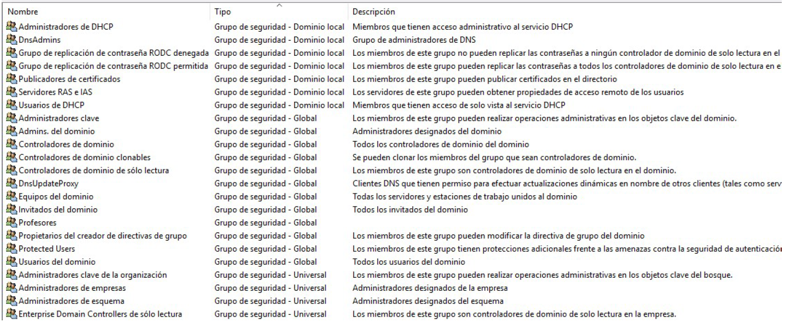
  <figcaption>Grupos predefinidos en Active Directory</figcaption>
</figure>

<figure>
  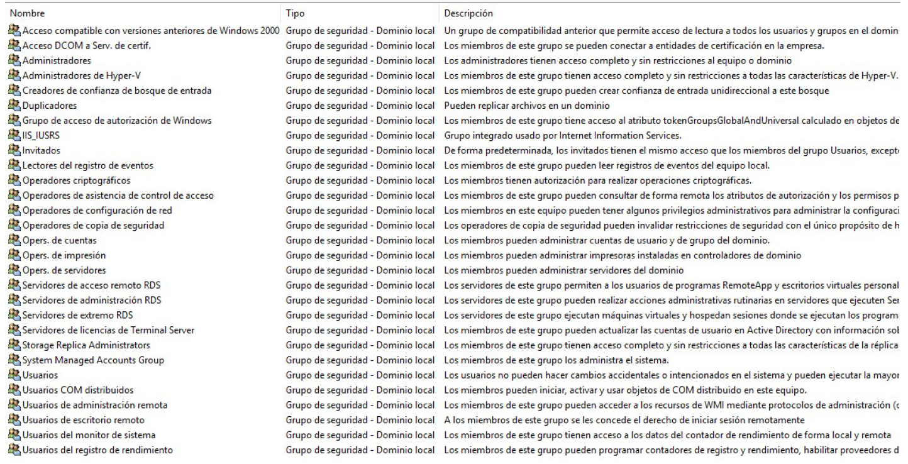
  <figcaption>Grupos Builtin</figcaption>
</figure>

Algunos grupos destacados:

- **Usuarios del dominio**: Contiene todas las cuentas de usuarios del dominio (global).
- **Administradores del dominio**: Permite administración completa del dominio (global).
- **Administradores de empresa**: Administración en todos los dominios del bosque (universal).
- **Administradores**: Administración en el controlador de dominio (local).
- **Operadores de cuenta**: Crear, editar y eliminar cuentas y grupos (local).
- **Usuarios**: Permisos limitados para uso general (local).

Estos grupos predefinidos ahorran tiempo considerable en tareas administrativas comunes.

#### Gestión de grupos

Para crear y gestionar grupos se utiliza la misma herramienta que para usuarios: **Usuarios y equipos de Active Directory**. Los usuarios se pueden añadir a grupos de dos formas principales:

1. **Desde el usuario**: Seleccionar el usuario → "Agregar a un grupo".
2. **Desde el grupo**: Abrir propiedades del grupo → pestaña "Miembros" → "Agregar".

!!! note "Práctica detallada"
    Para ver los pasos detallados de creación y configuración de usuarios y grupos, consulta la [PR402: Administración de Usuarios y Grupos en Active Directory](#pr402).

## Gestión de recursos compartidos en Active Directory

La **gestión de recursos compartidos** permite que usuarios y equipos del dominio accedan de forma centralizada a carpetas, archivos y otros recursos de red. Incluye la configuración de carpetas personales, perfiles de usuario, permisos NTFS y compartidos, y la aplicación de directivas de grupo para controlar el entorno de trabajo.

### Compartir recursos en el dominio

**Compartir recursos** se refiere a exponer carpetas o archivos (en disco local, NAS o en la nube) para que varios clientes o usuarios accedan a los mismos ficheros de forma centralizada. Entre las ventajas destacan:

- **Ahorro de espacio**: No es necesario copiar el recurso localmente en cada equipo.
- **Gestión centralizada**: Las políticas de seguridad se aplican desde el servidor.

### Carpetas personales

Una opción muy utilizada es asignar a cada usuario una **carpeta personal** en red a la que únicamente él tiene acceso. Se configura en la ficha **Perfil** de las propiedades de la cuenta de usuario en Active Directory.

<figure>
  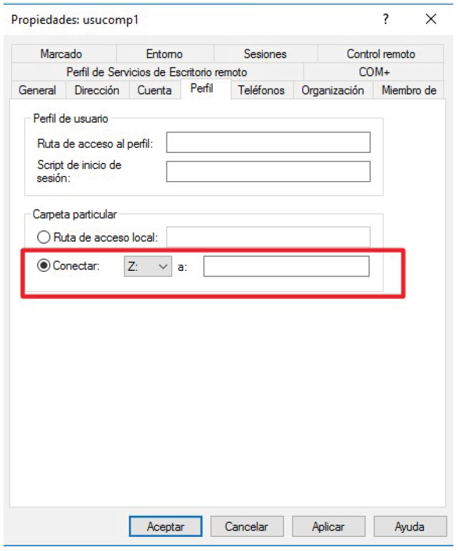
  <figcaption>Carpeta particular en las propiedades del usuario</figcaption>
</figure>

!!! example "Ejemplo"
    Se crea una carpeta compartida en el servidor (ej: `C:\Empresa_Users`) con subcarpetas para cada usuario. En la pestaña **Perfil** de cada usuario se asigna la ruta de red, por ejemplo: `\\servidor\Empresa_Users\%username%`. La variable `%username%` se sustituye automáticamente por el identificador del usuario.

<figure>
  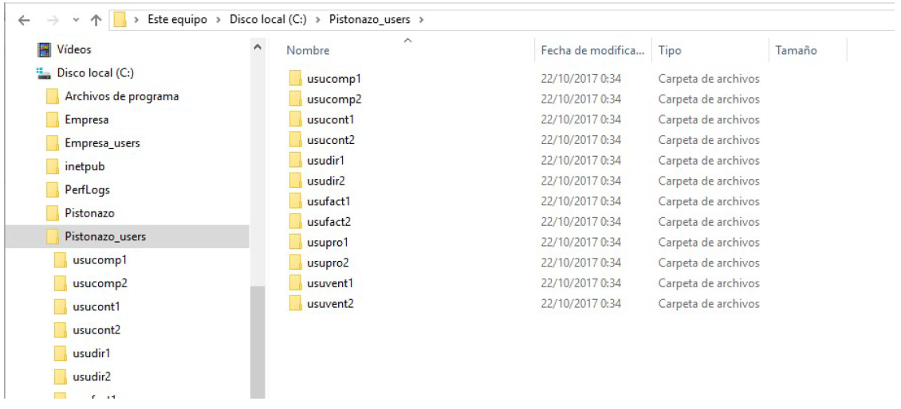
  <figcaption>Estructura de carpetas personales</figcaption>
</figure>

!!! tip "Importante"
    La carpeta del usuario debe ser una carpeta compartida con permisos de escritura para el usuario o el grupo al que pertenece. Se recomienda asignar permisos a grupos en lugar de usuarios individuales.

### Perfiles de usuario

Los **perfiles** son ficheros de configuración del entorno de trabajo que se aplican a todos los equipos desde los que el usuario inicia sesión. Existen tres tipos:

1. **Perfiles locales**: Se almacenan en cada equipo y configuran el entorno de ese equipo.
2. **Perfiles móviles**: El usuario configura su entorno en un equipo y, al iniciar sesión en otro, la configuración se importa y aplica.
3. **Perfiles obligatorios**: El administrador define la configuración; los usuarios pueden modificarla durante la sesión, pero al cerrar se restaura la configuración original.

Los perfiles móviles se almacenan en una carpeta accesible por los clientes (por ejemplo, en el controlador de dominio o en la carpeta personal del usuario). En la pestaña **Perfil** del usuario se indica la ruta, por ejemplo: `\\servidor\Empresa_Users$\%username%\perfil`.

!!! warning "Carga en red"
    Los perfiles móviles pueden sobrecargar la red: al iniciar sesión se copia el perfil del servidor al cliente, y al cerrar sesión se realiza la operación inversa. Conviene limitar su uso a usuarios que realmente lo necesiten.

### Permisos de recursos compartidos y NTFS

Windows utiliza **dos niveles de permisos** para los recursos compartidos:

- **Permisos de carpetas compartidas**: Se aplican cuando el usuario accede al recurso por la red.
- **Permisos NTFS**: Se aplican sobre volúmenes con formato NTFS y permiten un control más detallado a nivel de archivo y carpeta.

Cuando un usuario accede a una carpeta desde otro equipo a través de la red, Windows evalúa dos tipos de permisos de manera consecutiva: primero verifica los **permisos de recurso compartido** definidos al compartir la carpeta, y después analiza los **permisos NTFS** configurados sobre el sistema de archivos. El usuario solo podrá realizar las acciones que estén permitidas por ambos. 

!!! warning "Permiso más restrictivo prevalece"
    Aunque los permisos compartidos o NTFS otorguen acceso total, si el otro lo restringe, **siempre se aplica el permiso más restrictivo**.  
    
    - **Por ejemplo:** si el permiso compartido concede “Control total” pero los permisos NTFS solo permiten “Lectura”, el usuario únicamente tendrá acceso de lectura por la red; **nunca podrá sobrepasar la restricción más estricta de las dos**.

<figure>
  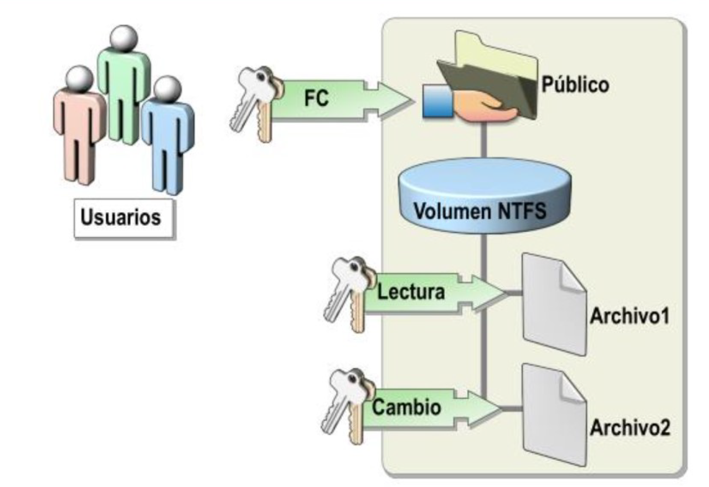
  <figcaption>Relación entre permisos NTFS y permisos compartidos</figcaption>
</figure>

#### Permisos de recursos compartidos

Los permisos de recursos compartidos pueden ser de tres tipos:

- **Control total**: Lectura, escritura, modificación y gestión de permisos.
- **Cambiar**: Crear, modificar y borrar archivos y carpetas.
- **Lectura**: Solo lectura y ejecución de archivos.

!!! warning "Prioridad de Denegar"
    La opción **Denegar** tiene prioridad sobre cualquier permiso Permitir asignado al recurso compartido.

Para compartir una carpeta, se puede usar **Compartir con...** → **Usuarios específicos** en el menú contextual, o **Propiedades** → pestaña **Compartir** → **Uso compartido avanzado** para un control más detallado. Se recomienda asignar permisos a **grupos** y evitar el uso del grupo **Todos**.

#### Permisos NTFS

Los permisos NTFS son más granulares y admiten herencia. Los permisos estándar incluyen: **Control total, Cambiar, Leer y ejecutar, Mostrar contenido de carpeta, Leer y Escribir.** Cada uno agrupa permisos especiales más concretos.

!!! warning "Permisos acumulativos y Denegar"
    Los permisos NTFS son acumulativos (usuario + grupos). Si hay conflicto entre Permitir y Denegar, **Denegar prevalece** cuando está definido explícitamente.

#### Herencia de permisos

Al crear un archivo o carpeta en NTFS, el objeto **hereda** los permisos de su carpeta contenedora. La herencia puede deshabilitarse desde **Propiedades** → **Seguridad** → **Opciones avanzadas** → **Deshabilitar herencia**, eligiendo entre convertir los permisos heredados en explícitos o quitarlos.

### Directivas de grupo (GPO)

Las **directivas de grupo** (Group Policy) son configuraciones creadas por el administrador que se aplican a objetos del dominio. Permiten controlar el entorno de trabajo de usuarios y equipos, políticas de contraseñas, permisos y distribución de software.

#### Orden de aplicación

Cuando existen varias GPO, el orden de aplicación es (de menor a mayor prioridad en caso de conflicto):

1. Directiva de grupo local
2. Directiva de grupo de sitio
3. Directiva de grupo de dominio
4. Directiva de grupo de unidad organizativa

!!! note "Prioridad entre varias GPO"
    Si varias GPO establecen valores distintos para la misma configuración, **se aplica la GPO con mayor prioridad según el orden**: primero la local, luego la de sitio, después la de dominio y finalmente la de unidad organizativa.  
    
    - Es decir, **la GPO más específica (la de más abajo en la lista)** prevalece frente a las demás en caso de conflicto.

#### GPO predeterminadas

Al crear un dominio se generan dos GPO:

- **Default Domain Policy**: Vinculada al dominio.
- **Default Domain Controllers Policy**: Vinculada a la UO Domain Controllers.

<figure>
  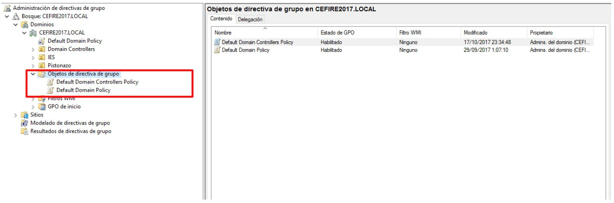
  <figcaption>GPO predeterminadas del dominio</figcaption>
</figure>

#### Configuraciones habituales

Entre las configuraciones más útiles mediante GPO destacan:

- **Directiva de bloqueo de cuenta**: Bloquear la cuenta tras X intentos fallidos de contraseña.
- **Directivas de contraseñas**: Longitud mínima, complejidad, historial y vigencia máxima.
- **Permisos de usuario**: Quién puede apagar el equipo, acceder a la consola, etc.
- **Redirección de carpetas**: Enviar Documentos, Escritorio, etc. a ubicaciones de red.
- **Apariencia y restricciones**: Fondo de escritorio corporativo, bloqueo de CMD, etc.

!!! tip "Aplicar cambios de GPO de inmediato"
    Los cambios en las Directivas de Grupo (GPO) se aplican automáticamente cada cierto tiempo (por defecto, cada 5 minutos en los controladores de dominio y cada 90 minutos en el resto de los equipos, aunque este intervalo puede variar según la configuración).  
    
    - Si necesitas que los cambios surtan efecto al instante, puedes forzar la actualización ejecutando el comando `gpupdate` en el cliente o servidor.
    - Además, para consultar exactamente qué políticas están en vigor en un equipo o usuario determinado, puedes usar la herramienta gráfica **rsop.msc** (Resultant Set of Policy). Esta utilidad muestra el conjunto de directivas resultantes tras combinar todas las GPO aplicadas, teniendo en cuenta el orden de aplicación, la herencia y los posibles conflictos entre ellas. Así, te permite comprobar y diagnosticar qué configuraciones están afectando realmente al equipo o usuario.

## Actividades

---

* :material-trophy: **PR401. Práctica: Configuración de Active Directory en AWS Academy**. (RA.1 // CE3a, CE3b, CE3c, CE3d, CE3e, CE3f, CE3g y CE3h // 1-10p). 

En esta práctica aprenderás a configurar **Active Directory Domain Services (AD DS)** en una instancia de **Windows Server** en **AWS Academy** y unir clientes al dominio. El objetivo es familiarizarte con los servicios de directorio propietarios, la configuración de dominios y la administración centralizada de usuarios y equipos.

!!! note "Entorno educativo"
    Esta práctica utiliza **AWS Academy Learner Lab**, una plataforma educativa que proporciona acceso a recursos de AWS con créditos limitados para estudiantes. Los recursos creados se eliminan automáticamente al finalizar el laboratorio.

> **Resumen de tareas**

- **Accede a AWS Academy** a través de Canvas e inicia el laboratorio AWS Academy Learner Lab.
- **Crea instancias de Windows Server 2025** en AWS EC2 (servidor y cliente).
- **Configura DHCP en AWS** para soportar el dominio de Active Directory.
- **Configura grupos de seguridad** para permitir los servicios necesarios de Active Directory.
- **Instala Active Directory Domain Services** y promueve el servidor a controlador de dominio.
- **Crea usuarios, grupos y unidades organizativas** en el dominio.
- **Une un cliente al dominio** y verifica la configuración.
- **Configura acceso remoto RDP** para usuarios del dominio.
- **Documenta el proceso**, mostrando los conceptos de servicios de directorio, pasos realizados, comandos utilizados y capturas de pantalla de la funcionalidad.

> **Criterios de evaluación**

- Configuración correcta de AWS Academy y acceso al laboratorio.
- Creación correcta de las instancias Windows Server 2025 en EC2.
- Configuración adecuada de DHCP en AWS para el dominio.
- Configuración correcta de grupos de seguridad para permitir servicios de Active Directory.
- Instalación y promoción exitosa a controlador de dominio.
<!-- - Creación y gestión correcta de usuarios, grupos y unidades organizativas. -->
- Unión exitosa del cliente al dominio.
- Configuración correcta del acceso remoto para usuarios del dominio.
- Explicación clara de los conceptos de servicios de directorio y Active Directory.
- Documentación completa de la arquitectura y pasos seguidos con evidencias.

> Consulta el enunciado completo y detallado aquí:  
> [Práctica: Configuración de Active Directory en AWS Academy](PracticaActiveDirectoryAWS.md)

!!! note "Entorno educativo: AWS Academy Learner Lab"
    **AWS Academy Learner Lab** proporciona un entorno controlado con créditos educativos limitados para que los estudiantes experimenten con servicios de AWS. El laboratorio tiene un tiempo limitado (normalmente 4 horas) y los recursos se eliminan automáticamente al finalizar. Es importante **detener las instancias** cuando no se usen para no consumir créditos innecesariamente. Los conceptos aprendidos son directamente aplicables a escenarios reales con AWS en producción.
    
---

* :material-trophy: **PR402. Práctica: Administración de Usuarios y Grupos en Active Directory**. (RA.1 // CE3d, CE3e y CE3h // **OPCIONAL – NO EVALUABLE**)

En esta práctica aprenderás a crear, configurar y gestionar usuarios y grupos en **Active Directory Domain Services**. El objetivo es familiarizarte con la administración de objetos del directorio, configuraciones de cuentas y restricciones de acceso.

!!! note "Entorno educativo"
    Esta práctica requiere tener un dominio de Active Directory configurado. Si no lo tienes, completa primero la PR401.

> **Resumen de tareas**

- **Crea usuarios del dominio** con configuraciones de contraseña apropiadas.
- **Crea grupos de seguridad** con diferentes ámbitos (global, local de dominio, universal).
- **Añade usuarios a grupos** y gestiona pertenencias.
- **Deshabilita y habilita** cuentas de usuario y verifica el comportamiento.
- **Configura restricciones de inicio de sesión** (equipos permitidos y horarios).
- **Verifica las restricciones** funcionando correctamente.
- **Documenta el proceso**, mostrando los conceptos de usuarios y grupos, pasos realizados y capturas de pantalla de la funcionalidad.

> **Criterios de evaluación**

- Creación correcta de usuarios con configuraciones apropiadas.
- Creación correcta de grupos con ámbitos adecuados.
- Gestión correcta de pertenencias de usuarios a grupos.
- Configuración correcta de restricciones de inicio de sesión.
- Verificación exitosa de las restricciones funcionando.
- Explicación clara de los conceptos de usuarios, grupos y sus tipos.
- Análisis correcto de las restricciones y su funcionamiento.
- Documentación completa de la arquitectura y pasos seguidos con evidencias.

> Consulta el enunciado completo y detallado aquí:  
> [Práctica: Administración de Usuarios y Grupos en Active Directory](PracticaUsuariosGruposAD.md)

---

* :material-trophy: **PR403. Práctica: Gestión de Grupos y Unidades Organizativas en Active Directory**. (RA.1 // CE3d, CE3e, CE3f y CE3h // 1-10p). 

En esta práctica aprenderás a gestionar grupos, unidades organizativas y usuarios en **Active Directory Domain Services** para una organización empresarial. El objetivo es trabajar con estructuras organizativas más complejas, creación masiva de usuarios y organización jerárquica del directorio.

!!! note "Entorno educativo"
    Esta práctica requiere tener un dominio de Active Directory configurado y usuarios de prueba creados. Si no los tienes, completa primero la PR401 y PR402.

> **Resumen de tareas**

- **Crea unidades organizativas** para estructurar el dominio por departamentos.
- **Crea usuarios del dominio** para responsables de departamento con diferentes roles.
- **Crea y gestiona grupos** de seguridad para cada departamento.
- **Organiza usuarios y grupos** en unidades organizativas apropiadas.
- **Crea usuarios masivamente desde CSV** usando PowerShell (método alternativo).
- **Elimina usuarios de prueba** de forma segura.
- **Documenta la estructura organizativa** del dominio.

> **Criterios de evaluación**

- Creación correcta de unidades organizativas con estructura jerárquica.
- Creación correcta de usuarios de departamento con propiedades apropiadas.
- Creación correcta de grupos de seguridad por departamento.
- Organización correcta de usuarios y grupos en unidades organizativas.
- Eliminación correcta de usuarios de prueba.
- Uso correcto de PowerShell para creación masiva desde CSV (opcional).
- Explicación clara de la estructura organizativa y su justificación.
- Documentación completa de la arquitectura y pasos seguidos con evidencias.

> Consulta el enunciado completo y detallado aquí:  
> [Práctica: Gestión de Grupos y Unidades Organizativas en Active Directory](PracticaGestionGruposAD.md)

---

* :material-trophy: **PR404. Práctica: Gestión de recursos compartidos en Active Directory**. (RA.1 // CE3e, CE3f y CE3h // 1-10p). 

En esta práctica aprenderás a gestionar **recursos compartidos** en un dominio de Active Directory: crear estructuras de carpetas, configurar permisos NTFS y compartidos, asignar carpetas personales a usuarios y aplicar **directivas de grupo (GPO)** para políticas de contraseñas y bloqueo de cuenta.

!!! note "Entorno educativo"
    Esta práctica requiere tener un dominio de Active Directory configurado, usuarios y grupos creados. Completa primero la PR401, PR402 y PR403.

> **Resumen de tareas**

- **Crea la estructura de carpetas** en disco (carpetas personales y datos por departamento).
- **Comparte las carpetas** y configura permisos de recursos compartidos por grupo.
- **Configura permisos NTFS** con diferentes niveles según el rol (Administradores, trabajadores, etc.).
- **Asigna carpetas personales** a usuarios (unidad X:) y carpeta de empresa (unidad Y:) al iniciar sesión.
- **Configura GPO de contraseñas**: vigencia 90 días, historial 5 contraseñas, longitud mínima 4 caracteres.
- **Configura GPO de bloqueo**: 4 intentos fallidos bloquean la cuenta; contador se restablece tras 10 minutos.
- **Verifica el acceso** a los recursos según los grupos de cada usuario.
- **Documenta el proceso** con capturas de pantalla.

> **Criterios de evaluación**

- Creación correcta de la estructura de carpetas.
- Configuración correcta de permisos compartidos y NTFS.
- Asignación correcta de carpetas personales a usuarios.
- Configuración correcta de las GPO de contraseñas y bloqueo.
- Verificación exitosa del acceso a los recursos.
- Explicación clara de permisos compartidos vs NTFS.
- Documentación completa con evidencias.

> Consulta el enunciado completo y detallado aquí:  
> [Práctica: Gestión de recursos compartidos en Active Directory](PracticaRecursosCompartidosAD.md)

---

* :material-trophy: **RG405**. (RA.1 // CE3a, CE3b, CE3c, CE3d, CE3e, CE3f, CE3g y CE3h // 30p). Trabajo individual para configurar desde cero la infraestructura de Active Directory de una empresa ficticia (TechCorp Solutions) con 20 usuarios, integrando todos los conceptos aprendidos durante la unidad.
    * **[RETO INDIVIDUAL: Active Directory Completo — TechCorp Solutions](RetoGrupalActiveDirectory.md)**.

---
