# Instalación y configuración básica del servidor Open LDAP

## Enunciado

- Se debe Realizar un informe breve en pdf con la captura del **slapcat** que confirme que se ha instalado y configurado el OpenLDAP.

!!! note "Nota"
    Debe aparecer el dominio: **nombre.apellidos.ldap**

## Pasos Iniciales

Antes de comenzar la instalación de OpenLDAP, es recomendable realizar unos pasos previos, a continuación se describen:

1. En primer lugar se aconseja utilizar IP fijas en el aula, que serán clase c de esta forma: `192.168.5.X`, donde X será el número de puesto.

!!! example "Ejemplo"
Para ello se modifica el archivo `/etc/netplan/00-installer-config.yaml`

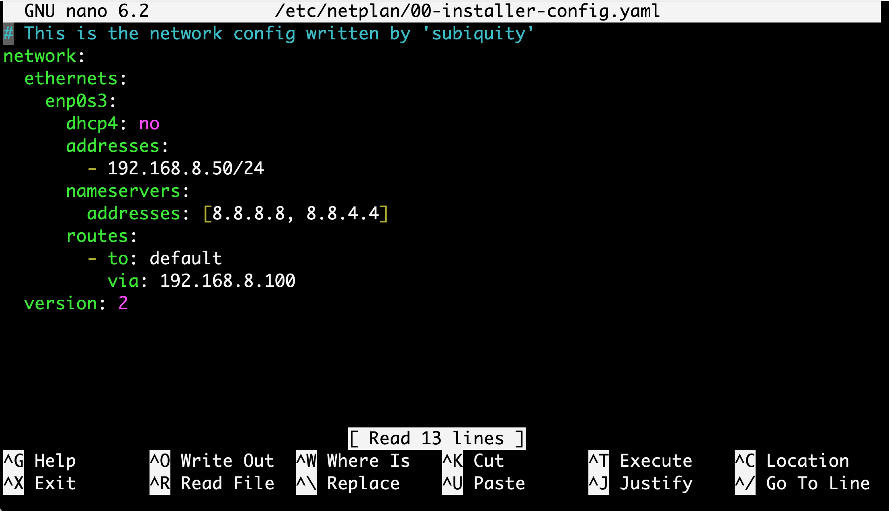

La **figura anterior** muestra un ejemplo de modificación con una red para **ubuntu server 22.04** con una red **192.168.8.0/24**.

2. A continuación se modifica el archivo Hots para cambiar el nombre de la máquina en el dominio configurado. Con las siguientes premisas.

- Modificar el contenido del fichero `/etc/hosts` para indicar un **FQDN ( fully qualified domain name)** a nuestro servidor. 
- **FQDN** es un nombre de dominio completo que incluye el nombre de la computadora y el nombre de dominio asociado a ese equipo.​​ Por ejemplo, dada la computadora llamada **«aso»** y el nombre de dominio **«aso.ldap.»**
- El objetivo de este cambio es que cuando hagamos referencia a aso.ldap, nuestro sistema entienda que nos estamos refiriendo al servidor. Esto, además, facilitará la labor de configuración de nuestro servicio de directorio.
- Para modificar el dicho archivo se ejecuta el siguiente comando.

```
sudo nano /etc/hosts
```

!!! example "Ejemplo"

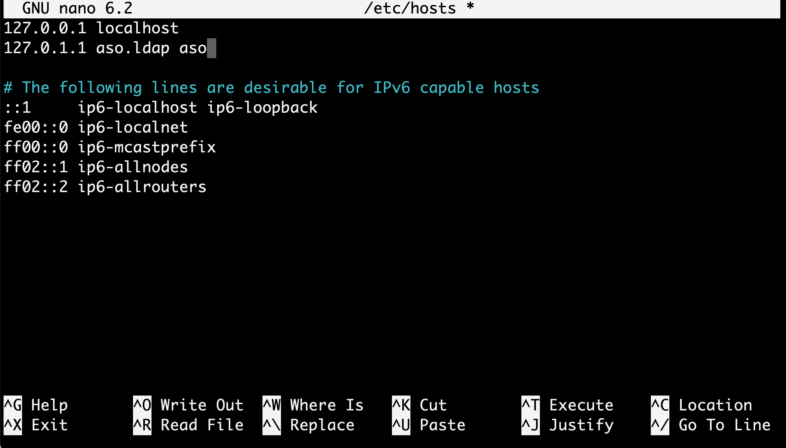


## Instalación y configuración del Servicio OpenLDAP

En este apartado se explican en forma de guía práctica los pasos de la implantación del servicio OpenLDAP en un servidor Ubuntu 22.04

!!! tip "Consejo"
    A priori se podría revisar con antelación los paquetes a instalar con: `apt show slapd`

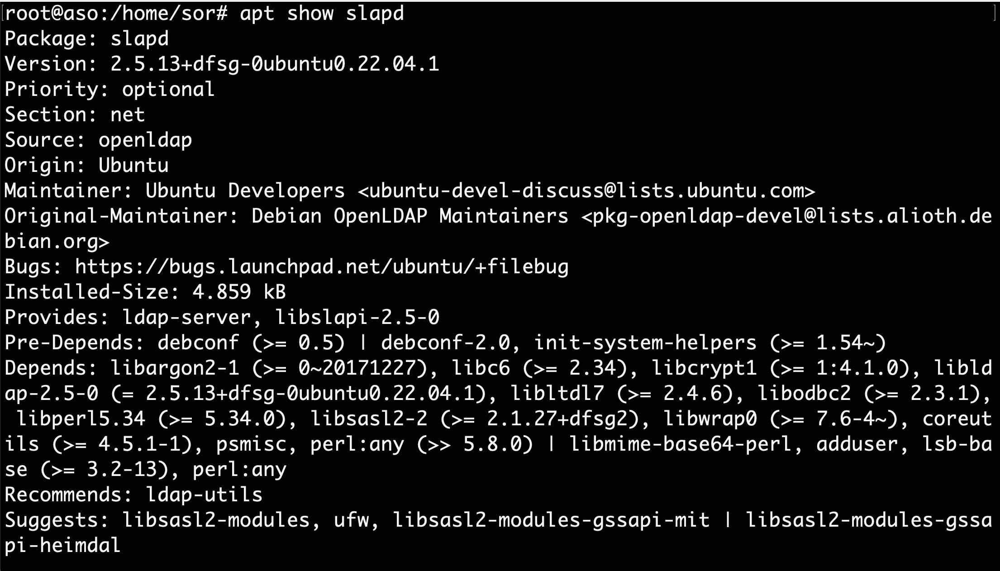

1. **Instalación**: Se instalan los paquetes necesarios en el servidor.

```
sudo apt install slapd
```

Seguidamente se instala el paquete de LDAP.

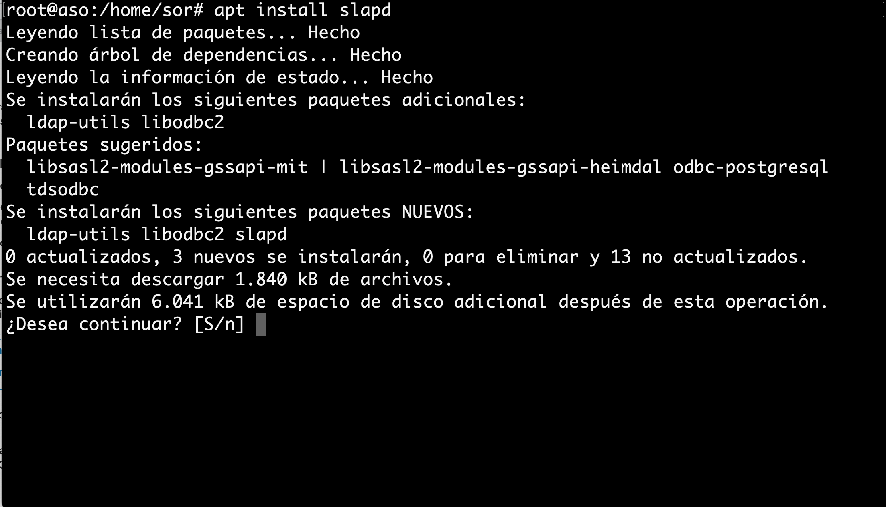

Automáticamente nos aparecerá una ventana donde introduciremos la contraseña (En este caso **aso**, pero se aconseja introducir una contraseña más robusta) de administrador para el directorio LDAP. Seguidamente terminará el proceso de instalación.

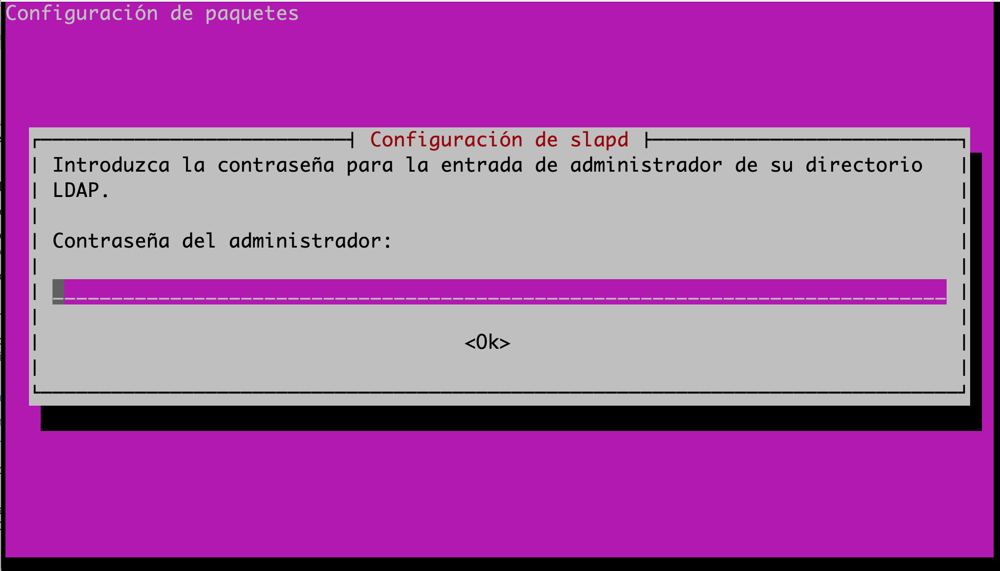

Se puede comprobar que se ha instalado correctamente ejecutando el comando **slapcat**. Dicho comando muestra en formato **LDIF** el contenido de las entradas existentes en el servicio de directorio.

```
sudo slapcat
```
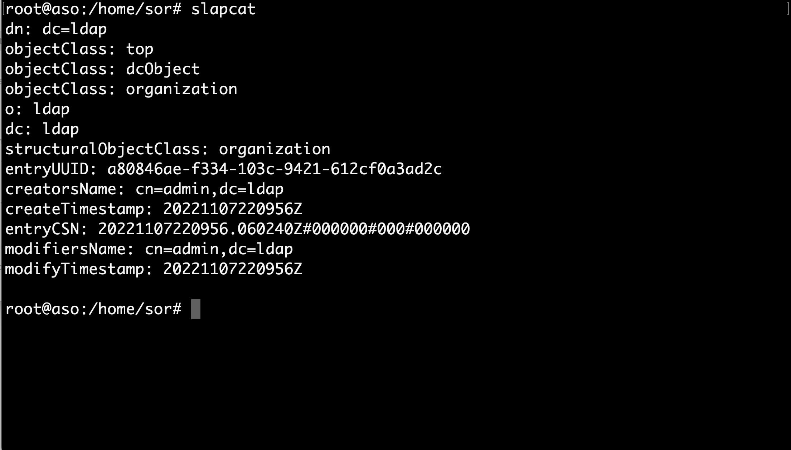

Además se puede comprobar que el servicio esta corriendo con:

```
systemctl status slapd.service
```
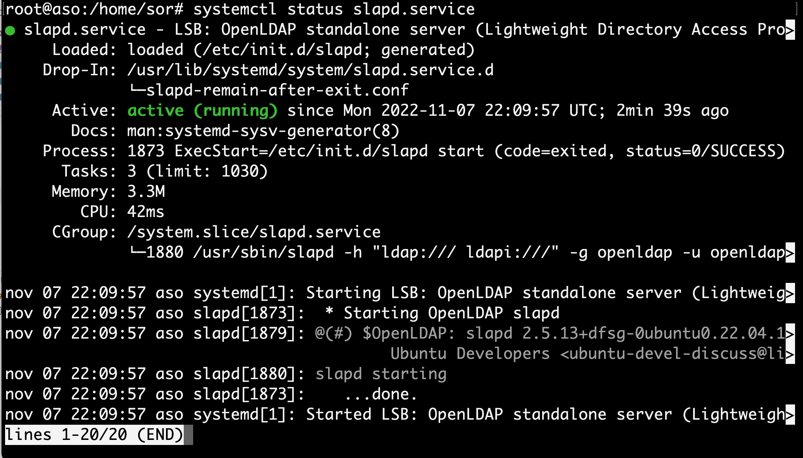

También se puede comprobar si el servicio de directorio OpenLdap esta escuchando por el `puerto 389`.

```
ss -lntp
```

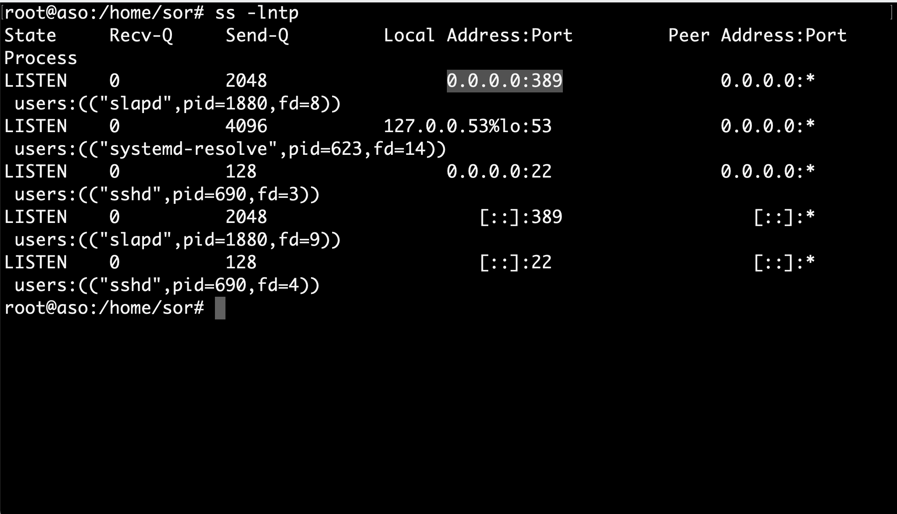

2. **Configuración**: se realiza la configuración de nuestro servicio de directorio usando el asistente de `slapd`. Para ello se ejecuta la siguiente instrucción:

```
sudo dpkg-reconfigure slapd
```

El primer paso del asistente pregunta si quiere omitir la configuración del servidor OpenLDAP. Elegiremos que **NO** para poder configurarlo.

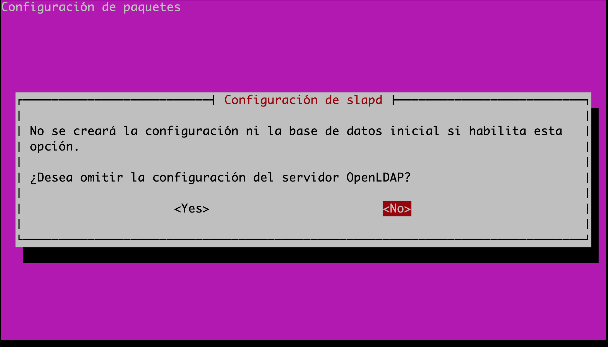

A continuación pregunta por el dominio en el que se encuentra nel servidor, esto va a formar parte del DN del directorio LDAP. Al haberlo indicado anteriormente en el fichero `/etc/hosts`, automáticamente el asistente lo recoge y lo modificamos para añadir aso, quedaría **aso.ldap**.

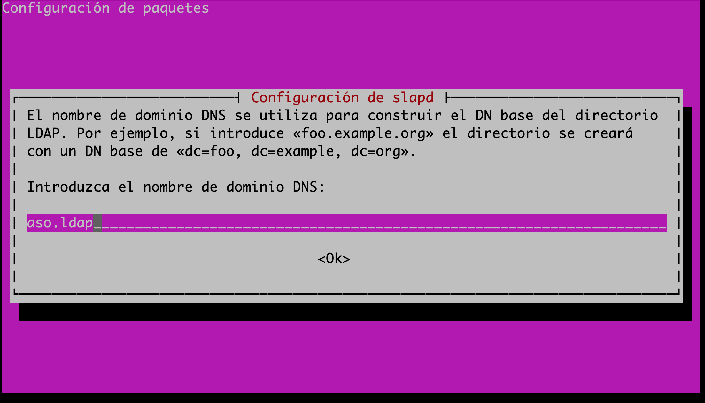

Luego pregunta por el nombre de la organización a la que va a pertenecer nuestro servidor LDAP.

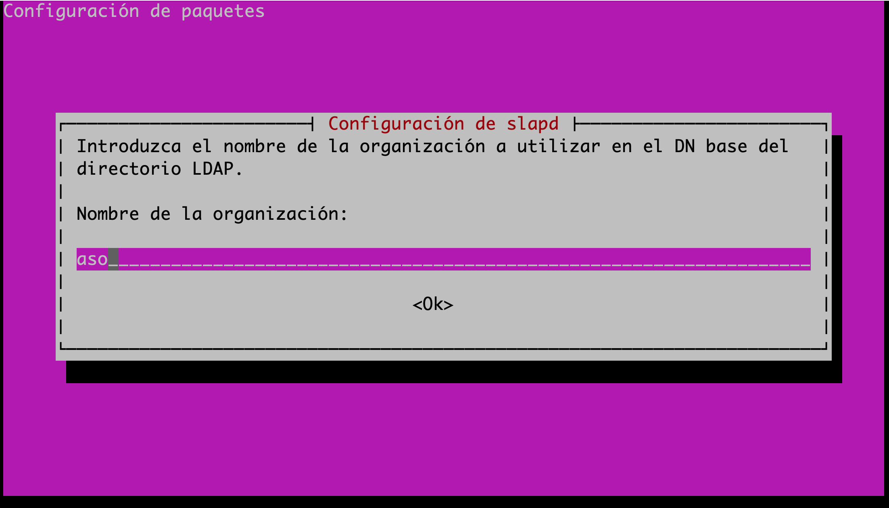

Se puede elegir una contraseña fácil para la práctica como **asoldap**. Pulsamos OK.

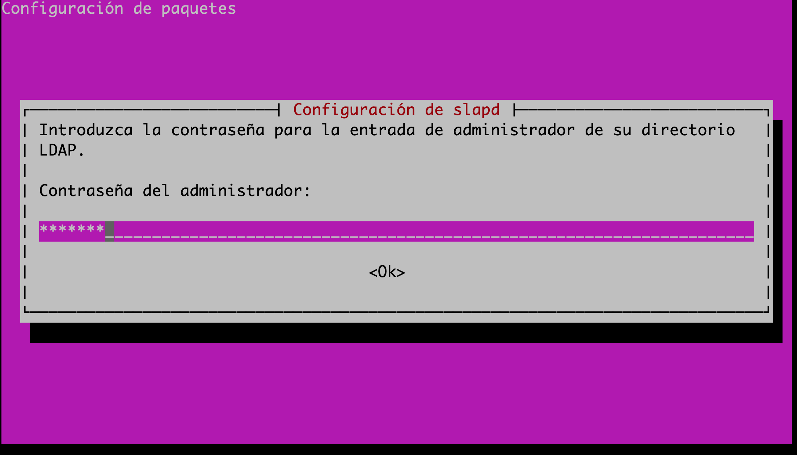

Además nos vuelve a pedir la contraseña de administrador del directorio LDAP. Esta que pongamos va a machacar la que indicamos en el proceso de instalación y será la definitiva. Como suele pasar, la deberemos introducir dos veces para evitar errores tipográficos.

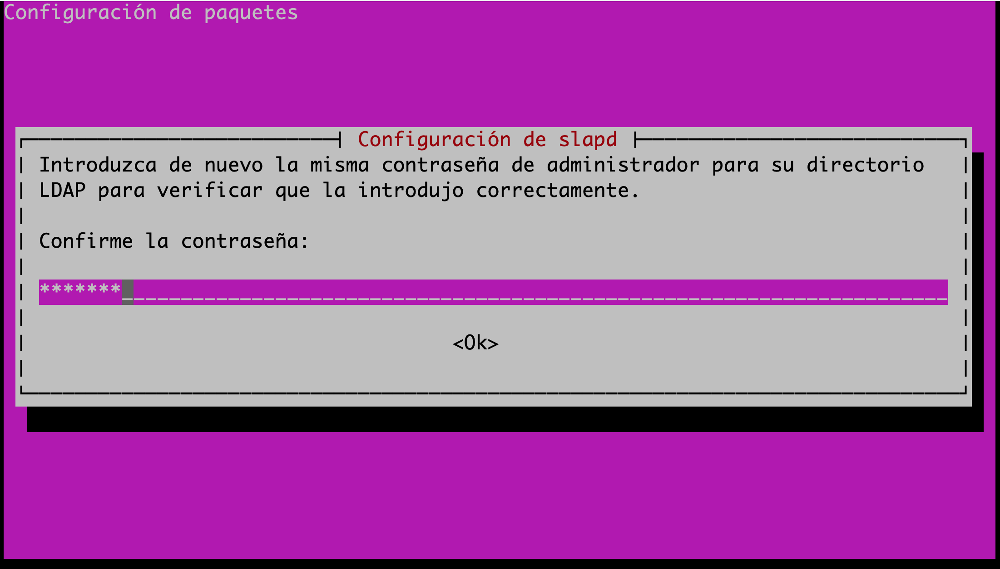

Seguidamente pregunta si se elimina la base de datos del directorio LDAP cuando se borre el paquete slapd del sistema. Se indicará que **NO**.

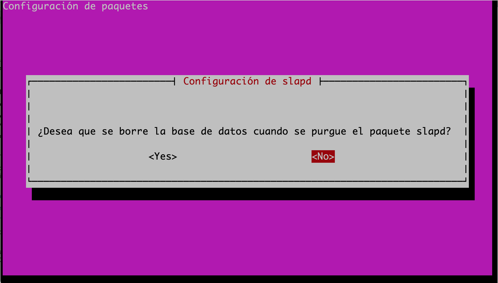

Y por último pregunta si se quiere mover los datos de alguna antigua base de datos de directorio LDAP a la nueva que se está configurando. En este caso, como no se tiene ninguna antigua no va afectar en nada, lo dejaremos en **SI** y finalizará la configuración.

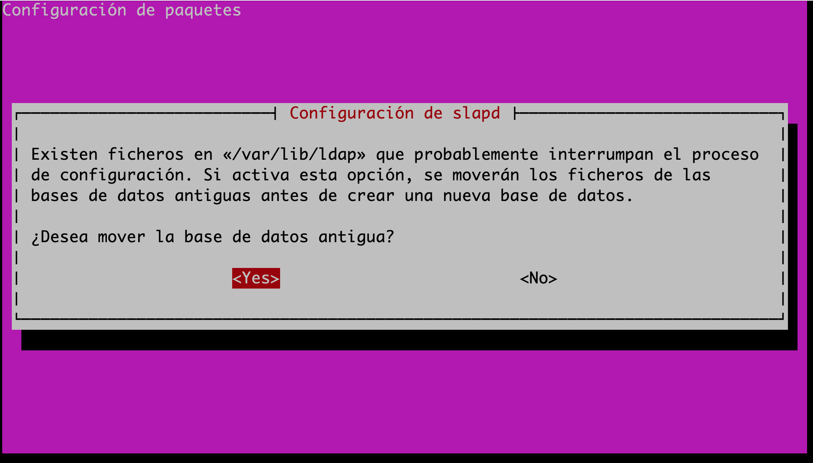

Una vez finalizado el asistente, se vuelve a ejecutar el comando **slapcat** y se observa como se han modificado los valores de los atributos de las entradas, con los datos que se acaban de indicar. 

```
sudo slapcat
```

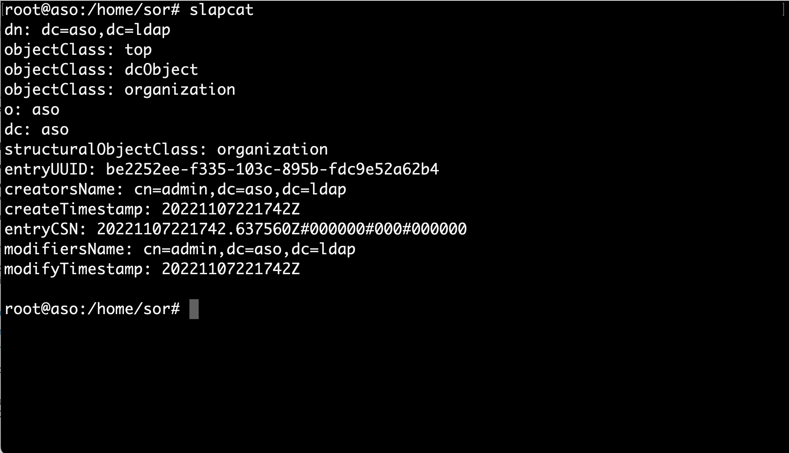