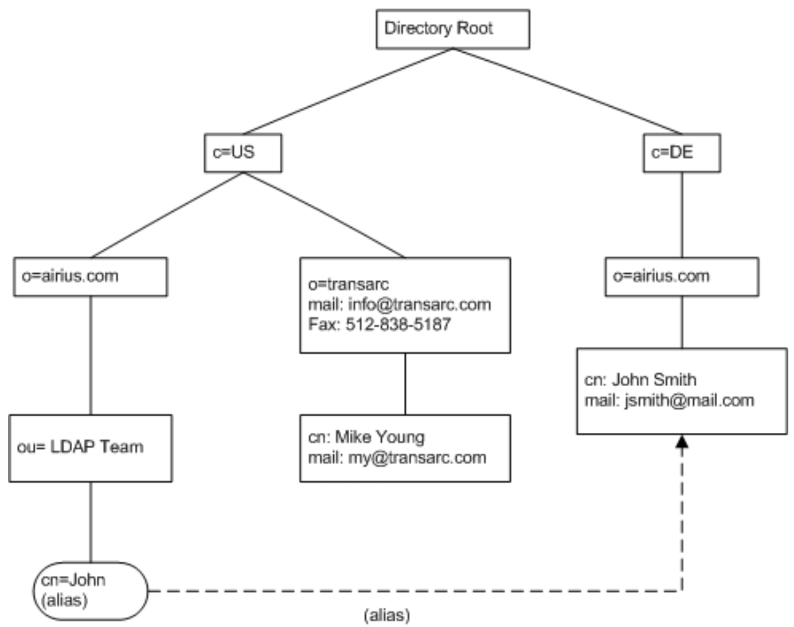

# Modelo de Información de LDAP

La estructura básica de LDAP es un árbol de nodos llamado **Directory Information Tree (DIT)** donde cada **objeto o nodo** es una entrada. La parte superior del árbol se llama comúnmente **raíz** (también conocida como **base** o **sufijo** ).

Cada entrada se define por un **DN (Distinguished Name)** y contiene un conjunto de atributos. Este DN es una cadena que indica la ruta en el árbol de dicha entrada y será único en todo el árbol. Un ejemplo del aspecto que ofrece un DN sería el siguiente:

!!! Example
    * **cn=usuario1,ou=usuarios,dc=midominio,dc=es**
    * Puede verse que cada componente (la coma es el carácter separador) se muestra como un par **«atributo=valor»** donde el atributo es una abreviatura usada por LDAP.

Cada **entrada** en el árbol tiene:

- Una *entrada principal* (objeto) y cero o más *entradas secundarias* (objetos). Cada entrada secundaria (objeto) es un **hermano** de las otras entradas secundarias de su padre.
- Cada entrada es una instancia de una o más **clases de objeto** (**objectClasses**). Las **objectClasses** contienen cero o más atributos. Los atributos se definen con nombres o **alias** y normalmente contienen datos.

A continuación se muestra un diagrama para entender mejor estos conceptos:

<figure>
  
  <figcaption>Modelo de información (datos) LDAP DIT</figcaption>
</figure>

**Resumen:**

1. Cada **entrada** (1) se compone de una o más **clases de objetos** (2)
2. Cada **objectClass** (2) tiene un nombre y es un contenedor de atributos (su definición identifica los atributos que puede o debe contener)
3. Cada **atributo** (3) tiene un nombre, contiene datos y es miembro de una o más **clases de objetos** (2)
4. Cuando se completa el DIT, cada **entrada** se identificará de forma única en relación con su *entrada principal* siguiendo la jerarquía del DIT y por los datos que contiene según sus atributos definidos en las objectClasses a las que pertenecen.

### Entrada

Una **entrada LDAP** es una recopilación de información sobre una entidad que formará un objeto. Cada entrada consta de tres componentes principales:

* Nombre distinguido DN y RDN (Relative Distinguished Name)
* Colección de clases de objetos (objectClasses)
* Atributos

Cada uno de estos se describe con más detalle a continuación.

#### DN y RDN

**El nombre distinguido de una entrada, a menudo denominado DN**, identifica de forma única esa entrada y su posición en la jerarquía del árbol de información de directorio (DIT). **El DN de una entrada LDAP es muy parecido a la ruta a un archivo en un sistema de archivos**.

* Un **DN LDAP se compone de elementos** denominados nombres distinguidos relativos o **RDN**. Cada RDN se compone de uno o más (generalmente solo uno) pares de atributo-valor.

!!! example
    * **"uid = john.doe"** representa un RDN compuesto por un atributo llamado "uid" con un valor de "john.doe".
    * Si un RDN tiene varios pares de atributo-valor, están separados por signos más, como **"givenName = John + sn = Doe"**.

!!! note "Nota"
    - **El nombre distinguido especial compuesto por cero RDN** (y por lo tanto tiene una representación de cadena que es solo una **cadena vacía**) a veces se denomina **"DN nulo"** y hace referencia a un tipo especial de entrada llamado **DSE raíz** que proporciona información sobre el contenido y las capacidades de el servidor de directorio.
    - Para DN con **múltiples RDN**, el orden de los RDN especifica la posición de la entrada asociada en el DIT.

Los RDN están separados por comas, y cada RDN en un DN representa un nivel en la jerarquía en orden descendente (es decir, acercándose a la raíz del árbol, que se denomina contexto de nomenclatura).

!!! example
    El DN **"uid = john.doe, ou = People, dc = example, dc = com"** tiene cuatro RDN.

### Clases de objetos (objectClasses)

* Las clases de objeto son **elementos de esquema que especifican colecciones de tipos de atributos** que pueden estar relacionados con un tipo particular de objeto, proceso u otra entidad.
* Las **clases de objetos** son, esencialmente, **contenedores de atributos** y se describen utilizando definiciones **ASN.1** .
* Cada **objectClass tiene un nombre único**.
* Existe un número confuso de **clases de objetos** **PREDEFINIDAS**, cada una de las cuales contiene una gran cantidad de **atributos** adecuados para casi todas las implementaciones LDAP comunes.

Las clases de objetos tienen tres características principales:

1. La **clase de objeto** define si un miembro de atributo es **MUST** ( obligatorio ) o **MAY** ( opcional ).
2. Los tipos de **clases de objeto** son *estructurales*, *auxiliar* o *RESUMEN*, caracterizadas por su nombre.
3. Una **clase de objeto** puede ser parte de una jerarquía, en cuyo caso **hereda** todas las características de sus clases de objeto principal (incluidos todos los atributos que contiene).

!!! Note
    **objectClasses o clases de objeto** son contenedores y controlan qué atributos se pueden agregar a cada entrada, pero por lo demás tienden a permanecer en segundo plano en lo que respecta al acceso y búsqueda en el DIT. **Los atributos y las entradas son los elementos realmente visibles**.

### Atributos

Cada **atributo** de una entrada tendrá un **tipo** y un **valor** con el formato atributo/valor que permite caracterizar un aspecto del objeto que define la entrada. Estos atributos tienen nombres que hacen referencia a su contenido y pueden ser de dos tipos:

1. **Atributos normales** : Son los atributos que identifican al objeto
2. **Atributos operativos** : Son los atributos que utiliza el servidor para administrar el directorio

Entre los atributos que suelen utilizarse habitualmente, encontramos los siguientes, aunque puede haber muchos mas:

-   **dn** (distinguished name): nombre distintivo de una entrada, contiene un conjunto de atributos y es de carácter único.
-   **dc** (domain component): se refiere al componente del dominio, ya sea un componente, una etiqueta o un nombre de dominio DNS.
-   **ou** (organizational unit): unidad organizativa.
-   **cn** (common name): nombre común.
-   **sn** (surname): apellido.
-   **uid** (userid): nombre de usuario.
-   **mail:** dirección de e-mail.
-   **telephoneNumber:** número de teléfono.

!!! Example
    * **DN** cn=John Smith, o=airius.com, c=DE 
    * **RDN** cn=John Smith + DN of ancestor o=airius.com, c=DE

<figure>
  
  <figcaption>Modelo de nomenclatura LDAP</figcaption>
</figure>

#### Características de Atributos

Cada **atributo** tiene un nombre único (**y una forma abreviada o alias**) y normalmente contiene datos. Los atributos siempre están asociados con (o son miembros de) una o más **ObjectClasses** . Los atributos tienen una serie de características interesantes:

1. Todos los **atributos** son miembros de una o más **clases de objeto**.
2. Cada **atributo** define el tipo de datos (la palabra clave es SINTAXIS) que puede contener. Los tipos de datos pueden ser: *Strings*, *Numbers (Integer)*, *Time*, *Telephone Numbers*, *Boolean*, *Binary*, *Distinguished Name*, *Bit Strings*, *LDAP Supported Syntaxes*.
3. Los atributos pueden formar parte de una **jerarquía**, en cuyo caso el atributo *hijo hereda todas las características del atributo padre*. En el caso de los atributos, se usa una jerarquía para simplificar y acortar las definiciones de atributos (en ASN.1) donde muchos atributos comparten propiedades comunes como la longitud máxima o si son o no sensibles a mayúsculas y minúsculas, etc. ningún otro significado.
4. Los atributos pueden ser opcionales (la palabra clave es **MAY**) u obligatorios (la palabra clave es **MUST**) como se describe en las definiciones *ASN.1* para la clase de objeto de la que son miembros. Un atributo puede ser opcional en una clase de objeto y obligatorio en otra. Es la clase de objeto la que determina esta propiedad.
5. Los atributos pueden tener un valor *ÚNICO* o *MÚLTIPLE* (como se describe en sus definiciones ASN.1 ). 
    1. **VALOR ÚNICO** significa que solo un valor de datos puede estar presente para el atributo.
    2. **MULTIVALOR** significa que el atributo puede aparecer varias veces en una clase de **entrada / objeto** con diferentes valores de datos.
Por ejemplo, Si el atributo describe, por ejemplo, una dirección de correo electrónico, puede haber una, dos o 500 definiciones del atributo, cada una con una dirección de correo diferente (es múltiple).
7. Los atributos tienen nombres y, a veces, un alias (como se describe en sus definiciones ASN.1), por ejemplo, el atributo con un nombre de **cn** y tiene un alias de **commonName** . Se puede utilizar commonName o cn para hacer referencia a este atributo .
8. En cada nivel de la jerarquía, **los datos contenidos en un atributo se pueden utilizar para identificar de forma única la entrada**.
9. Los valores de atributo seleccionados para contener los datos únicos a veces se denominan atributos de nomenclatura o el nombre distinguido relativo (RDN), ya comentados.

!!! tip "Consejo"
    Se pueden consultar en [Atributos comunmente utilizados](http://zytrax.com/books/ldap/ape/index.html#attributes).

## LDIF

Para la gestión de los elementos comentados en el servicio de LDAP se utilizan **archivos de intercambio de datos LDAP llamados LDIF**.

* Los **LDIF** son archivos de texto que describen la jerarquía del árbol, el árbol de **información del directorio (DIT)**, y los datos que se agregarán a cada atributo.
* El siguiente es un ejemplo simple de un archivo LDIF que configura un DN raíz (dc = ejemplo, dc = com) y agrega tres entradas secundarias debajo de una entrada de **personas**.

``` yaml
version: 1

## version not strictly necessary (and some implementations reject it) but generally good practice

## DEFINE DIT ROOT/BASE/SUFFIX ####
## uses RFC 2377 (domain name) format

## dcObject is an AUXILIARY objectclass and MUST
## have a STRUCTURAL objectclass (organization in this case)
# this is an ENTRY sequence and is preceded by a BLANK line

dn: dc=example,dc=com
dc: example
description: The best company in the whole world
objectClass: dcObject
objectClass: organization
o: Example, Inc.

## FIRST Level hierarchy - people 
# this is an ENTRY sequence and is preceded by a BLANK line

dn: ou=people, dc=example,dc=com
ou: people
description: All people in organisation
objectClass: organizationalUnit

## SECOND Level hierarchy - people entries 
# this is an ENTRY sequence and is preceded by a BLANK line

dn: cn=Robert Smith,ou=people,dc=example,dc=com
objectclass: inetOrgPerson
cn: Robert Smith
cn: Robert
sn: Smith
uid: rsmith
mail: robert@example.com
mail: r.smith@example.com
ou: sales

## SECOND Level hierarchy - people entries 
# this is an ENTRY sequence and is preceded by a BLANK line

dn: cn=Bill Smith,ou=people,dc=example,dc=com
objectclass: inetOrgPerson
cn: Bill Smith
cn: William
sn: Smith
uid: bsmith
mail: bill@example.com
mail: b.smith@example.com
ou: support

## SECOND Level hierarchy - people entries 
# this is an ENTRY sequence and is preceded by a BLANK line

dn: cn=John Smith,ou=people,dc=example,dc=com
objectclass: inetOrgPerson
cn: John Smith
sn: smith
uid: jsmith
mail: jim@example.com
mail: j.smith@example.com
ou: accounting
```


<!-- * base.ldif

``` yaml
dn: ou=usuarios,dc=aso,dc=ldap
objectClass: organizationalUnit
objectClass: top
ou: usuarios

dn: ou=grupos,dc=aso,dc=ldap
objectClass: organizationalUnit
objectClass: top
ou: grupos
```

* content.ldif 

``` yaml
dn: cn=devops,ou=grupos,dc=pandora,dc=ldap
objectClass: posixGroup
cn: devops
gidNumber: 10000
memberUid: devops

dn: uid=mordecai,ou=usuarios,dc=pandora,dc=ldap
objectClass: inetOrgPerson
objectClass: posixAccount
objectClass: shadowAccount
cn: Mordecai
sn: Geek
userPassword: {SSHA}latDDmodpsLUWDqwd/adk/j2tTDgz3NX
loginshell: /bin/bash
uidNumber: 10000
gidNumber: 10000
homeDirectory: /home/mordecai
```

## Actividades Desarrollo UD2_01 
<a name="Actividades Desarrollo UD2_01"></a>
[Creación de usuarios y grupos OpenLDAP](Practica02_LDAP.md)

## Actividades Desarrollo UD2_02

[Configuración de equipo cliente](Practica03_LDAP.md)

## Actividades Desarrollo UD2_03

201. En este ejercicio se deben utilizar los **comandos de OpenLdap** instalados en el paquete `LDAPutils`.
    1. Añade un nuevo grupo y dentro de el un nuevo usuario a la estructura de directorio creada en la práctica superior.
    2. Crea una contraseña para el usuario.
    3. Modifica el uid creado de inicio.
    4. Crea un segundo usuario, dentro de **usuarios**
    5. Elimina el segundo usuario creado.

En cada subapartado comprueba que se han introducido correctamente las modificaciones en el **DIT**.

## Actividades Desarrollo UD2_04

[Instalación y configuración phpLDAPadmin](phpLDAPadmin.md) -->