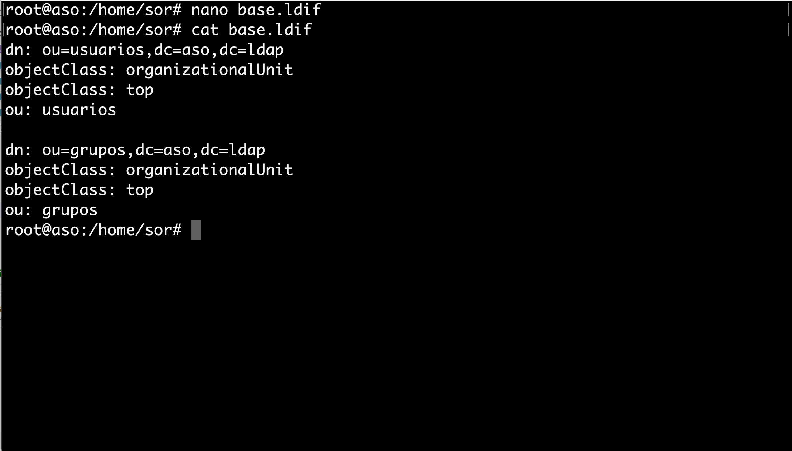
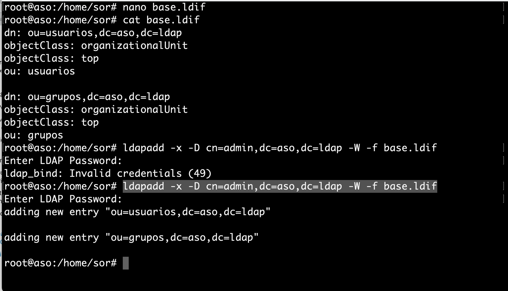
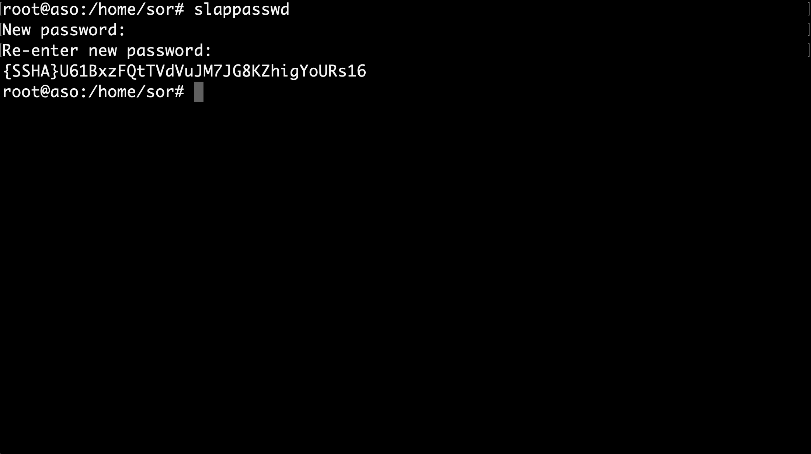
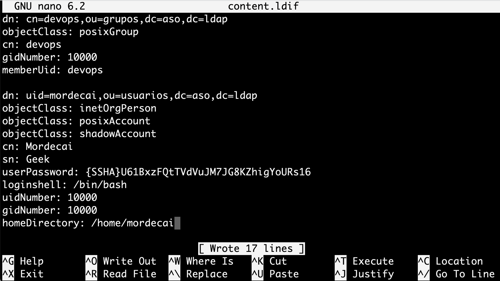
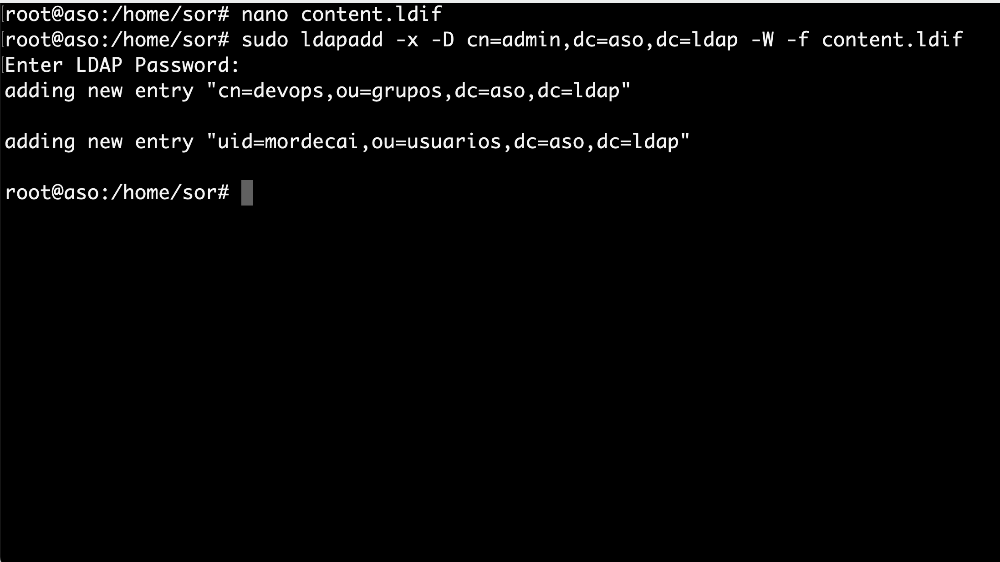
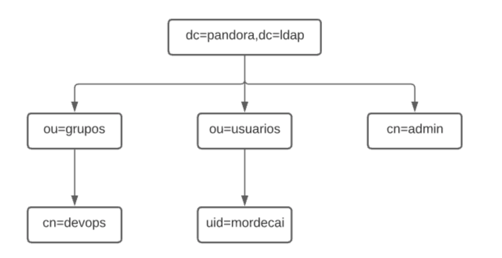

# Creación de usuarios y grupos OpenLDAP

## Enunciado

Se debe realizar un informe breve en pdf con las capturas:

- Captura del **slapcat** que confirme que se han creado y configurado los usuarios y grupos según el DIT que se aporta durante la guía.
- Captura del inicio de sesión con el usuario del cliente con CLI y GUI. Se requerirá en clase auditoría del inicio de sesión.

!!! note "Nota"
    Debe aparecer el dominio: **nombre.apellidos.ldap**

## Recordatorio

Con el servicio instalado y configurado, el siguiente paso es crear la estructura básica del directorio. Es decir, se creará la estructura jerárquica del árbol (DIT -- Directory Information Tree).

- Una de las formas más sencillas de añadir entradas al directorio es mediante ficheros LDIF (LDAP Data Interchange Format). 
- Básicamente se tratan de ficheros en texto plano con un formato particular que debemos conocer para poder construirlos correctamente. El formato básico de una entrada es el siguiente:

``` bash
# comentario
dn: <nombre distintivo único>
<atributo>: <valor>
<atributo>: <valor>
...
```

## base.ldif

1. Teniendo en cuenta lo anteriormente mencionado, procedemos a crear un fichero base que contenga los tipos de objetos básicos del directorio.

``` bash
nano base.ldif
```

2. Se genera el base.ldif siguiendo las siguientes premisas:

- En el LDIF se crean dos entradas referentes a unidades organizativas: «usuarios» y «grupos». 
- Las unidades organizativas, como su propio nombre indica, son atributos que nos van a servir para estructurar de forma idónea el árbol del directorio LDAP.
- Estas dos entradas serán la base del árbol ya que de ellas dependerán varias entradas más adelante.
- Se genera el base.ldif con las siguientes entradas, cambiando aso por dominio de cada alumna o alumno.

``` bash
dn: ou=usuarios,dc=aso,dc=ldap
objectClass: organizationalUnit
objectClass: top
ou: usuarios

dn: ou=grupos,dc=aso,dc=ldap
objectClass: organizationalUnit
objectClass: top
ou: grupos
```



3. Una vez creado el fichero base.ldif, se procede a cargar en el directorio LDAP. Para ello se ejecuta la siguiente instrucción:

!!! Warning "Advertencia"
    Importante haber anotado correctamente la contraseña introducida en la configuración del LDAP.

``` bash
sudo ldapadd -x -D cn=admin,dc=aso,dc=ldap -W -f base.ldif
```



4. Una vez cargadas las entradas, se a procede a crear nuevas entradas que colgarán de las unidades organizativas que acabamos de crear. Se crea una entrada para un grupo y una entrada para un usuario.

!!! tip "Consejo"
    Antes que nada, como buena práctica de seguridad, se genera una contraseña cifrada para asignárselas a los usuarios en el fichero LDIF que se va a crear. Para ello se ejecuta el siguiente comando:

``` bash
slappasswd
```

- Se escribe la contraseña dos veces y nos devolverá la misma cifrada por el algoritmo criptográfico SSHA.



## content.ldif

5. A continuación se utiliza la contraseña cifrada en el fichero content.ldif, donde se crean dos entradas:

- Un grupo llamado **devops** que colgará de la unidad organizativa grupos.
- Un usuario llamado **mordecai** que colgará de la unidad organizativa usuarios y a su vez pertenecerá al grupo **devops**.

``` bash
nano content.ldif
```

- Se puede copiar el siguiente archivo modificado el dominio y contraseña correspondiente en cada caso.

``` bash
dn: cn=devops,ou=grupos,dc=aso,dc=ldap
objectClass: posixGroup
cn: devops
gidNumber: 10000
memberUid: devops

dn: uid=mordecai,ou=usuarios,dc=aso,dc=ldap
objectClass: inetOrgPerson
objectClass: posixAccount
objectClass: shadowAccount
cn: Mordecai
sn: Geek
userPassword: {SSHA}U61BxzFQtTVdVuJM7JG8KZhigYoURs16
loginshell: /bin/bash
uidNumber: 10000
gidNumber: 10000
homeDirectory: /home/mordecai
```



6. De la misma forma que anteriormente, se procede a cargar las entradas en el directorio LDAP ejecutando la siguiente instrucción:

``` bash
sudo ldapadd -x -D cn=admin,dc=aso,dc=ldap -W -f content.ldif
```



En  este punto ya se tiene una estructura jerárquica del árbol creada de la siguiente manera (sustituyendo pandora por el correspondiente dominio):



Para poder ver las diferentes entradas que forman nuestro directorio LDAP ejecutamos el comando slapcat.

``` bash
sudo slapcat
```

``` bash
 root@aso:/home/sor# slapcat
dn: dc=aso,dc=ldap
objectClass: top
objectClass: dcObject
objectClass: organization
o: aso
dc: aso
structuralObjectClass: organization
entryUUID: be2252ee-f335-103c-895b-fdc9e52a62b4
creatorsName: cn=admin,dc=aso,dc=ldap
createTimestamp: 20221107221742Z
entryCSN: 20221107221742.637560Z#000000#000#000000
modifiersName: cn=admin,dc=aso,dc=ldap
modifyTimestamp: 20221107221742Z

dn: ou=usuarios,dc=aso,dc=ldap
objectClass: organizationalUnit
objectClass: top
ou: usuarios
structuralObjectClass: organizationalUnit
entryUUID: 9cec530a-f339-103c-8382-ab30731258a0
creatorsName: cn=admin,dc=aso,dc=ldap
createTimestamp: 20221107224524Z
entryCSN: 20221107224524.905787Z#000000#000#000000
modifiersName: cn=admin,dc=aso,dc=ldap
modifyTimestamp: 20221107224524Z

dn: ou=grupos,dc=aso,dc=ldap
objectClass: organizationalUnit
objectClass: top
ou: grupos
structuralObjectClass: organizationalUnit
entryUUID: 9cee76a8-f339-103c-8383-ab30731258a0
creatorsName: cn=admin,dc=aso,dc=ldap
createTimestamp: 20221107224524Z
entryCSN: 20221107224524.919838Z#000000#000#000000
modifiersName: cn=admin,dc=aso,dc=ldap
modifyTimestamp: 20221107224524Z

dn: cn=devops,ou=grupos,dc=aso,dc=ldap
objectClass: posixGroup
cn: devops
gidNumber: 10000
memberUid: devops
structuralObjectClass: posixGroup
entryUUID: 66e8da30-f33e-103c-8384-ab30731258a0
creatorsName: cn=admin,dc=aso,dc=ldap
createTimestamp: 20221107231941Z
entryCSN: 20221107231941.769744Z#000000#000#000000
modifiersName: cn=admin,dc=aso,dc=ldap
modifyTimestamp: 20221107231941Z

dn: uid=mordecai,ou=usuarios,dc=aso,dc=ldap
objectClass: inetOrgPerson
objectClass: posixAccount
objectClass: shadowAccount
cn: Mordecai
sn: Geek
userPassword:: e1NTSEF9VTYxQnh6RlF0VFZkVnVKTTdKRzhLWmhpZ1lvVVJzMTY=
loginShell: /bin/bash
uidNumber: 10000
gidNumber: 10000
homeDirectory: /home/mordecai
structuralObjectClass: inetOrgPerson
uid: mordecai
entryUUID: 66ed8418-f33e-103c-8385-ab30731258a0
creatorsName: cn=admin,dc=aso,dc=ldap
createTimestamp: 20221107231941Z
entryCSN: 20221107231941.800307Z#000000#000#000000
modifiersName: cn=admin,dc=aso,dc=ldap
modifyTimestamp: 20221107231941Z
```

## Comprobación. Configuración de equipo cliente

A continuación se indica como configurar un equipo cliente con el fin de poder iniciar sesión en él a partir de un usuario creado en el directorio LDAP.

!!! note "Nota"
    - Los ejemplos de las capturas deben cambiar según el nombre del usuario cliente o red privada a utilizar entre servidor y cliente

!!! tip "Consejo"
    - Añadir un segundo adaptador de red al servidor ubuntu on OpenLDAP instalado, aplicar una red interna y configurar en ese nuevo adaptador una IP estática para comunicarse con el cliente, pueden ser del rango **192.168.1.0/24**
    - Configurar en el cliente ubuntu una IP estática del mismo rango.

### Instalación en cliente

1. Instalación en el cliente de los paquetes necesarios:

``` bash
sudo apt install libnss-ldap libpam-ldap ldap-utils
```


Automáticamente se abrirá el asistente de configuración donde se indicarán los datos del servidor de LDAP.

En primer lugar, nos solicita la dirección URI del servidor. Se sustituye la cadena por la IP del servidor LDAP.


A continuación escribiremos el nombre distinguido único (DN) de nuestro directorio LDAP.


En el siguiente paso se da a elegir la versión del protocolo LDAP que vamos utilizar. Se elije la versión más actual, en este caso la 3.


Ahora se indica si las aplicaciones que utilicen PAM deberán comportarse del mismo modo que cuando cambiamos contraseñas locales. Esto hará que las contraseñas se almacenen en un fichero independiente que sólo podrá ser leído por root. Se selecciona **SI**.


A continuación se pregunta si es necesario identificarse para realizar consultas en la base de datos del directorio LDAP. Se selecciona NO.


En el siguiente paso se indica el nombre de la cuenta LDAP con privilegios para realizar cambios en las contraseñas. Dicha cuenta será la del administrador de nuestro directorio LDAP, se indica su DN completo.


Y por último, nos solicita la contraseña de la cuenta que hemos indicado justo antes (la que indicamos para el administrador en el asistente de configuración de OpenLDAP). Habrá que escribirla por duplicado.


Una vez finalizado el asistente de configuración, se realizan las modificaciones en el fichero /etc/nsswitch.conf. 

- Se indica al sistema que realice búsquedas sobre usuarios en el directorio LDAP además de en el propio sistema.

``` bash
sudo nano /etc/nsswitch.conf
```


Ahora se realizan modificaciones en el fichero /`etc/pam.d/common-password`. 

- Se elimina la cadena **use_authtok** de la línea 26. Quitando dicha cadena, el sistema permite usar varios métodos de autenticación.

``` bash
sudo nano /etc/pam.d/common-password
```


Por último, se modifica el fichero /etc/pam.d/common-session. 

- se añade una línea al final del fichero para indicar que cuando un usuario de LDAP inicie sesión en el sistema, se cree su directorio Home en el equipo.

``` bash
sudo nano /etc/pam.d/common-session
```

```bash
session optional      pam_mkhomedir.so skel=/etc/skel umask=077
```


Una vez realizados todos los cambios en los ficheros anteriores, se puede comprobar la interacción entre equipo cliente y servidor de directorio LDAP. 

- Para ello se puede lanzar una búsqueda a través de la terminal y se observará si responde.

``` bash
ldapsearch -x -H ldap://192.168.1.100 -b "dc=pandora,dc=ldap"
```


Como se puede ver, el servidor LDAP nos responde mostrándo el resultado a la búsqueda que se ha realizado, que en este caso se trata de todas las entradas que se encuentran definidas en él.

A modo de resumen en este punto:

- Ya está el directorio LDAP configurado, poblado y funcionando en el servidor.
- El cliente configurado para poder conectar con el servicio de directorio y poder iniciar sesión en el sistema con usuarios registrados en LDAP.

!!! warning "Advertencia"
    De momento, solo a través de consola.)

### Inicio Sesión por CLI

En este sub-apartado se realiza prueba de inicio de sesión por consola y comprobación del directorio Home del usuario registrado en LDAP.

Antes que nada, se visualiza el contenido del directorio **/home** y se comprueba que ahora mismo solo existe el de usuario.

``` bash
ll /home
```


- Si se abre un nuevo entorno de terminal tecleando **Ctrl + Alt + F5**, e se inicia sesión con el usuario **mordecai** registrado anteriormente en LDAP. Se observa que al iniciar sesión se creara en el equipo cliente el directorio /home/mordecai.


- Se pueden ejecutar algunos comandos más para verificar la identidad del usuario y ver que pertenece al grupo **devops** tal y como se creo en las entradas en nuestro directorio LDAP.

- Además también se verifica que el directorio /home/mordecai pertenece y se ha creado con los permisos necesarios para dicho usuario.

``` bash
id
pwd
ll /home
```


### Inicio Sesión por GUI

Como se ha mencionado antes, hasta ahora solo era posible iniciar sesión en el equipo cliente por terminal. Para iniciar sesión con usuarios de LDAP en modo gráfico se necesita el paquete `nslcd`.

```
sudo apt install nslcd
```


Al instalar el paquete, se abrirá un asistente de configuración automáticamente donde se ha de indicar nuevamente la URI de nuestro servidor LDAP y su DN (Distinguished Name). Probablemente los datos vengan ya indicados por lo que solo se pulsará Aceptar en ambas ventanas sin necesidad de modificar nada.


Al terminal de instalar el paquete, se debe reiniciar el sistema para un correcto funcionamiento. Tras reiniciar ya se puede iniciar sesión con nuestro usuario Mordecai, directamente desde la pantalla de Login del sistema.


Tras iniciar sesión, se creará un perfil para el usuario y ya podrá usar el sistema de forma completamente gráfica además de por terminal. 

- Se puede verificar la identidad del usuario desde consola y ver que sigue siendo tal cual se configuró en nuestro directorio LDAP.


<!-- ## Actividades Desarrollo

201. En este ejercicio se deben utilizar los **comandos de OpenLdap** instalados en el paquete `LDAPutils`.
    1. Añade un nuevo grupo y dentro de el un nuevo usuario a la estructura de directorio creada en la práctica superior.
    2. Crea una contraseña para el usuario.
    3. Modifica el uid creado de inicio.
    4. Crea un segundo usuario, dentro de **usuarios**
    5. Elimina el segundo usuario creado. -->