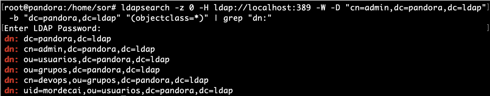

## Esquema LDAP

El **esquema** es una parte importante de LDAP. Similar a la definición del esquema de la base de datos, el esquema LDAP define la estructura y las reglas que debe seguir un directorio LDAP, como qué atributos tendrá una clase de objeto, qué estructura tienen estos atributos, tipos de datos etc. 

* El **servidor LDAP** proporciona una manera de **identificar categorías, atributos** y otra información en el directorio LDAP, para que el servidor LDAP pueda reconocerlos. **Para realizarlo se utilizan esquemas**, que no es más que una **unidad de empaquetado para contener clases de objetos y atributos muy similares**.

!!! tip "Recordatorio"
    - Las clase de objetos se pueden ver en [ObjectClass Cytrax](https://www.zytrax.com/books/ldap/ape/index.html#objectclasses)

* La metáfora que se puede realizar es que el **Esquema LDAP** es como una **base de datos relacional**.
* **La principal diferencia** con las bases de datos relacionales con protocolo LDAP es que estas ya están predefinidas en los esquemas. por lo que nos ahorramos en insertar y definir las tablas de información.
* En **OpenLDAP** los esquemas instalados se encuentran en cn = schema, cn = config y se pueden instalar esquemas adicionales usando este procedimiento.

El siguiente diagrama ilustra el uso de esquemas como unidades de empaquetado:

<figure>
  
  <figcaption>Ejemplo de la definición de Esquemas en LDAP</figcaption>
</figure>

A nivel de comandos se pueden ver los esquemas predefinidos con:

```yaml
cd /etc/ldap/slapd.d/cn\=config/
```

En el directorio `cn\=schema` se pueden ver los esquemas y ademas se pueden añadir más, pero no suele ser frecuente.

Para buscar los esquemas se puede utilizar:
```yaml
grep olcObjectClasses cn\=\{3\}inetorgperson.ldif|awk '{print $5}'
grep olcObjectClasses cn\=\{2\}inetorgperson.ldif|awk '{print $5}'
grep olcObjectClasses cn\=\{2\}nis.ldif|awk '{print $5}'
grep olcObjectClasses cn\=\{1\}cosine.ldif|awk '{print $5}'
grep olcObjectClasses cn\=\{0\}core.ldif|awk '{print $5}'
```

## Herramientas de gestión de usuarios.

Una vez configurado el servidor LDAP, para la utilización normal debemos aprender cómo se añaden nuevos usuarios o se modifican los atributos de los existentes.

* Para los objetos iniciales del directorio, primero se debe escribir un fichero en formato **LDIF** que incluya todos los atributos de la entrada y añadirla al directorio con slapadd. Como se realizó en el apartado  **4.4-Creación y comprobación de Usuarios**.

* Este método es totalmente inadecuado para la utilización cuando el directorio está activo. Existen varias formas de actualizar las entradas del directorio o añadir nuevas, y en primer lugar veremos la utilización de las herramientas incluidas en el paquete **ldap-utils**.

### ldap-utils
Para realizar modificaciones de los objetos del directorio directamente desde la línea de comandos, se pueden utilizar las herramientas del paquete `ldap-utils`, a continuación se describen algunas de ellas.

#### Mostrar entradas

-   `ldapsearch` - buscar y mostrar entradas

La herramienta `ldapsearch` resulta muy conveniente al momento de hacer consultas sobre los datos dentro de un directorio LDAP desde línea de comandos. 

* A continuación se presentan una serie de consultas de ejemplo que pueden resultar muy útiles para obtener información valiosa de un árbol LDAP.

#### Obtener todos los objetos de un directorio

Para obtener todos los objetos en un directorio (dn) a partir de cierta base con el ejemplo de la práctica (`dc=pandora,dc=ldap`) y sin límite de para la respuesta, utilizar una consulta como la siguiente:

``` yaml
ldapsearch -z 0 -H ldap://localhost:389 -W -D "cn=admin,dc=pandora,dc=ldap" -b "dc=pandora,dc=ldap" "(objectclass=*)"
```

!!! note
    * `-z 0`: evita cortar la respuesta una vez alcanzado cierto límite (cantidad de entradas).
    * `-H ldap://localhost:389`: indica que consulte al servidor LDAP en el puerto 389 del host local.
    * `-W`: indica que solicite la contraseña para el método de autenticación simple de manera interactiva.
    * `-D "cn=admin,dc=pandora,dc=ldap"`: especifica el usuario con el cual se autentica en el servidor LDAP.
    * `-b "dc=pandora,dc=ldap"`: especifica la base desde donde comenzar la búsqueda (en este caso se trata de la raíz del directorio).
    * `"(objectclass=*)"`: especifica el filtro para la búsqueda (en este ejemplo todos los objetos, este a su vez es el filtro por defecto).

!!! Warning
    El punto importante es no olvidar especificar la base (`-b`). De lo contrario probablemente no haya resultados en la búsqueda:


* A este ejemplo se le puede añadir `grep` para filtrar sólo los dn:

``` yaml
ldapsearch -z 0 -H ldap://localhost:389 -W -D "cn=admin,dc=pandora,dc=ldap" -b "dc=pandora,dc=ldap" "(objectclass=*)" | grep "dn:"
```

* El resultado sería parecido a:



#### Obtener todas las unidades organizacionales

Las [ou](https://technet.microsoft.com/en-us/library/cc978003.aspx) (*Organizational Unit*) definen la jerarquía dentro de un dominio. Generalmente se utilizan para definir los departamentos o áreas dentro de una organización (empresa, red, sociedad, etc.).

Para obtener una lista de todas las ou presentes en un directorio, se puede utilizar el filtro `"(ou=*)"`:

``` yaml
ldapsearch -z 0 -H ldap://localhost:389 -W -D "cn=admin,dc=pandora,dc=ldap" -b "dc=pandora,dc=ldap" "(ou=*)" | grep "dn:"
```

* Resultado


#### Listar todos los usuarios

Esta consulta depende de la jerarquía y la clase utilizada para almacenar usuarios dentro de un árbol LDAP. Sin embargo, generalmente se utiliza la clase [inetOrgPerson](https://tools.ietf.org/html/rfc2798) para almacenar usuarios dentro de un directorio LDAP, la cual posee el atributo `uid`.

De esta forma, para listar todos los usuarios presentes en un directorio, simplemente recurrir al filtro `"(uid=*)"`:

``` yaml
ldapsearch -z 0 -H ldap://localhost:389 -W -D "cn=admin,dc=pandora,dc=ldap" -b "dc=pandora,dc=ldap" "(uid=*)" | grep "dn:"
```

* Resultado


#### Determinar todas las clases en uso

!!! abstract "Recordatorio"
    - Las clases de un directorio LDAP determinan el formato con el que se representan los datos de los objetos almacenados en el árbol. Cada objeto (entrada en un directorio LDAP) pertenece al menos una clase. 
    - Sin embargo es común que cada objeto pertenezca a varias clases. Básicamente las clases definen qué atributos y de qué formato puede poseer un objeto.

Para listar todas las clases actualmente en uso por todos los objetos, es necesario volcar todo el contenido del árbol y filtrar con `grep`:

``` yaml
ldapsearch -z 0 -H ldap://localhost:389 -W -D "cn=admin,dc=pandora,dc=ldap" -b "dc=pandora,dc=ldap" "(objectclass=*)" | grep objectClass | sort | uniq
```

* Resultado


#### Manipular entradas

-   `ldapmodify` - modificar una entrada

-   `ldapadd` - agregar una nueva entrada

-   `ldapdelete` - eliminar y entrar

-   `ldapmodrdn` - cambiar el nombre de una entrada

-   `ldappasswd` : cambie la contraseña de una entrada


###### Ejemplos:

1. Añadir y eliminar nuevos grupos con `ldapadd` & `ldapdelete`

    1. Se crea un archivo .ldif para añadir un nuevo grupo y se añade con `ldapadd`:

    ``` yaml
    nano aso.ldif
    ```

    ``` yaml    
    dn: ou=aso,dc=pandora,dc=ldap
    objectClass: organizationalUnit
    objectClass: top
    ou: aso
    ```

    ``` yaml
    ldapadd -x -W -D "cn=admin,dc=pandora,dc=ldap" -f aso.ldif
    ```

    2. Para borrarlo se utilizaría: 

    ``` yaml
    ldapdelete -W -D "cn=admin,dc=pandora,dc=ldap" "ou=aso,dc=pandora,dc=ldap"
    ```

2. Añadir y eliminar usuarios con `ldapadd` & `ldapdelete`

    1. Se crea un archivo .ldif para añadir un nuevo usuario y se añade con `ldapadd`:

    ``` yaml
    nano javier.ldif
    ```

    ``` yaml    
    dn: uid=javier,ou=usuarios,dc=pandora,dc=ldap
    objectClass: inetOrgPerson
    objectClass: posixAccount
    objectClass: shadowAccount
    cn: Javier
    sn: Hernandez
    userPassword: {SSHA}latDDmodpsLUWDqwd/adk/j2tTDgz3NX
    loginshell: /bin/bash
    uidNumber: 10001
    gidNumber: 10001
    homeDirectory: /home/javier
    ```

    ``` yaml
    ldapadd -x -W -D "cn=admin,dc=pandora,dc=ldap" -f javier.ldif
    ```

    2. Para borrarlo se utilizaría: 

    ``` yaml
    ldapdelete -W -D "cn=admin,dc=pandora,dc=ldap" "uid=javier,ou=aso,dc=pandora,dc=ldap"
    ```

3. modificar `uidnumber` de usuario existente `ldapmodify`

    1. Se crea un archivo .ldif especificando las modificaciones:

    ``` yaml
    nano cambios1.ldif
    ```

    ``` yaml    
    dn: uid=javier,ou=aso,dc=pandora,dc=ldap
    changetype:modify
    replace:uidNumber
    uidNumber:10002
    ```

    2. Para modificarlo se utilizaría: 

    ``` yaml
    ldapmodify -x -W -D "cn=admin,dc=pandora,dc=ldap" -f cambios1.ldif
    ```

!!! Note
    * Cuatro tipos de cambios son posibles
        1. add--adds a new entry
        2. modify--changes an existing entry, that is, it adds, deletes, or replaces attributes of the entry
        3. delete--deletes an existing entry
    4. modrdn--modifies the RDN of an existing entry

4. Añadir y cambiar contraseña a un usuario existente con `ldappasswd`

    1. Añadir contraseña

    ``` yaml
    ldappasswd -s 1234 -W -D "cn=admin,dc=pandora,dc=ldap" -x "uid=javier,ou=aso,dc=pandora,dc=ldap"
    ```
    

#### Operaciones

-   `ldapwhoami` : muestra con qué entrada estoy vinculado al servidor

-   `ldapcompare` : compara un campo en la entrada con algún valor

## Configuración de OpenLDAP

### `slapd.conf `

Es el archivo principal de OpenLDAP y es aquí donde se configuran todos sus parámetros.

!!! note
    * `slapd.conf `se encuentra dentro del directorio `/etc/ldap/slapd.d`

#### Diseño de configuración 

La configuración de slapd se almacena **como un directorio LDAP especial con un esquema y DIT predefinidos**. 

* Hay clases de objetos específicas que se utilizan para llevar opciones de configuración global, definiciones de esquema, definiciones de base de datos y back-end, y otros elementos variados.

<figure>
  
  <figcaption>Árbol de configuración de muestra.</figcaption>
</figure>

* En el servidor se podría observar:

<figure>
  
  <figcaption>Árbol (DIT)de configuración En Ubuntu Server.</figcaption>
</figure>

El árbol de configuración de slapd-config tiene una estructura muy específica. La raíz del árbol se denomina cn = config y contiene ajustes de configuración global.


#### Directivas de configuración

De las directivas más comunes mostradas en el árbol se destaca dentro de `cn = config` la directiva `olcLogLevel`

* Esta directiva especifica el nivel en el que las declaraciones de depuración y las estadísticas de operación deben registrarse en el syslog (actualmente registrado en la función **syslogd (8) LOG_LOCAL4 )**. 
* Debe haber configurado OpenLDAP --enable-debug (el predeterminado) para que esto funcione (excepto para los dos niveles de estadísticas, que siempre están habilitados).

##### Configuración logging

El registro de actividad para slapd es muy útil cuando se implementa una solución basada en OpenLDAP, pero debe habilitarse manualmente después de la instalación del software. De lo contrario, solo aparecerán mensajes rudimentarios en los registros. El registro, como cualquier otra configuración similar, se habilita a través de la base de datos **slapd-config** .

* OpenLDAP viene con múltiples niveles de registro.
* Un buen nivel para probar son las *estadísticas* y se pueden configurar en La página de manual oficial en ubuntu de [slapd-config](https://manpages.ubuntu.com/manpages/focal/en/man5/slapd-config.5.html?_ga=2.248400327.1524111619.1636497214-637147953.1635270894).

<!-- - Los pasos a realizar serían:

1. Cree el archivo `logging.ldif` con el siguiente contenido:

``` yaml
dn: cn=config
changetype: modify
replace: olcLogLevel
olcLogLevel: stats
```

2. Se implementa el cambio:

``` yaml
sudo ldapmodify -Q -Y EXTERNAL -H ldapi:/// -f logging.ldif
```

Esto producirá una cantidad significativa de registro y querrá volver a un nivel menos detallado una vez que su sistema esté en producción. Mientras está en este modo detallado, el motor syslog de su host (rsyslog) puede tener dificultades para mantenerse al día y puede dejar caer mensajes:

!!! Warning
    **rsyslogd-2177: imuxsock lost 228 messages from pid 2547 due to rate-limiting**

Puede considerarse un cambio en la configuración de para evitar estos problemas `rsyslog`. En `/etc/rsyslog.conf`, ponga:

``` yaml
# Disable rate limiting
# (default is 200 messages in 5 seconds; below we make the 5 become 0)
$SystemLogRateLimitInterval 0
```

3. Y luego reinicie el demonio rsyslog:

``` yaml
sudo systemctl restart syslog.service
```

4. Los Registros de OpenLDAP a través de syslogd **LOCAL4** (Nivel warning de Syslog). Para transmitir el registro LDAP a un archivo separado de syslog, agregue una línea como esta a **syslog.conf** ( `/etc/rsyslog.conf`):

```yaml
# a. agregar a syslog.conf
local4. * /var/log/ldap.log

# b. crear un archivo de registro vacío
toque /var/log/ldap.log

# c. reiniciar syslogd
killall -HUP syslogd
O
systemctl restart syslog.service
```

[Más información sobre looging OpenLdap](http://www.zytrax.com/books/ldap/ch6/#logfile) -->

## Actividades

201. En este ejercicio se deben utilizar los **comandos de OpenLdap** instalados en el paquete `LDAPutils`.
    1. Añade un nuevo grupo y dentro de el un nuevo usuario a la estructura de directorio creada en la práctica superior.
    2. Crea una contraseña para el usuario.
    3. Modifica el uid creado de inicio.
    4. Crea un segundo usuario, dentro de **usuarios**
    5. Elimina el segundo usuario creado.

En cada sub-apartado comprueba que se han introducido correctamente las modificaciones en el **DIT**.