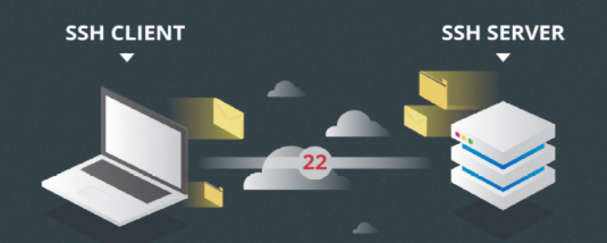

# Instalación, configuración y uso de servicios de acceso y administración remota

??? abstract "Duración y criterios de evaluación"

    **Duración estimada: 5 sesiones (12h por sesión)**

    

    Resultado de aprendizaje y Criterios de evaluación:

    1. Administra de forma remota el sistema operativo en red valorando su importancia y aplicando criterios de seguridad.
        1. Se han descrito métodos de acceso y administración remota de sistemas.
        2. Se ha diferenciado entre los servicios orientados a sesión y los no orientados a sesión.
        3. Se han utilizado herramientas de administración remota suministradas por el propio sistema operativo.
        4. Se han instalado servicios de acceso y administración remota.
        5. Se han utilizado comandos y herramientas gráficas para gestionar los servicios de acceso y administración remota.
        6. Se han creado cuentas de usuario para el acceso remoto.
        7. Se han realizado pruebas de acceso y administración remota entre sistemas heterogéneos.
        8. Se han utilizado mecanismos de encriptación de la información transferida.
        9. Se han documentado los procesos y servicios del sistema administrados de forma remota.

## Introducción

En la mayoría de los casos, los servidores y máquinas que necesitamos gestionar no comparten el mismo espacio físico. Como por ejmeplo servidores que estén ubicados en:

- Diferentes departamentos de una empresa
- Centros de proceso de Datos (CPD) generales
- Computación en la nube

Para poder acceder a ellos existen servicios, métodos y herramientas, que se detallan a continuación.

## Terminales en modo texto

Una de las formas de administrar de forma remota es instalar un servidor que permita el acceso en forma de terminal de texto. Estos programas permiten acceder al equipo vía red utilizando un nombre de usuario y contraseña como si estuviésemos accediendo de forma local al mismo. Entre los diferentes servicios de este tipo destacan:

- **Telnet:** basado en el protocolo del mismo nombre. Este protocolo utiliza por defecto el puerto 23. **El problema de este es que la información viaja por la red sin cifrar**, con la correspondiente falta de seguridad.

- **Rlogin (Remote Login):** es una aplicación TCP/IP que comienza una sesión de terminal remoto sobre el anfitrión especificado como host. El anfitrión remoto debe hacer funcionar un servicio de Rlogind (o demonio) para que el Rlogin conecte con el anfitrión. Utiliza un mecanismo estándar de autorización de los Rhosts.

- **SSH (Secure Shell):** Este protocolo permite poder acceder a otro ordenador a través de una red para ejecutar comandos en esa máquina, controlarla de manera remota e intercambiar archivos entre ambas. Ofrece una autenticación muy potente y comunicaciones seguras en canales no protegidos.

A continuación se entra más en detalle en este último.

### SSH

#### Características principales:

- Utiliza el **puerto 22** TCP para el establecimiento de las conexiones.
- Una vez establecida la conexión podremos ejecutar las órdenes como si se tratara de una terminal local.
- Está implementado para la mayoría de sistemas operativos existentes; Windows, linux, OSX,...
- Proporciona mecanismo para asegurar la **autenticación, integridad y confidencialidad de la información**.
    - **Autenticación:** Después de la primera conexión, el cliente puede conocer que se está conectando al mismo servidor en futuras sesiones: conexiones de confianza.
    - **Confidencialidad**: Todos los datos que se envían y se reciben durante la conexión son cifrados.
    - **Integridad:** Proporciona mecanismos para asegurar que la información enviada no es manipulada por un tercero

Además destaca por:

- Permitir copiar datos de forma segura (tanto archivos sueltos como simular sesiones FTP cifradas), 
- Gestionar claves **RSA** para no escribir contraseñas al conectar a los dispositivos y 
- Pasar los datos de cualquier otra aplicación por un canal seguro tunelizado  
- También puede redirigir el tráfico del (Sistema de Ventanas X) para poder ejecutar programas gráficos remotamente.
- Basado en arquitectura **cliente-servidor**

<figure>
  
  <figcaption>SSH Cliente-Servidor</figcaption>
</figure>

#### Funcionamiento

Se basa en la **Cartografía** (Técnica utilizada para convertir un texto claro en otro cuyo contenido es igual al anterior pero solo puede ser decodificado por personas autorizadas.) SSH utiliza varios algoritmos de encriptación y autenticación.

- Para establecer la conexión con la máquina remota  utiliza algoritmos de **encriptación asimétrica**.
- Para la transferencia de datos utiliza algoritmos de **encriptación simétrica**, que son más rápidos.

1. **Encriptación simétrica**

Los algoritmos de criptografía simétrica son los que utilizan la misma clave tanto para el proceso de cifrado como para el descifrado del mensaje. Los más utilizados: **DES, 3DES, AES, IDEA y Blowfish**

<figure>
  
  <figcaption>Esquema Encriptación Simétrica</figcaption>
</figure>

!!! note "Nota"
    **Problema: Intercambio de claves.**

2. **Encriptación Asimétrica**

Utiliza dos claves matemáticamente relacionadas de manera que lo que ciframos con una (**clave pública**) sólo puede descifrarse con la segunda (**clave privada**).

- Algunos algoritmos representativos son: **RSA**, y **DSA**

<figure>
  
  <figcaption>Esquema Encriptación Asimétrica</figcaption>
</figure>

#### Establecimiento de conexión

1. El cliente abre una conexión **TCP** en el **puerto 22** del servidor.
2. Cliente y servidor negocian qué **versión SSH** van a utilizar y determinan el algoritmo de **criptografía simétrica** a utilizar.
3. El **servidor envía** su **clave pública** al cliente:
    - Si es la primera vez la guardará para futuras conexiones.
    - En caso contrario la compara con la que ya tenía guardadas para la IP de conexión (Autenticación del servidor) 
4. El cliente **genera una clave de sesión aleatoria mediante el algoritmo seleccionado** en el primer paso y la **envía al servidor cifrando con la clave pública** del mismo.
5. El resto de comunicaciones se hará utilizando esta clave compartida y será indescifrable.
6. A partir de aquí se llevará a cabo la **autenticación del usuario** y la transmisión de información/órdenes a ejecutar en la máquina remota

<figure>
  
  <figcaption>Esquema del establecimiento de conexión</figcaption>
</figure>

#### Autentificación del cliente

Puede llevarse a cabo de **2 formas**: 

1. **Usuario y contraseña**: Aunque las credenciales van cifradas, es menos seguro ya que es más propenso a ataques de fuerza bruta.

!!! tip "CONSEJO"
    Tendremos que utilizar sistemas de detección de intrusos como **fail2ban**.

2. **Clave pública/privada**: 

    - Cuando el cliente se conecta al servidor, le informa de **la clave pública que va a utilizar**.
    - Si el servidor la tiene en **su almacén de claves autorizadas (authorized_keys)**, enviará un mensaje aleatorio cifrado con la clave pública que, si el cliente es capaz de descifrar, quedará autenticado.
    - El **cliente decodificará el mensaje** con la clave privada y lo enviará al servidor decodificado.

<figure>
  
  <figcaption>Esquema Autentificación Clave pública/privada</figcaption>
</figure>

#### Tunelización

El SSH Tunneling es una técnica que nos permitirá navegar por la web de forma segura, estableciendo un túnel SSH contra un servidor SSH remoto

- Hace uso del **Port-forwarding**: toma los datos que el cliente envía en un extremo del túnel y los reenvía por el canal seguro. 
- El **Port-Forwarding** es un mecanismo de SSH para tunelizar puertos desde una maquina cliente a un servidor o de forma inversa.
- En el otro extremo donde se recogen los datos y se envían al servicio de destino.

<figure>
  
  <figcaption>Esquema SSH-Tunnel</figcaption>
</figure>

!!! example "Ejemplos"
    - `ssh -L local-puerto: remote-hostname: remote-puerto username @ hostname`

#### Clientes SSH

Podemos classificarlos en: clientes gráficos y de consola.

1. Gráficos

- Putty &#8594 El más utilizado
- Kitty

<figure>
  
  <figcaption>Ejemplo Putty</figcaption>
</figure>

2. **Terminal/Consola**

- CMDer
- Los sistemas operativos **LIKE-UNIX** disponen de un cliente ssh en modo consola pre-instalado

<figure>
  
  <figcaption>Ejemplo ssh preinstalado</figcaption>
</figure>

!!! example "Ejemplos comandos de uso cliente consola"
    - Conexión a una máquina remota: `ssh usuario@ejemplo.servidor.es`
    - Ejecutar una orden sin conectarse: `ssh ejemplo.servidor.es comando`  `ssh serdis.dis.ulpgc.es ls ./`

#### OpenSHH

**OpenSSH** es un conjunto de aplicaciones que permiten realizar comunicaciones cifradas a través de una red, usando el protocolo SSH. 

- Fue creado como una alternativa libre y abierta al programa Secure Shell, que es software propietario. 
- Se trata de un proyecto de **código abierto y licencia libre** para su utilización para cualquier propósito.
- Es compatible con los protocolos **SSH1 (**No seguro) y **SSH2**.
- Está disponible para plataformas **Gnu/linux** y **Windows**, así como **Unix**, **Mac**, **Solaris** o **AIX**

<figure>
  
  <figcaption>Logo OpenSSH</figcaption>
</figure>

#### Funcionalidades adicionales

- Permite la copia de archivos de la máquina local a la máquina remota o a la inversa mediante securecopy (SCP).

!!! example "Ejemplos"
    - Transferir un archivo local a un sistema remoto: `scp archivo_local usuario@servidor: / archivo_remoto`
    - Transferir un archivo remoto a un sistema local: `scp usuario@servidor:/archivo_remoto /archivo_loal`  
    - Especificar múltiples archivos: `scp/dir_local/* usuario@servidor:/dir_remoto/`

- Incluye soporte completo para S**FTP (SSHftp)**: Sin embargo, se trata de un protocolo totalmente diferente a FTP, y está disponible a partir de la versión 2.5.

!!! example "Ejemplos"
    - `sftp usuario1@servidor.dominio.es`
    - A continuación se ejecutarían comandos como: **put, get, rm, ls, lpwd, ...**

## Escritorio remoto

Se habla de escritorio remoto cuando un usuario se conecta a un equipo desde otro utilizando la red y además se conecta al entorno gráfico de este. Se suele utilizar para realizar administración remota del equipo. 

La mayoría de los sistemas operativos tienen incorporada alguna utilidad para la conexión en entorno gráfico de forma remota. En algunos casos,el usuario desde el equipo local controla el equipo remoto y el usuario de este puede ver lo que se está haciendo en él.

Para esto se utilizan diferentes protocolos. Para cualquiera de ellos tendremos dos partes:

- La parte del servidor que se instalará en el equipo a controlar remotamente.
- La parte cliente, que se instala en el equipo local desde el que se quiere acceder al equipo remoto.

Los protocolos que pueden usarse son:

- **RDP**: protocolo de acceso a escritorio remoto (Remote Desktop Protocol). Se utiliza principalmente en Windows, aunque puede instalarse en Linux si la máquina que tiene este sistema operativo debe ser accedido por medio de escritorio remoto desde un equipo Windows.
- **VNC**: (Virtual Network Computer): Se utiliza en distintas plataformas para proveer de un escritorio remoto a cualquier equipo.

## Actividades de desarrollo UD5_01

501. [Práctica Configuración Servidor SSH](Practica11_configuración_servidor_openssh.md)
