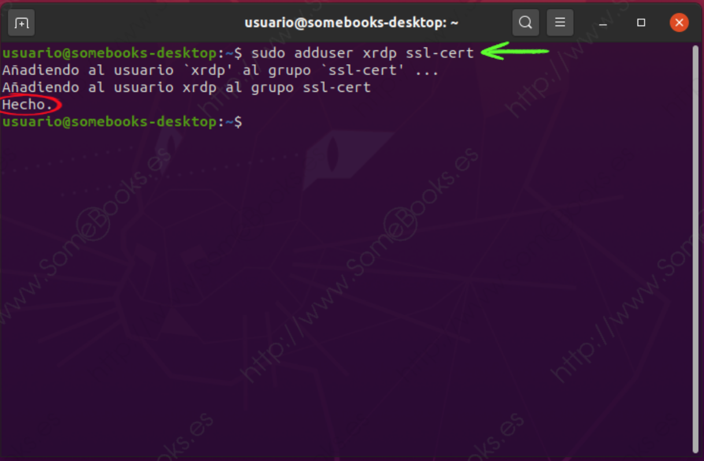
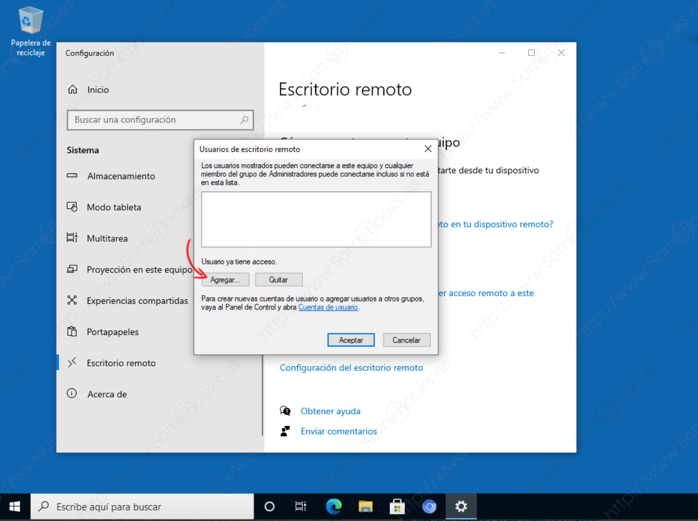

# Escritorio remoto

Se habla de escritorio remoto cuando un usuario se conecta a un equipo desde otro utilizando la red y además se conecta al entorno gráfico de este. Se suele utilizar para realizar administración remota del equipo. 

La mayoría de los sistemas operativos tienen incorporada alguna utilidad para la conexión en entorno gráfico de forma remota. En algunos casos,el usuario desde el equipo local controla el equipo remoto y el usuario de este puede ver lo que se está haciendo en él.

Para esto se utilizan diferentes protocolos. Para cualquiera de ellos tendremos dos partes:

- La parte del servidor que se instalará en el equipo a controlar remotamente.
- La parte cliente, que se instala en el equipo local desde el que se quiere acceder al equipo remoto.

Los protocolos que pueden usarse son:

- **RDP**: protocolo de acceso a escritorio remoto (Remote Desktop Protocol). Se utiliza principalmente en Windows, aunque puede instalarse en Linux si la máquina que tiene este sistema operativo debe ser accedido por medio de escritorio remoto desde un equipo Windows.
- **VNC**: (Virtual Network Computer): Se utiliza en distintas plataformas para proveer de un escritorio remoto a cualquier equipo.

## Escritorio remoto en Ubuntu 20.04 con xRDP

**xRDP** es una implementación gratuita y de código abierto del servidor Microsoft RDP que permite que los sistemas operativos distintos de Microsoft Windows proporcionen una experiencia de escritorio remoto totalmente funcional y compatible con RDP.

- Para instalar xRDP utilizaremos:

``` yaml
sudo apt install xrdp -y
```

!!! note "**NOTA:**"
    Se añade el argumento `-y` para contestar automáticamente de manera afirmativa a cualquier pregunta que se nos haga durante la instalación.

- Automáticamente se habra iniciado el servicio, para comprobarlo se puede ejecutar el siguiente comando:

``` yaml
sudo systemctl status xrdp
```

<figure>
  
  <figcaption>xRDP en ejecución</figcaption>
</figure>

- Cuando se instala xrdp, se crea también en el sistema una nueva cuenta de usuario llamada, precisamente, `xrdp`. Ademas, se crea un certificado SSL, en el archivo `ssl-cert-snakeoil.key`, dentro de la carpeta `/etc/ssl/private/`.

A continuación, se debe añadir el usuario `xrdp` al grupo `ssl-cert` para lograr que el usuario pueda leer el certificado. Lo haremos con la siguiente orden:

``` yaml
 sudo adduser xrdp ssl-cert
```

<figure>
  
  <figcaption>usuario xrdp al grupo ssl-cert</figcaption>
</figure>

- Un problema frecuente ocurre al usar el escritorio remoto desde otro equipo que no sea Ubuntu es encontrar la pantalla en negro.

Para resolverlo, basta con editar el archivo `/etc/xrdp/startwm.sh` y eliminar el valor de las variables `DBUS_SESSION_BUS_ADDRESS` y `XDG_RUNTIME_DIR`, como se muestra a continuación:

<figure>
  
  <figcaption>edición /etc/xrdp/startwm.sh I</figcaption>
</figure>

- Hacia el final del archivo se editan las variables comentadas:

<figure>
  
  <figcaption>edición /etc/xrdp/startwm.sh II</figcaption>
</figure>

``` yaml
unset DBUS_SESSION_BUS_ADDRESS
unset XDG_RUNTIME_DIR
```
<figure>
  
  <figcaption>edición /etc/xrdp/startwm.sh III</figcaption>
</figure>

## Escritorio remoto en Windows 10

Para configurar el Escritorio Remoto se deben realizar los siguientes pasos:

1. `Inicio` &#8594 `Sistema`

<figure>
  
  <figcaption>Configuración Escritorio Remoto Windows 10 I</figcaption>
</figure>

!!! note "**NOTA:**"
    Se debe tener en cuenta que el escritorio remoto no está disponible en la versión Home de Windows 10, por lo que se necesita, como mínimo, una versión Pro.

2. Al hacerlo, se obtiene la ventana Configuración, donde podremos realizar diferentes ajustes sobre el comportamiento del equipo, donde se debe elegir la opción *Escritorio remoto* en el panel izquierdo de la ventana.

<figure>
  
  <figcaption>Configuración Escritorio Remoto Windows 10 II</figcaption>
</figure>

!!! note "**NOTA:**"
    al clickarlo aparece en el panel derecho de la ventana la información de que, con esta función, podremos acceder al escritorio de este equipo desde otro dispositivo, independientemente del sistema operativo que utilice.

4. Como se trata de una situación potencialmente peligrosa, el sistema avisa de lo que estamos permitiendo, se debe confirmar la configuración.

<figure>
  
  <figcaption>Configuración Escritorio Remoto Windows 10 III</figcaption>
</figure>

### Añadir los usuarios autorizados

Una vez completado el paso anterior, más abajo existe la posibilidad de elegir, entre los usuarios definidos en el sistema, aquellos que podrán hacer uso del escritorio remoto.

- Bastará con hacer clic en el enlace y Seleccionar los usuarios que pueden tener acceso remoto a este equipo.

<figure>
  
  <figcaption>Configuración Escritorio Remoto Windows 10 IV</figcaption>
</figure>

- Esto abrirá una nueva ventana con los usuarios que están habilitados en ese momento (como se acaba de activar, aún no hay ninguno). Aquí se puede añadir o quitar usuarios de la lista.

<figure>
  
  <figcaption>Configuración Escritorio Remoto Windows 10 V</figcaption>
</figure>

- De esta forma se obtiene una nueva ventana que nos permitirá elegir el usuario o usuarios que necesitemos.

<figure>
  
  <figcaption>Configuración Escritorio Remoto Windows 10 VI</figcaption>
</figure>

- Como el sistema tiene varios objetos que contienen el texto que se ha escrito, aparece una nueva ventana para elegir el que nos interese. Si solo hubiese existido un objeto, se saltaría este paso.

<figure>
  
  <figcaption>Configuración Escritorio Remoto Windows 10 VII</figcaption>
</figure>

- Así se vuelve a la ventana anterior, pero ahora vemos que se ha reconocido correctamente el usuario (se muestra el nombre NetBIOS completo de la cuenta, incluyendo el nombre del equipo).

<figure>
  
  <figcaption>Configuración Escritorio Remoto Windows 10 VIII</figcaption>
</figure>

- Esto cerrará la ventana Seleccionar usuarios, devolviéndo al paso anterior, pero ahora se observa que la cuenta de usuario ya aparece en la lista.

Como es lógico, se puede repetir el proceso tantas veces como necesitemos.

<figure>
  
  <figcaption>Configuración Escritorio Remoto Windows 10 IX</figcaption>
</figure>

## RemoteApp

**RemoteApp** permite que los programas a los que se obtiene acceso de forma remota mediante S**ervicios de Escritorio remoto**  aparezcan  **como  si  se  ejecutaran  en  el  equipo  local  del  usuario  final**.  Estos  programas  se  conocen  como `Programas RemoteApp`. Características:

- En lugar de presentarse al usuario en el escritorio del servidor de Host de sesión de Escritorio remoto, el Programa **RemoteApp** se integra en el escritorio del cliente.
- El Programa **RemoteApp** se ejecuta en su propia ventana ajustable, se puede arrastrar de un monitor a otro y dispone de una entrada propia en la barra de tareas.
- Si un usuario  ejecuta  más  de  un  Programa  **RemoteApp**  en  el  mismo  servidor  de  Host  de  sesión  de  Escritorio  remoto,  el programa **RemoteApp** compartirá la misma sesión de Servicios de Escritorio remoto.

**RemoteApp** puede reducir la complejidad y la carga administrativa en muchas situaciones, incluidas las siguientes:

1. Sucursales donde puede haber un soporte local de IT limitado y un ancho de banda de red limitado. 
1. Situaciones en las que los usuarios necesitan obtener acceso a programas de forma remota. 
1. Implementación de programas de línea de negocios (LOB), especialmente programas LOB personalizados. 
1. Entornos como los espacios de trabajo "hot desk" o "hoteling", en los que los usuarios no tienen equipos asignados. 
1. Implementación de múltiples versiones de un programa, especialmente si la instalación de varias versiones localmente puede ocasionar conflictos. 

## Actividades de desarrollo UD5_02

502. Instala y configura xRDP en ubuntu 20.04, comprueba que puedes acceder por escritorio remoto al Ubuntu desde Windows 10, haz una guía de configuración para poder de los pasos para poder acceder y captura que demuestre que se ha accedido.

503. Instala y configura RDP en Windows 10, comprueba que puedes acceder por escritorio remoto del mismo desde Ubuntu, haz una guía de configuración para poder de los pasos para poder acceder y captura que demuestre que se ha accedido.

## Actividades de desarrollo UD5_03

504. [Instalación de Servidor de Aplicaciones RemoteApp](./Practicas/Practica12_RemoteAppTS.md)