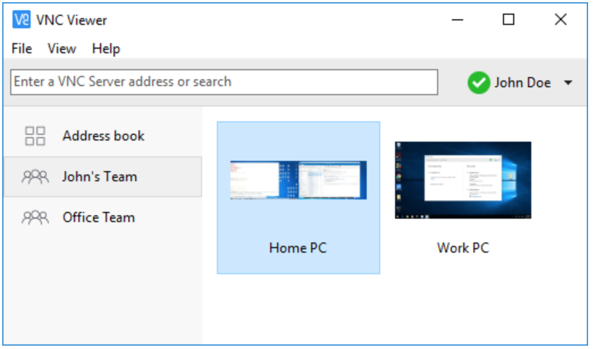
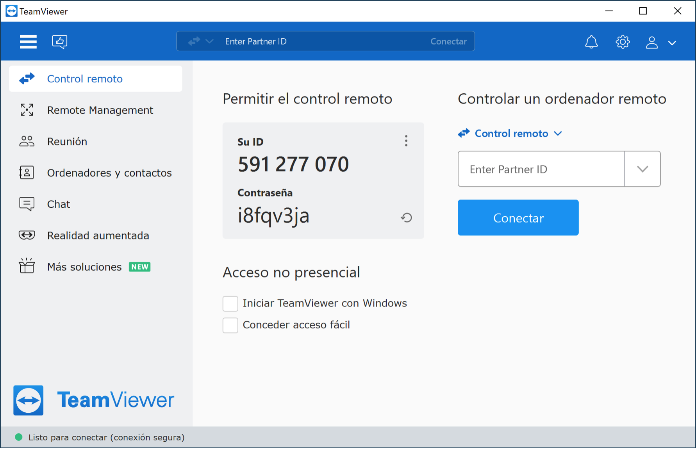
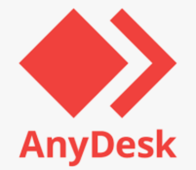
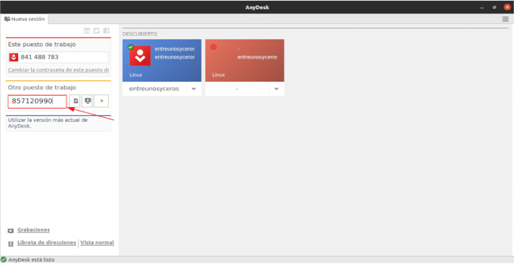
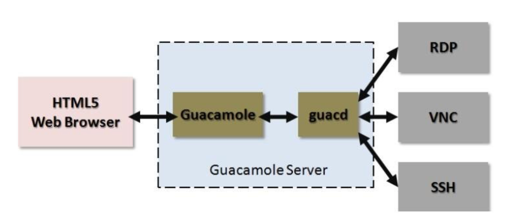

# Herramientas gráficas externas para la administración remota.

## RealVNC

<figure style="float: right;">
    
</figure>

Uno de los productos que está diseñado para todas las plataformas más importantes es Real VNC.

- **VNC**: Virtual Network Computing (Computación Virtual en Red). 
- **VNC es un programa de software libre** basado en una estructura cliente-servidor que permite observar las acciones del ordenador servidor remotamente a través de un ordenador cliente.
- Como su nombre indica, se basa en este protocolo.
- Podemos encontrar más aplicaciones que utilicen **VNC** para control remoto, pero esta es una de las más utilizada. 
- Hay desde una versión gratuita hasta una de empresa. Esta última incorpora más seguridad, y más utilidades, como por ejemplo, la transferencia de archivos.
 
<figure>
  
  <figcaption>RealVNC viewer</figcaption>
</figure>

!!! tip "**DESCARGA**"
    [Descarga RealVNC](https://www.realvnc.com/es/connect/download/vnc/)

!!! tip "**RealVNC en Linux**"
    [Guía RealVNC en Linux](https://help.realvnc.com/hc/en-us/articles/360003474572-How-do-I-get-started-with-VNC-Connect-on-Linux-#setting-up-your-account-0-0)

## TeamViewer

**TeamViewer** es un software para el acceso remoto, así como para el control y el soporte en remoto de ordenadores y otros dispositivos finales.

- La plataforma fue lanzada al público en **2005**
- Su catálogo de servicios se ha ido ampliando de forma continúa.
- La última innovación ha sido la integración de **TeamViewer** Meeting.
- **TeamViewer** no exige registrarse y es gratuito si se utiliza con fines no comerciales, lo cual ha ayudado a una mayor difusión del software.
- **TeamViewer** es el producto principal de la empresa homónima con sede en **Göppingen, Alemania**.

<figure>
  
  <figcaption>TeamViewer APP</figcaption>
</figure>

!!! tip "**DESCARGA**"
    [Descarga **TeamViewer**](https://www.teamviewer.com/es/descarga/linux/)

!!! tip "**TeamViewer en Linux**"
    [Guía instalación TeamViewer en Linux](https://community.teamviewer.com/English/kb/articles/45-install-teamviewer-on-ubuntu)

## AnyDesk

<figure style="float: right;">
    
</figure>

**AnyDesk** es un programa de software de escritorio remoto desarrollado por **AnyDesk Software GmbH en Stuttgart**, Alemania.

- Provee acceso remoto bidireccional entre computadoras personales y está disponible para todos los sistemas operativos comunes.
- El software ha estado en desarrollo activo desde 2012.
- Esta herramienta permite el acceso remoto bidireccional de los usuarios a través de  sus computadores.
- **AnyDesk** es un software multiplataforma, es decir, puede manejarse desde diferentes sistemas: Windows, Linux, OS X, Android entre otros.

<figure>
  
  <figcaption>Ejemplo Anydesk APP</figcaption>
</figure>

!!! tip "**DESCARGA**"
    [Descarga **AnyDesk**](https://anydesk.com/es/downloads/linux)

!!! tip "**TeamViewer en Linux**"
    [Guía instalación AnyDesk en Linux](https://ubunlog.com/anydesk-escritorio-remoto-ubuntu-20-04/?utm_source=feedburner&utm_medium=%24%7Bfeed%2C+email%7D&utm_campaign=Feed%3A+%24%7BUbunlog%7D+%28%24%7BUbunlog%7D%29)

## Apache Guacamole

<figure style="float: right;">
    
</figure>

**Apache Guacamole** es una puerta de enlace de escritorio remoto multiplataforma de código abierto y gratuita mantenida por **Apache Software Foundation**. 

- Permite a un usuario tomar el control de una computadora remota o máquina virtual a través de un navegador web.
- Apache Guacamole es una puerta de enlace de escritorio remoto **sin cliente** . Lo llamamos sin cliente porque no se requieren complementos ni aplicación cliente.
- Admite protocolos estándar como VNC, RDP y SSH.
- Gracias a HTML5, una vez que Guacamole está instalado en un servidor, todo lo que necesita para acceder a sus escritorios es un navegador web.

<figure>
  
  <figcaption>Arquitectura Apache Guacamole</figcaption>
</figure>   

!!! note "**MUY INTERESANTE PARA PROYECTO FINAL**"
    Se puede plantear el despliegue de esta tecnologia usando docker, ldap, proxy inverso, ...

!!! tip "**DESCARGA**"
    [Descarga **Apache Guacamole**](https://guacamole.apache.org/releases/)

!!! tip "**Guia Apache Guacamole**"
    [Manuales y guia de despliegues con **Apache Guacamole**](https://guacamole.apache.org/doc/gug/)

