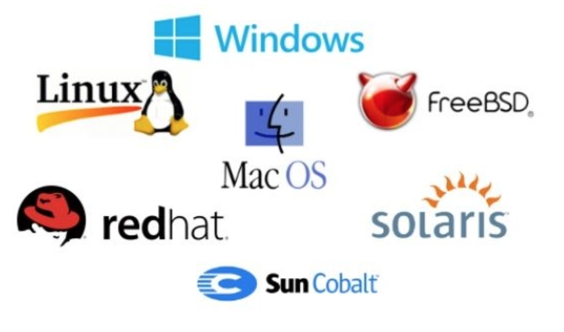
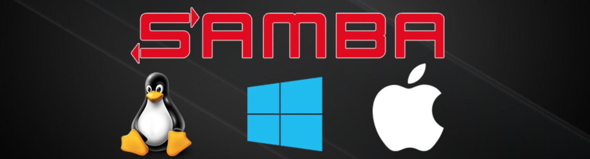
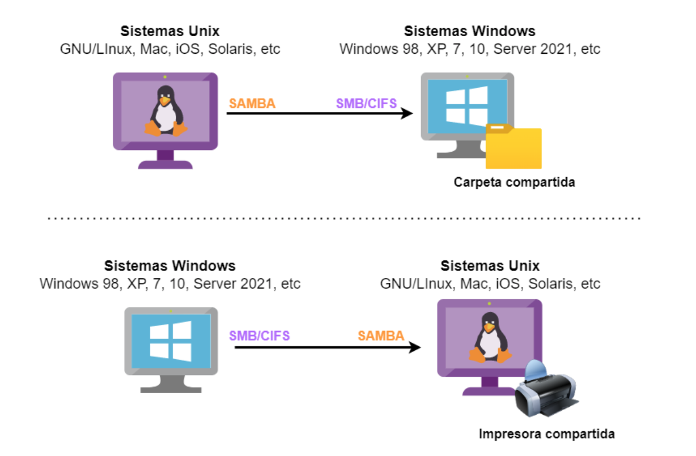
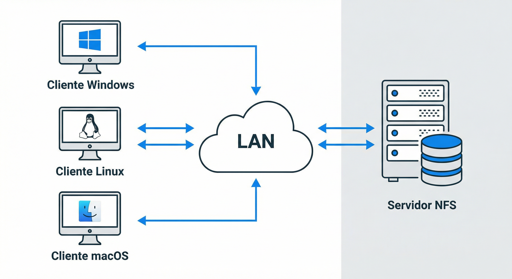

# Integración de Sistemas Operativos

La **integración de sistemas operativos** permite que equipos con diferentes sistemas (Windows, GNU/Linux, macOS) compartan recursos en red —archivos, carpetas e impresoras— mediante protocolos y servicios estándar.

## Propuesta didáctica

En esta unidad vamos a trabajar el **RA6 de ASO**:

> **RA6.** *Integra sistemas operativos libres y propietarios, justificando y garantizando su interoperabilidad.*

### Criterios de evaluación (RA6)

- **CE6a**: Se ha identificado la necesidad de compartir recursos en red entre diferentes sistemas operativos.
- **CE6b**: Se han establecido niveles de seguridad para controlar el acceso del cliente a los recursos compartidos en red.
- **CE6c**: Se ha comprobado la conectividad de la red en un escenario heterogéneo.
- **CE6d**: Se ha descrito la funcionalidad de los servicios que permiten compartir recursos en red.
- **CE6e**: Se han instalado y configurado servicios para compartir recursos en red.
- **CE6f**: Se ha comprobado el funcionamiento de los servicios instalados.
- **CE6g**: Se ha trabajado en grupo para acceder a sistemas de archivos e impresoras en red desde equipos con diferentes sistemas operativos.
- **CE6h**: Se ha documentado la configuración de los servicios instalados.

## Contenidos

**Bloque 1 — Escenarios heterogéneos y protocolos (Sesión 1)**

- Escenarios heterogéneos: definición y necesidad.
- Protocolos SMB/CIFS y NFS.
- Servicios Samba y NFS: características y diferencias.
- Tabla resumen de protocolos y servicios.

**Bloque 2 — NFS (Sesión 2)**

- Network File System: características y versiones.
- Arquitectura cliente-servidor y VFS.
- Ventajas y desventajas de NFS.
- Instalación y configuración en servidor y cliente.

**Bloque 3 — Samba y Docker Compose (Sesión 3–4)**

- Samba: implementación libre de SMB para UNIX/Linux.
- Samba Domain Controller (Samba DC): introducción.
- Docker Compose: definición de servicios multi-contenedor.
- Samba en contenedor con Docker Compose.

!!! question "Actividades iniciales"
    1. ¿Qué es un escenario heterogéneo y por qué es necesario compartir recursos entre sistemas?
    2. ¿Qué diferencia existe entre SMB/CIFS y NFS?
    3. ¿Qué es Samba y para qué se utiliza?
    4. ¿Qué ventajas ofrece NFS frente a compartir archivos por otros medios?
    5. ¿Qué es Docker Compose y cómo facilita el despliegue de servicios?

### Programación de Aula (4 sesiones)

| Sesión | Contenidos | Actividades | Criterios |
| --- | --- | --- | --- |
| 1 | **Teoría:** Escenarios heterogéneos. Protocolos SMB/CIFS y NFS. Servicios Samba y NFS. | Explicación teórica | CE6a, CE6d |
| 2 | **Práctica:** Instalación y configuración de NFS en servidor y cliente. | [PR601](#pr601) | CE6e, CE6f, CE6h |
| 3 | **Práctica:** Samba con Docker Compose. Acceso desde Windows y Linux. | [PR602](#pr602) | CE6b, CE6e, CE6f, CE6g |
| 4 | **Reto:** Samba y NFS en AWS con clientes de verificación. | [RG606](#reto_integra) | CE6c, CE6g, CE6h |

---

## Introducción: Escenarios heterogéneos

Un **escenario heterogéneo** es aquel en el que conviven en una red equipos con distintas arquitecturas y sistemas operativos (Windows, GNU/Linux, macOS). El intercambio de datos solo es posible **si ambos extremos de la comunicación entienden el mismo protocolo**.

<figure>
  
  <figcaption> Diferentes Logotipos de sistemas Linux, Windows y macOS</figcaption>
</figure>

### Protocolos para redes heterogéneas

Cuando hablamos de compartir archivos y carpetas en red, nos referimos fundamentalmente al uso de **sistemas de archivos en red**. Un sistema de archivos es un conjunto de normas y procedimientos para almacenar y organizar la información en los dispositivos de almacenamiento, utilizando para ello protocolos y servicios especializados.

Los protocolos más utilizados para compartir recursos entre sistemas diferentes son:

- **SMB/CIFS** (Server Message Block / Common Internet File System): Permite compartir archivos, impresoras y otros dispositivos entre equipos Windows, GNU/Linux y macOS. Desarrollado originalmente por IBM; Microsoft lo adoptó y amplió (CIFS desde 1998).
- **NFS** (Network File System): Protocolo de nivel de aplicación desarrollado por **Sun Microsystems en 1985**. Utilizado para sistemas de archivos distribuidos en redes de área local. Compatible con UNIX, GNU/Linux y macOS; Windows tiene soporte nativo desde versiones recientes.

!!! note "**Efemerides**"
    El protocolo **SMB** cambió de nombre en 1998 y pasó a llamarse **Common Internet File System (CIFS)**. A día de hoy, este protocolo es el que todavía se utiliza en los sistemas Windows para compartir archivos.

### Sistemas de archivos compartidos en red

La siguiente tabla resume los principales sistemas y protocolos que permiten compartir archivos y recursos en red. Cada uno de ellos está diseñado para facilitar la interoperabilidad entre diferentes sistemas operativos, haciendo posible el trabajo en entornos donde conviven equipos con plataformas diversas como Linux, Windows o macOS.

| Sistema | Descripción |
|---------|-------------|
| **NFS** | Sistema de archivos de red distribuido. Incluido por defecto en UNIX y la mayoría de distribuciones Linux. |
| **SMB** | Protocolo que permite compartir archivos, impresoras y dispositivos entre equipos Microsoft Windows. |
| **CIFS** | Versión ampliada de SMB por Microsoft. Es el protocolo actual en Windows para compartir recursos. |
| **Samba** | Implementación libre de SMB con extensiones de Microsoft. Funciona en GNU/Linux y UNIX. |
| **AFP** | Protocolo de Apple para servicios de archivos en macOS. |

!!! note "Otros protocolos"
    **Apple Filing Protocol (AFP)** forma parte de Apple File Service y ofrece servicios de archivos compartidos para macOS en equipos Macintosh.

### Servicios complementarios

Para una configuración completa de recursos compartidos en redes heterogéneas suelen utilizarse:

- **LDAP**: Base de datos que almacena la información de usuarios.
- **Kerberos**: Autenticación segura de usuarios.
- **DNS**: Resolución de nombres de dominio.
- **NTP**: Sincronización de reloj entre equipos.

---

## Samba

**Samba** es una implementación libre del protocolo SMB/CIFS de Microsoft para sistemas tipo UNIX. Permite que equipos con GNU/Linux, macOS o Unix actúen como **servidores** o **clientes** en redes Windows.

<figure>
  
</figure>

!!! abstract "Importancia de Samba"
    Samba se ha convertido en un estándar en redes donde conviven sistemas GNU/Linux y Windows, siendo uno de los logros más reconocidos del software libre.

<figure>
  
  <figcaption>Samba integrando sistemas Linux y Windows</figcaption>
</figure>

### Samba Domain Controller (Samba DC)

**Samba** puede actuar como **controlador de dominio (DC)** compatible con Active Directory desde la versión 4.0 (2012). Opera en el nivel funcional de **Windows Server 2008 R2**, suficiente para gestionar redes con Windows 10/11.

!!! tip "Componentes de Samba DC"
    - **LDAP**: Back-end de Active Directory.
    - **Kerberos**: Autenticación segura (MIT Kerberos).
    - **Samba**: Protocolo SMB/CIFS.

Los **servicios de directorio** almacenan y administran la información de los elementos de una red (usuarios, equipos, recursos). 

!!! note "Recordatorio: conceptos de servicios de directorio"
    Recuerda que en el tema de **servicios de directorio** ya se analizaron los conceptos fundamentales que se aplican aquí:  
    **directorio**, **dominio**, **objeto**, **unidad organizativa**, **grupo**, **controlador de dominio**, **árbol** y **bosque**.

#### Docker Compose y Samba

**Docker Compose** permite definir y ejecutar aplicaciones multi-contenedor mediante un archivo **YAML**. Sustituye los largos comandos `docker run` por una configuración declarativa en `compose.yaml` o `docker-compose.yml`.

!!! tip "Flujo de trabajo"
    Contenedores → `docker run` → `docker compose` (archivo YAML)

Desde **Docker Compose V2**, el comando es `docker compose` (con espacio), no `docker-compose`. La herramienta se incluye con Docker Desktop y en instalaciones modernas de Docker Engine.

#### Ventajas de Docker Compose

- Definición declarativa de servicios en YAML.
- Menos argumentos que `docker run`.
- Gestión sencilla de volúmenes y redes.
- Reproducibilidad del entorno.

---

## NFS (Network File System)

  <!-- Imagen a la izquierda, ocupa el mismo alto que el abstract, ajustable y responsiva -->
  

    
  

  

    

      
¿Qué es NFS?

      

        <strong>NFS</strong> es un protocolo de nivel de aplicación que también da nombre al servicio que lo implementa. No es un sistema de archivos en sí, sino el <strong>protocolo</strong> que permite compartir datos entre equipos heterogéneos. Fue creado por <strong>Sun Microsystems en 1985</strong> y está implementado sobre <strong>XDR</strong> (capa de presentación) y <strong>ONC RPC</strong> (capa de sesión).
      

    

  

!!! quote "Versiones de NFS"
    - **NFSv2** (1985): Ya no soportado en Ubuntu y Red Hat.
    - **NFSv3** (1995): Ampliamente utilizado.
    - **NFSv4** (2003): Desarrollado por IETF.
    - **NFSv4.1** (2010), **NFSv4.2** (2016): Mejoras posteriores.

### Características generales

- **Sistema de archivos distribuido** en redes de área local.
- Permite acceder a ficheros remotos como si fueran locales.
- **Centraliza** el almacenamiento de la red.
- Soporte nativo en Linux, macOS y versiones recientes de Windows.

!!! warning "NFS en Windows"
    Para usar NFS en Windows se requiere **Windows 8 Enterprise** o superior, o software de terceros.

<!-- Para ampliar la teoría de NFS (protocolo, versiones, opciones de `/etc/exports`): [Referencia NFS](067_NFS.md). -->

### Arquitectura cliente-servidor

NFS se basa en la arquitectura cliente-servidor. El **VFS** (Virtual File System) es una capa de abstracción que permite a las aplicaciones acceder a distintos tipos de sistemas de archivos de forma uniforme.

<figure>
  
  <figcaption>Esquema de arquitectura de red NFS: clientes (Windows, Linux, macOS) conectados al servidor a través de la LAN.</figcaption>
</figure>

### Ventajas y desventajas de NFS

**Ventajas:**

- Centralización de recursos: evita duplicidad de información.

- Integridad de datos: escrituras finalizadas antes de otras modificaciones.
- Perfiles de usuario centralizados (incluyendo `/home`).
- Compartir dispositivos externos (USB, discos).
- Control de acceso con ACLs o Kerberos.

**Desventajas:**

- No soporta failover nativo.

- Sin balanceo de carga (diseñado para un solo servidor).
- Carencia en control de permisos: usa UID/GID del servidor (se suele combinar con LDAP).

---

## Actividades

* :material-trophy: **PR501. Práctica: Samba con Docker Compose**. (RA.6 // CE6b, CE6e, CE6f, CE6g y CE6h // 1-10p).

Despliegue de un servidor Samba en contenedor usando **Docker Compose**. Acceso a la carpeta compartida desde clientes Windows y Linux. Configuración de permisos y verificación del funcionamiento.

> Consulta el enunciado completo aquí:
>
> [Práctica: Samba con Docker Compose](PracticaDockerComposeSamba.md)

---

* :material-trophy: **PR502. Práctica: Instalación y configuración de NFS en contenedor**. (RA.6 // CE6d, CE6e, CE6f y CE6h // 1-10p).

Instalación y configuración de NFS en un contenedor Ubuntu Server y acceso desde un cliente (contenedor Ubuntu o Windows). Creación de carpetas compartidas, configuración de `/etc/exports`, montaje en cliente y verificación del acceso.

> Consulta el enunciado completo aquí:
>
> [Práctica: NFS en contenedor Ubuntu Server](PracticaNFS.md)

---

<!-- ### Situación de aprendizaje

Partiendo de una empresa de consultoría **InfraTech S.L.** dedicada a la administración de sistemas, te encargan implementar servicios de recursos compartidos para **Comercial Mediterránea**, una empresa de distribución:

- **Servidor**: Ubuntu Server con el software necesario.
- **Clientes**: Windows 10.
- **Usuarios**: Responsables de departamento (Gerencia, IT, Administración, Comercial, RRHH).

Debes configurar el intercambio de archivos entre el servidor Linux y los clientes Windows. -->

* :material-trophy: **RG503. Reto Grupal: Recursos compartidos Samba y NFS en AWS**. (RA.6 // CE6a, CE6b, CE6c, CE6d, CE6e, CE6f, CE6g y CE6h // 30p). Trabajo en grupos de 2-3 personas para desplegar en AWS un escenario con servidor Samba (Docker Compose) y servidor NFS, con clientes Linux y Windows para verificar el acceso a ambos recursos compartidos.
    * **[RETO GRUPAL: Recursos compartidos Samba y NFS en AWS](RetoGrupalIntegracion.md)**.

---
