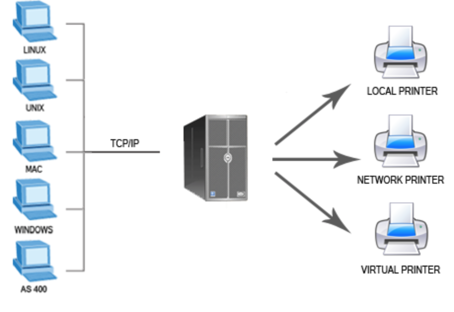
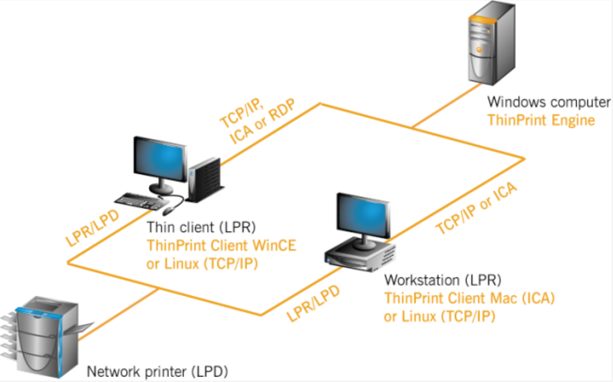
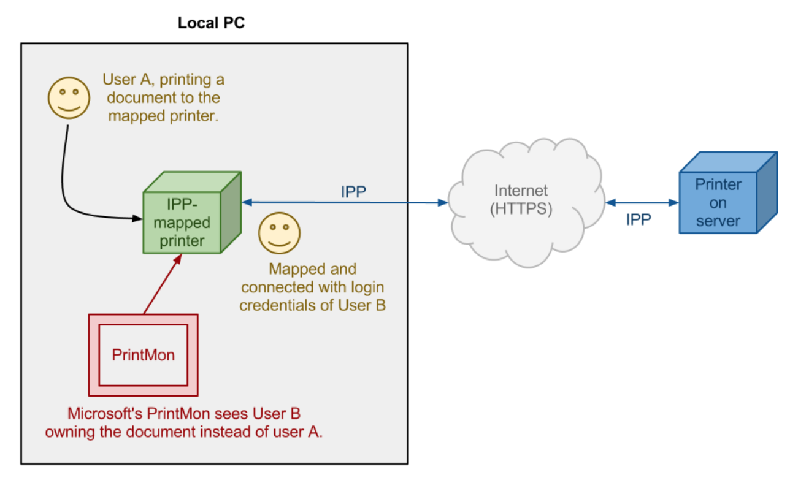

# Administración de Servidores de Impresión

??? abstract "Duración y criterios de evaluación"

    **Duración estimada: 5 sesiones (12h por sesión)**

    <hr />

    Resultado de aprendizaje y Criterios de evaluación:

    1. Administra servidores de impresión describiendo sus funciones e integróndolos en una red.
        1. Se ha descrito la funcionalidad de los sistemas y servidores de impresión.
        2. Se han identificado los puertos y los protocolos utilizados.
        3. Se han utilizado las herramientas para la gestión de impresoras integradas en el sistema operativo.
        4. Se ha instalado y configurado un servidor de impresión en entorno Web.
        5. Se han creado y clasificado impresoras lógicas.
        6. Se han creado grupos de impresión.
        7. Se han gestionado impresoras y colas de trabajos mediante comandos y herramientas gráficas.
        8. Se han compartido impresoras en red entre sistemas operativos diferentes.
        9. Se ha documentado la configuración del servidor de impresión y de las impresoras creadas.

## Introducción

El proceso de impresión consiste básicamente en transmitir una serie de datos textuales, gráficos, imágenes, etc. desde el ordenador que las ha procesado hasta un determinado periférico de impresión. Para establecer una comunicación con cualquier periférico hay un canal de comunicación física, es decir una interfaz electrónica que permita transmitir las señales que llevan la información. Estos canales de comunicación pueden ser puertos y buses de comunicación **o bien una infraestructura de red**.

Uno de los **dispositivos que se comparten más a menudo en una red son las impresoras**; para realizarlo es necesario implementar los siguientes puntos:

- Un **software que se encargue de gestionar los trabajos de impresión**, organizándolos en colas, dando prioridad a algunos de ellos, poniendo portadas y haciendo que las hojas de los diferentes trabajos no se mezclen entre sí.
- Aquí aparece el término **“Cola de Impresión"** para referirse a la lista de trabajos que están a la espera de ser impresos en un dispositivo de impresión.
- Además en el caso de empresas "*medianas/grandes*" se crean más necesidades, las cuales son cubiertas con **pools o grupos de impresoras** que comparten la misma cola de impresión y un software que envía el trabajo a la primera que queda libre.

!!! tip "Servidor de Impresión"
    En este último caso el "*SW*" que da solución a las necesidades de impresión en las empresas con un alto número de usuarios son los **servidores de impresión**. Estudiado en un sub-aparatado más adelante.

<figure>
  
  <figcaption>Ejemplo Servidor de Impresión</figcaption>
</figure>

## Sistemas de Impresión

Imprimir puede parecer una tarea sencilla, pero conlleva una serie de **inconvenientes y necesidades** que los sistemas de impresión actuales resuelven mediante la **implementación de diferentes módulo**s:

- El planificador de colas de impresión ( spooler )
- Los filtros
- Los controladores de interfaz o backends

1. El **primer problema surge porque la mayoría de las impresoras no tienen memoria suficiente para cargar un documento completo**. Este es uno de los motivos que hacen necesario disponer de colas de impresión y de un sistema que las gestione ( **spooler** ). 

El gestor de la cola monitoriza la impresora y envía el siguiente trabajo en el momento en que queda libre. La ubicación de las colas de impresión está determinada por la complejidad del sistema de impresión. Las colas pueden estar situadas:

- Ordenador cliente
- Servidor de impresión
- Un servidor proxy de archivos

2. El siguiente problema a resolver es el **gran número de modelos de impresora disponibles** en el mercado que utilizan secuencias de control diferentes, es decir que hablan lenguajes propios que requieren una traducción. 

**Los filtros son las herramientas, entre el planificador y las impresora**s, que hacen traducción entre los datos de entrada y el lenguaje que entiende la Impresora.

3. El último paso de la cadena es el **envío de datos al periférico de impresión** mediante alguno de los canales e interfaces físicas que se han descrito. Cada una de estas interfaces requiere un c**ontrolador de dispositivo o backend** que gestiona y controla el puerto de comunicación físico (USB, paralelo, RS232 ...) o bien la **conexión de red (IPP, AppSocket, etc.)**. 

!!! tip "**Importante**"
    El concepto modular del controlador backend permite añadir nuevos tipos de interfaces según avance la tecnología sin afectar al resto de la arquitectura.

## Tipos de impresoras para trabajo en red.

Dependiendo de cómo está compartida la impresora tenemos:

- **Local printer**: Son impresoras que en principio **se usan en un ordenador en concreto**, que están conectadas a uno de sus puertos. En un momento dado se decide que van a utilizarse desde más equipos de la red, y se comparte. En este caso, la gestión de los trabajos de impresión y los permisos de acceso de la impresora corren a cargo del sistema operativo del equipo al que está conectado el dispositivo.
- **Network printer**: Estos dispositivos **tienen su propia tarjeta de red,** que puede ser tanto cableada como wireless por la que se conectan a esta de forma independiente de ningún equipo. Se les debe asignar una ip o bien la recogerán del servidor DHCP de la red.
- **Virtual printer**: Para los casos en los que tenemos una o varias impresoras sin conexión a red, pero no queremos tener un equipo siempre encendido para poder aceptar las peticiones de impresión, existen unos concentradores llamados **servidores de impresión** , que permiten conectar la impresora a la red, y que permiten conectar varias impresoras haciendo pool de estas.

<figure>
  
  <figcaption>Ejemplo Servidor de Impresión</figcaption>
</figure>

## Puertos y protocolos de impresión

En el caso de comunicar ordenadores y periféricos mediante una red compartida también hay que tener presente la **necesidad de implementar unos protocolos de comunicación adecuados** para alcanzar las funcionalidades necesarias de cualquier sistema de impresión.

Los principales protocolos ( puertos lógicos) de comunicación que se pueden utilizar en el ámbito de los sistemas de impresión son los siguientes:

- Protocolo LPD / LPR
- Protocolo IPP
- AppSocket
- AppleTalk
- SMB/ CIF

!!! tip "Principales con sus puertos"
    Los tres principales son: **LPD** ("impresora") en el puerto `515`, **IPP** en `631`, y PDL-flujo de datos en `9100` utilizado habitualmente por impresoras **HP (Hewlett-Packard)**.

### Protocolo LPD / LPR

El Protocolo **LPD / LPR** ( **line printer daemon / line printer remote protocolo** ) es el protocolo originalmente implementado en la plataforma **BDS Unix**. Utiliza TCP /IP para establecer conexiones entre impresoras y ordenadores en una red. Este protocolo trabaja normalmente escuchando peticiones al puerto TCP `515` y consta de dos componentes:

- **Line printer remote (LPR)** es el término para el **proceso cliente de envío de trabajos de impresión** a una impresora o cola de impresión. La estación de trabajo que envía el trabajo de impresión es el cliente LPR.
- **Line printer daemon** se refiere al proceso de **recepción de trabajos de impresión desde un cliente LPR**. Las impresoras o servidores de impresión que reciben los trabajos de impresión se llaman servidores LPD.

<figure>
  
  <figcaption>Arquitectura LPD/LPR</figcaption>
</figure>

Cuando un usuario envía un documento para imprimir, el ordenador (LPR cliente) genera un trabajo en un determinado formato, por ejemplo, *PostScript*.

- Los datos de impresión se componen de un **fichero de datos** con el contenido real que se quiere imprimir, y un **archivo de control** que incluye la descripción del archivo de datos, nombre del trabajo, propietario, número de copias a imprimir, cola de destino, etc.
- A continuación, **el trabajo de impresión se envía a la dirección IP del servidor LPD**, que lo recibe habitualmente a través del puerto TCP / IP `515`.
- Se pueden configurar y definir **varias colas** en el servidor de impresión LPD, por lo que **el fichero de control del trabajo de impresión debe incluir información sobre qué cola debe ser asignada**.

### Protocolo IPP

El protocolo de impresión por Internet (**IPP o Internet printing protocolo**) define extensiones del conocido protocolo **HTTP** ( Hyper Text transporte protocolo ) para apoyar los servicios de impresión remotos, configuración de impresoras y gestión de colas.

A diferencia de otros protocolos, IPP permite control de acceso, autenticación y cifrado para dar soluciones de impresión más completas y seguras. Es el protocolo usado de forma nativa para **CUPS** y suele utilizar el puerto `631`.

<figure>
  
  <figcaption>Arquitectura IPP</figcaption>
</figure>

Entre las funciones de este protocolo destacan:

- Este protocolo **gestiona los trabajos que se lanzan para imprimir**, el tamaño del medio, la resolución, etc.
- Como todos los protocolos basados en IP, puede ser usado localmente o sobre Internet para comunicarse con impresoras locales o remotas. A diferencia de otros protocolos, también soporta el **control de acceso, la autenticación y el cifrado**, siendo así una solución de impresión más capaz y segura que otras más antiguas.
- Por contra, recibe críticas por la sobrecarga del protocolo, al estar construido sobre HTTP. Esto lo convierte en un protocolo y una realización más complejos y recargados de lo necesario.

### AppSocket

Este protocolo está basado en el protocolo **Jetdirect de HewlettPackard**. Suele trabajar en el puerto `9100` y se considera muy fiable, sencillo y rápido.

### AppleTalk

Es un conjunto de protocolos de comunicación de Apple que permite, entre otras cosas, la comunicación con impresoras y servidores de impresión.

### SMB/ CIFS

El servidor de bloques de mensajes ( **server message block** ) y su evolución, el sistema de archivos común de internet ( common Internet file system ), son protocolos de red de la capa de aplicación del modelo OSI que permiten gestionar y compartir archivos e impresoras entre nodos de una red. 

- **SMB** utiliza el puerto TCP `445` y fue ideado por **IBM**, pero modificado y perfeccionado por Microsoft, que lo utiliza en sus sistemas operativos Windows. También hay implementaciones del protocolo en código libre para sistemas Linux.

!!! note "**Samba**"
    Es la más popular implementación en código libre del protocolo **SMB / CIFS** (entre otros) y permite la compartición de archivos e impresoras en redes heterogéneas.

## Órdenes para la gestión de impresoras y trabajos

### Windows

Debemos saber que la cola de impresión, en un equipo local, se encuentra en `%systemroot%\system32\spool\printers`. 

!!! note "**Nota**"
    Depende de actualización de las últimas versiones

- Tenemos, por un lado, el comando `lpq`. Si utilizamos la ayuda del comando (`lpq /?`) obtendríamos algo similar a:

``` yaml
C:\Documents and Settings\Usuario>lpq /?
Muestra el estado de una cola lpd remota.
Uso: lpq -Sservidor -Pimpresora [-l]
Opciones:
     -S servidor    Nombre o dirección IP del host que proporciona servicio lpd.
     -P impresora   Nombre de la cola de impresión.
     -l             Salida detallada.
```

Por otro lado se destaca el comando `net`; utilizado para gestionar las colas de impresión.

- `net stop spooler`: parará el servicio de cola de impresión.
- `net start spooler`: arrancará el servicio de cola impresión.

Se puede utilizar el comando **net** con el parámetro `use` podríamos obteniendo una salida como la siguiente:

``` yaml
C:\Documents and Settings\administrador>net use \\Win-qni8olz3ihl\PDFCreator
Se ha completado el comando correctamente.
C:\Documents and Settings\administrador>net use \\Win-qni8olz3ihl\PDFCreator
Nombre local
Nombre remoto        \\Win-qni8olz3ihl\PDFCreator
Tipo de recurso      Impresora
Estado               Conectado
Abiertos             0
Nº de conexiones     1
```

!!! tip "Aclaración"
    El parámetro de entrada, se tiene una impresora, la aplicación **PDFCreator**, en el servidor **Win-qni8olz3ihl** compartida para todos los usuarios del dominio)


### Linux

El trabajo de impresión en Linux se ha realizado históricamente usando uno de estos dos sistemas de gestión de impresión: 

- el sistema de impresión de **AT&T (Unix System V)** y el demonio de impresoras en línea (**LPD)** de Berkeley. 
- Estos sistemas estuvieron diseñados en los años 70 con el único propósito de imprimir texto en impresoras de caracteres. 
- Por este motivo han aparecido nuevas opciones con más prestaciones, como **LPRng** o el sistema **CUPS**, aunque se ha intentado siempre conservar la compatibilidad y sintaxis de las órdenes de consola originales.

!!! tip "**/etc/pintcap**"
    Este es el archivo de configuración del sistema de impresión **lpd** que contiene el registro y definición de todas las impresoras del sistema, indicando el alias, nombre del dispositivo, el directorio de la cola de trabajos, filtros, etc.

Los principales sistemas de impresión Linux:

- **LPD**, sistema de impresión Berkeley: este es el tradicional gestor de impresión de Unix de la plataforma Unix BSD. Es controlado por el demonio de impresoras de línea ( **line printer daemon** ) situado en `/usr/sbin/lpd` y utiliza el protocolo **LPD/LPR**. Los clientes se comunican con el demonio mediante el dispositivo `/dev/printer` y utilizan el archivo de configuración `/etc/printcap` para determinar el directorio de la cola de trabajos de impresión.
- **LPRng** : **LPR** es una implementación en código libre que mejora el sistema de impresión BDS pero manteniendo la compatibilidad, ya que también utiliza el demonio LPD. **Incluye nuevas funcionalidades en el control de la cola detrabajos y las funciones de servidores de impresión en red**.
- **CUPS**: el sistema de impresión común de Unix es un potente y completo gestor de impresión basado en el protocolo `IPP` (Internet printing protocolo) e integrando `PostScript` como el lenguaje de definición de páginas estándar. 

!!! note "**NOTA**"
    La mayoría de distribuciones Linux ya incorpora CUPS como sistema de impresión por defecto.

En GNU/Linux tenemos una serie de comandos u órdenes que nos permiten interactuar con la impresora o bien con la cola de impresión. Ejemplos:

- `lpr texto`: añade el documento texto a la cola de impresión por defecto. El comando `lp` hace exactamente lo mismo que el comando lpr.
- `Lpq`: mostrará todos los trabajos que están en la cola de impresión.
- `Lprm`: cancela todos los trabajos en la cola de impresión. Si indicamos el número de trabajo, sólo cancelará ese trabajo. Obtendremos el mismo resultado con el comando `cancel`.
- `lpstat –t`: obtiene toda la información de las impresoras y sus estados.
- El comando `lpadmin` nos permitirá administrar una determinada impresora.

## Servidores de Impresión

Un **servidor de impresión** es un software que permite que los PCs de una red local puedan hacer uso de las impresoras de la red de una forma eficaz, ya que centraliza las tareas de impresión, facilitando una gestión de las mismas. Los objetivos de los servidores de impresión son:

- Compartir todas sus impresoras desde un único servidor centralizado, ya sean de red o no.
- Controlar las impresiones por usuario, grupos de trabajo, departamentos, etc.
- Realizar cobros por impresión  (por trabajos, páginas, etc).
- Implementar quotas (por trabajos, páginas, etc).
- Utilizar dichas impresoras desde cualquier dispositivo disponible en su red (Windows, Linux, Mac, celulares, etc)
