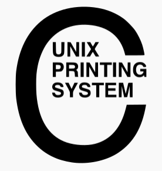

# Servidor de impresión en GNU/Linux

## Introducción

En GNU/Linux tenemos dos maneras de compartir los recursos de impresión:

- A través del servicio Samba
- A través del servicio CUPS

**Samba** es una implementación libre del protocolo de archivos compartidos de Microsoft Windows (SMB/CIFS) para sistemas de tipo UNIX. De esta forma, es posible que ordenadores con GNU/Linux, Mac OS X o Unix, en general se vean como servidores, o actúen como clientes en redes de Windows. Es decir, entre clientes Windows aparece como otro equipo Windows sin serlo. Este servicio se estudiará más en detalle en la siguiente unidad.

A continuación se estudiará el servicio de CUPS.

## CUPS

<figure style="float: right;">
    
</figure>

`Common Unix Printing System` Es un sistema de impresión modular para sistemas operativos de tipo Unix, como GNU/Linux y Mac OS X, que permite que un ordenador actúe como servidor de impresión. Fue desarrollado por `Easy Software Products` y liberado como software libre con licencia **GNU / GPL** .

Características:

- Utiliza el protocolo `IPP` (Internet Printing Protocol) sobre HTTP/1.1 como base para el manejo de tareas de impresión y de colas de impresión.
- Por otra parte funciona con `LPD/LPR`  para proporcionar acceso a clientes Linux, Windows y Mac OS.
- También proveé de comandos tradicionales en línea de impresión de los sistemas Unix.
- Para configurar el servidor **CUPS** debemos modificar, principalmente, el archivo `cups.conf`. Este archivo se encuentra en el directorio `/etc/cups` en muchos casos.

<figure>
  
  <figcaption>Panel de control de CUPS</figcaption>
</figure>

!!! note "**NOTA**"
    En la imagen anterior se puede observar el panel de control de CUPS. Un panel al que se accede a través de un navegador web. Es decir, se puede administrar de forma remota.

## Funcionamiento del sistema CUPS

De manera similar a otros sistemas de impresión, `CUPS` está diseñado en torno a un proceso de **planificación de impresión** (**scheduler**) que distribuye los trabajos de impresión, procesa las órdenes administrativas y proporciona información y monitorización del estado de las impresoras y los trabajos.

Este proceso corresponde al demonio llamado `cupsd`, que se suele cargar en el arranque del sistema trabajando en segundo plano y al que haremos referencia como planificador. Destacan las siguientes funciones:

- **El planificador o scheduler** gestiona las peticiones que llegan siguiendo el protocolo `IPP`. Estos trabajos pueden provenir del ordenador local o bien de clientes en red de varias plataformas (Linux, Windows, Mac OS ) y generan dos archivos, uno con los **datos propiamente dichos**, y un **archivo de control con información sobre el trabajo de impresión**. Estos archivos se guardan en el directorio 

``` yaml
/var/spool/cups
```

- Los trabajos de impresión pueden incorporar texto, gráficos e imágenes vectoriales o de mapa de bits. Estos tipos de datos son reconocidos utilizando las entradas del archivo:

``` yaml
/etc/cups/mime.types 
```

o bien en:

``` yaml
/var/share/cups/mime/mime.types
```

- Para describir estos elementos anteriores, **CUPS** utiliza de forma estándar el lenguaje de programación de gráficos PostScript desarrollado por Adobe. Los filtros de conversión en función del tipo de datos están determinados en el archivo:

``` yaml
/etc/cups/mime.convs
```

o bien en:

``` yaml
/var/share/cups/mime/mime.convs
```

- El planificador gestiona las impresoras disponibles en la red local y envía los trabajos de impresión utilizando los filtros y controladores de interfaz (backends) apropiados, que están situados en:

``` yaml
$ ls /usr/lib/cups/backend
```

- Las impresoras compatibles con `PostScrip`t pueden interpretar directamente los datos recibidos del planificador sin necesitar un filtro específico. En el caso de impresoras que `no sean PostScript` hay que hacer la traducción al lenguaje objetivo de la impresora *mediante los filtros* suministrados o con otras aplicaciones como *Ghostscript*, software también de código libre.

!!! note "**NOTA**"
    `Ghostscript` es un programa intérprete de archivos PS (PostScript) y PDF ( portable document format ) que permite representarlos en pantalla y traducirlos de manera que puedan ser impresos en una impresora con capacidad gráfica.

Una vez que el trabajo ha sido transferido a la impresora, el planificador borra el archivo de datos de la cola en `/var/spool/cups` , pero deja el archivo de control, donde quedan numerados correlativamente (desde el primero, `/var/spool/cups/c00001` )

**Otras características adicionales proporcionadas por CUPS son:**

- **Servicio de directorio**: llamado examinador de impresoras ( printer browsing ). Los clientes pueden encontrar automáticamente y utilizar impresoras de cualquier servidor de la red. Si esta función está activada, el servidor distribuye por la red la información de las impresoras disponibles mediante mensajes de difusión general (**broadcasting**) cada poco tiempo.
- **Clases**: `CUPS` también permite definir clases, que son grupos de impresoras de similares características. Los trabajos de impresión enviados a una clase son redirigidos a la primera impresora disponible de aquella clase. Este esquema también permite habilitar seguridad y reparto de cargas definiendo la misma impresora en varios servidores.
- **Soporte clientes LPD:** usando un minidemonio (`cups-lpd)` que atiende todas las tareas de impresión recibidas por `LPD `y las redirige al subsistema CUPS convirtiéndolas en protocolo `IPP`.
- **Administración web**: este servidor también actúa como servidor web para la documentación, motorización de estado y administración del sistema
- **Impresión desde línea de comandos**: CUPS entiende directamente muchos tipos diferentes de archivos, incluyendo texto, PostScript, PDF y archivos de imagen. Esto le permite imprimir este archivos desde las aplicaciones de usuario o directamente desde la línea de comandos.

## Órdenes de consola para la gestión de impresión y trabajos

`CUPS` proporciona compatibilidad y emula las órdenes de consola tradicionales de las principales plataformas Unix (Unix Berkeley BDS y Unix System V).

!!! note "**NOTA**"
    Hay que remarcar que CUPS sólo proporciona compatibilidad con la orden `lpc` de administración de Unix BDS en modo de lectura. Así, pues, para la administración por línea de comandos, es más habitual utilizar la orden `lpadmin` de System V.

**A continuación se comentan las principales tareas administrativas de control de impresión utilizando comandos de consola.**

1. Órdenes relacionadas con la **generación de trabajos de impresión**:

- Imprimir un archivo en la impresora por defecto del sistema:

``` yaml
$ lp nomArchivo
$ lpr nomArchivo
```

- Imprimir un archivo en una impresora específica:

``` yaml
$ lp d nomImpresora ‐ nomArchivo
$ lpr ‐P nomImpresora nomArchivo
```

- Impresión de la salida de un programa: Las órdenes lp y lpr aceptan tuberías para imprimir la salida estándar de cualquier otra orden o programa:

``` yaml
$ programa | lp
$ programa | lpr
```

2. Órdenes relacionadas con el **listado de impresoras disponibles**:

- Muchos sistemas tienen más de una impresora a disposición del usuario. Para obtener un listado de las impresoras y clases disponibles:

``` yaml
$ lpstat ‐p
printer ClasseBN disabled since mar 31gen2015 18 : 57 : 57 CET
printer hp9040DN is idle. enabled since dt 31gen2015 18 : 23 : 36 CET
printer PDF is idle. enabled since dt 31gen2015 01: 47 : 33 CE
```

- Alternativamente se puede usar la orden lpc :

``` yaml
$ lpc status
```

- Asignar **impresora predeterminada** para definir cuál es la impresora que recibirá los trabajos por defecto:

``` yaml
$ lpoptions ‐d nomImpressora
```

3. Órdenes relacionadas con la administración de trabajos de impresión:

- Para eliminar un trabajo de impresión pendiente en la cola.

``` yaml
$ cancel id_trabajo
$ lprm id_trabajo
```

- Cancelar todos los trabajos de un usuario determinado:

``` yaml
$ cancel ‐u nomusuario
$ lprm nomusuario
```

- Traslado de un trabajo de impresión. Con esta orden se mueve un trabajo de impresión a otra impresora o clase de impresoras.

``` yaml
$ lpmove id_trabajo nomImpressora
```

- Podemos obtener el identificador de un trabajo (id_trabajo) con las órdenes

``` yaml
$ lpq
$ lpstat
```

- Imprimir varias copias. Tanto el orden lp como el lpr tienen opciones para la impresión de más de una copia de un archivo:

``` yaml
$ lp ‐n num_copias nomArchivo
$ lpr ‐ # num_copias nomArchivo
```

4. Órdenes relacionadas con la **gestión de las clases** de impresora:

- Añadir una impresora a una clase. En este ejemplo añadimos la impresora `HP9040` en la clase de impresoras en blanco y negro:

``` yaml
$ lpadmin ‐p hp9040 ‐c ClasseBN
```

- Retirar una impresora de una clase. En este caso eliminamos la impresora virtual PDF de la clase de impresoras en color.

``` yaml
$ lpadmin ‐p PDF ‐r ClasseColor
```

!!! note "**NOTA**"
    Si la clase no existe se crea automáticamente al añadir la primera impresora. Si la clase queda vacía se borra. Se pueden comprobar las clases existentes en el archivo `/etc/cups/classe.conf`.

5. Órdenes relacionadas con el **control de acceso de usuarios**:

- Para determinar el control de acceso de los usuarios a una determinada impresora se utiliza la orden lpadmin con la opción -u y a continuación las listas de usuarios con permiso ( allow ) o sin permiso ( deny ).

``` yaml
$ lpadmin p hp9040DN ‐ ‐u allow: pepe,juan
```

- En las listas se puede utilizar la expresión all (todos) y none (nadie). En el siguiente ejemplo se permite el acceso a la impresora `HP9040DN` a todo el mundo menos a los usuarios Pepe y Juan.

``` yaml
$ lpadmin ‐p hp9040DN ‐u allow:all deny: pepe, juan
```

- La configuración por defecto de la impresora puede ser suficiente en la mayoría de ocasiones. Si hay que cambiar alguna opción al imprimir un determinado archivo podemos utilizar la opción `-o` de las órdenes `lp` y `lpr`, tal como se muestra en este ejemplo donde indicamos orientación de papel, escala y tamaño del papel:

``` yaml
lp ‐o landscape ‐o scaling = 80 ‐o media = A4 nomArchivo.jpg
lpr ‐o landscape ‐o scaling = 70 ‐o media = A3 nomArchivo.pdf
```

!!! note "**NOTA**"
    Todas las opciones anteriores se aplican a un trabajo de impresión determinado.

- Si queremos que una impresora quede permanentemente configurada con una opción determinada debemos usar la orden lpoptions con la siguiente sintaxis:

``` yaml
$ lpoptions ‐p NomImpresora ‐o NomOpcio = ValorOpcion
```

- Así, en el ejemplo siguiente se deja como predeterminda el tamaño de la página por defecto de la impresora HP9040:

``` yaml
$ lpoptions p hp9040 ‐ ‐o PageSize = Letter
```

- Sin embargo, este cambio puede tener efecto para un conjunto de usuarios diferente según quien ha hecho la orden:
    - Si la orden ha sido hecha por un usuario normal, esta configuración se guarda en el archivo personal `~ / .lpoptions` y sólo afecta a los trabajos de impresión de este usuario.
    - Si la orden la ha efectuado un usuario administrador, esta configuración se guarda en el archivo `/etc/cups/lpoptions` y afecta a todos los usuarios de la máquina.
    - Si la impresora es compartida y queremos que esta configuración afecte a los trabajos que envíen a la cola todos los clientes de la red, será necesario cambiar la configuración por defecto del archivo PPD correspondiente mediante la orden lpadmin y la misma sintaxis:

``` yaml
$ lpadmin ‐p hp9040 ‐o PageSize = Letter
```

- Para borrar un cambio de opciones predeterminadas hecho con lpoptions se utiliza la misma sintaxis pero con la opción `-r` (remove)

``` yaml
$ lpoptions ‐p hp9040 ‐r PageSize = Letter
```

- Finalmente, si queremos visualizar la configuración completa de una impresora determinada, por ejemplo:

``` yaml
$ lpoptions p hp9040DN -l
```

``` yaml
PageSize / Page Size: Custom.WIDTHxHEIGHT 11x14 11x17 13x19 16x20 16x24 2A 4A 8x10 8x12 A0 A1 A2 A3 *
A4 A5 ansias AnsiB AnsiC AnsiD AnsiE Arch ArchB ArchC ArchD Arche C0 C1 C2 C3 C4 C5 Env10 EnvC5 EnvDL
EnvMonarch Executive ISO B0 ISOB1 ISOB2 ISOB3 ISOB4 ISOB5 JISB0 JISB1 JISB2 JISB3 JISB4 JISB5 Ledger
Legal Letter RA0 RA1 RA2 RA3 RA4 SRA0 SRA1 SRA2 SRA3 SRA4 Super soberbio Tab loidExtra Tabloid
Resolution / Output Resolution: 150dpi * 300dpi 600dpi 1200dpi 2400dpi
```

!!! note "**NOTA**"
    El símbolo * indica el valor activo en este momento, en este ejemplo: tamaño A4 y resolución de 300 dpi.

!!! tip "**PARA SABER MÁS**"
    - [Wiki CUPS](https://wiki.archlinux.org/title/CUPS#Administraci.C3.B3n_de_CUPS)
    - [Command-Line Printing and Options CUPS](https://www.cups.org/doc/options.html#OPTIONS)

## Actividades de desarrollo UD6_01

601. [Instalación y configuración de CUPS](./Practica13_CUPS.md)