# Administración de los Servicios de Impresión en Windows Server

El objetivo final del servicio de impresión es proporcionar la capacidad de impresión a los usuarios de la red. Como se ha vista en el subaparatdo anterior. Existen diferentes maneras de compartir en red un dispositivo físico de impresión. 

La más común en entornos corporativos es la **instalación de una impresora física que soporta el direccionamiento IP** y puede ser conectada directamente a la LAN a través de un switch o un hub:

<figure>
  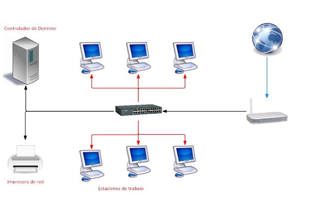
  <figcaption>Esquema de red habitual</figcaption>
</figure>

## Instalación de los Servicios de Impresión

Como hemos visto en el punto anterior, la manera más habitual de conexión de impresoras en organizaciones de tamaño medio y grande consiste en conectar la impresora directamente a la red a través de un switch. Vamos a implantar esta estructura en nuestro dominio. Para ello lo primero que tenemos que hacer es instalar la función de 'Servicios de Impresión':

<figure>
  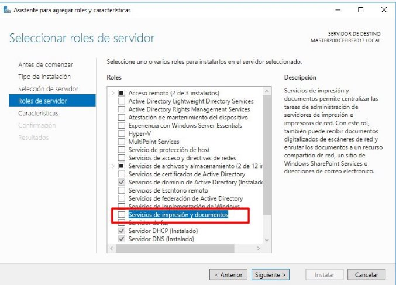
  <figcaption>Agregar el rol de Servicios de Impresión</figcaption>
</figure>

En la siguiente figura podemos seleccionar qué servicios de impresión queremos instalar. Instalaremos únicamente el '**Servidor de Impresión**', la segunda opción permite poner en marcha un servidor web para gestionar los trabajos de impresión. La tercera ('Servidor LPD') la instalaríamos en caso de tener una red heterogénea **Windows-GNU/Linux**, y la tercera permite la gestión de digitalización de documentos.

<figure>
  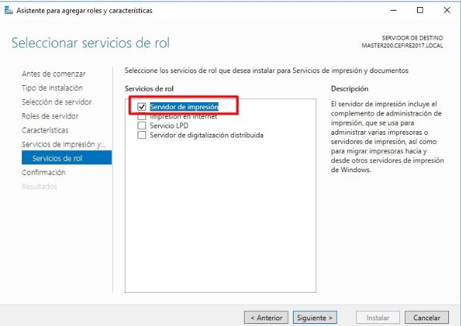
  <figcaption>Servicios a instala</figcaption>
</figure>

Confirmamos e instalamos el Servicio de Impresión:

<figure>
  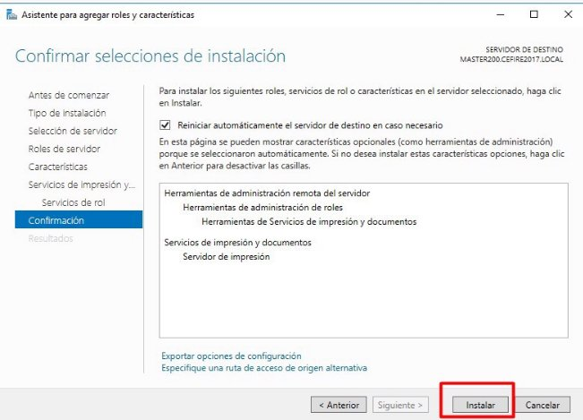
  <figcaption>Instalar Servicio de Impresión</figcaption>
</figure>

<figure>
  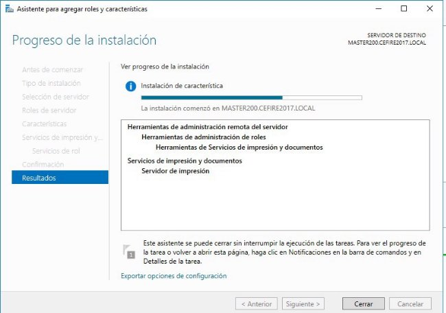
  <figcaption>Instalar Servicio de Impresión II</figcaption>
</figure>

Una vez instalado el Servidor de Impresión, ya podemos acceder al administrador de la impresión a través del Panel del `Administrador` --> `Herramientas` --> `Administración de Impresión`:

<figure>
  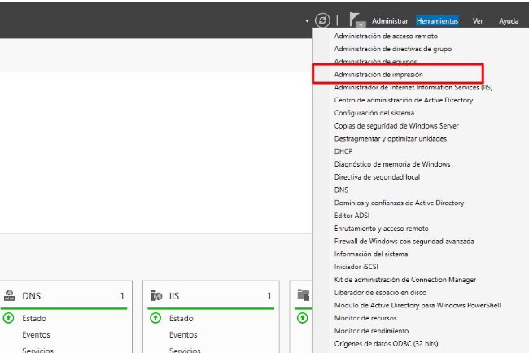
  <figcaption>Administración de Impresión</figcaption>
</figure>

<figure>
  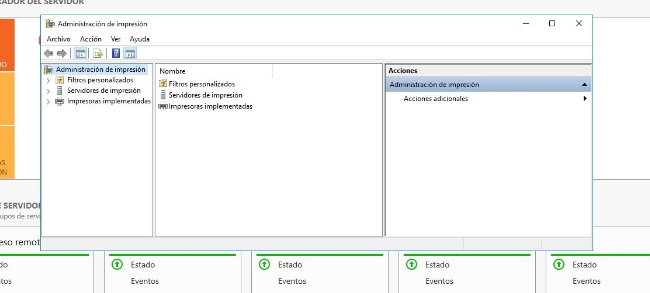
  <figcaption>Administración de Impresión II</figcaption>
</figure>

## Agregando un Dispositivo de Impresión

Una vez que tenemos instalados los servicios de impresión en el controlador de dominio, agregaremos un dispositivo de impresión en red. Para ello, abrimos el Administrador de Impresión y añadimos una nueva impresora:

<figure>
  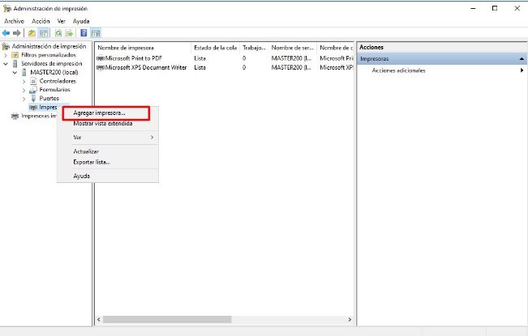
  <figcaption>Agregar una impresora</figcaption>
</figure>

- Se abrirá el Asistente para la instalación de impresoras en red, y ahí podremos especificar el método de instalación. La primera de las opciones (Buscar impresoras en la red) nos mostrará un listado de los dispositivos físicos de impresión accesibles desde nuestro equipo.
- Como no hemos conectado ninguno, esta opción no nos sirve. La segunda de las opciones (Agregar una impresora TCP/IP o de servicios web en base a la dirección IP o nombre de host) nos permite configurar una impresora lógica que apuntará a la dirección IP que definiremos en el dispositivo físico de impresión.
- La tercera opción (Agregar una nueva impresora por medio de un puerto existe) nos permitiría configurar una impresora lógica que apuntaría a un puerto ya existente del controlador de dominio (LPT, USB, etc.) donde podríamos conectar el dispositivo físico de impresión.
- Finalmente la última opción (Crear un nuevo puerto y agregar una nueva impresora) nos permite definir un nuevo puerto local como interfaz entre una impresora lógica a configurar y el dispositivo físico.

Como queremos administrar un dispositivo físico de impresión que se conectará directamente a la red, seleccionaremos la segunda opción: 'Agregar una impresora TCP/IP o de servicios web en base a la dirección IP o nombre de host'.

<figure>
  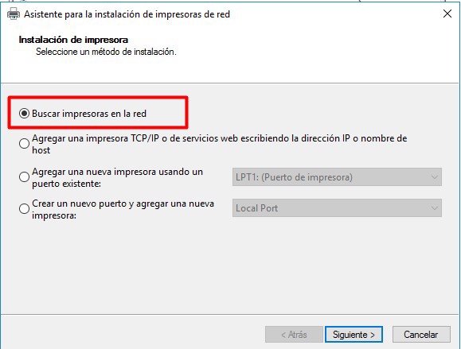
  <figcaption>Buscando impresoras de red</figcaption>
</figure>

<figure>
  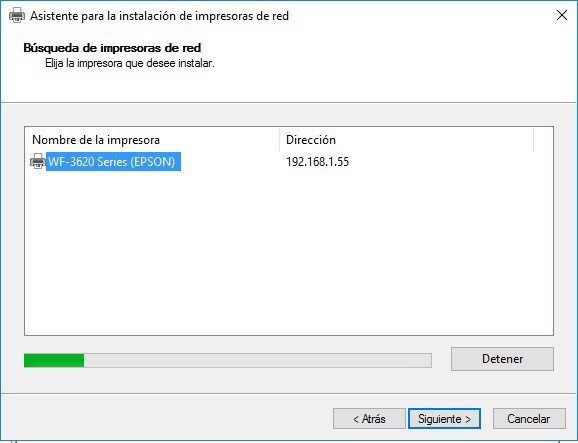
  <figcaption>Buscando impresoras de red II</figcaption>
</figure>

Una vez encontrada la impresora, procedemos a realizar la instalación de la misma. Habrá que seleccionar los drivers, bien por defecto o bien si hemos de descargarlos de internet y realizar la instalación de los mismos. Al final la impresora queda instalada:

<figure>
  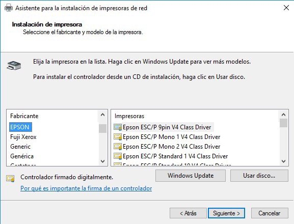
  <figcaption>Buscando impresoras de red III</figcaption>
</figure>

<figure>
  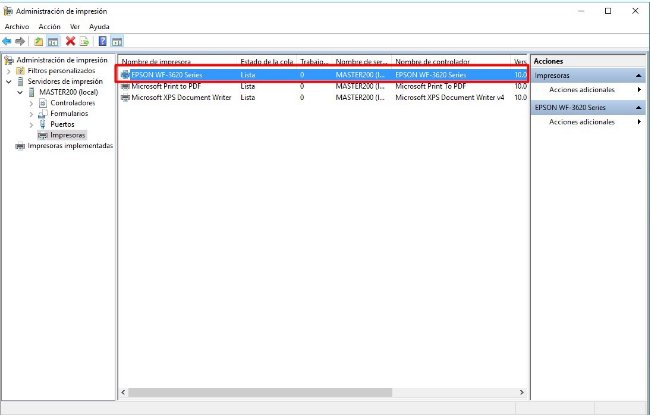
  <figcaption>Buscando impresoras de red IV</figcaption>
</figure>

<figure>
  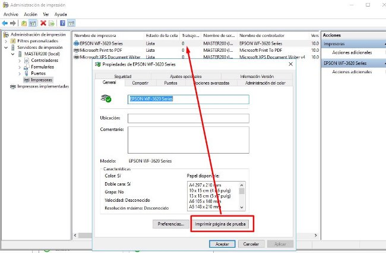
  <figcaption>Buscando impresoras de red V</figcaption>
</figure>

## Despliegue de los Dispositivos de Impresión

Ahora veremos cómo asociar los dispositivos de impresión a usuarios o grupos, sin que estos tengan que llevar a cabo ningún tipo de configuración, lo cual es un proceso delicado.

Para poder realizar esta tarea, debemos asegurarnos de que la impresora está compartida en red, y que los usuarios que planifiquemos tienen acceso a la misma. Para ello, en el administrador de impresión, haremos clic con el botón secundario en el dispositivo de impresión que queremos configurar, y accederemos a las **Propiedades**. En la pestaña '*Compartir'* corroboraremos que la compartición está habilitada, tal y como configuramos en la instalación de la impresora, y en la pestaña 'Seguridad' comprobaremos que los grupos o usuarios que definamos tienen permiso para imprimir:

<figure>
  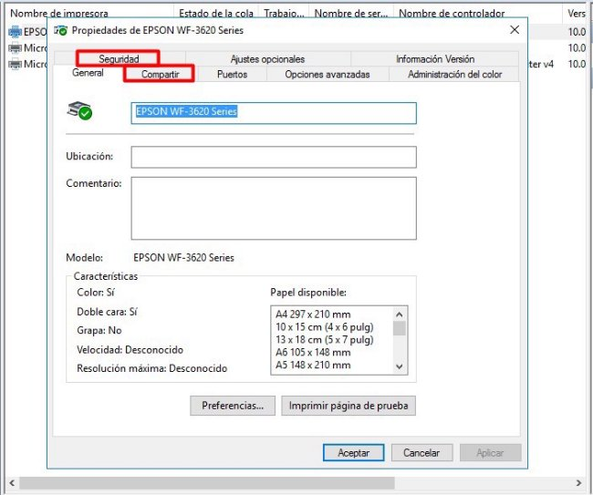
  <figcaption>Permisos a dispositivos de impresión</figcaption>
</figure>

!!! tip "**CONSEJO**"
    En principio no es aconsejable otorgar a los usuarios convencionales del dominio los permisos de administrar impresoras o administrar documentos.

- La administración de impresoras proporciona al usuario un control total sobre la impresora y sus controladores.
- La administración de documentos permite al usuario realizar tareas de control sobre los documentos y puede detener, reiniciar o cancelar las tareas de impresión:

<figure>
  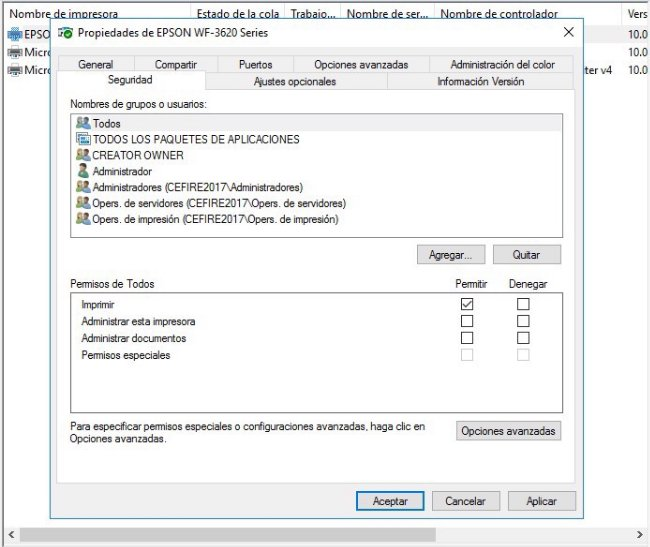
  <figcaption>Permisos de seguridad en Impresoras</figcaption>
</figure>

- Lo más habitual es que los dispositivos de impresión estén distribuidos en la empresa en diversos departamentos o plantas del edificio, y normalmente los usuarios suelen tener acceso únicamente a las impresoras asignadas a su grupo, por lo que eliminaremos el grupo Todos de los permisos, y añadiremos al grupo Pistonazo, ya que a priori, podrán imprimir documentos:

<figure>
  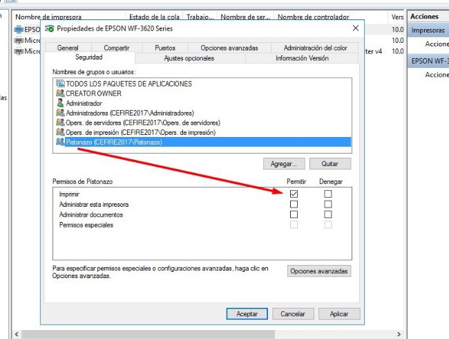
  <figcaption>Asignar permisos de impresión</figcaption>
</figure>

- Como el despliegue de los dispositivos de impresión lo haremos mediante directivas de grupo, antes de empezar crearemos un GPO sobre todo el dominio que llamaremos (en este caso) ImpresoraPistonazo. En el filtrado de seguridad del GPO incluiremos únicamente al grupo Pistonazo.

<figure>
  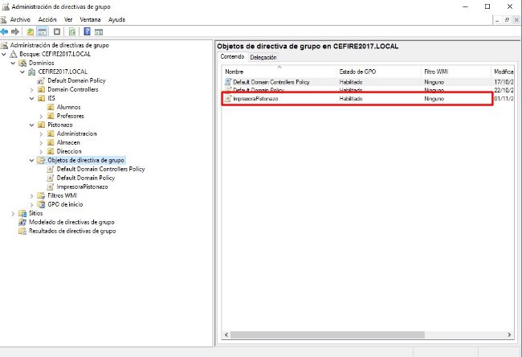
  <figcaption>Crear GPO para Impresora</figcaption>
</figure>

y añadimos al grupo Pistonazo:

<figure>
  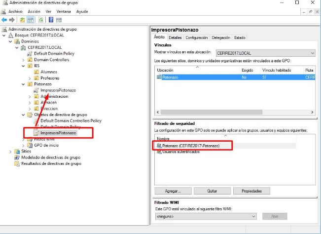
  <figcaption>Agregamos a la GPO el grupo Pistonazo</figcaption>
</figure>

A continuación, abriremos el `Administrador de Impresión` y seleccionamos la impresora que queremos desplegar. Hacemos clic con el botón derecho y seleccionamos la opción `Implementar con directiva de grupo` :

<figure>
  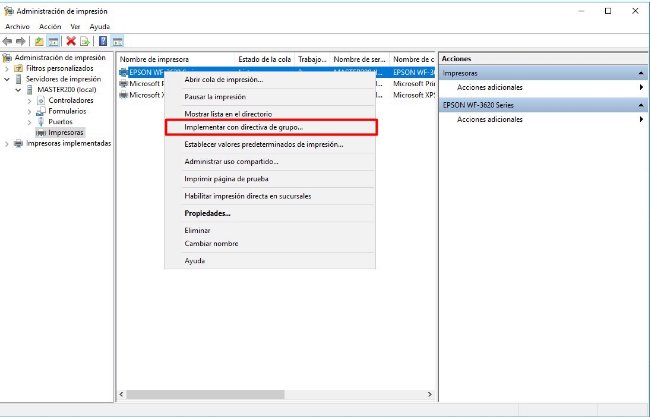
  <figcaption>Implementar con directiva de grupo</figcaption>
</figure>

Se  abrirá  el  cuadro  de  dialogo   y  haremos  clic  en  `Examinar...`  para  seleccionar  a  qué  directiva  queremos  añadir  la configuración de la impresión:

<figure>
  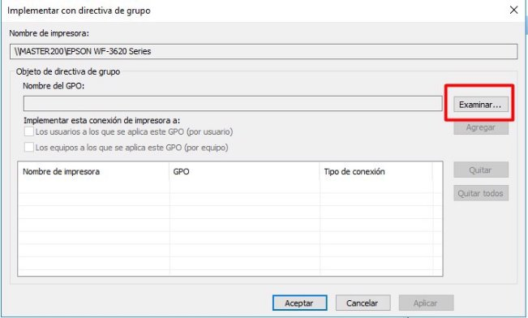
  <figcaption>Implementar con directiva de grupo</figcaption>
</figure>

<figure>
  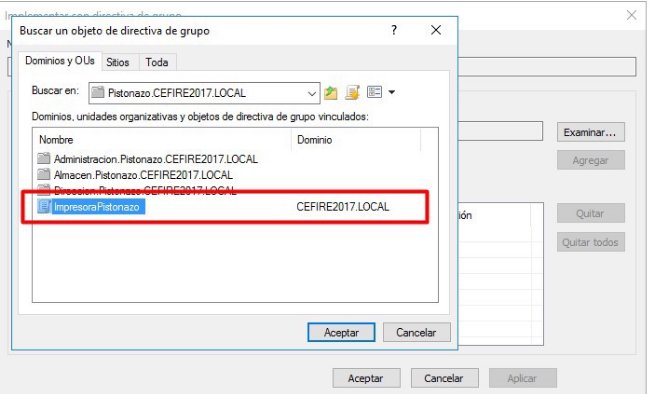
  <figcaption>Seleccionar la GPO</figcaption>
</figure>

<figure>
  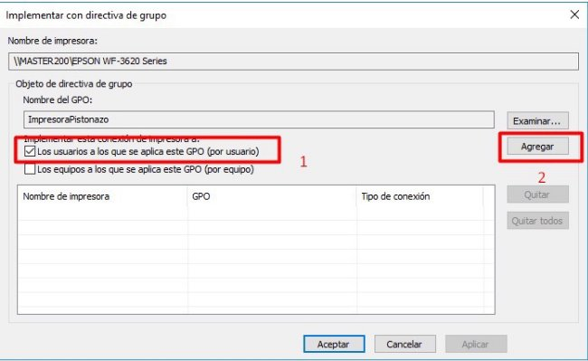
  <figcaption>Añadir GPO aplicada por usuario</figcaption>
</figure>

<figure>
  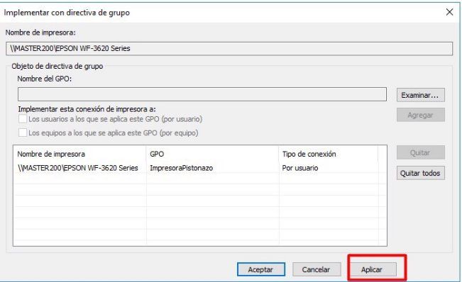
  <figcaption>Aplicar la GPO</figcaption>
</figure>

- Si ahora iniciamos sesión con un usuario de Pistonazo, veremos que la Impresora se ha conectado y podemos imprimir en ella:

<figure>
  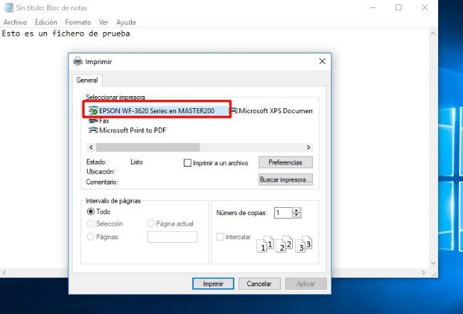
  <figcaption>Impresora conectada por GPO</figcaption>
</figure>

Si iniciáramos sesión con otro usuario que no fuera de Pistonazo, no conectaría la impresora:

<figure>
  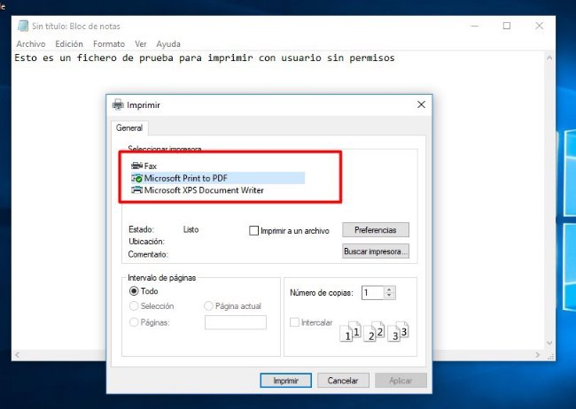
  <figcaption>Usuario sin permisos de conexión</figcaption>
</figure>

## Controladores Adicionales

Para empezar, nos aseguraremos de que estén instalados los drivers de la impresora para las distintas arquitecturas de equipos presentes en la red. Para ello en la pestaña `Compartir` haremos clic en el botón `Controladores adicionales` .

<figure>
  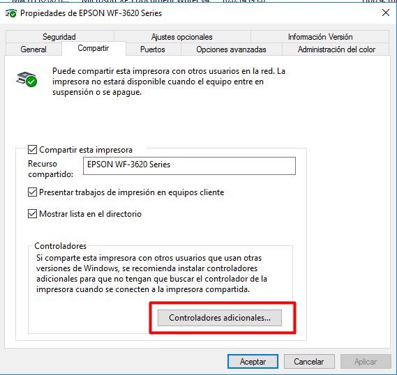
  <figcaption>Controladores adicionales</figcaption>
</figure>

Nos aparecerá un cuadro  donde podremos seleccionar la arquitectura de los controladores de la impresora:

- x64: arquitectura de 64 bits.
- x86: arquitectura de 32 bits

<figure>
  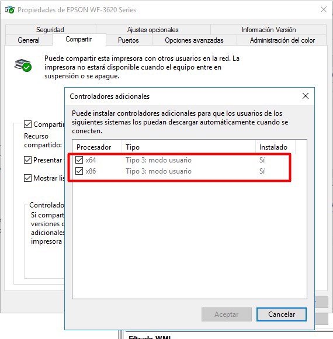
  <figcaption>Controladores x86 y x64</figcaption>
</figure>

Instalaremos  aquellas  versiones  que  necesitemos  en  función  de  los  equipos  de  nuestra  red  y  los  equipos  clientes  se descargarán los drivers adecuados accediendo al recurso compartido print$ que se halla alojado en el servidor en la ruta `C:\system32\spool\drivers` , de una manera transparente al usuario.

## Preferencias de Impresión

Podemos configurar las `Preferencias de impresión` en la pestaña `General`:

<figure>
  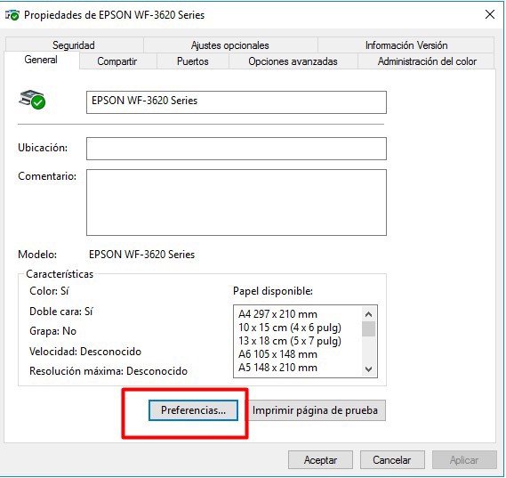
  <figcaption>Preferencias de Impresión</figcaption>
</figure>

Ahí podemos definir aspectos como el formato de ahorro en papel imprimiendo en modo folleto, aunque posteriormente el usuario pueda modificar esta configuración antes de enviar el trabajo de impresión:

<figure>
  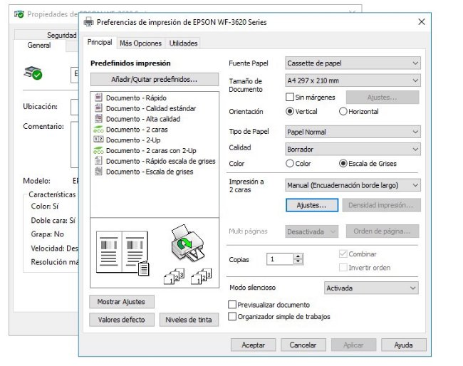
  <figcaption>Preferencias de Impresión</figcaption>
</figure>

## Configuración de la Impresión

Supongamos  que  disponemos  de  una  única  impresora  física  en  nuestra  empresa,  y  queremos  configurarla  de  manera diferente para cada departamento. 

Por ejemplo, podríamos querer asignar prioridades diferentes: 
- El grupo Almacén podría tener una prioridad en la impresión inferior a la del grupo Dirección. 
- Además también podríamos hacer una planificación en la que el grupo Almacén solo pudiera imprimir de 8.00 a 16.00.
- Mientras que el grupo Dirección podría imprimir durante todo el día. Veamos como implantar esta política de administración paso a paso.

En primer lugar tenemos que crear dos impresoras lógicas que apunten al mismo dispositivo de impresión físico, una para la sección de Dirección y otra para la sección de Administración:

<figure>
  
  <figcaption>Permisos diferentes de Impresión</figcaption>
</figure>

- Es importante que ambas impresoras estén compartidas, y que los miembros de los respectivos grupos tengan permisos para imprimir:

<figure>
  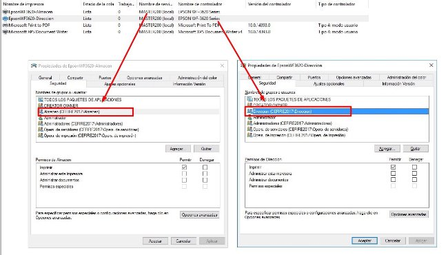
  <figcaption>Configuración de dos impresoras lógicas</figcaption>
</figure>

Configuraremos las impresoras (lógicas) de Almacén y Dirección  como hemos planificado al principio de este apartado:

<figure>
  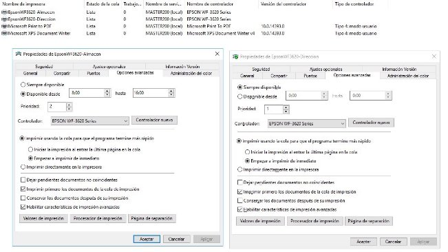
  <figcaption>Configuración de opciones avanzadas</figcaption>
</figure>

- A continuación creamos un `GPO` para cada grupo que nos permitirá desplegar la correspondiente impresora a los miembros de cada grupo:

<figure>
  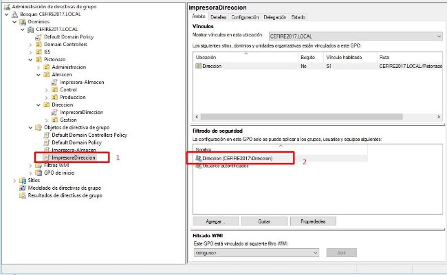
  <figcaption>Definición de las GPOs</figcaption>
</figure>

- En el siguiente paso implementamos la conexión de cada impresora mediante su correspondiente GPO:

<figure>
  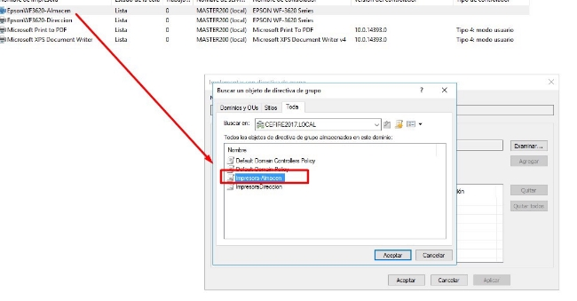
  <figcaption>Implementación de la GPO Almacén I</figcaption>
</figure>

<figure>
  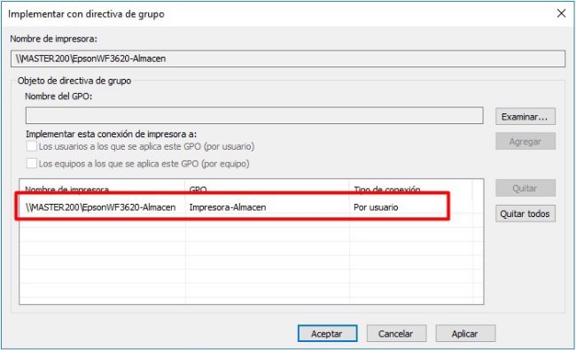
  <figcaption>Implementación de GPO a Almacén II</figcaption>
</figure>

- Y hacemos el mismo proceso para Dirección:

<figure>
  
  <figcaption>Implementación de la GPO a Dirección</figcaption>
</figure>

Para finalizar ejecutamos `gpupdate/force` en el controlador de dominio y ya tendremos implementadas las impresoras con sus respectivas restricciones para los grupos de Almacén y Dirección.

!!! note "**NOTA**"
    Destacar de nuevo que hemos creado dos impresoras lógicas que apuntan al mismo dispositivo físico con el fin de realizar una gestión de la impresión física diferenciada en función del usuario o grupo que envíe los trabajos a la impresora.

## Comprobación de la configuración

Para comprobar la configuración anterior, vamos a iniciar sesión en un equipo cliente con el usuario usucont1 perteneciente al grupo Almacén, y vamos a enviar un trabajo de impresión fuera del horario en el que tiene permitido imprimir:

<figure>
  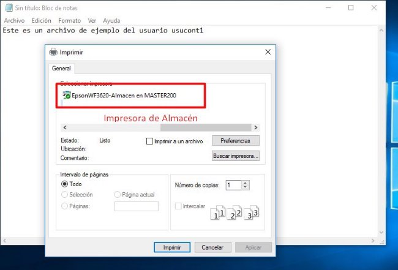
  <figcaption>Impresora de usuario de Almacén</figcaption>
</figure>

Vemos en la figura anterior que aparece automáticamente la nueva impresora `EpsonWF3620-Almacen`.

Si nos vamos al controlador de dominio y abrimos el asistente de impresión vemos que efectivamente el trabajo está en la cola, pero no se está imprimiendo por restricciones horarias:

<figure>
  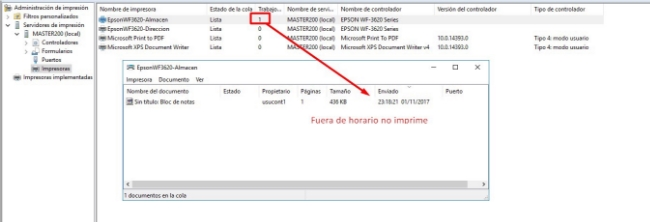
  <figcaption>Impresora con restricción horaria</figcaption>
</figure>

Ahora iniciaremos una sesión con el usuario usudir1 que es del grupo de Dirección:

<figure>
  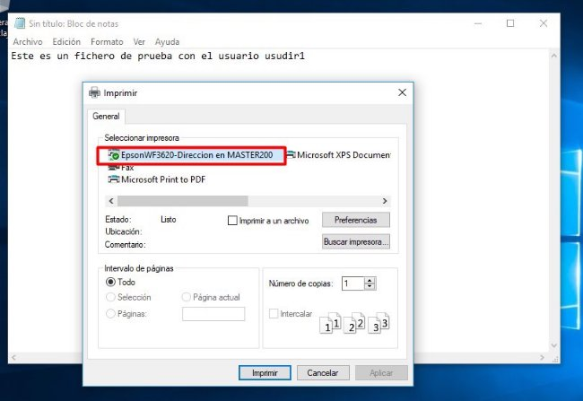
  <figcaption>Impresora sin restricción para grupo Dirección</figcaption>
</figure>

## Actividades de desarrollo UD6_02

En esta actividad instalaremos una impresora en el controlador de dominio y la compartiremos y administraremos en red, como hemos visto en los diferentes apartados de este tema.

La principal diferencia con lo visto hasta ahora consiste en que la impresora que 'conectaremos' al servidor será una impresora pdf, por lo que con el instalable se creará el puerto de impresora y se instalarán los drivers necesarios de una manera prácticamente trasparente para nosotros.

1. En primer lugar instalaremos la impresora pdf, puede ser [PDF Creator](https://sourceforge.net/projects/pdfcreator/)
2. La descargaremos de aquí e la instalaremos con las opciones por defecto pero en modo servidor, Investiga por Internet como instalarla. **Nota**: Si no funciona buscar versiones anteriores.
3. Compartiremos la impresora en red (desde el Administrador de Impresión) para que los usuarios de dominio tengan permiso de impresión.
4. Crearemos una `GPO` en el dominio pero que solo aplicaremos a un grupo que ya tengas configurado de las prácticas de AD (no a la `UO`), llamemos `GRUPOA`.
5. Configura la impresora pdf para que se despliegue automáticamente en todos los usuarios de `GRUPOA` (utiliza la `GPO` que hemos creado en el punto anterior).
6. Crea un documento de texto en un equipo cliente al que has accedido con un miembro del `GRUPOA`.
7. Desde el bloc de notas (notepad) imprime (en la impresora pdf que está albergada en el servidor y que debe aparecer automáticamente a los miembros de `GRUPOA`) el fichero que acabas de generar.
8. Inicia sesión con un usuario que no pertenezca a `GRUPOA` y comprueba que no aparece la impresora pdf en las opciones de impresión.

Adjunta las capturas de pantalla describiendo el proceso, en especial las correspondientes a los puntos 4, 5, 7 y 8.