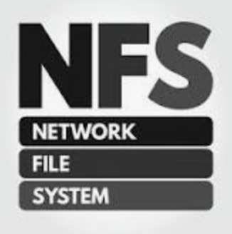
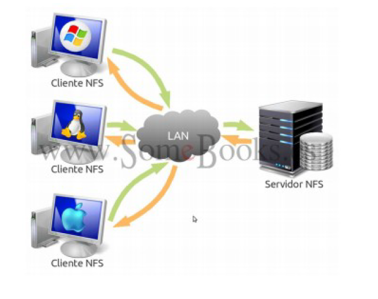
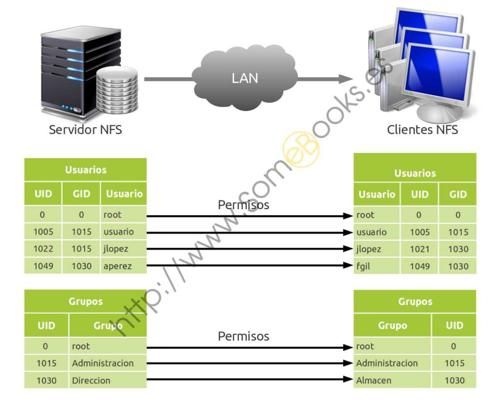
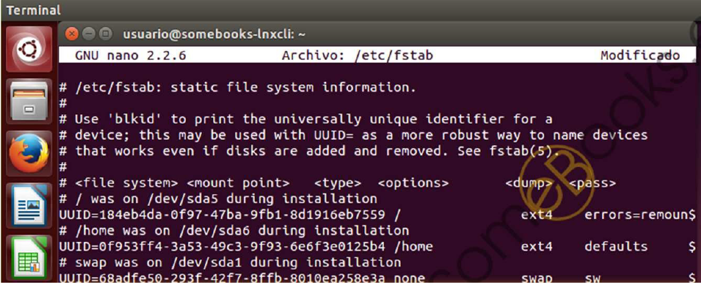

<figure style="float: right;">
    
</figure>

# NFS Network File System

**NFS** es un **protocolo** de nivel de aplicación, El nombre es un poco engañoso "Sistema de Archivos de Red" porque NFS **no es el sistema de archivos real**, sino el protocolo utilizado entre equipos heterogéneos para compartir los datos y también da nombre al servicio que implementa dicho protocolo.

Fue creado por **Sun Microsystems en 1985** con el objetivo de ser independiente al sistema operativo instalado en la máquina, y al protocolo de transporte utilizado (TCP o UDP), esto fue posible gracias a que está implementado sobre los protocolos **XDR** (presentación) y **ONC RPC** (sesión).

!!! note "Nota:"
    - **RPC** es un servicio genérico de capa de sesión que se utiliza **para implementar la funcionalidad de trabajo por Internet cliente/servidor**. Amplía la noción de un programa que llama a un procedimiento local en un ordenador host en particular, a la llamada a un procedimiento en un dispositivo remoto a través de una red.
    - **XDR** es un lenguaje descriptivo que **permite definir los tipos de datos de manera coherente**. XDR reside conceptualmente en la capa de presentación; sus representaciones universales permiten intercambiar datos utilizando NFS entre ordenadores que pueden utilizar métodos internos muy diferentes para almacenar datos. 

Las versiones del protocolo son:

!!! quote "Versiones NFS"
    - NFSv2 released in 1985 (ya no soportado on Ubuntu and RedHat).
    - NFSv3 released in 1995
    - NFSv4 released in 2003 (Desarrollado por Internet Engineering Task Force (IETF)).
    - NFSv4.1 released in 2010
    - NFSv4.2 released in 2016

!!! note "NOTA"
    **Internet Engineering Task Force** ​ es una organización internacional abierta de normalización, que tiene como objetivos el contribuir a la ingeniería de Internet, actuando en diversas áreas, como transporte, enrutamiento y seguridad. Se creó en los Estados Unidos en 1986.

El orden en la Pila OSI se puede observar en la siguiente figura:

<figure>
  
  <figcaption>NFS en el protocolo OSI tcp/ip.</figcaption>
</figure>

## Características Generales

El protocolo **NFS**:

- Es utilizado para **sistemas de archivos distribuido** en un entorno de red de computadoras de área local.
- Posibilita que distintos sistemas conectados a una misma red accedan a ficheros remotos como si se tratara de locales.
- Se utiliza en **las redes de área local para crear un sistema de archivo distribuido**.
- Su **principal objetivo** es que varios usuarios puedan acceder a los archivos compartidos como si fueran locales.
- Se **centraliza** por tanto el almacenamiento de la red.
- La mayoría de los sistemas operativos tienen un amplio soporte nativo para NFS, incluyendo **Linux** y **macOS** y las versiones más recientes de **Windows** también tienen soporte nativo para montar NFS.

!!! warning "**IMPORTANTE**"
    Para el uso de **NFS en Windows** es necesario usar **Windows 8** Enterprise o superior o recurrir a software de terceros.

Se basa en la Arquitectura Cliente servidor y destacan los siguientes componentes:

<figure>
  
  <figcaption>Esquema de red NFS.</figcaption>
</figure>


### VFS virtual file system

Un sistema de archivos virtual o conmutador de sistema de archivos virtual es una capa de abstracción encima de un sistema de archivos más concreto. El propósito de un **VFS** es permitir que las aplicaciones cliente tengan acceso a diversos tipos de sistemas de archivos concretos de una manera uniforme.

<figure>
  
  <figcaption>Diagrama de funcionamiento de VFS.</figcaption>
</figure>


## Ventajas NFS

1. Al **centralizar los recursos** evitamos tener varias copias en diferentes nodos de la red. &#8594 Ahorrando espacio y evitando duplicidad de información.
2. Asegura **integridad de datos**, al obligar a que todas las escrituras sean finalizadas antes de que otro usuario haga otras modificaciones.
3. Permite **almacenar toda la información de los perfiles de usuario**, incluyendo su directorio `/home`. Por tanto un usuario podrá acceder a su partición de datos desde cualquier nodo de la red.
4. Permite **compartir dispositivos de almacenamiento externos** como memorias flash o discos externos. Esto permite ahorrar costes en la compra de equipamiento al ahorrar su aprovechamiento.
5. Características de **seguridad para el control de acceso**: `ACLS` o `KERBEROS`.

## Desventajas NFS

La mayoría de las desventajas de NFS se derivan del hecho de que fue diseñado hace décadas y para la comunicación con un solo servidor:

- **NFS** no soporta "**failover**", es decir, conmutación por error. A nivel de IP a menudo ocurren interrupciones, retrasos y errores visibles para el usuario, los cales no son gestionados por NFS (para solucionarlo se utiliza "stale file handle" Control de archivo de estado).
- **NFS** no tiene **balanceo de carga**. Como NFS fue diseñado para un solo servidor presenta una falta de equilibrio de carga en un sistema de almacenamiento, y de una gestión optima de escalabilidad horizontal.
- **NFS** no realiza "**checksums**". Esto era un gran problema inicial debido a la alta probabilidad de "checksums" que existían en los años 90, pero actualmente es simplemente una deficiencia ya que es una herramienta de corrección desaprovechada, puesto que los dispositivos "hardware" tienen instrucciones para gestionar los "Checksum" correctamente.
- **NFS** tiene una **carencia en el control de permisos**, por ello se combina con **LDAP** que se encargará de la gestión de los permisos. La carencia es debida a que **NFS** traspasa los ficheros a los clientes con los permisos relacionados con el UID y el GID existentes en el servidor. Es decir, que si en el servidor existe un usuario “javi” con UID 1003 y en el cliente hay un usuario “maría” con UID 1003 ambos tendrán los mismos permisos.

<!-- ## Permisos en NFS.

**NFS** tiene una carencia en el control de permisos, por ello se combina con **LDAP** que se encargará de la gestión de los permisos. La carencia es debida a que en UNIX cada usuario tiene un identificador llamado **UID** y cada grupo de usuarios tiene otro identificador **GID**.

- NFS traspasa los ficheros a los clientes con los permisos relacionados con el UID y el GID existentes en el servidor. Es decir, que si en el servidor existe un usuario “javi” con UID 1003 y en el cliente hay un usuario “maría” con UID 1003 ambos tendrán los mismos permisos.
Ejemplo (somebooks.es):

<figure>
  
  <figcaption>Ejemplo de problema de permisos en NFS.</figcaption>
</figure>

A continuación se explican los problemas del ejemplo anterior:

- **root**: Como coinciden tanto el UID como el GID el usuario root del cliente podrá actuar como usuario root del servidor NFS, al no ser que tengamos la opción de root_squash activada.
- **usuario**: Al igual que pasa con root al tener mismo UID y GID tanto en el servidor como en el cliente.
- **jlopez**: no tiene el mismo UID o GID en el servidor que en el cliente. No obstante en el cliente tiene un GID 1030 por lo que tendrá los permisos del grupo “**Administración**”, cuando realmente dicho usuario no pertenece a ese grupo.
- **fgil**: El usuario fgil, el cual solo se encuentra en el cliente, tendrá los permisos del usuario aperez del servidor, ya que comparten UID. Además pertenecerá al grupo de “**Dirección**” debido a su GID. -->

<!-- ## Montaje Automático de un cliente NFS.

En los sistemas UNIX los volúmenes (discos duros, servidores, usb, etc) pueden montarse automáticamente al arrancar. Esto se consigue editando el fichero `/etc/fstab` (file systems table).

- Fichero `/etc/fstab`:

- Cada línea pertenece al montaje de un volumen y se compone de:

1. **Dispositivo que se va a montar**: `“IP del servidor”:”ruta de la carpeta compartida”`

!!! example "**Ejemplo:**"
    `192.168.0.100:/home/usuarioServidor/Escritorio/compartido`

2. **Punto de montaje**: Donde queremos que se monte en nuestro equipo.

!!! example "**Ejemplo:**"
    `/mnt/nfs/compartir`

3. **Sistema de archivos**: Indica el sistema de archivo utilizado en el volumen. En este caso será “nfs”.

4. **Opciones de montaje**, usaremos las siguientes: `auto,noatime,nolock,bg,nfsvers=3,intr,tcp,actimeo=`

5. **Frecuencia de Respaldo**: Tiempo con el que se realiza copia de seguridad, si su valor es 0 no se realiza copia.

6. **Orden de revisión**: Uso para la herramienta fsck para revisar errores en el volumen. Si su valor es 0 no se realiza revisión.

- **Ejemplos:**

``` yaml
192.168.1.10:/home /mnt/nfs/home nfs auto,noatime,nolock,bg,nfsvers=3,intr,tcp,actimeo=1800 0 0

192.168.1.10:/home/usuarioServidor/Escritorio/compartir /mnt/nfs/compartir nfs

auto,noatime,nolock,bg,nfsvers=3,intr,tcp,actimeo=1800 0 0
```

<figure>
  
  <figcaption>Ejemplo de problema de fstab.</figcaption>
</figure>

!!! note "**Nota:**"
    Finalmente es necesario reiniciar la máquina.

## Instalación NFS.

- Servidor:

1. Actualiza repositorios.
2. Instala el paquete nfs-kernel-server.

- Cliente:

1. Actualiza repositorios.
2. Instala el paquete nfs-common.
3. Montar en una carpeta la carpeta compartida del servidor.

### Configuración General NFS.

- Servidor:

1. Crea la carpeta compartida.
2. Comprobar permisos en el servidor dependiendo de lo restrictivo que deba ser.
3. Modifica la configuración de los recursos compartidos en `/etc/exports`.
4. Actualiza los cambios:

``` yaml
sudo exportfs –a
sudo systemctl restart nfs-kernel-server
```

- Cliente:

- Montar en una carpeta la carpeta compartida del servidor.

``` yaml
sudo mount IPSerivdor:/RutaCarpetaCompartida /RutaDondeSeMontaEnCliente
```

!!! example "**Ejemplos:**"

``` yaml
mount 192.168.18.4:/home/alumno/compartida /home/salva/compartida
```

### Fichero de Configuración NFS (/etc/exports).

- Cada recurso compartido que se añada debe ir en una nueva línea.
- Los nombres de clientes/usuarios no pueden tener espacios.
- Entre el nombre de usuario y las opciones no hay espacio en blanco.
- Las líneas tienen el siguiente formato:

``` yaml
 “ruta_micarpeta” cliente1(opciones) cliente2(opciones)...clienteN(opciones)
```

!!! example "**Ejemplos:**"

``` yaml
/home *(rw,sync,no_subtree_check)
```

``` yaml
/home/javi/Escritorio/SOR/COMPARTIR/ *(rw,sync,no_subtree_check)
```

``` yaml
/home 192.168.0.19(rw,sync,no_subtree_check)
```

``` yaml
/home 192.168.0.0/24(rw,sync,no_subtree_check)
```

#### Opciones:

- **ro(read-only)**: La carpeta compartida será de sólo lectura. Es la opción predeterminada.
- **rw (read-write)**: El usuario podrá realizar cambios en el contenido de la carpeta compartida.
- **root_squash**: Evita que los usuarios con privilegios administrativos los mantengan, sobre la carpeta compartida, cuando se conectan remotamente. En su lugar, se les trata como un usuario `“nfsnobody”` que es un usuario con permisos mínimos. Es la opción predeterminada.
- **no_root_squash**: Deshabilita la característica anterior.
- **sync**: Evita responder peticiones antes de escribir los cambios pendientes en disco. De tal forma que cada cambio que recibe la escribe en disco y luego confirma que ha sido escrita correctamente. Es la opción predeterminada.
- **async**: Deshabilita la característica anterior. Mejora el rendimiento a cambio de que exista el riesgo de corrupción en los archivos o, incluso, en todo el sistema de archivos, si se produjese una interrupción del fluido eléctrico o un bloqueo del sistema. Recibe la orden de escritura y confirma al cliente que ha sido realizada con éxito (mentira, ya que no ha sido realizada), acto seguido puede recibir X órdenes de otros clientes y a todos les hará lo mismo, finalmente realiza escribe todos los cambios a la vez. Por tanto es más rápido que el método síncrono ya que no debe realizar tantos accesos a memoria.
- **subtree_check**: Cuando el directorio compartido es un subdirectorio de un sistema de archivos mayor, **NFS** comprueba los directorios por encima de éste para verificar sus permisos y características. Es la opción predeterminada.
- **no_subtree_check**: Deshabilita la característica anterior, lo que hace que el envío de la lista de archivos sea más rápido, pero puede reducir la seguridad. -->

## Práctica asociada

- [PR601: Instalación y configuración de NFS en contenedor Ubuntu Server](PracticaNFS.md)
<!-- 3. [Instalación y configuración de NFS en cliente Windows 10](NFS3.md) -->

<!-- - [NFS parte 2](http://somebooks.es/nfs-parte-2-instalacion-en-un-cliente-ubuntu-20-04-lts/)
- [NFS parte 3](http://somebooks.es/nfs-parte-3-instalacion-en-un-cliente-windows-10/)
- [NFS parte 4](http://somebooks.es/nfs-parte-4-compartir-almacenamiento-en-un-servidor-ubuntu-20-04-lts/)
- [NFS parte 5](http://somebooks.es/nfs-parte-5-acceder-a-la-carpeta-compartida-desde-un-cliente-ubuntu-20-04-lts/) -->