# Procesos del Sistema

En esta unidad se trabaja la **administración de procesos**: qué son, cómo los planifica el sistema operativo, la relación con los hilos, y cómo listar, priorizar o finalizar procesos desde Shell y PowerShell, así como el arranque del sistema y la administración de servicios.

## Propuesta didáctica

En esta unidad vamos a trabajar el **RA2 de ASO**:

> **RA2.** *Administra procesos del sistema describiéndolos y aplicando criterios de seguridad y eficiencia.*

### Criterios de evaluación (RA2)

- **CE2a**: Se han descrito los procesos del sistema, sus estados y la función del planificador.
- **CE2b**: Se han diferenciado procesos e hilos y los mecanismos de sincronización.
- **CE2c**: Se han gestionado procesos desde el Shell (listar, prioridad, primer/segundo plano, finalizar).
- **CE2d**: Se han gestionado procesos desde PowerShell.
- **CE2e**: Se ha descrito el arranque del sistema y el papel de los servicios (systemd).
- **CE2f**: Se han administrado servicios con systemctl (iniciar, detener, habilitar, deshabilitar, estado).
- **CE2g**: Se ha desarrollado una herramienta de gestión del sistema (script con interfaz) y se ha documentado su uso.

## Contenidos

**Bloque 1 — Planificador y procesos (Sesión 1)**  
Tipos y estados de procesos. BCP. Multiprogramación. Algoritmos de planificación (FIFO, SJF, SRTF, prioridades, Round Robin).

**Bloque 2 — Hilos y sincronización (Sesión 1–2)**  
Definición de hilo. Multihilo. Señales, mensajes, exclusión mutua. Herramientas gráficas (monitor del sistema, monitor de recursos).

**Bloque 3 — Gestión de procesos en Shell (Sesión 2)**  
Comandos `ps`, `pstree`, `top`. Procesos en primer y segundo plano. `jobs`, `fg`, `bg`. Prioridad con `renice`. Finalizar procesos con `kill`.

**Bloque 4 — Gestión de procesos en PowerShell (Sesión 2–3)**  
`Get-Process`, `Stop-Process`, `Start-Process`. Filtros y propiedades. Procesos en remoto.

**Bloque 5 — Arranque del sistema y servicios (Sesión 3)**  
Secuencia de arranque (BIOS, bootloader, kernel, init). GRUB. Windows BCD. Daemons y systemd.

**Bloque 6 — Administración de servicios (Sesión 3–4)**  
`systemctl start/stop/restart`, `enable/disable`, `status`. Unidades, destinos, enmascarar.

!!! question "Actividades iniciales"
    1. ¿Qué es un proceso y qué información guarda el sistema para cada uno?
    2. ¿Qué diferencia hay entre proceso en primer plano y en segundo plano?
    3. ¿Qué es un hilo y por qué puede interesar el multihilo?
    4. Nombra tres comandos para ver procesos en Linux.
    5. ¿Qué es un daemon o servicio y cuándo se inicia?

### Programación de Aula (4 sesiones)

| Sesión | Contenidos | Actividades | Criterios |
| --- | --- | --- | --- |
| 1 | Planificador, estados, algoritmos. Hilos y sincronización. | Teoría y ejemplos de planificación | CE2a, CE2b |
| 2 | Gestión de procesos en Shell y PowerShell. | Prácticas en terminal | CE2c, CE2d |
| 3 | Arranque del sistema. Systemd y servicios. | Comandos systemctl, estados | CE2e, CE2f |
| 4 | **Reto:** Gestor del sistema con Python y tkinter. | [Reto Procesos](RetoGrupalProcesos.md) | CE2g |

---

## 1. Planificador: procesos, tipos, estados y estructura

**Un proceso es una instancia de un programa en ejecución.** Cada vez que se lanza un programa se crea un proceso; si se lanza el mismo programa dos veces, hay dos procesos distintos.

Cuando el usuario o una aplicación pide la ejecución de un programa, el sistema operativo debe proveer los recursos necesarios: espacio en memoria para instrucciones y datos, y control de ficheros y dispositivos de E/S.

!!! warning
    La **CPU** ejecuta un solo proceso en cada instante. Para optimizar el rendimiento se usan técnicas como la *multiprogramación* y el *multihilado*.

**La multiprogramación** es una técnica de multiplexación que permite la ejecución "simultánea" de múltiples procesos en un único procesador: en realidad hay un único proceso ejecutándose en el procesador a la vez, pero se produce una ilusión de paralelismo.

<figure>
  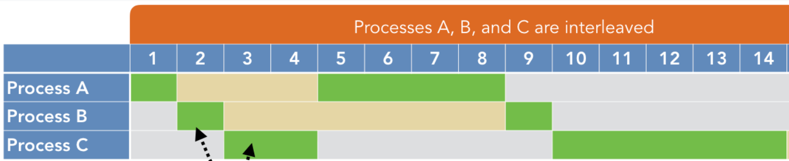
  <figcaption>Ejemplo de multiprogramación</figcaption>
</figure>

### Estructura

Los procesos se estructuran de **forma jerárquica**. El sistema operativo lanza el primero y a partir de este se crean los demás.

El sistema operativo mantiene una **estructura de control** por proceso, llamada **BCP** (Bloque de Control de Proceso), que suele contener:

1. **PID** (Process IDentifier): identificador único del proceso.
2. **Estado del proceso**: listo, en ejecución o bloqueado.
3. **Registros del procesador**: para restaurar el estado en cada conmutación.
4. **Gestión de memoria**: espacio de direcciones y memoria asignada.
5. **Ficheros** con los que opera el proceso.
6. **Procesadores** en los que puede ejecutarse (en sistemas multiprocesador).
7. En sistemas tipo UNIX: **proceso padre** y relaciones entre procesos.
8. **Estadísticas**: tiempo de lanzamiento, tiempo activo, etc.

<figure>
  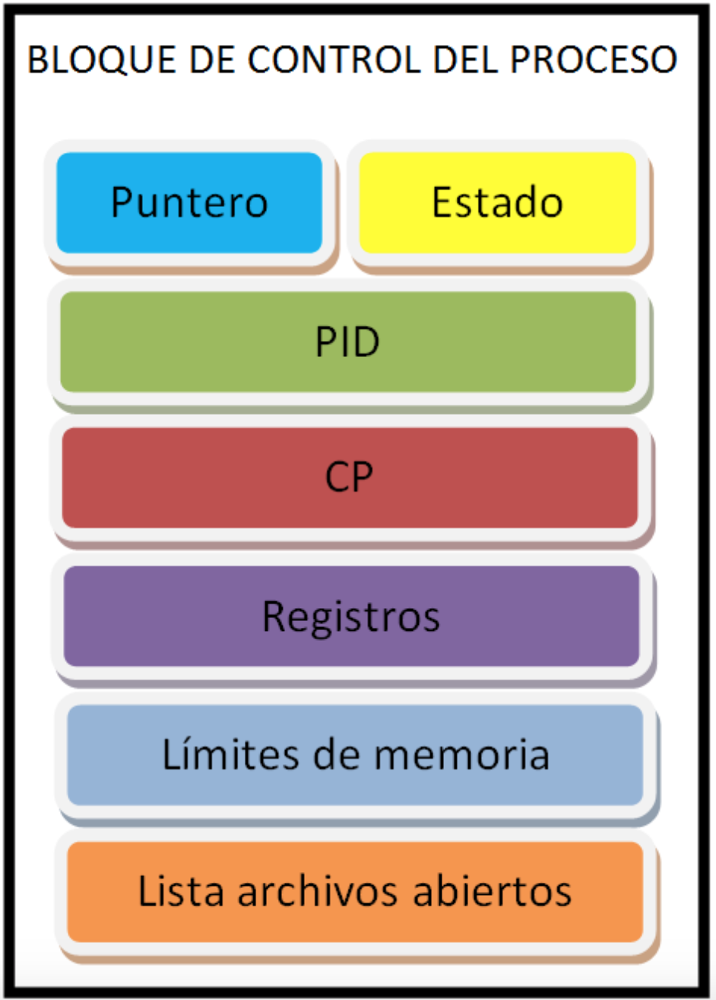
  <figcaption>Componentes del BCP</figcaption>
</figure>

### Tipos de procesos

Según la interacción con el usuario:

- **Primer plano (foreground)**: requieren intervención del usuario.
- **Segundo plano (background)**: se ejecutan sin intervención directa.

Según el modo de ejecución:

- **Modo kernel**: acceso privilegiado; la mayoría de procesos del SO.
- **Modo usuario**: procesos de usuario y aplicaciones.

Según quién los ejecuta:

- **Procesos del sistema**: lanzados por el SO.
- **Procesos de usuario**: lanzados por un usuario.

También se habla de procesos **monohilo** o **multihilo**.

### Estados

Tres estados básicos:

- **En ejecución**: el proceso tiene asignada la CPU.
- **Listo (en espera)**: preparado para recibir el procesador; suele respetarse un orden de llegada.
- **Bloqueado**: esperando un recurso para poder continuar.

<figure>
  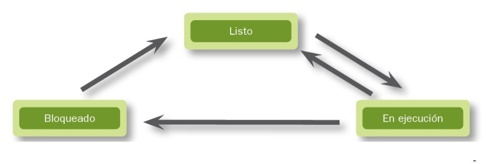
  <figcaption>Estados en los que puede estar un proceso</figcaption>
</figure>

!!! note
    Pueden existir más estados intermedios. Otros útiles: **Parado** (pausado por señal, p. ej. sleep), **Zombie** (hijo terminado que no puede comunicarse con el padre).

### Transiciones de estados

Al ejecutar un programa:

1. Se crea una entrada en la tabla de procesos.
2. Se asigna un PID.
3. Se asignan recursos y memoria.
4. Se cargan páginas del programa en RAM.
5. El proceso pasa a la lista de espera para que el planificador le conceda el procesador.

El planificador cambia los estados según el algoritmo, el quantum o la disponibilidad de recursos. La transición que **no debe ocurrir** (si el planificador es correcto) es pasar directamente de **En espera** o **Bloqueado** a **En ejecución** sin pasar por la concesión del planificador.

<figure>
  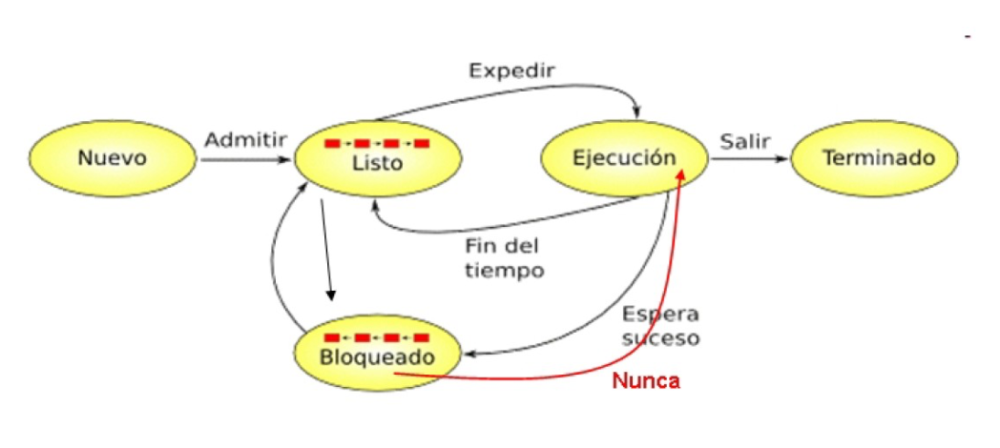
  <figcaption>Transiciones de estados de un proceso</figcaption>
</figure>

### El planificador

El planificador decide **qué proceso o hilo** usa el procesador y **cuánto tiempo**. Los algoritmos suelen buscar:

- Equidad, eficacia, tiempo de respuesta y de regreso, y rendimiento.

**Tipos de algoritmos de planificación:**

#### **FCFS/FIFO**

- Primero en llegar, primero en ser servido; no expulsivo; fácil pero tiempo de espera alto. 
- En **FIFO**, el proceso que **solicita la CPU primero** es el primero en obtenerla. Es el algoritmo de planificación más simple: se mantiene una cola por orden de llegada y el planificador asigna la CPU al proceso que está al frente de la cola. No es expulsivo: un proceso no es interrumpido hasta que termina su ráfaga de CPU (o se bloquea por E/S).

**Características**

- No expulsivo: el proceso mantiene la CPU hasta que termina su tiempo de ráfaga o se bloquea.
- Los trabajos se ejecutan siempre por orden de llegada.
- Fácil de implementar y de entender.
- Inconveniente: el tiempo de espera medio puede ser alto, sobre todo si primero llegan procesos largos.

**Ejemplo numérico**

Supongamos cuatro procesos que llegan en el orden P1, P2, P3, P4, con estos tiempos de ráfaga de CPU (en unidades de tiempo):

| Proceso | Tiempo de ráfaga (CPU) | Orden de llegada |
|---------|------------------------|------------------|
| P1      | 2                      | 1º               |
| P2      | 4                      | 2º               |
| P3      | 3                      | 3º               |
| P4      | 3                      | 4º               |

Con FIFO se ejecutan estrictamente en ese orden: primero P1, luego P2, luego P3, luego P4.

<figure>
  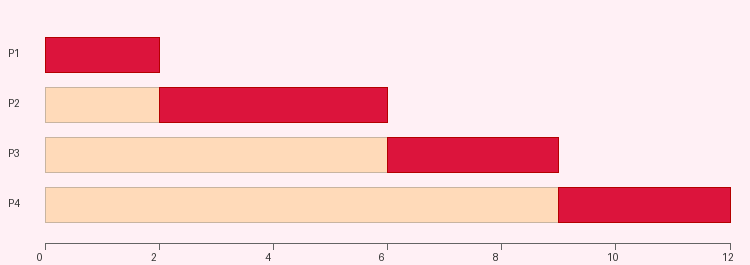
  <figcaption>Diagrama Gantt del ejemplo FIFO: P1 (0–2), P2 (2–6), P3 (6–9), P4 (9–12)</figcaption>
</figure>

**Cálculo de tiempos**

- **Tiempo de espera** (waiting time): tiempo que el proceso pasa en la cola de listos antes de empezar a ejecutarse.
- **Tiempo de retorno** (turnaround time): tiempo desde la llegada hasta que el proceso termina (espera + tiempo de CPU).

En este ejemplo:

| Proceso | Tiempo de espera | Tiempo de retorno |
|---------|------------------|-------------------|
| P1      | 0                | 0 + 2 = **2**     |
| P2      | 2                | 2 + 4 = **6**     |
| P3      | 6                | 6 + 3 = **9**     |
| P4      | 9                | 9 + 3 = **12**    |

- **Tiempo de espera medio** = (0 + 2 + 6 + 9) / 4 = **17/4 = 4,25** unidades.
- **Tiempo de retorno medio** = (2 + 6 + 9 + 12) / 4 = **29/4 = 7,25** unidades.

P1 no espera; P2, P3 y P4 esperan más porque llegan después y hay que esperar a que terminen los anteriores. Si el primer proceso tuviera un tiempo de CPU muy grande, los demás sufrirían un tiempo de espera alto (efecto "convoy").

#### **SJF** (Shortest Job First)

- El de menor tiempo de ejecución primero; no expulsivo; minimiza tiempo de espera medio pero requiere conocer o estimar las ráfagas.
- Se selecciona para ejecutar el proceso **con menor tiempo de ráfaga** (duración de CPU) entre los que están listos. No es expulsivo: una vez que un proceso tiene la CPU, la mantiene hasta terminar su ráfaga.

**Características**

- No expulsivo.
- Minimiza el tiempo de espera medio cuando los trabajos tienen duraciones muy distintas.
- Requiere conocer (o estimar) el tiempo de CPU de cada proceso de antemano.

**Ejemplo numérico**

Mismos cuatro procesos que en FIFO, ordenados ahora por **tiempo de ráfaga** (de menor a mayor): P1(2), P3(3), P4(3), P2(4).

| Proceso | Tiempo de ráfaga (CPU) | Orden de ejecución |
|---------|------------------------|---------------------|
| P1      | 2                      | 1º                  |
| P3      | 3                      | 2º                  |
| P4      | 3                      | 3º                  |
| P2      | 4                      | 4º                  |

<figure>
  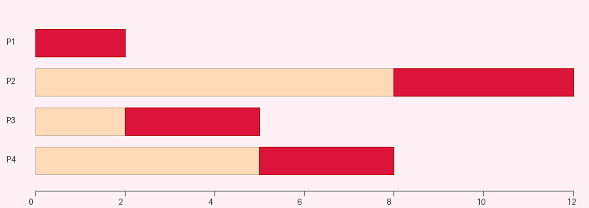
  <figcaption>Diagrama Gantt SJF: P1 (0–2), P3 (2–5), P4 (5–8), P2 (8–12)</figcaption>
</figure>

| Proceso | Tiempo de espera | Tiempo de retorno |
|---------|------------------|-------------------|
| P1      | 0                | **2**             |
| P2      | 8                | **12**            |
| P3      | 2                | **5**             |
| P4      | 5                | **8**             |

- **Tiempo de espera medio** = (0 + 8 + 2 + 5) / 4 = **15/4 = 3,75** unidades.
- **Tiempo de retorno medio** = (2 + 12 + 5 + 8) / 4 = **27/4 = 6,75** unidades.

---

#### **SRTF** (Shortest Remaining Time First)

- Variante expulsiva de SJF: el de menor tiempo restante primero; expulsivo; buenos tiempos de espera cuando llegan trabajos cortos.
- Igual que SJF, pero **expulsivo**: si llega un proceso cuyo tiempo restante de CPU es **menor** que el del proceso que está ejecutando, se le cede la CPU al nuevo. Se elige siempre el proceso con **menor tiempo restante** entre los listos.

**Características**

- Expulsivo.
- Suele dar buenos tiempos de espera cuando hay trabajos cortos que llegan después.
- Requiere conocer (o estimar) el tiempo de CPU y las llegadas.

**Ejemplo numérico**

Cuatro procesos con **llegada** y **ráfaga**: P1(llegada 0, ráfaga 8), P2(1, 4), P3(2, 2), P4(3, 1). En cada instante se ejecuta el de **menor tiempo restante**.

| Proceso | Llegada | Ráfaga (CPU) |
|---------|---------|---------------|
| P1      | 0       | 8             |
| P2      | 1       | 4             |
| P3      | 2       | 2             |
| P4      | 3       | 1             |

Orden de ejecución: 0–1 P1; 1–2 P2 (4 &lt; 7 restante de P1); 2–3 P3 (2 &lt; 4); 3–4 P4 (1 &lt; 2); 4–6 P3; 6–10 P2; 10–17 P1.

<figure>
  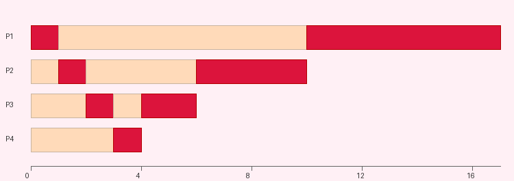
  <figcaption>Diagrama Gantt SRTF: espera (rosa) y ejecución (rojo) por proceso</figcaption>
</figure>

| Proceso | Tiempo de espera | Tiempo de retorno |
|---------|------------------|-------------------|
| P1      | 9                | **17**            |
| P2      | 5                | **9**             |
| P3      | 2                | **4**             |
| P4      | 0                | **1**             |

- **Tiempo de espera medio** = (9 + 5 + 2 + 0) / 4 = **4** unidades.
- **Tiempo de retorno medio** = (17 + 9 + 4 + 1) / 4 = **7,75** unidades.

---

#### **Prioridades**

- Los de mayor prioridad se ejecutan antes; puede ser expulsivo o no según la política; flexible para sistemas con prioridades (tiempo real, interactivos).
- Cada proceso tiene una **prioridad** (por ejemplo, un número: menor = más prioridad). El planificador elige el proceso listo con **mayor prioridad**. Si es **no expulsivo**, una vez en CPU termina su ráfaga; si es **expulsivo**, al llegar uno de mayor prioridad se le cede la CPU.

**Prioridades no expulsivo**

Mismos cuatro procesos con **prioridad** (1 = máxima): P1(prior 3, ráfaga 2), P2(1, 4), P3(2, 3), P4(4, 3). Orden de ejecución: P2 → P3 → P1 → P4.

| Proceso | Prioridad | Ráfaga | Orden |
|---------|-----------|--------|-------|
| P2      | 1         | 4      | 1º    |
| P3      | 2         | 3      | 2º    |
| P1      | 3         | 2      | 3º    |
| P4      | 4         | 3      | 4º    |

<figure>
  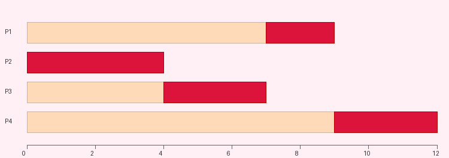
  <figcaption>Prioridades no expulsivo: P2 (0–4), P3 (4–7), P1 (7–9), P4 (9–12)</figcaption>
</figure>

| Proceso | Tiempo de espera | Tiempo de retorno |
|---------|------------------|-------------------|
| P1      | 7                | **9**             |
| P2      | 0                | **4**             |
| P3      | 4                | **7**             |
| P4      | 9                | **12**            |

**Prioridades expulsivo**

P1(0, 5, prior 2), P2(1, 3, prior 1), P3(2, 2, prior 3). Al llegar P2 en 1, tiene prior 1 &gt; 2, así que **expulsa** a P1. Orden: 0–1 P1; 1–4 P2; 4–9 P1; 9–11 P3.

<figure>
  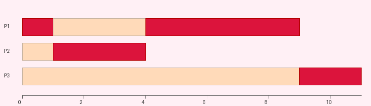
  <figcaption>Prioridades expulsivo: llegadas en 0, 1 y 2; P2 interrumpe a P1</figcaption>
</figure>

---

#### **Round Robin**

- Turnos con un *quantum* fijo; expulsivo por tiempo; evita inanición y reparte la CPU entre todos.
- Todos los procesos listos forman una **cola**; cada uno recibe la CPU durante un **quantum** (p. ej. 2 unidades). Si no termina en ese tiempo, pasa al **final de la cola** y se ejecuta el siguiente. Así se reparte la CPU entre todos y no hay inanición.

**Características**

- Quantum fijo (reloj).
- Todos los procesos avanzan; los cortos terminan antes, los largos van por rachas.
- Suele aumentar el tiempo de espera medio respecto a FIFO o SJF cuando las ráfagas son muy dispares.

**Ejemplo numérico**

Mismos cuatro procesos P1(2), P2(4), P3(3), P4(3), **quantum = 2**. Orden de llegada P1, P2, P3, P4.

| Proceso | Ráfaga (CPU) | Quantum = 2 |
|---------|--------------|-------------|
| P1      | 2            | 0–2 (termina) |
| P2      | 4            | 2–4, 8–10 (termina) |
| P3      | 3            | 4–6, 10–11 (termina) |
| P4      | 3            | 6–8, 11–12 (termina) |

<figure>
  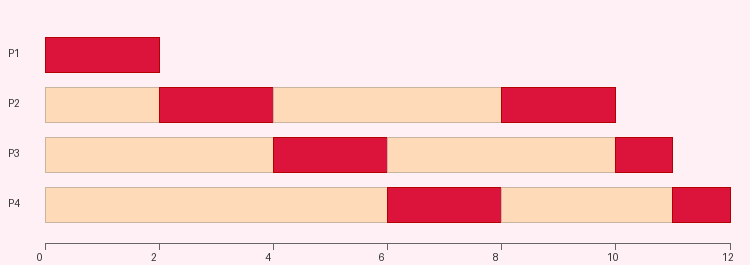
  <figcaption>Round Robin (Q=2): turnos entre P1, P2, P3, P4 hasta que cada uno termina</figcaption>
</figure>

| Proceso | Tiempo de espera | Tiempo de retorno |
|---------|------------------|-------------------|
| P1      | 0                | **2**             |
| P2      | 6                | **10**            |
| P3      | 8                | **11**            |
| P4      | 9                | **12**            |

- **Tiempo de espera medio** = (0 + 6 + 8 + 9) / 4 = **23/4 = 5,75** unidades.
- **Tiempo de retorno medio** = (2 + 10 + 11 + 12) / 4 = **35/4 = 8,75** unidades.

---

## 2. Hilos

Un **hilo** (thread), hebra o proceso ligero es la secuencia de instrucciones más elemental que puede ser gestionada por el planificador.

!!! info "NOTA"
    Un proceso puede ejecutarse como **un solo hilo** (una secuencia de instrucciones). En **multihilo**, partes del mismo proceso pueden ejecutarse en paralelo (varios hilos del mismo programa).

**Diferencia principal**: un proceso tiene su propio BCP y espacio de recursos; los hilos comparten el espacio de memoria y recursos del proceso. Por eso es importante la **sincronización entre hilos**.

<figure>
  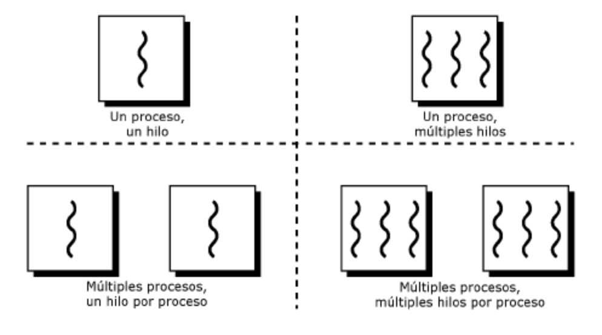
  <figcaption>Estados de procesos e hilos en el navegador</figcaption>
</figure>

<figure>
  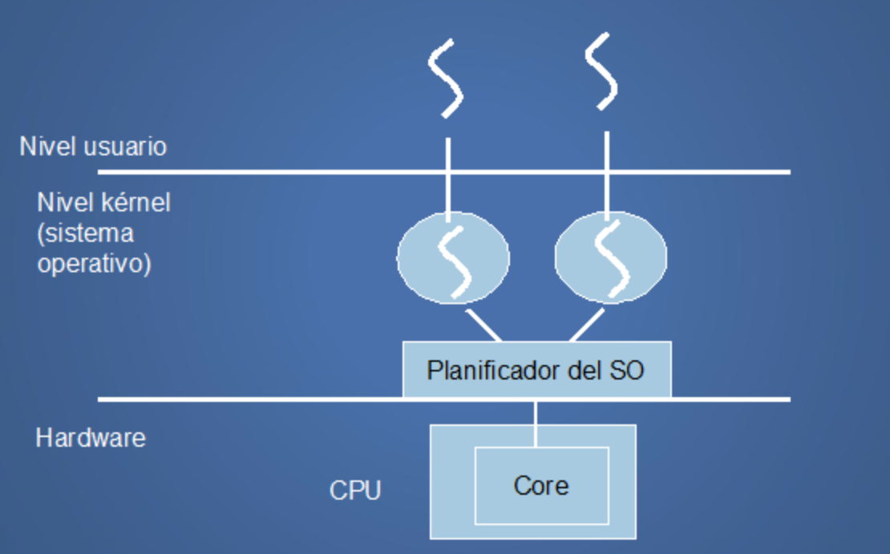
  <figcaption>Procesos e hilos a nivel usuario y kernel</figcaption>
</figure>

Cada hilo tiene identificador, contador de programa y pila propios. Tipos:

- **Hilos a nivel de usuario**: creados por el programador; el núcleo no los gestiona; la sincronización es responsabilidad del programa.
- **Hilos a nivel de kernel**: gestionados por el SO; en sistemas multinúcleo pueden ejecutarse en paralelo.

**Ventajas de los hilos frente a procesos:** más ligeros, cambio de contexto más barato, mayor agilidad si una parte se bloquea, y mejor aprovechamiento en multinúcleo.

!!! note
    Un proceso multihilo no termina hasta que terminan todos sus hilos.

### Sincronización y comunicación entre procesos

Procesos que deben comunicarse o sincronizarse usan **señales** y otros mecanismos:

- **Mensajes**: colas de mensajes para compartir información (incluso en equipos remotos).
- **Señales**: para sincronizar; cada señal tiene un comportamiento por defecto (p. ej. pausar o terminar). Se pueden enviar desde el SO (p. ej. Ctrl+C) o desde programas.
- **Interrupciones y excepciones**: las interrupciones son señales de dispositivos o software al procesador; las excepciones se producen por errores (p. ej. división por cero).

**Interrupción**

Una **interrupción** implica lo siguiente:

- Es una señal que llega al procesador para que detenga su tarea actual y atienda un suceso. Puede ser:
    - De hardware: Por ejemplo, un dispositivo de E/S que requiere atención.
    - De software: Por ejemplo, una llamada al sistema hecha por un programa.
- Cuando ocurre una interrupción:
    - El procesador **guarda el estado** del proceso actual.
    - **Salta** a la rutina específica que maneja esa interrupción (manejador).
    - Tras atender la interrupción, **restaura el estado** y continúa con el proceso que fue interrumpido.
- Las **excepciones** funcionan de forma similar, pero son provocadas por condiciones anómalas durante la ejecución:
    - Ejemplos: división por cero, acceso inválido a memoria, etc.
    - El sistema debe reaccionar, por ejemplo, terminando el proceso o mostrando un error.
- Es posible **inhibir las interrupciones por software** en determinados tramos críticos, para evitar que una operación importante se quede a medias por una interrupción inesperada.

<figure>
  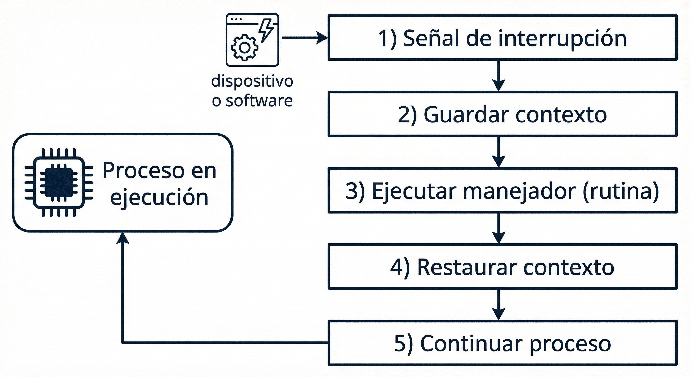
  <figcaption>Resumen del concepto de interrupción: señal, guardado de contexto, manejador y vuelta al proceso</figcaption>
</figure>

### Casos y soluciones de sincronización

- **Condiciones de competencia**

Una **condición de competencia** ocurre cuando:

- **Dos o más procesos acceden al mismo recurso** (por ejemplo, una variable en memoria, un archivo o un dispositivo).
- **El resultado final depende del orden en que se ejecutan las instrucciones** de cada proceso.
- Por ejemplo:
    - Si el planificador asigna la CPU primero a P1 y luego a P2, el valor del recurso será uno determinado.
    - Si el orden es otro (primero P2, luego P1), el valor puede cambiar o se puede perder alguna actualización.
- **Sin mecanismos de sincronización** (como exclusión mutua, cerraduras, etc.):
    - El programa se vuelve **no determinista**.
    - Pueden aparecer fallos difíciles de reproducir.

<figure>
  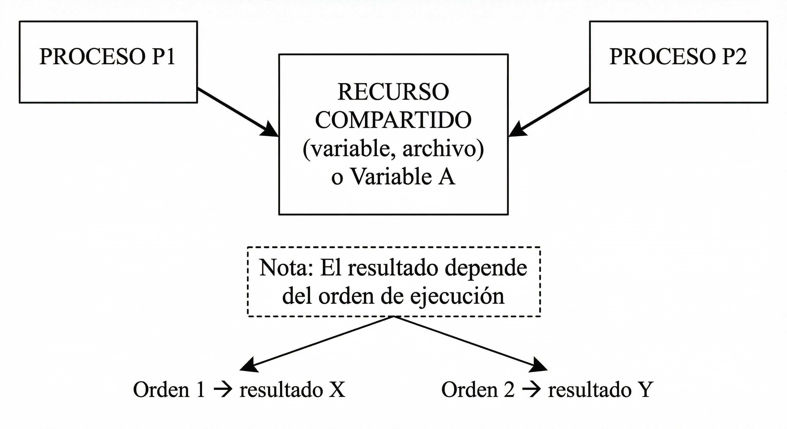
  <figcaption>Condiciones de competencia: P1 y P2 acceden al mismo recurso; el resultado depende del orden de ejecución</figcaption>
</figure>

!!! tip "Solución principal: Exclusión mutua"
    La solución más utilizada para evitar condiciones de competencia es la **exclusión mutua** mediante una **sección crítica**: solo un proceso puede modificar el recurso compartido en cada momento. Se suelen emplear mecanismos como **semáforos**, **variables cerradura** o **monitores** para gestionar este acceso.

**Exclusión mutua**

La **exclusión mutua** evita que dos procesos accedan a la vez al mismo recurso (o a la misma zona de código que lo modifica). La **sección crítica** es el tramo del programa donde se usa ese recurso compartido. La regla es: **solo un proceso puede estar dentro de su sección crítica** en cada instante. Para entrar, el proceso debe “adquirir” el permiso (p. ej. mediante un semáforo o una cerradura); al salir, lo libera para que otro pueda entrar. Así se evitan condiciones de competencia sobre el recurso.

<figure>
  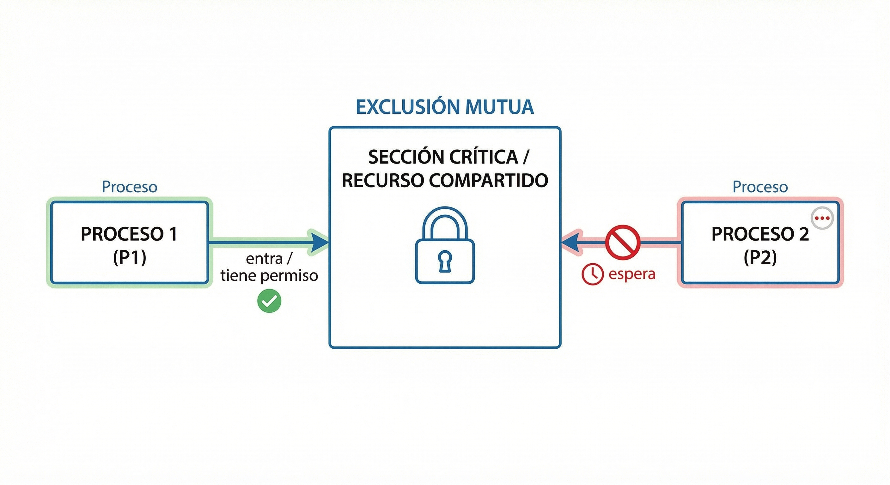
  <figcaption>Exclusión mutua: un solo proceso en la sección crítica; el otro espera hasta que se libere</figcaption>
</figure>

**Interbloqueo (abrazo)**

El **interbloqueo** se da cuando dos o más procesos se bloquean entre sí. Sus características principales son:

- Cada proceso posee un recurso y necesita otro que está en manos del otro proceso.
- Ningún proceso libera su recurso hasta conseguir el recurso que necesita.
- Se genera una situación de espera infinita (deadlock) y ningún proceso puede avanzar.
- Ejemplo típico:
    - **P1** tiene **R1** y espera **R2**.
    - **P2** tiene **R2** y espera **R1**.

<figure>
  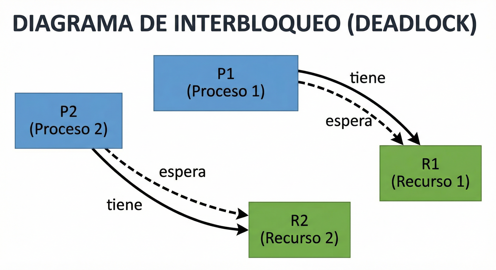
  <figcaption>Interbloqueo: P1 retiene R1 y espera R2; P2 retiene R2 y espera R1</figcaption>
</figure>

**Para evitar el interbloqueo se pueden emplear, entre otros, los siguientes métodos:**

- Protocolos para el orden de solicitud de recursos.
- Uso de temporizadores (timeouts) para liberar recursos tras un cierto tiempo de espera.
- Detección y recuperación de situaciones de interbloqueo.
- Evitar que se cumplan simultáneamente las siguientes 4 condiciones típicas:
    - Exclusión mutua
    - Retención y espera
    - No expropiación
    - Espera circular

### Herramientas gráficas

- **GNU/Linux**: `ksysguard` (KDE), `gnome-system-monitor` (GNOME). En Debian/Ubuntu: Aplicaciones → Herramientas del sistema → Monitor del sistema.

<figure>
  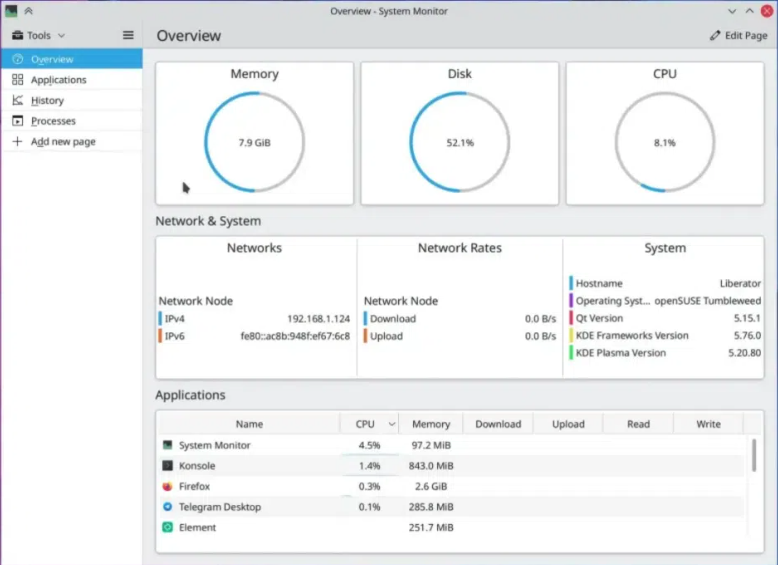
  <figcaption>Monitor de recursos (Linux)</figcaption>
</figure>

- **Windows**: Administrador de tareas → pestaña Rendimiento → Monitor de recursos (procesos y subprocesos).

<figure>
  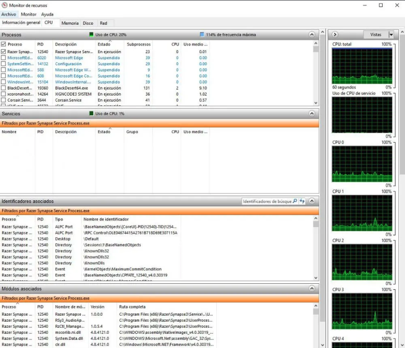
  <figcaption>Monitor de recursos (Windows)</figcaption>
</figure>

- **macOS**: Monitor de actividad, con subprocesos enumerados.

<figure>
  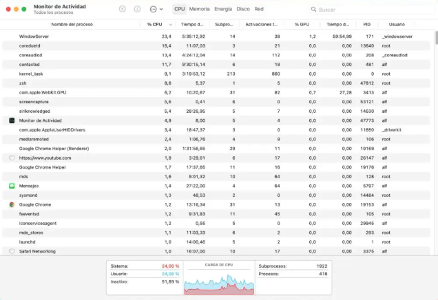
  <figcaption>Monitor de actividad (Mac)</figcaption>
</figure>

---

## 3. Gestión de procesos en Shell (Linux)

Cuando un proceso genera otro, se denomina **padre** al proceso original y **hijo** al generado. Por ejemplo, la terminal es en sí misma un proceso; al ejecutar un comando como `ls -l`, el sistema crea un proceso hijo del shell para ejecutar dicha instrucción.

### Listado de comandos bash de procesos

#### Identificación de procesos

```bash
top                    # Listar todos los procesos de forma interactiva
htop                   # Listar todos los procesos de forma interactiva
ps all                 # Listar todos los procesos
pidof foo              # Devolver el PID de todos los procesos foo

CTRL+Z                 # Suspender un proceso en primer plano
bg                     # Reanudar un proceso suspendido y ejecutarlo en segundo plano
fg                     # Traer el último proceso en segundo plano al primer plano
fg 1                   # Traer al primer plano el proceso en segundo plano con ese PID

sleep 30 &             # Pausar 30 segundos y ejecutar el proceso en segundo plano
jobs                   # Listar todos los trabajos en segundo plano
jobs -p                # Listar todos los trabajos en segundo plano con su PID

lsof                   # Listar todos los archivos abiertos y el proceso que los usa
lsof -itcp:4000        # Devolver el proceso que escucha en el puerto 4000
```

#### Prioridad de procesos

Las prioridades van de -20 (máxima) a 19 (mínima).

```bash
nice -n -20 foo        # Cambiar la prioridad del proceso por nombre
renice 20 PID          # Cambiar la prioridad del proceso por PID
ps -o ni PID           # Mostrar la prioridad del proceso con ese PID
```

#### Finalizar procesos

```bash
CTRL+C                 # Finalizar un proceso en primer plano
kill PID               # Finalizar el proceso por PID de forma ordenada (señal TERM).
kill -9 PID            # Finalizar forzadamente el proceso por PID (señal SIGKILL).
pkill foo              # Finalizar el proceso por nombre de forma ordenada (señal TERM).
pkill -9 foo           # Finalizar forzadamente el proceso por nombre (señal SIGKILL).
killall foo            # Finalizar todos los procesos con ese nombre de forma ordenada.
```

### Explicación de comandos principales

#### Comando `ps`

Muestra información sobre procesos en ejecución.

- `ps`: procesos del usuario actual.
- **-a**: procesos de todos los usuarios con terminal (tty).
- **-x**: procesos sin terminal asociado (p. ej. daemons).
- **-e**: todos los procesos.
- **-f**: formato extendido (PPID, STIME, etc.).
- **-ef**: todos con formato extendido.
- **-u usuario**: procesos de un usuario.

Columnas típicas: **PID**, terminal (TTY), tiempo de CPU, nombre del proceso.

!!! example "Salida de ps -f (Ubuntu)"
    ```text
    root@sor:/home/sor# ps -f
    UID          PID    PPID  C STIME TTY          TIME CMD
    root        2201    2200  0 16:24 pts/1    00:00:00 sudo su
    root        2202    2201  0 16:24 pts/1    00:00:00 su
    root        2203    2202  0 16:24 pts/1    00:00:00 bash
    root        2337    2203  0 16:29 pts/1    00:00:00 ps -f
    ```

<!-- <figure>
  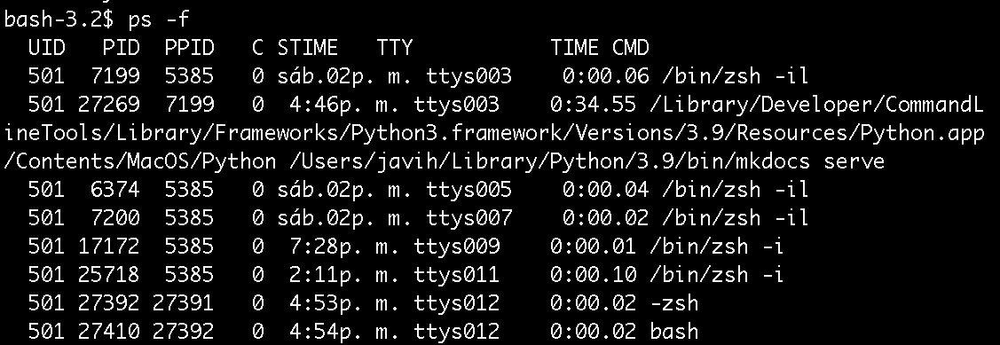
  <figcaption>Resultado comando ps -f</figcaption>
</figure> -->

#### Comando `pstree`

Muestra los procesos en forma de **árbol**, mostrando las relaciones padre-hijo.

!!! example "Salida de pstree (fragmento, Ubuntu)"
    ```text
    root@sor:/home/sor# pstree
    systemd─┬─ModemManager───3*[{ModemManager}]
            ├─agetty
            ├─containerd───8*[{containerd}]
            ├─containerd-shim─┬─tini─┬─nmbd
            │                 │      └─smbd─┬─cleanupd
            │                 │             └─smbd-notifyd
            │                 └─10*[{containerd-shim}]
            ├─containerd-shim─┬─s6-svscan─┬─s6-supervise───s6-linux-init-s
            │                 │           ├─s6-supervise───sshd.pam
            │                 │           └─...
            ├─cron
            ├─dbus-daemon
            ├─dockerd─┬─docker-proxy───...
            │         └─...
            ├─login───bash
            └─...
    ```

<!-- <figure>
  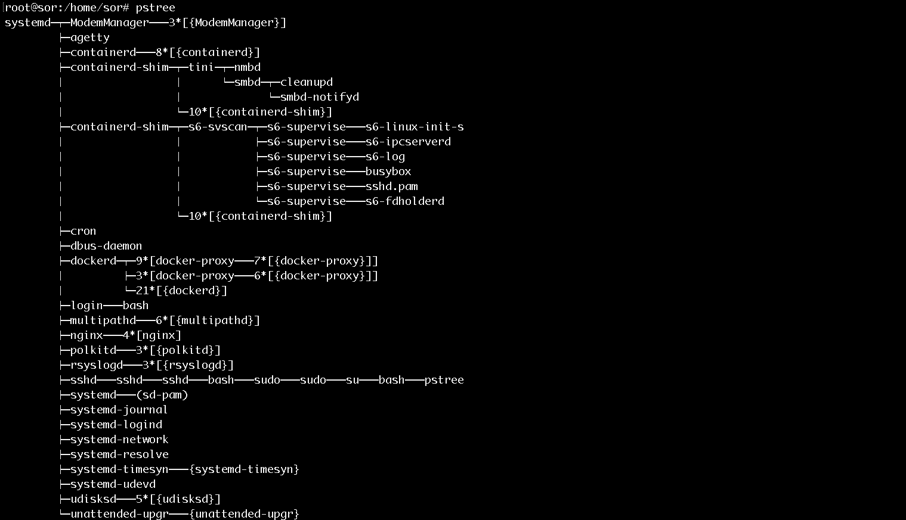
  <figcaption>Resultado comando pstree</figcaption>
</figure> -->

### Comando `top`

Listado de procesos que se **actualiza periódicamente**. Permite ver evolución de CPU, memoria, número de tareas, etc. Con la tecla **r** se puede cambiar la prioridad (nice) de un proceso indicando su PID (solo root puede asignar prioridades negativas).

!!! example "Salida de top (primeras líneas, Ubuntu)"
    ```text
    top - 16:29:49 up 13 min,  2 users,  load average: 0,00, 0,00, 0,00
    Tasks: 160 total,   1 running, 159 sleeping,   0 stopped,   0 zombie
    %Cpu(s):  0,0 us,  0,1 sy,  0,0 ni, 99,9 id,  0,0 wa,  0,0 hi,  0,0 si,  0,0 st
    MiB Mem :   3902,3 total,   3206,3 free,    379,8 used,    466,8 buff/cache
    MiB Swap:      0,0 total,      0,0 free,      0,0 used.   3522,5 avail Mem

        PID USER      PR  NI    VIRT    RES    SHR S  %CPU  %MEM     TIME+ COMMAND
        333 root      20   0       0      0      0 I   0,3   0,0   0:00.53 kworker/0:3-events
        698 root      20   0 1861432  42112  27904 S   0,3   1,1   0:01.83 containerd
       2339 root      20   0   11776   5376   3328 R   0,3   0,1   0:00.03 top
          1 root      20   0   21948  12112   8528 S   0,0   0,3   0:00.81 systemd
          2 root      20   0       0      0      0 S   0,0   0,0   0:00.00 kthreadd
          4 root       0 -20       0      0      0 I   0,0   0,0   0:00.00 kworker/R-rcu_g
    ```

<!-- <figure>
  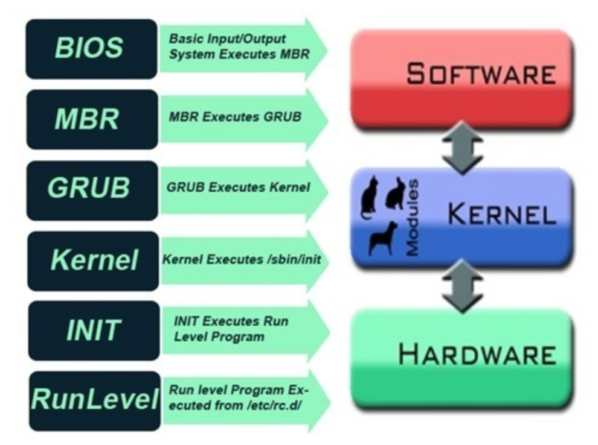
  <figcaption>Resultado comando top</figcaption>
</figure> -->

### Primer plano y segundo plano

- **Primer plano**: el proceso con el que se interactúa; el terminal queda "bloqueado" hasta que termina.
- **Segundo plano**: se lanza con **`&`** al final del comando (p. ej. `sleep 10 &`). El terminal sigue disponible.

Al lanzar en segundo plano se muestra un número entre corchetes (número de trabajo) y el PID.

!!! example "sleep en segundo plano y jobs (Ubuntu)"
    ```text
    root@sor:/home/sor# sleep 10 &
    [1] 2366
    root@sor:/home/sor# jobs
    [1]+  Running                 sleep 10 &
    ```

<!-- <figure>
  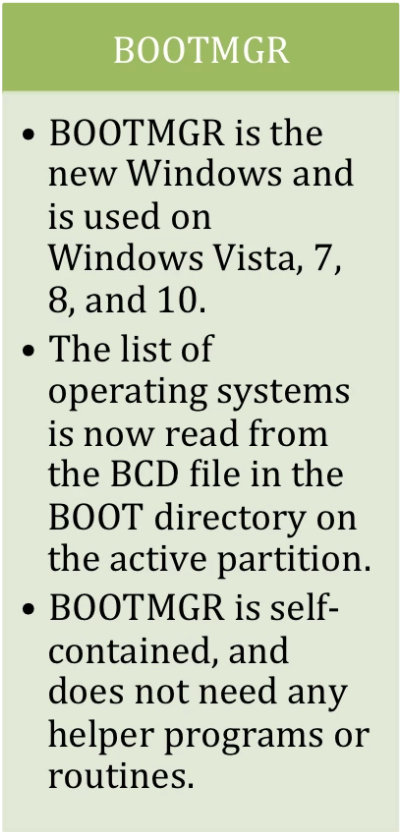
  <figcaption>Resultado comando sleep 10 &</figcaption>
</figure>

<figure>
  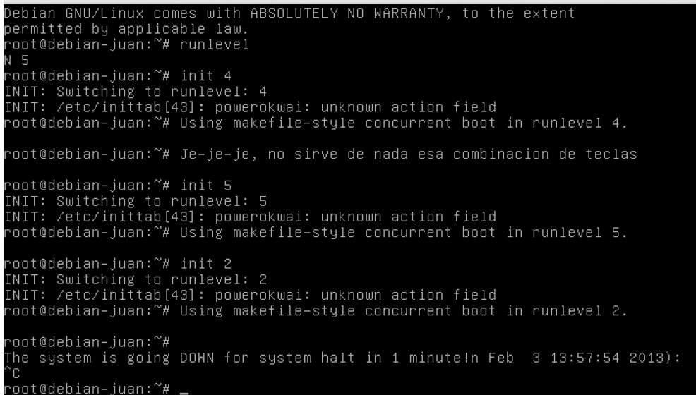
  <figcaption>Resultado comando jobs</figcaption>
</figure> -->

- **`jobs`**: lista los trabajos en segundo plano.
- **`fg %n`**: lleva el trabajo `n` a primer plano.
- **`bg %n`**: para pasar a segundo plano un proceso que está en primer plano, primero se suspende con **Ctrl+Z** y luego se ejecuta `bg %n`.

!!! tip "Uso de fg y bg"
    Con un trabajo `[1]` en segundo plano, **`fg %1`** lo trae a primer plano; si un proceso está detenido (Ctrl+Z), **`bg %1`** lo reanuda en segundo plano.

<!-- <figure>
  
  <figcaption>Pasar a primer plano con fg %1</figcaption>
</figure>

<figure>
  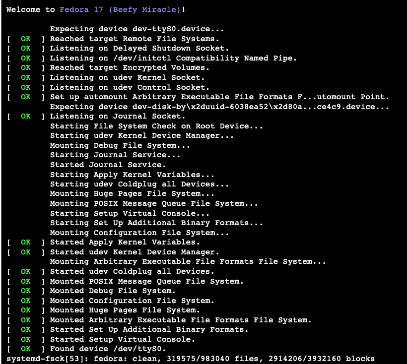
  <figcaption>Pasar a segundo plano con bg</figcaption>
</figure> -->

### Prioridad: `renice`

En Linux la prioridad (nice) va de **-20** (más prioridad) a **20** (menos prioridad). Solo root puede usar valores negativos.

- **`renice -n prioridad -p PID`**: cambia la prioridad del proceso con ese PID.
- **`renice -g`**: por grupo. **`renice -u`**: por usuario.

Para ver la prioridad: `ps ax -o pid,ni,cmd` (columna **ni** = nice).

!!! example "renice (Ubuntu, como root)"
    Se lanza `sleep` en segundo plano; con `ps ax -o pid,ni,cmd | grep sleep` se localiza el PID y la prioridad (ni); luego `renice -n 10 -p PID` cambia la prioridad:

    ```text
    root@sor:/home/sor# sleep 10 &
    [1] 2366
    root@sor:/home/sor# jobs
    [1]+  Running                 sleep 10 &
    root@sor:/home/sor# ps ax -o pid,ni,cmd | grep sleep
       2394   0 grep --color=auto sleep
    [1]+  Done                    sleep 10
    root@sor:/home/sor# renice -n 10 -p 2394
    ```

!!! note "Sobre este ejemplo"
    En este ejemplo el proceso `sleep` terminó antes de ejecutar `renice`. Para practicar `renice` conviene usar un proceso de mayor duración (p. ej. `sleep 60 &`) y aplicar `renice` al PID de ese proceso, no al de `grep`.

<!-- <figure>
  
  <figcaption>Búsqueda del proceso sleep y su prioridad</figcaption>
</figure>

<figure>
  
  <figcaption>Resultado comando renice</figcaption>
</figure>

<figure>
  
  <figcaption>Nueva prioridad del proceso sleep</figcaption>
</figure> -->

### Finalizar procesos: `kill`

```bash
kill PID           # solicitud de terminación (SIGTERM, 15)
kill -9 PID        # terminación forzada (SIGKILL)
kill -1 PID        # SIGHUP, reiniciar proceso
killall nombre_programa   # termina todos los procesos con ese nombre
```

!!! example "kill (Ubuntu)"
    Se lanza un proceso en segundo plano, se obtiene su PID y se finaliza con `kill` (señal 15, terminación ordenada):

    ```text
    root@sor:/home/sor# sleep 120 &
    [1] 2450
    root@sor:/home/sor# kill 2450
    root@sor:/home/sor# jobs
    [1]+  Terminated              sleep 120
    ```

!!! tip "Terminación forzada"
    Si el proceso no responde a `kill`, se puede forzar con **`kill -9 PID`** (SIGKILL). Con **`killall nombre`** se finalizan todos los procesos cuyo nombre coincida (p. ej. `killall sleep`).

---

## 4. Gestión de procesos en PowerShell

Para listar cmdlets relacionados con procesos: `Get-Command *process*`.

### Obtener procesos

- **`Get-Process`** (sin parámetros): procesos del equipo local.
- **`Get-Process | Sort-Object CPU -Descending | Select-Object -First 10`**: los 10 que más CPU consumen.
- **`Get-Process -Id PID`**: por identificador (si no existe, da error).
- **`Get-Process -Name patrón`**: por nombre; admite comodines (p. ej. `ex*`).
- **`Get-Process -Name a*,b*`**: varios nombres.
- **`(Get-Process -Name pwsh).Path`**, **`(Get-Process -Name pwsh).WS`**: propiedades concretas (ruta, memoria de trabajo).
- **`Get-Process -Name PowerShell -ComputerName localhost, Server01, Server02`**: procesos en equipos remotos (parámetro **ComputerName**). Para ver el equipo: `Format-Table -Property ID, ProcessName, MachineName`.

El proceso **Idle** (id 0) representa el tiempo en que la CPU no está trabajando.

!!! example "Get-Process: listar y filtrar"
    Listar procesos por nombre y los 5 que más CPU consumen:

    ```powershell
    PS C:\> Get-Process -Name pwsh | Select-Object Id, ProcessName, CPU, WorkingSet

     Id ProcessName    CPU WorkingSet
     -- -----------    --- ----------
    1234 pwsh         12,50   185654321

    PS C:\> Get-Process | Sort-Object CPU -Descending | Select-Object -First 5 Id, ProcessName, CPU

     Id ProcessName     CPU
     -- -----------     ---
    456 explorer      125,30
    789 chrome         98,12
    1234 pwsh           12,50
    ```

!!! example "Propiedades de un proceso"
    Obtener la ruta y la memoria de trabajo (WS) de un proceso por nombre:

    ```powershell
    PS C:\> (Get-Process -Name pwsh).Path
    C:\Program Files\PowerShell\7\pwsh.exe

    PS C:\> (Get-Process -Name pwsh).WorkingSet
    185654321
    ```

### Detener procesos

- **`Stop-Process -Name nombre`** o **`Stop-Process -Id PID`**.
- **`Stop-Process -Name t*,e* -Confirm`**: pide confirmación por cada coincidencia.
- Procesos que no responden: **`Get-Process | Where-Object { $_.Responding -eq $false } | Stop-Process`**.
- En remoto (Stop-Process no tiene ComputerName): **`Invoke-Command -ComputerName Server01 { Stop-Process Powershell }`**.

!!! example "Stop-Process: finalizar por nombre o PID"
    ```powershell
    PS C:\> Get-Process -Name notepad
     Id ProcessName
     -- -----------
    5678 notepad

    PS C:\> Stop-Process -Id 5678

    PS C:\> Stop-Process -Name notepad -Force
    ```

!!! note "Sobre -Force"
    El parámetro **-Force** permite terminar procesos que no responden sin pedir confirmación.

### Iniciar procesos

- **`Start-Process -FilePath ruta\ejecutable`** (p. ej. `C:\windows\notepad.exe`).
- Para abrir aplicaciones por protocolo: **`Start-Process Microsoft-edge://`**.

!!! example "Start-Process: abrir aplicación"
    ```powershell
    PS C:\> Start-Process notepad
    PS C:\> Start-Process -FilePath "C:\Windows\System32\notepad.exe" -ArgumentList "C:\temp\notas.txt"
    PS C:\> Start-Process "https://www.ejemplo.org"
    ```

!!! note "Sobre Start-Process"
    Sin parámetros adicionales, `Start-Process notepad` abre el Bloc de notas. Con **-ArgumentList** se pasan argumentos al ejecutable. Con una URL se abre el navegador por defecto.

---

## 5. Arranque del sistema y servicios

El **arranque (boot)** es la secuencia que pone en marcha el hardware, carga el gestor de arranque, el kernel y, por último, los servicios del sistema. En la práctica interesa conocer las **cuatro fases** (comunes a Linux) y qué son los **servicios** y **systemd**.

<figure>
  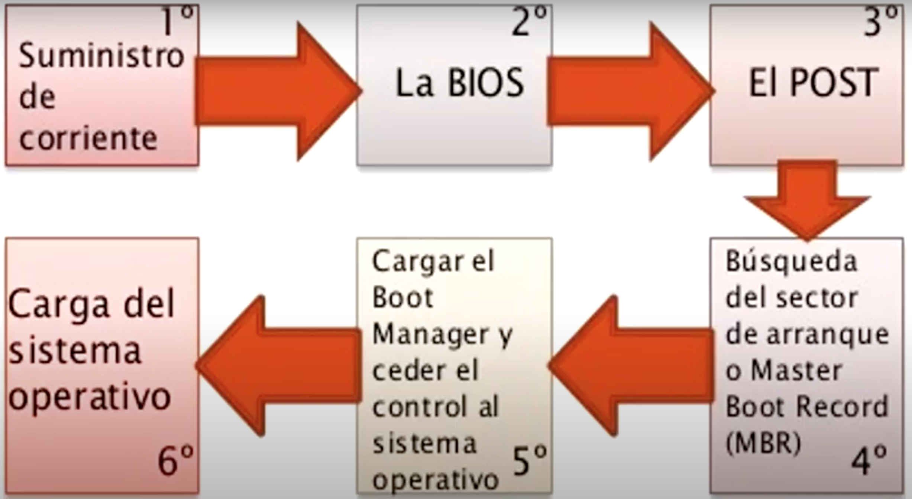
  <figcaption>Pasos del arranque de un sistema informático</figcaption>
</figure>

### Arranque en Linux (4 etapas)

1. **BIOS/UEFI** — POST, detección de hardware y carga del cargador de arranque desde MBR o GPT.
2. **Cargador de arranque (GRUB)** — Lee la configuración (p. ej. `/boot/grub/grub.cfg`, `/etc/default/grub`); muestra menú para elegir kernel; `update-grub` aplica cambios. LILO es una alternativa antigua que escribe la configuración en el MBR.
3. **Kernel** — Se carga y descomprime; initrd aporta drivers; el kernel arranca el primer proceso de usuario (init).
4. **Init / systemd** — Arranque en espacio de usuario: montaje de sistemas de archivos y puesta en marcha de **servicios** (daemons).

<figure>
  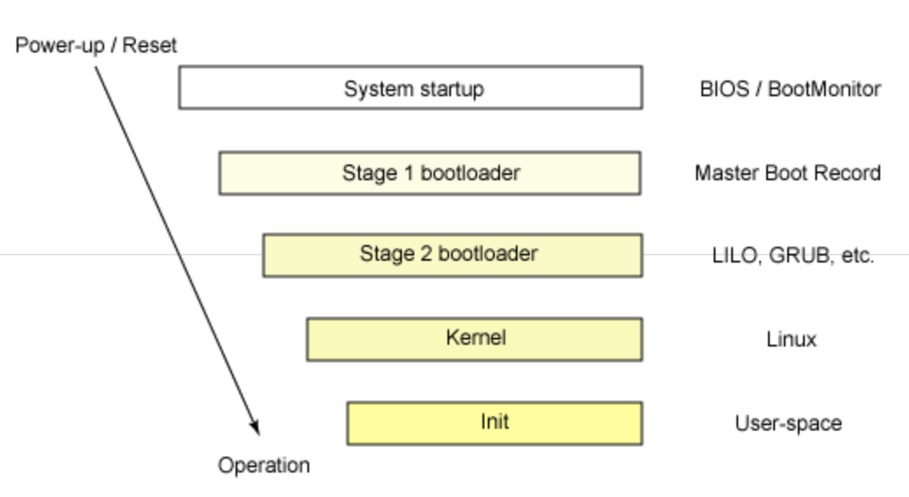
  <figcaption>Pasos del arranque en Linux</figcaption>
</figure>

<!-- Esquemas MBR/GPT y ejemplos GRUB: detalle opcional
<figure>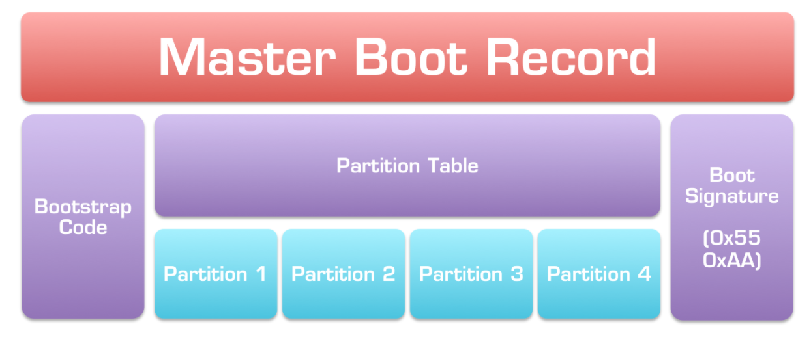<figcaption>Esquema MBR</figcaption></figure>
<figure>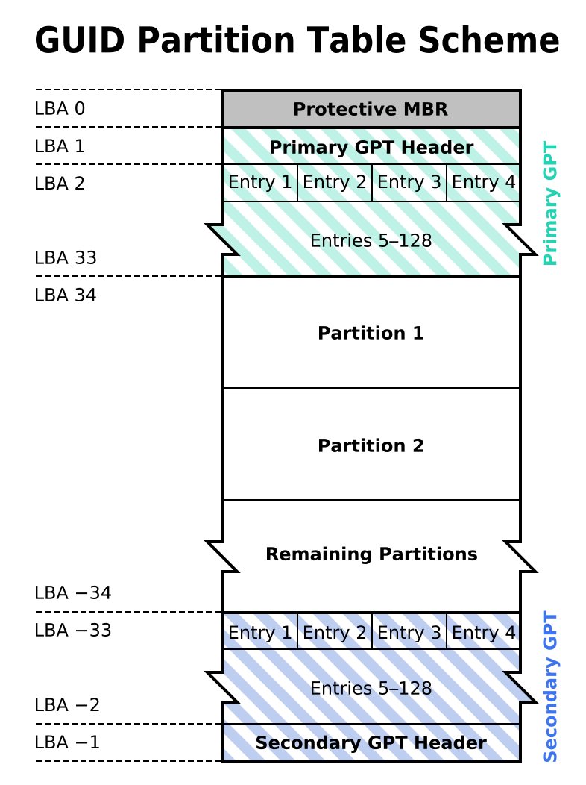<figcaption>Esquema GPT</figcaption></figure>
<figure>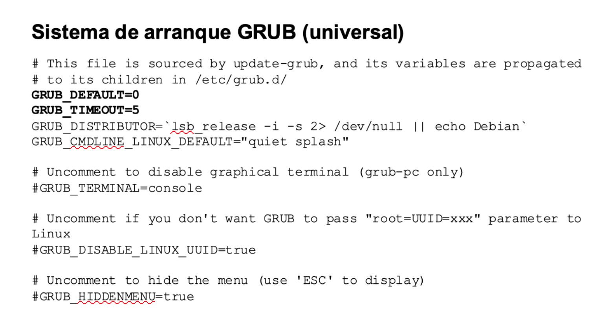<figcaption>Ejemplo de GRUB</figcaption></figure>
<figure>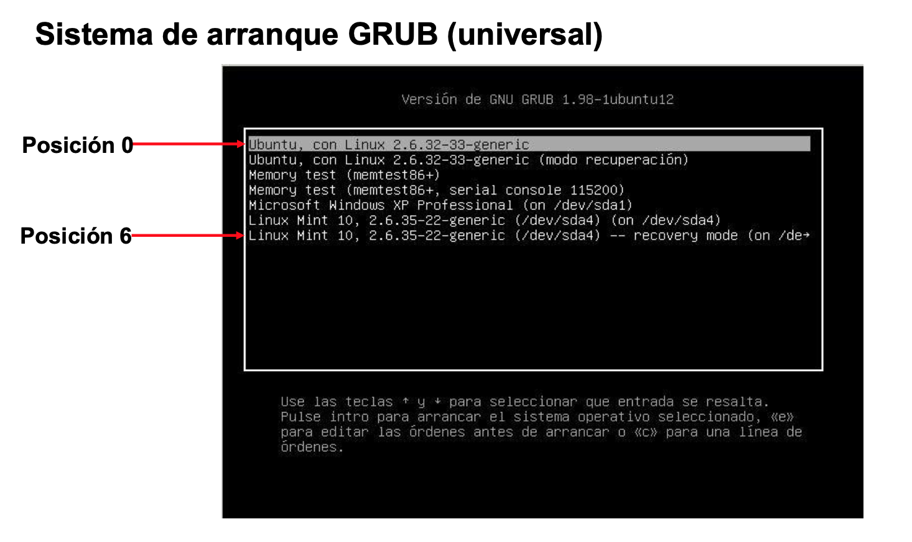<figcaption>Ejemplo de GRUB (menú)</figcaption></figure>
-->

### Arranque en Windows

El arranque se controla con **BCD** (Boot Configuration Data, `\boot\BCD`) y **Bootmgr.exe**. Secuencia resumida: BIOS → MBR → Bootmgr → BCD → menú → carga del kernel (Winload, ntoskrnl) y de los subsistemas (smss, winlogon) hasta la pantalla de inicio de sesión. Para editar opciones de arranque: **msconfig**, **bcdedit** o PowerShell.

<figure>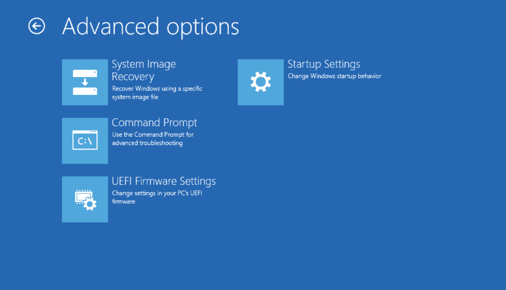<figcaption>Bootmgr (Windows Server)</figcaption></figure>

### Daemon y servicio

Un **daemon** (Linux/UNIX) o **servicio** (Windows) es un programa que se ejecuta en segundo plano, sin ventana para el usuario, y que suele iniciarse con el sistema (p. ej. servidor web, SSH, impresoras). En Linux los logs suelen estar en `/var/log/` o vía **syslog**.

<figure>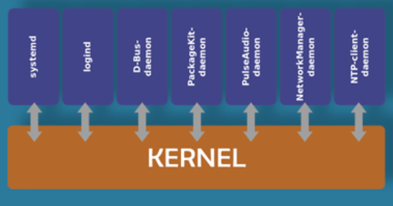<figcaption>Ejemplo de daemons</figcaption></figure>

### Systemd

**Systemd** es el gestor de sistema e init en la mayoría de distribuciones Linux actuales: unifica el arranque y la gestión de servicios, es el primer proceso en espacio de usuario (PID 1) y se administra con **`systemctl`** (ver siguiente sección).

<figure>
  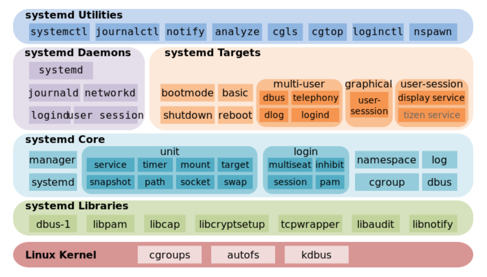
  <figcaption>Arquitectura de systemd</figcaption>
</figure>

<!-- Imagen de inicio systemd (Fedora 17): opcional
<figure><figcaption>Inicio de systemd (Fedora 17)</figcaption></figure>
-->

---

## 6. Administración de servicios (systemd)

### Iniciar y detener

```bash
sudo systemctl start nombre.service
sudo systemctl stop nombre.service
sudo systemctl restart nombre.service
sudo systemctl reload nombre.service
sudo systemctl reload-or-restart nombre.service
```

!!! example "Iniciar, reiniciar y detener un servicio"
    ```bash
    $ sudo systemctl start ssh
    $ sudo systemctl status ssh
    ● ssh.service - OpenBSD Secure Shell server
         Loaded: loaded (/lib/systemd/system/ssh.service; enabled)
         Active: active (running) since Mon 2024-01-15 10:00:00 UTC; 5s ago
    $ sudo systemctl stop ssh
    ```

!!! note "Sobre el nombre de la unidad"
    Se puede omitir el sufijo `.service` (p. ej. `ssh` en lugar de `ssh.service`).

### Habilitar y deshabilitar en el arranque

```bash
sudo systemctl enable nombre.service
sudo systemctl disable nombre.service
```

!!! note "enable no inicia el servicio"
    **enable** solo hace que el servicio se inicie en el próximo arranque. Para ponerlo en marcha en la sesión actual hay que usar además **`start`**.

!!! example "Habilitar y deshabilitar en el arranque"
    ```bash
    $ systemctl is-enabled ssh
    enabled
    $ sudo systemctl disable ssh
    $ systemctl is-enabled ssh
    disabled
    $ sudo systemctl enable ssh
    ```

### Estado

```bash
systemctl status nombre.service
systemctl is-active nombre.service
systemctl is-enabled nombre.service
systemctl is-failed nombre.service
```

!!! example "Consultar estado de un servicio"
    ```bash
    $ systemctl is-active nginx
    active
    $ systemctl is-enabled nginx
    enabled
    $ systemctl is-failed nginx
    inactive
    ```

### Listar unidades

- **`systemctl`** o **`systemctl list-units`**: unidades activas.
- **`systemctl list-units --all`**: todas las cargadas.
- **`systemctl list-units --type=service`**: solo servicios.
- **`systemctl list-unit-files`**: archivos de unidad y estado (enabled, disabled, static, masked).

!!! example "Listar servicios activos y archivos de unidad"
    ```bash
    $ systemctl list-units --type=service | head -15
    UNIT                      LOAD   ACTIVE SUB     DESCRIPTION
    cron.service              loaded active running Regular background program
    dbus.service              loaded active running D-Bus System Message Bus
    ssh.service               loaded active running OpenBSD Secure Shell server
    systemd-journald.service   loaded active running Journal Service
    ...

    $ systemctl list-unit-files --type=service | grep -E 'ssh|nginx|cron'
    cron.service      enabled
    nginx.service     disabled
    ssh.service       enabled
    ```

### Otras operaciones

- **`systemctl cat nombre.service`**: contenido del archivo de la unidad.
- **`systemctl list-dependencies nombre.service`**: dependencias.
- **`systemctl show nombre.service`**: propiedades.
- **Enmascarar** (impedir que se inicie): **`sudo systemctl mask nombre.service`**. **Desenmascarar**: **`sudo systemctl unmask nombre.service`**.
- **Editar**: **`sudo systemctl edit nombre.service`** (fragmento override) o **`sudo systemctl edit --full nombre.service`**. Tras cambios: **`sudo systemctl daemon-reload`**.

!!! example "Ver dependencias y enmascarar"
    ```bash
    $ systemctl list-dependencies ssh.service | head -10
    ssh.service
    ● ├─system.slice
    ● └─basic.target
    ●   ├─...
    $ sudo systemctl mask nombre.service
    Created symlink /etc/systemd/system/nombre.service → /dev/null.
    $ sudo systemctl unmask nombre.service
    Removed /etc/systemd/system/nombre.service.
    ```

### Destinos (runlevels)

- **`systemctl get-default`**: destino por defecto.
- **`systemctl set-default graphical.target`**: cambiar destino por defecto.
- **`systemctl list-unit-files --type=target`**: destinos disponibles.
- **`sudo systemctl isolate multi-user.target`**: cambiar a modo multiusuario (sin gráfico).
- **`sudo systemctl rescue`**, **`sudo systemctl halt`**, **`sudo systemctl poweroff`**, **`sudo systemctl reboot`**: atajos para rescate, apagado y reinicio.

!!! example "Destino por defecto y destinos disponibles"
    ```bash
    $ systemctl get-default
    graphical.target
    $ systemctl list-unit-files --type=target | grep -E 'graphical|multi-user'
    graphical.target    static
    multi-user.target   static
    $ sudo systemctl set-default multi-user.target
    Created symlink /etc/systemd/system/default.target → /usr/lib/systemd/system/multi-user.target.
    ```

---

## Actividades

En esta unidad se plantean **dos retos individuales** de depuración: un script Python con interfaz gráfica (tkinter) que integra comandos de gestión de procesos. El alumnado elige **uno** de los dos según el entorno (Linux/WSL o Windows). Cada reto tiene una **puntuación máxima de 30 puntos** y se evalúa según los criterios indicados.

!!! tip "Antes de los retos"
    Si no tienes experiencia con Python, puedes apoyarte en la **[Introducción a Python](IntroduccionPython.md)** antes de abordar los enunciados.

---

### RG601: Gestor de procesos con Shell (Linux / WSL). **Ampliación +0,25 de la nota final.**

**Puntuación:** 30 puntos  
**Criterios evaluados:** CE2c (gestión de procesos desde el Shell), CE2g (herramienta de gestión y documentación)  
**Modalidad:** Individual  
**Entorno:** Linux o WSL (comandos: `ps`, `pstree`, `jobs`, `kill`, `renice`).

Depuración de un script Python con interfaz gráfica que utiliza comandos Shell para listar procesos, mostrar el árbol de procesos, listar trabajos en segundo plano, finalizar un proceso por PID y cambiar la prioridad (renice). El enunciado incluye código con errores que hay que identificar, justificar y corregir.

[:octicons-tag-24: Ver enunciado del reto — Shell (RG601)](RetoIndividualProcesosShell.md){ .md-button }

---

### RG602: Gestor de procesos con PowerShell (Windows). **Ampliación +0,25 de la nota final.**

**Puntuación:** 30 puntos  
**Criterios evaluados:** CE2d (gestión de procesos desde PowerShell), CE2g (herramienta de gestión y documentación)  
**Modalidad:** Individual  
**Entorno:** Windows con PowerShell (cmdlets: `Get-Process`, `Stop-Process`, `Start-Process`).

Depuración de un script Python con interfaz gráfica que utiliza cmdlets de PowerShell para listar procesos, mostrar los que más CPU consumen, finalizar un proceso por PID e iniciar un proceso. El enunciado incluye código con errores que hay que identificar, justificar y corregir.

[:octicons-tag-24: Ver enunciado del reto — PowerShell (RG602)](RetoIndividualProcesosPowerShell.md){ .md-button }
