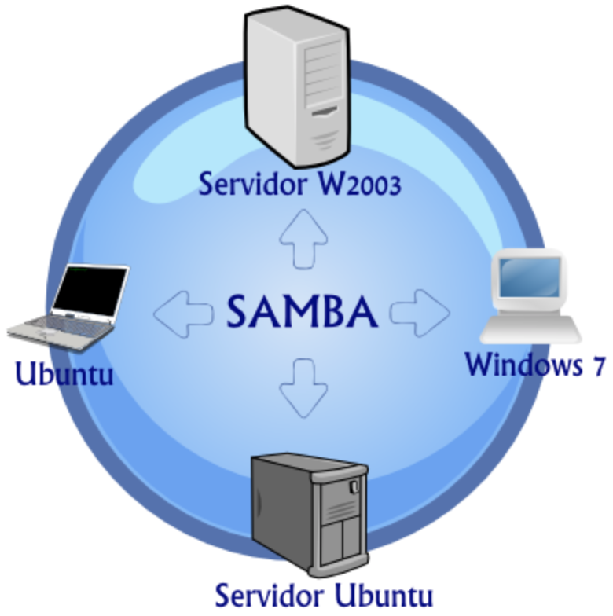

# Integración de sistemas operativos en red libres y propietarios

??? abstract "Duración y criterios de evaluación"

    **Duración estimada: 5 sesiones (12h por sesión)**

    

    Resultado de aprendizaje y Criterios de evaluación:

    1. Integra sistemas operativos libres y propietarios, justificando y garantizando su interoperabilidad.
        1. Se ha identificado la necesidad de compartir recursos en red entre diferentes sistemas operativos.
        2. Se han establecido niveles de seguridad para controlar el acceso del cliente a los recursos compartidos en red.
        3. Se ha comprobado la conectividad de la red en un escenario heterogéneo.
        4. Se ha descrito la funcionalidad de los servicios que permiten compartir recursos en red.
        5. Se han instalado y configurado servicios para compartir recursos en red.
        6. Se ha comprobado el funcionamiento de los servicios instalados.
        7. Se ha trabajado en grupo para acceder a sistemas de archivos e impresoras en red desde equipos con diferentes sistemas operativos.
        8. Se ha documentado la configuración de los servicios instalados.

## Introducción. Descripción de escenarios heterogéneos

Un **escenario heterogéneo** es aquél donde conviven, en una red (**LAN**, **WAN**) diversos equipos con distintas arquitecturas y sistemas operativos distintos, bien sea por su versión, bien sea porque son de distinta factoría.

En dichos escenarios, el intercambio de datos es posible **sólo si los dos extremos de la comunicación entienden el protocolo utilizado**. En este sentido, a lo largo de los años se han desarrollado enormes cantidades de **protocolos**, más o menos especializados, destinados a este intercambio de datos, los más conocidos son: **SMB/CIFS** y **NFS (Network File System)** y los **servicios** que los implementan son **Samba** y **NFS** respectivamente, en este tema se estudiará su instalación y configuración.

## Protocolos para redes heterogéneas

El primer sistema de ficheros en red ideado en los años ochenta por la empresa ‘**Novell Data Systems**’ (después llamada ‘**Novell Inc**.’).

**Novell**, creó su producto llamado **Netware**, basado en una arquitectura *cliente/servidor* y con su propio protocolo de red, **IPX**. Fue, durante mucho tiempo, líder indiscutible en el apartado de servidores de red. Pero aunque se mantiene vivo, no es fácil de conseguir y su utilización ha ido en detrimento de otros como plataformas Windows y GNU/Linux; como se ha comentado en la introducción, los más utilizados en la comunicación entre equipos dentro de una red son: **SMB/CIFS** y **NFS**, a continuación se describen brevemente.

- **SMB/CIFS**: se basa en la arquitectura cliente/servidor, y permite compartir recursos entre equipos con sistemas operativos diferentes; *Windows*, *GNU/Linux* y *MacOSXh*.
- **NFS (Network File System)**: es un protocolo de nivel de aplicación, según el Modelo *OSI*. Es utilizado para sistemas de archivos distribuido en un entorno de red heterogéneo de computadoras de área local. Originalmente fue desarrollado en **1984** por **Sun Microsystems**

Además se destaca el protocolo ‘**Apple File Service**’ (**AFS**), que ofrece servicios de archivos compartidos para sistemas operativos ‘**macOS**’, que funcionan en equipos ‘**Macintosh**’ (o simplemente ‘Mac’) de la empresa ‘**Apple Inc**.’.

## Sistemas de archivos compartidos en red

Cuando se habka de compartir archivos y carpetas, nos referimos principalmente al **sistema de archivos en red** que se utiliza, los sistemas de archivos se definen como un conjunto de normas y procedimientos para almacenar información en los dispositivos de almacenamiento. En el caso de **los sistemas de archivos en red** las normas y procedimientos además de afectar al almacenamiento también afectan a la transmisión por red, y se realizan a través de protocolos y servicios.

Entre los servicios que implementan los protocolos descritos en el apartado anterior destacan:

- **NFS (Network File System)**, servicio de **GNU/Linux** que comparte el mismo nombre del protocolo, el cual permite compartir recursos de almacenamiento masivo con otros equipos. **Con equipos que tengan instalado el sistema operativo MacOSX no debemos tener ningún problema**, ya que esta basado en Unix como GNU/Linux.

!!! note "**NOTA**"
    En cuanto a máquinas que tengan el **sistema operativo Windows** en cualquiera de sus versiones es un poco más complicado. Requiere un software específico para poder implementarlo.

- En este sentido, para añadir los SOs de Microsoft se dispone de **Samba**, el cual es uno de los grandes logros del movimiento de código abierto. Prueba de ello es el reconocimiento y la aceptación que ha tenido últimamente en el mundo de las TIC, donde **se ha convertido en una especie de servicio estándar en redes donde conviven sistemas operativos GNU / Linux y Windows**.

!!! note "**Un poco de historia**"
    - Gran parte de su popularidad se debe precisamente a su capacidad para integrarse en redes Windows.
    - **Samba** toma el nombre del protocolo **server message block (SMB)**, inicialmente desarrollado por **Microsoft**, **IBM, Intel y otros** para permitir que los sistemas operativos *DOS*, *Xenix*, *OS/2* y *Windows*; al final de los años 80 se llego a realizar, pudiendo compartir unidades, archivos e impresoras.
    - El protocolo **SMB** cambió de nombre en 1998 y pasó a llamarse **Common Internet File System (CIFS)**. A día de hoy, este protocolo es el que todavía se utiliza en los sistemas Windows para compartir archivos.

<figure>
  
  <figcaption>Esquema de Red utilizando Samba</figcaption>
</figure>

!!! tip "**Samba Definición**"
    **Samba es una implementación libre del protocolo de archivos compartidos de Microsoft Windows para sistemas de tipo UNIX**. De esta forma, es posible que computadoras con GNU/Linux, Mac OS X o Unix en general se vean como servidores o actúen como clientes en redes de Windows.

### Tabla Resumen Protocolos y Servicios de los Sistemas de Archivos Compartidos

A continuación la **tabla resumen** de protocolos y servicios en los Sistemas de Archivos Compartidos en Red:

|Sistema|Descripción|
| - | - |
|**‘Network File System’ (NFS)**|Sistema de archivos de red distribuido, desarrollado originalmente por la empresa '*Sun Microsystems*', incluido por defecto en los sistemas '*UNIX*' y en la mayoría de las distribuciones '*Linux*' .|
|**‘Server Message Block’ (SMB)**|Protocolo de red, desarrollado originalmente por la empresa '*International Business Machines Corporation*' (IBM), que permite compartir archivos, impresoras y otros dispositivos, entre equipos clientes '*Microsoft Windows*'.|
|**‘Common Internet File System’ (CIFS)**|Versión modificada ampliamente del protocolo SMB, realizada por '*Mircrosoft Corporation*'. |
|**‘Samba’**|Implementación libre del protocolo SMB con las extensiones de '*Microsoft*', que funciona sobre las distribuciones gratuitas GNU ('*GNU's Not UNIX!*') de sistemas '*Linux*' y en algunos sistemas '*UNIX*' |
|**‘Apple Filing Protocol’ (AFS)**|Protocolo que forma parte de la tecnología '*Apple File Service*' (AFS), que ofrece servicios de archivos compartidos para sistemas operativos '*macOS*', que funcionan en equipos '*Macintosh*' (o simplemente '*Mac*') de la empresa '*Apple Inc.*'.

## Otros servicios

Independientemente del sistema operativo usado necesitaremos de otros servicios para complementar la configuración de recursos compartidos en redes Heterogéneas:

- **LDAP**: Será la base de datos que alberga la información de los usuarios.
- **Kerberos**: Se encarga de la seguridad a nivel de autentificación segura de los usuarios.
- **DNS**: Habitualmente el acceso al dominio se hace a través de un nombre de dominio. El servicio DNS permite la resolución de ese nombre de dominio al direccionamiento IP.
- **NTP**: Es el servicio que se encarga de la sincronización del reloj de cada máquina.

### Kerberos

**Kerberos es un protocolo de autenticación** de redes de ordenador creado por el MIT que permite a dos ordenadores en una red insegura demostrar su identidad mutuamente de manera segura.

<figure>
  
  <figcaption>Logo Kerberos</figcaption>
</figure>

**Características Principales**:

- Es un protocolo de seguridad que permite al cliente autentificarse de forma segura. 
- Cifra los datos de autentificación, por lo que alguien que esté robando (sniffing) los datos de la red no será capaz de averiguar la contraseña, de hecho la contraseña no viaja por la red.
- Además permite al cliente asegurarse de la autenticidad del servidor, es decir, que impide que nadie se haga pasar por el servidor para robarte las claves.