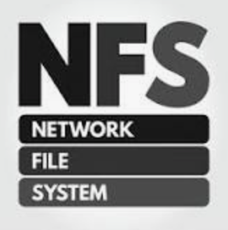
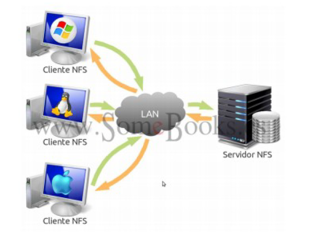
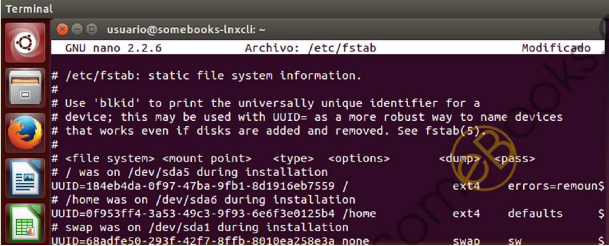

<figure style="float: right;">
    
</figure>

# NFS (Network File System)

## Características Generales

- Creado por **Sun Microsystems en 1984**; y Su implementación se publicó en una RFC (Request For Comment) para que cualquiera pudiese implementarlo. Una RFC es una publicación de la IETF.
- Se utiliza en la redes de área local para crear un sistema de archivo distribuido. Su objetivo es que varios usuarios puedan acceder a los archivos compartidos como si fueran locales.
- Se centraliza por tanto el almacenamiento de la red.
- Consta de Dos partes:

1. Servidor &#8594 Almacena los archivos compartidos.
2. Cliente &#8594 Acceden e interactúan con los recursos compartidos.

!!! warning "**IMPORTANTE**"
    Para el uso de **NFS en Windows** es necesario usar **Windows 8** Enterprise o superior o recurrir a software de terceros.

<figure>
  
  <figcaption>Esquema de red NFS.</figcaption>
</figure>

## Ventajas

1. Al centralizar los recursos evitamos tener varias copias en diferentes nodos de la red. &#8594 Ahorrando espacio y evitando duplicidad de información.
2. Asegura integridad de datos, al obligar a que todas las escrituras sean finalizadas antes de que otro usuario haga otras modificaciones.
3. Permite almacenar toda la información de los perfiles de usuario, incluyendo su directorio `/home`. Por tanto un usuario podrá acceder a su partición de datos desde cualquier nodo de la red.
4. Permite compartir dispositivos de almacenamiento externos como memorias flash o discos externos. Esto permite ahorrar costes en la compra de equipamiento al ahorrar su aprovechamiento.
5. Características de seguridad para el control de acceso: `ACLS` o `KERBEROS`.

## Permisos en NFS.

**NFS** tiene una carencia en el control de permisos, por ello se combina con **LDAP** que se encargará de la gestión de los permisos. La carencia es debida a que en UNIX cada usuario tiene un identificador llamado **UID** y cada grupo de usuarios tiene otro identificador **GID**.

- NFS traspasa los ficheros a los clientes con los permisos relacionados con el UID y el GID existentes en el servidor. Es decir, que si en el servidor existe un usuario “javi” con UID 1003 y en el cliente hay un usuario “maría” con UID 1003 ambos tendrán los mismos permisos.
Ejemplo (somebooks.es):

<figure>
  
  <figcaption>Ejemplo de problema de permisos en NFS.</figcaption>
</figure>

A continuación se explican los problemas del ejemplo anterior:

- **root**: Como coinciden tanto el UID como el GID el usuario root del cliente podrá actuar como usuario root del servidor NFS, al no ser que tengamos la opción de root_squash activada.
- **usuario**: Al igual que pasa con root al tener mismo UID y GID tanto en el servidor como en el cliente.
- **jlopez**: no tiene el mismo UID o GID en el servidor que en el cliente. No obstante en el cliente tiene un GID 1030 por lo que tendrá los permisos del grupo “**Dirección**”, cuando realmente dicho usuario no pertenece a ese grupo.
- **fgil**: El usuario fgil, el cual solo se encuentra en el cliente, tendrá los permisos del usuario aperez del servidor, ya que comparten UID. Además pertenecerá al grupo de “**Dirección**” debido a su GID.

## Montaje Automático de un cliente NFS.

En los sistemas UNIX los volúmenes (discos duros, servidores, usb, etc) pueden montarse automáticamente al arrancar. Esto se consigue editando el fichero `/etc/fstab` (file systems table).

- Fichero `/etc/fstab`:

- Cada línea pertenece al montaje de un volumen y se compone de:

1. **Dispositivo que se va a montar**: `“IP del servidor”:”ruta de la carpeta compartida”`

!!! example "**Ejemplo:**"
    `192.168.0.100:/home/usuarioServidor/Escritorio/compartido`

2. **Punto de montaje**: Donde queremos que se monte en nuestro equipo.

!!! example "**Ejemplo:**"
    `/mnt/nfs/compartir`

3. **Sistema de archivos**: Indica el sistema de archivo utilizado en el volumen. En este caso será “nfs”.

4. **Opciones de montaje**, usaremos las siguientes: `auto,noatime,nolock,bg,nfsvers=3,intr,tcp,actimeo=`

5. **Frecuencia de Respaldo**: Tiempo con el que se realiza copia de seguridad, si su valor es 0 no se realiza copia.

6. **Orden de revisión**: Uso para la herramienta fsck para revisar errores en el volumen. Si su valor es 0 no se realiza revisión.

- **Ejemplos:**

``` yaml
192.168.1.10:/home /mnt/nfs/home nfs auto,noatime,nolock,bg,nfsvers=3,intr,tcp,actimeo=1800 0 0

192.168.1.10:/home/usuarioServidor/Escritorio/compartir /mnt/nfs/compartir nfs

auto,noatime,nolock,bg,nfsvers=3,intr,tcp,actimeo=1800 0 0
```

<figure>
  
  <figcaption>Ejemplo de problema de fstab.</figcaption>
</figure>

!!! note "**Nota:**"
    Finalmente es necesario reiniciar la máquina.

## Instalación NFS.

- Servidor:

1. Actualiza repositorios.
2. Instala el paquete nfs-kernel-server.

- Cliente:

1. Actualiza repositorios.
2. Instala el paquete nfs-common.
3. Montar en una carpeta la carpeta compartida del servidor.

### Configuración General NFS.

- Servidor:

1. Crea la carpeta compartida.
2. Comprobar permisos en el servidor dependiendo de lo restrictivo que deba ser.
3. Modifica la configuración de los recursos compartidos en `/etc/exports`.
4. Actualiza los cambios:

``` yaml
sudo exportfs –a
sudo systemctl restart nfs-kernel-server
```

- Cliente:

- Montar en una carpeta la carpeta compartida del servidor.

``` yaml
sudo mount IPSerivdor:/RutaCarpetaCompartida /RutaDondeSeMontaEnCliente
```

!!! example "**Ejemplos:**"

``` yaml
mount 192.168.18.4:/home/alumno/compartida /home/salva/compartida
```

### Fichero de Configuración NFS (/etc/exports).

- Cada recurso compartido que se añada debe ir en una nueva línea.
- Los nombres de clientes/usuarios no pueden tener espacios.
- Entre el nombre de usuario y las opciones no hay espacio en blanco.
- Las líneas tienen el siguiente formato:

``` yaml
 “ruta_micarpeta” cliente1(opciones) cliente2(opciones)...clienteN(opciones)
```

!!! example "**Ejemplos:**"

``` yaml
/home *(rw,sync,no_subtree_check)
```

``` yaml
/home/javi/Escritorio/SOR/COMPARTIR/ *(rw,sync,no_subtree_check)
```

``` yaml
/home 192.168.0.19(rw,sync,no_subtree_check)
```

``` yaml
/home 192.168.0.0/24(rw,sync,no_subtree_check)
```

#### Opciones:

- **ro(read-only)**: La carpeta compartida será de sólo lectura. Es la opción predeterminada.
- **rw (read-write)**: El usuario podrá realizar cambios en el contenido de la carpeta compartida.
- **root_squash**: Evita que los usuarios con privilegios administrativos los mantengan, sobre la carpeta compartida, cuando se conectan remotamente. En su lugar, se les trata como un usuario `“nfsnobody”` que es un usuario con permisos mínimos. Es la opción predeterminada.
- **no_root_squash**: Deshabilita la característica anterior.
- **sync**: Evita responder peticiones antes de escribir los cambios pendientes en disco. De tal forma que cada cambio que recibe la escribe en disco y luego confirma que ha sido escrita correctamente. Es la opción predeterminada.
- **async**: Deshabilita la característica anterior. Mejora el rendimiento a cambio de que exista el riesgo de corrupción en los archivos o, incluso, en todo el sistema de archivos, si se produjese una interrupción del fluido eléctrico o un bloqueo del sistema. Recibe la orden de escritura y confirma al cliente que ha sido realizada con éxito (mentira, ya que no ha sido realizada), acto seguido puede recibir X órdenes de otros clientes y a todos les hará lo mismo, finalmente realiza escribe todos los cambios a la vez. Por tanto es más rápido que el método síncrono ya que no debe realizar tantos accesos a memoria.
- **subtree_check**: Cuando el directorio compartido es un subdirectorio de un sistema de archivos mayor, **NFS** comprueba los directorios por encima de éste para verificar sus permisos y características. Es la opción predeterminada.
- **no_subtree_check**: Deshabilita la característica anterior, lo que hace que el envío de la lista de archivos sea más rápido, pero puede reducir la seguridad.

## Actividades de desarrollo UD7_03

704. Crea una guía de instalación y configuración de NFS, creando recursos compartidos y comprobando funcinan en Windows 10 y Ubuntu. Te puedes basar en los siguientes enlaces:

- [NFS parte 1](http://somebooks.es/nfs-parte-1-instalacion-en-un-servidor-ubuntu-20-04-lts/)
- [NFS parte 2](http://somebooks.es/nfs-parte-2-instalacion-en-un-cliente-ubuntu-20-04-lts/)
- [NFS parte 3](http://somebooks.es/nfs-parte-3-instalacion-en-un-cliente-windows-10/)
- [NFS parte 4](http://somebooks.es/nfs-parte-4-compartir-almacenamiento-en-un-servidor-ubuntu-20-04-lts/)
- [NFS parte 5](http://somebooks.es/nfs-parte-5-acceder-a-la-carpeta-compartida-desde-un-cliente-ubuntu-20-04-lts/)