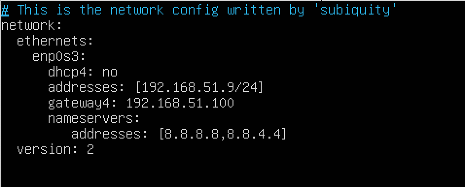
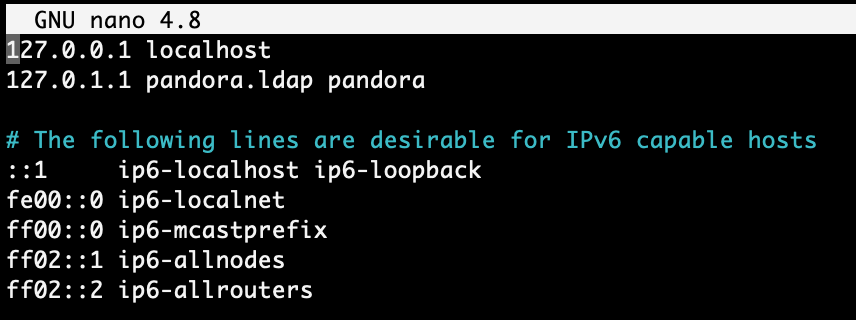
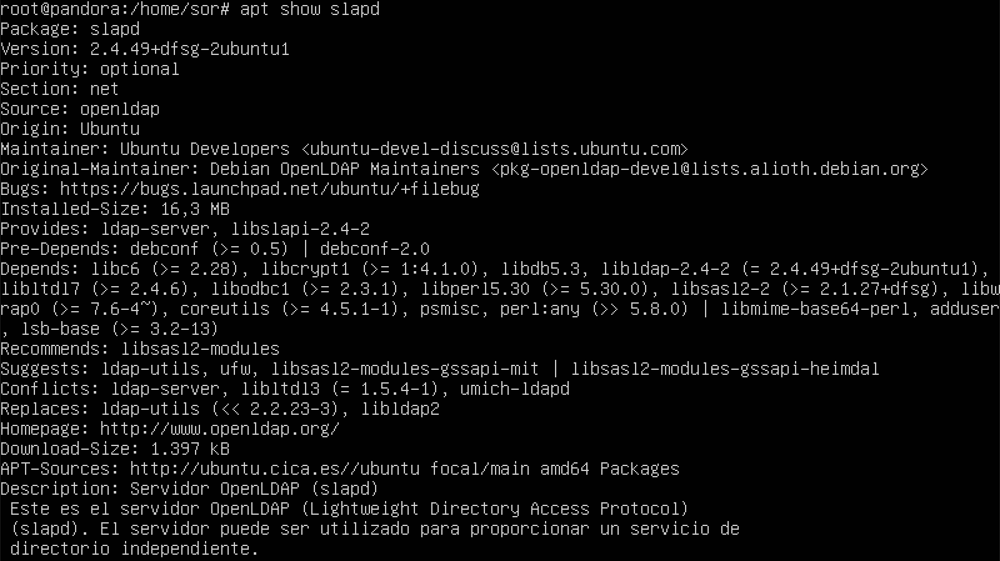
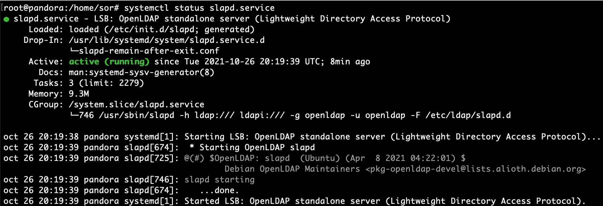
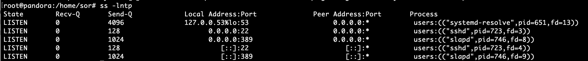

Configuración básica del servidor
---------------------------------

Vamos a comenzar por modificar el contenido del fichero /etc/hosts para indicar un FQDN a nuestro servidor. El objetivo de este cambio es que cuando hagamos referencia a pandora.ldap, nuestro sistema entienda que nos estamos refiriendo al servidor. Esto, además, facilitará la labor de configuración de nuestro servicio de directorio.

!!! tip
    Primeramente se puede utilizar IP fijas en el aula que serán: `192.168.5.1X`, modificando el archivo `/etc/netplan/00-installer-config.yaml`

{width='600px'}

A continuación se modifica el archivo Hots para cambiar el nombre de la máquina en el dominio configurado.

```
sudo nano /etc/hosts
```


Otra opción puede ser.

{width='600px'}


Implantación del Servicio OpenLDAP
----------------------------------

Ahora vamos a ver, en forma de guía práctica, la implantación del servicio OpenLDAP en nuestro servidor Ubuntu 20.04

En primer lugar, vamos a instalar los paquetes necesarios en nuestro servidor. 

```
sudo apt install slapd ldap-utils
```

!!! tip
    A priori se podría revisar con antelación los paquetes a instalar con: `apt show slapd`

{width='600px'}

Seguidamente se instala el paquete de LDAP.


Automáticamente nos aparecerá una ventana donde introduciremos la contraseña de administrador para el directorio LDAP. Seguidamente terminará el proceso de instalación.


Podemos comprobar que se ha instalado correctamente ejecutando el comando slapcat. Dicho comando nos mostrará en formato LDIF el contenido de las entradas existentes en el servicio de directorio.

```
sudo slapcat
```


Además se puede comprobar que el servicio esta corriendo con

```
systemctl status slapd.service
```


También se puede comprobar si el servicio de directorio OpenLdap esta escuchando por el `puerto 389`.

```
ss -lntp
```



Ahora vamos a realizar la configuración de nuestro servicio de directorio usando el asistente de slapd. Para ello ejecutamos la siguiente instrucción:

```
sudo dpkg-reconfigure slapd
```

El primer paso del asistente nos pregunta si queremos omitir la configuración del servidor OpenLDAP. Elegiremos que NO para poder configurarlo.


A continuación nos pregunta por el dominio en el que se encuentra nuestro servidor, esto va a formar parte del DN del directorio LDAP. Al haberlo indicado anteriormente en el fichero /etc/hosts, automáticamente el asistente lo recoge y solo debemos darle a OK. Si no lo hubiésemos indicado, habría que indicarlo manualmente.


Luego nos pregunta por el nombre de la organización a la que va a pertenecer nuestro servidor LDAP. Se puede elegir una contraseña facil para la práctica como **pandora**. Pulsamos OK.


Ahora nos vuelve a pedir la contraseña de administrador del directorio LDAP. Esta que pongamos va a machacar la que indicamos en el proceso de instalación y será la definitiva. Como suele pasar, la deberemos introducir dos veces para evitar errores tipográficos.


Seguidamente nos pregunta si queremos que se elimine la base de datos del directorio LDAP cuando se borre el paquete slapd del sistema. Le diremos que NO.


Y por último nos pregunta si queremos mover los datos de alguna antigua base de datos de directorio LDAP a la nueva que estamos configurando. En nuestro caso, como no tenemos ninguna antigua no va afectar en nada, lo dejaremos en SI y finalizaremos la configuración.


Una vez finalizado el asistente, volvemos a ejecutar el comando slapcat y veremos como se han modificado los valores de los atributos de las entradas, con los datos que nosotros acabamos de indicar. 

```
sudo slapcat
```

