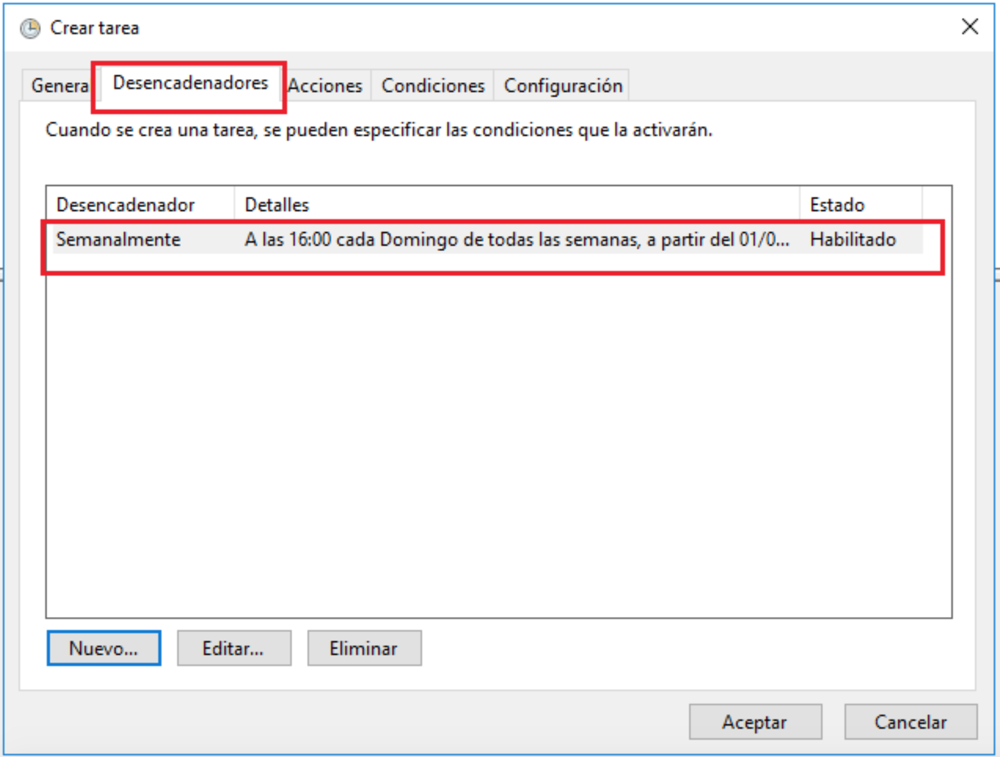

Scripts PowerShell con tareas programadas en Windows Server
==========================================================

En esta práctica vamos a ver un ejemplo de como ejecutar scripts de PowerShell con tareas programadas en Windows Server y poder así automatizar tareas. Puentos a realizar:

- La Práctica esta realizada en un Windows Server 2016, se trata de adaptar la práctica a un Windows Server 2019.
- Generar varios temporales con los datos que se quiera, para comprobar que se eliminan con el Powershell, (la condición de eliminación habrá que modificarla para que elimine temporales según las ultimas horas o minutos en los que hayais realizado la práctica).
- Realizar un nuevo informe con las capturas destacables de la práctica.

A continuación el **Ejemplo**: 

- Para empezar se muestra un script realizado en PowerShell, llamado "eliminarfiles.ps1", cuya función será eliminar los ficheros de un directorio que tengan más de 7 días:

<figure>
  
  <figcaption>Poweshell eliminarfiles.ps1</figcaption>
</figure>

- A continuación el directorio que se ha introducido en el script, y se pueden ver los archivos que debe eliminar y los que tiene que dejar:

<figure>
  
  <figcaption>Archivos a eliminar</figcaption>
</figure>

- Ahora se abre el "`Programador de tareas`", a través del Administrador del servidor:

<figure>
  
  <figcaption>Programador de tareas</figcaption>
</figure>

- Se crea una carpeta llamada "`PoweShell`":

<figure>
  
  <figcaption>Creación carpeta PowerShell I</figcaption>
</figure>

<figure>
  
  <figcaption>Creación carpeta PowerShell II</figcaption>
</figure>

- A continuación dentro de esta carpeta se crea una tarea:

<figure>
  
  <figcaption>Creación tarea I</figcaption>
</figure>

- Se abre el siguiente asistente, y sobre la pestaña "`General`" se configura, un nombre y una descripción para la tarea, que ejecute la tarea con la cuenta de Administrador y la configuramos para Windows Server:

[{width='900px'}](https://i2.wp.com/blog.ragasys.es/wp-content/uploads/2018/09/spstpws2K16_21.png)

-   Sobre la pestaña "`Desencadenadores`" se programarla tarea, para que la realice todos los Domingos a las 16:00 horas:

<figure>
  
  <figcaption>Configuración Desencadenador I</figcaption>
</figure>

<figure>
  
  <figcaption>Configuración Desencadenador II</figcaption>
</figure>

- Sobre la pestaña "`Acciones`" se indica que inicie un PowerShell y ejecute el script que se ha mostrado anteriormente y que elimina los ficheros con más de 7 días:

<figure>
  
  <figcaption>Configuración Acciones I</figcaption>
</figure>

<figure>
  
  <figcaption>Configuración Acciones II</figcaption>
</figure>

- A continuación se pregunta si queremos ejecutar el programa "PowerShell" con los siguientes argumentos, le indicamos que "Sí":

<figure>
  
  <figcaption>Configuración Acciones III</figcaption>
</figure>

- Se quedaría de la siguiente manera:

[{width='900px'}](https://i2.wp.com/blog.ragasys.es/wp-content/uploads/2018/09/spstpws2K16_13.png)

-   Las "Condiciones" y "Configuración" se dejan por defecto:

[{width='900px'}](https://i1.wp.com/blog.ragasys.es/wp-content/uploads/2018/09/spstpws2K16_14.png)

[{width='900px'}](https://i2.wp.com/blog.ragasys.es/wp-content/uploads/2018/09/spstpws2K16_15.png)

- Se podría comprobar que la tarea esta programada:

<figure>
  
  <figcaption>Comprobación tarea programada</figcaption>
</figure>

- Se habilita el "`Historial de todas las tareas`":

<figure>
  
  <figcaption>Habilitar Historial de todas las tareas</figcaption>
</figure>

- Se ejecuta la tarea manualmente y para verificar que ha eliminado los ficheros con más de 7 días:

<figure>
  
  <figcaption>Ejecución tarea manualmente</figcaption>
</figure>

- Se puede observar que la tarea se ha completado correctamente y sobre el "Historial" podemos ver los logs de la tarea:

<figure>
  
  <figcaption>Comprobación de la ejecución</figcaption>
</figure>

- Se puede ver que se ha eliminado los ficheros del directorio indicado en el **script** superiores a 7 días:

<figure>
  
  <figcaption>Comprobación de la ejecución</figcaption>
</figure>