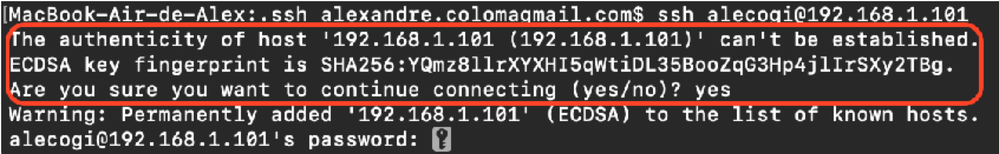
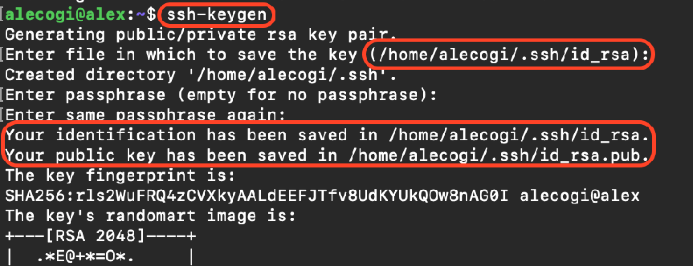
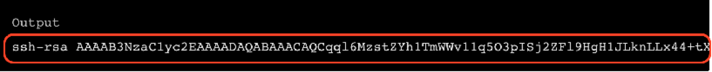
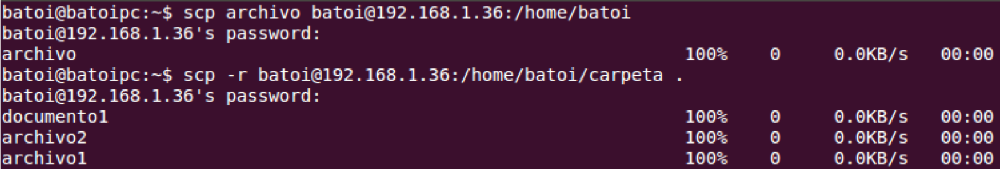

# Práctica 11 - Configuración de un servicio de acceso remoto mediante OpenSSH


## Instalación del servicio

Llevaremos a cabo la instalación del servicio mediante el gestor de paquetes del sistema operativo.

``` yaml
$ apt install openssh-server
```

Una vez instalado, sin necesidad de configurar nada, ya es posible acceder vía **ssh** utilizando un cliente **GNU/ linux**. El comando más común para llevar a cabo esta acción es:

``` yaml
$ ssh usuario @ip_de_la_maquina
```

A continuación nos pedirá la contraseña del usuario entraremos en el sistema.

Para  gestionar el  demonio del **sshd**  utilizaremos `systemctl`  o su correspondiente `service`

``` yaml
$ systemctl [start|stop|restart] ssh 
$ service ssh [start|stop|restart]
```

!!! note "Nota"
    Deberás tener en cuenta que será necesario **abrir el puerto** 22 en el firewall** (si existe) para que nos permita acceder a la máquina destino

## Autenticación del servidor

La primera vez que nos conectemos a un servidor tardará un poco más ya que nos pedirá confirmación **(yes / no)** para aceptar la conexión remota. De esta forma, en nuestra máquina cliente **quedará registrada** la clave pública del servidor y su **dirección de red (IP)**  con el fin de que en las próximas conexiones podamos asegurar la identidad del servidor al que nos estamos conectando y evitar posibles ataques “**man in the middle”**

<figure>
  
  <figcaption>Ejemplo Autentificación</figcaption>
</figure>

Una vez conectados, **podremos trabajar** en la **máquina remota** como si estuviéramos en la nuestra. Observa el *prompt* del sistema y verás cómo ha cambiado: ahora es el de la **máquina remota**. Todos los **comandos**, **programas** y ***scripts*** que lancemos después se ejecutarán en la máquina a la que nos hayamos conectado, utilizando los recursos del host remoto (CPU, memoria, disco, etc.).


### Actividad 1

- Instala el servicio **openssh** en una máquina virtual con Ubuntu Server 20.04 y haz una conexión mediante la **autenticación usuario/password**. Qué puerto has tenido que abrir en el firewall?
- ¿Para que sirve el "**key fingerprint**" Que aparece en la captura?
- ¿Qué se guarda en el archivo /home/xxxx/.ssh/known\_hosts del cliente?
- ¿Donde podemos encontrar el **archivo principal** de configuración del demonio **sshd** (sshd\_config)? Puedes consultar la documentación oficial [aquí](https://man.openbsd.org/sshd.8)</p>


!!! note "Nota"
    **Debes adjuntar capturas de pantalla que permitan comprobar la realización de la tarea, el funcionamiento del servicio y que permitan verificar las respuestas a todas las preguntas planteadas.**

## Configuración del servicio

En este punto es importante señalar que, dada la naturaleza del servicio y, aunque parezca  que  se  trata  de  una  sola  entidad,  tendremos  que  configurar  de  forma independiente el cliente y el servidor. En **esta primera actividad** nos basaremos en la **configuración del servidor**, obviando la del cliente.

### Estructura de carpetas y ficheros

- **Archivos de configuración del demonio ssh** Los archivos más importantes para la **configuración y funcionamiento del servidor openssh** se encuentran  en la carpeta `/etc/ssh` y son:

|**archivo**|**configuración**|
| - | - |
|**sshd\_config** |El archivo de configuración para el demonio sshd|
|**ssh\_host\_XXX\_key**|Claves **privadas**  de la máquina utilizadas por  el demonio sshd según la versión del protocolo utilizada|
|**ssh\_host\_XXX\_key.pub**|Claves **públicas**  de la máquina utilizadas por  el demonio sshd según la versión del protocolo utilizada|

- **Archivos de configuración del usuario de conexión**

Cuando nos conectemos al servidor SSH, lo haremos con un **usuario específico presente en el sistema operativo** de la máquina remota (**según el ejemplo del punto 2 el usuario**). 

La configuración y privilegios de conexión específicos para cada uno de estos usuarios **se especificará a partir de los siguientes de ficheros** que encontramos en el directorio `home` del usuario, más concretamente en la ruta  `~/.ssh/` 

Los principales ficheros se describen a continuación.

|**archivo**|**configuración**|
| - | - |
|**authorized\_keys**|Este archivo que contiene una lista de **claves públicas "autorizadas"**. Cuando un cliente se conecta al servidor el servidor validará su identidad mediante las claves públicas presentes en el siguiente archivo.|
|**ssh\_config**|Permite sobre-escribir la configuración general del servidor ssh para cada uno de los usuarios del sistema. |

### Configuración del demonio sshd

!!! note "Nota"
    En primer lugar y antes de hacer ningún cambio en el fichero de configuración, vamos a **crear**  una **copia de seguridad** del archivo principal `sshd\_config`  con extensión `.back`

Como podemos observar si visualizamos el archivo, cada una de las líneas siguen el patrón: **directiva_valor** donde:
- `directiva` es el **nombre de la propiedad** que se quiere configurar, 
- y `valor` será el **valor que se le asigna** a esta directiva. 

!!! note "Nota"
    Es importante remarcar que no hay un signo `=` entre la directiva y el valor, tan solo tenemos que dejar un espacio en blanco. En caso contrario, no se asignará el valor de forma correcta, y la directiva tendrá un valor **nulo**.

Entre las opciones, podremos comprobar que algunas de ellas son booleanas, en ese caso el campo valor puede contener **yes** o **no**, otras serán **numéricas** y otras serán de tipo **cadena de caracteres**.

#### Directivas de configuración más importantes del servidor

|**Directiva**|**configuración**|
| - | - |
|**puerto** Port 22|Indica el puerto de escucha del servidor|
|**PermitRootLogin [yes / no]** PermitRootLogin yes|indica si el usuario root puede conectarse el servidor per medio de ssh. Debería establecerse a "no", como medida de seguridad|
|**PubkeyAuthentification** **[Yes / no]** PubkeyAuthentification yes|Indica si está permitida la autenticación por medio de clave pública|
|**PasswordAuthentification** PasswordAuthentification yes|Indica si esta habilitada la autenticación normal (por contraseña, en caso de fallo de las demás) |
|**MaxAuthTries number** MaxAuthTries 6|Máximo número de intentos de que dispone el usuario para hacer login|
|**AllowUsers [user1] [user2]** AllowUsers user1 user2|Lista de usuarios que tienen permiso para acceder al servidor|
|**allowAgentForwarding [Yes / no]** AllowAgentForwarding yes|Permite el reenvío de credenciales del usuario para la autenticación por clave pública a través de la conexión ssh establecida|
Directivas aplicables archivo etc/ssh/sshd\_config

### Actividad 2

Consulta [documentación](https://man.openbsd.org/sshd_config) oficial y responde a las siguientes preguntas:

- ¿Con qué directiva puede especificarse una lista de usuarios que podrán conectarse por **ssh**?
- ¿Con qué directiva puedes establecer el número máximo de usuarios conectados al servidor?

### **Securización del servicio y automatización de tareas**

En los siguientes puntos se describen una serie de acciones que nos permitirán asegurar las conexiones y, por tanto, la administración de nuestros servidores remotos.

#### Autentificación por clave pública

La **autenticación de clave pública**  mejora considerablemente la seguridad hasta tal punto que, **contraseñas** extremadamente **largas,** **no podrían llegar a ofrecer**. Además, libera los usuarios de recordarlas, o peor aún, dejarlas anotadas en claro en cualquier lugar.

Por otro un otros lado (*no menos importante*), permite la automatización de tareas, pues no requiere un proceso interactivo de autenticación del usuario como es el de hacer que el usuario teclee su contraseña.

#### Generación del par de claves pública / privada

El primer paso para su configuración, será que el **cliente** **ssh** (equipo desde el que que queremos establecer la conexión) disponga de un **par de claves pública / privada** de tipo **DSA** o **RSA**. Para ello haremos uso de la herramienta ssh-keygen**,** incluida en el paquete ***openssh*** instalado. Ejecutaremos la siguiente orden.

``` yaml
$ ssh-keygen
```

!!! note "Nota"
    Debes tener en cuenta que **si las claves públicas** ya **habían sido generadas** **se sobrescribirán** y dejarás de poder autenticarte con la anterior clave

<figure>
  
  <figcaption>Ejemplo Autentificación</figcaption>
</figure>

Como podemos ver, no especifican ninguna opción, de forma predeterminada nos genera una clave de tipo RSA de **2048** **bit**, y nos pregunta el lugar donde guardar el par de claves generadas (Por defecto, se guardaran en el **directorio** **home del usuario** dentro de la carpeta **.ssh**).

- El campo **passphrase mejora** el nivel de seguridad. Sin embargo, debemos tener en cuenta que al añadirlo se nos pedirá en el momento de la autenticación **dificultando** la **automatización** de las **tareas**.


### Actividad 3

Consulta la siguiente [documentación](https://man.openbsd.org/ssh-keygen) oficial.

- ¿Qué comando utilizaremos si queremos que la clave se cree con el algoritmo DSA?|

#### Copia de la clave pública del usuario en el servidor

- La manera más rápida de **copiar la clave pública** al **servidor Ubuntu Server remoto** es mediante el uso de una utilidad llamada `ssh-copy-id`. De estar disponible, se trata de un método altamente recomendado. 
- En caso de que **ssh-copy-id** no se encuentre disponible en tu máquina cliente, puedes hacer la copia manual de la clave.
- Para usar este método, simplemente se debe especificar la **IP servidor remoto** al que te quieres conectar, la  **cuenta** **de usuario**  que utilizarás y **su contraseña** _(**Deberemos tener acceso SSH por usuario/contraseña**_**)**. 
- De esta forma se copiará la clave **SSH pública,** en el archivo ~/.ssh/authorized\_keys del usuario con el que nos vamos a conectar a la máquina.

``` yaml
$ ssh-copy-id username@remote _host
```

Si no se dispone de la herramienta o no tenemos **acceso SSH** tendremos que hacerlo de forma manual. En primer lugar, copiaremos  el contenido del archivo `id\_rsa.pub` que corresponde la clave pública generada en el punto anterior

``` yaml
$ cat ~/.ssh/id\_rsa.pub
```

<figure>
  
  <figcaption>Clave</figcaption>
</figure>

A continuación entraremos en el ordenador remoto utilizando el método que tengamos disponible y **copiaremos la clave pública**  en una nueva línea, dentro  de archivo `~/.ssh/authorized\_keys`. (Si no existe el directorio y / o el archivo lo crearemos).

``` yaml
$ mkdir -p ~/.ssh
$ touch ~/.ssh/authorized\_keys
```

!!! note "Nota"
    Es importante tener en cuenta que el directorio y los archivos deben pertenecer al usuario y no a **root**, y que deberían tener **permisos 700**.

#### Configuración del demonio sshd

Por último, tendremos que **habilitar este tipo de autenticación** en el servidor, añadiendo la siguiente directiva en el archivo `etc|/ssh/sshd\_config`.

``` yaml
- Habilitar / Deshabilitar el acceso por usuario / contraseña       PubkeyAuthentication yes
```

!!! note "Nota"
    En caso de que **no puedas autenticarte** en el servidor, quizás **el agente ssh** no haya tomado las nuevas claves generadas. En el cliente, podemos comprobarlo mediante los siguientes comandos:

``` yaml
#Comprueba las claves públicas de las que tiene constancia el cliente ssh
ssh-add -l

#Carga la clave privada y la pública
ssh-add -K ~ /.ssh/id_rsa
```

### Restricción de accesos

El siguiente paso será desactivar el acceso inseguro por contraseña, para hacerlo, busca la directiva llamada **PasswordAuthentication** del archivo de configuración del demonio del servidor y establece el valor a **no**

``` yaml
# Habilitar / Deshabilitar el acceso por usuario / contraseña
PasswordAuthentication no
```

Por otra parte, y dado que todos los sistemas UNIX y LIKE-UNIX crean por defecto un **usuario root**, muchos de los ataques que reciba el servidor tratarán de hacer uso de este usuario, por lo que es una buena práctica denegarle el acceso por defecto.

``` yaml
# Habilitar / Deshabilitar el usuario root
PPermitRootLogin no
```

Por otro lado y para evitar que todos los usuarios de la máquina tengan acceso por SSH es posible restringir el acceso para solo unos pocos. Lo podemos hacer mediante la directiva AllowUsers

``` yaml
# Habilitar / Deshabilitar el usuario root
AllowUsers severo appuser
```

!!! note "Nota"
  No olvides que para que los **cambios surtan efecto** debes **reiniciar** el **servicio SSH**

## Copiar archivos/carpetas desde/hacia el host remoto

En una consola o terminal utilizaremos el pedido comando (secure copy) de la siguiente forma: 

``` yaml
# Copiar un elemento de la máquina remota llamado *origen* en la máquina local. 
$ scp usuario@maquina:/origen destino

# Copiar un elemento local llamado origen a la máquina remota. 
$ scp origen usuario@maquina:/destino
```

### Ejemplos

``` yaml
$ scp archivo  severo  @192.168.1.36 :/home/severo/web

$ scp  severo[  @192.168.1.36](mailto:batoi@192.168.1.36) :/home/severo/web/archivo.html .

$ scp  severo[  @192.168.1.36](mailto:batoi@192.168.1.36) :/home/severo/web/archivo /var/www/batoi/ html

$ scp  severo[  @192.168.1.36](mailto:batoi@192.168.1.36) :/home/severo/web/\* /var/www/batoy/html
```

Podremos utilizar la opción -r  por copiar archivos de forma **Recursiva** (Carpeta y subcarpetas). 

``` yaml
$ scp -r *carpeta*local severo@192.168.1.36:/var/www/severo/html 
$ scp -r severo@192.168.1.36:/home/severo /carpeta/local
```

<figure>
  
  <figcaption>Ejemplo</figcaption>
</figure>


### Actividad 4 – Arquitectura a configurar

Lleva a cabo la configuración arriba indicada para securizar el acceso al **servidor ubuntu** que utilizaste para llevar a cabo las prácticas anteriores. **El método de autenticación que vamos a utilizar es el de**  **clave pública/privada.**  Para ello deberás llevar a cabo las siguientes acciones:

- Crea una clave **pública/privada**  en el cliente y establécela como clave autorizada para el **usuario del servidor** con el que quieras llevar a cabo las conexiones. Una vez realizado activa la autenticación por clave públic/privada.
- Establece las **directivas correspondientes** en la **configuración del servidor ssh** para asegurar la siguiente configuración:
  - El único usuario que podrá autenticarse en el servidor ssh es el usuario que hemos habilitado en el paso anterior.
- Por último, clona el [siguiente repositorio](https://github.com/fjavier-hernandez/aso2122.git) en la máquina cliente y copia los archivos al **document root** haciendo uso de la **orden scp** explicada en el **punto 4**.

!!! note "Nota"
    Debes adjuntar capturas de pantalla que permitan comprobar las diferentes configuraciones realizadas, el correcto funcionamiento del servicio ssh, de las web desplegada y de que se han llevado a cabo las acciones indicadas.
