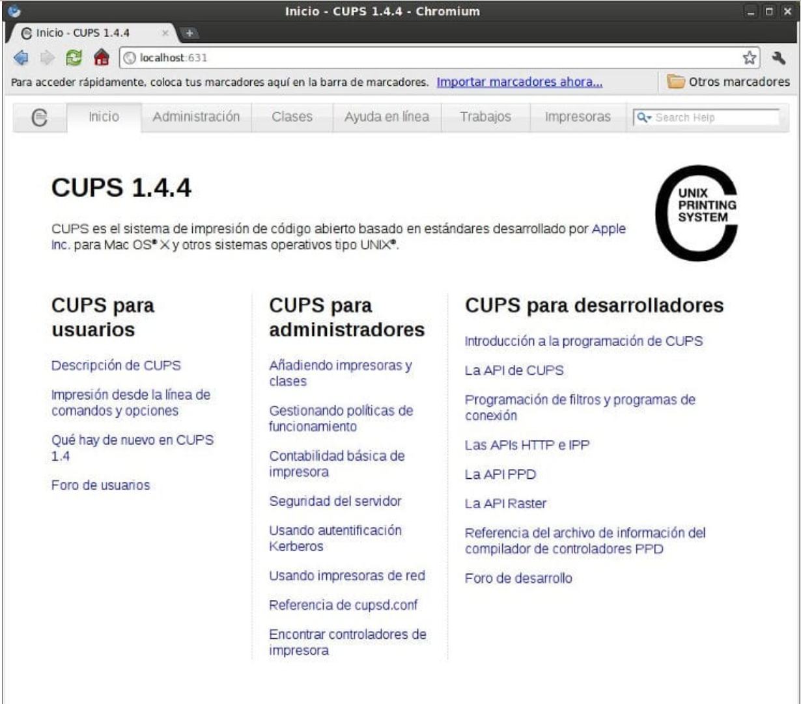

# Instalación y configuración de CUPS

## Instalación

1. Realiza la instalación de CUPS en Ubuntu siguiendo los siguientes pasos:

- Ejecute los siguientes comandos:

``` yaml
sudo apt update
sudo apt install cups
```

- Una vez que `CUPS` está instalado, los siguientes comandos se pueden utilizar para detener, iniciar y habilitar el servicio `CUPS` para que se inicie automáticamente cuando se inicia el servidor.

``` yaml
sudo systemctl stop cups
sudo systemctl start cups
sudo systemctl enable cups
```

- Para verificar que CUPS esté instalado y en ejecución, ejecute los siguientes comandos.

``` yaml
sudo systemctl status cups
```

- A continuación, debería ver una salida similar a la siguiente:

``` yaml
● cups.service - CUPS Scheduler
      Loaded: loaded (/lib/systemd/system/cups.service; enabled; vendor preset: enabled)
      Active: active (running) since Sun 2021-08-15 01:31:30 WAT; 53min ago
 TriggeredBy: ● cups.socket
              ● cups.path
        Docs: man:cupsd(8)
    Main PID: 971 (cupsd)
      Status: "Scheduler is running…"
       Tasks: 1 (limit: 18958)
      Memory: 26.3M
```

- Para instalar el cliente de CUPS en la plataforma Linux:

``` yaml
$ apt‐get install cups‐cliente
```

## Configuración

2. Revisa el archivo de configuración de CUPS para comprobar que todos los paramétros esten bien configurados, adjunta captura de las comprobaciones más importantes, comentandolas.

- El archivo de configuración de CUPS se encuentra en `/etc/cups/cupsd.conf` Es aconsejable crear una copia de seguridad del archivo de configuración:

``` yaml
sudo cp /etc/cups/cupsd.conf /etc/cups/cupsd.conf.original
```

- Luego, ejecute los siguientes comandos para abrir el archivo de configuración de CUPS.

``` yaml
sudo nano /etc/cups/cupsd.conf
```

- A continuación, puede comenzar a configurar los ajustes que se adapten a su entorno. De forma predeterminada, CUPS escucha en el puerto 631. A priori se puede dejar por defecto o cambiar el puerto para añadir seguridad  a la configuración.

``` yaml
#Listen localhost:631
Port 631
```

- También puede asegurarse de que la navegación esté habilitada para permitir que CUPS haga que las impresoras compartidas estén disponibles en la red.

``` yaml
Browsing On
```

- Establezca la siguiente directiva en dnsd protocolo (que admite `Bonjour`), por defecto está habilitado.

``` yaml
BrowseLocalProtocols dnssd
```

!!! note "**NOTA**"
    `Bonjour` es un método para descubrir servicios en una red de área local —LAN, por sus siglas en inglés (Local Area Network)—. Esta tecnología, muy utilizada en Mac OS X, permite a los usuarios establecer una red sin ningún tipo de configuración.

- CUPS también restringe el acceso a la interfaz web del servidor de la impresora y a las páginas de administración mediante las directivas siguientes. Puede configurar permitir antes de denegar para permitir que las ordenadores de la red local accedan a la interfaz web de CUPS. **Revisa que la configuración es correcta.**

``` yaml
#Restrict access to the server
<Location />
 Order allow,deny
Allow @LOCAL
<Location>

#Restrict access to the admin pages.
<Location /admin>
Order allow,deny
Allow @LOCAL
<Location>
```

!!! note "**NOTA**"
    Si prefiere configurar utilizando la interfaz web CUPS, se recomienda utilizar root o un usuario autenticado en el lpadmin grupo.

- Agrega tu usuario a lpadmin grupo, mediante el comando:

``` yaml
sudo usermod -aG lpadmin username
```

- Se debe Reiniciar CUPS.

``` yaml
sudo systemctl restart cups
```

## Administración Web

El demonio de CUPS es una aplicación de servidor que gestiona peticiones HTTP. Además de atender las peticiones de impresión recibidas por el protocolo IPP, el planificador también actúa como un completo servidor web para ofrecer documentación, monitorización del estado de las colas y trabajos y administración del sistema de impresión.

- Por lo tanto se puede acceder por defecto a este servidor web por el puerto `631`. Así, en la máquina local, basta con abrir cualquier navegador indicando la dirección:

``` yaml
http: // localhost: 631
```

<figure>
  
  <figcaption>Panel de control Web de CUPS</figcaption>
</figure>

Se puede observar en la primera pestaña aparecen enlaces para llegar a diferentes fuentes de documentación para usuarios, administradores y desarrolladores.

La sección que lo resume todo es la pestaña de `Administración` , donde hay enlaces a las otras secciones (impresoras, clases y trabajos de impresión) y que permite realizar las siguientes tareas:

- Configurar el servidor: hay algunas opciones del servidor que se pueden configurar automáticamente marcando la casilla correspondiente.
- Ver las impresoras compartidas por otros ordenadores de la red.
- Compartir las impresoras locales.
- Permitir la administración desde ordenadores remotos.
- Utilizar el sistema de autenticación Kerberos.
- Permitir a los usuarios cancelar trabajos de otros usuarios.
- Configurar en nivel de grabación de los archivos de registro.
- Edición directa del archivo de configuración: para ajustar de manera más detallada y completa las opciones de configuración se puede acceder a la edición directa de las directivas contenidas en el archivo / etc / cups / cupsd.conf. Una vez hechas las modificaciones, el mismo sistema se encarga de reiniciar el servicio.
- Visualizar los archivos de registro tanto los de acceso como los de mensajes de error y la lista de páginas impresas.
- Administrar impresoras: gestionar las impresoras del sistema, buscar automáticamente aquellas que estén conectadas o bien darlas de alta manualmente.
- Administrar clases: gestionar las clases de impresoras o gestionar las existentes.
- Administrar trabajo de impresión: visualizar los trabajos de impresión ( jobs ), tanto los finalizados como los que están en curso que se pueden gestionar (cancelar, detener, cambiar de cola ...).

3. Añade la impresora que uses habitualmente en casa o una impresora virtual PDF, Investiga por Internet como se pueden añadir impresoras en CUPS de cualquiera de los dos tipos, desde la `Interfaz de gestión Web` y desde comandos, adjunta capturas del proceso.