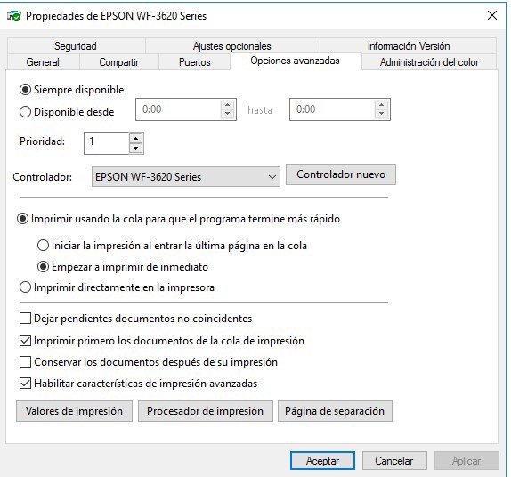
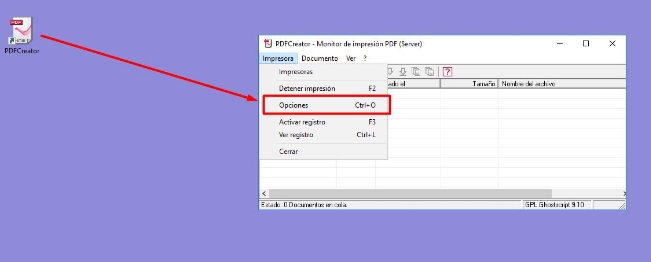
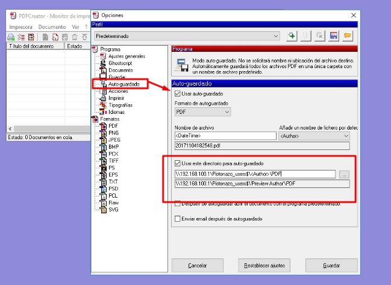
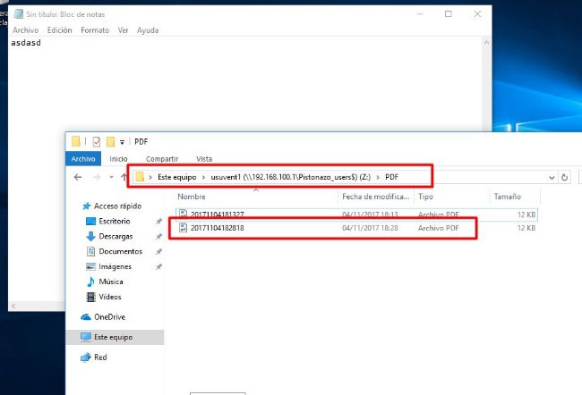



**Opciones avanzadas de Impresión**

La pestaña 'Opciones Avanzadas' nos permite configurar aspectos relacionados con la gestión de los trabajos de impresión:

*Opciones avanzadas de impresión*

Aunque  las  opciones  son  bastante  autoexplicativas,  repasaremos  las  más  interesantes  desde  el  punto  de  vista  de  la administración de una red:

- Disponible desde...: Permite establecer unos periodos de utilización del dispositivo de impresión.
  - Prioridad: Asigna un nivel de prioridad en los trabajos de impresión, siendo el 1 el valor que indica menor prioridad. Esta opción es especialmente útil cuando tenemos varias impresoras lógicas apuntando al mismo dispositivo físico y queremos que la prioridad de cada impresora lógica sea diferente.
    - Controlador: nos permite modificar el controlador de la impresora.
      - Imprimir usando la cola para que el programa termine más rápido: Al realizar la impresión de un documento largo, en primer lugar el equipo lo convierte al lenguaje de la impresora, y a continuación envía página por página de acuerdo a la velocidad del dispositivo de impresión. La colocación en cola de impresión de un documento permite enviar el documento  en  segundo  plano  para  que  el  resto  de  aplicaciones  puedan  seguir  trabajando  con  normalidad.  Sin embargo, la opción 'Imprimir directamente en la impresora' requiere que el sistema espere hasta que la impresión haya terminado para seguir trabajando con la aplicación que envió el trabajo de impresión. Existen dos opciones en 'Imprimir usando la cola para que el programa termine más rápido':
1. Iniciar la impresión al entrar la última página en la cola: permite no empezar a imprimir hasta el momento en que todo el documento esté en la cola, lo que podría ser útil cuando los trabajos de impresión requieren la interacción del usuario.
1. Empezar  a  imprimir  de  inmediato:  Los  clientes  tratan  parcialmente  el  documento  antes  de  enviarlo  a  la impresora lógica. En el momento en el que hay espacio en la cola remota del servidor, el documento es enviado y tratado completamente. Se coloca entonces en espera antes de ser dirigido hacia un dispositivo de impresión

 Imprimir primero los documentos de la cola de impresión: En este caso la prioridad ya no se basa únicamente en el grado de prioridad proporcionado explícitamente; el documento que haya entrado en la cola de impresión tendrá una prioridad superior frente al que acceda posteriormente (incluso si el nuevo documento dispone de un nivel de prioridad más alto).

- Conservar los documentos después de su impresión: Esta opción permite mantener en el administrador de impresión los trabajos impresos. Si no se selecciona esta opción, el documento una vez impreso se elimina de la cola de impresión.
  - Habilitar características de impresión avanzadas: Permite modificar aspectos como el número de páginas a imprimir por hoja, el orden de las mismas, etc.

**Actividades**

**Actividad 1**

En esta actividad instalaremos una impresora en el controlador de dominio y la compartiremos y administraremos en red, como hemos visto en los diferentes apartados de este tema.

La principal diferencia con lo visto hasta ahora consiste en que la impresora que 'conectaremos' al servidor será una impresora pdf, por lo que con el instalable se creará el puerto de impresora y se instalarán los drivers necesarios de una manera prácticamente trasparente para nosotros.

1. En primer lugar instalaremos la impresora pdf.
1. La descargaremos de aquí (es una versión antigua, pero funciona en modo servidor, las nuevas versiones no) y la instalaremos con las opciones por defecto pero en modo servidor.
1. Compartiremos la impresora en red (desde el Administrador de Impresión) para que los usuarios de dominio tengan permiso de impresión.
1. Crearemos una GPO en el dominio pero que solo aplicaremos al grupo (no a la UO) Ventas de nuestra organización de Empresa
1. Configura la impresora pdf para que se despliegue automáticamente en todos los usuarios del grupo Ventas (utiliza la GPO que hemos creado en el punto anterior).
1. Crea un documento de texto en un equipo cliente al que has accedido con un miembro del grupo Ventas.
1. Desde el bloc de notas (notepad) imprime (en la impresora pdf que está albergada en el servidor y que debe aparecer automáticamente a los miembros de Ventas) el fichero que acabas de generar.
1. Inicia sesión con un usuario que no pertenezca a Ventas y comprueba que no aparece la impresora pdf en las opciones de impresión.

Adjunta las capturas de pantalla describiendo el proceso, en especial las correspondientes a los puntos 4, 5, 7 y 8.

**Instalación de la Impresora PDFCreator**

Para realizar la instalación de la impresora PDFCreator, vamos a utilizar el instalador que se encuentra en el siguiente [enlace](https://drive.google.com/open?id=0B7zZjYkWaq2POE5hSmZDZ2RablU). A continuación haré una breve guía de cómo realizar la instalación, ya que es una versión un poco más antigua que la hay ahora disponible, pero esta ofrece la posibilidad de hacer una instalación en modo servidor. También mostraré el objetivo final de la actividad sobre un usuario de ventas de la organización Pistonazo.

Iniciaremos el asistente de instalación sin descargar la nueva versión:

*Instalación de PDFCreator*

Activaremos la instalación modo experto:

*Activar modo experto*

Seleccionaremos la instalación modo servidor:

*Instalación modo servidor*

*Impresora PDFCreator*

La siguiente pantalla nos permite seleccionar los controladores para máquinas con arquitecturas en 32 bits, en nuestro caso no tenemos ninguna, pero si se diera el caso, podríamos imprimir también con los controladores de 32 bits.

*Selección de controladores 32 bits*

A continuación podemos seleccionar un Visor PDF que va con el programa de instalación, PDFArchitect... Si quisierais ver los PDFs generados podéis marcar la opción.

*Componente adicionales*

y procedemos a la instalación:

*Instalación de PDFCreator*

Como todos los programas free, siempre añaden algún programa adicional... seleccionaremos Saltar... para que no instale nada más:

*No instalar programas adicionales*

Una vez instalado, nos aparecerá un icono en el escritorio. Ahora lo que vamos a hacer es configurar las opciones de autoguardado de los documentos PDF, para que de manera automática guarde los documentos en los directorios de las carpetas particulares de los usuarios:

*Configurar opciones*

Y seleccionar autoguardado:

*Configurar autoguardado*

Activaremos la casilla de autoguardado y configuraremos el directorio donde queremos que se guarden los documentos, para el caso de la empresa Pistonazo, este directorio será "\\192.168.100.1\Pistonazo\_users$\<Author>\PDF".  De esta forma cuando se imprima un documento en PDF desde una máquina cliente, se generará de manera automática ese documento en su carpeta personal, dentro de un directorio PDF. 

Tras configurar las opciones de las GPOs y las propiedades de la impresora creada, si iniciamos sesión con un usuario nos aparecerá la impresora PDFCreator:

*Impresión en PDFCreator*

Por último veremos cómo se ha generado el nuevo documento en el directorio PDF de la carpeta personal:

*Impresión de documentos PDF*

El objetivo es que se configure la impresora para nuestra organización y para el grupo de Ventas. Iniciéis sesión y comprobéis los resultados.

Obra publicada con [Licencia Creative Commons Reconocimiento Compartir igual 4.0](http://creativecommons.org/licenses/by-sa/4.0/)
