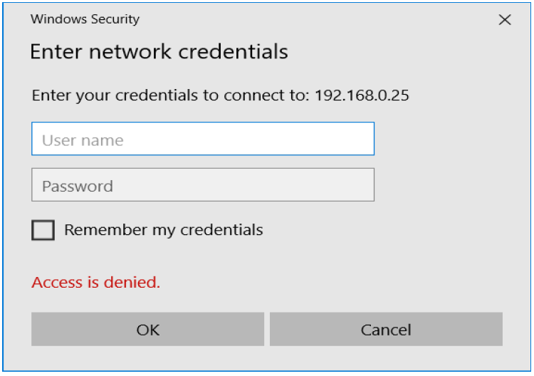

# Configuración de Secciones y Usuarios en SAMBA

## Secciones

Dentro del fichero de configuración encontramos diversas secciones, entre las que destacaremos tres:

- [global]: Las opciones especificadas aquí afectan a cualquier recurso compartido. A tener en cuenta, si una misma opción se declara en la sección global y en otra sección, por ejemplo `ejercicio1`, tendrá mayor peso la de la sección más específica, es decir `ejercicio1`.
- [homes]: Se permite indicar las opciones para el `/home` de los usuarios existentes en el servidor. De tal forma que podríamos acceder a nuestro `/home` desde cualquier máquina del grupo de trabajo de la siguiente forma: `\\IP_SERVIDOR\usuario` &#8594 (file://IP_SERVIDOR/usuario)
- [printers]: Información del trato para la compartición de impresoras en red.

### Parámetros:

`hosts allow/deny`: Permite restringir el acceso por IP:

!!! example "Ejemplo1"
    **Permitir Redes**  
    ``` yaml
    hosts allow = 192.168.2.0/24 192.168.3.0/24
    ```

!!! example "Ejemplo2"
    **Permitir IP específica**  
    ``` yaml
    hosts allow = 192.168.2.5 192.168.3.100 192.168.3.200
    ```

!!! example "Ejemplo1"
    **Permitir acceso a todos los hosts que comiencen por 192.168.**  
    ``` yaml
    hosts allow = 192.168.
    ```

!!! example "Ejemplo1"
    **Deniega acceso a todos los hosts que comiencen por 10.**  
    ``` yaml
    hosts deny = 10.
    ```

- Su funcionamiento es de arriba abajo, como las listas de acceso. Es decir, si tenemos:

``` yaml
hosts allow = 127.0.0.1 192.168.2.0/24 192.168.3.0/24
hosts deny = 127.0.0.1 192.168.2.0/24 192.168.3.0/24
```

**El que cuenta es el primero que coincida, por tanto sí permitiría el acceso.**

## Actividades Secciones SAMBA

!!! note "**NOTA:**"
    - Recuerda reiniciar el servicio de samba tras modificar el fichero smb.conf.
    - Estate atento para eliminar las líneas comentadas, las cuales comienzan por `“#”` y `“;”`

711. Haz que todos los /homes de los usuarios sean navegables, que cualquiera pueda acceder sin credenciales y que solo tengan permisos de lectura. Recuerda que también deberás tener en cuenta los permisos dentro del servidor Linux. Haz captura de la configuración realizada en smb.conf y del explorador de Windows accediendo a tu /home de Ubuntu.
712. Cambia en el servidor, en la sección [homes], la opción read only a no. Haz una captura de los permisos de tu carpeta /home. Prueba a crear un fichero desde Windows. ¿Qué sucede y por qué?
713. Indica la configuración del servicio más adecuada si quisiera permitir únicamente los equipos de la red 10.0.0.0/8  ¿Sigues teniendo acceso desde el cliente? ¿Por qué?
714. Ahora cambia la restricción para permitir acceso únicamente a los hosts de la red en la que te encuentres.

## Usuarios

### El usuario Invitado

Cuando accedemos como “**invitado**” (guest ok) por defecto accedemos como el usuario `nobody:nogroup`. Esto se puede modificar usando el siguiente parámetro:

``` yaml
force user = javi
force group = alumnos
```

De esta forma cuando accedamos al sistema como invitado accederemos como el usuario javi que tiene el grupo principal alumnos.

### Restricción por usuarios

En caso de que no permitamos el acceso de invitados (guest ok = no) el servidor nos solicitará nuestras credenciales:

<figure>
  
</figure>

Se puede restringir los usuarios que pueden tener acceso a un recurso:

``` yaml
valid users = javi pepe jorge
invalid users = root @profesores @root
```

!!! note "**NOTA:**"
    El `“@”` indica que se hace referencia a un grupo. Por tanto ningún usuario perteneciente al grupo root o de profesores puede acceder.

``` yaml
admin users = salva
```

!!! note "**NOTA:**"
    Los usuarios dentro de esta lista actuarán como `root`.

!!! note "**NOTA:**"
    Si un usuario está en el listado de “valid users” y en el de “invalid users” se le deniega el acceso.

### Autentificación en Samba a través de usuarios

Para autentificarse en samba a través de usuarios se deben cumplir 2 requisitos:

1. El usuario debe existir en el sistema `/etc/passwd`

``` yaml
sudo useradd -s /bin/true “usuario”
```

!!! note "**NOTA:**"
    De esta forma no se crea el /home del usuario y no se permite el acceso al sistema si no es a través de samba. Es decir, el usuario no se podría conectar a través de ssh o localmente.

2. El usuario debe existir en el servicio de samba (`pbedit -L`).

``` yaml
sudo smbpasswd –a “usuario”
```

!!! note "**NOTA:**"
    La contraseña es recomendable que sea diferente a la usada en el sistema.

- **Listar usuarios dados de alta en SAMBA:**

``` yaml
pdbedit -L
```

## Actividades Usuarios SAMBA

715. Prueba a crear un usuario con smbpasswd sin que éste exista en el sistema Linux. ¿Qué sucede? Adjunta una captura.
1. Crea el usuario “leonardo” en el sistema linux, recuerda que dicho usuario solo debe ser capaz de acceder al sistema a través de samba. Posteriormente crealo para samba. Visualiza los usuarios de samba y fíjate en el UID asignado al usuario recién creado ¿tiene el mismo UID que en el sistema Linux (/etc/passwd)? Adjunta capturas de todo el proceso.
716. Cierra la sesión actual en el servidor (exit) e intenta iniciar sesión con el usuario “leonardo” ¿Qué sucede y por qué?
717. Edita en el servidor la sección [homes] con “force user = root”. Reinicia el servicio. Intenta crear, desde el cliente de Windows, un documento en el escritorio del /home compartido. ¿Te permite crearlo? ¿Por qué? ¿Qué permisos y usuario propietario tiene el fichero creado? Adjunta capturas a las explicaciones.
718. Cambia la configuración en el servidor de la carpeta “/home/usuario/ejercicio2” para que no permita el acceso de invitados y solo permita al usuario “leonardo”. Muestra la configuración. Intenta acceder desde el cliente Windows con las credenciales de tu usuario (en vez de javi usa tu usuario) ¿Qué sucede? Adjunta capturas de pantalla.