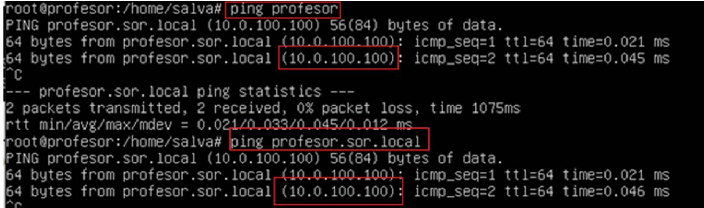

# SAMBA-DC (Domain Controller).

En esta práctica se realizarán los siguientes puntos:

- La configuración del Controlador de Dominio en Samba.
- Se agregarán clientes de windows.
- Configuración de recursos compartidos.
- Activación de RSAT.
- Configuración de perfiles móviles.

## Recordatorio Controlador de Dominio (DC).

- Es un **servidor** que se ocupa de permitir el acceso a ciertos usuarios a ciertos recursos del dominio.
- Un **dominio** es un grupo de recursos (equipos, ficheros, usuarios, impresoras, etc.) dentro de una red. El acceso a dicho dominio o las políticas de seguridad de todos esos recursos es administrada por el controlador de dominio.
- Habitualmente se implementan en Windows Server, aunque también se pueden implementar en Linux bajo samba.
- En una implementación adecuada, se despliega más de un controlador de dominio a la vez que actúan como uno (cluster) de esta forma se dota al servicio de redundancia y alta disponibilidad, es decir, que si se produce una avería en un control de dominio el servicio sigue activo pues hay otro/s controladores activos.
- Los dominios usan rutas de nombres similares a los DNS, tienen una ruta absoluta FQDN (Full
Qualified Domain Name) y una ruta relativa PQDN (Partially Qualified Domain Name).

!!! note "**NOTA:**"
    Independientemente del sistema operativo usado necesitaremos de otros servicios para complementar, a continuación se enumeran:

- **LDAP**: Será la base de datos que alberga la información de los usuarios.
- **Kerberos**: Se encarga de la seguridad a nivel de autentificación segura de los usuarios.
- **DNS**: Habitualmente el acceso al dominio se hace a través de un nombre de dominio. El
servicio DNS permite la resolución de ese nombre de dominio al direccionamiento IP.
- **NTP**: Es el servicio que se encarga de la sincronización del reloj de cada máquina.

## Actividades

1. Realiza un **snapshot** de tu máquina virtual.
2. Configura la máquina virtual en formato “**Nat Network**”.
3. Establecemos una configuración de red para tu servidor.
    1. Un dominio de búsqueda (**Search Domain**) nos va a permitir que si el servidor recibe una búsqueda de petición de un recurso, por ejemplo “maquina03”, automáticamente el servidor va intentar buscar por el nombre de dominio completo: “maquina03.sor.com”. Es decir, intenta resolver una ruta relativa de dominio (PQDN) a una ruta absoluta de dominio (FQDN).
    2. Acordaros de aplicar los cambios con **netplan apply**.

<figure>
  
</figure>

4. Instalar los paquetes “**dnsutils**”.
    1. El paquete dnsutils simplemente son una serie de herramientas que nos ayudarán a comprobar que la resolución del nombre de nuestro dominio es correcta.
5. Es conveniente saber cuál es el nombre de nuestra máquina:

<figure>
  
</figure>

6. En el fichero `“/etc/hosts”` es como un servicio DNS local, es decir, tiene una serie de pares `nombres/IP` que resuelve localmente. Por ejemplo si le hago ping a `“profesor”` mi máquina sabe resolverlo a la IP `127.0.1.1` que es la IP de loopback.
    1. Realiza una copia de seguridad del fichero `/etc/hosts`.
    2. Modifica el fichero original (`/etc/hosts`) para que resuelva el nombre de tu máquina y tu FQDN en este caso `profesor.sor.local` a la IP del servidor `10.0.100.100` en este caso.
    3. Comprueba con un ping a los nombres que funciona y te contesta con la IP.

- **Ejemplos:**

<figure>
  
  <figcaption>Ping a profesor.</figcaption>
</figure>

<figure>
  
  <figcaption>Comprobación `/etc/hosts`.</figcaption>
</figure>

<figure>
  
  <figcaption>Comprobación de ping al localhost debería contestar 127.0.0.1.</figcaption>
</figure>

<figure>
  
  <figcaption>Comprobaciónes de ping.</figcaption>
</figure>

7. A continuación instalamos los paquetes “**attr**” y “**acl**” que nos darán más opciones de seguridad y mayor compatibilidad al interconectar con equipos clientes Windows a nuestro dominio.

8. Vamos a aplicar estos paquetes al **sistema cuando se arranque**. Para ello, hacemos una copia de seguridad del fichero `/etc/fstab` y posteriormente lo editamos. **Importante** que el separador en este fichero es el tabulador.
    1. Simplemente hay que añadir en el raíz (“/”) las opciones **user_xattr,acl,barrier=1,defaults** donde antes sólo ponía defaults.
    2. Importante no equivocarse y hacerlo en el “/”, no en el `/boot` ni en la memoria **swap**.
    3. Reiniciar el server (reboot).

- **Ejemplos:**

<figure>
  
  <figcaption>attr y acl acl al sector de arranque en /etc/fstab.</figcaption>
</figure>

9. Ahora vamos a instalar el paquete **NTP**, ya que es necesario tener sincronizada la hora para servicios del estilo **firewall**, **LDAP**, para los registros de los logs, para el servicio activo de Windows, etc.
    1. Se puede comprobar que el servicio está activo con `“systemctl status ntp”`

10. **Detenemos y deshabilitamos** cualquier servicio que tuviéramos de samba (que no fuera de
    controlador de dominio) previa a la instalación.

<figure>
  
</figure>

11. Eliminamos cualquier configuración previa de samba o de kerberos.

12. Vamos a instalar los siguientes paquetes:
    1. **Samba** &#8594 En el paquete ya viene integrado un módulo de LDAP para almacenar los usuarios.
    2. **krb5-config** &#8594 Es la configuración de Kerberos que usaremos en samba. Habrá que instalarlo más adelante.
    3. **winbind** &#8594 Paquete necesario para que un cliente de Windows se pueda autentificar en nuestro sistema DC en Linux.
    4. **smbclient** &#8594 Instalaremos el cliente samba, simplemente para tener ciertos comandos de consulta, realmente no es necesario para montar el servidor.

13. Durante la instalación del **Kerberos** nos pedirá 3 cosas principalmente:
    a. El reino (realm): Pondremos el mismo que nuestro dominio.
    b. La IP del servidor Kerberos
    c. La IP para la administración del Kerberos.

En este caso nuestro servidor de kerberos va a estar en el propio controlador de dominio que estamos
configurando, pero en otra situación se podría tratar de una máquina independiente.

<figure>
  
</figure>

14. Comprobamos que el servicio **samba-ad-dc** funciona y está activo:

<figure>
  
</figure>

15. hora vamos a pasar a configurar el controlador de dominio de samba. Vamos a hacer uso de samba-tool para completar la configuración:
    1. `samba-tool domain provision --use-rfc2307 --interactive`

Dentro de la configuración cogerá el reino/dominio de nuestro servidor, por lo que no tenemos que rellenar nada, **excepto la parte de DNS forwarder que usaremos la DNS de google (8.8.8.8)**. Esto lo hacemos porque nosotros seremos el servidor DNS, pero si no sabemos resolver una página pasaremos la solicitud de resolución al servidor DNS forwarder (8.8.8.8).

Como **contraseña** de administrador necesita tener una **mayúscula/minúscula/número/longitud de 8**. El usuario por defecto es “administrator”

Si todo ha salido bien, nos habrá creado el fichero smb.conf acorde a nuestra configuración:

<figure>
  
</figure>

- **[global]**: Donde se puede observar todos los datos de configuración del dominio, además de los
roles para los que se ha creado (DC-AD).
- **[netlogon]**: Ya ha creado de forma automática la carpeta para los scripts de inicio de sesión de
los clientes.
- **[sysvol]**: El sysvol es reponsable de replicar las GPOs (Políticas de Grupos) aplicadas en el editor
de directivas de grupo, todos los cambios y GPOs nuevos son replicados por alli.

16. Ahora pasamos a instalar Kerberos, antes solo habíamos asociado la configuración a samba (reino, dns, password, etc). Para ello instalamos el paquete “**krb5-user**”.

<figure>
  
</figure>

17. A continuación copiamos la configuración de kerberos para samba por la configuración por defecto de kerberos:

``` yaml
cp /var/lib/samba/private/krb5.conf /etc/krb5.conf
```

18. Detemos system-resolved para que no nos manipule automáticamente el fichero `/etc/resolv.conf`

<figure>
  
</figure>

19. Finalmente comprobamos que la configuración de Kerberos está bien:

<figure>
  
</figure>

20. Como ya tenemos configurado el DNS forwarder, volvemos a nuestra configuración de red y cambiamos el servidor DNS como a nosotros mismos, para resolver las peticiones de nuestro dominio. Acordaros del netplan apply.

<figure>
  
</figure>

Finalmente podemos ver el resumen de nuestro dominio:

<figure>
  
</figure>

Comprobamos que funciona la resolución al dominio:

<figure>
  
</figure>


## Agregar un cliente Windows al dominio de Samba.

### Crear Usuario en el Controlador de Dominio

Lo primero será tener un usuario válido para acceder al dominio, para ello vamos a nuestro servidor que hace de controlador de dominio y creamos dicho usuario:

!!! tip "**Redorcatorio**"
    Recuerda a la hora de insertar la contraseña que debe cumplir con un mínimo de 8 caracteres, una mayúscula, una minúscula y un número.

<figure>
  
</figure>

- Para el usuario “niko” se ha creado la contraseña “Niko1234#”

<figure>
  
</figure>

!!! note "**NOTA:**"
    A diferencia de lo que pasaba en samba, cuando NO era un controlador de dominio, el usuario no es necesario que exista en el sistema y además los UID no son iguales a los del sistema operativo.

<figure>
  
</figure>

### Añadir el Cliente Windows al Dominio Samba.

1. Añade al cliente en la misma red interna que el controlador de dominio de SAMBA, en nuestro caso una `“NAT Network”`. Ésta red se le asignará una IP automática y una puerta de enlace, pero debemos forzarle que el servidor DNS sea nuestro controlador de dominio.

!!! note "**NOTA:**"
    En una situación real, el propio controlador de dominio actuaría de servidor DHCP, o en el caso de tener un servicio DHCP ya asignaría el DNS automáticamente del controlador de dominio, por lo que no habría que hacer este paso.

<figure>
  
  <figcaption>Configuración de Propiedades de Red en Windows.</figcaption>
</figure>

<figure>
  
  <figcaption>Comprobación conexión con Server.</figcaption>
</figure>

2. Vamos a introducir el cliente dentro de nuestro dominio:
  
  - Botón derecho – Propiedades sobre el icono de `“Equipo”`.
  - Pinchar en `“Cambiar Configuración”`.
  - Posteriormente le damos a `“cambiar..”` y seleccionamos nuestro dominio.

<figure>
  
  <figcaption>Propiedades Equipo.</figcaption>
</figure>

<figure>
  
  <figcaption>Cambio para sellecionar dominio.</figcaption>
</figure>

!!! note "**NOTA:**"
  Es muy importante que accedamos con un usuario con permisos de administrador en el servidor linux, si os acordáis Kerberos es el servicio que se encarga de la seguridad de nuestro controlador de dominio, y por defecto éste crea el usuario `“administrator”`.

<figure>
  
  <figcaption>Cambio de usuario a Administrador.</figcaption>
</figure>

<figure>
  
  <figcaption>Confirmación cambio Dominio.</figcaption>
</figure>

- Finalmente reiniciamos el equipo cliente e intentamos acceder con un usuario del controlador de dominio, como por ejemplo “niko”, fijaros que es un usuario que no existe en el Windows a nivel local, existe en el servidor, por lo que “niko” se podría registrar en cualquier equipo asociado al dominio.

<figure>
  
  <figcaption>Comprobación de Logueo.</figcaption>
</figure>

## Compartir recursos en un dominio entre Windows y Servidor Ubuntu.

A la hora de compartir recursos es prácticamente igual a cuando se realizaba en Samba sin directorio activo.

1. Crear la carpeta a compartir y darle permisos requeridos.
2. Acceder al fichero de configuración de samba.
3. Generar un recurso a compartir.

<figure>
  
  <figcaption>Ejemplo recurso compartido.</figcaption>
</figure>

4. Reiniciar el servicio.
  1. Ahora el servicio de **samba** esta configurado como directorio activo podemos hacer:

``` yaml
smbcontrol all reload-config
```

- Para que cualquier usuario del dominio pueda administrar un recurso podemos agregarle al recurso el grupo `“Domain Users”`, se puede comprobar que existe con el siguiente comando dentro de la base de datos de Samba.

<figure>
  
</figure>

### winbind

El problema que tendremos, la primera vez, es que ese grupo no tiene un **GID (identificador de grupo)** asociado del sistema operativo Ubuntu Server. Para ello vamos a usar `“winbind”` para que pueda traducir a partir de un grupo de samba a un grupo del sistema y hacer una equivalencia.

- Se instalan los paquetes:

``` yaml
apt-get install libnss-winbind
apt-get install libpam-winbind
```

- Se modifica el fichero `“/etc/nsswitch.conf”` que revisa donde tiene que buscar el registro de `usuarios/grupos` del sistema. “Files” será su primera opción, que será `/etc/passwd` y `/etc/groups`, si no los encuentra ahí pasa a usar el servicio winbind para hacer la equivalencia con samba AD.

<figure>
  
</figure>

- Finalmente se puede comprobar que funciona y que cuando le preguntamos al sistema por el grupo del controlador de dominio `“Domain Users”` el sistema nos indica que es capaz de relacionarlo con un identificador de grupo, en este caso el `100`.

<figure>
  
</figure>

- En el ejemplo se ve que el usuario del dominio niko pertenece al grupo 100 que es el de domain users.

<figure>
  
</figure>

- Finalmente se añaden todas las carpetas a compartir y sus rutas padres al grupo del dominio:

``` yaml
chgrp -R "Domain Users" /recursosSOR
chmod 2750recursosSOR
```

!!! note "**NOTA:**"
    Si se había iniciado sesión con tu usuario de Windows 10 antes de cambiar la configuración de `/etc/nsswitch`, cierra sesión y vuelve a acceder.

- En el `cliente Windows 10` que ya está unido al dominio deberemos:

1. Comprobar que navega por Internet.
2. Acceder a una `carpeta/directorio` y buscar el nombre de tu equipo que está compartiendo el recurso, en este caso es el propio servidor.

<figure>
  
</figure>

!!! note "**NOTA:**"
    No debería pedir credenciales, porque ya habíamos iniciado sesión como “niko” en este ordenador que pertenece al dominio y a Domain Users.

- Además, desde las propiedades de seguridad del cliente Windows podemos cambiar las **políticas de acceso de esa carpeta compartida** (siempre que tengamos permisos en el servidor para ello).

<figure>
  
</figure>

## Activar RSAT

Se debe aplicar a `Aplicaciones y Características` – `Características Opcionales` y se agrega una nueva característica:

<figure>
  
  <figcaption>Características Opcionales.</figcaption>
</figure>

<figure>
  
  <figcaption>Agregar una Característica.</figcaption>
</figure>

- Para agregar filtramos por **RSAT** y activamos:

<figure>
  
  <figcaption>Agregar RSAT.</figcaption>
</figure>

## Perfiles Móviles.

Un perfil móvil, es aquel donde un usuario se registre en la máquina que se registre, si ésta pertenece al dominio, tendrá sus ficheros personales con los que trabaja día a día.

### Configuración de Políticas de Cliente

Como administradores, si queremos implementar perfiles móviles, tenemos dos opciones.

1. Indicar que el perfil de cada usuario debe apuntar al servidor, en nuestro caso el **samba ubuntu server**.
2. Crear una política de grupo para que cada usuario que acceda a dicha máquina directamente se le genere el perfil adecuado.

!!! note "**NOTA:**"
    Obviamente, la solución b) es mucho más escalable y por tanto más adecuada.

#### OPCIÓN 1

1. Entra al cliente Windows como Administrador (**Administrator**).
2. Por curiosidad, ahora puedes ir a `“Usuarios y Equipos de Active Directory”` y ver/gestionar los grupos del directorio activo desde el propio Windows.
3. En las propiedades del usuario y luego en su perfil:

<figure>
  
  <figcaption>Usuarios y Equipos.</figcaption>
</figure>

<figure>
  
  <figcaption>Propiedades niko.</figcaption>
</figure>

#### OPCIÓN 2

1. Entra al cliente Windows como Administrador (**Administrator**).
2. Accede a la administración de directivas de grupo (GPO).
3. Crea una **GPO** asociado al dominio.

<figure>
  
  <figcaption>Creamos GPO.</figcaption>
</figure>

4. Editamos la nueva política creada.

<figure>
  
  <figcaption>Editar nueva política.</figcaption>
</figure>

5. Ahora Navegamos por `Configuración del Equipo` &#8594 `Directivas` &#8594` Plantillas Administrativas` &#8594 `Sistema` &#8594 `Perfiles de Usuario.`

- Dentro de Perfiles de Usuario seleccionamos la plantilla sobre perfiles móviles para todos los usuarios conectados al equipo.

<figure>
  
  <figcaption>Establecer Perfil móvil.</figcaption>
</figure>

<figure>
  
  <figcaption>Ruta para Perfil móvil.</figcaption>
</figure>

- Una vez modificado la política, ésta se actualiza en el servidor (Ubuntu Server) n la ruta `Sysvol`. Es decir si vamos al fichero de configuración de Samba, vemos que hay un recurso compartido llamado `sysvol`.

<figure>
  
  <figcaption>Ruta sysvol.</figcaption>
</figure>

- Si investigamos dentro de esa carpeta vemos que hay una sección de Políticas que justo se ha creado al mismo momento que hemos aplicado las políticas:

<figure>
  
  <figcaption>Confirmación Ruta.</figcaption>
</figure>

### Confirmación de Recursos

- Se debe crear la carpeta donde se almacenarán los recursos de los usuarios y Configurar acceso a cualquier usuario perteneciente al grupo de administradores del dominio:

<figure>
  
</figure>

- Posteriormente lo agregamos como un recurso a compartir:

<figure>
  
</figure>

- Reiniciamos el servicio:

``` yaml
smbcontrol all reload-config
```

- Desde Windows (que es más visible) gestionamos los permisos de los perfiles de los usuarios, para ello accedemos a `\\profesor` y a las propiedades de “profiles”:

Si queremos agregar algún grupo/usuario que no esté, como podría ser Domain Users:

<figure>
  
</figure>

- Una vez tengamos agregados todos los grupos que queremos , vamos a filtrar e indicar los permisos de cada uno.

<figure>
  
</figure>

- Opciones de Compartición:

<figure>
  
</figure>

- Opciones de Seguridad:

<figure>
  
</figure>

<figure>
  
</figure>

### Acceso desde el usuario

Ahora cada vez que nos registremos en cualquier ordenador del dominio, aunque sea la primera vez, ya tendremos configurada una carpeta compartida en nuestro perfil para nosotros solos (y los administradores).

<figure>
  
</figure>

### Redirección

Entre sistemas Linux sí se podía direccionar directamente el `/home` de un usuario a una carpeta del servidor `[homes]`. En el caso de Windows debemos realizar una redirección.

1. Accedemos como “**administrator**”.
2. Accede a la administración de directivas de grupo (**GPO**).
3. Crea una **GPO** asociado al dominio.

<figure>
  
</figure>

4. Editamos la nueva política creada.

<figure>
  
</figure>

5. Accedemos a las propiedades de la carpeta que queremos redireccionar:

<figure>
  
</figure>

<figure>
  
</figure>

6. Cerramos sesión y Registramos con otro usuario no administrador.

Una vez registrados creamos unos ficheros en el escritorio o carpetas, como si estuvieramos trabajando y cerramos la sesión.

Al cerrar la sesión se migran los ficheros al servidor y si nos conectáramos a cualquier otra máquina tendríamos nuestro Escritorio y ficheros con nosotros.

<figure>
  
</figure>

!!! tip "**A tener en cuenta**"
    Obviamente en la empresa, en caso de tener un AD con Samba como DC, no hará falta configurar cada cliente Windows (crear las políticas, etc), si no que usaremos una imagen, creada por ejemplo con clonezilla, y distribuiremos esa imagen con las políticas ya configuradas a todas las máquinas.

