# Práctica: Configuración de Active Directory en AWS Academy

## Objetivos

Durante esta práctica aprenderás a configurar **Active Directory Domain Services (AD DS)** en una instancia de **Windows Server** en **AWS Academy** y unir clientes al dominio. Esta práctica complementa la PR302 y te permitirá trabajar con servicios de directorio propietarios en un entorno cloud.

Al finalizar esta práctica serás capaz de:

- Configurar **Active Directory Domain Services** en Windows Server 2025 en AWS.
- Configurar **DHCP en AWS** para soportar el dominio de Active Directory.
- Configurar **grupos de seguridad** para permitir los servicios necesarios de Active Directory.
- Promover un servidor a **controlador de dominio**.
- Crear y unir **clientes al dominio** de Active Directory.
- Configurar **acceso remoto RDP** para usuarios del dominio.
- Documentar el proceso completo de configuración.

## Requisitos previos

Antes de comenzar, asegúrate de tener completada la **PR302** o tener:

- **Una instancia de Windows Server 2025** funcionando en AWS EC2 y accesible mediante RDP.
- **Una segunda instancia** de Windows Server o Windows 10/11 como cliente.
- **Acceso RDP** a ambas instancias.
- **Conocimiento básico** de Active Directory y conceptos de dominio.
- **Acceso a AWS Academy** con créditos disponibles.

!!! note "Nota importante"
    Esta práctica requiere dos instancias de Windows Server (o una de servidor y una de cliente). Asegúrate de tener suficientes créditos en AWS Academy Learner Lab.

## Tareas a realizar

1. **Preparación del entorno**:

   - Asegúrate de tener completada la PR302 o tener dos instancias de Windows funcionando.
   - Anota las IPs privadas de ambas instancias.

2. **Configuración de DHCP en AWS**:

   - Crea un conjunto de opciones de DHCP con el nombre de dominio y servidor DNS.
   - Asocia el conjunto de opciones a la VPC.
   - Reinicia las instancias para aplicar los cambios.

3. **Configuración del grupo de seguridad**:

   - Añade las reglas necesarias para Active Directory (DNS, LDAP, Kerberos, SMB, RPC, etc.).
   - Verifica que todas las reglas están correctamente configuradas.

4. **Instalación de Active Directory**:

   - Instala el rol Active Directory Domain Services.
   - Promueve el servidor a controlador de dominio.
   - Verifica que el dominio se creó correctamente.

5. **Preparación del servidor**:

   - Crea un usuario en el dominio y añádelo al grupo **Administradores del dominio** (Domain Admins) para poder gestionar el dominio y unir clientes.

6. **Unión del cliente al dominio**:

   - Verifica la conectividad y resolución DNS desde el cliente.
   - Une el cliente al dominio.
   - Verifica que el cliente aparece en el dominio.

7. **Configuración de acceso remoto**:

   - Configura el escritorio remoto para usuarios del dominio.
   - Conecta usando credenciales del dominio.
   - Verifica que el acceso funciona correctamente.

8. **Documentación**:

   - Crea un documento que explique:
     - Los conceptos de Active Directory Domain Services.
     - El proceso de configuración de DHCP en AWS.
     - La configuración de grupos de seguridad para Active Directory.
     - Los pasos realizados para la instalación y configuración.
     - Capturas de pantalla que demuestren el funcionamiento.
     - Problemas encontrados y soluciones aplicadas.

## Entregables

Para la entrega de esta práctica, deberás proporcionar:

1. **Documentación**:

   - Documento en Markdown con:
     - Descripción de Active Directory Domain Services.
     - Proceso de configuración de DHCP en AWS para el dominio.
     - Configuración de grupos de seguridad para Active Directory.
     - Pasos seguidos para la instalación de AD DS.
     - Proceso de promoción a controlador de dominio.
     - Creación de un usuario administrador del dominio (Domain Admins).
     - Pasos para unir un cliente al dominio.
     - Configuración de acceso remoto para usuarios del dominio.
     - Capturas de pantalla del proceso completo.
     - Comandos utilizados y su explicación.
     - Verificación del funcionamiento del dominio.

2. **Evidencias**:

   - Las capturas de pantalla deben mostrar:
     - Configuración de DHCP en AWS.
     - Asociación del conjunto de opciones DHCP a la VPC.
     - Configuración del grupo de seguridad con los puertos de Active Directory.
     - Instalación de Active Directory Domain Services.
     - Promoción a controlador de dominio.
     - Usuario del dominio añadido al grupo Domain Admins.
     - Cliente unido al dominio.
     - Configuración de escritorio remoto para usuarios del dominio.
     - Conexión RDP usando credenciales del dominio.
     - Verificación del dominio con comandos de PowerShell.

## Introducción

### ¿Qué es Active Directory Domain Services?

**Active Directory Domain Services (AD DS)** es el servicio de directorio de Microsoft que proporciona autenticación y autorización centralizadas para usuarios y equipos en una red Windows. AD DS permite:

- **Gestión centralizada** de usuarios, equipos y recursos de red.
- **Autenticación única** (Single Sign-On) para usuarios.
- **Políticas de grupo** para gestionar configuraciones de equipos.
- **Servicios de directorio** para aplicaciones y servicios.

### Active Directory en AWS

Configurar Active Directory en AWS permite:

- Trabajar con servicios de directorio en un entorno cloud.
- Entender cómo los servicios de AWS (VPC, DHCP, Security Groups) interactúan con Active Directory.
- Practicar la configuración de dominios en un entorno realista.
- Preparar para escenarios de migración o híbridos (on-premises y cloud).

> **Recursos de apoyo**

<figure style="width: 100%; margin: 0; padding: 0;">
  <div style="position: relative; width: 100%; padding-bottom: 56.25%; height: 0; overflow: hidden;">
    <iframe src="https://www.youtube.com/embed/DJQ1f84_GcI" title="Configuración de Active Directory" frameborder="0" allow="accelerometer; autoplay; clipboard-write; encrypted-media; gyroscope; picture-in-picture; web-share" allowfullscreen style="position: absolute; top: 0; left: 0; width: 100%; height: 100%;"></iframe>
  </div>
  <figcaption>Video tutorial: Configuración de Active Directory</figcaption>
</figure>

## Paso 0: Preparar las instancias

### Requisito previo: Completar PR302

Esta práctica asume que ya has completado la **PR302: Acceso remoto a Windows Server en AWS Academy** y tienes:

1. **Instancia del servidor**: Windows Server 2025 funcionando y accesible mediante RDP.
2. **IP privada del servidor**: Anota la IP privada de la instancia del servidor (ej: `172.31.49.71`).

### Crear una instancia cliente

Si no tienes una segunda instancia, crea una siguiendo los pasos de la PR302:

1. **Crea una nueva instancia** en EC2 con:

   - **AMI**: Windows Server 2025 Base (o Windows 10/11 si está disponible)
   - **Tipo**: t3.large
   - **Misma VPC y subred** que el servidor
   - **Grupo de seguridad**: Permite RDP (3389)
   - **Clave**: La misma que usaste para el servidor

2. **Conecta mediante RDP** a la instancia cliente y anota su IP privada.

## Paso 1: Configurar el nombre del equipo servidor

Antes de instalar Active Directory, debemos configurar un nombre apropiado para el servidor:

1. **Conecta mediante RDP** a tu instancia de Windows Server.
2. **Abre "Configuración"** → **"Sistema"** → **"Acerca de"**.
3. **Haz clic en "Cambiar el nombre de este equipo"** (o "Cambiar" en "Renombrar este equipo").
4. Introduce un nombre descriptivo (ej: `DC01`, `SRV-AD01`, `SERVER-AD`).
5. **Haz clic en "Siguiente"** y **reinicia** la instancia cuando se solicite.

<figure>
  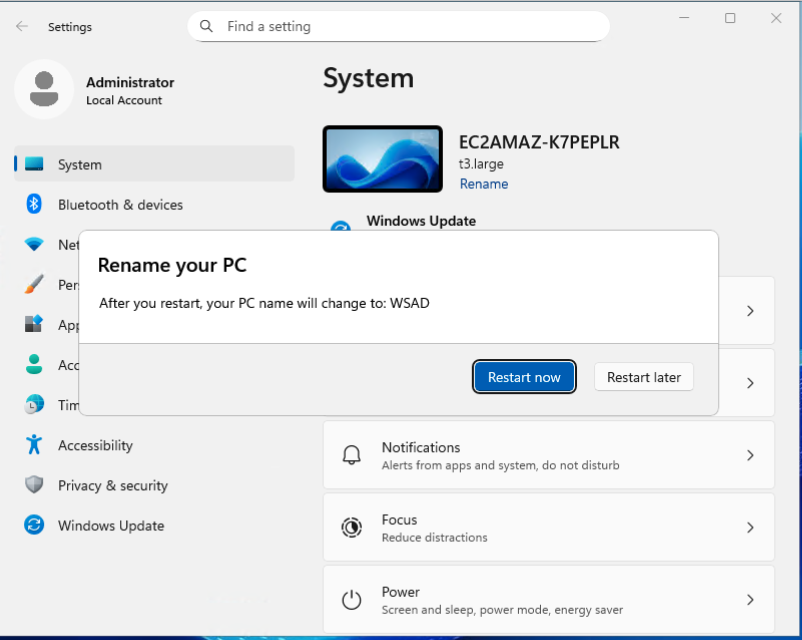
  <figcaption>Pantalla de Windows Server donde se cambia el nombre antes de instalar Active Directory.</figcaption>
</figure>


!!! note "Nota"
    El nombre del equipo debe cumplir con las convenciones de nomenclatura de Windows:

    - Máximo 15 caracteres
    - Solo letras, números e hyphens
    - No puede contener espacios ni caracteres especiales

## Paso 2: Configurar DHCP en AWS

Para que los clientes puedan unirse al dominio y resolver nombres correctamente, necesitamos configurar DHCP en AWS para que proporcione la información del dominio y el servidor DNS.

### 1. Obtener la IP privada del servidor

1. En la consola de EC2, **selecciona tu instancia del servidor**.
2. En la pestaña **"Detalles"**, busca **"Dirección IPv4 privada"**.
3. **Anota esta IP** (ej: `172.31.49.71`).

### 2. Crear conjunto de opciones de DHCP

1. En la consola de AWS, **busca "VPC"** en la barra de búsqueda de servicios.
2. **Haz clic en "VPC"** para acceder al servicio.
3. En el menú lateral, **haz clic en "Conjuntos de opciones de DHCP"**.

<figure>
  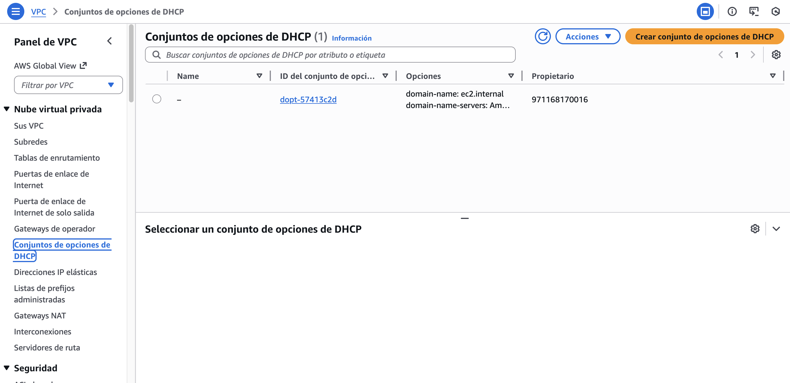
  <figcaption>Pantalla de conjuntos de opciones de DHCP en AWS VPC</figcaption>
</figure>

4. **Haz clic en "Crear conjunto de opciones de DHCP" (Create DHCP options set), y rellena los campos del formulario de la siguiente manera**:

   - **Nombre**: Escribe un nombre identificativo, por ejemplo: `DHCP_AD`.
   - **Nombre de dominio**: Introduce el dominio DNS que utilizarán tus equipos, por ejemplo: `empresa.local` o el nombre de dominio que vayas a utilizar en Active Directory.
   - **Servidores de nombres de dominio**: Escribe la **IP privada** de tu instancia de Windows Server (por ejemplo: `172.31.49.71`). Así, todos los clientes obtendrán como DNS principal tu controlador de dominio.
   - Puedes dejar las demás opciones (NetBIOS, etiquetas) en blanco o su valor predeterminado, salvo que se indique lo contrario en tu práctica.

<figure>
  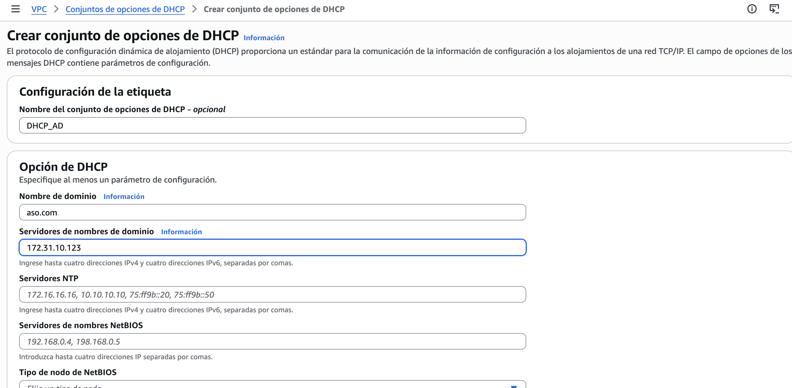
  <figcaption>Ejemplo de configuración de un nuevo conjunto de opciones de DHCP en AWS, indicando nombre de dominio y dirección del servidor DNS (Windows Server AD).</figcaption>
</figure>

!!! warning "Importante"
    Asegúrate de que la IP indicada como "servidor de nombres de dominio" sea **exactamente** la IP privada de tu Windows Server donde instalarás Active Directory. Si este valor no es correcto, los clientes no podrán usar el DNS del controlador de dominio y no funcionará la unión al dominio.

!!! tip "Convenciones de nombres de dominio"
    Puedes usar:

    - **Dominios locales**: `.local` (ej: `empresa.local`) - Recomendado para prácticas
    - **Dominios públicos**: `.com`, `.net`, etc. (ej: `miempresa.com`) - Solo si no tienes conflicto con dominios reales
    - **Evita usar**: Dominios que ya existen en Internet (ej: `google.com`, `microsoft.com`)


### 3. Asociar el conjunto de opciones a la VPC

1. En el menú lateral de VPC, **haz clic en "Sus VPC"** (Your VPCs).
2. **Selecciona tu VPC** (normalmente hay una VPC predeterminada en AWS Academy).
3. **Haz clic en "Acciones"** → **"Editar la configuración de VPC"** (Edit VPC configuration).

<figure>
  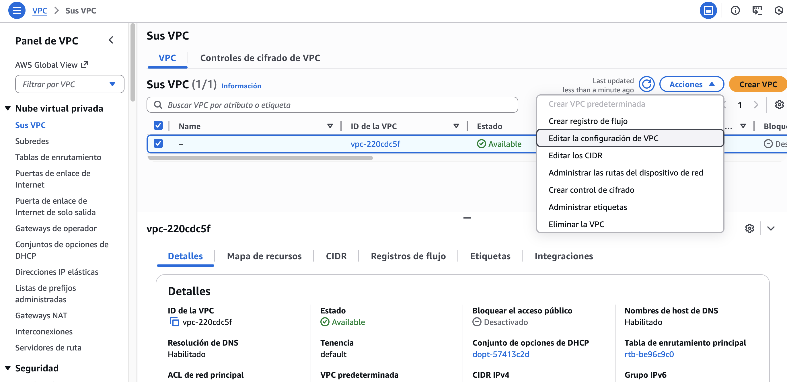
  <figcaption>Edición de la configuración de VPC y selección del conjunto de opciones DHCP</figcaption>
</figure>

4. En la sección **"Configuración de DHCP"**, selecciona el conjunto de opciones que acabas de crear (ej: `DHCP_AD`) en el menú desplegable **"Conjunto de opciones de DHCP"**.
5. **Haz clic en "Guardar"** para aplicar los cambios.


<figure>
  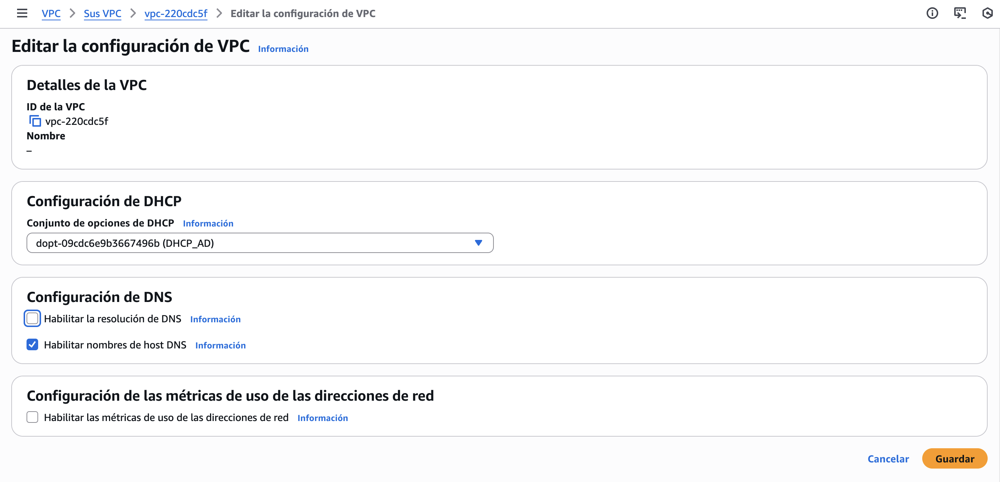
  <figcaption>Selección del VPC por defecto y asignación del Conjunto de DHCP creado.</figcaption>
</figure>

### 4. Reiniciar las instancias

Para que los cambios de DHCP surtan efecto:

1. **Reinicia ambas instancias** (servidor y cliente):

   - En EC2, selecciona cada instancia
   - **Acciones** → **Estado de la instancia** → **Reiniciar**

2. **Espera** a que ambas instancias vuelvan al estado "En ejecución".

!!! note "Nota importante"
    Después de reiniciar, las instancias obtendrán nuevas configuraciones de red desde DHCP, incluyendo el nombre de dominio y el servidor DNS configurado.

3. Tras el reinicio, **verifica en el cliente** que la configuración de red ha recibido el nombre de dominio y el servidor DNS correcto:

   - Abre una terminal (**cmd.exe**) en el cliente y ejecuta:
     ```
     ipconfig /all
     ```
   - Busca la sección de tu adaptador de red y asegúrate de que:
     - El **servidor DNS** sea la IP privada del Windows Server AD.
     - El **sufijo DNS** coincida con el dominio configurado (ej: `empresa.local`).

   - Si la información no ha cambiado, reinicia nuevamente el cliente o ejecuta directamente:
     ```
     ipconfig /renew
     ```

   - Si todo es correcto, ya puedes continuar con la configuración de Active Directory y la unión de clientes al dominio.

<figure>
  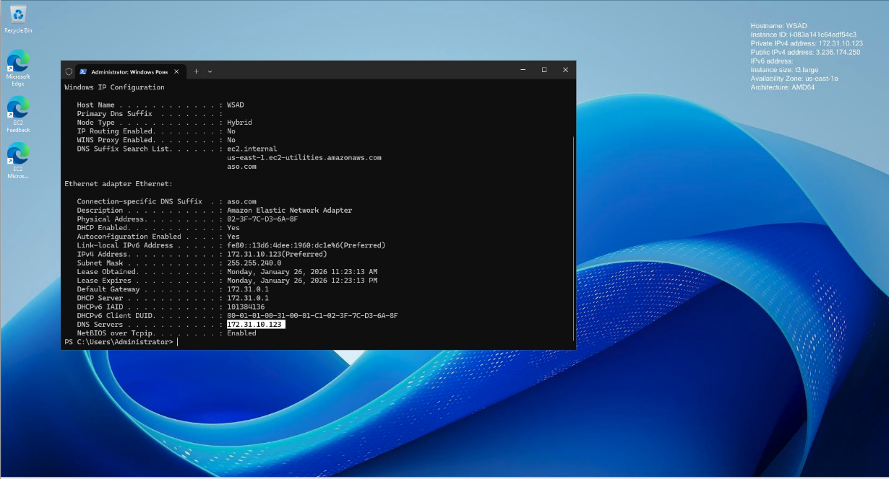
  <figcaption>Comprobación tras el reinicio: la IP privada del servidor aparece como servidor DNS en la configuración de red del cliente Windows.</figcaption>
</figure>


## Paso 3: Configurar el grupo de seguridad para Active Directory

Active Directory requiere varios puertos de red para funcionar correctamente. Debemos configurar el grupo de seguridad para permitir estos servicios.

<figure>
  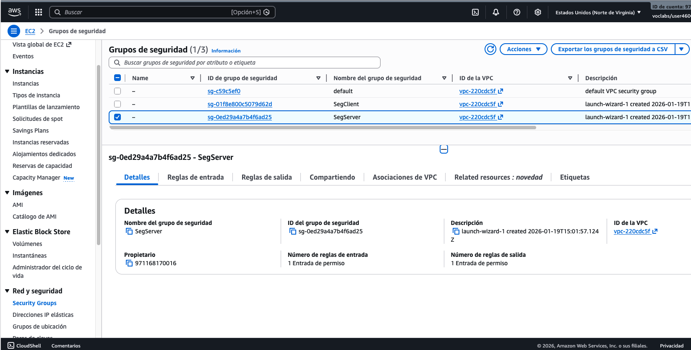
  <figcaption>Vista de la consola de AWS donde se visualizan y editan las reglas del grupo de seguridad asociado al servidor de Active Directory.</figcaption>
</figure>


### Puertos necesarios para Active Directory

Active Directory utiliza los siguientes puertos:

- **DNS (53 TCP/UDP)**: Resolución de nombres de dominio
- **LDAP (389 TCP)**: Consultas LDAP no cifradas
- **LDAP SSL (636 TCP)**: Consultas LDAP cifradas
- **Kerberos (88 TCP/UDP)**: Autenticación Kerberos
- **SMB (445 TCP)**: Compartir archivos y recursos
- **RPC (135 TCP)**: Llamadas a procedimientos remotos
- **RPC dinámico (49152-65535 TCP)**: Puertos dinámicos de RPC
- **ICMP**: Ping (opcional, pero útil para pruebas)

### Configurar el grupo de seguridad

1. En la consola de EC2, **selecciona tu instancia del servidor**.
2. En la pestaña **"Seguridad"**, **haz clic en el nombre del grupo de seguridad**.
3. **Haz clic en "Editar reglas de entrada"** (Edit inbound rules).

4. **Añade las siguientes reglas**:

| Tipo | Protocolo | Puerto | Origen | Descripción |
|------|-----------|--------|--------|-------------|
| DNS | TCP | 53 | 0.0.0.0/0 | DNS TCP |
| DNS | UDP | 53 | 0.0.0.0/0 | DNS UDP |
| LDAP | TCP | 389 | 0.0.0.0/0 | LDAP |
| LDAPS | TCP | 636 | 0.0.0.0/0 | LDAP SSL |
| Kerberos | TCP | 88 | 0.0.0.0/0 | Kerberos TCP |
| Kerberos | UDP | 88 | 0.0.0.0/0 | Kerberos UDP |
| SMB | TCP | 445 | 0.0.0.0/0 | SMB/CIFS |
| RPC | TCP | 135 | 0.0.0.0/0 | RPC Endpoint Mapper |
| TCP personalizado | TCP | 49152-65535 | 0.0.0.0/0 | RPC dinámico |
| ICMP | ICMP | Todos | 0.0.0.0/0 | Ping (opcional) |

<figure>
  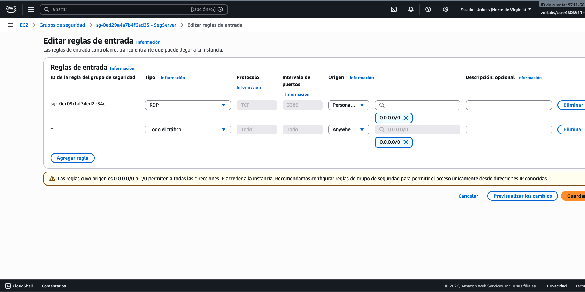
  <figcaption>Configuración del grupo de seguridad para Active Directory</figcaption>
</figure>

!!! warning "Seguridad en producción"
    En un entorno de producción, **NO** deberías permitir estos puertos desde `0.0.0.0/0`. En su lugar:
    
    - Permite solo desde la VPC (ej: `172.31.0.0/16`)
    - O desde IPs específicas
    - Para prácticas educativas, `0.0.0.0/0` es aceptable

5. **Haz clic en "Guardar reglas"**.

## Paso 4: Instalar Active Directory Domain Services

!!! info "Guía paso a paso recomendada"
    Consulta también la guía completa y visual de instalación de Active Directory en este enlace:  
    [Guía de instalación Active Directory paso a paso (fjavier-hernandez.github.io)](https://fjavier-hernandez.github.io/sor/06_AD1/063_AD_Install.html)


A continuación se detallan de manera resumida los pasos para instalar Active Directory, siguiendo la guía mencionada anteriormente.

### 1. Conectar al servidor

1. **Conecta mediante RDP** a tu instancia de Windows Server.
2. **Abre "Administrador del servidor"** (Server Manager) si no se abre automáticamente.

### 2. Instalar el rol AD DS

1. En el **Administrador del servidor**, **haz clic en "Administrar"** → **"Agregar roles y características"** (Add Roles and Features).

2. **Sigue el asistente**:

   - **Página "Antes de comenzar"**: Haz clic en **"Siguiente"**.
   - **Tipo de instalación**: Selecciona **"Instalación basada en características o roles"** → **"Siguiente"**.
   - **Selección del servidor**: Selecciona tu servidor → **"Siguiente"**.
   - **Roles del servidor**: Marca **"Active Directory Domain Services"** → Se abrirá un cuadro de diálogo, haz clic en **"Agregar características"** → **"Siguiente"**.
   - **Características**: No necesitas agregar características adicionales → **"Siguiente"**.
   - **Confirmación**: Revisa la configuración → **"Instalar"**.

3. **Espera** a que se complete la instalación (puede tardar varios minutos).

4. **Haz clic en "Cerrar"** cuando termine la instalación.

### 3. Promover el servidor a controlador de dominio

1. En el **Administrador del servidor**, verás una **notificación** (bandera amarilla) indicando que se requiere configurar AD DS.

2. **Haz clic en la notificación** → **"Promover este servidor a controlador de dominio"** (Promote this server to a domain controller).

3. **Sigue el asistente de configuración**:

   - **Configuración de implementación**:
     - Selecciona **"Agregar un nuevo bosque"** (Add a new forest)
     - **Nombre de dominio raíz**: Introduce el nombre de dominio que configuraste en DHCP (ej: `empresa.local`)

   - **Opciones del controlador de dominio**:

     - **Nivel funcional del bosque**: Windows Server 2016 o superior (según tu versión)
     - **Nivel funcional del dominio**: Windows Server 2016 o superior
     - **Especifica las opciones del controlador de dominio**: Marca **"Servidor DNS"** y **"Servidor de catálogo global (GC)"**

   - **Opciones de DNS**:

     - Si aparece una advertencia sobre delegación DNS, puedes hacer clic en **"Siguiente"** (la delegación se creará automáticamente)

   - **Opciones adicionales**:

     - **Nombre NetBIOS del dominio**: Se generará automáticamente (ej: `EMPRESA`)
     - Puedes cambiarlo si lo deseas

   - **Rutas**:

     - Acepta las rutas predeterminadas para la base de datos de AD, los archivos de registro y SYSVOL

   - **Revisión de opciones**:

     - Revisa la configuración
     - **Haz clic en "Siguiente"**

   - **Comprobación de requisitos previos**:

     - El asistente verificará que todo esté listo
     - Si hay advertencias, puedes hacer clic en **"Instalar"** de todos modos

4. **Haz clic en "Instalar"**.

5. El servidor se **reiniciará automáticamente** cuando termine la configuración (puede tardar 10-15 minutos).

6. **Espera** a que el servidor se reinicie y vuelva al estado "En ejecución" en EC2.

7. **Vuelve a conectar mediante RDP** al servidor (ahora deberás usar el formato `DOMINIO\Administrator` para iniciar sesión).

### 4. Alternativa: Instalar y promover el servidor usando PowerShell

También puedes instalar el rol de Active Directory Domain Services y promover el servidor a controlador de dominio completamente usando PowerShell. Este método es útil para automatización o si prefieres trabajar desde la línea de comandos.

**Pasos completos usando PowerShell:**

1. **Abre PowerShell como Administrador** en el servidor Windows.

2. **Instala el rol de Active Directory Domain Services**:

   ```powershell
   # Instalar el rol AD DS con las herramientas de administración
   Install-WindowsFeature -Name AD-Domain-Services -IncludeManagementTools
   
   # Verificar que se instaló correctamente
   Get-WindowsFeature -Name AD-Domain-Services
   ```

<figure>
  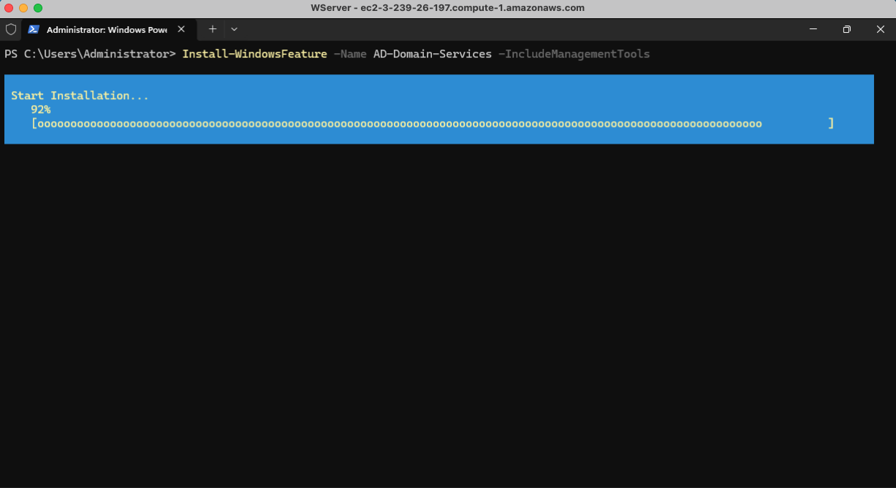
  <figcaption>Instalación del rol "Active Directory Domain Services" usando PowerShell.</figcaption>
</figure>


<figure>
  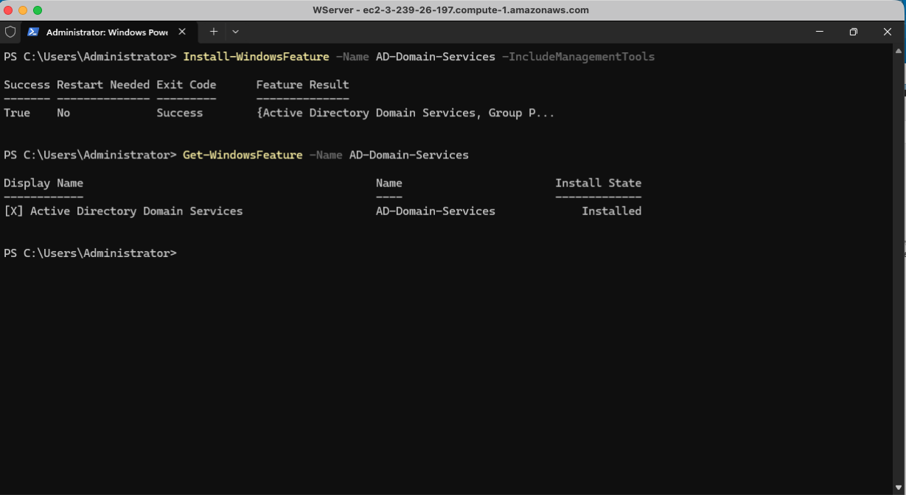
  <figcaption>Resultado de instalación del rol "Servicios de dominio de Active Directory" con PowerShell.</figcaption>
</figure>


!!! note "Verificación de instalación"
       El comando `Get-WindowsFeature` debería mostrar que el rol está instalado. Si ves `[X]` junto al nombre del rol, significa que está instalado correctamente.

1. **Verifica que el módulo ADDSDeployment está disponible**:

   ```powershell
   # Comprobar si el módulo está disponible (debe estar después de instalar AD DS)
   Get-Module -ListAvailable -Name ADDSDeployment
   
   # Comprobar si el módulo está cargado en la sesión actual
   Get-Module -Name ADDSDeployment
   ```

!!! tip "Interpretación de los resultados"
       - Si `Get-Module -ListAvailable` muestra el módulo: El módulo está instalado, pero puede que no esté cargado en la sesión actual.
       - Si `Get-Module -Name ADDSDeployment` muestra el módulo: El módulo ya está cargado en la sesión y no necesitas importarlo.
       - Si no aparece ningún resultado después de instalar AD DS: Cierra y vuelve a abrir PowerShell como Administrador, o reinicia el servidor para volver a intentarlo.

2. **Importa el módulo de Active Directory**:
   
   ```powershell
   # Importar el módulo (solo si no está cargado)
   Import-Module ADDSDeployment
   
   # O usar -Force para recargar el módulo si ya estaba cargado
   Import-Module ADDSDeployment -Force
   ```

!!! note "Nota sobre el módulo"
       Si después de instalar AD DS sigues sin poder importar el módulo, intenta:

       - Cerrar y volver a abrir PowerShell como Administrador
       - O reiniciar el servidor para asegurar que todos los componentes se carguen correctamente

<figure>
  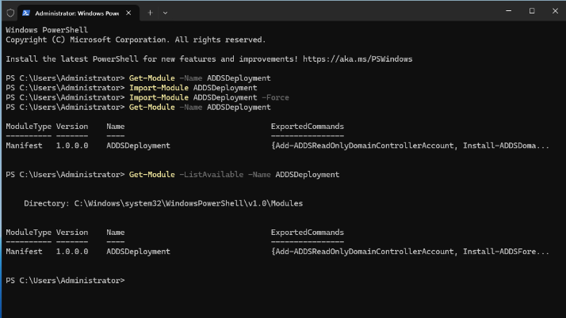
  <figcaption>Verificación de que el módulo ADDSDeployment está disponible e importado en PowerShell.</figcaption>
</figure>


1. **Ejecuta el comando para crear el bosque y promover el servidor**:
   ```powershell
   Install-ADDSForest `
       -DomainName "empresa.local" `
       -DomainNetbiosName "EMPRESA" `
       -ForestMode "WinThreshold" `
       -DomainMode "WinThreshold" `
       -InstallDns:$true `
       -CreateDnsDelegation:$false `
       -DatabasePath "C:\Windows\NTDS" `
       -LogPath "C:\Windows\NTDS" `
       -SysvolPath "C:\Windows\SYSVOL" `
       -SafeModeAdministratorPassword (ConvertTo-SecureString "TuContraseñaSegura123!" -AsPlainText -Force) `
       -Force:$true
   ```

**Parámetros explicados:**

- `-DomainName`: Nombre del dominio DNS (debe coincidir con el configurado en DHCP)
- `-DomainNetbiosName`: Nombre NetBIOS del dominio (máximo 15 caracteres)
- `-ForestMode` y `-DomainMode`: Nivel funcional. Valores válidos según la versión de Windows Server:
  - `Win2008`: Windows Server 2008
  - `Win2008R2`: Windows Server 2008 R2
  - `Win2012`: Windows Server 2012
  - `Win2012R2`: Windows Server 2012 R2
  - `WinThreshold`: Windows Server 2016, 2019 y 2022
  - `Win2025`: Windows Server 2025
  - `Default`: Usa el nivel funcional por defecto según la versión del servidor
- `-InstallDns:$true`: Instala el servidor DNS
- `-CreateDnsDelegation:$false`: No crea delegación DNS (no necesario en AWS Academy)
- `-DatabasePath`, `-LogPath`, `-SysvolPath`: Rutas para los archivos de AD (valores por defecto)
- `-SafeModeAdministratorPassword`: Contraseña para el modo de recuperación de servicios de directorio (DSRM)
- `-Force:$true`: Ejecuta sin confirmación interactiva

!!! tip "Niveles funcionales recomendados"
    - Para **Windows Server 2016, 2019 o 2022**: Usa `WinThreshold`
    - Para **Windows Server 2025**: Usa `Win2025`
    - Si no estás seguro: Usa `Default` y Windows seleccionará automáticamente el nivel apropiado

!!! warning "Importante"
    - El servidor se **reiniciará automáticamente** después de ejecutar el comando.
    - Asegúrate de usar una **contraseña segura** para el modo seguro (DSRM).
    - El proceso puede tardar **10-15 minutos** en completarse.
    - Después del reinicio, deberás iniciar sesión con `DOMINIO\Administrator`.

**Ejemplo completo con valores personalizados:**

```powershell
# Paso 1: Instalar el rol AD DS
Install-WindowsFeature -Name AD-Domain-Services -IncludeManagementTools

# Paso 2: Importar el módulo
Import-Module ADDSDeployment

# Paso 3: Crear el bosque y promover el servidor
$SecurePassword = ConvertTo-SecureString "MiPasswordSeguro123!" -AsPlainText -Force

Install-ADDSForest `
    -DomainName "aso.com" `
    -DomainNetbiosName "aso" `
    -ForestMode "WinThreshold" `
    -DomainMode "WinThreshold" `
    -InstallDns:$true `
    -CreateDnsDelegation:$false `
    -SafeModeAdministratorPassword $SecurePassword `
    -Force:$true
```

<figure>
  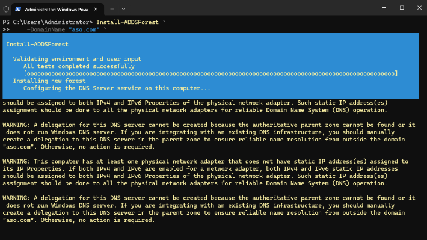
  <figcaption>Promoción del servidor y creación del bosque en Active Directory</figcaption>
</figure>


**Verificar el estado después del reinicio:**

```powershell
# Verificar que el dominio se creó correctamente
Get-ADDomain

# Verificar que el servidor es controlador de dominio
Get-ADDomainController

# Verificar servicios de AD
Get-Service NTDS, DNS, Netlogon
```

<figure>
  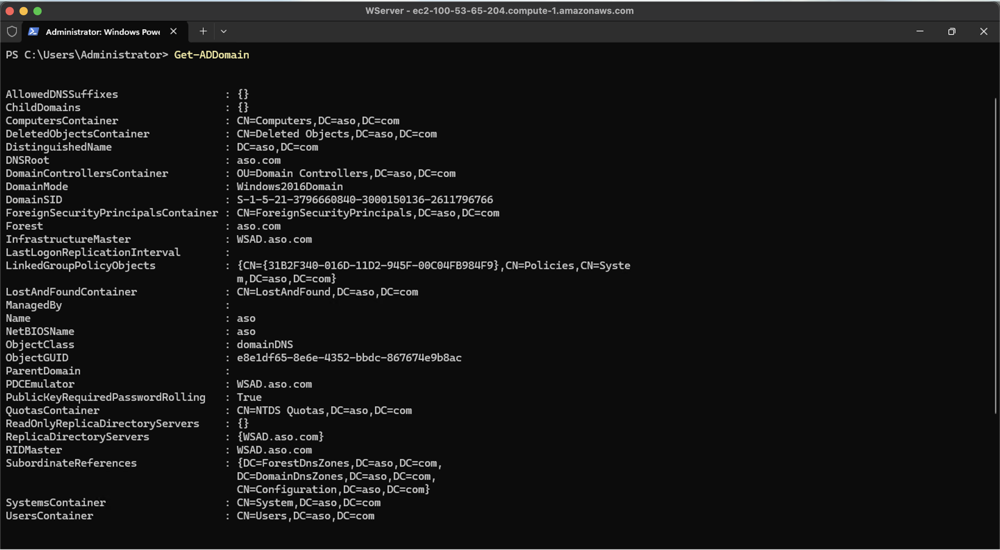
  <figcaption>Verificación del estado de Active Directory tras la configuración y reinicio del servidor.</figcaption>
</figure>

<figure>
  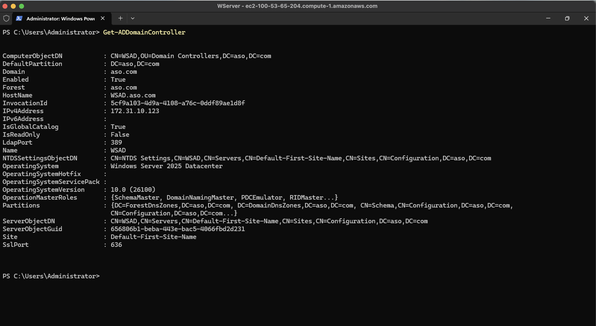
  <figcaption>Verificando que el servidor es un controlador de dominio correctamente configurado</figcaption>
</figure>

<figure>
  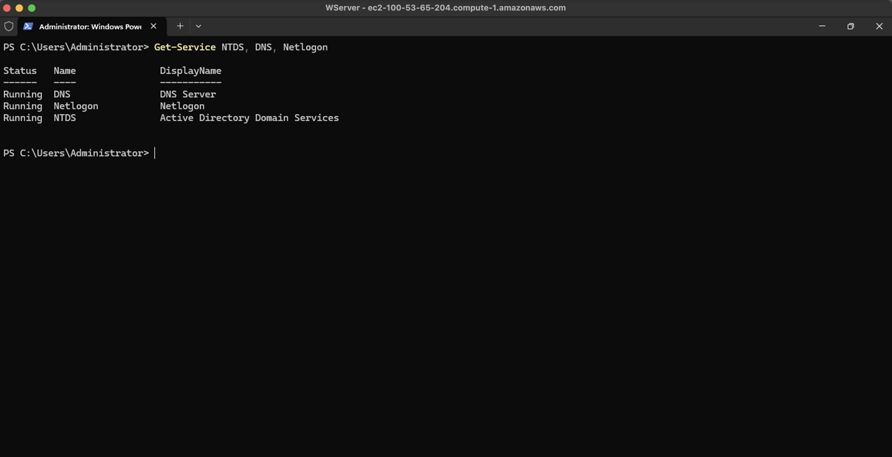
  <figcaption>Verificación de los servicios principales de Active Directory mediante PowerShell.</figcaption>
</figure>

## Paso 5: Preparación del Active Directory 

Tras promover el servidor a controlador de dominio, es recomendable crear un usuario del dominio que pertenezca al grupo **Administradores del dominio** (Domain Admins). Así podrás usar esa cuenta para unir clientes, gestionar el dominio y conectarte por RDP sin depender únicamente de la cuenta `Administrator` integrada.

### 1. Crear un usuario y añadirlo a Domain Admins (interfaz gráfica)

1. **Conecta mediante RDP** al controlador de dominio con la cuenta `Administrator`.
2. **Abre "Usuarios y equipos de Active Directory"**:

   - En el menú **Inicio**, escribe **"Active Directory Users and Computers"** o **"dsa.msc"** y ejecútalo.

3. **Crea el usuario**:

   - En el panel izquierdo, expande tu dominio (ej: `empresa.local`).
   - Haz clic derecho en la carpeta **"Users"** (o en una unidad organizativa si la tienes) → **Nuevo** → **Usuario**.
   - **Nombre**: Nombre del usuario (ej: `admin.dominio`).
   - **Nombre completo**: Nombre para mostrar (ej: `Administrador del dominio`).
   - **Contraseña**: Elige una contraseña segura y marca **"La contraseña no caduca"** si es para prácticas.
   - Haz clic en **Siguiente** y **Finalizar**.

4. **Añadir el usuario al grupo Domain Admins**:

   - En **Usuarios y equipos de Active Directory**, ve al contenedor **"Users"**.
   - Haz doble clic en el grupo **"Domain Admins"**.
   - Pestaña **Miembros** → **Agregar**.
   - Escribe el nombre del usuario que acabas de crear (ej: `admin.dominio`) → **Comprobar nombres** → **Aceptar** → **Aceptar**.

Desde ese momento puedes usar `DOMINIO\admin.dominio` (y su contraseña) para unir clientes al dominio, gestionar AD y conectarte por RDP como administrador del dominio.

### 2. Crear un usuario y añadirlo a Domain Admins (PowerShell)

En el controlador de dominio, abre **PowerShell como Administrador** y ejecuta:

```powershell
# Variables: cambia por tu dominio y el nombre de usuario deseado
$nombreDominio = "empresa.local"   # ej: aso.com, empresa.local
$nombreUsuario = "admin.dominio"
$nombreCompleto = "Administrador del dominio"
$contraseña = "TuContraseñaSegura123!"   # Usa una contraseña segura

# Crear la contraseña segura
$pass = ConvertTo-SecureString $contraseña -AsPlainText -Force

# Crear el usuario en el dominio
New-ADUser -Name $nombreUsuario `
  -DisplayName $nombreCompleto `
  -UserPrincipalName "$nombreUsuario@$nombreDominio" `
  -AccountPassword $pass `
  -Enabled $true `
  -PasswordNeverExpires $true

# Añadir el usuario al grupo Domain Admins
Add-ADGroupMember -Identity "Domain Admins" -Members $nombreUsuario

# Verificar que el usuario está en Domain Admins
Get-ADGroupMember -Identity "Domain Admins"
```

!!! tip "Uso posterior"
    Puedes usar `DOMINIO\admin.dominio` (ej: `EMPRESA\admin.dominio`) para unir clientes al dominio, configurar escritorio remoto y realizar tareas de administración del dominio en lugar de usar siempre `Administrator`.

## Paso 6: Unir un cliente al dominio

### 1. Preparar el cliente

1. **Conecta mediante RDP** a la instancia cliente.
2. **Verifica la conectividad**:

   - Abre el **Símbolo del sistema** (CMD) o **PowerShell**.
   - Ejecuta `ping <IP_SERVIDOR>` para verificar que puede alcanzar el servidor.
   - Ejecuta `nslookup <DOMINIO>` (ej: `nslookup empresa.local`) para verificar la resolución DNS.

### 2. Unir el cliente al dominio


!!! info "Guía paso a paso recomendada"
    Consulta también la guía completa y visual para unir clientes al dominio en este enlace:  
    [Unir clientes al dominio - Guía paso a paso (fjavier-hernandez.github.io)](https://fjavier-hernandez.github.io/sor/06_AD1/063_AD_Install.html#unir-clientes-al-dominio)


1. **Abre "Configuración"** → **"Sistema"** → **"Acerca de"**.
2. **Haz clic en "Cambiar"** junto a "Unirse a un dominio o grupo de trabajo" (o "Cambiar el nombre de este equipo").
3. Selecciona **"Dominio"**.
4. **Introduce el nombre del dominio** (ej: `empresa.local`).
5. **Haz clic en "Aceptar"**.
6. Se solicitarán **credenciales de administrador del dominio**:

   - **Usuario**: `Administrator` (o `DOMINIO\Administrator`)
   - **Contraseña**: La contraseña del administrador del dominio

7. **Haz clic en "Aceptar"**.
8. Verás un mensaje de bienvenida al dominio.
9.  **Reinicia** el equipo cuando se solicite.


### 3. Unir el cliente al dominio mediante PowerShell

También puedes unir el cliente al dominio usando PowerShell. Sigue estos pasos:

1. **Abre PowerShell como Administrador** en la máquina cliente.

2. **Ejecuta el siguiente comando para unir el equipo al dominio**:

   ```powershell
   $dominio = "aso.com"   # Cambia por tu dominio (ej: empresa.local)
   Add-Computer -DomainName $dominio -Credential (Get-Credential "$dominio\Administrator")
   ```

!!! warning "Atención"
       - **Reemplaza** `aso.com` por el nombre real de tu dominio.
       - Se abrirá una ventana solicitando usuario y contraseña. **Introduce la contraseña del administrador del servidor** (la misma que usas para conectarte por RDP al controlador de dominio). El nombre de usuario ya debe aparecer rellenado (por ejemplo: `aso.com\Administrator`).


!!! example "Ejemplo: unir el equipo al dominio con PowerShell"
       ```powershell
       Add-Computer -DomainName "aso.com" -Credential (Get-Credential "ASO\Administrator")
       ```

<figure>
  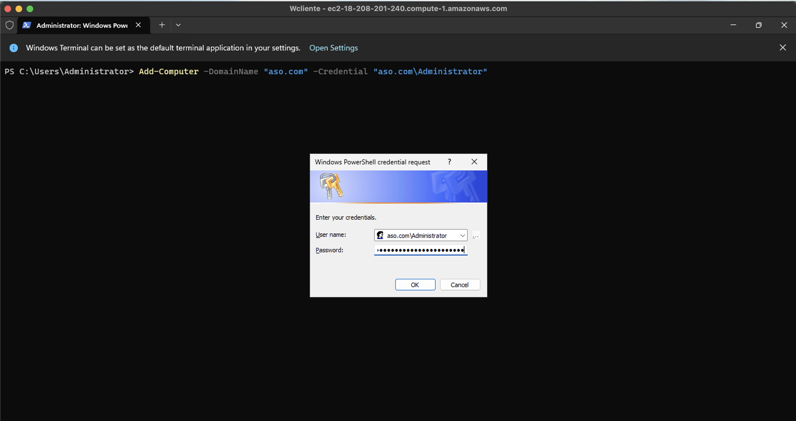
  <figcaption>Proceso gráfico de unión del cliente a un dominio de Active Directory.</figcaption>
</figure>


1. **Reinicia el equipo** para completar la unión al dominio:

   ```powershell
   Restart-Computer
   ```

2. **Confirma que el equipo está unido al dominio** después del reinicio:

   ```powershell
   (Get-WmiObject Win32_ComputerSystem).PartOfDomain
   ```

   - Si el resultado es `True`, el equipo está correctamente unido al dominio.

<figure>
  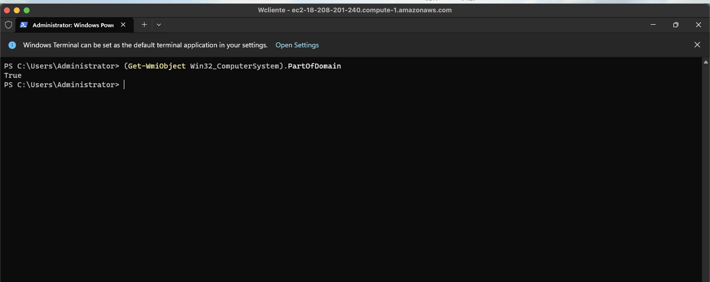
  <figcaption>Verificación de la unión del cliente al dominio de Active Directory</figcaption>
</figure>


<!-- <figure>
  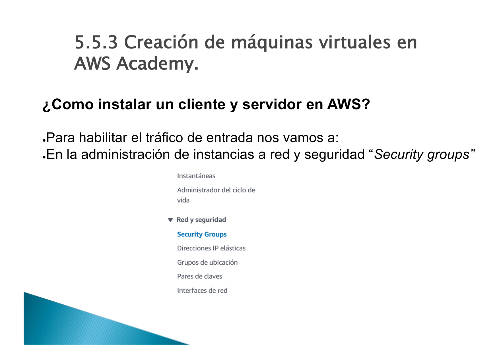
  <figcaption>Cliente unido al dominio de Active Directory</figcaption>
</figure> -->

### 4. Verificar la unión al dominio

1. **Vuelve a conectar mediante RDP** al cliente después del reinicio.
2. **Verifica el dominio**:

   - Abre **"Configuración"** → **"Sistema"** → **"Acerca de"**.
   - Deberías ver **"Dominio"** seguido del nombre de tu dominio.

3. **Prueba el inicio de sesión con credenciales del dominio**:

   - Cierra sesión.
   - En la pantalla de inicio de sesión, haz clic en **"Otra cuenta"**.
   - Introduce: `DOMINIO\Administrator` (ej: `EMPRESA\Administrator`).
   - Introduce la contraseña del administrador del dominio.

## Paso 7: Configurar acceso remoto para usuarios del dominio

Para permitir que usuarios del dominio accedan mediante RDP a los equipos del dominio:

### 1. Configurar escritorio remoto en el servidor o cliente

1. **Conecta mediante RDP** al servidor o cliente usando credenciales del dominio.
2. **Abre "Configuración avanzada del sistema"**:

   - Presiona `Windows + R`
   - Escribe `sysdm.cpl` y presiona Enter
   - O ve a **"Panel de control"** → **"Sistema"** → **"Configuración avanzada del sistema"**

3. Ve a la pestaña **"Remoto"**.
4. En **"Escritorio remoto"**, selecciona **"Permitir conexiones remotas a este equipo"**.
5. **Haz clic en "Seleccionar usuarios"** (Select Users).
6. **Haz clic en "Agregar"** (Add).
7. En el campo de texto, introduce:

   - **"Domain Users"** para permitir a todos los usuarios del dominio
   - O un usuario específico (ej: `DOMINIO\usuario`)

8. **Haz clic en "Comprobar nombres"** para verificar que se reconoce.
9.  **Haz clic en "Aceptar"** en todas las ventanas.

#### Configurar escritorio remoto mediante PowerShell

También puedes configurar el escritorio remoto usando PowerShell. Sigue estos pasos:

1. **Abre PowerShell como Administrador** en el servidor o cliente.

2. **Habilita el escritorio remoto**:
   ```powershell
   # Habilitar escritorio remoto
   Set-ItemProperty -Path 'HKLM:\System\CurrentControlSet\Control\Terminal Server' -name "fDenyTSConnections" -Value 0
   
   # Habilitar el firewall para RDP
   Enable-NetFirewallRule -DisplayGroup "Remote Desktop"
   ```

3. **Añadir usuarios o grupos al escritorio remoto**:

   Para permitir a **todos los usuarios del dominio** (recomendado en prácticas), ejecuta este comando **completo** en una sola vez:
   ```powershell
   Add-LocalGroupMember -Group "Remote Desktop Users" -Member "Domain Users"
   ```

!!! warning "Si aparece 'The argument is null or empty'"
    Ese error significa que se ha ejecutado `Add-LocalGroupMember` usando una variable (`$group` o `$domainUser`) que no está definida. **Ejecuta el comando anterior tal cual**, con el texto `"Domain Users"` entre comillas, o asegúrate de ejecutar todo el bloque de comandos que define la variable antes de usarla.

   **Alternativa: Añadir un usuario específico del dominio** (sustituye `EMPRESA` y `usuario` por tu dominio y nombre de usuario):
   ```powershell
   Add-LocalGroupMember -Group "Remote Desktop Users" -Member "EMPRESA\usuario"
   ```

<figure>
     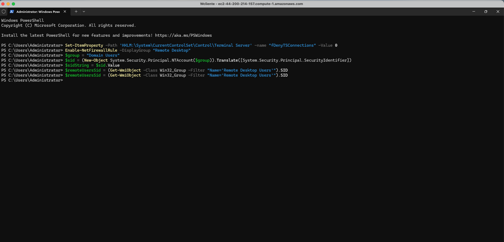
     <figcaption>Ejemplo de cliente RDP en Windows y uso de PowerShell para escritorio remoto</figcaption>
</figure>

1. **Verificar la configuración**:
   ```powershell
   # Verificar que el escritorio remoto está habilitado
   (Get-ItemProperty -Path 'HKLM:\System\CurrentControlSet\Control\Terminal Server').fDenyTSConnections
   # Debe devolver 0 (habilitado) o 1 (deshabilitado)
   
   # Verificar los miembros del grupo Remote Desktop Users
   Get-LocalGroupMember -Group "Remote Desktop Users"
   ```

2. **Verificar las reglas del firewall**:
   ```powershell
   # Verificar que las reglas de firewall están habilitadas
   Get-NetFirewallRule -DisplayGroup "Remote Desktop" | Where-Object {$_.Enabled -eq $true}
   ```

!!! tip "Comando completo en una sola línea"
    Si quieres hacer todo en un solo paso, puedes ejecutar:
    ```powershell
    # Habilitar RDP y añadir Domain Users
    Set-ItemProperty -Path 'HKLM:\System\CurrentControlSet\Control\Terminal Server' -name "fDenyTSConnections" -Value 0
    Enable-NetFirewallRule -DisplayGroup "Remote Desktop"
    Add-LocalGroupMember -Group "Remote Desktop Users" -Member "Domain Users"
    ```

!!! note "Nota sobre Domain Users"
    Si el equipo no está unido al dominio, el grupo "Domain Users" no existirá. En ese caso, usa usuarios locales o espera a unir el equipo al dominio primero.

<!-- <figure>
  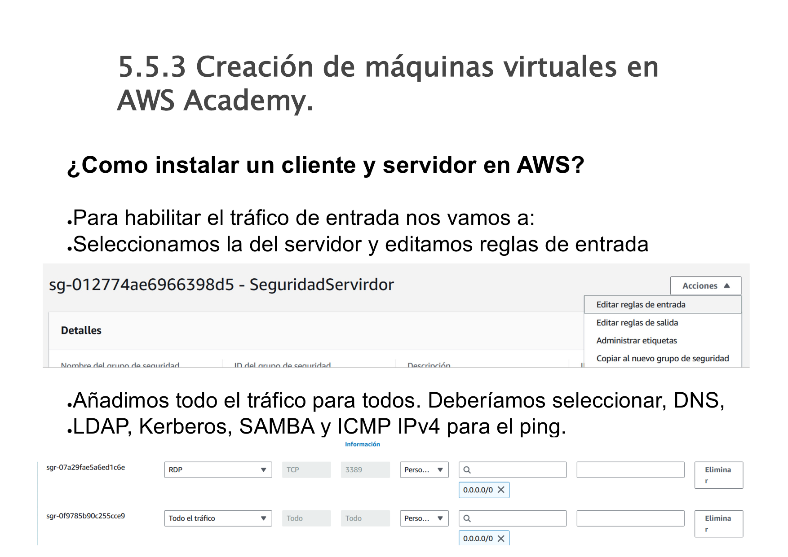
  <figcaption>Configuración de escritorio remoto para usuarios del dominio</figcaption>
</figure> -->

### 2. Conectar usando credenciales del dominio

1. **Desde otro equipo** (o desde tu máquina local), abre el cliente RDP.
2. **Introduce la IP pública** del servidor o cliente.
3. En la pantalla de autenticación, **haz clic en "Más opciones"** o **"Usar otra cuenta"**.
4. **Introduce las credenciales** en formato:

   - **Usuario**: `DOMINIO\Usuario` (ej: `EMPRESA\Administrator`)
   - **Contraseña**: La contraseña del usuario del dominio

<!-- <figure>
  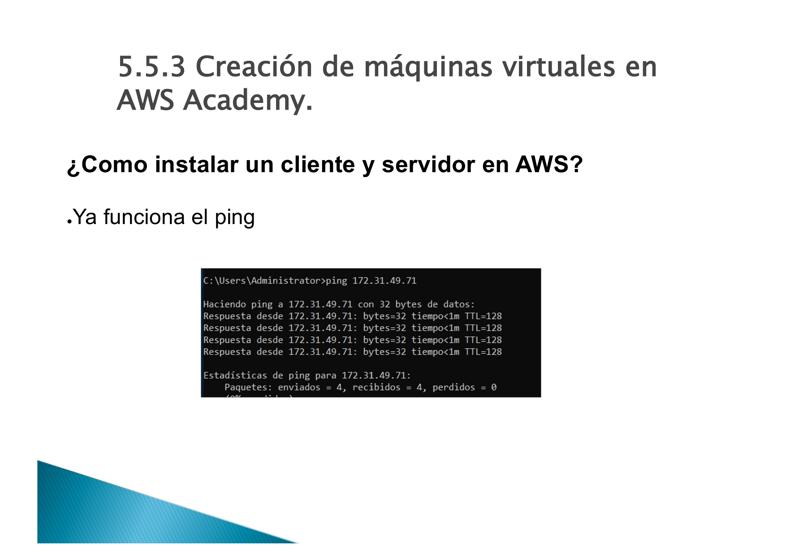
  <figcaption>Conexión RDP usando credenciales del dominio</figcaption>
</figure> -->

1. **Acepta la advertencia** de certificado si aparece.
2. Deberías conectarte exitosamente usando las credenciales del dominio.

## Paso 8: Verificar la configuración

### Verificaciones básicas

1. **Verifica el dominio en el servidor**:

   ```powershell
   # En PowerShell del servidor
   Get-ADDomain
   Get-ADForest
   ```

2. **Verifica la resolución DNS**:

   ```powershell
   # Desde el cliente
   nslookup empresa.local
   Resolve-DnsName empresa.local
   ```

3. **Verifica la conectividad con el controlador de dominio**:

   ```powershell
   # Desde el cliente
   Test-ComputerSecureChannel -Credential (Get-Credential)
   ```

4. **Lista los equipos del dominio**:

   ```powershell
   # Desde el servidor o cliente (con credenciales de dominio)
   Get-ADComputer -Filter *
   ```

---

## Referencias

- [Documentación oficial de Active Directory Domain Services](https://docs.microsoft.com/windows-server/identity/ad-ds/get-started/virtual-dc/active-directory-domain-services-overview)
- [Guía de configuración de DHCP en AWS VPC](https://docs.aws.amazon.com/vpc/latest/userguide/VPC_DHCP_Options.html)
- [Puertos necesarios para Active Directory](https://docs.microsoft.com/windows-server/identity/ad-ds/plan/active-directory-ports)
- [Documentación de AWS EC2](https://docs.aws.amazon.com/ec2/)
- [Guía de configuración de Active Directory](ActiveDirectory_Configuracion.md)
