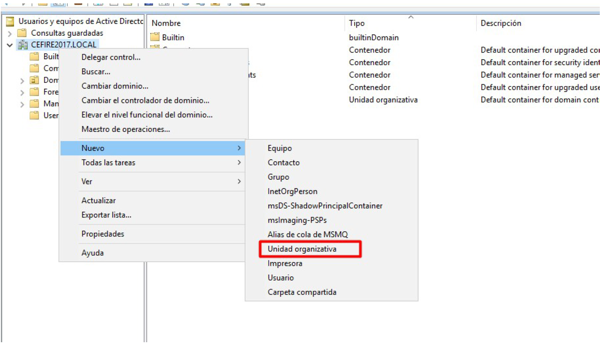
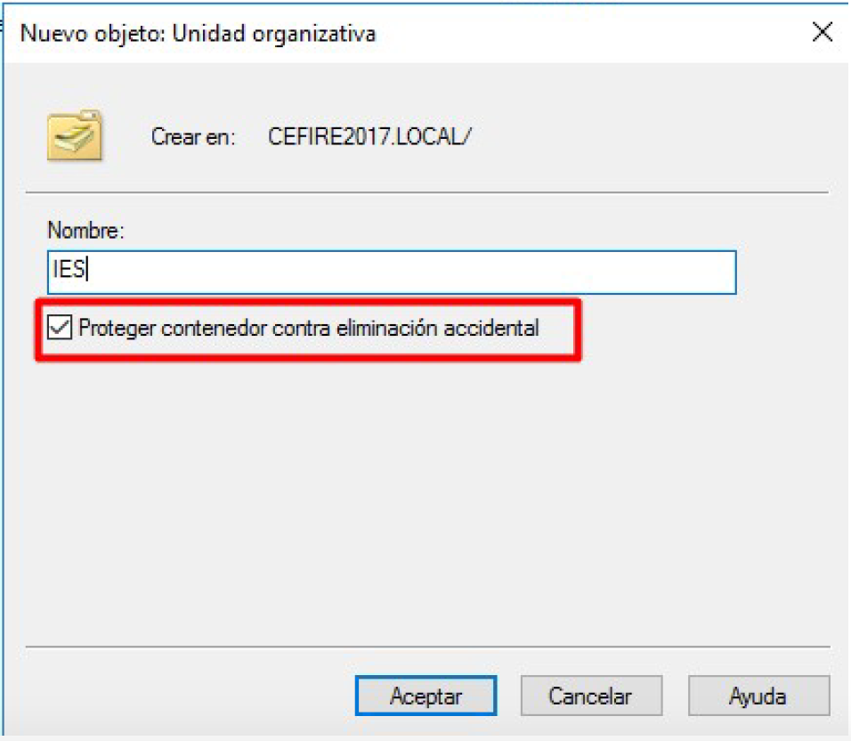
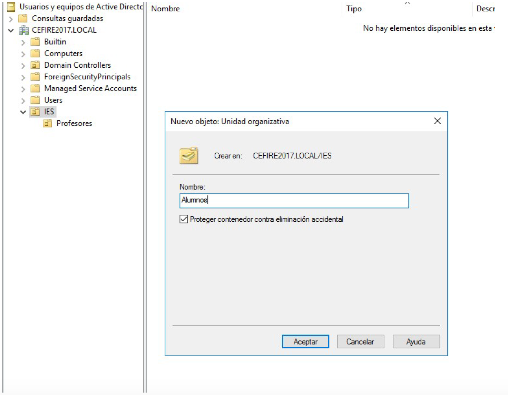

# Práctica: Gestión de Grupos y Unidades Organizativas en Active Directory

## Objetivos

Durante esta práctica aprenderás a gestionar grupos, unidades organizativas y usuarios en **Active Directory Domain Services** para una organización empresarial. Esta práctica complementa la PR402 y te permitirá trabajar con estructuras organizativas más complejas, creación masiva de usuarios y organización jerárquica del directorio.

Al finalizar esta práctica serás capaz de:

- Crear **unidades organizativas** para estructurar el dominio.
- Crear **usuarios del dominio** con diferentes roles y responsabilidades.
- Crear y gestionar **grupos** de seguridad para diferentes departamentos.
- **Organizar usuarios y grupos** en unidades organizativas.
- Crear usuarios **masivamente desde CSV** usando PowerShell.
- **Eliminar usuarios** de prueba de forma segura.
- Documentar la estructura organizativa del dominio.

## Contexto: Area Studio

Siguiendo con la configuración del **Active Directory** para **Area Studio**, una empresa que necesita organizar su estructura de usuarios y grupos por departamentos. Debes crear una estructura que refleje la organización de la empresa con sus responsables de departamento.

## Tareas a realizar

1. **Creación de estructura organizativa**:
   - Crea unidades organizativas para los diferentes departamentos.
   - Organiza usuarios y grupos dentro de las unidades organizativas apropiadas.

2. **Creación de usuarios de departamento**:
   - Crea usuarios para los responsables de departamento de Area Studio.
   - Configura las cuentas con las contraseñas y propiedades apropiadas.

3. **Creación y gestión de grupos**:
   - Crea grupos de seguridad para cada departamento.
   - Añade usuarios a los grupos correspondientes.

4. **Limpieza de usuarios de prueba**:
   - Elimina los usuarios de prueba creados en prácticas anteriores.

5. **Documentación**:
   - Documenta la estructura organizativa creada.
   - Explica la jerarquía de unidades organizativas, grupos y usuarios.

## Entregables

Para la entrega de esta práctica, deberás proporcionar:

1. **Documentación**:
   - Documento en Markdown con:
     - Descripción de la estructura organizativa creada.
     - Diagrama o esquema de las unidades organizativas y su jerarquía.
     - Pasos seguidos para la creación de usuarios, grupos y unidades organizativas.
     - Capturas de pantalla del proceso completo.
     - Explicación de la organización y su justificación.

2. **Evidencias**:
   - Las capturas de pantalla deben mostrar:
     - Creación de unidades organizativas.
     - Creación de usuarios de departamento.
     - Creación de grupos de departamento.
     - Organización de usuarios y grupos en unidades organizativas.
     - Eliminación de usuarios de prueba.
     - Estructura final del directorio.

## Requisitos previos

Antes de comenzar, asegúrate de tener completada la **PR402** o tener:

- **Un dominio de Active Directory** configurado y funcionando.
- **Acceso RDP** al controlador de dominio con credenciales de administrador.
- **Usuarios de prueba** creados en prácticas anteriores (usuario1, usuario2).
- **Conocimiento básico** de usuarios, grupos y unidades organizativas en Active Directory.

!!! note "Nota importante"
    Esta práctica asume que ya tienes un dominio de Active Directory configurado y usuarios de prueba creados. Si no los tienes, completa primero la PR401 y PR402.

## Introducción

### ¿Por qué organizar el directorio?

La organización eficiente del directorio de Active Directory es fundamental para:

- **Reflejar la estructura organizativa** de la empresa.
- **Facilitar la administración** mediante agrupaciones lógicas.
- **Aplicar políticas de grupo** de forma selectiva por departamento.
- **Simplificar la delegación** de permisos administrativos.
- **Mejorar la seguridad** mediante una organización clara.

### Herramientas de administración

Para administrar unidades organizativas, usuarios y grupos utilizaremos:

- **Usuarios y equipos de Active Directory (dsa.msc)**: Herramienta gráfica principal.
- **PowerShell**: Para tareas masivas y automatización (creación desde CSV).

> **Recursos de apoyo**

<figure style="width: 100%; margin: 0; padding: 0;">
  <div style="position: relative; width: 100%; padding-bottom: 56.25%; height: 0; overflow: hidden;">
    <iframe src="https://www.youtube.com/embed/wqE7pB36Ueg" title="Gestión de grupos y unidades organizativas en Active Directory" frameborder="0" allow="accelerometer; autoplay; clipboard-write; encrypted-media; gyroscope; picture-in-picture; web-share" allowfullscreen style="position: absolute; top: 0; left: 0; width: 100%; height: 100%;"></iframe>
  </div>
  <figcaption>Video tutorial: Gestión de grupos y unidades organizativas en Active Directory</figcaption>
</figure>

<figure style="width: 100%; margin: 0; padding: 0;">
  <div style="position: relative; width: 100%; padding-bottom: 56.25%; height: 0; overflow: hidden;">
    <iframe src="https://www.youtube.com/embed/L1smwOwg9xs" title="Creación masiva de usuarios desde CSV" frameborder="0" allow="accelerometer; autoplay; clipboard-write; encrypted-media; gyroscope; picture-in-picture; web-share" allowfullscreen style="position: absolute; top: 0; left: 0; width: 100%; height: 100%;"></iframe>
  </div>
  <figcaption>Video tutorial: Creación masiva de usuarios desde CSV con PowerShell</figcaption>
</figure>

## Paso 1: Crear unidades organizativas

Las unidades organizativas (OU) nos permiten organizar los objetos del dominio de forma jerárquica, reflejando la estructura de la empresa.

### 1. Crear unidades organizativas mediante interfaz gráfica

1. **Conecta mediante RDP** a tu controlador de dominio.
2. **Abre "Usuarios y equipos de Active Directory"** desde el Panel del Administrador → Herramientas.
3. **Expande tu dominio** (ej: `empresa.local`).
4. **Haz clic con el botón derecho** sobre el dominio.
5. Selecciona **"Nuevo"** → **"Unidad Organizativa"**.

<figure>
  
  <figcaption>Crear nueva unidad organizativa</figcaption>
</figure>

6. **Introduce el nombre** de la unidad organizativa (ej: `Departamentos`).
7. **Haz clic en "Aceptar"**.

<figure>
  
  <figcaption>Configuración de nombre de la unidad organizativa</figcaption>
</figure>

8. **Crea las siguientes unidades organizativas** dentro de `Departamentos`:
   - `Gerencia`
   - `IT`
   - `Administracion`
   - `Comercial`
   - `RRHH`

<figure>
  
  <figcaption>Estructura de unidades organizativas creadas</figcaption>
</figure>

### 2. Crear unidades organizativas mediante PowerShell

También puedes crear unidades organizativas usando PowerShell:

```powershell
# Importar el módulo de Active Directory
Import-Module ActiveDirectory

# Crear la unidad organizativa principal
New-ADOrganizationalUnit -Name "Departamentos" -Path "DC=empresa,DC=local"

# Crear unidades organizativas de departamentos
New-ADOrganizationalUnit -Name "Gerencia" -Path "OU=Departamentos,DC=empresa,DC=local"
New-ADOrganizationalUnit -Name "IT" -Path "OU=Departamentos,DC=empresa,DC=local"
New-ADOrganizationalUnit -Name "Administracion" -Path "OU=Departamentos,DC=empresa,DC=local"
New-ADOrganizationalUnit -Name "Comercial" -Path "OU=Departamentos,DC=empresa,DC=local"
New-ADOrganizationalUnit -Name "RRHH" -Path "OU=Departamentos,DC=empresa,DC=local"
```

!!! note "Nota sobre el Path"
    Ajusta el `Path` según el nombre de tu dominio. Si tu dominio es `aso.com`, usa `DC=aso,DC=com`.

## Paso 2: Crear usuarios de departamento

Debes crear usuarios para los responsables de departamento de Area Studio según la siguiente tabla:

| Nombre  | Apellido  | Inicio de sesión | Posición       | Contraseña |
|---------|-----------|------------------|----------------|------------|
| Eduard  | Casavella | eduard.casavella | Gerente        | casavella1 |
| Pep     | Terrón    | pep.terron       | Responsable IT | terron1    |
| Fran    | Delgado   | fran.delgado     | Administración | delgado1   |
| Marcos  | Sabates   | marcos.sabates   | Comercial      | sabates1   |
| Irene   | Masot     | irene.masot      | RR HH          | masot1     |

### 1. Crear usuarios mediante interfaz gráfica

1. **Navega a la unidad organizativa** correspondiente (ej: `Gerencia` para Eduard Casavella).
2. **Haz clic con el botón derecho** sobre la OU → **"Nuevo"** → **"Usuario"**.
3. **Completa el asistente** con los datos del usuario:

   - **Nombre**: `Eduard`
   - **Iniciales**: (opcional)
   - **Apellidos**: `Casavella`
   - **Nombre de inicio de sesión de usuario**: `eduard.casavella`

4. **Configura la contraseña**: `casavella1`
5. **Desmarca** "El usuario debe cambiar la contraseña en el siguiente inicio de sesión".
6. **Marca** "La contraseña nunca expira" (solo para prácticas).
7. **Repite el proceso** para cada usuario en su unidad organizativa correspondiente.

### 2. Crear usuarios mediante PowerShell (método individual)

También puedes crear usuarios usando PowerShell:

```powershell
# Importar el módulo de Active Directory
Import-Module ActiveDirectory

# Crear usuario Eduard Casavella (Gerencia)
$password1 = ConvertTo-SecureString "casavella1" -AsPlainText -Force
New-ADUser -Name "Eduard Casavella" `
    -GivenName "Eduard" `
    -Surname "Casavella" `
    -SamAccountName "eduard.casavella" `
    -UserPrincipalName "eduard.casavella@empresa.local" `
    -Path "OU=Gerencia,OU=Departamentos,DC=empresa,DC=local" `
    -AccountPassword $password1 `
    -PasswordNeverExpires $true `
    -Enabled $true

# Crear usuario Pep Terrón (IT)
$password2 = ConvertTo-SecureString "terron1" -AsPlainText -Force
New-ADUser -Name "Pep Terrón" `
    -GivenName "Pep" `
    -Surname "Terrón" `
    -SamAccountName "pep.terron" `
    -UserPrincipalName "pep.terron@empresa.local" `
    -Path "OU=IT,OU=Departamentos,DC=empresa,DC=local" `
    -AccountPassword $password2 `
    -PasswordNeverExpires $true `
    -Enabled $true

# Crear usuario Fran Delgado (Administración)
$password3 = ConvertTo-SecureString "delgado1" -AsPlainText -Force
New-ADUser -Name "Fran Delgado" `
    -GivenName "Fran" `
    -Surname "Delgado" `
    -SamAccountName "fran.delgado" `
    -UserPrincipalName "fran.delgado@empresa.local" `
    -Path "OU=Administracion,OU=Departamentos,DC=empresa,DC=local" `
    -AccountPassword $password3 `
    -PasswordNeverExpires $true `
    -Enabled $true

# Crear usuario Marcos Sabates (Comercial)
$password4 = ConvertTo-SecureString "sabates1" -AsPlainText -Force
New-ADUser -Name "Marcos Sabates" `
    -GivenName "Marcos" `
    -Surname "Sabates" `
    -SamAccountName "marcos.sabates" `
    -UserPrincipalName "marcos.sabates@empresa.local" `
    -Path "OU=Comercial,OU=Departamentos,DC=empresa,DC=local" `
    -AccountPassword $password4 `
    -PasswordNeverExpires $true `
    -Enabled $true

# Crear usuario Irene Masot (RRHH)
$password5 = ConvertTo-SecureString "masot1" -AsPlainText -Force
New-ADUser -Name "Irene Masot" `
    -GivenName "Irene" `
    -Surname "Masot" `
    -SamAccountName "irene.masot" `
    -UserPrincipalName "irene.masot@empresa.local" `
    -Path "OU=RRHH,OU=Departamentos,DC=empresa,DC=local" `
    -AccountPassword $password5 `
    -PasswordNeverExpires $true `
    -Enabled $true
```

### 3. Crear usuarios masivamente desde CSV

Para crear múltiples usuarios de forma eficiente, puedes usar un archivo CSV y PowerShell:

#### Paso 1: Crear el archivo CSV

Crea un archivo llamado `usuarios.csv` con el siguiente contenido:

```csv
Nombre,Apellido,InicioSesion,Posicion,Contraseña,OU
Eduard,Casavella,eduard.casavella,Gerente,casavella1,Gerencia
Pep,Terrón,pep.terron,Responsable IT,terron1,IT
Fran,Delgado,fran.delgado,Administración,delgado1,Administracion
Marcos,Sabates,marcos.sabates,Comercial,sabates1,Comercial
Irene,Masot,irene.masot,RR HH,masot1,RRHH
```

Guarda el archivo en una ubicación accesible (ej: `C:\Scripts\usuarios.csv`).

#### Paso 2: Script de PowerShell para importar desde CSV

Crea y ejecuta el siguiente script de PowerShell:

```powershell
# Importar el módulo de Active Directory
Import-Module ActiveDirectory

# Definir el dominio (ajusta según tu dominio)
$domain = "empresa.local"
$domainDN = "DC=empresa,DC=local"
$baseOU = "OU=Departamentos,$domainDN"

# Leer el archivo CSV
$usuarios = Import-Csv -Path "C:\Scripts\usuarios.csv" -Encoding UTF8

# Crear cada usuario
foreach ($usuario in $usuarios) {
    # Convertir la contraseña a SecureString
    $password = ConvertTo-SecureString $usuario.Contraseña -AsPlainText -Force
    
    # Construir el path de la OU
    $ouPath = "OU=$($usuario.OU),$baseOU"
    
    # Crear el usuario
    try {
        New-ADUser -Name "$($usuario.Nombre) $($usuario.Apellido)" `
            -GivenName $usuario.Nombre `
            -Surname $usuario.Apellido `
            -SamAccountName $usuario.InicioSesion `
            -UserPrincipalName "$($usuario.InicioSesion)@$domain" `
            -Path $ouPath `
            -AccountPassword $password `
            -PasswordNeverExpires $true `
            -Enabled $true `
            -Description $usuario.Posicion
        
        Write-Host "Usuario $($usuario.InicioSesion) creado correctamente en $ouPath" -ForegroundColor Green
    }
    catch {
        Write-Host "Error al crear usuario $($usuario.InicioSesion): $_" -ForegroundColor Red
    }
}

Write-Host "Proceso de creación de usuarios completado." -ForegroundColor Cyan
```

!!! tip "Personalización del script"
    - Ajusta la ruta del CSV según donde guardes el archivo.
    - Modifica `$domain` y `$domainDN` según tu dominio.
    - Si necesitas añadir más campos (email, teléfono, etc.), añádelos al CSV y al comando `New-ADUser`.

#### Paso 3: Verificar usuarios creados

Verifica que todos los usuarios se crearon correctamente:

```powershell
# Listar todos los usuarios creados
$usuarios = Import-Csv -Path "C:\Scripts\usuarios.csv"
foreach ($usuario in $usuarios) {
    $adUser = Get-ADUser -Identity $usuario.InicioSesion -Properties *
    Write-Host "$($adUser.Name) - $($adUser.DistinguishedName)" -ForegroundColor Yellow
}
```

## Paso 3: Crear grupos de departamento

Crea grupos de seguridad para cada departamento y añade los usuarios correspondientes.

### 1. Crear grupos mediante interfaz gráfica

1. **Navega a la unidad organizativa** del departamento (ej: `IT`).
2. **Haz clic con el botón derecho** sobre la OU → **"Nuevo"** → **"Grupo"**.
3. **Configura el grupo**:

   - **Nombre del grupo**: `IT_Usuarios` (o similar)
   - **Ámbito del grupo**: **Global**
   - **Tipo de grupo**: **Seguridad**

4. **Haz clic en "Aceptar"**.
5. **Repite el proceso** para cada departamento.

### 2. Añadir usuarios a grupos

1. **Selecciona el grupo** creado.
2. **Haz clic con el botón derecho** → **"Propiedades"**.
3. Ve a la pestaña **"Miembros"**.
4. **Haz clic en "Agregar"**.
5. **Busca y añade** el usuario correspondiente al departamento.

### 3. Crear grupos mediante PowerShell

También puedes crear grupos y añadir usuarios usando PowerShell:

```powershell
# Importar el módulo de Active Directory
Import-Module ActiveDirectory

# Crear grupos para cada departamento
New-ADGroup -Name "Gerencia_Usuarios" `
    -GroupScope Global `
    -GroupCategory Security `
    -Path "OU=Gerencia,OU=Departamentos,DC=empresa,DC=local"

New-ADGroup -Name "IT_Usuarios" `
    -GroupScope Global `
    -GroupCategory Security `
    -Path "OU=IT,OU=Departamentos,DC=empresa,DC=local"

New-ADGroup -Name "Administracion_Usuarios" `
    -GroupScope Global `
    -GroupCategory Security `
    -Path "OU=Administracion,OU=Departamentos,DC=empresa,DC=local"

New-ADGroup -Name "Comercial_Usuarios" `
    -GroupScope Global `
    -GroupCategory Security `
    -Path "OU=Comercial,OU=Departamentos,DC=empresa,DC=local"

New-ADGroup -Name "RRHH_Usuarios" `
    -GroupScope Global `
    -GroupCategory Security `
    -Path "OU=RRHH,OU=Departamentos,DC=empresa,DC=local"

# Añadir usuarios a sus grupos correspondientes
Add-ADGroupMember -Identity "Gerencia_Usuarios" -Members "eduard.casavella"
Add-ADGroupMember -Identity "IT_Usuarios" -Members "pep.terron"
Add-ADGroupMember -Identity "Administracion_Usuarios" -Members "fran.delgado"
Add-ADGroupMember -Identity "Comercial_Usuarios" -Members "marcos.sabates"
Add-ADGroupMember -Identity "RRHH_Usuarios" -Members "irene.masot"
```

## Paso 4: Eliminar usuarios de prueba

Elimina los usuarios de prueba (`usuario1` y `usuario2`) creados en prácticas anteriores.

!!! warning "Importante sobre la eliminación"
    Recuerda que al eliminar un usuario, se pierde su SID y no se pueden recuperar los permisos. Asegúrate de que estos usuarios no son necesarios antes de eliminarlos.

### 1. Eliminar usuarios mediante interfaz gráfica

1. **Abre "Usuarios y equipos de Active Directory"**.
2. **Navega a "Users"** o a la OU donde están los usuarios de prueba.
3. **Selecciona el usuario** `usuario1`.
4. **Haz clic con el botón derecho** → **"Eliminar"**.
5. **Confirma la eliminación**.
6. **Repite el proceso** para `usuario2`.

### 2. Eliminar usuarios mediante PowerShell

También puedes eliminar usuarios usando PowerShell:

```powershell
# Importar el módulo de Active Directory
Import-Module ActiveDirectory

# Eliminar usuarios de prueba
Remove-ADUser -Identity "usuario1" -Confirm:$false
Remove-ADUser -Identity "usuario2" -Confirm:$false

# Verificar que se eliminaron
Get-ADUser -Filter {SamAccountName -eq "usuario1"}  # No debe devolver nada
Get-ADUser -Filter {SamAccountName -eq "usuario2"}  # No debe devolver nada
```

!!! note "Alternativa: Deshabilitar en lugar de eliminar"
    Si prefieres mantener los usuarios pero deshabilitarlos, puedes usar:
    ```powershell
    Disable-ADAccount -Identity "usuario1"
    Disable-ADAccount -Identity "usuario2"
    ```

## Paso 5: Verificar la estructura organizativa

Verifica que toda la estructura está correctamente organizada.

### 1. Verificar mediante interfaz gráfica

1. **Abre "Usuarios y equipos de Active Directory"**.
2. **Expande el dominio** y las unidades organizativas.
3. **Verifica** que:

   - Las unidades organizativas están creadas correctamente.
   - Los usuarios están en sus unidades organizativas correspondientes.
   - Los grupos están creados y tienen los miembros correctos.
   - Los usuarios de prueba han sido eliminados.

### 2. Verificar mediante PowerShell

Ejecuta los siguientes comandos para verificar la estructura:

```powershell
# Importar el módulo de Active Directory
Import-Module ActiveDirectory

# Listar todas las unidades organizativas
Get-ADOrganizationalUnit -Filter * | Select-Object Name, DistinguishedName | Format-Table

# Listar usuarios por OU
Get-ADUser -Filter * -SearchBase "OU=Gerencia,OU=Departamentos,DC=empresa,DC=local" | Select-Object Name, SamAccountName
Get-ADUser -Filter * -SearchBase "OU=IT,OU=Departamentos,DC=empresa,DC=local" | Select-Object Name, SamAccountName
Get-ADUser -Filter * -SearchBase "OU=Administracion,OU=Departamentos,DC=empresa,DC=local" | Select-Object Name, SamAccountName
Get-ADUser -Filter * -SearchBase "OU=Comercial,OU=Departamentos,DC=empresa,DC=local" | Select-Object Name, SamAccountName
Get-ADUser -Filter * -SearchBase "OU=RRHH,OU=Departamentos,DC=empresa,DC=local" | Select-Object Name, SamAccountName

# Listar grupos y sus miembros
Get-ADGroup -Filter * -SearchBase "OU=Departamentos,DC=empresa,DC=local" | ForEach-Object {
    Write-Host "Grupo: $($_.Name)" -ForegroundColor Cyan
    Get-ADGroupMember -Identity $_.Name | Select-Object Name, SamAccountName | Format-Table
    Write-Host ""
}

# Verificar que los usuarios de prueba fueron eliminados
$usuariosPrueba = Get-ADUser -Filter {SamAccountName -like "usuario*"} -ErrorAction SilentlyContinue
if ($usuariosPrueba) {
    Write-Host "ADVERTENCIA: Aún existen usuarios de prueba" -ForegroundColor Yellow
    $usuariosPrueba | Select-Object Name, SamAccountName
} else {
    Write-Host "OK: Los usuarios de prueba han sido eliminados" -ForegroundColor Green
}
```

## Tareas a realizar

1. **Creación de estructura organizativa**:

   - Crea la unidad organizativa principal `Departamentos`.
   - Crea unidades organizativas para cada departamento (Gerencia, IT, Administración, Comercial, RRHH).

2. **Creación de usuarios de departamento**:

   - Crea los 5 usuarios según la tabla proporcionada.
   - Coloca cada usuario en su unidad organizativa correspondiente.
   - Configura las contraseñas según la tabla.

3. **Creación y gestión de grupos**:

   - Crea un grupo de seguridad para cada departamento.
   - Añade el usuario correspondiente a cada grupo.

4. **Limpieza de usuarios de prueba**:

   - Elimina los usuarios `usuario1` y `usuario2` creados en prácticas anteriores.

5. **Documentación**:

   - Crea un documento que explique:
     - La estructura organizativa creada.
     - La justificación de la organización por departamentos.
     - Los pasos realizados para la creación de usuarios, grupos y unidades organizativas.
     - Capturas de pantalla de la estructura final.
     - Si usaste PowerShell desde CSV, explica el proceso.

## Referencias

- [Documentación oficial de Active Directory Users and Computers](https://docs.microsoft.com/windows-server/identity/ad-ds/manage/understand-active-directory-users-and-computers)
- [Guía de administración de unidades organizativas](https://docs.microsoft.com/windows-server/identity/ad-ds/manage/understand-active-directory-organizational-units)
- [Crear usuarios masivamente con PowerShell](https://docs.microsoft.com/powershell/module/activedirectory/new-aduser)
- [Gestión de grupos en Active Directory](https://docs.microsoft.com/windows-server/identity/ad-ds/manage/understand-active-directory-groups)
