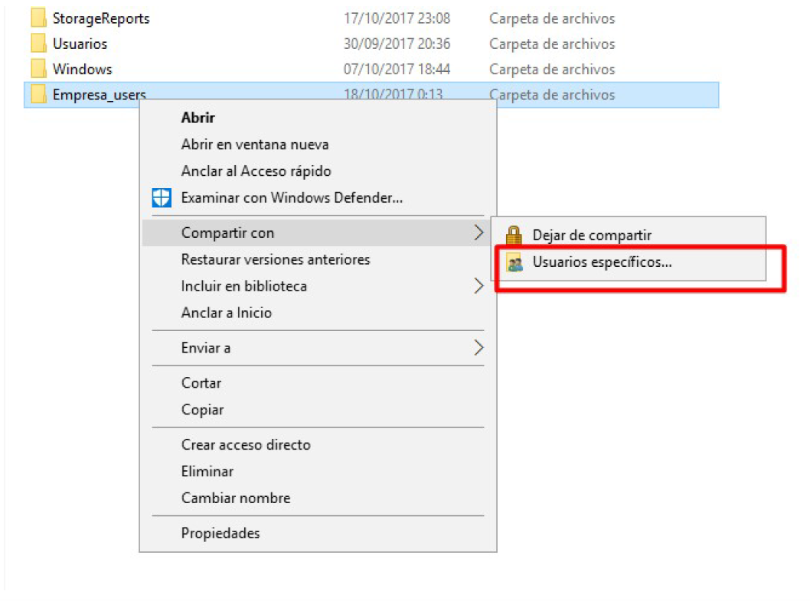
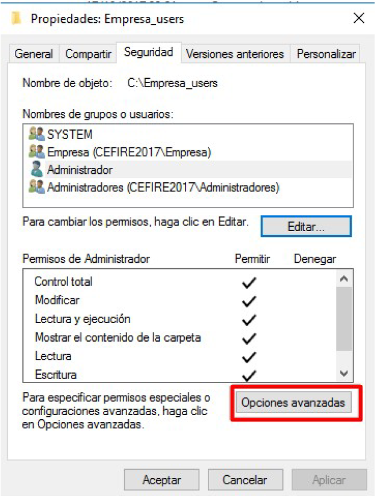
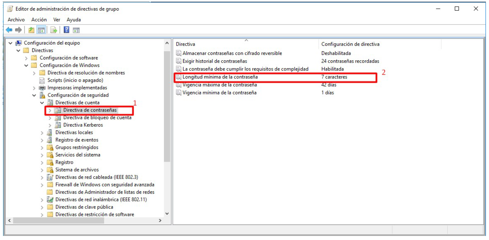
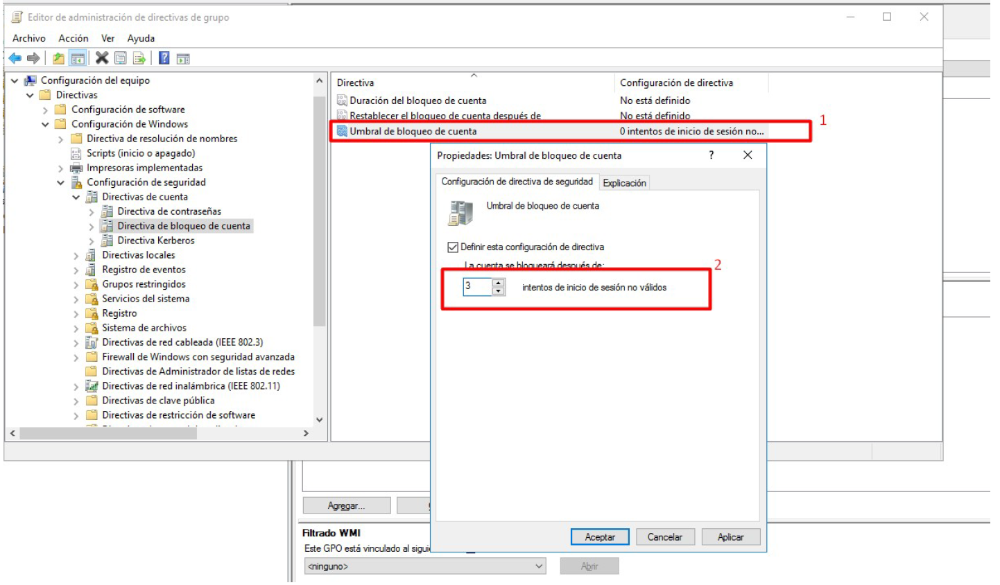

# Práctica: Gestión de recursos compartidos en Active Directory

## Objetivos

Durante esta práctica aprenderás a gestionar **recursos compartidos** en un dominio de Active Directory: crear estructuras de carpetas, configurar permisos NTFS y compartidos, asignar carpetas personales a usuarios y aplicar **directivas de grupo (GPO)** para políticas de contraseñas y bloqueo de cuenta.

Al finalizar esta práctica serás capaz de:

- Crear la **estructura de carpetas** para una organización en el servidor.
- Configurar **permisos de recursos compartidos** y **permisos NTFS** con diferentes niveles de acceso.
- Asignar **carpetas personales** a usuarios del dominio.
- Configurar **unidades de red** (carpeta personal y carpeta de empresa) que se conecten al iniciar sesión.
- Aplicar **GPO** para directivas de contraseñas (vigencia, historial, longitud).
- Configurar **bloqueo de cuenta** tras intentos fallidos de contraseña.
- Documentar el proceso completo.

## Requisitos previos

- Dominio de Active Directory configurado (PR401).
- Usuarios y grupos creados (PR402, PR403).
- Al menos un equipo cliente unido al dominio.

## Tareas a realizar

1. **Crear estructura de carpetas** en disco (ej: `C:\Empresa_Users`, `C:\Empresa_Datos` con subcarpetas por departamento).
2. **Compartir carpetas** y asignar permisos de recursos compartidos (solo miembros del grupo correspondiente).
3. **Configurar permisos NTFS** con diferentes niveles según el rol (Administradores, trabajadores nivel 1, etc.).
4. **Realizar comprobaciones de acceso** para verificar que los usuarios acceden correctamente según su grupo.
5. **Crear estructura para carpetas particulares** (ej: `C:\Empresa_Users` con subcarpetas por usuario).
6. **Configurar carpeta personal y carpeta de empresa** para que al iniciar sesión se conecten automáticamente en la unidad X: (personal) y Y: (empresa).
7. **Configurar GPO de contraseñas**: vigencia 90 días, historial 5 contraseñas, longitud mínima 4 caracteres, sin complejidad obligatoria.
8. **Configurar GPO de bloqueo**: 4 intentos fallidos bloquean la cuenta; contador se restablece tras 10 minutos.
9. **Documentar** el proceso con capturas de pantalla.

## Entregables

1. **Documentación** en Markdown con:

   - Descripción de permisos compartidos vs NTFS.
   - Pasos seguidos para crear la estructura y configurar permisos.
   - Configuración de carpetas personales y GPO.
   - Capturas de pantalla del proceso completo.
   - Comprobaciones de acceso realizadas.

2. **Evidencias**: capturas de las directivas de contraseña y bloqueo de cuenta configuradas.

## Documentación

Incluye en tu informe:

- Capturas de la estructura de carpetas creada.
- Capturas de los permisos compartidos y NTFS configurados.
- Capturas de la configuración del perfil del usuario (carpeta particular).
- Capturas de las directivas de contraseña y bloqueo de cuenta en la GPO.
- Capturas de las unidades de red conectadas al iniciar sesión.
- Descripción de las comprobaciones de acceso realizadas.

---

## Paso 1: Crear la estructura de carpetas en disco

Crea la estructura de carpetas en el controlador de dominio (o servidor de archivos). Por ejemplo: carpeta para usuarios (`Empresa_Users`), carpeta de datos compartidos (`Empresa_Datos`) con subcarpetas por departamento.

### GUI

1. **Conecta mediante RDP** al controlador de dominio.
2. Abre **Explorador de archivos** y navega a `C:\`.
3. **Crea las carpetas**:

   - `C:\Empresa_Users` (carpetas personales)
   - `C:\Empresa_Datos` (datos compartidos)
   - Dentro de `Empresa_Datos`: subcarpetas por departamento (ej: `Ventas`, `Contabilidad`, `RRHH`).

4. Dentro de `Empresa_Users`, crea una subcarpeta por cada usuario (ej: `eduard.casavella`, `pep.terron`) o deja que se creen automáticamente al configurar el perfil.

### PWSH

```powershell
# Crear estructura base
New-Item -Path "C:\Empresa_Users" -ItemType Directory -Force
New-Item -Path "C:\Empresa_Datos" -ItemType Directory -Force

# Subcarpetas por departamento
@("Ventas", "Contabilidad", "RRHH") | ForEach-Object {
    New-Item -Path "C:\Empresa_Datos\$_" -ItemType Directory -Force
}

# Verificar
Get-ChildItem -Path "C:\Empresa_Users", "C:\Empresa_Datos" -Recurse
```

---

## Paso 2: Compartir carpetas y asignar permisos de recursos compartidos

Comparte las carpetas para que sean accesibles por red. Asigna permisos de recurso compartido: solo los miembros del grupo correspondiente deben poder acceder a cada carpeta.

### GUI

1. **Clic derecho** sobre `C:\Empresa_Users` → **Compartir con** → **Usuarios específicos**.
2. **Agrega** el grupo de usuarios del dominio (ej: `Domain Users` o un grupo creado como `Empresa`) con **Lectura/Escritura**.
3. **Haz clic en Compartir** y anota la ruta de red (ej: `\\DC01\Empresa_Users`).
4. Repite para `C:\Empresa_Datos` y sus subcarpetas según los grupos que deban acceder.
5. Para más control, usa **Propiedades** → pestaña **Compartir** → **Uso compartido avanzado** → **Permisos** para asignar permisos por grupo.

<figure>
  
  <figcaption>Compartir carpeta con usuarios específicos</figcaption>
</figure>

### PWSH

```powershell
# Compartir Empresa_Users con Domain Users (lectura/escritura)
New-SmbShare -Name "Empresa_Users" -Path "C:\Empresa_Users" -ChangeAccess "Domain Users"

# Compartir Empresa_Datos (lectura para todos los usuarios del dominio)
New-SmbShare -Name "Empresa_Datos" -Path "C:\Empresa_Datos" -ReadAccess "Domain Users"

# Verificar recursos compartidos
Get-SmbShare | Where-Object { $_.Name -like "Empresa*" }
```

!!! tip "Permisos de recurso compartido"
    - `-FullAccess`: Control total  
    - `-ChangeAccess`: Lectura y escritura  
    - `-ReadAccess`: Solo lectura  

---

## Paso 3: Configurar permisos NTFS

Los permisos NTFS complementan los permisos compartidos y permiten un control más granular. Configura diferentes niveles según el rol: Administradores (control total), trabajadores (lectura/escritura en su departamento), etc.

### GUI

1. **Clic derecho** sobre `C:\Empresa_Users` → **Propiedades** → pestaña **Seguridad**.
2. **Opciones avanzadas** → **Deshabilitar herencia** → **Convertir los permisos heredados en explícitos** (para no heredar de C:\).
3. **Agregar** el grupo correspondiente (ej: `Domain Users`) con **Modificar** o **Control total** según necesites.
4. Elimina el grupo **Usuarios** si no quieres acceso genérico.
5. Para cada subcarpeta de `Empresa_Datos`, asigna permisos solo al grupo del departamento correspondiente.

<figure>
  
  <figcaption>Configuración de permisos NTFS en Opciones avanzadas</figcaption>
</figure>

### PWSH

```powershell
# Deshabilitar herencia y asignar permisos NTFS a Empresa_Users
$path = "C:\Empresa_Users"
$acl = Get-Acl $path
$acl.SetAccessRuleProtection($true, $false)  # Deshabilitar herencia, no eliminar heredados
$rule = New-Object System.Security.AccessControl.FileSystemAccessRule("Domain Users", "Modify", "ContainerInherit,ObjectInherit", "None", "Allow")
$acl.AddAccessRule($rule)
Set-Acl $path $acl

# Permisos para Administradores (control total)
$adminRule = New-Object System.Security.AccessControl.FileSystemAccessRule("Domain Admins", "FullControl", "ContainerInherit,ObjectInherit", "None", "Allow")
$acl.AddAccessRule($adminRule)
Set-Acl $path $acl
```

!!! warning "Permisos efectivos"
    Cuando se accede por red, se aplican **ambos** permisos (compartido y NTFS). El permiso efectivo es el **más restrictivo**.

---

## Paso 4: Crear carpetas personales para cada usuario

Cada usuario debe tener una subcarpeta dentro de `Empresa_Users` con permisos exclusivos para él. La variable `%username%` se sustituye automáticamente por el nombre del usuario.

### GUI

1. En `C:\Empresa_Users`, crea una subcarpeta por usuario (ej: `eduard.casavella`, `pep.terron`) o deja que se cree al asignar el perfil.
2. **Clic derecho** en cada subcarpeta → **Propiedades** → **Seguridad**.
3. Asigna **Control total** al usuario correspondiente y a **Administradores del dominio**.
4. Si usas una única carpeta compartida con `%username%`, asegúrate de que el recurso compartido permita a cada usuario crear/acceder a su subcarpeta (permisos en la carpeta raíz con herencia).

### PWSH

```powershell
# Crear carpeta personal para cada usuario y asignar permisos
# Usuarios de la PR403 (Area Studio): responsables de departamento
$dominio = (Get-ADDomain).NetBIOSName
$usuarios = @("eduard.casavella", "pep.terron", "fran.delgado", "marcos.sabates", "irene.masot")

foreach ($user in $usuarios) {
    # Verificar que el usuario existe en AD
    $adUser = Get-ADUser -Filter "SamAccountName -eq '$user'" -ErrorAction SilentlyContinue
    if (-not $adUser) {
        Write-Warning "El usuario '$user' no existe en Active Directory. Omitiendo."
        continue
    }
    $userPath = "C:\Empresa_Users\$user"
    New-Item -Path $userPath -ItemType Directory -Force
    $acl = Get-Acl $userPath
    $identity = "$dominio\$user"
    $rule = New-Object System.Security.AccessControl.FileSystemAccessRule($identity, "FullControl", "ContainerInherit,ObjectInherit", "None", "Allow")
    $acl.AddAccessRule($rule)
    Set-Acl $userPath $acl
}
```

!!! warning "Si aparece 'Some or all identity references could not be translated'"
    Ese error indica que el sistema no puede resolver la identidad del usuario o grupo. Comprueba que:
    - Los usuarios de la PR403 **existen en Active Directory** (eduard.casavella, pep.terron, etc.). Completa la PR403 antes de ejecutar este script.
    - El script se ejecuta en el **controlador de dominio** o en un equipo unido al dominio.
    - Si `Get-ADDomain` falla, define el dominio manualmente: `$dominio = "EMPRESA"` (usa el nombre NETBIOS de tu dominio, no el FQDN).

---

## Paso 5: Configurar carpeta personal y carpeta de empresa en el usuario

Configura en Active Directory que al iniciar sesión el usuario tenga:

- **Unidad X:** → carpeta personal (`\\servidor\Empresa_Users\%username%`)
- **Unidad Y:** → carpeta de empresa/datos (`\\servidor\Empresa_Datos`)

### GUI

1. Abre **Usuarios y equipos de Active Directory** (`dsa.msc`).
2. **Selecciona el usuario** → clic derecho → **Propiedades**.
3. Pestaña **Perfil**:

   - **Ruta de acceso al perfil**: (opcional, para perfil móvil) `\\DC01\Empresa_Users$\%username%\perfil`
   - **Carpeta particular - Conectar**: selecciona **X:**
   - **Carpeta particular - Ruta**: `\\DC01\Empresa_Users\%username%`

4. Para la carpeta de empresa (unidad Y:), usa un **script de inicio de sesión** o una GPO de redirección. Alternativa: crear un script que ejecute `net use Y: \\DC01\Empresa_Datos` y asignarlo en **Script de inicio de sesión** en el perfil del usuario.

<figure>
  
  <figcaption>Configuración de carpeta particular en el perfil del usuario</figcaption>
</figure>

### PWSH

```powershell
# Variables: ajusta nombre del servidor y dominio
$servidor = "DC01"   # Nombre del controlador de dominio
$shareUsers = "Empresa_Users"
$shareDatos = "Empresa_Datos"

# Configurar carpeta personal (unidad X:) para un usuario
Set-ADUser -Identity "eduard.casavella" -HomeDrive "X:" -HomeDirectory "\\$servidor\$shareUsers\eduard.casavella"

# Para configurar varios usuarios desde una lista (usuarios de la PR403)
$usuarios = @("eduard.casavella", "pep.terron", "fran.delgado", "marcos.sabates", "irene.masot")
foreach ($user in $usuarios) {
    Set-ADUser -Identity $user -HomeDrive "X:" -HomeDirectory "\\$servidor\$shareUsers\$user"
}

# Para la unidad Y: (carpeta empresa) se usa script de inicio de sesión o GPO
# Ejemplo de script: net use Y: \\DC01\Empresa_Datos
```

!!! note "Unidad Y: (carpeta de empresa)"
    Active Directory solo permite una carpeta particular por usuario (HomeDirectory). Para la unidad Y: con la carpeta de empresa, crea un **script de inicio de sesión** que ejecute `net use Y: \\servidor\Empresa_Datos` y asígnalo en la pestaña Perfil → **Script de inicio de sesión** del usuario, o usa una GPO de "Asignar unidad de red" aplicada a la UO correspondiente.

---

## Paso 6: Configurar GPO de contraseñas

Configura la **Default Domain Policy** para que:

- Los usuarios cambien la contraseña cada **90 días**.
- Se guarden las **5 contraseñas** anteriores (historial).
- Longitud mínima **4 caracteres**.
- **Sin requisitos de complejidad** (solo para prácticas).

### GUI

1. Abre **Administración de directivas de grupo** (`gpmc.msc`).
2. Expande **Bosque** → **Dominios** → tu dominio.
3. **Clic derecho** en **Default Domain Policy** → **Editar**.
4. Navega a: **Configuración del equipo** → **Directivas** → **Configuración de Windows** → **Configuración de seguridad** → **Directivas de cuenta** → **Directiva de contraseñas**.
5. Configura:

   - **Vigencia máxima de la contraseña**: 90 días
   - **Longitud mínima de la contraseña**: 4 caracteres
   - **Exigir historial de contraseñas**: 5 contraseñas
   - **La contraseña debe cumplir los requisitos de complejidad**: **Deshabilitada**

<figure>
  
  <figcaption>Directivas de contraseñas en Default Domain Policy</figcaption>
</figure>

### PWSH

```powershell
# Configurar directivas de contraseña mediante secedit (política local) no aplica al dominio.
# Para GPO desde PowerShell se usa el módulo GroupPolicy (más complejo).
# Alternativa: usar las claves del registro que la GPO modifica.

# La forma más directa es usar la GUI para GPO de dominio.
# Para verificar la configuración actual:
Get-ADDefaultDomainPasswordPolicy
```

!!! note "GPO desde PowerShell"
    La configuración de GPO de dominio desde PowerShell requiere el módulo `GroupPolicy` y manipular los archivos de plantilla de la GPO. Para prácticas, se recomienda usar la **interfaz gráfica**. Para automatización avanzada, consulta `Set-GPPrefRegistryValue` y la estructura de GPO.

---

## Paso 7: Configurar GPO de bloqueo de cuenta

Configura el bloqueo de cuenta tras **4 intentos fallidos** de contraseña. El contador se restablece tras **10 minutos** sin intentos.

### GUI

1. En el **Editor de directivas de grupo** de **Default Domain Policy**.
2. Navega a: **Configuración del equipo** → **Directivas** → **Configuración de Windows** → **Configuración de seguridad** → **Directivas de cuenta** → **Directiva de bloqueo de cuenta**.
3. Configura:

   - **Umbral de bloqueo de cuenta**: 4 intentos
   - **Duración del bloqueo de cuenta**: 0 (bloqueo hasta que el administrador desbloquee) o 10 minutos si prefieres desbloqueo automático.
   - **Restablecer el contador de bloqueo de cuenta después de**: 10 minutos

<figure>
  
  <figcaption>Umbral de bloqueo de cuenta</figcaption>
</figure>

### PWSH

```powershell
# Las directivas de bloqueo de cuenta son parte de la GPO de dominio.
# Para verificar la configuración actual del dominio:
Get-ADDefaultDomainPasswordPolicy | Select-Object LockoutDuration, LockoutObservationWindow, LockoutThreshold

# Para desbloquear un usuario bloqueado:
Unlock-ADAccount -Identity "pep.terron"
```

---

## Paso 8: Aplicar cambios y verificar

### GUI

1. En el **cliente** unido al dominio, abre **CMD** o **PowerShell** y ejecuta: `gpupdate /force`
2. **Cierra sesión** y vuelve a iniciar con un usuario del dominio.
3. Verifica que aparecen las unidades **X:** (carpeta personal) e **Y:** (carpeta empresa si configuraste el script).
4. Comprueba el acceso a las carpetas según el grupo del usuario.
5. Para ver las directivas aplicadas: ejecuta `rsop.msc` en el cliente.

### PWSH

```powershell
# En el cliente: forzar actualización de GPO
gpupdate /force

# Verificar unidades de red asignadas
Get-PSDrive -PSProvider FileSystem | Where-Object { $_.DisplayRoot -like "\\*" }

# Ver directivas resultantes (abre rsop.msc)
Start-Process rsop.msc
```

---

## Paso 9: Comprobaciones de acceso

1. **Inicia sesión** en el cliente con uno de los usuarios de la PR403 (ej: `eduard.casavella` o `pep.terron`).
2. Verifica que puede acceder a `X:\` (su carpeta personal) y crear archivos.
3. Verifica que puede acceder a `Y:\` o a `\\DC01\Empresa_Datos\Ventas` si configuraste permisos por departamento.
4. Intenta acceder a una carpeta de otro departamento: debe denegarse si los permisos están bien configurados.
5. **Prueba el bloqueo de cuenta**: introduce 4 veces una contraseña incorrecta con uno de los usuarios (ej: `pep.terron`). La cuenta debe bloquearse. Desbloquéala desde el DC con `Unlock-ADAccount -Identity pep.terron`.

---


