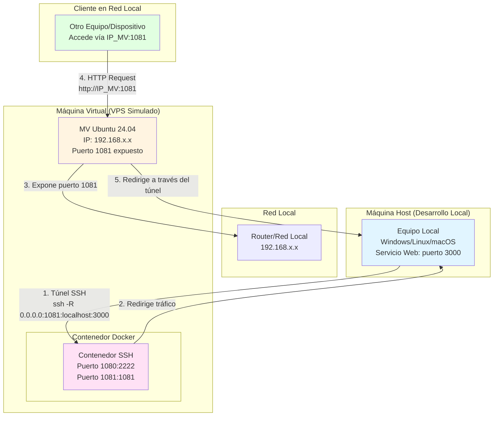

# Práctica: Configuración de túnel SSH con Docker

## Objetivos

Durante esta práctica pondrás en marcha un **túnel SSH** empleando un contenedor Docker como herramienta principal, con el objetivo de exponer de manera segura servicios locales a través de la red local por medio de una máquina virtual que simula un servidor VPS.

Al finalizar esta práctica serás capaz de:

- Comprender el concepto de **SSH Tunneling** y **Port Forwarding**.
- Configurar una máquina virtual como servidor intermediario (simulando un VPS).
- Configurar un servidor SSH en Docker para permitir túneles.
- Implementar un túnel SSH usando **Docker** y **docker-compose**.
- Redirigir puertos locales hacia servicios remotos de forma segura.
- Exponer servicios de desarrollo local a través de la red local.

<!-- ## Criterios de evaluación

Esta práctica trabaja los siguientes criterios del **RA4**:

- **CE4a**: Se han descrito métodos de acceso y administración remota de sistemas.
- **CE4c**: Se han utilizado herramientas de administración remota suministradas por el propio sistema operativo.
- **CE4d**: Se han instalado servicios de acceso y administración remota.
- **CE4e**: Se han utilizado comandos y herramientas gráficas para gestionar los servicios de acceso y administración remota.
- **CE4h**: Se han utilizado mecanismos de encriptación de la información transferida.
- **CE4i**: Se han documentado los procesos y servicios del sistema administrados de forma remota. -->

## Requisitos previos

Antes de comenzar, asegúrate de tener:

- **Máquina virtual (MV) con Ubuntu 24.04** o similar, configurada en tu red local. Esta MV actuará como "VPS simulado".
- Docker y Docker Compose instalados en la máquina virtual.
- Acceso SSH a la máquina virtual desde tu máquina host.
- Claves SSH configuradas en tu máquina local (`~/.ssh/`).
- Ambas máquinas (host y MV) deben estar en la misma red local.
- Un servicio local en tu máquina host que quieras exponer (por ejemplo, un servidor web en el puerto 3000).
  
!!! important "¿Dónde va el servicio web?"
    Para simular correctamente un escenario real con VPS:
    
    - **El servicio web va en tu máquina host** (Windows, Linux o macOS) = Simula tu máquina de desarrollo local
    - **La MV actúa como VPS** = Simula el servidor remoto con IP accesible
    - **El contenedor Docker** = Solo proporciona el servidor SSH, NO debe tener el servicio web
    
    **Flujo real simulado:**
    1. Desarrollas un servicio web en tu máquina host (puerto 3000)
    2. Creas un túnel SSH desde tu máquina host hacia la MV (VPS simulado)
    3. El túnel redirige el tráfico: `IP_MV:1081` → `máquina_host:3000`
    4. Cualquiera puede acceder a tu servicio local a través de la IP de la MV
    
    Esto simula exactamente lo que harías con un VPS real: exponer un servicio local de desarrollo a través de un servidor remoto.

## Introducción

En un entorno de producción real, la mayoría de las conexiones de internet domésticas están detrás de CGNAT (Carrier-Grade NAT) y no son accesibles directamente desde internet. Esto se hace para ahorrar direcciones IPv4, que tienen un rango limitado.

En esta práctica, simularemos este escenario utilizando una **máquina virtual (MV)** que actuará como un servidor VPS en nuestra red local. Aunque no tendremos acceso desde Internet real, podremos experimentar y comprender cómo funcionan los túneles SSH en un entorno controlado.

### Escenario de red

El siguiente diagrama muestra la arquitectura de red de esta práctica:



**Explicación del flujo:**

1. **Máquina Host (Desarrollo Local)**: Tu equipo donde desarrollas y ejecutas el servicio web (puerto 3000). Puede ser Windows, Linux o macOS.

2. **Túnel SSH**: Se establece desde tu máquina host hacia el contenedor SSH en la MV usando `ssh -R 0.0.0.0:1081:localhost:3000`. Este túnel cifra y redirige el tráfico.

3. **Máquina Virtual (VPS Simulado)**: Actúa como servidor intermediario con IP accesible en la red local. Contiene el contenedor Docker con el servidor SSH.

4. **Contenedor Docker**: Proporciona el servidor SSH que permite establecer el túnel. Expone el puerto 1081 que redirige el tráfico hacia el servicio local.

5. **Cliente en Red Local**: Cualquier dispositivo en la red local puede acceder al servicio usando `http://IP_MV:1081`, y el tráfico se redirige de forma segura a través del túnel SSH hacia tu máquina host.

**Resultado**: Tu servicio local (solo accesible desde tu máquina) se expone de forma segura a través de la MV, simulando exactamente cómo funcionaría con un VPS real en Internet.

Aunque existen servicios como **localtunnel** o **ngrok** para este propósito, estos servicios suelen tener limitaciones en sus planes gratuitos. Configurar nuestro propio túnel SSH nos permite tener una solución personalizada siempre disponible y entender cómo funciona internamente.

### ¿Por qué es útil?

Esta configuración es útil cuando necesitas:

- Comprender cómo funcionan los túneles SSH y el port-forwarding en la práctica.
- Simular un escenario real de acceso remoto a servicios locales.
- Compartir tu proyecto local con otros en la misma red o proporcionar acceso a través de un servidor intermediario.
- Realizar pruebas de conectividad y redirección de puertos.
- Hacer demos para presentaciones o reuniones de equipo dentro de la red local.
- Probar el frontend en diferentes dispositivos dentro de la red local (móvil, diferentes resoluciones, OS, navegador).
- Realizar depuración remota o programación en pareja.

<!-- ### Tunelización SSH

Como se explica en la teoría (ver sección **Tunelización** del tema), el **SSH Tunneling** es una técnica que nos permitirá navegar por la web de forma segura, estableciendo un túnel SSH contra un servidor SSH remoto.

El **Port-forwarding** es un mecanismo de SSH para tunelizar puertos desde una máquina cliente a un servidor o de forma inversa. Toma los datos que el cliente envía en un extremo del túnel y los reenvía por el canal seguro. En el otro extremo donde se recogen los datos y se envían al servicio de destino.

<figure>
  
  <figcaption>Esquema SSH-Tunnel (ver teoría para más detalles)</figcaption>
</figure>

En esta práctica:

- Configuraremos una máquina virtual (MV) que simulará un servidor VPS en nuestra red local.
- Estableceremos un túnel SSH desde nuestra máquina local (cliente) hacia la máquina virtual.
- Utilizaremos **Port-forwarding** para redirigir el tráfico desde un puerto remoto (por ejemplo, 1081) en la MV hacia un puerto local (por ejemplo, 3000) en nuestra máquina de desarrollo.
- El tráfico viajará de forma segura a través del canal cifrado SSH, incluso dentro de la red local. -->

## Paso 0: Preparar la máquina virtual (VPS simulado)

Antes de comenzar, necesitas tener una máquina virtual configurada que actuará como tu "VPS simulado":

1. **Crea una máquina virtual** con Ubuntu 24.04 (o similar) en tu hipervisor preferido (VirtualBox, VMware, Hyper-V, etc.).

2. **Configura la red** de la MV en modo "Adaptador puente" o "NAT" según tu configuración, asegurándote de que pueda comunicarse con tu máquina host.

3. **Instala Docker y Docker Compose** en la máquina virtual:

```bash
# Actualizar el sistema
sudo apt update && sudo apt upgrade -y

# Instalar Docker
curl -fsSL https://get.docker.com -o get-docker.sh
sudo sh get-docker.sh

# Añadir tu usuario al grupo docker
sudo usermod -aG docker $USER

# Instalar Docker Compose
sudo apt install docker-compose -y

# Reiniciar la sesión o ejecutar:
newgrp docker
```

4. **Verifica la instalación**:

```bash
docker --version
docker-compose --version
```

5. **Obtén la IP de la máquina virtual**:

```bash
ip addr show
# o
hostname -I
```

Anota esta IP, la necesitarás más adelante. Por ejemplo: `192.168.1.100`

6. **Asegúrate de que puedes conectarte por SSH** desde tu máquina host a la MV:

```bash
# Desde tu máquina host, prueba la conexión
ssh usuario@IP_MV
```

## Paso 1: Configurar el servidor SSH en Docker

Ya utilizamos SSH para acceder a nuestra máquina virtual, pero preferimos mantener esa configuración intacta. Por lo tanto, ejecutaremos un servidor SSH separado dentro de un contenedor Docker específicamente para túneles.

!!! note "NOTA"
    Todos los siguientes pasos se realizan **en la máquina virtual**, no en tu máquina host.

### Configuración del servidor SSH

Utilizaremos la imagen `linuxserver/openssh-server` de Linuxserver.io, una organización que mantiene imágenes Docker muy estables para todo tipo de propósitos.

Por defecto, el servidor SSH no permite túneles, por lo que necesitamos habilitar el reenvío de puertos TCP. Utilizaremos el mod `openssh-server-ssh-tunnel` que habilita el tunneling en la imagen `linuxserver/openssh-server`.

Crea un directorio para la configuración:

```bash
mkdir -p ~/ssh-tunnel
cd ~/ssh-tunnel
```

Crea el archivo `docker-compose.yml`:

```yaml
version: '3.8'

services:
  openssh-server:
    image: linuxserver/openssh-server
    container_name: openssh-server
    restart: unless-stopped
    hostname: openssh-server
    expose:
      - 1081  # Puerto remoto donde se escuchará el servicio tunelado
    ports:
      - 1080:2222  # Puerto 1080 (host) -> 2222 (contenedor SSH)
      - 1081:1081  # Puerto 1081 (host) -> 1081 (contenedor) para el servicio tunelado
    environment:
      # Mod esencial: habilita el tunneling SSH en la imagen
      - DOCKER_MODS=linuxserver/mods:openssh-server-ssh-tunnel
      - SHELL_NOLOGIN=false
      # Ajusta PUID y PGID según tu usuario en la MV (ejecuta: id -u y id -g)
      - PUID=1000
      - PGID=1000
      - TZ=Europe/Madrid
      # Clave pública SSH desde el archivo .env (permite autenticación sin contraseña)
      - PUBLIC_KEY=${PUBLIC_KEY}
      - SUDO_ACCESS=true
      - USER_NAME=usuario
      - PASSWORD_ACCESS=false  # Solo permite acceso con claves SSH
    volumes:
      - ./config:/config
    networks:
      - default

networks:
  default:
    driver: bridge
```

!!! tip "¿Qué son los Docker Mods?"
    Los **Docker Mods** son paquetes de modificación que se descargan y se aplican antes de que el contenedor arranque, para añadir o cambiar funcionalidades sin tener que forkar la imagen.  
    Forkar (del inglés *to fork*) significa crear una copia independiente de un proyecto o repositorio para modificarlo sin afectar al original.

!!! note "Configurar permisos de usuario en Docker (PUID y PGID)"
    Cuando usas Docker con volúmenes, es importante que los archivos generados dentro del contenedor tengan el mismo propietario (**user** y **grupo**) que tu usuario real de la máquina anfitriona (en este caso, la MV).  
    - **PUID** (*Personal/User ID*) corresponde al identificador numérico de tu usuario. Puedes verlo ejecutando `id -u` en la terminal.  
    - **PGID** (*Personal/Group ID*) corresponde al identificador numérico de tu grupo principal. Puedes verlo con `id -g`.

    Por ejemplo, en la mayoría de las instalaciones Linux, el primer usuario tendrá habitualmente:
    ```
    id -u   # muestra 1000
    id -g   # muestra 1000
    ```

    Al especificar estos valores en el `docker-compose.yml`:
    ```yaml
    environment:
          - PUID=1000
          - PGID=1000
    ```
    **Ventaja:** Así, los archivos creados o modificados en los volúmenes montados del contenedor pertenecerán a tu usuario en la MV, evitando problemas de permisos y facilitando la gestión de los archivos compartidos entre el sistema anfitrión y el contenedor Docker.


### Generar claves SSH en tu máquina host

!!! note "NOTA"
    Las claves SSH se generan en tu **máquina host** (no en la MV), ya que serás tú quien te conectes al contenedor SSH.

En tu máquina host, genera un par de claves SSH:

```bash
ssh-keygen -t ed25519 -C "ssh-tunnel@mv" -f ~/.ssh/ssh_tunnel_id_ed25519
```

!!! note "¿Hace falta poner una frase obligatoria (passphrase) al generar las claves?"
    No hay frase “obligatoria”. Esa pregunta aparece para proteger tu clave privada con una **passphrase**.

    **Opciones:**
    
    - **Sin passphrase:** pulsa `Enter` dos veces cuando te lo pida. Es más cómodo para prácticas y automatizaciones, pero menos seguro.
    - **Con passphrase:** si pones una, la clave quedará cifrada y pedirá la contraseña cada vez que la uses, lo que aumenta la seguridad (no recomendado en este caso práctico por comodidad).


!!! info "¿Por qué ed25519?"
    Utilizamos **ed25519** en lugar de otros algoritmos como RSA por las siguientes razones:
    
    - **Seguridad:** ed25519 ofrece un nivel de seguridad equivalente a RSA de 3072 bits, pero con claves mucho más pequeñas (256 bits vs. 2048-4096 bits de RSA).
    - **Rendimiento:** Las operaciones criptográficas con ed25519 son más rápidas que con RSA, especialmente en la generación de claves y la firma de mensajes.
    - **Tamaño:** Las claves ed25519 son más pequeñas, lo que facilita su manejo y transferencia.
    - **Recomendación actual:** ed25519 es el algoritmo recomendado por la mayoría de autoridades de seguridad criptográfica desde 2014.
    - **Compatibilidad:** Está soportado por OpenSSH desde la versión 6.5 (2014) y es compatible con la mayoría de sistemas modernos.
    
    **Alternativas:** Si necesitas compatibilidad con sistemas más antiguos, puedes usar RSA con `-t rsa -b 4096`, aunque ed25519 es la opción preferida en la mayoría de casos.

Esto creará dos archivos en tu máquina host:

- `~/.ssh/ssh_tunnel_id_ed25519` (clave privada - se queda en tu máquina)
- `~/.ssh/ssh_tunnel_id_ed25519.pub` (clave pública - se copiará a la MV)

### Configurar variables de entorno en la máquina virtual

Ahora, en la **máquina virtual**, crea un archivo `.env` en el directorio `~/ssh-tunnel`:

```bash
# En la MV, crea el archivo .env
cd ~/ssh-tunnel
nano .env
```

Copia el contenido de tu clave pública (desde tu máquina host) al archivo `.env`:

```bash
# Clave pública SSH (copia el contenido de ~/.ssh/ssh_tunnel_id_ed25519.pub desde tu máquina host)
PUBLIC_KEY="ssh-ed25519 AAAAC3NzaC1lZDI1NTE5AAAAI..."
```

**Cómo obtener la clave pública desde tu máquina host:**

En tu máquina host, ejecuta:

```bash
cat ~/.ssh/ssh_tunnel_id_ed25519.pub
```

Copia toda la línea (desde `ssh-ed25519` hasta el final) y pégala en el archivo `.env` de la MV entre comillas.

### Iniciar el contenedor

```bash
docker-compose up -d
```

Verifica que el contenedor esté ejecutándose:

```bash
docker-compose ps
docker-compose logs openssh-server
```

## Paso 2: Configurar el cliente SSH

En tu **máquina host**, configura el cliente SSH para conectarse al contenedor en la máquina virtual. Edita el archivo `~/.ssh/config`:

```bash
# Túnel SSH a través del contenedor Docker en la máquina virtual
Host mv-tunnel
    HostName IP_MV  # Reemplaza con la IP de tu máquina virtual (ej: 192.168.1.100)
    IdentityFile ~/.ssh/ssh_tunnel_id_ed25519
    User usuario  # El mismo USER_NAME del docker-compose.yml
    Port 1080  # El puerto mapeado en el contenedor
    ServerAliveInterval 60     # Intervalo en segundos para enviar mensajes de keep-alive al servidor
    ServerAliveCountMax 3      # Número máximo de intentos de keep-alive antes de cerrar la conexión
```

!!! note "IMPORTANTE"
    Reemplaza `IP_MV` por la IP real de tu máquina virtual en la red local (la que obtuviste en el Paso 0).
    
    Por ejemplo, si tu MV tiene la IP `192.168.1.100`, deberás poner:  
    `HostName 192.168.1.100`

## Paso 3: Configurar el firewall en la máquina virtual

Necesitas configurar el firewall de tu máquina virtual para permitir conexiones SSH al contenedor desde tu máquina host.

!!! note "NOTA"
    Estos comandos se ejecutan **en la máquina virtual**, no en tu máquina host.

### Verificar el estado del firewall

Primero, comprueba si el firewall está activo:

```bash
# En la MV
sudo ufw status
```

Si aparece `Status: inactive`, el firewall está desactivado.

### Opción A: Activar y configurar UFW (Recomendado para práctica completa)

Si quieres una práctica completa que incluya la configuración del firewall:

```bash
# En la MV

# IMPORTANTE: Primero permite SSH para no quedarte sin acceso
sudo ufw allow 22/tcp

# Permite el puerto del contenedor SSH
sudo ufw allow 1080/tcp

# Activa el firewall
sudo ufw enable

# Verifica la configuración
sudo ufw status
```

Deberías ver algo como:

```
Status: active

To                         Action      From
--                         ------      ----
22/tcp                     ALLOW       Anywhere
1080/tcp                   ALLOW       Anywhere
```

### Opción B: Dejar el firewall desactivado (Para pruebas rápidas)

Si estás en una red local controlada y solo quieres probar el túnel SSH sin complicaciones adicionales, puedes dejar el firewall desactivado. **El túnel funcionará igual** ya que no hay nada bloqueando el puerto 1080.

En este caso, simplemente continúa con el Paso 4.

### Firewalld (CentOS/RHEL)

Si usas CentOS/RHEL en lugar de Ubuntu:

```bash
# En la MV
# Verifica el estado
sudo firewall-cmd --state

# Permite SSH (si no está ya permitido)
sudo firewall-cmd --permanent --add-service=ssh

# Permite el puerto 1080
sudo firewall-cmd --permanent --add-port=1080/tcp

# Recarga la configuración
sudo firewall-cmd --reload

# Verifica
sudo firewall-cmd --list-ports
```

!!! warning "Importante"
    Si decides activar el firewall, **siempre permite el puerto 22 (SSH) primero** para no perder el acceso a la máquina virtual.

## Paso 4: Crear el túnel SSH

Una vez configurado todo, puedes crear el túnel desde tu **máquina host** utilizando **Port-forwarding**.

!!! note "Importante"
    Estos comandos se ejecutan **en tu máquina host**, no en la MV.

### Port-forwarding remoto (-R)

El **Port-forwarding** es un mecanismo de SSH para tunelizar puertos desde una máquina cliente a un servidor o de forma inversa. En este caso, utilizaremos el reenvío de puerto remoto (`-R`) para exponer un servicio local (en tu máquina host) a través de la máquina virtual.

Para exponer un servicio local (por ejemplo, en el puerto 3000 de tu máquina host) a través del puerto remoto 1081 en la MV:

```bash
# Desde tu máquina host
ssh -R *:1081:localhost:3000 usuario@IP_MV
```

O usando el host configurado en `~/.ssh/config`:

```bash
# Desde tu máquina host
ssh -R *:1081:localhost:3000 mv-tunnel
```

!!! warning "Problema con shells que interpretan el asterisco"
    Algunos shells como **zsh** (macOS) o **fish** interpretan el asterisco `*` como un patrón de archivos, lo que puede causar el error `no matches found: *:1081:localhost:3000`.
    
    **Solución:** Escapa el asterisco con una barra invertida, usa comillas, o especifica la interfaz explícitamente:
    
    ```bash
    # Opción 1: Escapar el asterisco
    ssh -R \*:1081:localhost:3000 mv-tunnel
    
    # Opción 2: Usar comillas (recomendado)
    ssh -R '*:1081:localhost:3000' mv-tunnel
    
    # Opción 3: Especificar la interfaz explícitamente (0.0.0.0) - FUNCIONA EN TODOS LOS SHELLS
    ssh -R 0.0.0.0:1081:localhost:3000 mv-tunnel
    ```
    
    La **Opción 3** es equivalente a usar `*` y funciona en todos los shells (bash, zsh, fish, PowerShell, etc.) sin necesidad de escapar.

> **Explicación del comando según la teoría:**

- `ssh`: Comando SSH para establecer la conexión
- `-R`: Remote port forwarding (reenvío de puerto remoto)
- `*:1081`: Puerto remoto en el servidor donde se escuchará (el `*` permite escuchar en todas las interfaces)
- `localhost:3000`: Servicio local que queremos exponer (puerto local y hostname local)
- `usuario@hostname` o `vps-tunnel`: Usuario y hostname del servidor SSH remoto

**Formato general según la teoría:**
```
ssh -L local-puerto:remote-hostname:remote-puerto username@hostname
```

En nuestro caso, como usamos `-R` (reenvío remoto), el formato es:
```
ssh -R remote-puerto:local-hostname:local-puerto username@hostname
```

El **Port-forwarding** consiste en tomar el tráfico de red que llega a un puerto, encapsularlo a través de un túnel cifrado SSH y reenviarlo de forma segura hacia otro destino, normalmente saltándose posibles firewalls o restricciones de red. 

En el contexto de esta práctica, usamos la opción `-R` (reenvío de puerto remoto), que permite que los usuarios de la máquina virtual (simulando un VPS remoto) puedan acceder a servicios que sólo están disponibles localmente en tu máquina host. Con `-R`, el puerto especificado (por ejemplo, `1081`) queda abierto en la MV, y todo lo que llegue a ese puerto se reencamina a través del túnel SSH hacia el puerto correspondiente (por ejemplo, `3000`) en tu máquina local, donde realmente corre el servicio.

Esto contrasta con la opción `-L` (reenvío de puerto local), que funciona en sentido inverso: expone en tu equipo local un puerto que se conecta a un servicio remoto a través del túnel SSH. En nuestro caso, lo que queremos es que alguien que se conecte a la MV (VPS simulado) pueda acceder, a través de la IP de la MV y del puerto designado, al servicio que sólo está disponible en tu host local. Por eso **elegimos `-R`**, porque queremos exponer el servicio local de tu ordenador a través de la máquina virtual, y no al revés.

En resumen:

- Usamos `-R` para hacer accesible un servicio local (de tu máquina host) desde la MV a través del túnel.
- Si usáramos `-L`, el servicio tendría que estar en la MV y se expondría en tu máquina local, que no es lo que buscamos en esta práctica.

### Múltiples túneles con Port-forwarding

Puedes crear múltiples túneles en una sola conexión SSH, cada uno utilizando **Port-forwarding** independiente:

```bash
# Desde tu máquina host
# Nota: En algunos shells (zsh, fish), usa comillas o 0.0.0.0 en lugar de *
ssh \
  -R '*:1081:localhost:3000' \
  -R '*:1082:localhost:5000' \
  -R '*:1083:localhost:8080' \
  mv-tunnel
```

O usando `0.0.0.0` (funciona en todos los shells):

```bash
# Desde tu máquina host
ssh \
  -R 0.0.0.0:1081:localhost:3000 \
  -R 0.0.0.0:1082:localhost:5000 \
  -R 0.0.0.0:1083:localhost:8080 \
  mv-tunnel
```

Cada opción `-R` establece un túnel independiente que utiliza **Port-forwarding** para redirigir el tráfico desde el puerto remoto (en la MV) hacia el puerto local correspondiente (en tu máquina host).

**Nota:** Asegúrate de que estos puertos estén expuestos en el `docker-compose.yml` de la máquina virtual.

### Mantener el túnel activo

Para mantener el túnel SSH activo de forma persistente, puedes usar `autossh`, que automáticamente reconecta si la conexión se pierde:

```bash
# En tu máquina host, instalar autossh (si no está instalado)
sudo apt install autossh  # Ubuntu/Debian
# o
sudo yum install autossh  # CentOS/RHEL

# Crear túnel persistente con Port-forwarding
# Nota: En algunos shells (zsh, fish), usa comillas o 0.0.0.0 en lugar de *
autossh -M 20000 -R '*:1081:localhost:3000' mv-tunnel
# o
autossh -M 20000 -R 0.0.0.0:1081:localhost:3000 mv-tunnel
```

El parámetro `-M 20000` especifica un puerto de monitoreo que `autossh` usa para verificar que la conexión SSH sigue activa. Si la conexión se cae, `autossh` la restablece automáticamente, manteniendo el **Port-forwarding** activo.

## Paso 5: Verificar el túnel

Una vez establecido el túnel, puedes verificar que funciona:

1. **Desde la máquina virtual**, verifica que el puerto está escuchando:

```bash
# En la MV
sudo netstat -tlnp | grep 1081
# o
sudo ss -tlnp | grep 1081
```

Deberías ver que el puerto 1081 está en estado LISTEN.

2. **Desde otra máquina en la red local** (puede ser otra MV, otro equipo, o incluso desde la propia MV), intenta acceder al servicio:

```bash
# Desde cualquier máquina en la red local
curl http://IP_MV:1081
```

Si tu servicio local (en tu máquina host) es un servidor web, deberías poder acceder a él desde cualquier máquina en tu red local usando `http://IP_MV:1081`, donde `IP_MV` es la IP de tu máquina virtual.


---

### Ejemplo práctico: Exponer un servicio web desde tu máquina host a través del túnel SSH

A continuación se describen los pasos para crear un servidor web **en tu máquina host** (no en la MV), y exponerlo a través del túnel SSH, para que sea accesible desde otras máquinas de la red local mediante la máquina virtual.

!!! tip "Simulación del escenario real"
    En un escenario real:

    - Desarrollas en tu máquina local (Windows, Linux o macOS)
    - Tienes un VPS con IP pública
    - Quieres exponer tu servicio local a través del VPS
    
    En esta práctica:

    - **Máquina host** = Tu máquina de desarrollo local (cualquier SO)
    - **MV** = Simula el VPS (con IP accesible en tu red local)
    - **Servicio web** = Debe estar en tu máquina host (NO en la MV), y se accederá a través del túnel establecido desde la MV

#### 1. Crea un servicio web simple en tu máquina host

En tu máquina host (Windows, Linux o macOS), crea un servidor web simple en el puerto 3000:

```bash
# Opción A: Con Python (si tienes Python instalado)
cd ~
mkdir test-web
cd test-web
echo "<h1>Servicio web desde mi máquina host</h1><p>Accesible a través del túnel SSH</p>" > index.html
python3 -m http.server 3000
```

O si prefieres usar Node.js:

```bash
# Opción B: Con Node.js (si tienes Node.js instalado)
npx http-server -p 3000
```

O crea un servidor más personalizado:

```bash
# Opción C: Servidor Python con contenido personalizado
cat > server.py << 'EOF'
from http.server import HTTPServer, SimpleHTTPRequestHandler

class MyHandler(SimpleHTTPRequestHandler):
    def do_GET(self):
        self.send_response(200)
        self.send_header('Content-type', 'text/html')
        self.end_headers()
        self.wfile.write(b'<h1>Servicio web desde mi máquina host</h1>')
        self.wfile.write(b'<p>Este servicio esta corriendo en localhost:3000 de mi máquina host</p>')
        self.wfile.write(b'<p>Pero es accesible a traves de la MV en http://IP_MV:1081</p>')

httpd = HTTPServer(('localhost', 3000), MyHandler)
print("Servidor corriendo en http://localhost:3000")
httpd.serve_forever()
EOF

python3 server.py
```

#### 2. Verifica que el servicio funciona localmente en tu máquina host

```bash
# En otra terminal de tu máquina host
curl http://localhost:3000
# o en Windows PowerShell:
# Invoke-WebRequest http://localhost:3000
```

Deberías ver el contenido HTML del servidor.

#### 3. Crea el túnel SSH desde tu máquina host a la MV

Desde tu máquina host, mantén el servidor web corriendo y en otra terminal ejecuta:

```bash
# Usa 0.0.0.0 para compatibilidad con todos los shells (bash, zsh, PowerShell, etc.)
ssh -R 0.0.0.0:1081:localhost:3000 mv-tunnel
```

> **Explicación:**

- Esto expone el puerto 3000 de tu máquina host (donde está el servicio web) a través del puerto 1081 de la MV
- El tráfico se redirige: `IP_MV:1081` → `máquina_host:3000`
- Puedes mantener el túnel activo usando `autossh` si lo deseas, como se explicó anteriormente

#### 4. Accede al servicio desde otra máquina en la red local

Desde cualquier máquina en tu red local (puede ser otra MV, otro equipo, o incluso desde la propia MV), puedes acceder al servicio usando:

```bash
curl http://IP_MV:1081
```

O abre `http://IP_MV:1081` en un navegador.

!!! note "Nota"
    El contenido que verás al acceder a `http://IP_MV:1081` corresponde al servidor web que se está ejecutando en **tu máquina host** (puerto 3000), pero es accesible a través de la dirección IP de la MV gracias al túnel SSH. Esta técnica reproduce el comportamiento típico de exponer un servicio local a Internet usando un VPS remoto.

#### 5. Verifica el flujo completo

1. **Servicio local en máquina host**: `http://localhost:3000` → Solo accesible desde tu máquina host
2. **Túnel SSH activo**: Redirige el tráfico desde `IP_MV:1081` → `máquina_host:3000`
3. **Acceso remoto**: `http://IP_MV:1081` → Accesible desde cualquier máquina en tu red local

Esto simula que tu servicio de desarrollo local es accesible públicamente a través del VPS.

!!! warning "Solución de problemas: El puerto 1081 no responde"
    Si `curl http://IP_MV:1081` falla, verifica:
    
    1. **Puerto 1081 mapeado en docker-compose.yml**: Debe tener `- 1081:1081` en la sección `ports:`. Si falta, añádelo y ejecuta `docker-compose restart`.
    2. **Túnel SSH activo**: Verifica con `sudo ss -tlnp | grep 1081` en la MV. Si no aparece, reconecta el túnel desde tu máquina host.
    3. **Firewall**: Si UFW está activo, permite el puerto: `sudo ufw allow 1081/tcp`.
    4. **Servicio web corriendo**: Verifica en tu máquina host con `curl http://localhost:3000`.

---

!!! tip "Recuerda"
    - Cambia `IP_MV` por la IP real de tu máquina virtual.
    - Puedes exponer otros servicios adaptando los puertos del túnel según lo necesites.


!!! example "Ejemplo práctico de acceso"
    Si tu MV tiene la IP `192.168.1.100` y tu servicio local está en el puerto 3000, tras crear el túnel podrás acceder desde cualquier máquina de la red local con:

    ```bash
    curl http://192.168.1.100:1081
    ```

    Esto redirige el tráfico a través del túnel SSH hacia tu servicio local en el puerto 3000.

```bash
curl http://192.168.1.100:1081
```

Esto redirigirá el tráfico a través del túnel SSH hacia tu servicio local en el puerto 3000.

## Paso 6: Configurar múltiples servicios (Opcional)

Si necesitas exponer múltiples servicios, modifica el `docker-compose.yml` para exponer más puertos:

```yaml
services:
  openssh-server:
    # ... otras configuraciones ...
    expose:
      - 1081  # túnel 1
      - 1082  # túnel 2
      - 1083  # túnel 3
    # ... resto de la configuración ...
```

Luego crea los túneles correspondientes:

```bash
ssh \
  -R *:1081:localhost:3000 \
  -R *:1082:localhost:5000 \
  -R *:1083:localhost:8080 \
  vps-tunnel
```

## Tareas a realizar

1. **Preparación del entorno:**

   - Crea y configura una máquina virtual con Ubuntu 24.04.
   - Instala Docker y Docker Compose en la máquina virtual.
   - Verifica la conectividad de red entre tu máquina host y la MV.
   - Obtén y anota la IP de la máquina virtual.

2. **Configuración del servidor SSH en Docker:**

   - En la máquina virtual, configura el servidor SSH en Docker siguiendo el Paso 1.
   - Genera las claves SSH en tu máquina host.
   - Configura las variables de entorno en la MV con tu clave pública.
   - Verifica que el contenedor se inicia correctamente.

3. **Configuración del cliente:**

   - Configura el cliente SSH en tu máquina host.
   - Abre los puertos necesarios en el firewall de la máquina virtual.
   - Verifica que puedes conectarte al contenedor SSH desde tu máquina host.

4. **Creación del túnel con Port-forwarding:**

   - Crea un túnel SSH utilizando **Port-forwarding** que exponga un servicio local (puede ser un servidor web simple en tu máquina host).
   - Explica cómo el **Port-forwarding** toma los datos del cliente y los reenvía por el canal seguro.
   - Verifica que el túnel funciona correctamente y que los datos se transmiten de forma segura.

5. **Documentación:**

   - Crea un documento que explique:
     - La arquitectura del túnel SSH y cómo funciona el **Port-forwarding**.
     - Cómo el **Port-forwarding** tuneliza puertos desde la máquina cliente (host) al servidor (MV).
     - Cómo los datos se envían por el canal seguro SSH.
     - Los pasos realizados para la configuración, indicando claramente qué se hace en cada máquina.
     - Capturas de pantalla que demuestren el funcionamiento.
     - Problemas encontrados y soluciones aplicadas.

6. **Pruebas:**

   - Accede al servicio expuesto desde otra máquina en la red local (puede ser otra MV o la misma MV).
   - Verifica que el túnel se mantiene activo.
   - Prueba la creación de múltiples túneles simultáneos.

## Entregables

Para la entrega de esta práctica, deberás proporcionar:

1. **Documentación:**

   - Documento en Markdown con:
     - Descripción de la arquitectura implementada.
     - Pasos seguidos para la configuración.
     - Capturas de pantalla del proceso.
     - Comandos utilizados y su explicación.
     - Verificación del funcionamiento.

2. **Evidencias:**

   - Las capturas de pantalla deben mostrar:
     - El contenedor Docker en ejecución.
     - La conexión SSH establecida.
     - El acceso al servicio desde otra máquina.
     - Los logs del contenedor SSH.

## Referencias

- [Tutorial de túneles SSH locales y remotos](https://iximiuz.com/en/posts/ssh-tunnels)
- [Repositorio linuxserver/docker-openssh-server](https://github.com/linuxserver/docker-openssh-server)
- [Mod openssh-server-ssh-tunnel](https://github.com/linuxserver/docker-mods/tree/openssh-server-ssh-tunnel)
- [Artículo: Expose local dev server with SSH tunnel and Docker](https://nemanjamitic.com/blog/2025-04-20-ssh-tunnel-docker)


<!-- ## Notas adicionales

- **Entorno educativo:** Esta práctica está adaptada para funcionar en una red local usando una máquina virtual como VPS simulado. En un entorno de producción real, el VPS tendría una IP pública accesible desde Internet.

- **Seguridad:** Aunque estamos en una red local, asegúrate de mantener actualizado el contenedor Docker y el sistema operativo de la máquina virtual. En un entorno real, esto es crítico.

- **Rendimiento:** Los túneles SSH son adecuados para uso temporal. Para túneles permanentes, considera usar herramientas especializadas como [rathole](https://github.com/rapiz1/rathole) o [frp](https://github.com/fatedier/frp).

- **Alternativas:** Si necesitas HTTPS y URLs amigables, puedes combinar esta solución con un proxy inverso como Traefik o Nginx.

- **Red local:** Recuerda que en esta práctica solo funcionará dentro de tu red local. Para acceso desde Internet real, necesitarías un VPS con IP pública.

---

!!! tip "Consejo"
    Esta práctica te permite comprender cómo funcionan los túneles SSH y el port-forwarding en un entorno controlado. Los conceptos aprendidos aquí son directamente aplicables a escenarios reales con VPS en Internet. -->
