# Práctica: Administración de Usuarios y Grupos en Active Directory

## Objetivos

Durante esta práctica aprenderás a crear, configurar y gestionar usuarios y grupos en **Active Directory Domain Services**. Esta práctica complementa la PR401 y te permitirá trabajar con la administración de objetos del directorio, configuraciones de cuentas y restricciones de acceso.

Al finalizar esta práctica serás capaz de:

- Crear y configurar **cuentas de usuario** en Active Directory.
- Configurar **propiedades de contraseña** y opciones de cuenta.
- Crear y gestionar **grupos** de seguridad con diferentes ámbitos.
- **Añadir usuarios a grupos** y gestionar pertenencias.
- Configurar **restricciones de inicio de sesión** (horarios y equipos permitidos).
- **Deshabilitar y habilitar** cuentas de usuario.
- Documentar el proceso completo de administración.

## Tareas a realizar

1. **Creación de usuarios**:

   - Crea dos usuarios (`usuario1` y `usuario2`) con la contraseña `Abc123!`.
   - Configura las cuentas para que no tengan que cambiar la contraseña al iniciar sesión por primera vez.

2. **Creación y gestión de grupos**:

   - Crea un grupo global de seguridad llamado `Alumnos`.
   - Añade ambos usuarios al grupo `Alumnos`.

3. **Deshabilitación de cuentas**:

   - Deshabilita la cuenta de `usuario2`.
   - Captura el error al intentar acceder desde un equipo cliente.
   - Habilita de nuevo la cuenta.

4. **Restricciones de equipos**:

   - Configura `usuario1` para que solo pueda iniciar sesión desde un equipo específico.
   - Verifica que no puede iniciar sesión desde otros equipos.

5. **Restricciones horarias**:

   - Configura `usuario2` para que solo pueda iniciar sesión de lunes a viernes de 8:00 a 18:00.
   - Captura la configuración de horarios.

6. **Análisis de permisos**:

   - Intenta iniciar sesión en el controlador de dominio con `usuario2`.
   - Analiza por qué no puedes y qué se necesitaría para permitirlo.

7. **Documentación**:

   - Crea un documento que explique:
     - Los conceptos de usuarios y grupos en Active Directory.
     - Los tipos y ámbitos de grupos.
     - Los pasos realizados para la creación y configuración.
     - Capturas de pantalla que demuestren el funcionamiento.
     - Análisis de las restricciones y su funcionamiento.

## Entregables

Para la entrega de esta práctica, deberás proporcionar:

1. **Documentación**:

   - Documento en Markdown con:
     - Descripción de usuarios y grupos en Active Directory.
     - Tipos y ámbitos de grupos.
     - Pasos seguidos para la creación de usuarios y grupos.
     - Configuración de restricciones de inicio de sesión.
     - Capturas de pantalla del proceso completo.
     - Análisis de las restricciones y su funcionamiento.
     - Respuestas a las preguntas planteadas.

2. **Evidencias**:

   - Las capturas de pantalla deben mostrar:
     - Creación de usuarios en Active Directory.
     - Configuración de contraseñas y opciones de cuenta.
     - Creación de grupos.
     - Añadir usuarios a grupos.
     - Deshabilitación de cuenta y error al intentar iniciar sesión.
     - Configuración de restricciones de equipos.
     - Configuración de restricciones horarias.
     - Verificación de las restricciones funcionando.

## Requisitos previos

Antes de comenzar, asegúrate de tener completada la **PR401** o tener:

- **Un dominio de Active Directory** configurado y funcionando.
- **Acceso RDP** al controlador de dominio con credenciales de administrador.
- **Al menos un equipo cliente** unido al dominio.
- **Conocimiento básico** de Active Directory y conceptos de dominio.

!!! note "Nota importante"
    Esta práctica asume que ya tienes un dominio de Active Directory configurado. Si no lo tienes, completa primero la PR401.

## Introducción

### ¿Por qué administrar usuarios y grupos?

La administración eficiente de usuarios y grupos es fundamental en cualquier entorno de red empresarial. Permite:

- **Controlar el acceso** a recursos de red de forma centralizada.
- **Simplificar la gestión** de permisos mediante grupos en lugar de usuarios individuales.
- **Aplicar políticas** de seguridad de forma consistente.
- **Facilitar la auditoría** y el cumplimiento normativo.

### Herramientas de administración

Para administrar usuarios y grupos en Active Directory utilizaremos principalmente:

- **Usuarios y equipos de Active Directory (dsa.msc)**: Herramienta gráfica principal para la administración de objetos del directorio.
- **PowerShell**: Para tareas de administración automatizadas o masivas.

> **Recursos de apoyo**

<figure style="width: 100%; margin: 0; padding: 0;">
  

    <iframe src="https://www.youtube.com/embed/DyZKOorXoNo" title="Administración de usuarios y grupos en Active Directory" frameborder="0" allow="accelerometer; autoplay; clipboard-write; encrypted-media; gyroscope; picture-in-picture; web-share" allowfullscreen style="position: absolute; top: 0; left: 0; width: 100%; height: 100%;"></iframe>
  

  <figcaption>Video tutorial: Administración de usuarios y grupos en Active Directory</figcaption>
</figure>

<figure style="width: 100%; margin: 0; padding: 0;">
  

    <iframe src="https://www.youtube.com/embed/8BYwjMwyP6k" title="Configuración avanzada de usuarios y grupos" frameborder="0" allow="accelerometer; autoplay; clipboard-write; encrypted-media; gyroscope; picture-in-picture; web-share" allowfullscreen style="position: absolute; top: 0; left: 0; width: 100%; height: 100%;"></iframe>
  

  <figcaption>Video tutorial: Configuración avanzada de usuarios y grupos</figcaption>
</figure>

## Paso 1: Crear usuarios del dominio

### 1. Acceder a Usuarios y Equipos de Active Directory

1. **Conecta mediante RDP** a tu controlador de dominio.
2. **Abre "Administrador del servidor"** (Server Manager).
3. **Haz clic en "Herramientas"** → **"Usuarios y equipos de Active Directory"**.

<figure>
  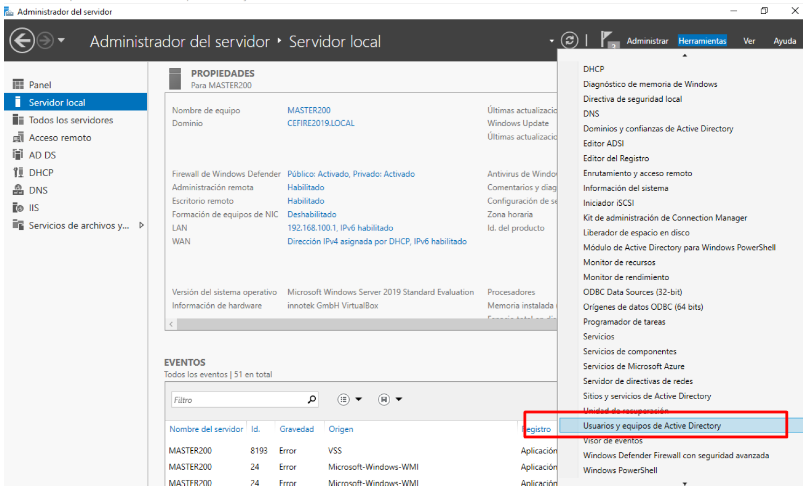
  <figcaption>Acceso a Usuarios y Equipos de Active Directory</figcaption>
</figure>

### 2. Crear el primer usuario

1. En el panel izquierdo, **expande tu dominio** (ej: `empresa.local`).
2. **Haz clic con el botón derecho** sobre **"Users"**.
3. Selecciona **"Nuevo"** → **"Usuario"**.

<figure>
  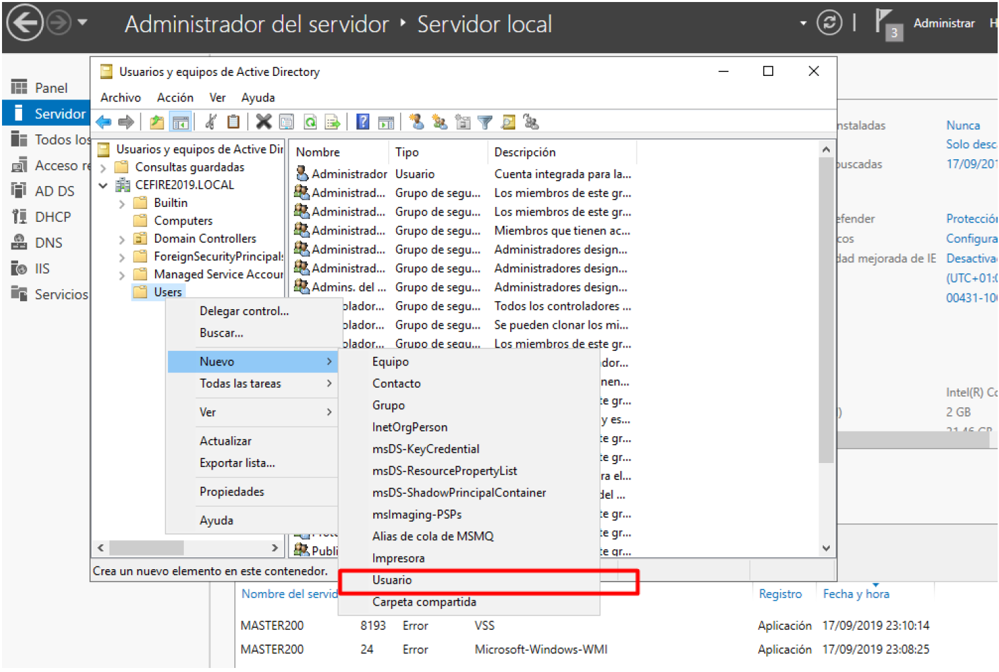
  <figcaption>Crear nuevo usuario</figcaption>
</figure>

### 3. Configurar los datos del usuario

1. En el asistente de creación de usuario, introduce:
   - **Nombre**: `Usuario1`
   - **Iniciales**: (opcional)
   - **Apellidos**: (opcional)
   - **Nombre de inicio de sesión de usuario**: `usuario1`

<figure>
  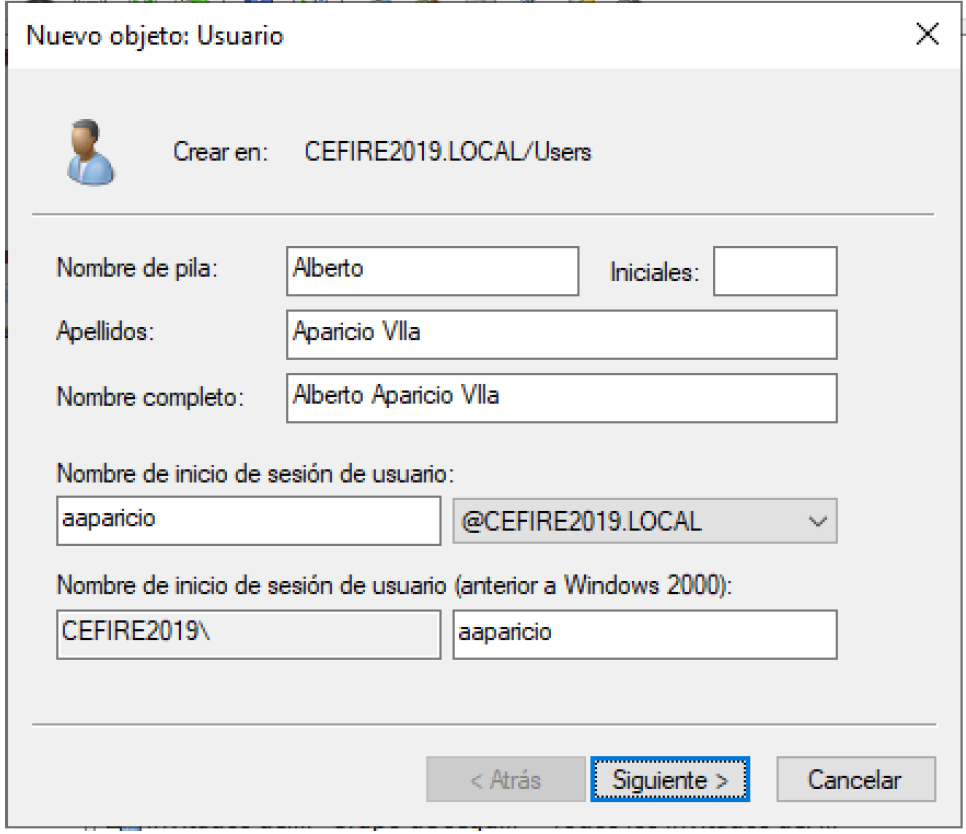
  <figcaption>Configuración de datos del usuario</figcaption>
</figure>

!!! note "Normas para nombres de usuario"
    - Las cuentas de usuario **deben ser únicas** en todo el dominio.
    - Los nombres pueden contener letras, números y algunos caracteres especiales.
    - No se aceptan: `/`, `|`, `:`, `;`, `=`, `<`, `>`, `*`.
    - Máximo 20 caracteres.

2. **Haz clic en "Siguiente"**.

### 4. Configurar la contraseña

1. Introduce la contraseña: `Abc123!`
2. **Confirma la contraseña**.
3. **Desmarca** la opción **"El usuario debe cambiar la contraseña en el siguiente inicio de sesión"**.
4. **Marca** la opción **"La contraseña nunca expira"** (solo para prácticas).

<figure>
  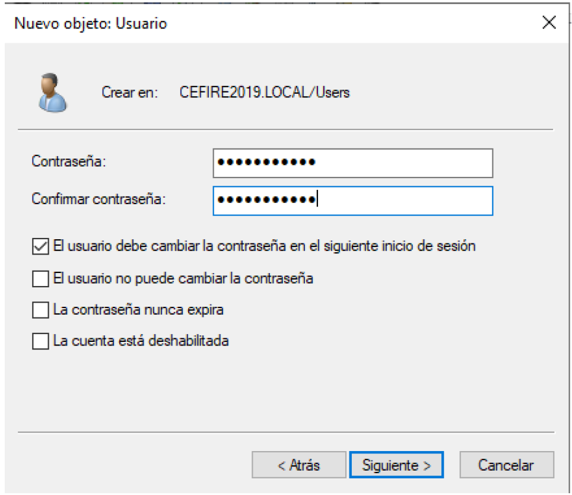
  <figcaption>Configuración de contraseña del usuario</figcaption>
</figure>

!!! warning "Seguridad en producción"
    En un entorno de producción, **nunca** deberías desactivar la caducidad de contraseñas ni permitir contraseñas débiles. Estas configuraciones son solo para prácticas educativas.

5. **Haz clic en "Siguiente"** y luego en **"Finalizar"**.

### 5. Crear el segundo usuario

Repite los pasos anteriores para crear un segundo usuario:

- **Nombre de inicio de sesión**: `usuario2`
- **Contraseña**: `Abc123!`
- **Mismas opciones de contraseña** que usuario1

## Paso 2: Crear y configurar grupos

### 1. Crear un grupo global

1. En **Usuarios y equipos de Active Directory**, **haz clic con el botón derecho** sobre **"Users"**.
2. Selecciona **"Nuevo"** → **"Grupo"**.

<figure>
  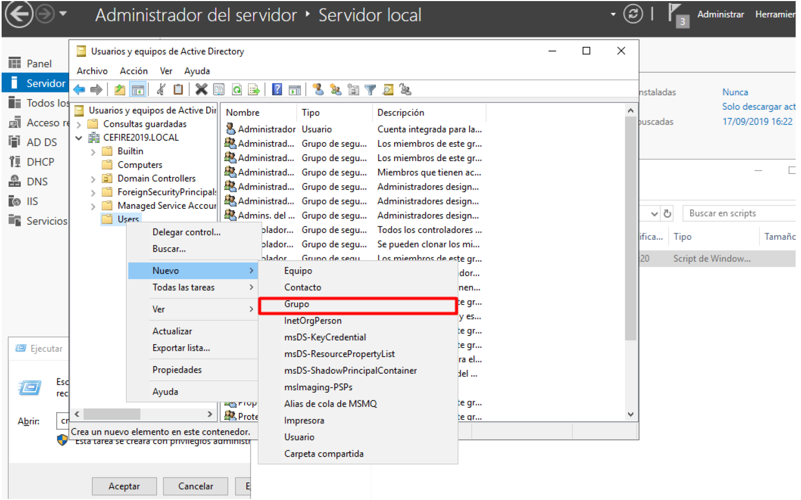
  <figcaption>Crear nuevo grupo</figcaption>
</figure>

3. En el cuadro de diálogo:
   - **Nombre del grupo**: `Alumnos`
   - **Ámbito del grupo**: **Global** (por defecto)
   - **Tipo de grupo**: **Seguridad** (por defecto)

<figure>
  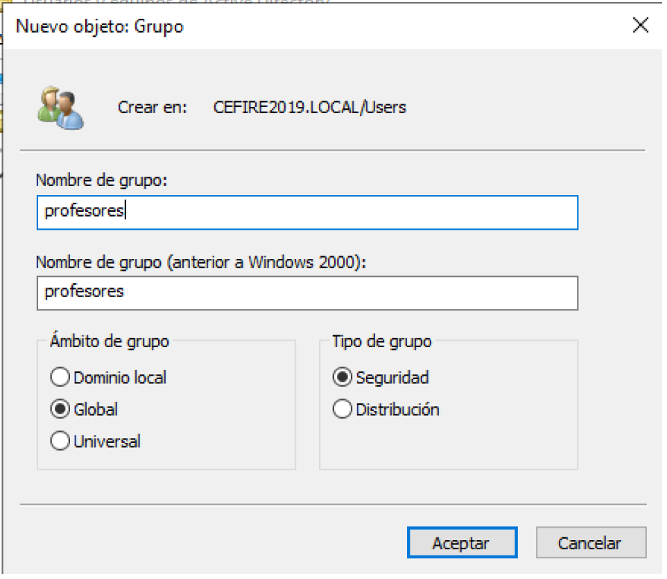
  <figcaption>Configuración del nuevo grupo</figcaption>
</figure>

4. **Haz clic en "Aceptar"**.

<figure>
  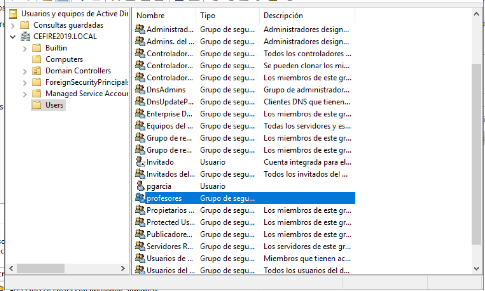
  <figcaption>Grupo creado en Active Directory</figcaption>
</figure>

### 2. Añadir usuarios al grupo

#### Método 1: Desde el usuario

1. **Selecciona el usuario** `usuario1`.
2. **Haz clic con el botón derecho** → **"Agregar a un grupo"**.

<figure>
  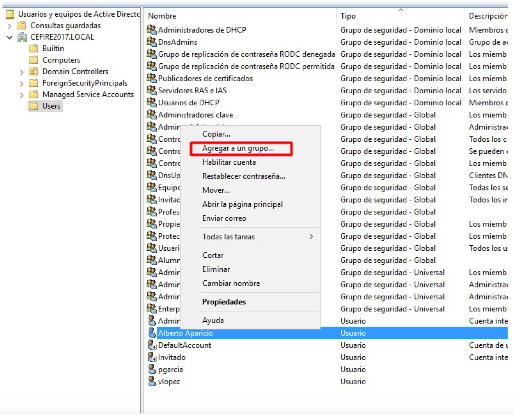
  <figcaption>Añadir usuario a grupo desde el usuario</figcaption>
</figure>

3. Escribe el nombre del grupo: `Alumnos`.
4. **Haz clic en "Comprobar nombres"** para verificar.
5. **Haz clic en "Aceptar"**.

<figure>
  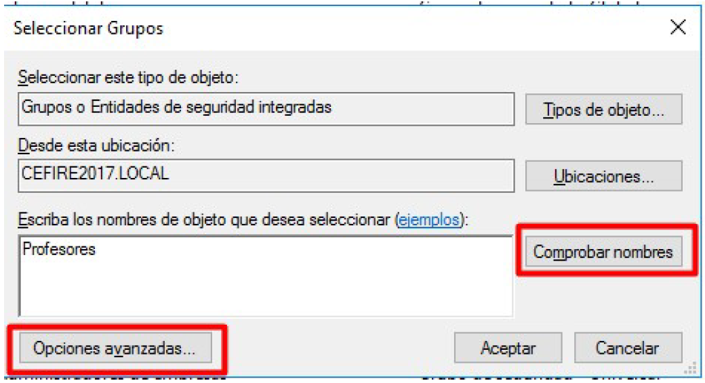
  <figcaption>Búsqueda y verificación del grupo</figcaption>
</figure>

6. Verás un mensaje de confirmación:

<figure>
  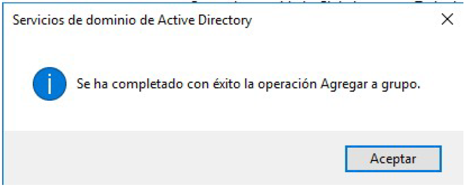
  <figcaption>Confirmación de usuario añadido al grupo</figcaption>
</figure>

7. Repite el proceso para añadir `usuario2` al grupo `Alumnos`.

#### Método 2: Desde el grupo

1. **Selecciona el grupo** `Alumnos`.
2. **Haz clic con el botón derecho** → **"Propiedades"**.
3. Ve a la pestaña **"Miembros"**.
4. **Haz clic en "Agregar"**.

<figure>
  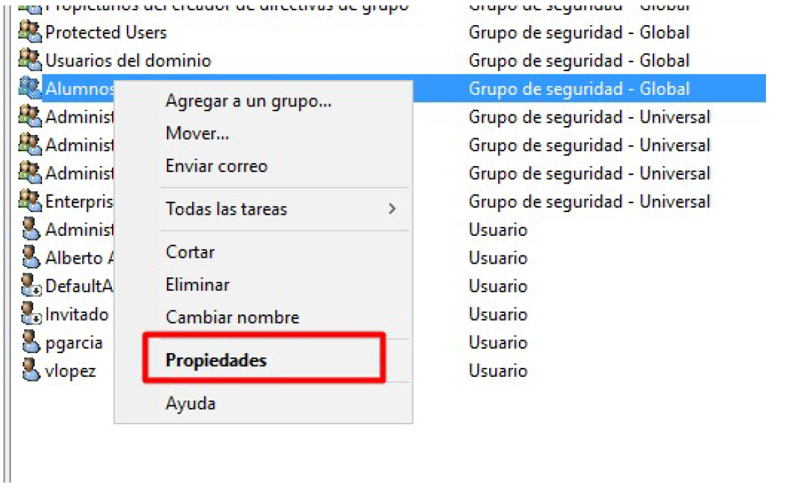
  <figcaption>Propiedades del grupo - Pestaña General</figcaption>
</figure>

<figure>
  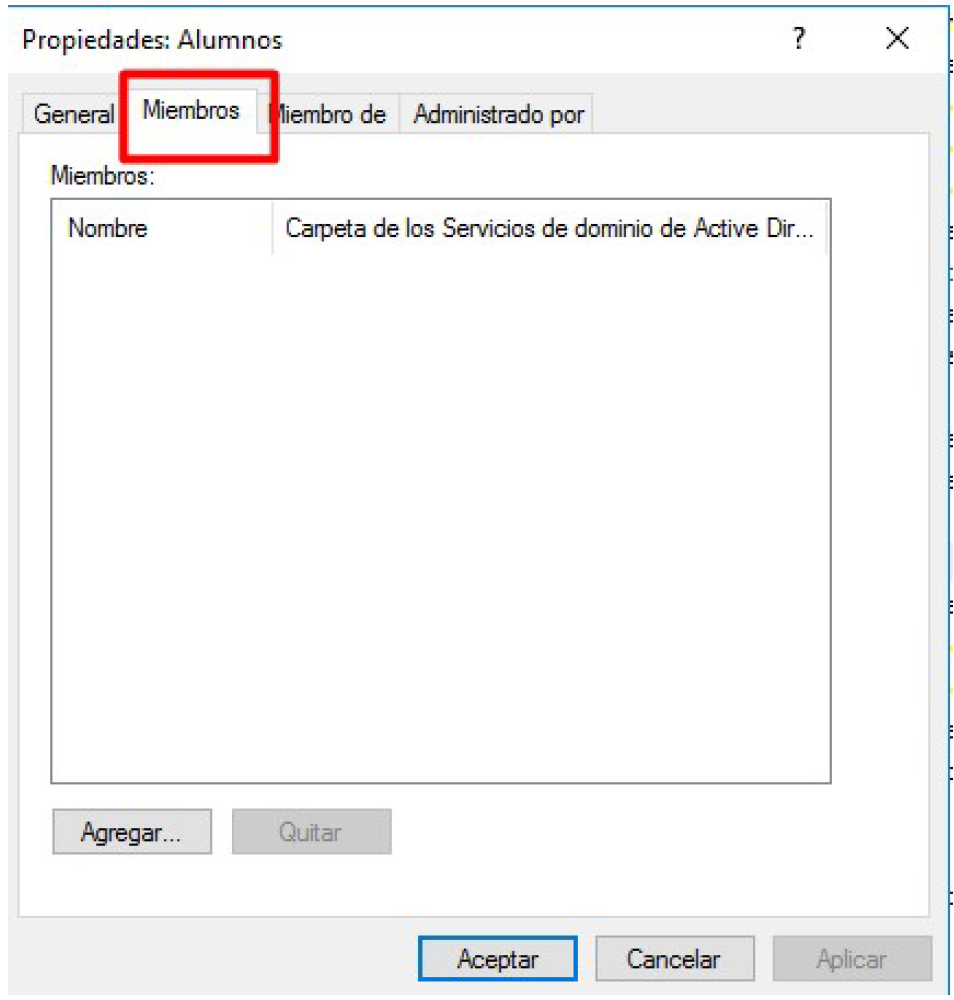
  <figcaption>Propiedades del grupo - Pestaña Miembros</figcaption>
</figure>

5. Busca y añade los usuarios que desees.
6. **Haz clic en "Aceptar"**.

## Paso 3: Deshabilitar y habilitar cuentas

### 1. Deshabilitar usuario2

1. **Selecciona el usuario** `usuario2`.
2. **Haz clic con el botón derecho** → **"Deshabilitar la cuenta"**.

<figure>
  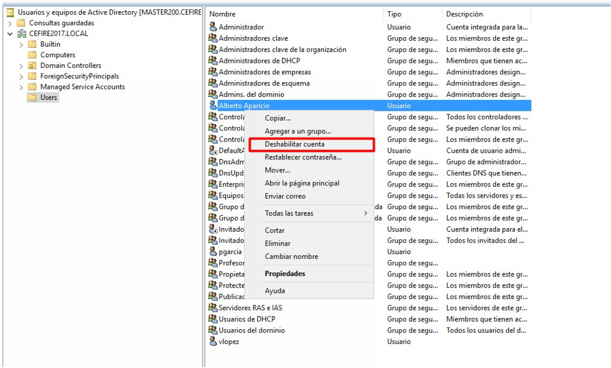
  <figcaption>Deshabilitar cuenta de usuario</figcaption>
</figure>

3. **Confirma** la acción.

### 2. Verificar que la cuenta está deshabilitada

1. **Conecta mediante RDP** al equipo cliente unido al dominio.
2. **Intenta iniciar sesión** con `usuario2` y su contraseña.
3. Deberías ver un **mensaje de error** indicando que la cuenta está deshabilitada.

!!! note "Captura de pantalla requerida"
    Debes capturar el mensaje de error que aparece al intentar iniciar sesión con una cuenta deshabilitada.

### 3. Habilitar usuario2

1. Vuelve al controlador de dominio.
2. **Selecciona el usuario** `usuario2`.
3. **Haz clic con el botón derecho** → **"Habilitar la cuenta"**.
4. **Verifica** que ahora puedes iniciar sesión con `usuario2`.

## Paso 4: Configurar restricciones de inicio de sesión

### 1. Restringir usuario1 a un equipo específico

1. En **Usuarios y equipos de Active Directory**, **selecciona el usuario** `usuario1`.
2. **Haz clic con el botón derecho** → **"Propiedades"**.
3. Ve a la pestaña **"Cuenta"**.
4. **Haz clic en "Iniciar sesión en..."**.

<figure>
  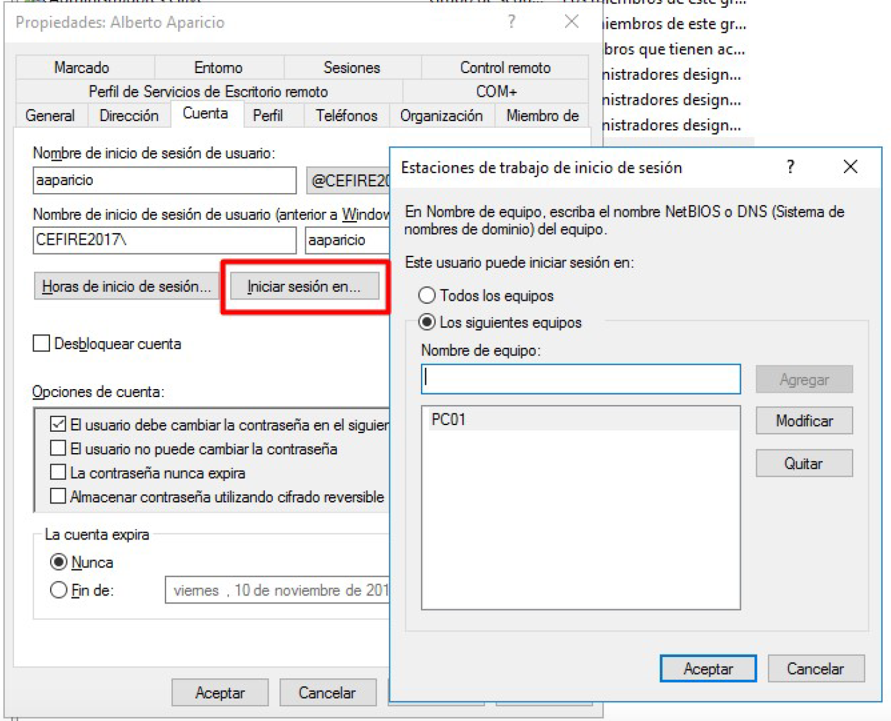
  <figcaption>Configuración de equipos permitidos para inicio de sesión</figcaption>
</figure>

5. Selecciona **"Los siguientes equipos"**.
6. **Haz clic en "Agregar"**.
7. Introduce el **nombre del equipo** (ej: `W10` o el nombre de tu equipo cliente).
8. **Haz clic en "Comprobar nombres"** y luego en **"Aceptar"**.
9. **Haz clic en "Aceptar"** para cerrar todas las ventanas.

### 2. Verificar la restricción

1. Si tienes **otro equipo cliente** unido al dominio, intenta iniciar sesión con `usuario1` desde ese equipo.
2. Deberías ver un **mensaje de error** indicando que no puedes iniciar sesión desde ese equipo.
3. **Verifica** que sí puedes iniciar sesión desde el equipo especificado.

## Paso 5: Configurar horarios de inicio de sesión

### 1. Configurar horarios para usuario2

1. **Selecciona el usuario** `usuario2`.
2. **Haz clic con el botón derecho** → **"Propiedades"**.
3. Ve a la pestaña **"Cuenta"**.
4. **Haz clic en "Horas de inicio de sesión"**.

<figure>
  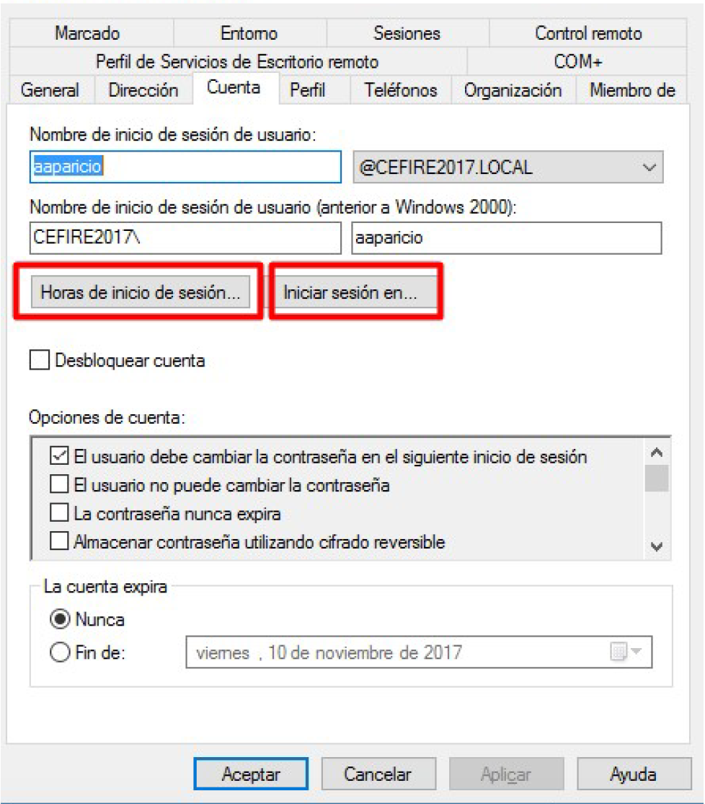
  <figcaption>Acceso a configuración de horas de inicio de sesión</figcaption>
</figure>

### 2. Configurar las restricciones horarias

1. Por defecto, todas las horas están **permitidas** (aparecen en azul).
2. **Selecciona todas las horas** de **lunes a viernes** fuera del horario de 8:00 a 18:00.
3. También selecciona **todo el fin de semana** (sábado y domingo).
4. **Marca la opción "Inicio de sesión denegado"**.

<figure>
  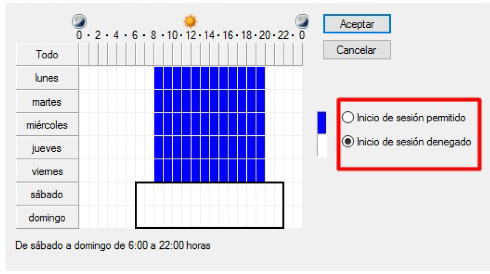
  <figcaption>Configuración de restricciones horarias</figcaption>
</figure>

5. **Haz clic en "Aceptar"** para guardar los cambios.

!!! note "Captura de pantalla requerida"
    Debes capturar la pantalla de configuración de horarios mostrando las restricciones aplicadas.

### 3. Verificar las restricciones horarias

1. **Intenta iniciar sesión** con `usuario2` fuera del horario permitido (por ejemplo, después de las 18:00 o en fin de semana).
2. Deberías ver un **mensaje de error** indicando que no puedes iniciar sesión en ese momento.

## Paso 6: Intentar iniciar sesión en el controlador de dominio

### 1. Intentar iniciar sesión con usuario2 en el DC

1. **Intenta iniciar sesión** en el controlador de dominio con `usuario2`.
2. **Observa** el resultado y el mensaje de error si aparece.

### 2. Análisis

Responde a las siguientes preguntas en tu documentación:

- ¿Por qué no puedes iniciar sesión en el controlador de dominio con `usuario2`?
- ¿Qué podrías hacer para que `usuario2` pudiera iniciar sesión en el controlador de dominio?

!!! tip "Pista"
    Revisa los grupos predefinidos y sus permisos, especialmente los grupos relacionados con el controlador de dominio.

## Referencias

- [Documentación oficial de Active Directory Users and Computers](https://docs.microsoft.com/windows-server/identity/ad-ds/manage/understand-active-directory-users-and-computers)
- [Guía de administración de usuarios en Active Directory](https://docs.microsoft.com/windows-server/identity/ad-ds/manage/understand-active-directory-users-and-computers)
- [Tipos y ámbitos de grupos en Active Directory](https://docs.microsoft.com/windows-server/identity/ad-ds/manage/understand-active-directory-groups)
- [Configuración de restricciones de inicio de sesión](https://docs.microsoft.com/windows-server/identity/ad-ds/manage/configure-user-account-properties)
