# Práctica: Acceso remoto a Windows Server en AWS Academy

## Objetivos

Durante esta práctica aprenderás a crear y configurar una instancia de **Windows Server** en **AWS Academy** y acceder a ella mediante **Escritorio Remoto (RDP)**. El objetivo es familiarizarte con la computación en la nube, la creación de máquinas virtuales en AWS y la configuración de acceso remoto mediante RDP.

Al finalizar esta práctica serás capaz de:

- Comprender los conceptos básicos de **computación en la nube** y los tipos de servicios (IaaS, PaaS, SaaS).
- Utilizar **AWS Academy** para crear y gestionar instancias de Windows Server.
- Configurar una instancia de **Windows Server 2025** en AWS EC2.
- Configurar **grupos de seguridad** para permitir el acceso RDP.
- Acceder remotamente a Windows Server mediante **RDP (Remote Desktop Protocol)**.
- Documentar el proceso completo de configuración y acceso remoto.

## Requisitos previos

Antes de comenzar, asegúrate de tener:

- **Acceso a AWS Academy** a través de Canvas o la plataforma educativa proporcionada por tu centro.
- **Cuenta de estudiante** activa en AWS Academy Learner Lab.
- **Cliente RDP** instalado en tu máquina local:
  - **Windows**: Escritorio Remoto (incluido por defecto)
  - **macOS**: Microsoft Remote Desktop (descarga desde App Store)
  - **Linux**: Remmina, Vinagre o `rdesktop`
- **Navegador web** actualizado (Chrome, Firefox, Edge, Safari).
- **Conexión a Internet** estable.

!!! note "Nota importante"
    AWS Academy Learner Lab proporciona créditos limitados y tiempo de uso restringido. Asegúrate de **detener las instancias** cuando no las uses para no consumir créditos innecesariamente.

## Tareas a realizar

1. **Configuración de AWS Academy:**

   - Accede a AWS Academy a través de Canvas.
   - Inicia el laboratorio AWS Academy Learner Lab.

2. **Creación de instancia Windows Server:**

   - Crea una instancia de Windows Server 2025 en EC2.
   - Configura el tipo de instancia, Lanzamiento y red.
   - Crea y configura un grupo de seguridad que permita RDP.

3. **Configuración de acceso remoto:**

   - Obtén la contraseña del administrador usando la clave privada.
   - Configura el cliente RDP en tu máquina local.
   - Conecta mediante RDP a la instancia de Windows Server.

4. **Verificación del acceso:**

   - Verifica que puedes acceder al escritorio de Windows Server.
   - Comprueba la conectividad de red.
   - Verifica que el escritorio remoto está habilitado.

5. **Documentación:**

   - Crea un documento que explique:
     - El proceso de creación de instancias en AWS EC2.
     - La configuración de grupos de seguridad y acceso RDP.
     - Los pasos realizados para la configuración.
     - Capturas de pantalla que demuestren el funcionamiento.
     - Problemas encontrados y soluciones aplicadas.

## Entregables

Para la entrega de esta práctica, deberás proporcionar:

1. **Documentación:**

   - Documento en Markdown con:
     - Pasos seguidos para la configuración de AWS Academy.
     - Proceso de creación de la instancia Windows Server.
     - Configuración de grupos de seguridad y acceso RDP.
     - Capturas de pantalla del proceso completo.
     - Comandos utilizados y su explicación.
     - Verificación del funcionamiento del acceso remoto.

2. **Evidencias:**

   - Las capturas de pantalla deben mostrar:
     - Acceso a AWS Academy y inicio del laboratorio.
     - Creación de la instancia Windows Server en EC2.
     - Configuración del grupo de seguridad.
     - Obtención de la contraseña del administrador.
     - Conexión RDP exitosa al escritorio de Windows Server.
     - Verificación del acceso remoto y conectividad.

## Introducción

### ¿Qué es el Cloud Computing?

El **Cloud Computing** (computación en la nube) se define como la entrega de servicios, plataformas, aplicaciones y otros procesos a través de Internet mediante un modelo de **pago por uso**.

**Beneficios de la informática en la nube:**

- **Agilidad**: Permite implementar recursos rápidamente.
- **Elasticidad**: Escala recursos según la demanda.
- **Ahorro de costos**: Solo pagas por lo que usas.
- **Implementación global**: Despliega aplicaciones a nivel mundial en minutos.

**Tipos de informática en la nube:**

- **IaaS (Infrastructure as a Service)**: Infraestructura como servicio (ej: EC2, máquinas virtuales).
- **PaaS (Platform as a Service)**: Plataforma como servicio (ej: servicios de desarrollo).
- **SaaS (Software as a Service)**: Software como servicio (ej: aplicaciones web).

### AWS Academy

**AWS Academy** es una plataforma educativa que proporciona acceso a recursos de AWS para estudiantes y educadores. A través de **AWS Academy Learner Lab**, los estudiantes pueden crear y gestionar recursos de AWS en un entorno controlado y con créditos educativos.

En esta práctica utilizaremos AWS Academy para crear una instancia de Windows Server 2025 y acceder a ella mediante RDP.

### Escritorio Remoto (RDP)

**RDP (Remote Desktop Protocol)** es un protocolo propietario desarrollado por Microsoft que permite el acceso remoto a escritorios y aplicaciones en sistemas Windows. Utiliza el **puerto 3389** por defecto y proporciona una experiencia de escritorio remoto completa.

## Paso 0: Acceso a AWS Academy

### 1. Registro en AWS Academy

Si has recibido una invitación por correo electrónico para participar en una clase de AWS Academy:

1. **Abre el correo electrónico** de invitación de AWS Academy.
2. **Haz clic en el enlace** para registrarte en Canvas (si no tienes cuenta) o inicia sesión si ya tienes una.
3. **Completa el registro** proporcionando:

   - Login (nombre de usuario)
   - Password (contraseña)
   - Time Zone (zona horaria, por ejemplo: Madrid +01:00/+02:00)

<figure>
  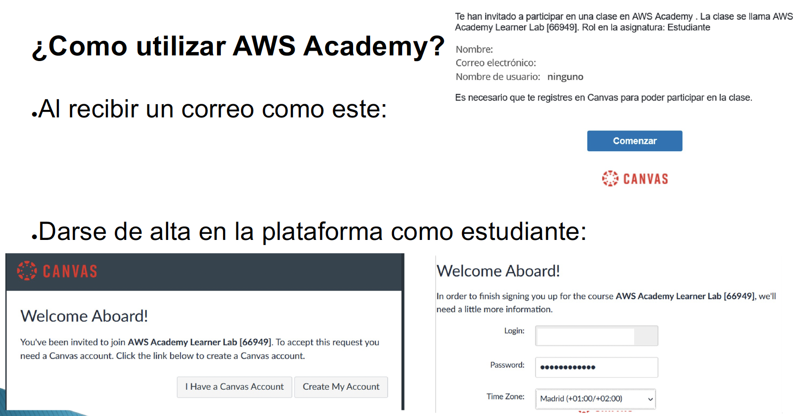
  <figcaption>Registro en Canvas para AWS Academy</figcaption>
</figure>

### 2. Acceso al laboratorio

Una vez registrado:

1. **Accede a Canvas** y entra en el curso "AWS Academy Learner Lab".
2. **Navega a Contenidos** y busca el módulo "Lanzamiento del Laboratorio para el alumnado de AWS Academy".
3. **Haz clic en "Lanzamiento del Laboratorio"**.

<figure>
  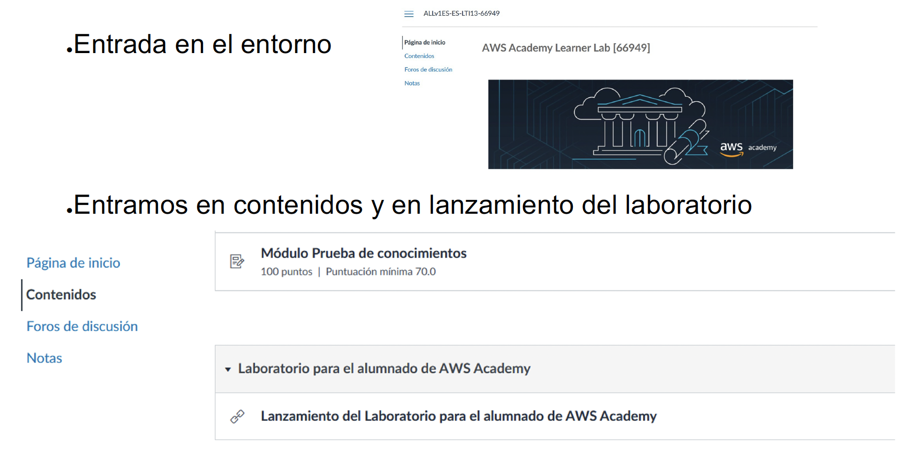
  <figcaption>Acceso al laboratorio desde Canvas</figcaption>
</figure>

### 3. Iniciar el laboratorio

1. **Acepta las condiciones** del laboratorio si aparece algún aviso.
2. **Haz clic en "Start Lab"** para iniciar el laboratorio.
3. **Espera a que el estado cambie a verde** (normalmente tarda 1-2 minutos).
4. **Haz clic en "AWS"** para acceder a la consola de AWS.

<figure>
  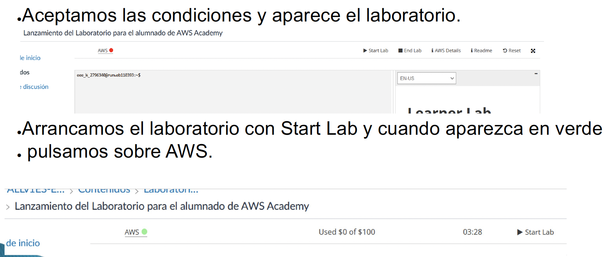
  <figcaption>Inicio del laboratorio AWS Academy</figcaption>
</figure>

!!! warning "Importante"
    El laboratorio tiene un tiempo limitado (normalmente 4 horas). Cuando termine, deberás iniciarlo de nuevo. Los recursos creados se eliminarán automáticamente al finalizar el laboratorio.

## Paso 1: Crear una instancia de Windows Server

### 1. Acceder a EC2

Una vez en la consola de AWS:

1. **Busca "EC2"** en la barra de búsqueda de servicios.
2. **Haz clic en "EC2"** para acceder al servicio de Elastic Compute Cloud.

<figure>
  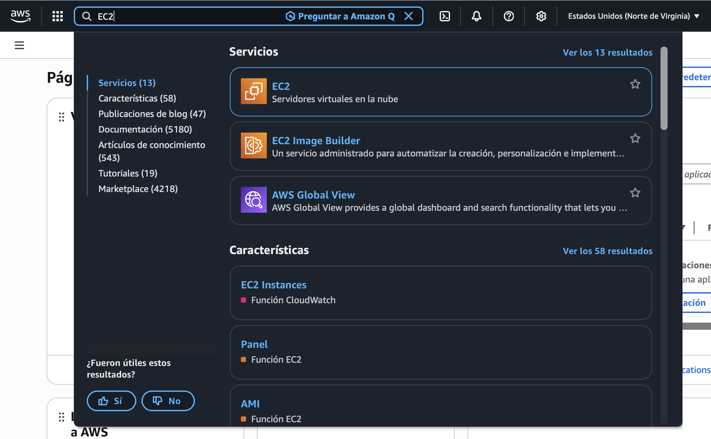
  <figcaption>Búsqueda del servicio EC2 en AWS</figcaption>
</figure>

### 2. Lanzar una instancia

1. En el panel de EC2, **haz clic en "Instancias"** en el menú lateral.
2. **Haz clic en "Lanzar instancia"** (Launch instance).

<figure>
  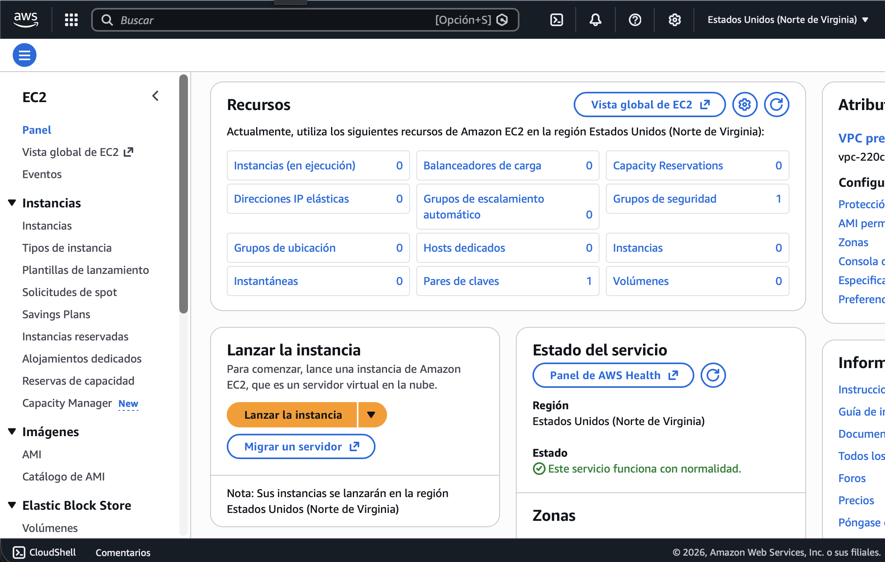
  <figcaption>Lanzar instancia en el servicio EC2 en AWS</figcaption>
</figure>

### 3. Configurar la instancia

Sigue estos pasos para configurar la instancia:

#### 3.1. Nombre de la instancia

1. En el campo **"Nombre"**, introduce un nombre descriptivo, por ejemplo: `Servidor Windows 2025`.

#### 3.2. Seleccionar la AMI (Imagen)

1. En **"Imagen de aplicación y sistema operativo (AMI)"**, busca y selecciona **"Windows Server 2025 Base"**.

<figure>
  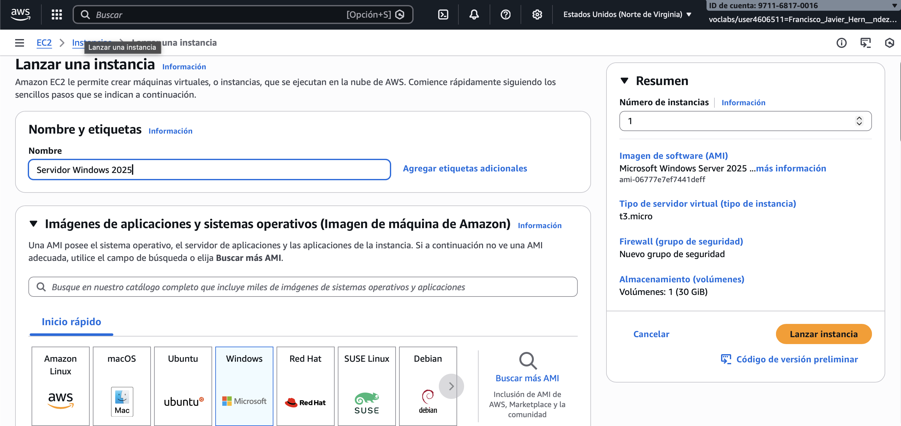
  <figcaption>Nombre de la instancia y Selección del OS</figcaption>
</figure>


#### 3.3. Tipo de instancia

1. En **"Tipo de instancia"**, selecciona **t3.large**:

   - **2 vCPU**
   - **8 GiB de memoria RAM**
   - Adecuado para prácticas y pruebas
<!-- 
<figure>
  
  <figcaption>Lanzamiento de una nueva instancia EC2</figcaption>
</figure> -->

!!! note "Nota sobre tipos de instancia"
    - **t3.micro**: 1 vCPU, 1 GiB RAM - Gratis en plan gratuito, pero puede ser lento para Windows Server.
    - **t3.small**: 1 vCPU, 2 GiB RAM - Mínimo recomendado para Windows Server.
    - **t3.medium**: 2 vCPU, 4 GiB RAM - Adecuado para pruebas básicas.
    - **t3.large**: 2 vCPU, 8 GiB RAM - Recomendado para prácticas (el que usaremos).

#### 3.4. Par de claves

1. En **"Par de claves (inicio de sesión)"**, selecciona un par de claves existente o crea uno nuevo.
2. Si usas la clave por defecto **"vockey"**, puedes utilizarla.
3. Si prefieres crear una nueva:

   - **Haz clic en "Crear un nuevo par de claves"**
   - Introduce un nombre (ej: `estudiante2`)
   - **Descarga la clave privada** (.pem) y guárdala en un lugar seguro

<figure>
  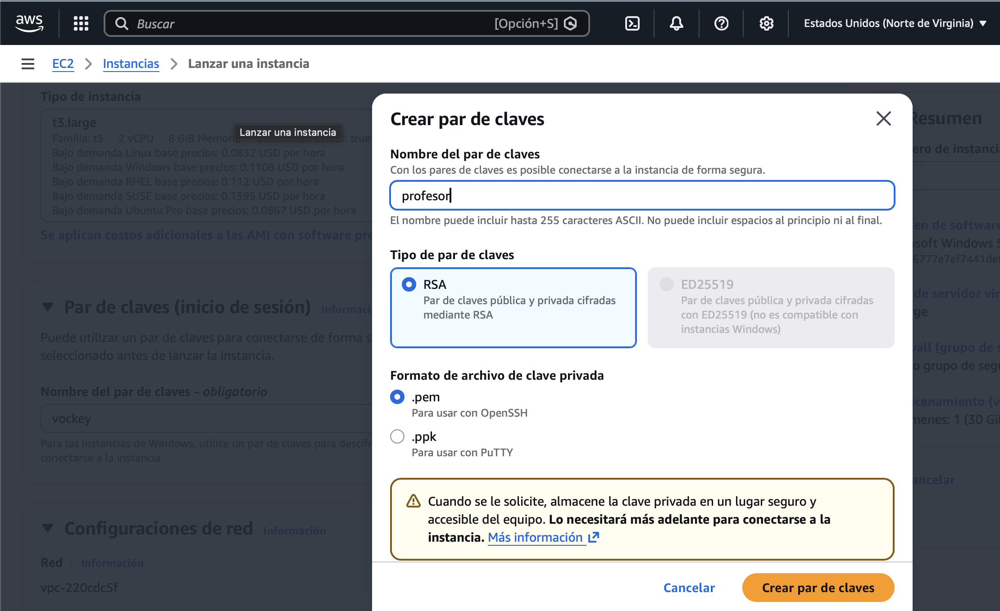
  <figcaption>Configuración del par de claves SSH</figcaption>
</figure>

!!! warning "Importante para Windows"
    Para instancias de Windows, el par de claves se utiliza para **descifrar la contraseña del administrador**. Necesitarás la clave privada (.pem) para obtener la contraseña inicial de Windows.

#### 3.5. Configuración de red

1. **Haz clic en "Editar"** en la sección "Configuraciones de red".
2. En **"Subred"**, selecciona una subred disponible (por ejemplo, la primera de la lista).
3. Asegúrate de que **"Asignar dirección IP pública"** esté habilitado.

#### 3.6. Grupo de seguridad

1. En **"Grupo de seguridad"**, crea un nuevo grupo de seguridad:

   - **Nombre**: `SeguridadServidor` (o el que prefieras)
   - **Descripción**: "Grupo de seguridad para servidor Windows con RDP"

2. **Añade reglas de entrada**:

   - **RDP (3389)**: Permite el acceso desde tu IP o desde cualquier lugar (0.0.0.0/0) para pruebas.
   - **Permitir tráfico desde la red privada**: Añade una regla que permita el acceso entrante desde el rango de IPs de tu red privada (por ejemplo, `10.0.0.0/16` o el bloque CIDR que utiliza tu VPC/AWS).

!!! tip "Mejores prácticas de seguridad"
    En producción, **nunca** deberías permitir RDP desde `0.0.0.0/0` (cualquier IP). En su lugar:

    - Permite RDP solo desde tu IP específica.
    - O utiliza una VPN o bastion host.
    - Para prácticas educativas, puedes usar `0.0.0.0/0` temporalmente.

<figure>
  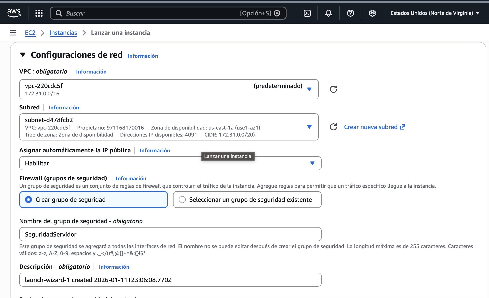
  <figcaption>Configuración de red, subred y grupo de seguridad.</figcaption>
</figure>

#### 3.7. Almacenamiento

1. En **"Configurar Almacenamiento"**, configura:

   - **Tamaño**: 40 GiB (mínimo recomendado para Windows Server)
   - **Tipo de volumen**: gp3 (SSD de propósito general)

<figure>
  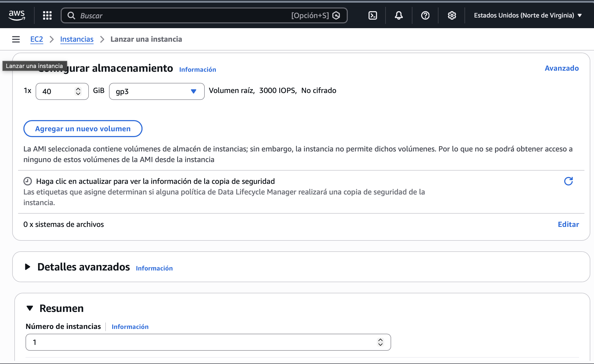
  <figcaption>Configuración del grupo de seguridad</figcaption>
</figure>

### 4. Lanzar la instancia

1. **Revisa la configuración** en el resumen a la derecha.
2. **Haz clic en "Lanzar instancia"** (Launch instance).

<figure>
  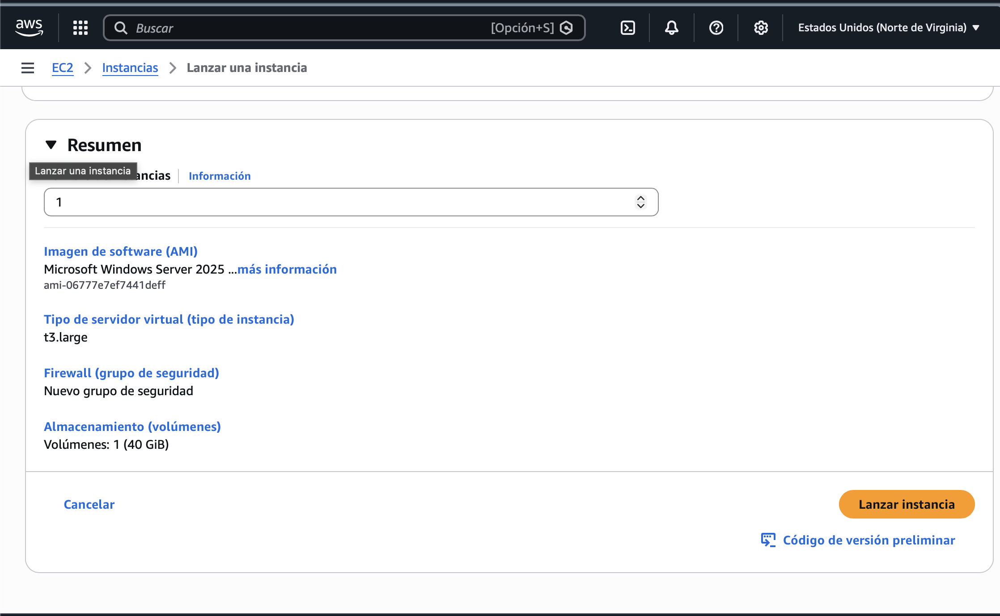
  <figcaption>Configuración de Lanzamiento</figcaption>
</figure>

3. Verás un mensaje de confirmación: **"El lanzamiento de la instancia se inició correctamente"**.
4. **Haz clic en "Ver todas las instancias"** para ver el estado de tu instancia.

<figure>
  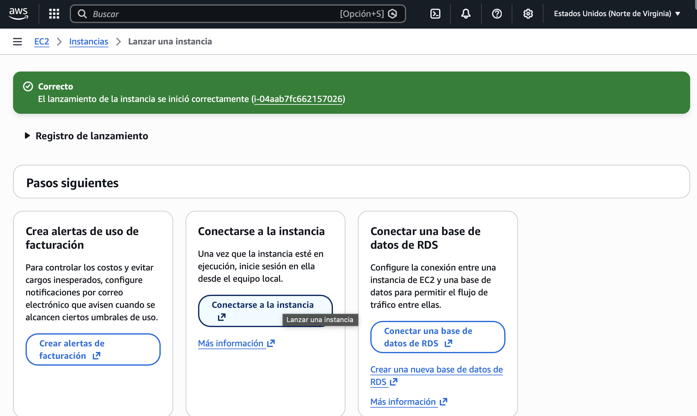
  <figcaption>Comprobación del estado de la instancia tras el lanzamiento</figcaption>
</figure>


## Paso 2: Obtener la contraseña de Windows

### 1. Esperar a que la instancia esté en ejecución

1. En la lista de instancias, espera a que el **"Estado de la instancia"** cambie a **"En ejecución"** (Running).
2. Esto puede tardar 2-5 minutos.
<figure>
  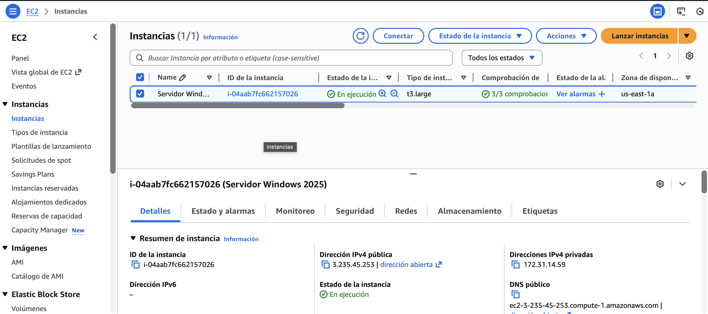
  <figcaption>Vista del panel de instancias en AWS EC2 mostrando una instancia de Windows Server lanzada y corriendo. </figcaption>
</figure>


### 2. Obtener la contraseña del administrador

1. **Selecciona la instancia** haciendo clic en la casilla de verificación.
2. **Haz clic en "Conectar"** (Connect) en la parte superior.
3. En la pestaña **"RDP client"**, verás las instrucciones para obtener la contraseña.
4. **Haz clic en "Obtener contraseña"** (Get password).
5. **Sube el archivo de clave privada** (.pem) que descargaste al crear el par de claves.
6. **Haz clic en "Descifrar contraseña"** (Decrypt password).
7. **Copia la contraseña** y guárdala en un lugar seguro. También anota el **nombre de usuario** (normalmente `Administrator`).

!!! warning "Importante"
    La contraseña solo se muestra una vez. Si la pierdes, tendrás que crear una nueva instancia o restablecer la contraseña.

<figure>
  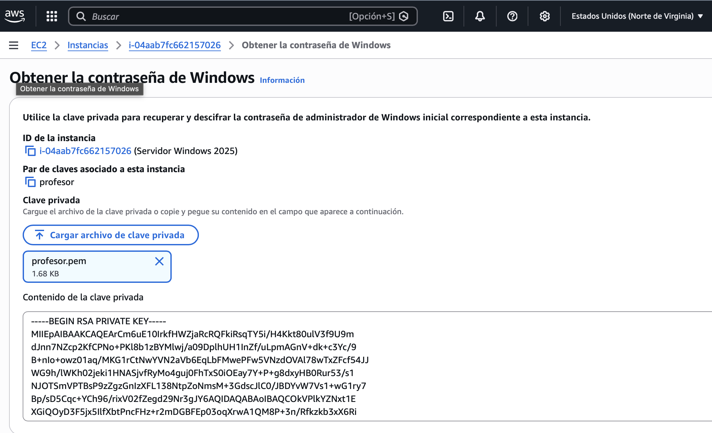
  <figcaption>Opciones de conexión a la instancia</figcaption>
</figure>

<!-- <figure>
  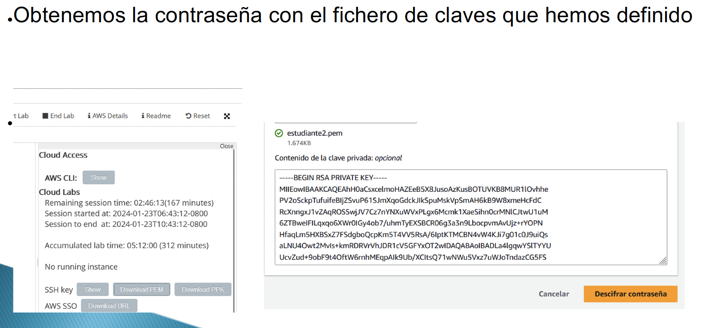
  <figcaption>Obtención de la contraseña del administrador</figcaption>
</figure> -->


## Paso 3: Conectar mediante RDP

### 1. Obtener archivo de escritorio remoto

1. En la lista de instancias, **selecciona tu instancia**.
2. Haz clic en el botón **"Conectar"** en la parte superior.
3. En la pestaña **"Cliente RDP"**, haz clic en **"Descargar archivo de escritorio remoto"**.
4. Se descargará un archivo `.rdp` preconfigurado con la IP pública y los datos de conexión.
5. Haz doble clic en el archivo descargado para abrirlo con la aplicación de Escritorio Remoto.
6. Cuando se solicite, introduce el usuario (`Administrator`) y la contraseña obtenida en el paso anterior.

<figure>
  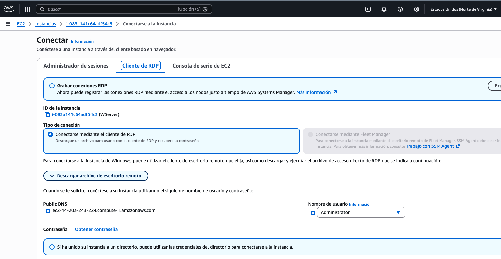
  <figcaption>Descarga el archivo .rdp y verifica que la IP pública sea la correcta para conectar por RDP.</figcaption>
</figure>

!!! warning "Importante"
    El archivo `.rdp` **deberá descargarse de nuevo cada vez que cambie la IP pública de la instancia**. Si la instancia se detiene y arranca nuevamente, la IP pública puede variar, por lo que el archivo anterior dejará de funcionar.

<!-- <figure>
  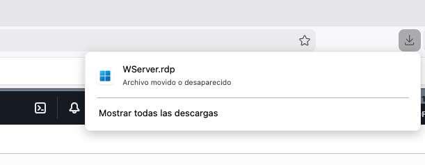
  <figcaption>Pantalla mostrando el archivo .rdp descargado listo para ejecutar la conexión mediante Escritorio Remoto.</figcaption>
</figure> -->


### 2. Conectar desde Windows

Si estás en un equipo **Windows**:

1. **Abre "Escritorio Remoto"**:

   - Presiona `Windows + R`
   - Escribe `mstsc` y presiona Enter
   - O busca "Escritorio Remoto" en el menú Inicio

2. **Introduce la IP pública** de la instancia.

3. **Haz clic en "Conectar"**.

4. Cuando se solicite:

   - **Usuario**: `Administrator`
   - **Contraseña**: La contraseña que obtuviste en el Paso 2

5. **Acepta la advertencia** de certificado si aparece.

<!-- <figure>
  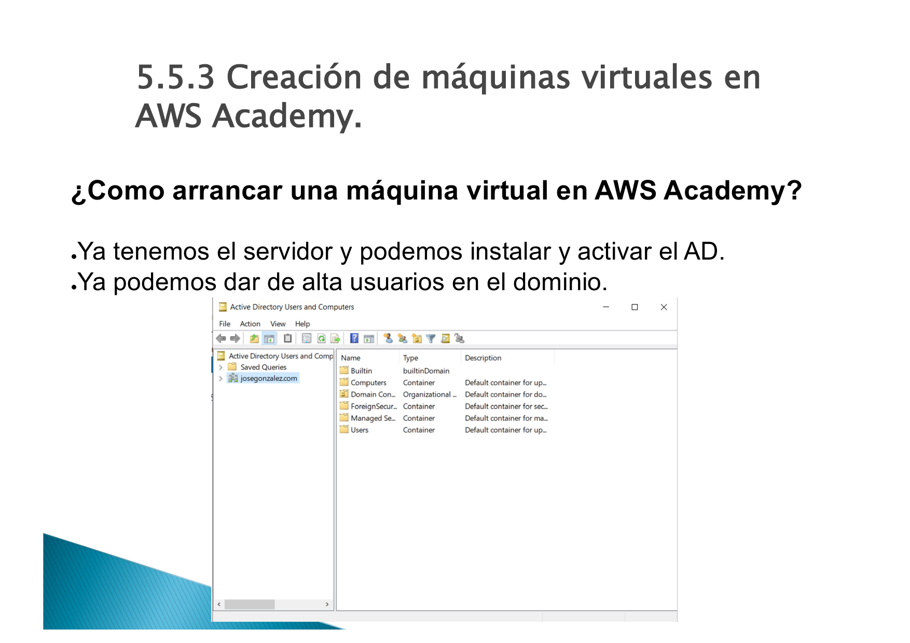
  <figcaption>Conexión RDP desde Windows</figcaption>
</figure> -->

### 3. Conectar desde macOS

Si estás en un equipo **macOS**:

1. **Descarga Microsoft Remote Desktop** desde la App Store (gratis).

2. **Abre Microsoft Remote Desktop**.

3. **Haz clic en "Add PC"** o el botón "+".

4. **Configura la conexión**:

   - **PC name**: La IP pública de la instancia
   - **User account**: `Administrator`
   - **Password**: La contraseña obtenida

5. **Haz doble clic** en la conexión para conectarte.

<!-- <figure>
  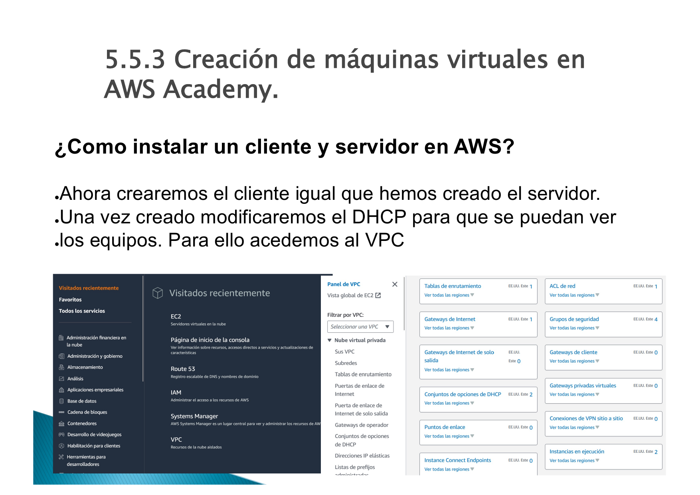
  <figcaption>Conexión RDP desde macOS con Microsoft Remote Desktop</figcaption>
</figure> -->

### 4. Conectar desde Linux

Si estás en un equipo **Linux**:

**Opción A: Usando Remmina (GUI)**

```bash
# Instalar Remmina
sudo apt update
sudo apt install remmina remmina-plugin-rdp -y

# Abrir Remmina
remmina
```

1. **Haz clic en el botón "+"** para crear una nueva conexión.
2. **Configura**:

   - **Protocol**: RDP
   - **Server**: IP pública de la instancia
   - **Username**: `Administrator`
   - **Password**: La contraseña obtenida
3. **Guarda y conecta**.

**Opción B: Usando rdesktop (línea de comandos)**

```bash
# Instalar rdesktop
sudo apt install rdesktop -y

# Conectar
rdesktop -u Administrator -p 'TU_CONTRASEÑA' IP_PUBLICA
```

## Paso 4: Verificar el acceso remoto

Una vez conectado mediante RDP, deberías ver el escritorio de Windows Server 2025.

### Verificaciones básicas

1. **Verifica que estás conectado**:

   - Deberías ver el escritorio de Windows Server 2025.
   - El usuario debería ser `Administrator`.

2. **Verifica la conectividad de red**:

   - Abre el **Símbolo del sistema** (CMD) o **PowerShell**.
   - Ejecuta `ipconfig` para ver la configuración de red.
   - Ejecuta `ping 8.8.8.8` para verificar conectividad a Internet.

<!-- <figure>
  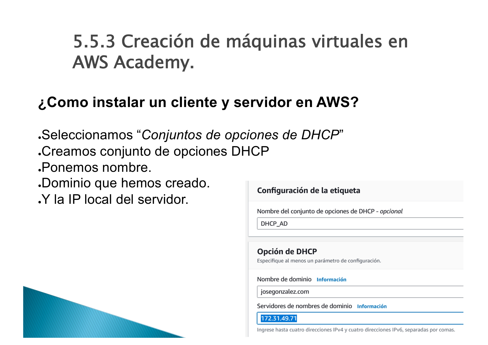
  <figcaption>Escritorio de Windows Server 2025 accesible mediante RDP</figcaption>
</figure> -->

3. **Verifica el acceso remoto**:
   - Abre **"Configuración"** → **"Sistema"** → **"Escritorio remoto"**.
   - Verifica que el escritorio remoto esté habilitado.

## Paso 5: Detener y terminar instancias

### Detener una instancia (para ahorrar créditos)

Cuando no uses la instancia, puedes **detenerla** (no eliminarla):

1. **Selecciona la instancia** en la consola de EC2.
2. **Haz clic en "Detener instancia"** (Stop instance).
3. La instancia se detendrá pero **no se eliminará**.
4. Puedes **reiniciarla** más tarde con "Iniciar instancia" (Start instance).

!!! note "Nota importante"
    - **Detener** una instancia: No consume créditos de computación, pero sí de Lanzamiento (EBS).
    - **Terminar** una instancia: Elimina la instancia y todos sus datos. No se puede recuperar.

### Terminar una instancia (eliminar permanentemente)

Si quieres **eliminar permanentemente** la instancia:

1. **Selecciona la instancia**.
2. **Haz clic en "Terminar instancia"** (Terminate instance).
3. **Confirma** la eliminación.

!!! warning "Advertencia"
    Al terminar una instancia, **se eliminan todos los datos** y **no se puede recuperar**. Asegúrate de haber guardado todo lo importante antes de terminar.

---

## Referencias

- [Documentación oficial de AWS EC2](https://docs.aws.amazon.com/ec2/)
- [Guía de AWS Academy](https://awsacademy.instructure.com/)
- [Documentación de Windows Server](https://docs.microsoft.com/windows-server/)
- [Guía de Remote Desktop Protocol (RDP)](https://docs.microsoft.com/windows-server/remote/remote-desktop-services/clients/remote-desktop-clients)
