# Práctica 12 RemoteApp y Escritorio Remoto

Para esta práctica vamos a instalar un servidor miembro dentro del dominio realizado en el tema2 para Active Directory y este servidor será el equipo donde instalaremos los servicios de **RemoteApp** y de Terminal Server. 

Para poner en marcha el servicio **RemoteAPP**, es necesario configurar el servidor Terminal Services lo que está completamente desaconsejado en un controlador de dominio. El motivo de esta separación física entre el controlador de dominio y el servidor de aplicaciones reside en que:

1. Los usuarios del dominio deben poder iniciar sesión en el servidor de aplicaciones para poder ponerlas en marcha, lo cual está completamente desaconsejado en el controlador de domino, ya que en este último se gestionan aspectos de seguridad y autenticación, demasiado sensibles como para permitir a cualquier usuario del dominio iniciar sesión en él.
2. El  consumo  de  recursos  que  provoca  la  ejecución  remota  de  las  aplicaciones  puede  entorpecer  el  correcto funcionamiento del controlador de dominio: recordad que este puede tener numerosos servicios ejecutándose (AD, DNS, DHCP, servidor de impresión, VPN, etc.)

De esta manera, el esquema de red propuesto, sería como el de la siguiente figura, donde un equipo servidor realiza las tareas de controlador de dominio, y otro equipo servidor realiza las tareas de servidor de aplicaciones:

<figure>
  
  <figcaption>Estructura de red propuesta</figcaption>
</figure>

## Instalación y validación en el dominio del Servidor de Aplicaciones

Crearemos otra máquina virtual con otro sistema Windows 2019 Server y validaremos esta máquina en el dominio CEFIRE2019.LOCAL (o el dominio utilizado en la práctica `Instalación Active Directory I` en el tema 2.3):

<figure>
  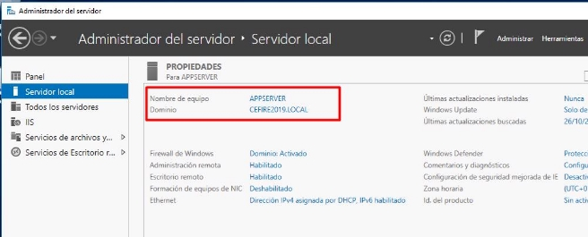
  <figcaption>Instalación y validación de un servidor miembro</figcaption>
</figure>

Si ahora accedemos al controlador de dominio, vemos que en Usuarios y Equipos de Active Directory, en la sección de Computers habrá añadido el nuevo servidor miembro: 

<figure>
  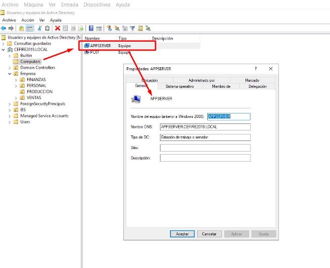
  <figcaption>AppServer validado en dominio</figcaption>
</figure>

## Instalación de RemoteApp y Servicios de Escritorio Remoto

### Instalación de RemoteApp

Para instalar **RemoteApp**, vamos a iniciar sesión como Administrador del dominio en el servidor miembro que hemos instalado, en nuestro `APPSERVER`. Desde el Panel del Administrador haremos clic en Agregar Roles y Características:

<figure>
  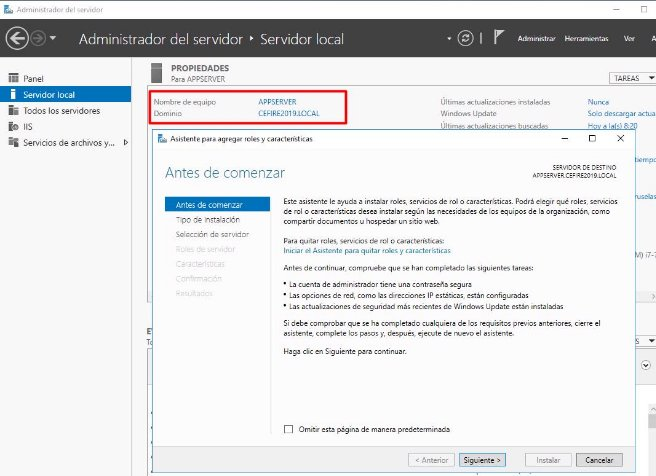
  <figcaption>Agregar roles y características en APPSERVER</figcaption>
</figure>

- Después seleccionaremos el tipo de instalación de Servicios de **Escritorio Remoto**:

<figure>
  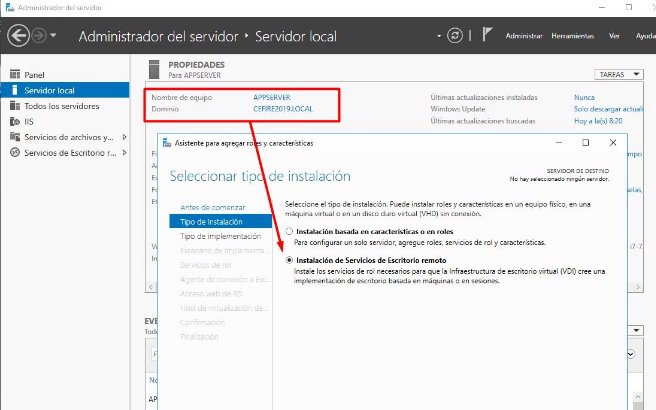
  <figcaption>Instalación de Servicios de Escritorio Remoto</figcaption>
</figure>

- Después seleccionaremos la implementación de **Servicios de Escritorio Remoto**, en nuestro caso, seleccionaremos la opción de `Inicio Rápido` que para la publicación de aplicaciones RemoteApp es suficiente.

<figure>
  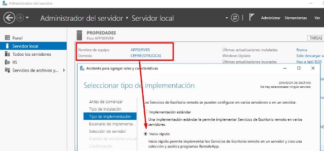
  <figcaption>Selección del tipo de implementación</figcaption>
</figure>

- Seleccionada la opción de `Inicio Rápido`, seleccionaremos la implementación de escritorio basado en sesión, para que los clientes puedan acceder a los programas que luego publicaremos en RemoteApp:

<figure>
  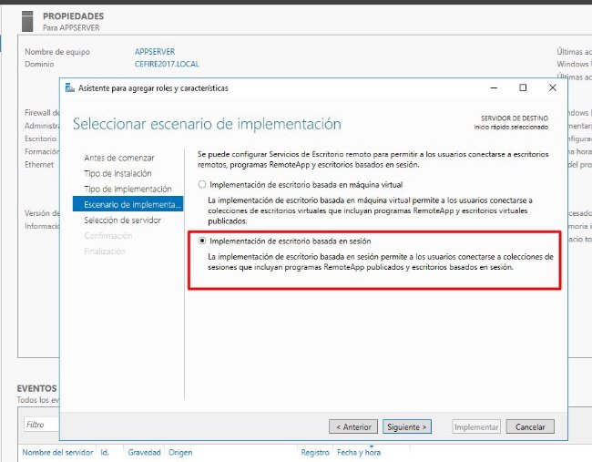
  <figcaption>Implementación basada en sesión</figcaption>
</figure>

- Seleccionaremos nuestro servidor para que inicie el agente de **RemoteApp**: 

<figure>
  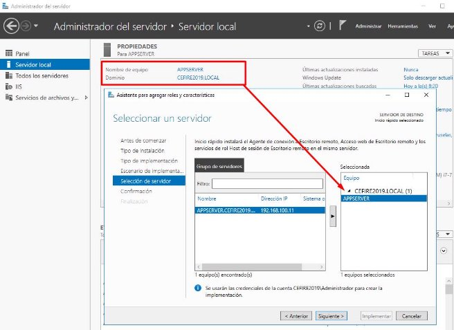
  <figcaption>Seleccionamos APPSERVER</figcaption>
</figure>

- Y por último hacemos clic en Implementar:

<figure>
  
  <figcaption>Realizar la instalación</figcaption>
</figure>

<figure>
  
  <figcaption>Proceso de instalación</figcaption>
</figure>

- El proceso reiniciará y finalmente tendremos los `Servicios de Escritorio Remoto` instalado en el panel del administrador: 

<figure>
  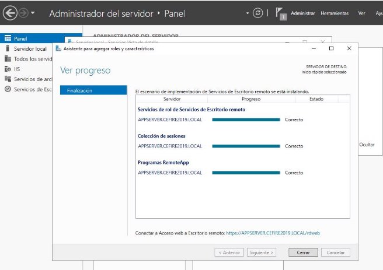
  <figcaption>Proceso de instalación II</figcaption>
</figure>

<figure>
  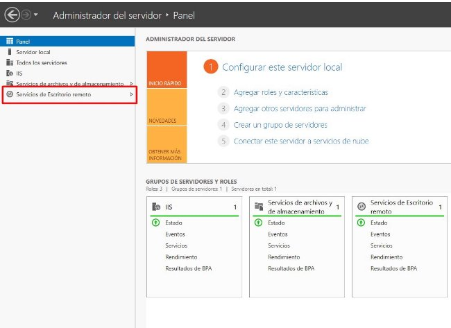
  <figcaption>Servicios de Escritorio Remoto</figcaption>
</figure>

## Publicar programas en RemoteApp

Ahora que ya hemos finalizado la instalación del `RemoteApp y Escritorio Remoto`, ya podemos configurar y poner en marcha el servidor de aplicaciones. Para ello, accederemos al Panel del Administrador:

<figure>
  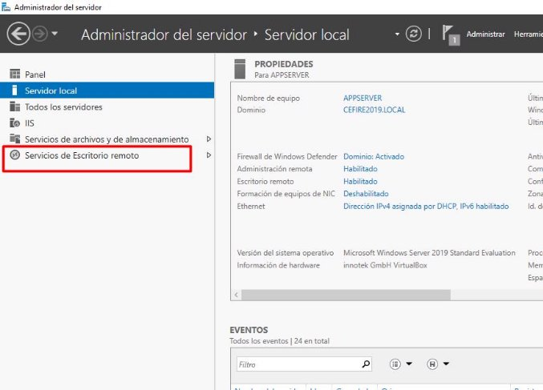
  <figcaption>Acceso a RemoteApp</figcaption>
</figure>

- En la siguiente figura vemos la pantalla principal donde podemos publicar los programas que estarán disponibles en nuestro servidor de aplicaciones.

<figure>
  
  <figcaption>Servicios de escritorio remoto</figcaption>
</figure>

- Desde la página principal podemos acceder a la colección que hemos creado tras la instalación. Esta es la implementación más básica que se puede realizar sobre un servidor de aplicaciones. 
- Se podría tener más servidores y configurarlos para que repartiera cargas en función de las aplicaciones y de los usuarios conectados, pero esto ya entraría a formar parte de aspectos más avanzados. Accedemos pues la pantalla principal:

<figure>
  
  <figcaption>Pantalla principal servicios de Escritorio Remoto</figcaption>
</figure>

- Como vemos los programas que se publican por defecto son la Calculadora, Paint y WordPad. Veremos más adelante cómo podemos agregar y organizar los programas que queremos publicar.

## Conexión al acceso Web del Escritorio Remoto

- Desde la sesión del administrador podemos iniciar sesión a través de un navegador a la dirección <https://appserver/rdweb>. Nos mostrará unos avisos de que hay un problema con el certificado ya que no lo puede comprobar. Pasaremos por alto esta advertencia y accederemos a la pantalla de login del RDWeb. Iniciaremos sesión con el Administrador.

<figure>
  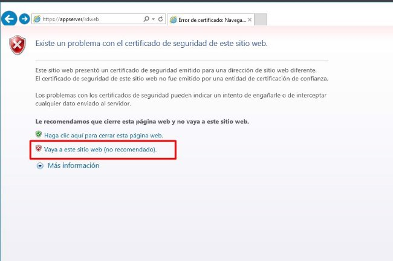
  <figcaption>Acceso web a RemoteApp</figcaption>
</figure>

<figure>
  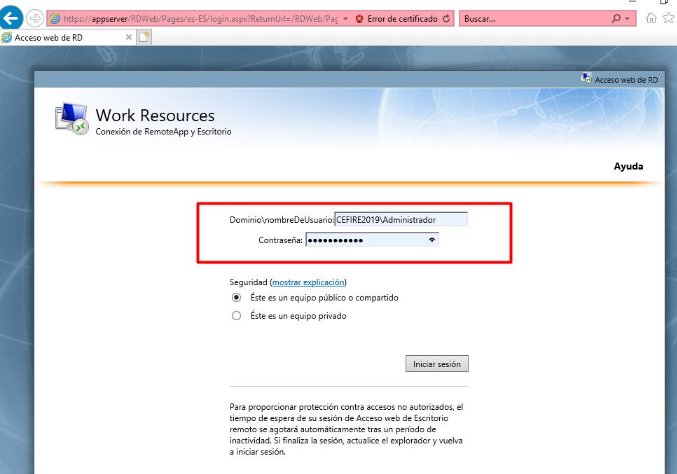
  <figcaption>Pantalla de login de RDWeb</figcaption>
</figure>

- Al iniciar sesión podemos ver las aplicaciones publicadas por defecto:

<figure>
  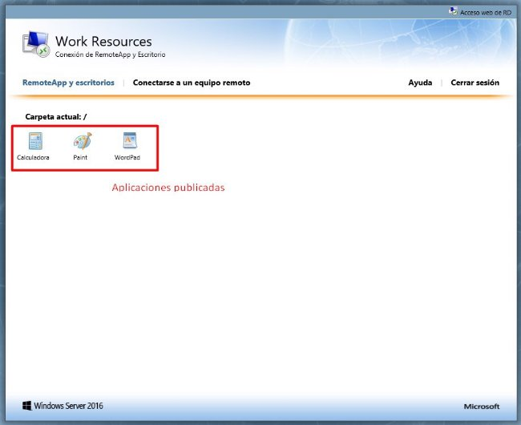
  <figcaption>Aplicaciones publicadas</figcaption>
</figure>

- Podemos iniciar cualquier aplicación publicada, por ejemplo, seleccionamos WordPad y esta aplicación se ejecutará en el servidor APPSERVER:

<figure>
  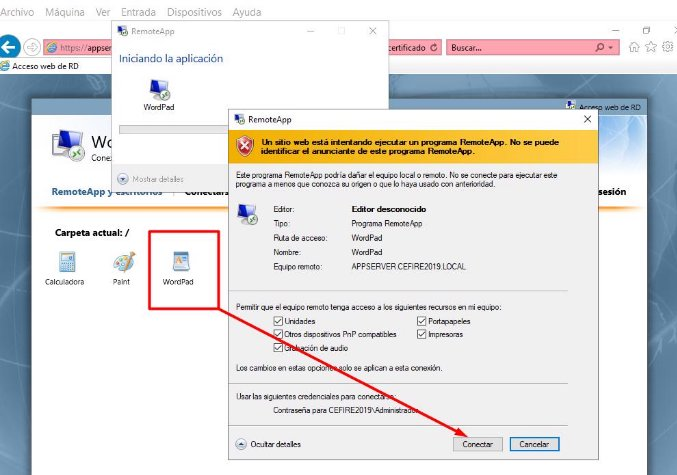
  <figcaption>Iniciar una aplicación publicada</figcaption>
</figure>

<figure>
  
  <figcaption>Iniciar WordPad</figcaption>
</figure>

- Desde la sesión de Administrador también podemos iniciar escritorio remoto:

<figure>
  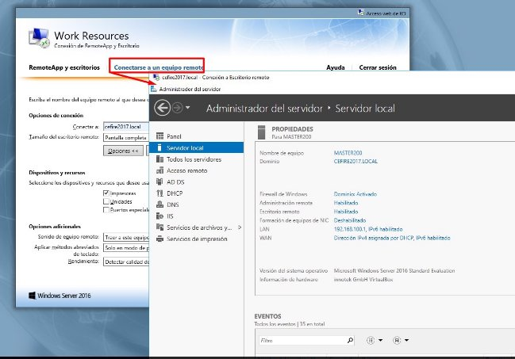
  <figcaption>Acceso remoto web</figcaption>
</figure>

## Publicar programas

Podemos también añadir más programas para publicar en nuestro servidor de aplicaciones. Por ejemplo, vamos a descargar en nuestro servidor el LibreOffice y vamos a agregar la suite LibreOffice a RemoteApp. Para ello descargaremos primero la suite LibreOffice:

<figure>
  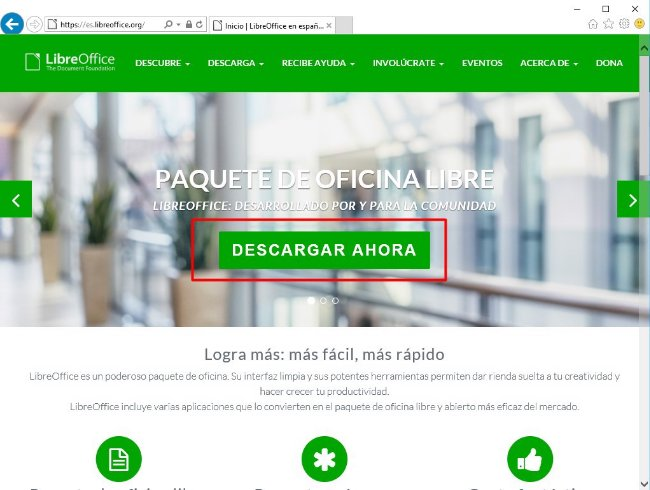
  <figcaption>Descarga LibreOffice</figcaption>
</figure>

<figure>
  
  <figcaption>Instalación de LibreOffice</figcaption>
</figure>

<figure>
  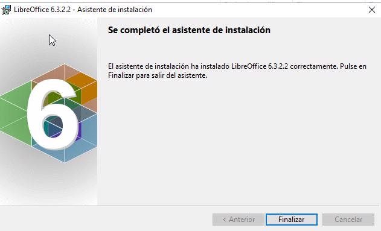
  <figcaption>Instalación de LibreOffice II</figcaption>
</figure>

- Ahora vamos a publicar la suite del LibreOffice para que esté disponible en nuestro servidor de aplicaciones. Para ello accederemos a Pogramas `RemoteApp -> Tareas y Publicar Progrmas RemoteApp`:

<figure>
  
  <figcaption>Publicar programas</figcaption>
</figure>

- Nos aparecerá la lista de programas disponibles para poder publicar. Seleccionaremos la suite LibreOffice:

<figure>
  
  <figcaption>Selección de programas para publicar</figcaption>
</figure>

- Una vez seleccionados, pasamos a la siguiente pantalla del asistente y los publicamos:

<figure>
  
  <figcaption>Publicar programas</figcaption>
</figure>

<figure>
  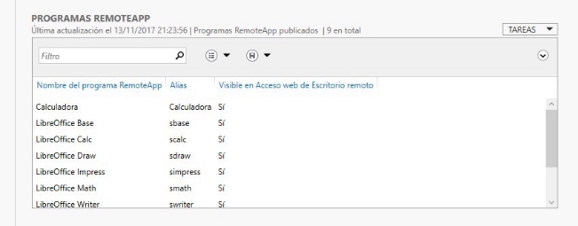
  <figcaption>Programas publicados</figcaption>
</figure>

## Iniciar sesión en RemoteApp

Una vez publicados los programas, podemos iniciar sesión en una máquina cliente y comprobar realmente qué programas están disponibles. En nuestro caso vamos a iniciar una sesión con el usuario usucomp1 y comprobaremos qué programas están publicados:

<figure>
  
  <figcaption>Inicio sesión RDWeb máquina cliente</figcaption>
</figure>

<figure>
  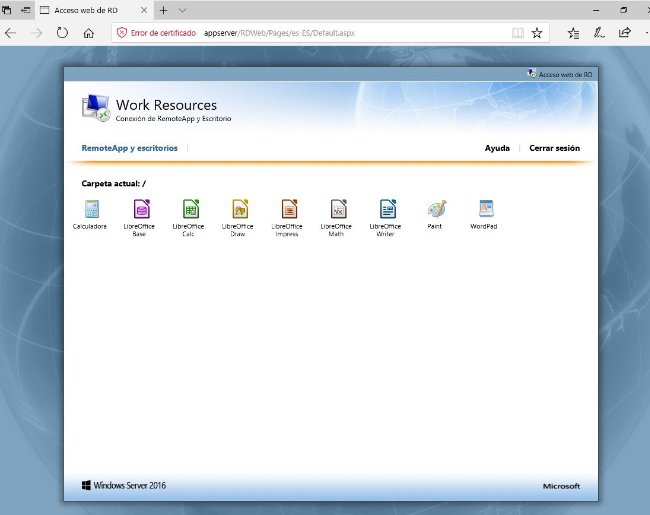
  <figcaption>Programas publicados RemoteApp</figcaption>
</figure>

- Ahora, podemos iniciar el Writer:

<figure>
  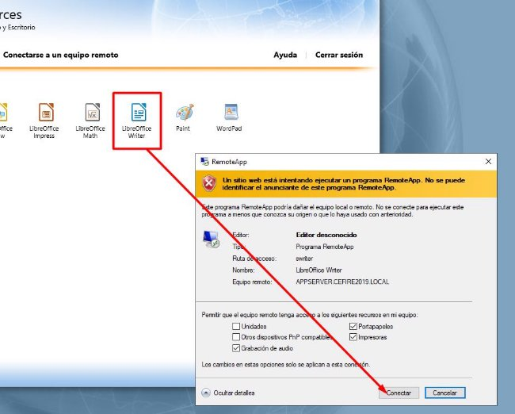
  <figcaption>Inicio aplicación Writer por RDWeb</figcaption>
</figure>

<figure>
  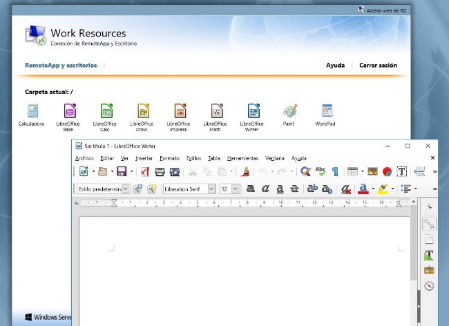
  <figcaption>Writer ejecutado por RDWeb</figcaption>
</figure>

- Realmente lo que está haciendo es ejecutar en un Remote Desktop la aplicación Writer de manera predeterminada. De hecho, si intentáis guardar el documento, veréis que realmente la aplicación se está ejecutando en el servidor APPSERVER. Si por ejemplo, guardamos el documento, veremos que la máquina realmente es el servidor APPSERVER. En este caso, podremos guardar los documentos en sus carpetas personales:

<figure>
  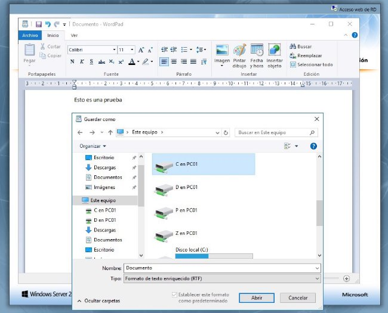
  <figcaption>Guardar un documento writer en RDWeb</figcaption>
</figure>

- Como vemos tenemos mapeadas las unidades de la máquina cliente en Remote Desktop.

## Organización de aplicaciones en RemoteApp

Hay veces que es interesante agrupar las aplicaciones en función de las características de las mismas o simplemente por el conjunto de usuarios que van a acceder. Para poder organizar las aplicaciones, seleccionaremos qué aplicaciones queremos que  se  agrupen  en  una  carpeta  y  añadiremos  el  nombre  de  la  carpeta  donde  se  encontrarán  las  aplicaciones. Seleccionaremos una aplicación y con el botón de la derecha del ratón haremos clic en editar propiedades:

<figure>
  
  <figcaption>Organización de las aplicaciones en RDWeb</figcaption>
</figure>

- Seleccionaremos la carpeta del programa de RemoteApp y escribiremos la carpeta donde queramos agruparla y así para todas las aplicaciones con una funcionalidad parecida, en nuestro caso, vamos a agrupar todas las aplicaciones de la suite de LibreOffice en una carpeta llamada Ofimática:

<figure>
  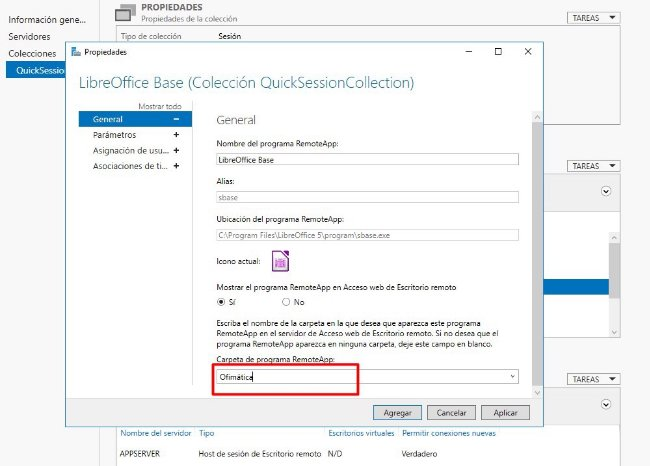
  <figcaption>Organización de las aplicaciones en RDWeb</figcaption>
</figure>

- Y ahora ya podemos iniciar sesión y comprobar que tenemos las aplicaciones agrupadas en una carpeta llamada Ofimática:

<figure>
  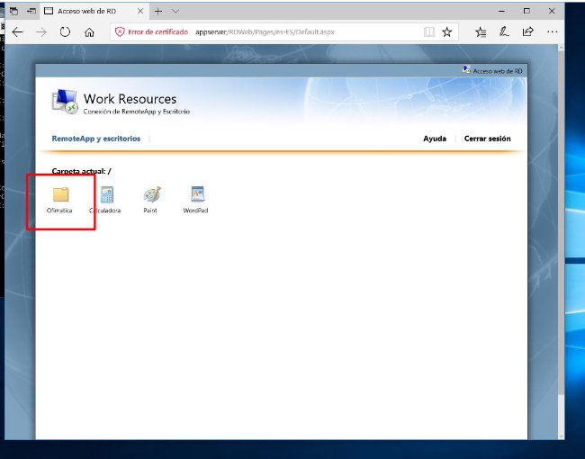
  <figcaption>Agrupación de aplicaciones en RemoteApp</figcaption>
</figure>

<figure>
  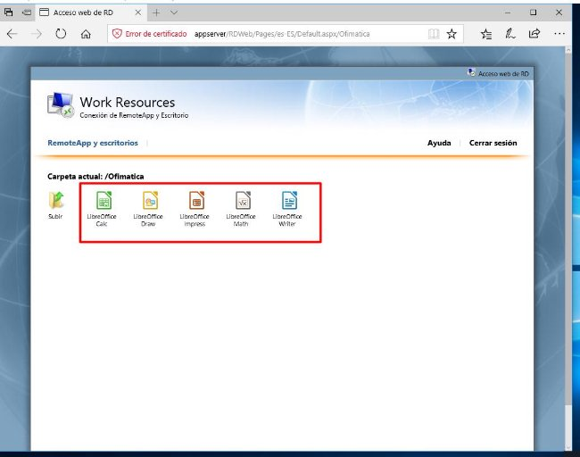
  <figcaption>Agrupación de aplicaciones en RemoteApp II</figcaption>
</figure>

## Asignación de usuarios a programas

Los programas en RemoteApp se pueden limitar para que solo usuarios o grupos puedan ver el icono para poder iniciar la aplicación. Para ello podemos configurar para cada programa publicado qué grupos o usuarios pueden acceder. Por ejemplo, vamos a definir para los programas Calculadora, Paint y WordPad que solo puedan acceder los del grupo Compras. Para ello seleccionaremos el programa publicado y entramos a las propiedades:

<figure>
  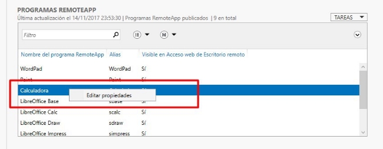
  <figcaption>Asignación de grupos a programas en RemoteApp</figcaption>
</figure>

<figure>
  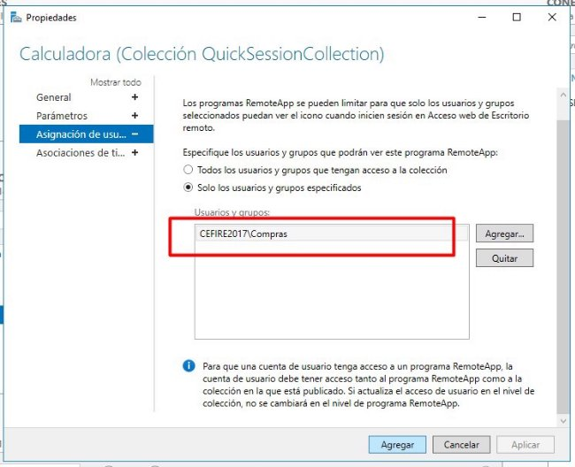
  <figcaption>Asignación de grupos a programas en RemoteApp II</figcaption>
</figure>

- Si ahora iniciamos sesión con un usuario que no sea del grupo de ventas, podremos ver como no aparecen los iconos de las aplicaciones. Por ejemplo, iniciamos sesión con un usuario del grupo Ventas:

<figure>
  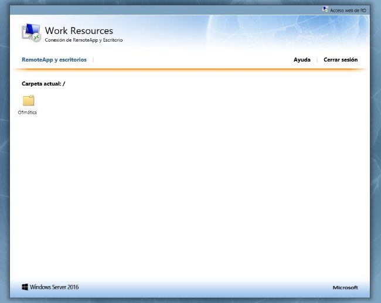
  <figcaption>Inicio de sesión usuario grupo Ventas</figcaption>
</figure>

**Actividades**

**Actividad 1**

En esta práctica vamos a configurar un servidor de aplicaciones que se hallará en el dominio, y al que accederán los clientes para ejecutar software como por ejemplo GIMP.

1. Añade un equipo servidor a tu red e instala y configura el servidor de terminales para utilizar RemoteApp.
1. Instala la aplicación [GIMP](http://www.gimp.org.es/descargar-gimp.html). 
1. Configura el acceso web para que los usuarios de nuestra Empresa puedan ejecutar dicha aplicación.
1. Inicia sesión en un par de clientes con dos usuarios del dominio diferentes y ejecuta simultáneamente la aplicación que acabas de instalar.

Entrega un documento pdf detallando el trabajo realizado únicamente en los pasos 3 y 4.

