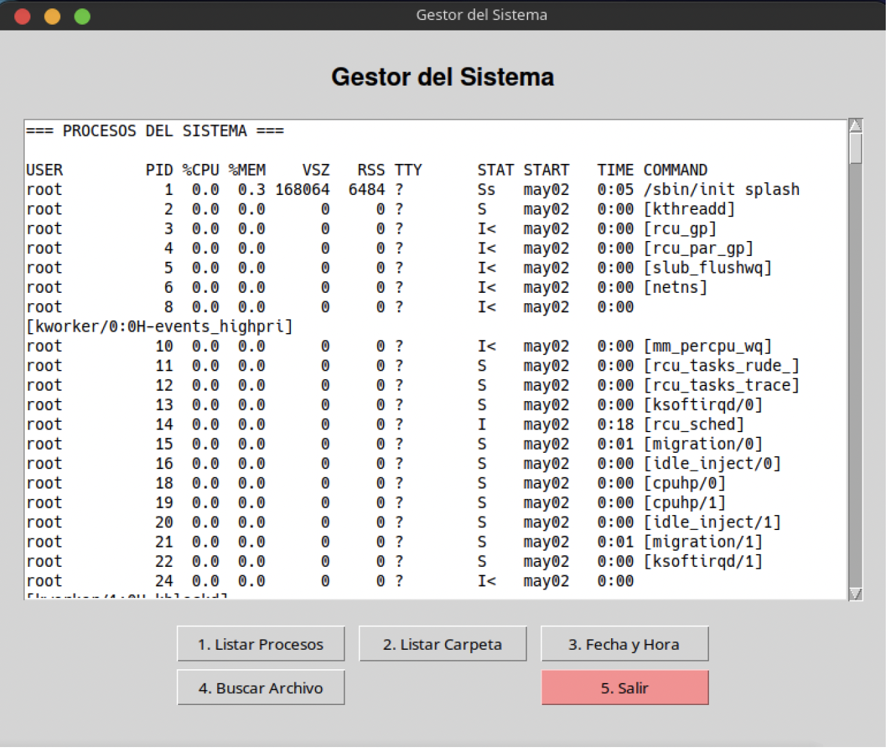

# RG602: Gestor de procesos con PowerShell (Python + tkinter)

- **Reto individual de depuración (RG602)**
- **Puntuación:** 30 puntos.
- **Criterios evaluados:** CE2d (gestión de procesos desde PowerShell), CE2g (herramienta de gestión y documentación).
- **Duración estimada:** 1–2 sesiones.
- **Entorno:** Windows con PowerShell (cmdlets: `Get-Process`, `Stop-Process`, `Start-Process`).

<figure>
  
  <figcaption>Interfaz gráfica del gestor de procesos.</figcaption>
</figure>

## Objetivos

Durante este reto depurarás un script en **Python** con **interfaz gráfica** (tkinter) que actúa como gestor de procesos usando **comandos PowerShell** (apartado 4 de la unidad). El programa contiene **errores introducidos a propósito**.

Al finalizar serás capaz de:

- Identificar líneas de código alteradas que provocan fallos funcionales.
- Argumentar por qué cada error produce un comportamiento incorrecto.
- Corregir el código para que todas las opciones del menú funcionen (listar procesos, top por CPU, finalizar por PID, iniciar proceso, servicios de Windows, salir).
- Entregar el script corregido y un documento de corrección con justificación.

## Requisitos previos

- **Python 3** con los módulos estándar: `tkinter`, `subprocess`.
- **Windows** con **PowerShell** instalado (habitual en Windows 10/11). Se puede usar `powershell.exe` o `pwsh.exe` (PowerShell Core).
- Si no tienes experiencia con Python, puedes apoyarte en la [Introducción a Python](IntroduccionPython.md).

!!! note "tkinter en Windows"
    Si falta tkinter, reinstalar Python marcando la opción "tcl/tk and IDLE" o instalar el paquete correspondiente.

---

## Parte 1: Comportamiento esperado del programa

El menú debe ofrecer las siguientes opciones; cada botón debe ejecutar la función que corresponde y mostrar el resultado en el área de texto.

| Opción | Descripción | Cmdlet(s) PowerShell utilizados |
|--------|-------------|---------------------------------|
| **1** | Listar procesos del sistema. | `Get-Process` |
| **2** | Top N procesos por uso de CPU. | `Get-Process \| Sort-Object CPU -Descending \| Select-Object -First N` |
| **3** | Finalizar un proceso por PID. | `Stop-Process -Id PID` |
| **4** | Iniciar un proceso (p. ej. notepad). | `Start-Process` |
| **5** | Listar servicios de Windows (equivalente al apartado 6 systemctl). | `Get-Service` |
| **6** | Salir. | — |

---

## Parte 2: Guía de ejecución (Python + PowerShell)

### Requisitos

- Python 3 con `tkinter` y `subprocess`.
- Windows con PowerShell (`powershell.exe` o `pwsh.exe` en PATH).

### Uso de subprocess para llamar a PowerShell

En Python se ejecutan comandos de PowerShell invocando el ejecutable y pasando el script con **-Command**:

```python
import subprocess

# Una sola línea de PowerShell
result = subprocess.run(
    ['powershell', '-NoProfile', '-Command', 'Get-Process'],
    capture_output=True,
    text=True,
    timeout=30
)
print(result.stdout)

# Varias líneas: usar ; dentro de la cadena
cmd = 'Get-Process | Sort-Object CPU -Descending | Select-Object -First 10 Id, ProcessName, CPU'
result = subprocess.run(
    ['powershell', '-NoProfile', '-Command', cmd],
    capture_output=True,
    text=True,
    timeout=30
)
```

- **-NoProfile**: arranca PowerShell sin cargar el perfil (más rápido).
- **-Command**: la cadena que sigue es el script a ejecutar.

### Cómo ejecutar el script

```powershell
# En Windows, desde PowerShell o CMD
python gestor_procesos_powershell.py
# o
py gestor_procesos_powershell.py
```

---

## Parte 3: Código con errores

A continuación se muestra el script con **numeración de línea** para facilitar la corrección. Hay varios errores que hacen que los botones no ejecuten la acción correcta o que el comando PowerShell sea erróneo.

```python
(1)  import subprocess
(2)  import tkinter as tk
(3)  from tkinter import messagebox, scrolledtext, simpledialog
(4)
(5)  PS_EXE = "powershell"
(6)
(7)  class GestorProcesosPowerShellApp:
(8)      def __init__(self, root):
(9)          self.root = root
(10)         self.root.title("Gestor de procesos (PowerShell)")
(11)         self.root.geometry("700x500")
(12)         self.create_widgets()
(13)
(14)     def create_widgets(self):
(15)         main_frame = tk.Frame(self.root, padx=20, pady=20)
(16)         main_frame.pack(fill=tk.BOTH, expand=True)
(17)         self.output_area = scrolledtext.ScrolledText(
(18)             main_frame, wrap=tk.WORD, width=70, height=18, font=("Consolas", 9)
(19)         )
(20)         self.output_area.pack(pady=10, fill=tk.BOTH, expand=True)
(21)         btn_frame = tk.Frame(main_frame)
(22)         btn_frame.pack(pady=5)
(23)
(24)         tk.Button(btn_frame, text="1. Listar procesos", command=self.top_cpu, width=18).grid(row=0, column=0, padx=3, pady=2)
(25)         tk.Button(btn_frame, text="2. Top 10 por CPU", command=self.listar_procesos, width=18).grid(row=0, column=1, padx=3, pady=2)
(26)         tk.Button(btn_frame, text="3. Finalizar proceso (PID)", command=self.iniciar_proceso, width=24).grid(row=0, column=2, padx=3, pady=2)
(27)         tk.Button(btn_frame, text="4. Iniciar proceso", command=self.finalizar_proceso, width=18).grid(row=1, column=0, padx=3, pady=2)
(28)         tk.Button(btn_frame, text="5. Servicios (Get-Service)", command=self.listar_procesos, width=24).grid(row=1, column=1, padx=3, pady=2)
(29)         tk.Button(btn_frame, text="6. Salir", command=self.root.quit, width=12, bg="#ff9999").grid(row=1, column=2, padx=3, pady=2)
(30)
(31)     def clear_output(self):
(32)         self.output_area.delete(1.0, tk.END)
(33)
(34)     def listar_servicios(self):
(35)         self.clear_output()
(36)         code, out, err = self.run_ps('Get-Service')
(37)         self.output_area.insert(tk.END, "=== SERVICIOS DE WINDOWS (Get-Service) ===\n\n")
(38)         if code == 0:
(39)             self.output_area.insert(tk.END, out)
(40)         else:
(41)             self.output_area.insert(tk.END, f"Error: {err}\n")
(42)
(43)     def run_ps(self, script):
(44)         try:
(45)             r = subprocess.run(
(46)                 [PS_EXE, '-NoProfile', '-Command', script],
(47)                 capture_output=True,
(48)                 text=True,
(49)                 timeout=30
(50)             )
(51)             return (r.returncode, r.stdout or "", r.stderr or "")
(52)         except subprocess.TimeoutExpired:
(53)             return (-1, "", "Timeout")
(54)         except Exception as e:
(55)             return (-1, "", str(e))
(56)
(57)     def listar_procesos(self):
(58)         self.clear_output()
(59)         code, out, err = self.run_ps('Get-Process')
(60)         self.output_area.insert(tk.END, "=== PROCESOS DEL SISTEMA ===\n\n")
(61)         if code == 0:
(62)             self.output_area.insert(tk.END, out)
(63)         else:
(64)             self.output_area.insert(tk.END, f"Error: {err}\n")
(65)
(66)     def top_cpu(self):
(67)         self.clear_output()
(68)         script = "Get-Process | Sort-Object CPU -Descending | Select-Object -First 5 Id, ProcessName, CPU"
(69)         code, out, err = self.run_ps(script)
(70)         self.output_area.insert(tk.END, "=== TOP 10 PROCESOS POR CPU ===\n\n")
(71)         if code == 0:
(72)             self.output_area.insert(tk.END, out)
(73)         else:
(74)             self.output_area.insert(tk.END, f"Error: {err}\n")
(75)
(76)     def finalizar_proceso(self):
(77)         pid_str = simpledialog.askstring("Finalizar proceso", "Introduce el PID del proceso a finalizar:")
(78)         if not pid_str or not pid_str.strip():
(79)             return
(80)         self.clear_output()
(81)         code, out, err = self.run_ps(f'Stop-Process -Id {pid_str.strip()} -Force')
(82)         self.output_area.insert(tk.END, f"=== FINALIZAR PROCESO (PID {pid_str.strip()}) ===\n\n")
(83)         if code == 0:
(84)             self.output_area.insert(tk.END, f"Proceso {pid_str.strip()} finalizado.\n")
(85)         else:
(86)             self.output_area.insert(tk.END, f"Error: {err}\n")
(87)
(88)     def iniciar_proceso(self):
(89)         nombre = simpledialog.askstring("Iniciar proceso", "Nombre del ejecutable (p. ej. notepad):")
(90)         if not nombre or not nombre.strip():
(91)             return
(92)         self.clear_output()
(93)         code, out, err = self.run_ps(f'Start-Process -Name "{nombre.strip()}"')
(94)         self.output_area.insert(tk.END, f"=== INICIAR PROCESO ({nombre.strip()}) ===\n\n")
(95)         if code == 0:
(96)             self.output_area.insert(tk.END, f"Proceso '{nombre.strip()}' iniciado.\n")
(97)         else:
(98)             self.output_area.insert(tk.END, f"Error: {err}\n")
(99)
(100) if __name__ == "__main__":
(101)     root = tk.Tk()
(102)     app = GestorProcesosPowerShellApp(root)
(103)     root.mainloop()
```

---

## Tu tarea

1. **Identificar** las líneas de código alteradas que producen los errores funcionales.
2. **Argumentar** por qué cada una provoca el fallo (qué hace mal y qué debería hacer).
3. **Entregar** el código corregido y un breve documento con la lista de líneas corregidas y la justificación.

---

## Entregables

1. **Código Python corregido**: un único fichero que ejecute en Windows con las seis opciones funcionando correctamente (incluida la de servicios con Get-Service).
2. **Documento de corrección** (Markdown o PDF) con: número de línea o fragmento erróneo, explicación del error y corrección aplicada.

## Criterios de evaluación

| Criterio | Puntos | Descripción |
|----------|--------|-------------|
| **Identificación de errores** | 8 | Se señalan correctamente todas las líneas o fragmentos con errores. |
| **Justificación** | 8 | Se argumenta por qué cada uno produce un fallo funcional. |
| **Código corregido** | 10 | El script ejecuta correctamente y todas las opciones del menú funcionan. |
| **Documento de corrección** | 4 | Documento ordenado, comprensible y con correcciones aplicadas. |
| **Total** | **30** | |

## Subapartados relacionados

- [06 Procesos del Sistema — 4. Gestión de procesos en PowerShell](06Procesos.md#4-gestion-de-procesos-en-powershell): `Get-Process`, `Stop-Process`, `Start-Process`.

## Referencia

- Documentación de la unidad: [06 Procesos del Sistema — Gestión en PowerShell](06Procesos.md#4-gestion-de-procesos-en-powershell).
