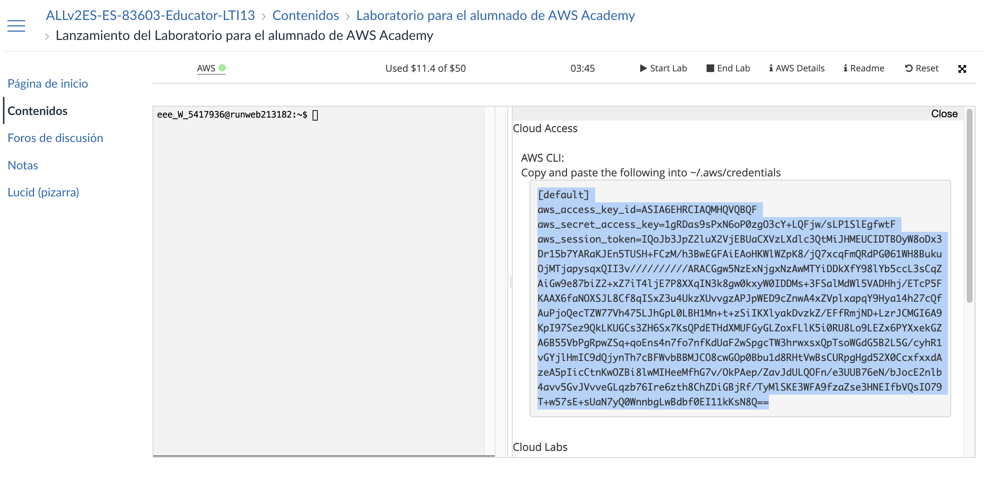

# RG701: Active Directory en AWS (TechCorp)

- **Modalidad:** Individual o en parejas (según criterio del profesor).
- **Duración estimada:** 1,5–2 horas (Fase 0 + Fase 1 + Fase 2).
- **Puntuación:** 30 puntos.
- **Criterios evaluados:** CE3d (despliegues repetibles), CE3e (automatización), CE3h (documentación).
- **Entorno:** Cuenta AWS (educativa o con créditos), Terraform instalado, AWS CLI configurado, cliente RDP.

El reto toma como **punto de partida** un repositorio de referencia con el proyecto resuelto (Terraform + scripts PowerShell). Tu tarea es **clonarlo, configurarlo, ejecutarlo y corregir los errores** que aparezcan al probarlo (región, AMI, variables, user_data, scripts, permisos, etc.). Al final debes tener un despliegue funcional y documentar qué fallos encontraste y cómo los resolviste.

## Objetivos

Al finalizar el reto serás capaz de:

- Usar un repositorio de IaC como punto de partida: clonar, revisar la estructura y configurar las variables necesarias.
- Ejecutar `terraform apply` sobre el proyecto y **detectar y corregir errores** que surjan durante el despliegue o la ejecución de los scripts (en Terraform, en el user_data o en los scripts PowerShell).
- Verificar que el entorno queda operativo (DC01 como DC, OUs, usuarios, Cliente unido al dominio) y documentar las correcciones realizadas.

## Requisitos previos

- **Cuenta AWS Academy:** utilizarás tu cuenta de **AWS Academy** (laboratorio del módulo). Será necesario configurar las credenciales en tu equipo con **`aws configure`** usando las credenciales de acceso (Access Key ID y Secret Access Key) que te proporciona el laboratorio. Para saber cómo obtenerlas y configurarlas, consulta los **vídeos de la teoría** de la unidad (Automatización y monitorización) y la documentación del laboratorio.
- **Terraform** ≥ 1.0 (`terraform version`) instalado en tu máquina.
- **Par de claves** en EC2: crea un par de claves en la consola de EC2 (dentro de tu laboratorio AWS Academy) para poder obtener la contraseña de RDP de las instancias Windows.
- Conocimiento básico de **Active Directory** y de **Windows Server** (RDP). Conocimiento básico de Terraform y PowerShell ayuda a localizar y corregir errores.
- **Par de claves** en EC2 para poder obtener la contraseña de RDP de las instancias Windows.

!!! tip "¿Cómo instalar AWS CLI en Visual Studio Code o Cursor?"
    - **Instalación de AWS CLI en Visual Studio Code o Cursor:**  
      Tanto Visual Studio Code como Cursor son editores que permiten utilizar un terminal integrado, desde el cual 
      puedes instalar AWS CLI fácilmente.  
      1. Abre una terminal integrada desde VS Code o Cursor (`Ctrl + ñ` en Windows o `Ctrl + Shift + \`` en Mac/
      Linux).
      2. Ejecuta el comando de instalación según tu sistema operativo, por ejemplo en Windows:
         ```powershell
         msiexec.exe /i https://awscli.amazonaws.com/AWSCLIV2.msi
         ```
         o en Mac/Linux:
         ```bash
         curl "https://awscli.amazonaws.com/AWSCLIV2.pkg" -o "AWSCLIV2.pkg"
         sudo installer -pkg AWSCLIV2.pkg -target /
         ```
         o siguiendo la [guía oficial de instalación](https://docs.aws.amazon.com/cli/latest/userguide/
         getting-started-install.html).
      3. Verifica la instalación con:
         ```bash
         aws --version
         ```
      Ambos editores (VS Code y Cursor) soportan la operación de AWS CLI desde su terminal integrada, facilitando 
      la gestión de recursos en AWS desde el entorno de desarrollo.

!!! tip "Configurar AWS CLI con credenciales de AWS Academy"
    Para usar el código del reto con tu laboratorio de **AWS Academy**:
    1. En el portal de AWS Academy, inicia tu laboratorio y accede a **Credenciales de AWS** (o **AWS Details** / **Show** para ver la Access Key y la Secret Key).
    2. En tu equipo, abre una terminal (por ejemplo en VS Code o Cursor con `Ctrl + ñ` o `Ctrl + \``) y ejecuta:
       ```bash
       aws configure
       ```
    3. Introduce cuando se te pida: **AWS Access Key ID** y **AWS Secret Access Key** (las del laboratorio), **region** (p. ej. `us-east-1` o la que indique el laboratorio) y opcionalmente el formato de salida (puedes dejar por defecto).
    4. Comprueba que la configuración es correcta con:
       ```bash
       aws sts get-caller-identity
       ```
    Para más detalle sobre la instalación de AWS CLI o la obtención de credenciales, consulta los **vídeos de la teoría** de la unidad 7 (Automatización y monitorización) y la [guía oficial de AWS CLI](https://docs.aws.amazon.com/cli/latest/userguide/getting-started-install.html).


---

## Enfoque: infraestructura como código + configuración con scripts

La infraestructura se define en Terraform (carpeta **`terraform/`**) y la configuración interna (AD, OUs, usuarios, unión al dominio, recursos compartidos, GPO) se ejecuta mediante scripts PowerShell (carpeta **`scripts/`**) orquestados por Terraform. Necesitas ambas carpetas según la estructura indicada.

| Capa | Herramienta | Qué automatiza |
|------|-------------|-----------------|
| **Infraestructura** | Terraform | VPC, subred, Security Group, opciones de DHCP (dominio + DNS), instancias EC2 (DC01 y Cliente). Todo lo que es "recursos en AWS". |
| **Configuración interna** | Scripts PowerShell | Nombre del equipo, instalación del rol AD DS, promoción a controlador de dominio, usuario admin del dominio, OUs y usuarios desde CSV (20 usuarios TechCorp), grupos por departamento, unión del cliente al dominio, habilitar RDP para Domain Users, recursos compartidos y carpetas personales, GPO (contraseñas y bloqueo). Todo lo que ocurre *dentro* del sistema operativo. |

Con este reparto, un único flujo (por ejemplo `terraform apply` + ejecución de scripts en orden o vía user_data) puede dejar el entorno completo listo sin pasos manuales en consola.

### Estructura general del proyecto

El [repositorio de referencia](https://github.com/fjavier-hernandez/techcorp-ad-iac) sigue esta estructura. En la raíz del repo aparece la carpeta **`techcorp-ad-iac/`**; dentro tienes **`terraform/`** y **`scripts/`**. En `terraform/` encontrarás además las plantillas **`userdata_dc01.ps1.tpl`** y **`userdata_cliente.ps1.tpl`** que inyectan los scripts en el user_data de cada instancia.

```text
techcorp-ad-iac/
├── terraform/                 # Infraestructura como código
│   ├── provider.tf
│   ├── main.tf                 # VPC, subnet, SG, dhcp options, EC2
│   ├── variables.tf
│   ├── outputs.tf
│   ├── terraform.tfvars.example
│   ├── userdata_dc01.ps1.tpl   # User data DC01 (01 + programación 02-05)
│   └── userdata_cliente.ps1.tpl
├── scripts/                    # Configuración interna (PowerShell)
│   ├── dc01/                   # Scripts que se ejecutan en el DC01 (orden 01 → 05)
│   │   ├── 01-rename-and-ad.ps1      # Nombre del equipo, AD DS, promover a DC
│   │   ├── 02-admin-user.ps1         # Usuario administrador del dominio (admin.dominio)
│   │   ├── 03-CrearEstructuraAD.ps1  # OUs TechCorp, 20 usuarios desde CSV, grupos por depto
│   │   ├── 04-RecursosCompartidos.ps1 # Carpetas compartidas, carpetas personales (X:)
│   │   ├── 05-GPO.ps1                # GPO: contraseñas (vigencia, historial, longitud) y bloqueo
│   │   └── techcorp_usuarios.csv     # Datos de los 20 usuarios (alineado al reto grupal)
│   └── cliente/                # Scripts que se ejecutan en el Cliente
│       └── 01-join-domain.ps1         # Unir al dominio; en DC01: habilitar RDP para Domain Users
└── README.md                   # Orden de ejecución y requisitos
```

#### **Carpeta `terraform/`:**  
  Contenidos principales definidos en modo lista:

  - VPC (Virtual Private Cloud)
  - Subred pública
  - Security Group con reglas para:  
    - RDP (puerto 3389)  
    - **Puertos de Active Directory:** `53`, `88`, `135`, `389`, `445`, `636`, `3268`, `3269`, `49152-65535`
  - Opciones de DHCP:
    - Nombre de dominio (ejemplo: `techcorp.local`)
    - Servidor DNS: IP privada del DC01
  - Instancias EC2:
    - DC01
    - Cliente
  - Outputs típicos:
    - IP pública y privada del DC01
    - IP del Cliente
    - ID de la VPC

#### **Carpeta `scripts/`:**  
  Scripts PowerShell para la configuración del entorno Windows, organizados así:

  - **En DC01** (orden de ejecución 01 → 05):
    1. Nombre del equipo, instalación del rol AD DS y promoción a controlador de dominio (DC)
    2. Creación del usuario administrador del dominio
    3. Creación de OUs por departamento (Gerencia, IT, Administración, Comercial, RRHH), 20 usuarios desde CSV y grupos
    4. Configuración de recursos compartidos (TechCorp_Users, TechCorp_Datos) y carpetas personales
    5. Configuración de GPO de contraseñas y bloqueo (pueden usar el módulo GroupPolicy de PowerShell: `New-GPO`, enlaces, etc.)
    6. (Opcional) Automatización para habilitar RDP a Domain Users en DC01
  - **En el Cliente:**
    - Script para unir el equipo al dominio

### Ejecución de los scripts desde Terraform

Se puede integrar en Terraform que los scripts se ejecuten **en el servidor (DC01) o en el cliente** cuando se lanza `terraform apply`, de modo que un único flujo cree la infraestructura y aplique la configuración en cada host.

| Enfoque | Cómo funciona | Dónde se ejecutan los scripts |
|--------|----------------|--------------------------------|
| **User data** | Cada instancia EC2 recibe en `user_data` un bloque PowerShell (o la ruta a un script en S3). Se ejecuta al **primer arranque**. En DC01 puede incluir el 01 (nombre + AD + reinicio) y un "launcher" que, tras el reinicio, ejecute 02 → 05 (p. ej. tarea programada al inicio). En el Cliente, `user_data` con el script de unión al dominio. | En la propia instancia (DC01 o Cliente) al arrancar. |
| **SSM Run Command** | Las instancias llevan un rol IAM que permite **Systems Manager**. Tras crearlas, Terraform usa un `null_resource` + `local-exec` (o un recurso que invoque `aws ssm send-command`) para enviar la ejecución de los scripts a cada instancia en el orden correcto: primero 02 → 05 en DC01 (cuando el DC esté listo), luego el script de unión en el Cliente. Los scripts pueden estar en S3 o copiarse antes. | En DC01 y en el Cliente, orquestado por Terraform tras el `apply`. |
| **Provisioner `remote-exec`** (WinRM) | Terraform se conecta por **WinRM** a las instancias Windows y ejecuta comandos (p. ej. descargar y ejecutar los scripts). Requiere WinRM configurado (puerto 5986 HTTPS), por ejemplo mediante un `user_data` mínimo en el primer arranque. Con `depends_on` y varios `null_resource` se puede ordenar: primero scripts en DC01, luego en el Cliente. | En la instancia a la que se conecta cada provisioner (DC01 o Cliente). |

!!! note
    De forma general, a cada **`aws_instance`** se le asigna el mecanismo elegido (`user_data`, SSM o remote-exec). Al ejecutar **`terraform apply`**, la infraestructura se crea y los scripts se lanzan en cada máquina sin pasos manuales.

**Flujo típico:**

1. Terraform crea:

   - Red (VPC)
   - Opciones de DHCP
   - Security Groups
   - Instancias EC2
   - (Si usas `user_data`, cada máquina ejecuta su script al arrancar automáticamente)
2. En DC01:

   - Se ejecutan los scripts en el siguiente orden: 01 → 05
   - (Si aplica, reinicio tras el script 01: nombre y promoción a AD)
3. En el Cliente:

   - Se ejecuta el script para unir el equipo al dominio
   - (Este paso debe realizarse después de que DC01 esté completamente listo, especialmente si usas SSM o remote-exec)


!!! note "Notas adicionales"
    La implementación concreta (qué recurso Terraform y qué mecanismo exacto se utiliza —p. ej. `aws_vpc_dhcp_options`, `user_data`, `null_resource` con SSM— y el contenido de los scripts PowerShell) se adapta según las necesidades del reto. Con ello, `terraform apply` realiza toda la configuración en el orden adecuado, en servidor y cliente, sin intervención manual.

**Fases del reto:**

- **Fase 0:** Obtener el código de partida desde el repositorio de referencia (clone o descarga), revisar la estructura y configurar las variables.
- **Fase 1:** Ejecutar el despliegue (`terraform init`, `plan`, `apply`), identificar errores que surjan al probar y corregirlos (Terraform, user_data, scripts, región, AMI, etc.).
- **Fase 2:** Verificar el resultado una vez corregidos los errores (DC01 como DC, OUs, usuarios, Cliente unido al dominio).

---

## Fase 0 — Repositorio de partida (15–20 min)

### Objetivo

Tener instalados y configurados **AWS CLI** y **Terraform** en tu equipo, obtener el proyecto de referencia como punto de partida, revisar su estructura (terraform/ + scripts/) y configurar las variables necesarias para tu cuenta AWS Academy y tu región.

### Pasos

#### 1. Instalar AWS CLI

Instala la AWS CLI en tu sistema según tu sistema operativo. Consulta los **vídeos de la teoría** de la unidad y la [guía oficial de instalación](https://docs.aws.amazon.com/cli/latest/userguide/getting-started-install.html). Ejemplos rápidos:

- **Windows:** descarga el instalador MSI desde la documentación de AWS o ejecuta (PowerShell como administrador):  
  `msiexec.exe /i https://awscli.amazonaws.com/AWSCLIV2.msi`
- **macOS:**  
  `curl "https://awscli.amazonaws.com/AWSCLIV2.pkg" -o "AWSCLIV2.pkg"` y luego `sudo installer -pkg AWSCLIV2.pkg -target /`
- **Linux (Debian/Ubuntu):**  
  `sudo apt install awscli` o sigue la guía oficial.

Comprueba con: `aws --version`.

#### 2. Configurar AWS CLI con credenciales de AWS Academy

Las credenciales del laboratorio son **temporales** e incluyen un **session token**. El comando `aws configure` no pide el session token, por lo que hay que escribir las credenciales en el archivo `~/.aws/credentials` (o copiar el bloque que da el laboratorio). Sigue estos subpasos:

**2.1 — Obtener las credenciales en AWS Academy**

- En el portal de **AWS Academy**, inicia tu laboratorio (**Start Lab**).
- Pulsa **AWS Details** (o **Cloud Access**) en el panel del laboratorio.
- Se abrirá una ventana con el título **AWS CLI** y la instrucción de copiar el contenido en `~/.aws/credentials`. Verás un bloque con:
  - `[default]`
  - `aws_access_key_id=...`
  - `aws_secret_access_key=...`
  - `aws_session_token=...` (cadena larga)
- Copia **todo** ese bloque (las cuatro líneas).



*Ejemplo de cómo copiar el bloque de credenciales desde el laboratorio de AWS Academy para pegar en `~/.aws/credentials`.*

**2.2 — Escribir las credenciales en tu equipo**

- En tu máquina (macOS, Linux o Git Bash/WSL en Windows), abre el archivo de credenciales:
  ```bash
  nano ~/.aws/credentials
  ```
  (Si no existe la carpeta `~/.aws`, créala antes: `mkdir -p ~/.aws`.)
- Pega el bloque que copiaste del laboratorio, de modo que quede algo así:
  ```ini
  [default]
  aws_access_key_id=ASIA...
  aws_secret_access_key=...
  aws_session_token=IQoJb3JpZ2lu...
  ```
- Guarda y cierra (en nano: `Ctrl+O`, Enter, `Ctrl+X`).

**2.3 — Configurar región y formato de salida**

- Crea o edita el archivo de configuración:
  ```bash
  nano ~/.aws/config
  ```
- Asegúrate de que tenga una sección `[default]` con la **región correcta** de tu laboratorio. Por ejemplo (la región debe ser una válida de AWS, como `us-east-1`, `us-west-2` o `eu-west-1`; no uses `eu-east-1`, que no existe):
  ```ini
  [default]
  region = us-east-1
  output = json
  ```
- Guarda y cierra.

**2.4 — Comprobar que la configuración funciona**

- En la terminal ejecuta:
  ```bash
  aws sts get-caller-identity
  ```
- Si la configuración es correcta, verás un JSON con `UserId`, `Account` y `Arn`. Si aparece un error de conexión al endpoint, revisa que la **región** en `~/.aws/config` sea la que indica tu laboratorio (p. ej. `us-east-1`).

#### 3. Instalar Terraform

Instala Terraform en tu equipo según tu sistema operativo. Consulta los **vídeos de la teoría** de la unidad. Algunas opciones:

- **Windows:** descarga el binario desde [terraform.io](https://www.terraform.io/downloads) o con Chocolatey: `choco install terraform`.
- **macOS:** con Homebrew: `brew install terraform`.
- **Linux:** descarga el binario o usa el repositorio de HashiCorp (ver documentación oficial). En Amazon Linux 2023 puedes usar:  
  `sudo yum install -y yum-utils && sudo yum-config-manager --add-repo https://rpm.releases.hashicorp.com/AmazonLinux/hashicorp.repo && sudo yum -y install terraform`

Comprueba con: `terraform version`.

#### 4. Clonar o descargar el repositorio

Repositorio de partida: **[https://github.com/fjavier-hernandez/techcorp-ad-iac](https://github.com/fjavier-hernandez/techcorp-ad-iac)** (Terraform + scripts PowerShell, user_data para DC01 y Cliente). Para una **guía detallada de todos los archivos del repositorio**, con explicación de sus comandos y por qué se utilizan, consulta [Contenido del repositorio TechCorp AD IaC](ContenidoRepositorioTechCorp.md).

```bash
git clone https://github.com/fjavier-hernandez/techcorp-ad-iac.git
cd techcorp-ad-iac
```

Si no usas Git, descarga el ZIP desde GitHub y descomprímelo.

#### 5. Revisar la estructura del repositorio

Asegúrate de que el repositorio descargado tiene la siguiente estructura:

```
techcorp-ad-iac/
├── terraform/
│   ├── provider.tf
│   ├── main.tf
│   ├── variables.tf
│   ├── outputs.tf
│   ├── terraform.tfvars.example
│   ├── userdata_dc01.ps1.tpl
│   └── userdata_cliente.ps1.tpl
└── scripts/
    ├── dc01/
    │   ├── 01-xxxx.ps1
    │   ├── 02-xxxx.ps1
    │   ├── 03-xxxx.ps1
    │   ├── 04-xxxx.ps1
    │   ├── 05-xxxx.ps1
    │   └── techcorp_usuarios.csv
    └── cliente/
        └── 01-join-domain.ps1
```

!!! note "Nota"
    - Los nombres de scripts pueden variar ligeramente, pero deberían existir los archivos principales y plantillas indicadas arriba.
    - Lee el **README** del repositorio para comprender el uso de variables, los pasos de despliegue y el funcionamiento de los scripts.

#### 6. Key Pair en AWS Academy para Terraform

Para que Terraform pueda lanzar las instancias EC2 necesitas un par de claves registrado en EC2. En AWS Academy el PEM que descargas desde *AWS Details* **no** está registrado como key pair en EC2, por lo que hay que importarlo. Sigue estos subpasos:

!!! warning "Cada vez que abras un laboratorio"
    Hay que repetir este paso **cada vez que inicies un nuevo laboratorio** (o que el entorno se reinicie). Cada sesión de lab tiene su propio PEM y su propia cuenta; los key pairs que importes no se conservan entre sesiones. Tras **Start Lab**, descarga de nuevo el PEM, extrae la clave pública, importa el key pair en EC2 y actualiza `key_name` en `terraform.tfvars` si cambiaste el nombre.

**6.1 — Abrir AWS Academy y acceder al laboratorio**

- Accede a tu laboratorio de AWS Academy.
- Pulsa **Start Lab**.
- En la consola del laboratorio, asegúrate de estar en la región correcta (por ejemplo, `us-east-1`).

**6.2 — Obtener el PEM desde AWS Details**

- Pulsa **AWS Details** en el panel derecho.
- Busca la sección **SSH Key**.
- Haz clic en **Download PEM**.
- Guarda el archivo `.pem` en tu máquina (por ejemplo `academy-temp.pem`).

!!! warning "PEM de AWS Academy"
    Este PEM no está registrado como key pair en EC2, por eso Terraform no lo reconoce directamente. Hay que importar la clave pública en EC2 (pasos siguientes).

**6.3 — Extraer la clave pública desde el PEM**

En tu máquina local (Linux/macOS) abre una terminal y ejecuta:

```bash
ssh-keygen -y -f academy-temp.pem > academy-temp.pub
```

(En Windows puedes usar Git Bash o WSL.) Esto genera un archivo `.pub` con la clave pública que EC2 puede usar.

**6.4 — Crear un key pair en EC2 usando la clave pública**

- Ve a **EC2 → Key Pairs** en la consola de AWS Academy.
- Pulsa **Import Key Pair**.
- Pon un nombre para el key pair (por ejemplo: `academy-key`).
- En **Public Key** pega el **contenido completo** del archivo `academy-temp.pub`.
- Pulsa **Import**.

Ahora tienes un key pair registrado en EC2 que Terraform puede usar.

**6.5 — Usar el nombre del key pair en Terraform**

En tu archivo `terraform.tfvars` (ver paso 7) deberás poner:

```hcl
key_name = "academy-key"
```

El valor debe coincidir exactamente con el nombre que le diste al key pair en el paso anterior. Guarda el archivo `.pem` original: lo necesitarás para obtener la contraseña de RDP de las instancias Windows (EC2 → Conectar → Obtener contraseña de Windows).

#### 7. Configurar variables necesarias

**7.1 — Copiar el archivo de ejemplo**

```bash
cp terraform/terraform.tfvars.example terraform/terraform.tfvars
```

**7.2 — Editar `terraform/terraform.tfvars`**

Completa las siguientes variables obligatorias:

- **`key_name`**: Nombre del key pair que creaste en EC2 (por ejemplo `academy-key`). Debe existir en tu cuenta y tu región.
- **`safe_mode_password`**: Contraseña de DSRM (recuperación del modo seguro de Active Directory).
- **`domain_admin_password`**: Contraseña del usuario administrador del dominio (`admin.dominio`).
- **`aws_region`** *(opcional)*: Cambia solo si no usas la región por defecto (por ejemplo, `eu-west-1`). Debe coincidir con la región donde esté tu laboratorio (p. ej. `us-east-1`).

!!! warning "Importante"
    Nunca subas el archivo `terraform.tfvars` a repositorios públicos si contiene contraseñas o información sensible.


### Entregable de la fase

- **AWS CLI** y **Terraform** instalados y configurados.
    - Verifica AWS CLI con credenciales de AWS Academy ejecutando:<br>
      <code>aws sts get-caller-identity</code>
- Repositorio clonado o descargado, estructura revisada.
- Archivo <code>terraform.tfvars</code> completado con:
    - <code>key_name</code>
    - <code>safe_mode_password</code>
    - <code>domain_admin_password</code>
    - <code>aws_region</code> *(si aplica)*

---

## Fase 1 — Despliegue e instalación automática (45 min)

### Objetivo

Ejecutar `terraform init`, `terraform plan` y `terraform apply` sobre el proyecto obtenido en la Fase 0. **Identificar y corregir los errores** que aparezcan (por ejemplo: región distinta, AMI no disponible en tu región, variables sin definir, fallos en el user_data o en los scripts PowerShell, permisos IAM, timeouts). Repetir hasta lograr un despliegue completo y que los scripts se ejecuten en DC01 y en el Cliente. Comprobar los outputs y la conectividad por RDP.

### Pasos

1. **Ejecutar Terraform**  
   Desde la carpeta **`terraform/`** del repositorio (o `techcorp-ad-iac/terraform` si clonaste el repo con esa estructura):
   ```bash
   cd techcorp-ad-iac/terraform   # o cd terraform según dónde esté tu terraform.tfvars
   terraform init
   terraform plan
   terraform apply
   ```
   Revisa el plan antes de confirmar con `yes`.

2. **Identificar errores y corregirlos**  
   Si `plan` o `apply` fallan, anota el mensaje de error (por ejemplo: AMI no encontrada, variable no definida, error de sintaxis en el user_data). Ajusta el código según tu entorno:
   
   - **Región:** si usas otra región, verifica que la AMI de Windows Server exista allí y actualiza `aws_region` o el `provider`.
   - **AMI:** el repositorio puede usar una AMI por defecto; si no es válida en tu región, define en `variables.tf`/`terraform.tfvars` una AMI de Windows Server 2019/2022 para tu región.
   - **Variables:** asegúrate de que `key_name`, `safe_mode_password` y `domain_admin_password` están en `terraform.tfvars` y que el par de claves existe en EC2.
   - **User_data / scripts:** si los scripts fallan al ejecutarse (por ejemplo en la consola de EC2 o en los logs), revisa las plantillas `userdata_dc01.ps1.tpl` y `userdata_cliente.ps1.tpl` y los scripts en `scripts/dc01/` y `scripts/cliente/`; corrige rutas, codificación o parámetros si es necesario.
   Vuelve a ejecutar `terraform apply` (o solo `apply` si ya inicializaste) tras cada corrección.

3. **Anotar outputs y conectar por RDP**  
   Cuando el despliegue termine sin errores de Terraform, ejecuta `terraform output` y anota la IP pública de DC01 y la del Cliente. Conéctate por RDP a ambas instancias (usuario `Administrator`; la contraseña se obtiene con la clave `.pem` en EC2 → Conectar → Obtener contraseña de Windows). Comprueba que las máquinas responden. Ten en cuenta que los scripts pueden tardar varios minutos (en DC01: 01 reinicia, luego 02–05; en el Cliente: espera al DC y luego une al dominio).

### Entregable de la fase

- Despliegue completado con `terraform apply` sin errores (o con errores corregidos). **Documentación breve de los errores encontrados y de las correcciones aplicadas** (archivo, variable o script modificado y por qué). Captura o anotación de los outputs y comprobación de RDP.

---

## Fase 2 — Verificación del despliegue automático (45 min)

### Objetivo

Una vez que el despliegue de la Fase 1 se complete sin errores (o con los errores ya corregidos), **verificar** que el resultado es correcto: DC01 actúa como controlador de dominio, existen las OUs y los usuarios (según el CSV), el Cliente está unido al dominio y, si el código del repositorio lo incluye, los recursos compartidos y las GPO están aplicados. Solo verificación; no hay pasos de configuración manual.

### Pasos

1. **Esperar a que terminen los scripts**  
   El repositorio de referencia usa **user_data**: en DC01 se ejecuta primero el equivalente a `01-rename-and-ad.ps1` (nombre, AD DS, promoción a DC, reinicio) y tras el reinicio una tarea programada ejecuta en orden 02 → 05. En el Cliente, el user_data espera a que el DC responda (LDAP) y luego ejecuta `01-join-domain.ps1`. Pueden pasar **varios minutos** (15–30 o más) hasta que todo esté listo. Revisa el estado en la consola EC2 o espera antes de verificar.

2. **Comprobar DC01**  
   Conéctate por RDP a DC01 y ejecuta en PowerShell (como Administrador):

   ```powershell
   # Nombre del equipo
   $env:COMPUTERNAME

   # Rol AD DS instalado
   Get-WindowsFeature -Name AD-Domain-Services | Select-Object Name, InstallState

   # Dominio y que este equipo es DC
   Get-ADDomain | Select-Object Name, DNSRoot
   Get-ADDomainController -Filter * | Select-Object Name, Domain
   ```

   Debe mostrarse el nombre DC01, el rol instalado y el dominio (p. ej. `techcorp.local`).

3. **Comprobar OUs y usuarios**  
   En DC01, en PowerShell:

   ```powershell
   Import-Module ActiveDirectory
   $domainDN = (Get-ADDomain).DistinguishedName
   $baseOU = "OU=TechCorp,$domainDN"

   # OUs bajo TechCorp (Gerencia, IT, Administracion, Comercial, RRHH)
   Get-ADOrganizationalUnit -Filter * -SearchBase $baseOU -SearchScope OneLevel | Select-Object Name

   # Número de usuarios en la estructura TechCorp
   (Get-ADUser -Filter * -SearchBase $baseOU -SearchScope Subtree).Count

   # Grupos por departamento
   Get-ADGroup -Filter * -SearchBase $baseOU | Select-Object Name
   ```

   Comprueba que hay 5 OUs, 20 usuarios (o los que tenga tu CSV) y los grupos (p. ej. Gerencia_Usuarios, IT_Usuarios, etc.).

4. **Comprobar recursos compartidos y GPO (si aplica)**  
   El [repositorio de referencia](https://github.com/fjavier-hernandez/techcorp-ad-iac) incluye `04-RecursosCompartidos.ps1` y `05-GPO.ps1`. En DC01, en PowerShell:

   ```powershell
   # Carpetas compartidas (TechCorp_Users, TechCorp_Datos)
   Get-SmbShare | Where-Object { $_.Name -like "TechCorp*" } | Select-Object Name, Path

   # GPO vinculadas al dominio (para comprobar que existen directivas)
   Get-GPO -All | Select-Object DisplayName, GpoStatus
   ```

   Verifica que existen las rutas compartidas y las GPO; las de contraseñas y bloqueo suelen estar en la directiva por defecto del dominio o en GPO creadas por el script.

5. **Comprobar el Cliente**  
   Conéctate por RDP al Cliente y ejecuta en PowerShell:

   ```powershell
   # Sufijo DNS y servidor DNS (debe ser la IP privada del DC01)
   Get-DnsClient | Select-Object ConnectionSpecificSuffix, ServerAddresses

   # Equipo unido al dominio
   (Get-WmiObject Win32_ComputerSystem).Domain
   ```

   Debe mostrarse el sufijo del dominio (p. ej. `techcorp.local`) y el dominio `techcorp.local`. Después inicia sesión con un usuario del dominio (p. ej. del CSV) y comprueba que la unidad X: (carpeta personal) está disponible: `Get-PSDrive -Name X`.

### Entregable de la fase

- Capturas o descripción breve que acrediten: DC01 como controlador de dominio, OUs y usuarios creados, Cliente unido al dominio y, si aplica, recursos compartidos y GPO. Inicio de sesión en el Cliente con un usuario del dominio.

---

## Entregables globales

1. **Código del proyecto** partiendo del [repositorio de referencia](https://github.com/fjavier-hernandez/techcorp-ad-iac): copia o fork del repo con las **correcciones** que hayas aplicado (terraform/ y scripts/). Si prefieres no publicar el código, entrega un documento que describa qué archivos o variables modificaste y con qué valor o contenido (sin incluir contraseñas en claro).
2. **Documentación de errores y correcciones:** lista o tabla con los **errores** que aparecieron al ejecutar `terraform plan` / `terraform apply` o al revisar los scripts (por ejemplo: AMI no encontrada, variable faltante, fallo en user_data), y la **solución** aplicada en cada caso (archivo modificado, cambio realizado). Es el principal entregable para acreditar que has probado el código y corregido los fallos.
3. **README o documento** con: requisitos, pasos para clonar/configurar (Fase 0), ejecutar init/plan/apply (Fase 1), verificación (Fase 2), cómo acceder por RDP y cómo destruir los recursos (`terraform destroy`). Puedes basarte en el README del repositorio de referencia y ampliarlo con tus notas.
4. **Resumen o capturas** de la Fase 0 (repositorio clonado, variables configuradas), Fase 1 (apply exitoso o errores corregidos, outputs) y Fase 2 (verificación: DC01, OUs, usuarios, Cliente unido al dominio, inicio de sesión con usuario del dominio).

Al finalizar el reto puedes mantener el entorno para realizar el [RG702 — Monitorización y auditoría](RetoPracticoTechCorp2.md) o ejecutar **`terraform destroy`** para eliminar los recursos y no dejar costes activos en AWS.

## Criterios de evaluación (30 puntos)

| Criterio | Puntos | Descripción |
|----------|--------|-------------|
| **Fase 0 — Repositorio de partida** | 5 | Repositorio clonado o descargado; estructura revisada; `terraform.tfvars` configurado (key_name, contraseñas, región si aplica); par de claves EC2 creado si era necesario. |
| **Fase 1 — Despliegue y corrección de errores** | 12 | `terraform apply` ejecutado; errores identificados y documentados; correcciones aplicadas (Terraform, variables, user_data o scripts) hasta lograr despliegue completo; outputs y RDP verificados. |
| **Fase 2 — Verificación** | 8 | Verificación correcta: DC01 como DC, OUs y usuarios desde CSV, Cliente unido al dominio; recursos compartidos y GPO si aplica; inicio de sesión en el Cliente con usuario del dominio. |
| **Documentación** | 5 | Documentación de errores y correcciones; README o documento con pasos (Fase 0, 1, 2), variables y acceso RDP (CE3h, CE3e). |
| **Total** | **30** | |

## Siguiente reto

- [RG702 — Monitorización y auditoría (TechCorp)](RetoPracticoTechCorp2.md): alarmas CloudWatch, CloudTrail y opcionalmente EventBridge (30 puntos).

## Referencia

- **Repositorio de partida (reto resuelto):** [techcorp-ad-iac](https://github.com/fjavier-hernandez/techcorp-ad-iac) — Despliegue con Terraform en AWS de una arquitectura mínima para Active Directory (TechCorp).
- **Estructura y enfoque del proyecto:** apartado «Proyecto TechCorp» en [07 Automatización y monitorización](07AutomatizacionMonitorizacion.md).
- **Prácticas relacionadas:** [PracticaActiveDirectoryAWS](PracticaActiveDirectoryAWS.md) (DHCP, promoción a DC), [RetoGrupalActiveDirectory](RetoGrupalActiveDirectory.md) (OUs, 20 usuarios, CSV, recursos compartidos, GPO).
- [Terraform AWS Provider](https://registry.terraform.io/providers/hashicorp/aws/latest/docs).
