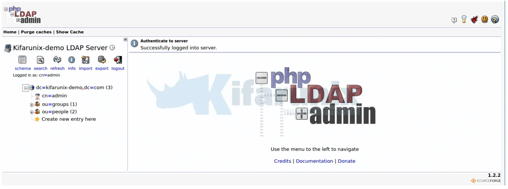
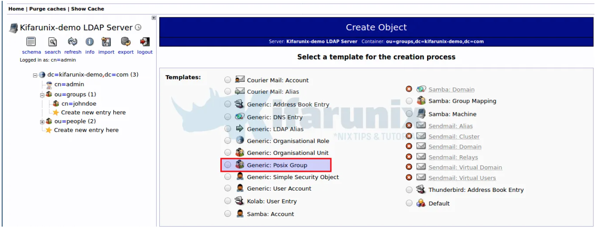
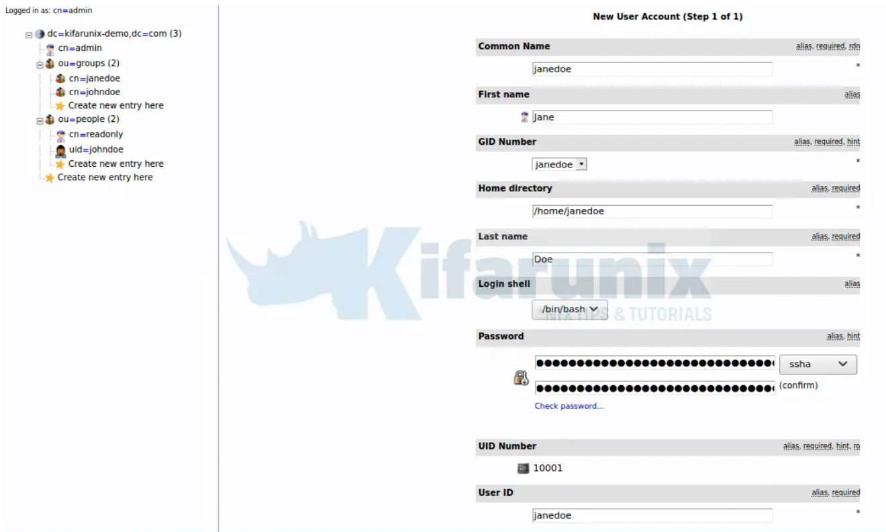

Cómo instalar phpLDAPadmin 
---------------------------

En primer lugar se necesita instalar Apache:

``` yaml
sudo apt-get install apache2
```

Ahora podemos instalar la herramienta de administración basada en web con el comando: 

``` yaml
sudo apt-get install phpldapadmin -y
```

Abra el archivo de configuración phpLDAPadmin con el comando: 

``` yaml
sudo nano /etc/phpldapadmin/config.php
```

Edite las siguientes líneas (asegúrese de cambiar el dominio para que coincida con el suyo y la dirección IP para que coincida con su servidor de alojamiento): 

``` yaml
$servers->setValue('server','name','My LDAP Server');
$servers->setValue('server','host','192.168.5.X');
$servers->;setValue('server','base',array('dc=pandora,dc=ldap'));
$servers->setValue('login','auth_type','session');
$servers->setValue('login','bind_id','cn=admin,dc=pandora,dc=ldap');
$servers->setValue('auto_number','min',array('uidNumber'=>10000,'gidNumber'=>10000));
```

Deshabilite el sitio predeterminado de Apache con el comando: 

``` yaml
sudo a2dissite 000-default.conf
```

Reinicie Apache con el comando: 

``` yaml
sudo systemctl restart apache2
```

Cómo acceder a phpLDAPadmin 
----------------------------

Con todo resuelto, abra un navegador web y apúntelo a *http: // SERVIDOR / phpldapadmin* (donde SERVER es la dirección IP de su servidor de alojamiento). Su nombre de usuario predeterminado (en el formulario *cn = admin, dc = pandora, dc = ldap*) se completará automáticamente. 

Escriba la contraseña de administrador que creó y haga clic en Autenticar. Debería encontrarse en la página principal de phpLDAPadmin, listo para trabajar:


Para la advertencia, simplemente puede reemplazar las llaves ( ) con corchetes ( ) en la línea afectada, 1614.\
*`Deprecated: Array and string offset access syntax with curly braces is deprecated in /usr/share/phpldapadmin/lib/functions.php on line 1614`*`{}``[]`

Haga clic en iniciar sesión para iniciar sesión en su interfaz de usuario web phpLDAPadmin. Como ya definimos el DN de enlace de administrador, simplemente ingrese la contraseña e inicie sesión;


Tras la autenticación exitosa, se accede en el panel de phpLDAPadmin.



Ahora puede administrar su servidor LDAP con una interfaz web.

### Crear usuario y grupo LDAP en phpLDAPadmin

Como ejemplo, aprenderemos cómo crear un usuario LDAP y su grupo usando phpLDAPadmin.

#### Crear grupo posixGroup

Para crear un grupo dentro de otro Haga clic en `ou=grupos`. Luego haga clic en `Create new entry here`{opción 1} o haga clic en `Create a child entry`{opción 2}.


A continuación, haga clic en la `Generic: Posix Group`plantilla para crear un grupo de usuarios LDAP.



Ingrese el nombre del grupo, que en este caso lo configuramos para que sea el mismo que el uid del usuario que vamos a crear.

Si desea que otros usuarios formen parte del grupo, seleccione sus nombres de usuario. Haga clic `Create Object `una vez hecho y confirme los cambios.


#### Crear usuario posixAccount

Una vez que haya creado un grupo de usuarios, proceda a crear la cuenta de usuario. Haga clic en `ou=grupos`y de manera similar, tiene dos opciones, hacer clic `Create new entry here`o hacer clic `Create a child entry`.

Seleccione la `Generic: User Account`plantilla para crear el objeto de usuario.

Generar hash de contraseña de usuario;

``` yaml
slappasswd

Nueva contraseña: contraseña Vuelva a ingresar la nueva contraseña: contraseña
{SSHA} vrJOf + / AFD9pdGKo / azGavDfbZ8OGJX1
```

Si necesita verificar si la contraseña coincide con el hash pegado, haga clic en **verificar contraseña**.

Cuando establezca la contraseña, seleccione **ssha** y pegue el hash anterior como contraseña.

Complete los detalles del usuario de manera apropiada como se muestra en la captura de pantalla a continuación;



Una vez hecho esto, haga clic `Create Object ` y confirme los cambios.


Tenga en cuenta que para poder tener bash entre las opciones de shell, edite la plantilla de creación posixAccount y agregue la opción bash ejecutando el comando;

``` yaml
sed -i '/<value id="\/bin\/tsh">\/bin\/tsh<\/value>/a \\t<value id="/bin/bash">\/bin\/bash<\/value>' /etc/phpldapadmin/templates/creation/posixAccount.xml
```

!!! Note
    * Si tiene la información del usuario en un archivo LDIF, puede importar este archivo haciendo clic en importar en la barra de menú superior del panel izquierdo.
    * Para confirmar la creación del usuario en el backend del servidor OpenLDAP puede utilizar el comnado `ldapsearch`